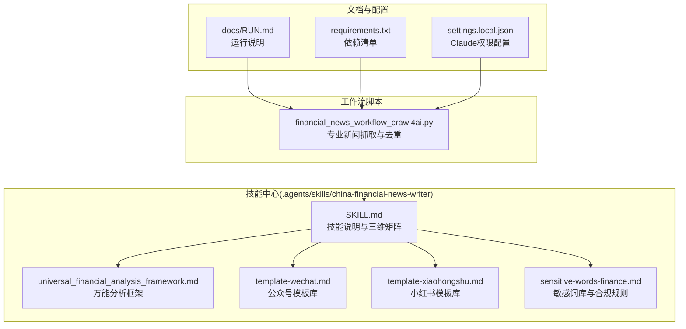
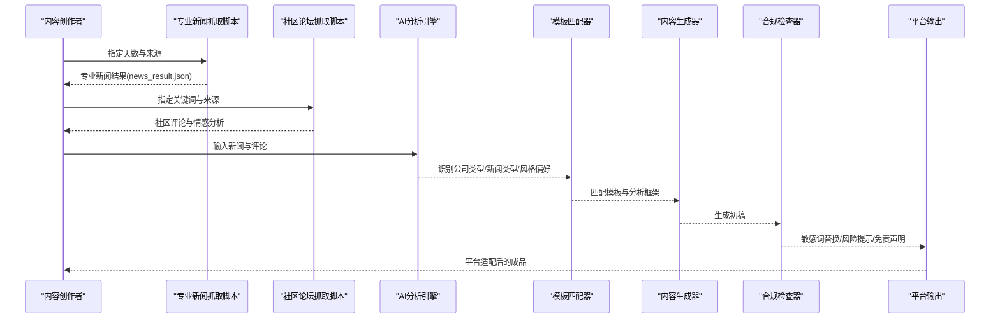
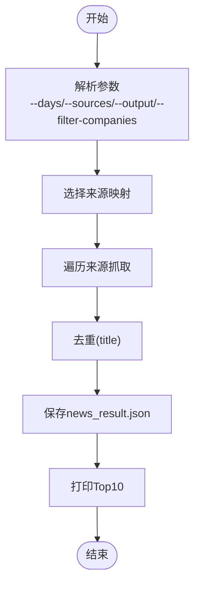
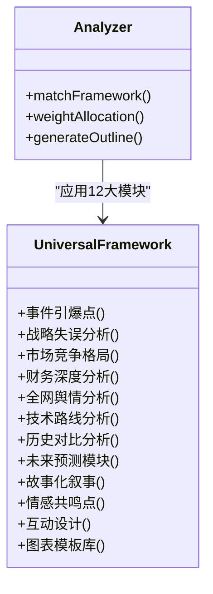
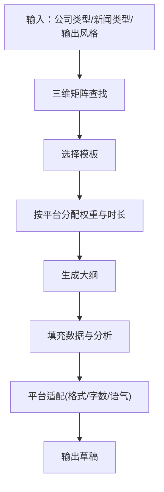
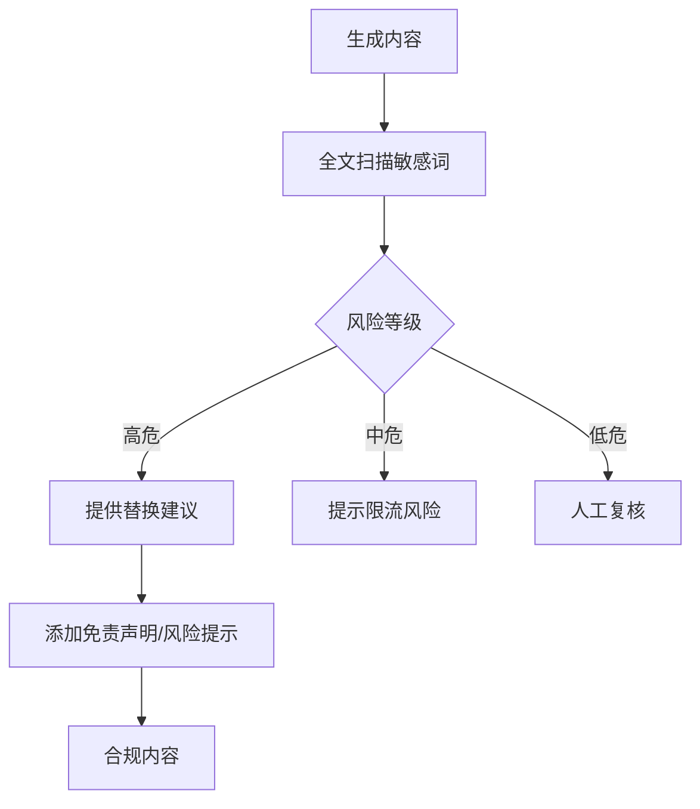
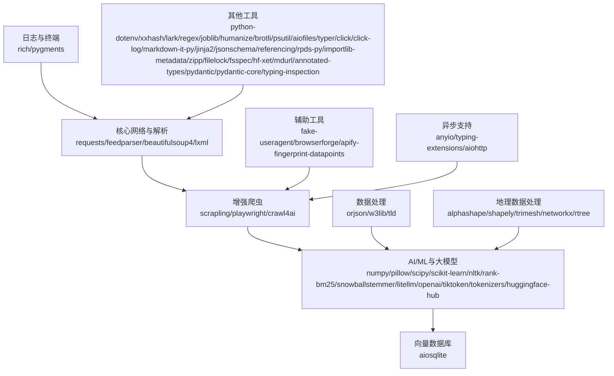

# AI内容生成系统

<cite>
**本文引用的文件**
- [SKILL.md](file://.agents/skills/china-financial-news-writer/SKILL.md)
- [universal_financial_analysis_framework.md](file://.agents/skills/china-financial-news-writer/references/universal_financial_analysis_framework.md)
- [template-wechat.md](file://.agents/skills/china-financial-news-writer/references/template-wechat.md)
- [template-xiaohongshu.md](file://.agents/skills/china-financial-news-writer/references/template-xiaohongshu.md)
- [sensitive-words-finance.md](file://.agents/skills/china-financial-news-writer/references/sensitive-words-finance.md)
- [financial_news_workflow_crawl4ai.py](file://financial_news_workflow_crawl4ai.py)
- [requirements.txt](file://requirements.txt)
- [RUN.md](file://docs/RUN.md)
- [settings.local.json](file://.claude/settings.local.json)
</cite>

## 目录
1. [简介](#简介)
2. [项目结构](#项目结构)
3. [核心组件](#核心组件)
4. [架构总览](#架构总览)
5. [详细组件分析](#详细组件分析)
6. [依赖分析](#依赖分析)
7. [性能考量](#性能考量)
8. [故障排查指南](#故障排查指南)
9. [结论](#结论)
10. [附录](#附录)

## 简介
本系统是一个面向中国金融新闻的AI自动写作与情报采集体系，围绕“中国金融新闻自动写作技能”构建，具备：
- 万能分析框架：覆盖企业危机事件的12大分析模块，支持多平台适配
- 模板匹配机制：按公司类型×新闻类型×输出风格的三维矩阵自动匹配模板
- 情感分析与舆情采集：结合专业媒体与社区论坛，形成全网情报网
- 合规检查与敏感词过滤：内置金融敏感词库与替换策略，满足平台合规要求
- 多平台适配：微信公众号、小红书等平台的内容格式与互动设计

系统通过“专业新闻抓取 + 社区舆情抓取 + AI分析 + 模板生成 + 合规检查”的闭环工作流，为内容创作者提供可复制、可定制、可扩展的自动化生产方案。

## 项目结构
仓库采用“技能中心 + 工作流脚本 + 文档 + 配置”的分层组织：
- 技能中心：.agents/skills/china-financial-news-writer，包含技能说明、分析框架、模板库、敏感词库等
- 工作流脚本：financial_news_workflow_crawl4ai.py 等，负责新闻抓取与输出
- 文档：docs/RUN.md 提供运行说明与示例
- 配置：requirements.txt、.claude/settings.local.json 等

**图表来源**
- [.agents/skills/china-financial-news-writer/SKILL.md:1-476](file://.agents/skills/china-financial-news-writer/SKILL.md#L1-L476)
- [.agents/skills/china-financial-news-writer/references/universal_financial_analysis_framework.md:1-126](file://.agents/skills/china-financial-news-writer/references/universal_financial_analysis_framework.md#L1-L126)
- [.agents/skills/china-financial-news-writer/references/template-wechat.md:1-518](file://.agents/skills/china-financial-news-writer/references/template-wechat.md#L1-L518)
- [.agents/skills/china-financial-news-writer/references/template-xiaohongshu.md:1-424](file://.agents/skills/china-financial-news-writer/references/template-xiaohongshu.md#L1-L424)
- [.agents/skills/china-financial-news-writer/references/sensitive-words-finance.md:1-317](file://.agents/skills/china-financial-news-writer/references/sensitive-words-finance.md#L1-L317)
- [financial_news_workflow_crawl4ai.py:1-454](file://financial_news_workflow_crawl4ai.py#L1-L454)
- [docs/RUN.md:1-252](file://docs/RUN.md#L1-L252)
- [requirements.txt:1-144](file://requirements.txt#L1-L144)
- [.claude/settings.local.json:1-51](file://.claude/settings.local.json#L1-L51)

**章节来源**
- [docs/RUN.md:1-252](file://docs/RUN.md#L1-L252)
- [requirements.txt:1-144](file://requirements.txt#L1-L144)

## 核心组件
- 三维分类矩阵：公司类型（科技巨头/新能源车企/消费品牌/金融券商）、新闻类型（财报分析/产品发布/行业动态/政策影响）、输出风格（小红书/公众号/研报简报/深度报告）
- 万能分析框架：12大模块（事件引爆点、战略失误分析、市场竞争格局、财务深度分析、全网舆情分析、技术路线分析、历史对比分析、未来预测模块、故事化叙事、情感共鸣点、互动设计、图表模板库）
- 模板库：按风格与新闻类型提供结构化模板，配套标题公式、段落节奏、配图建议、互动引导
- 情感分析与舆情采集：专业媒体RSS/API/动态抓取 + 社区论坛评论抓取与情感分析
- 合规检查：敏感词扫描、替换建议、风险提示与免责声明
- 多平台适配：针对微信公众号、小红书等平台的格式、字数、语气、互动设计进行适配

**章节来源**
- [.agents/skills/china-financial-news-writer/SKILL.md:24-52](file://.agents/skills/china-financial-news-writer/SKILL.md#L24-L52)
- [.agents/skills/china-financial-news-writer/references/universal_financial_analysis_framework.md:1-126](file://.agents/skills/china-financial-news-writer/references/universal_financial_analysis_framework.md#L1-L126)
- [.agents/skills/china-financial-news-writer/references/template-wechat.md:1-518](file://.agents/skills/china-financial-news-writer/references/template-wechat.md#L1-L518)
- [.agents/skills/china-financial-news-writer/references/template-xiaohongshu.md:1-424](file://.agents/skills/china-financial-news-writer/references/template-xiaohongshu.md#L1-L424)
- [.agents/skills/china-financial-news-writer/references/sensitive-words-finance.md:1-317](file://.agents/skills/china-financial-news-writer/references/sensitive-words-finance.md#L1-L317)

## 架构总览
系统采用“数据采集 → 分析与匹配 → 内容生成 → 合规检查 → 平台适配 → 输出”的流水线架构：

**图表来源**
- [financial_news_workflow_crawl4ai.py:405-454](file://financial_news_workflow_crawl4ai.py#L405-L454)
- [.agents/skills/china-financial-news-writer/SKILL.md:55-287](file://.agents/skills/china-financial-news-writer/SKILL.md#L55-L287)
- [.agents/skills/china-financial-news-writer/references/sensitive-words-finance.md:270-317](file://.agents/skills/china-financial-news-writer/references/sensitive-words-finance.md#L270-L317)

## 详细组件分析

### 专业新闻抓取工作流
- 支持7大权威媒体：虎嗅网、36氪、钛媒体、界面新闻、极客公园、晚点LatePost、澎湃新闻
- 抓取方式：RSS解析、API调用、requests解析、Playwright动态渲染
- 输出：news_result.json（含去重后的新闻列表、来源统计、抓取时间戳）

**图表来源**
- [financial_news_workflow_crawl4ai.py:405-454](file://financial_news_workflow_crawl4ai.py#L405-L454)

**章节来源**
- [financial_news_workflow_crawl4ai.py:94-359](file://financial_news_workflow_crawl4ai.py#L94-L359)
- [docs/RUN.md:50-84](file://docs/RUN.md#L50-L84)

### AI分析引擎与万能分析框架
- 12大模块覆盖事件、战略、竞争、财务、舆情、技术、历史、预测、叙事、情感、互动、图表
- 按平台特性分配权重与时长，如B站视频、小红书、公众号、深度报告
- 与模板库联动，将分析结果转化为可读性强的结构化内容

**图表来源**
- [.agents/skills/china-financial-news-writer/references/universal_financial_analysis_framework.md:1-126](file://.agents/skills/china-financial-news-writer/references/universal_financial_analysis_framework.md#L1-L126)
- [.agents/skills/china-financial-news-writer/SKILL.md:55-71](file://.agents/skills/china-financial-news-writer/SKILL.md#L55-L71)

**章节来源**
- [.agents/skills/china-financial-news-writer/references/universal_financial_analysis_framework.md:1-126](file://.agents/skills/china-financial-news-writer/references/universal_financial_analysis_framework.md#L1-L126)
- [.agents/skills/china-financial-news-writer/SKILL.md:55-71](file://.agents/skills/china-financial-news-writer/SKILL.md#L55-L71)

### 模板匹配机制与多平台适配
- 三维矩阵：公司类型 × 新闻类型 × 输出风格 → 自动匹配模板
- 小红书：短句、emoji、标签、互动引导；公众号：专业语气、配图、数据表格
- 模板包含标题公式、导语、结构化小节、风险提示、免责声明

**图表来源**
- [.agents/skills/china-financial-news-writer/SKILL.md:24-52](file://.agents/skills/china-financial-news-writer/SKILL.md#L24-L52)
- [.agents/skills/china-financial-news-writer/references/template-wechat.md:1-518](file://.agents/skills/china-financial-news-writer/references/template-wechat.md#L1-L518)
- [.agents/skills/china-financial-news-writer/references/template-xiaohongshu.md:1-424](file://.agents/skills/china-financial-news-writer/references/template-xiaohongshu.md#L1-L424)

**章节来源**
- [.agents/skills/china-financial-news-writer/SKILL.md:291-354](file://.agents/skills/china-financial-news-writer/SKILL.md#L291-L354)
- [.agents/skills/china-financial-news-writer/references/template-wechat.md:1-518](file://.agents/skills/china-financial-news-writer/references/template-wechat.md#L1-L518)
- [.agents/skills/china-financial-news-writer/references/template-xiaohongshu.md:1-424](file://.agents/skills/china-financial-news-writer/references/template-xiaohongshu.md#L1-L424)

### 合规检查与敏感词过滤
- 高危词：承诺收益、荐股、内幕消息等
- 中危词：强烈推荐、100%、稳赚等
- 低危词：借贷、理财产品、期货外汇等可能触发延迟审核
- 提供安全替换词与合规表述建议，输出合规检查报告

**图表来源**
- [.agents/skills/china-financial-news-writer/references/sensitive-words-finance.md:270-317](file://.agents/skills/china-financial-news-writer/references/sensitive-words-finance.md#L270-L317)

**章节来源**
- [.agents/skills/china-financial-news-writer/references/sensitive-words-finance.md:1-317](file://.agents/skills/china-financial-news-writer/references/sensitive-words-finance.md#L1-L317)

### 情感分析与社区舆情采集
- 社区论坛抓取：雪球、知乎等，支持关键词搜索与情感分析
- 输出：comments_关键词.json，包含情感分布（positive/neutral/negative）
- 与专业新闻抓取结合，形成全网情报网，支撑深度分析

**章节来源**
- [docs/RUN.md:85-112](file://docs/RUN.md#L85-L112)

## 依赖分析
系统依赖分为核心网络与解析、增强爬虫、数据处理、辅助工具、Crawl4AI专用、日志与终端、其他工具等类别，涵盖requests、feedparser、BeautifulSoup、Playwright、Scrapling、Crawl4AI、向量化与大模型调用等。

**图表来源**
- [requirements.txt:1-144](file://requirements.txt#L1-L144)

**章节来源**
- [requirements.txt:1-144](file://requirements.txt#L1-L144)

## 性能考量
- 抓取并发与稳定性：合理设置--days与--sources，避免同时抓取过多来源；定期清理输出目录
- 浏览器自动化：Playwright需提前安装Chromium；遇到反爬可结合Scrapling与指纹数据
- 数据去重与清洗：抓取后按标题去重，使用w3lib等清洗工具提升数据质量
- 异步与缓存：利用aiohttp/anyio提升IO性能，必要时引入缓存策略减少重复抓取

[本节为通用性能建议，无需特定文件引用]

## 故障排查指南
- 抓取失败：检查网络连通性与目标站点可用性；缩小--sources范围；查看命令行错误信息
- Playwright浏览器启动失败：确保已执行npx playwright install chromium；以管理员权限运行
- 依赖安装失败：升级pip；使用--only-binary :all:安装；检查网络状况
- 日志与调试：脚本输出详细日志；查看news_result.json与comments_关键词.json定位问题

**章节来源**
- [docs/RUN.md:144-189](file://docs/RUN.md#L144-L189)

## 结论
本系统通过“专业新闻抓取 + 社区舆情采集 + 万能分析框架 + 模板匹配 + 合规检查”的闭环，实现了中国金融新闻的自动化生产。其三维分类矩阵与12大分析模块确保内容的系统性与深度，模板库与多平台适配保障了可读性与传播力，敏感词库与合规流程有效降低了法律与平台风险。内容创作者可据此快速生成高质量、合规、适配多平台的金融内容。

[本节为总结性内容，无需特定文件引用]

## 附录

### 使用示例与配置指南
- 运行专业新闻抓取：指定--days与--sources，支持固定输出目录--fixed-output
- 运行社区论坛抓取：指定--keyword与--sources，输出comments_关键词.json
- Claude权限配置：settings.local.json中允许相关Bash与WebFetch权限

**章节来源**
- [docs/RUN.md:50-112](file://docs/RUN.md#L50-L112)
- [.claude/settings.local.json:1-51](file://.claude/settings.local.json#L1-L51)

### 自定义模板与生成策略
- 在模板库中新增或调整小红书/公众号模板，遵循标题公式、段落节奏、配图建议与互动设计
- 通过SKILL.md的三维矩阵调整权重与时长分配，适配不同平台的阅读习惯与传播特性
- 结合敏感词库进行合规校验，确保内容符合平台规则与监管要求

**章节来源**
- [.agents/skills/china-financial-news-writer/SKILL.md:291-354](file://.agents/skills/china-financial-news-writer/SKILL.md#L291-L354)
- [.agents/skills/china-financial-news-writer/references/template-wechat.md:1-518](file://.agents/skills/china-financial-news-writer/references/template-wechat.md#L1-L518)
- [.agents/skills/china-financial-news-writer/references/template-xiaohongshu.md:1-424](file://.agents/skills/china-financial-news-writer/references/template-xiaohongshu.md#L1-L424)
- [.agents/skills/china-financial-news-writer/references/sensitive-words-finance.md:270-317](file://.agents/skills/china-financial-news-writer/references/sensitive-words-finance.md#L270-L317)