# 万能分析框架

<cite>
**本文档引用的文件**
- [financial_news_workflow_crawl4ai.py](file://financial_news_workflow_crawl4ai.py)
- [test_all_sources.py](file://test_all_sources.py)
- [test_crawl4ai.py](file://test_crawl4ai.py)
- [requirements.txt](file://requirements.txt)
- [.claude/settings.local.json](file://.claude/settings.local.json)
- [RUN.md](file://docs/RUN.md)
- [universal_financial_analysis_framework.md](file://.agents/skills/china-financial-news-writer/references/universal_financial_analysis_framework.md)
- [deep-research.md](file://.agents/skills/china-financial-news-writer/references/deep-research.md)
- [company-profiles.md](file://.agents/skills/china-financial-news-writer/references/company-profiles.md)
- [ev-maker.md](file://.agents/skills/china-financial-news-writer/subskills/ev-maker.md)
- [tech-giant.md](file://.agents/skills/china-financial-news-writer/subskills/tech-giant.md)
- [news_result.json](file://news_output_crawl4ai_20260324_102649/news_result.json)
- [prompt.txt](file://news_output_crawl4ai_20260324_102649/prompt.txt)
</cite>

## 目录
1. [简介](#简介)
2. [项目结构](#项目结构)
3. [核心组件](#核心组件)
4. [架构概览](#架构概览)
5. [详细组件分析](#详细组件分析)
6. [依赖关系分析](#依赖关系分析)
7. [性能考虑](#性能考虑)
8. [故障排除指南](#故障排除指南)
9. [结论](#结论)
10. [附录](#附录)

## 简介

万能分析框架是一个综合性金融新闻分析系统，旨在为投资者、分析师和内容创作者提供全方位的企业和行业分析能力。该框架基于深度学习技术和大数据分析，能够处理不同类型的企业和行业分析，包括公司概况分析、财务指标解读、市场趋势判断等核心功能。

### 核心设计理念

框架采用"三维分类矩阵"的设计理念，将分析维度分为三个层次：
- **公司类型**：科技巨头、新能源车企、消费品牌、金融券商
- **新闻类型**：财报分析、产品发布、行业动态、政策影响  
- **输出风格**：小红书、公众号、研报简报、深度报告

### 架构原理

框架采用模块化设计，通过12大分析模块覆盖财经分析的所有维度，适用于任何公司危机事件。核心模块包括事件引爆点、战略失误分析、市场竞争格局、财务深度分析、全网舆情分析、技术路线分析、历史对比分析、未来预测模块、故事化叙事、情感共鸣点、互动设计和可视化建议。

## 项目结构

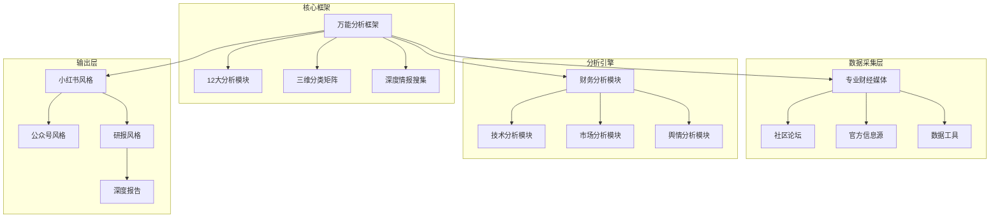

**图表来源**
- [universal_financial_analysis_framework.md:1-126](file://.agents/skills/china-financial-news-writer/references/universal_financial_analysis_framework.md#L1-L126)
- [RUN.md:3-252](file://docs/RUN.md#L1-L252)

**章节来源**
- [RUN.md:3-252](file://docs/RUN.md#L1-L252)

## 核心组件

### 1. 万能分析框架

框架的核心是12大分析模块，每个模块都有明确的分析维度和权重分配：

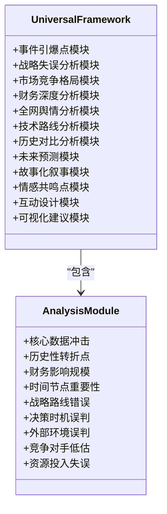

**图表来源**
- [universal_financial_analysis_framework.md:1-126](file://.agents/skills/china-financial-news-writer/references/universal_financial_analysis_framework.md#L1-L126)

### 2. 三维分类矩阵

框架采用三层分类体系，确保分析的针对性和有效性：

| 维度 | 类型 | 代表公司 | 核心关注点 |
|------|------|----------|------------|
| 公司类型 | 科技巨头 | 腾讯、阿里、字节 | 用户增长、变现效率、新业务 |
| 公司类型 | 新能源车企 | 比亚迪、蔚来、小鹏 | 销量、交付量、毛利率 |
| 公司类型 | 消费品牌 | 安踏、李宁、珀莱雅 | 同店增长、渠道扩张、品牌力 |
| 公司类型 | 金融券商 | 中信、中金、华泰 | AUM、交易量、投行业务 |
| 新闻类型 | 财报分析 | - | Beat/Miss分析、指引解读 |
| 新闻类型 | 产品发布 | - | 产品力评估、市场空间 |
| 新闻类型 | 行业动态 | - | 产业链影响、受益标的 |
| 新闻类型 | 政策影响 | - | 政策意图、受益/受损方 |
| 输出风格 | 小红书 | - | 500-800字、1-3张图表 |
| 输出风格 | 公众号 | - | 1500-2500字、3-5张图表 |
| 输出风格 | 研报简报 | - | 3000-5000字、8-12张图表 |
| 输出风格 | 深度报告 | - | 5000-8000字、10-15张图表 |

**章节来源**
- [universal_financial_analysis_framework.md:24-52](file://.agents/skills/china-financial-news-writer/references/universal_financial_analysis_framework.md#L24-L52)

### 3. 深度情报搜集系统

框架包含6维情报网，确保分析的全面性和准确性：

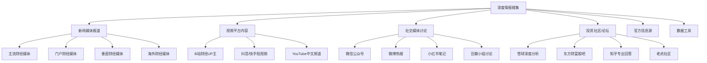

**图表来源**
- [deep-research.md:15-397](file://.agents/skills/china-financial-news-writer/references/deep-research.md#L15-L397)

**章节来源**
- [deep-research.md:15-397](file://.agents/skills/china-financial-news-writer/references/deep-research.md#L15-L397)

## 架构概览

### 整体架构设计

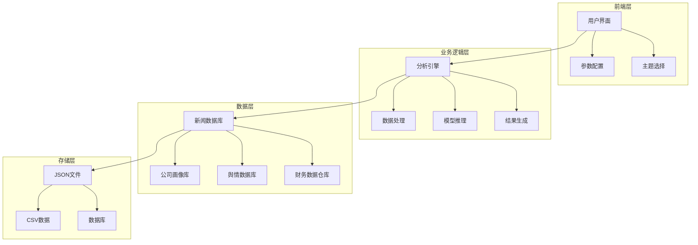

**图表来源**
- [financial_news_workflow_crawl4ai.py:1-454](file://financial_news_workflow_crawl4ai.py#L1-L454)
- [company-profiles.md:1-499](file://.agents/skills/china-financial-news-writer/references/company-profiles.md#L1-L499)

### 数据流架构

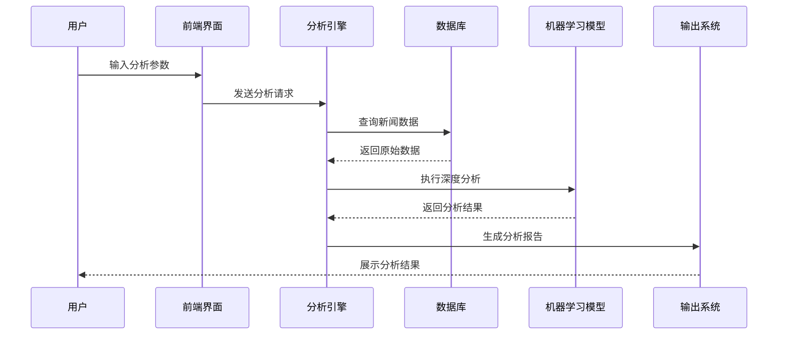

**图表来源**
- [financial_news_workflow_crawl4ai.py:405-454](file://financial_news_workflow_crawl4ai.py#L405-L454)

## 详细组件分析

### 1. 新闻采集系统

#### 专业财经媒体采集

框架支持7大权威媒体的自动化采集：

| 媒体名称 | 采集方式 | 技术特点 | 数据质量 |
|----------|----------|----------|----------|
| 虎嗅网 | RSS订阅 | 实时更新、内容质量高 | ⭐⭐⭐⭐⭐ |
| 36氪 | API接口 | 结构化数据、更新及时 | ⭐⭐⭐⭐ |
| 钛媒体 | RSS订阅 | 科技类内容丰富 | ⭐⭐⭐⭐ |
| 界面新闻 | RSS订阅 | 财经类专业性强 | ⭐⭐⭐⭐ |
| 极客公园 | Playwright | 动态内容抓取 | ⭐⭐⭐⭐⭐ |
| 晚点LatePost | Playwright | 深度报道内容 | ⭐⭐⭐⭐⭐ |
| 澎湃新闻 | 请求解析 | 移动端内容抓取 | ⭐⭐⭐ |

#### 社区论坛采集

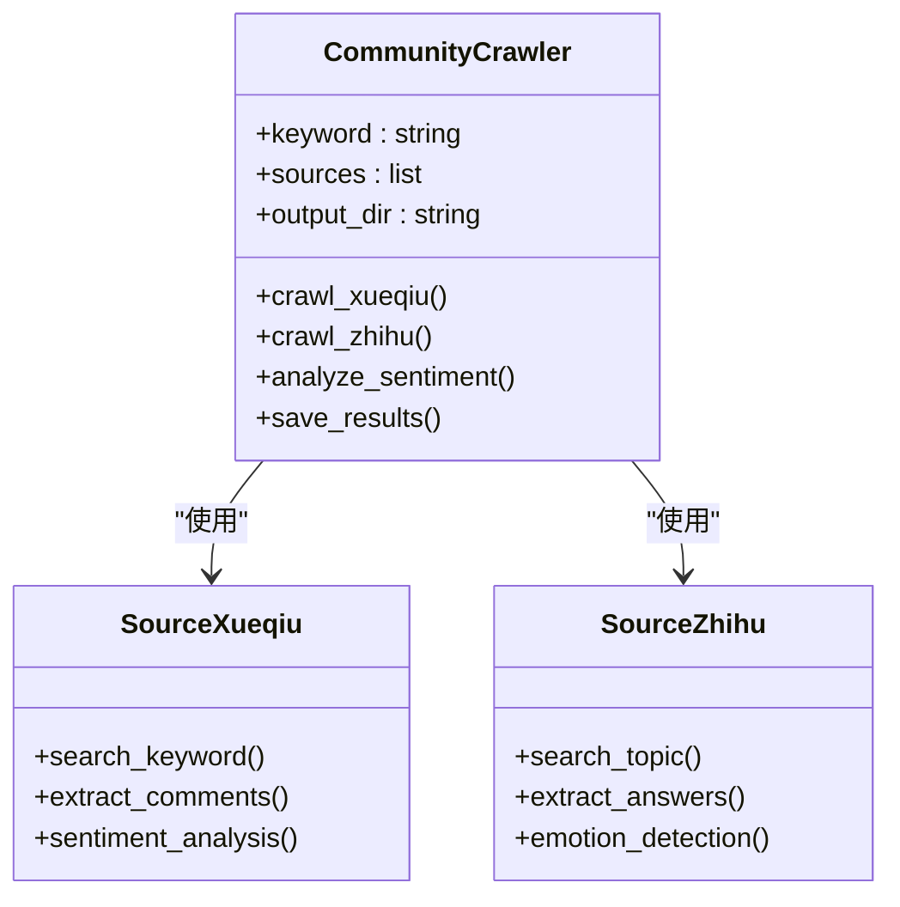

**图表来源**
- [financial_news_workflow_crawl4ai.py:94-359](file://financial_news_workflow_crawl4ai.py#L94-L359)

**章节来源**
- [financial_news_workflow_crawl4ai.py:94-359](file://financial_news_workflow_crawl4ai.py#L94-L359)

### 2. 财务分析模块

#### 新能源车企分析框架

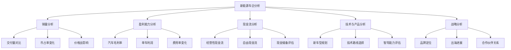

**图表来源**
- [ev-maker.md:58-142](file://.agents/skills/china-financial-news-writer/subskills/ev-maker.md#L58-L142)

#### 科技巨头分析框架

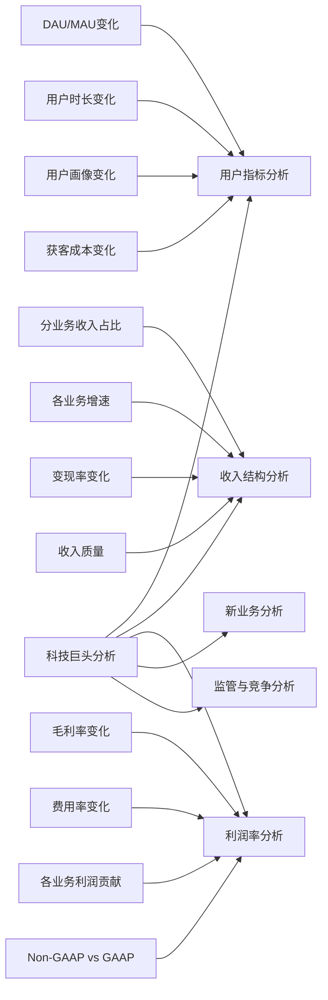

**图表来源**
- [tech-giant.md:28-102](file://.agents/skills/china-financial-news-writer/subskills/tech-giant.md#L28-L102)

**章节来源**
- [ev-maker.md:58-142](file://.agents/skills/china-financial-news-writer/subskills/ev-maker.md#L58-L142)
- [tech-giant.md:28-102](file://.agents/skills/china-financial-news-writer/subskills/tech-giant.md#L28-L102)

### 3. 深度研究流程

#### 7阶段工作流程

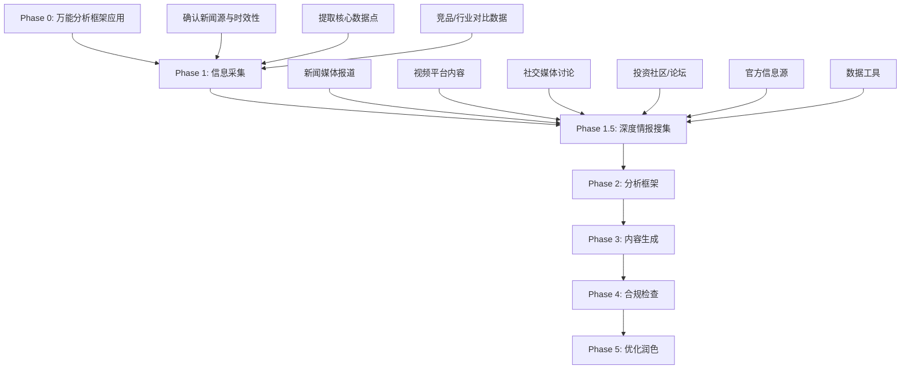

**图表来源**
- [SKILL.md:55-287](file://.agents/skills/china-financial-news-writer/SKILL.md#L55-L287)

#### 深度情报搜集清单

| 情报维度 | 搜索策略 | 关注要点 | 价值评估 |
|----------|----------|----------|----------|
| 新闻媒体报道 | 公司名+事件关键词 | 事件发布时间、核心数据、官方回应 | ⭐⭐⭐⭐⭐ |
| 视频平台内容 | 公司名+财经/分析 | UP主核心观点、视频独特数据、评论区情绪 | ⭐⭐⭐⭐ |
| 社交媒体讨论 | 公司名+投资/理财 | 公众情绪倾向、独家信息源、高频讨论话题 | ⭐⭐⭐ |
| 投资社区/论坛 | 公司名或股票代码 | 深度分析文章、数据支撑、多空观点对比 | ⭐⭐⭐⭐ |
| 官方信息源 | 公司官网+交易所公告 | 财报公告、业绩预告、重大事项公告 | ⭐⭐⭐⭐⭐ |
| 数据工具 | 百度指数+微信指数 | 搜索趋势、人群画像、地域分布 | ⭐⭐⭐ |

**章节来源**
- [SKILL.md:55-287](file://.agents/skills/china-financial-news-writer/SKILL.md#L55-L287)

## 依赖关系分析

### 技术栈依赖

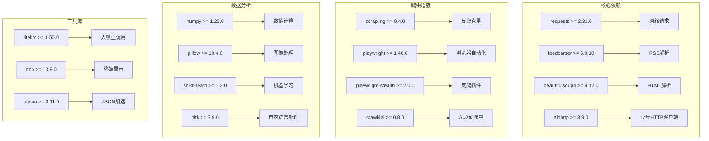

**图表来源**
- [requirements.txt:1-144](file://requirements.txt#L1-L144)

### 系统权限配置

框架需要特定的Claude AI权限配置：

| 权限类别 | 具体权限 | 用途说明 |
|----------|----------|----------|
| Web权限 | WebSearch | 网络搜索功能 |
| Bash权限 | Bash(pip install -r requirements.txt -q) | 依赖安装 |
| Bash权限 | Bash(python financial_news_workflow.py) | 主程序执行 |
| Bash权限 | Bash(npx skills add ...) | 技能安装 |
| Web权限 | WebFetch(domain:github.com) | GitHub资源访问 |
| Git权限 | git init:* | 代码仓库初始化 |
| Git权限 | git remote:* | 远程仓库配置 |

**章节来源**
- [requirements.txt:1-144](file://requirements.txt#L1-L144)
- [.claude/settings.local.json:1-51](file://.claude/settings.local.json#L1-L51)

## 性能考虑

### 爬虫性能优化

框架采用多种技术手段优化爬虫性能：

1. **并发抓取**：支持多线程并发抓取多个新闻源
2. **智能重试**：自动处理网络异常和临时故障
3. **代理轮换**：避免IP被封禁
4. **缓存机制**：减少重复抓取和数据处理
5. **异步处理**：使用aiohttp提高I/O密集型任务效率

### 数据处理优化

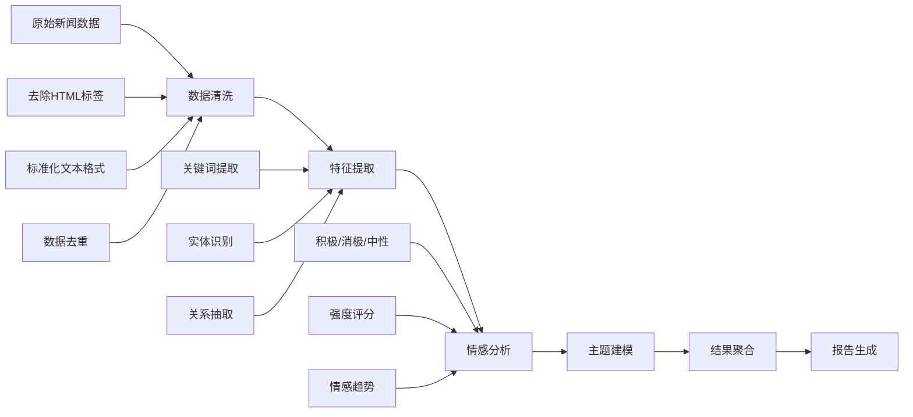

**图表来源**
- [financial_news_workflow_crawl4ai.py:363-454](file://financial_news_workflow_crawl4ai.py#L363-L454)

### 内存管理

框架采用流式处理和分批处理策略：

- **流式JSON处理**：使用orjson库提高JSON处理性能
- **分批数据处理**：避免大文件一次性加载到内存
- **垃圾回收优化**：定期清理无用对象释放内存
- **连接池管理**：复用网络连接减少资源消耗

## 故障排除指南

### 常见问题及解决方案

#### 1. 依赖安装问题

**问题症状**：
- pip安装失败
- 模块导入错误
- 版本兼容性问题

**解决方案**：
```bash
# 升级pip到最新版本
pip install --upgrade pip

# 使用二进制安装模式
pip install --only-binary :all: -r requirements.txt

# 安装Playwright浏览器
npx playwright install chromium
```

#### 2. 爬虫抓取失败

**问题症状**：
- 网站访问超时
- 反爬虫检测
- 数据解析错误

**解决方案**：
```python
# 检查网络连接
import requests
try:
    response = requests.get("https://www.example.com", timeout=10)
    print("网络连接正常")
except:
    print("网络连接异常")

# 配置User-Agent和Headers
headers = {
    'User-Agent': 'Mozilla/5.0 (Windows NT 10.0; Win64; x64) AppleWebKit/537.36'
}

# 使用代理IP
proxies = {
    'http': 'http://proxy-server:port',
    'https': 'https://proxy-server:port'
}
```

#### 3. Playwright浏览器问题

**问题症状**：
- 浏览器启动失败
- 页面加载超时
- 元素定位失败

**解决方案**：
```bash
# 安装Chromium浏览器
npx playwright install chromium

# 检查权限
# 以管理员身份运行命令行

# 调试模式启动
playwright install-deps
```

#### 4. 数据处理异常

**问题症状**：
- JSON解析错误
- 内存溢出
- 数据格式不匹配

**解决方案**：
```python
# 使用异常处理
try:
    data = json.loads(json_string)
except json.JSONDecodeError as e:
    print(f"JSON解析错误: {e}")

# 分批处理大数据
def process_in_batches(data_list, batch_size=1000):
    for i in range(0, len(data_list), batch_size):
        batch = data_list[i:i + batch_size]
        yield batch
```

**章节来源**
- [RUN.md:144-188](file://docs/RUN.md#L144-L188)

## 结论

万能分析框架是一个功能完整、架构清晰的金融新闻分析系统。通过12大分析模块、三维分类矩阵和深度情报搜集系统，框架能够为用户提供全面的企业和行业分析服务。

### 主要优势

1. **模块化设计**：12大分析模块覆盖财经分析的所有维度
2. **多维度分析**：支持不同类型的企业和行业分析
3. **自动化程度高**：从数据采集到报告生成全程自动化
4. **扩展性强**：支持自定义分析模块和数据源
5. **输出多样化**：支持多种输出风格和格式

### 技术特点

1. **先进的技术栈**：基于Python 3.8+和现代依赖库
2. **高性能架构**：采用异步处理和并发技术
3. **智能反爬虫**：使用Scrapling和Playwright等先进工具
4. **深度学习集成**：支持AI驱动的内容理解和分析
5. **可视化支持**：提供丰富的图表和数据可视化

### 应用前景

框架适用于金融机构、投资公司、咨询公司和个人投资者，能够帮助用户快速获取有价值的市场洞察和投资建议。通过持续的优化和扩展，框架将成为金融分析领域的重要工具。

## 附录

### 使用示例

#### 基础使用示例

```bash
# 抓取近10天的虎嗅网和第一财经新闻
python financial_news_workflow_crawl4ai.py --days 10 --sources huxiu,yicai

# 抓取所有来源的新闻
python financial_news_workflow_crawl4ai.py --days 7 --sources all

# 指定输出目录
python financial_news_workflow_crawl4ai.py --days 5 --sources huxiu,36kr --output ./output

# 使用固定输出目录
python financial_news_workflow_crawl4ai.py --days 3 --sources yicai,jiemian --fixed-output ./news_output
```

#### 高级使用示例

```bash
# 抓取社区论坛评论
python community_crawler.py --keyword "小米汽车" --sources all --output ./community_output

# 测试Crawl4AI功能
python test_crawl4ai.py

# 测试所有新闻源
python test_all_sources.py
```

### 开发指南

#### 扩展新分析模块

1. **创建分析类**：继承基础分析类
2. **实现分析方法**：编写具体的分析逻辑
3. **配置权重**：设置分析模块的权重
4. **测试验证**：编写单元测试和集成测试

#### 添加新的数据源

1. **创建数据源类**：实现数据源接口
2. **编写抓取逻辑**：处理网站结构和反爬虫
3. **数据清洗**：标准化数据格式
4. **错误处理**：实现健壮的异常处理

#### 自定义输出格式

1. **创建输出模板**：设计报告模板
2. **实现格式转换**：编写格式转换逻辑
3. **配置样式**：设置输出样式和布局
4. **测试验证**：验证输出质量和兼容性

**章节来源**
- [RUN.md:113-188](file://docs/RUN.md#L113-L188)