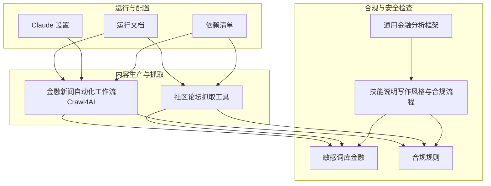
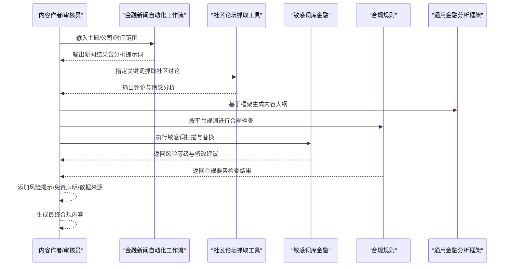
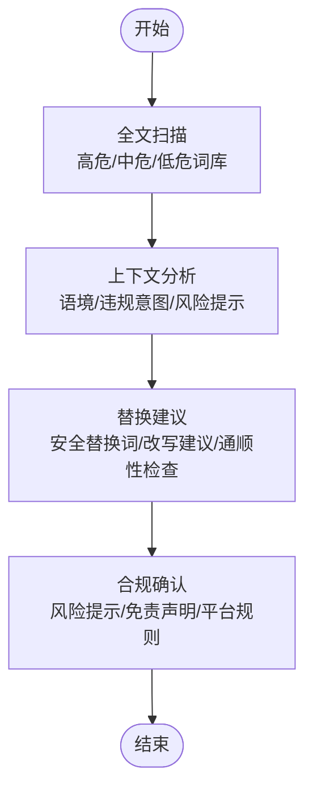
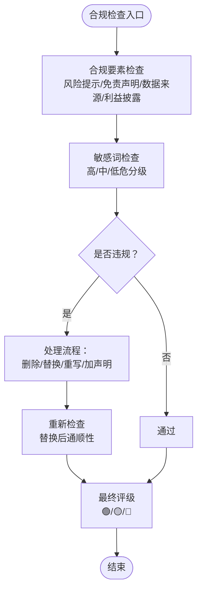
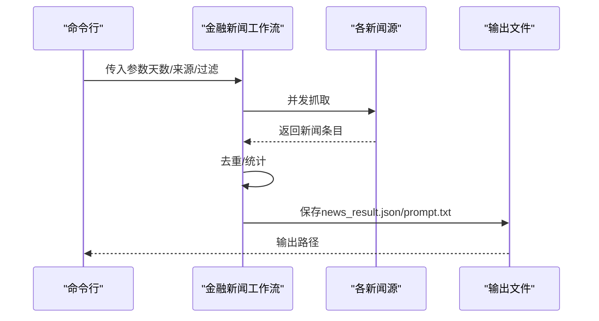
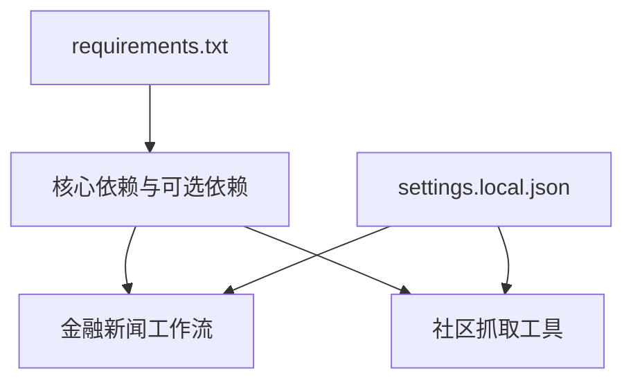

# 合规与安全检查

<cite>
**本文引用的文件**
- [敏感词库（金融）](file://.agents/skills/china-financial-news-writer/references/sensitive-words-finance.md)
- [合规规则](file://.agents/skills/china-financial-news-writer/references/compliance-rules.md)
- [通用金融分析框架](file://.agents/skills/china-financial-news-writer/references/universal_financial_analysis_framework.md)
- [技能说明（China Financial News Writer）](file://.agents/skills/china-financial-news-writer/SKILL.md)
- [金融新闻自动化工作流（Crawl4AI）](file://financial_news_workflow_crawl4ai.py)
- [社区论坛抓取工具](file://community_crawler.py)
- [运行文档](file://docs/RUN.md)
- [Claude 设置](file://.claude/settings.local.json)
- [依赖清单](file://requirements.txt)
</cite>

## 目录
1. [简介](#简介)
2. [项目结构](#项目结构)
3. [核心组件](#核心组件)
4. [架构总览](#架构总览)
5. [详细组件分析](#详细组件分析)
6. [依赖分析](#依赖分析)
7. [性能考量](#性能考量)
8. [故障排查指南](#故障排查指南)
9. [结论](#结论)
10. [附录](#附录)

## 简介
本文件面向“合规与安全检查模块”，聚焦金融内容的合规性保障，涵盖敏感词过滤、违规内容识别、合规性评分与风险提示等核心能力。文档结合项目中的金融敏感词库、合规规则与工作流脚本，系统阐述内容安全检查的实现原理（文本预处理、模式匹配、上下文分析），并提供配置指南、自定义规则扩展方法以及审核人员的操作流程，确保生成内容符合监管要求与平台规范。

## 项目结构
本项目围绕“金融新闻自动化工作流”展开，合规与安全检查贯穿于内容生成与发布前的全流程。主要涉及：
- 敏感词库与合规规则：提供金融行业特有词汇、平台规则与处理流程
- 内容生成与分析框架：指导内容结构与合规要素嵌入
- 自动化抓取与社区舆情：为合规检查提供输入数据与上下文
- 运行与依赖：支撑脚本执行与第三方能力集成

**图表来源**
- [.agents/skills/china-financial-news-writer/references/sensitive-words-finance.md](file://.agents/skills/china-financial-news-writer/references/sensitive-words-finance.md)
- [.agents/skills/china-financial-news-writer/references/compliance-rules.md](file://.agents/skills/china-financial-news-writer/references/compliance-rules.md)
- [.agents/skills/china-financial-news-writer/references/universal_financial_analysis_framework.md](file://.agents/skills/china-financial-news-writer/references/universal_financial_analysis_framework.md)
- [.agents/skills/china-financial-news-writer/SKILL.md](file://.agents/skills/china-financial-news-writer/SKILL.md)
- [financial_news_workflow_crawl4ai.py](file://financial_news_workflow_crawl4ai.py)
- [community_crawler.py](file://community_crawler.py)
- [docs/RUN.md](file://docs/RUN.md)
- [.claude/settings.local.json](file://.claude/settings.local.json)
- [requirements.txt](file://requirements.txt)

**章节来源**
- [docs/RUN.md:1-252](file://docs/RUN.md#L1-L252)

## 核心组件
- 敏感词库与分级规则：提供高危、中危、低危词汇清单，配套安全表述替换表与平台特殊规则（小红书、公众号、研报）
- 合规规则与检查流程：明确“不承诺收益、不构成建议、充分披露风险、数据来源透明、避免绝对化”等原则，给出检测流程与处理步骤
- 内容分析框架：提供12大模块的分析框架，便于在生成阶段即嵌入合规要素
- 抓取与输入数据：通过自动化工作流与社区抓取工具，为合规检查提供原始文本与上下文

**章节来源**
- [.agents/skills/china-financial-news-writer/references/sensitive-words-finance.md:1-317](file://.agents/skills/china-financial-news-writer/references/sensitive-words-finance.md#L1-L317)
- [.agents/skills/china-financial-news-writer/references/compliance-rules.md:1-394](file://.agents/skills/china-financial-news-writer/references/compliance-rules.md#L1-L394)
- [.agents/skills/china-financial-news-writer/references/universal_financial_analysis_framework.md:1-126](file://.agents/skills/china-financial-news-writer/references/universal_financial_analysis_framework.md#L1-L126)
- [.agents/skills/china-financial-news-writer/SKILL.md:249-267](file://.agents/skills/china-financial-news-writer/SKILL.md#L249-L267)

## 架构总览
合规与安全检查在内容生命周期中的位置如下：

**图表来源**
- [financial_news_workflow_crawl4ai.py:405-454](file://financial_news_workflow_crawl4ai.py#L405-L454)
- [community_crawler.py:501-604](file://community_crawler.py#L501-L604)
- [.agents/skills/china-financial-news-writer/references/compliance-rules.md:164-204](file://.agents/skills/china-financial-news-writer/references/compliance-rules.md#L164-L204)
- [.agents/skills/china-financial-news-writer/references/sensitive-words-finance.md:270-294](file://.agents/skills/china-financial-news-writer/references/sensitive-words-finance.md#L270-L294)
- [.agents/skills/china-financial-news-writer/references/universal_financial_analysis_framework.md:105-121](file://.agents/skills/china-financial-news-writer/references/universal_financial_analysis_framework.md#L105-L121)

## 详细组件分析

### 敏感词库与分级规则
- 分级体系：高危（封号/处罚风险）、中危（限流风险）、低危（可能延迟审核）
- 重点类别：投资建议违规、非法集资、虚假宣传、绝对化用语、预测类、借贷/理财产品/期货外汇/数字货币/募资相关
- 安全表述替换：提供“危险表述→安全替换”的对照表，覆盖投资建议、收益承诺、预测类
- 平台特殊规则：小红书（禁止荐股/承诺收益/引导开户；允许财报/行业/知识/经验分享；必须风险提示与“仅供参考”声明）、公众号（免责声明、风险提示、数据来源标注）、研报（分析师声明、投资评级定义、完整免责声明、公司声明）

**图表来源**
- [.agents/skills/china-financial-news-writer/references/sensitive-words-finance.md:270-294](file://.agents/skills/china-financial-news-writer/references/sensitive-words-finance.md#L270-L294)

**章节来源**
- [.agents/skills/china-financial-news-writer/references/sensitive-words-finance.md:3-317](file://.agents/skills/china-financial-news-writer/references/sensitive-words-finance.md#L3-L317)

### 合规规则与检查流程
- 核心原则：不承诺收益、不构成建议、充分披露风险、数据来源透明、避免绝对化
- 平台合规：小红书、公众号、研报的禁止/允许内容与合规模板
- 内容审查清单：发布前必查项（风险提示、免责声明、数据来源、标签、商业化程度等）
- 敏感内容处理：发现敏感词→标记与评级→评估上下文→提供替代方案→重新检查→添加必要声明
- 特殊场景：财报分析、行业分析、政策解读的合规边界

**图表来源**
- [.agents/skills/china-financial-news-writer/references/compliance-rules.md:164-204](file://.agents/skills/china-financial-news-writer/references/compliance-rules.md#L164-L204)
- [.agents/skills/china-financial-news-writer/references/compliance-rules.md:209-232](file://.agents/skills/china-financial-news-writer/references/compliance-rules.md#L209-L232)

**章节来源**
- [.agents/skills/china-financial-news-writer/references/compliance-rules.md:1-394](file://.agents/skills/china-financial-news-writer/references/compliance-rules.md#L1-L394)

### 内容分析框架与合规嵌入
- 12大模块：事件引爆点、战略失误分析、市场竞争格局、财务深度分析、全网舆情分析、技术路线分析、历史对比分析、未来预测模块、故事化叙事、情感共鸣点、互动设计、图表模板库
- 平台适配：不同平台侧重（B站、小红书、公众号、抖音、微博）在内容权重与时长分配上的差异
- 合规嵌入：在生成阶段即勾选合规相关模块（风险提示、免责声明、数据来源标注），并在内容表达模块中强化合规语言与风险提示

**章节来源**
- [.agents/skills/china-financial-news-writer/references/universal_financial_analysis_framework.md:1-126](file://.agents/skills/china-financial-news-writer/references/universal_financial_analysis_framework.md#L1-L126)
- [.agents/skills/china-financial-news-writer/SKILL.md:55-286](file://.agents/skills/china-financial-news-writer/SKILL.md#L55-L286)

### 自动化工作流与输入数据
- 金融新闻自动化工作流：抓取7大权威媒体，支持按天数与来源过滤，输出新闻结果与分析提示词
- 社区论坛抓取工具：抓取雪球、知乎等社区讨论，进行情感分析，输出评论与统计
- 抓取与合规的关系：通过输入数据（新闻与社区讨论）丰富上下文，辅助合规检查的上下文分析与风险提示补充

**图表来源**
- [financial_news_workflow_crawl4ai.py:405-454](file://financial_news_workflow_crawl4ai.py#L405-L454)
- [financial_news_workflow_crawl4ai.py:363-403](file://financial_news_workflow_crawl4ai.py#L363-L403)

**章节来源**
- [financial_news_workflow_crawl4ai.py:1-454](file://financial_news_workflow_crawl4ai.py#L1-L454)
- [community_crawler.py:1-604](file://community_crawler.py#L1-L604)

## 依赖分析
- 运行与抓取依赖：requests、feedparser、BeautifulSoup4、Playwright、Crawl4AI等
- 依赖安装与验证：requirements.txt提供完整依赖清单；运行文档提供安装与验证步骤
- Claude 集成：settings.local.json定义了Claude可执行的脚本与权限，便于在受控环境下运行工作流

**图表来源**
- [requirements.txt:1-144](file://requirements.txt#L1-L144)
- [.claude/settings.local.json:1-51](file://.claude/settings.local.json#L1-L51)

**章节来源**
- [requirements.txt:1-144](file://requirements.txt#L1-L144)
- [.claude/settings.local.json:1-51](file://.claude/settings.local.json#L1-L51)

## 性能考量
- 抓取并发与稳定性：合理设置来源数量与天数范围，避免对目标站点造成压力
- 依赖安装与版本：优先使用requirements.txt提供的版本范围，减少兼容性问题
- 日志与调试：运行文档提供了日志与调试建议，便于定位抓取失败与解析异常
- 代码健壮性：工作流脚本对缺失依赖进行了显式检查与提示，降低运行时错误

**章节来源**
- [docs/RUN.md:144-188](file://docs/RUN.md#L144-L188)
- [financial_news_workflow_crawl4ai.py:30-58](file://financial_news_workflow_crawl4ai.py#L30-L58)

## 故障排查指南
- 抓取失败
  - 检查网络连接与目标站点可用性
  - 使用更少来源参数重试
  - 查看命令行输出的错误信息
- Playwright 浏览器启动失败
  - 确保已安装Chromium：npx playwright install chromium
  - 检查系统权限，必要时以管理员身份运行
- 依赖安装失败
  - 升级pip至最新版本
  - 使用二进制安装选项：pip install --only-binary :all: -r requirements.txt
  - 检查网络连通性
- Crawl4AI 抓取回退
  - 若Playwright失败，工具会自动尝试HTTP策略作为备用
- 社区抓取解析问题
  - BeautifulSoup未安装会影响HTML解析，建议安装以获得更好解析效果

**章节来源**
- [docs/RUN.md:144-188](file://docs/RUN.md#L144-L188)
- [community_crawler.py:43-51](file://community_crawler.py#L43-L51)
- [community_crawler.py:127-170](file://community_crawler.py#L127-L170)

## 结论
本合规与安全检查模块以“敏感词库+合规规则+分析框架+自动化抓取”为核心，形成从输入数据到内容生成再到发布前合规校验的闭环。通过分级规则与处理流程，能够有效识别并降低高危、中危、低危违规风险；通过平台特殊规则与模板，确保内容满足小红书、公众号、研报等平台的合规要求。配合自动化工作流与社区抓取工具，审核人员可在生成早期即嵌入合规要素，显著提升内容质量与安全性。

## 附录

### 合规检查配置指南
- 启用公司名过滤（新闻工作流）
  - 在命令行中添加参数：--filter-companies，可限定与公司名相关的新闻
- 指定来源与天数
  - 使用 --sources 与 --days 控制抓取范围
- 输出目录
  - 使用 --output 或 --fixed-output 控制输出位置

**章节来源**
- [financial_news_workflow_crawl4ai.py:405-454](file://financial_news_workflow_crawl4ai.py#L405-L454)

### 自定义规则与扩展方法
- 扩展敏感词库
  - 在敏感词库中新增词汇与等级，并提供安全替换建议
  - 对行业特殊场景（如医药/白酒/新能源车）补充敏感表述与安全表述
- 调整处理流程
  - 根据业务需要调整“发现敏感词→评估→替换→重新检查→添加声明”的流程节点
- 平台规则定制
  - 针对新平台补充禁止/允许内容与合规模板
- 数据来源标注
  - 在合规规则中完善数据来源标注格式与禁止使用情形

**章节来源**
- [.agents/skills/china-financial-news-writer/references/sensitive-words-finance.md:185-228](file://.agents/skills/china-financial-news-writer/references/sensitive-words-finance.md#L185-L228)
- [.agents/skills/china-financial-news-writer/references/compliance-rules.md:294-329](file://.agents/skills/china-financial-news-writer/references/compliance-rules.md#L294-L329)

### 审核人员操作流程
- 生成内容后，先进行合规要素检查（风险提示、免责声明、数据来源、利益披露）
- 执行敏感词扫描，按风险等级进行处理（删除/替换/重写/加声明）
- 重新检查替换后语句通顺性与平台规则符合度
- 添加必要的风险提示与免责声明，确认最终评级
- 保存合规检查报告与修改建议

**章节来源**
- [.agents/skills/china-financial-news-writer/references/compliance-rules.md:164-204](file://.agents/skills/china-financial-news-writer/references/compliance-rules.md#L164-L204)
- [.agents/skills/china-financial-news-writer/references/compliance-rules.md:360-394](file://.agents/skills/china-financial-news-writer/references/compliance-rules.md#L360-L394)