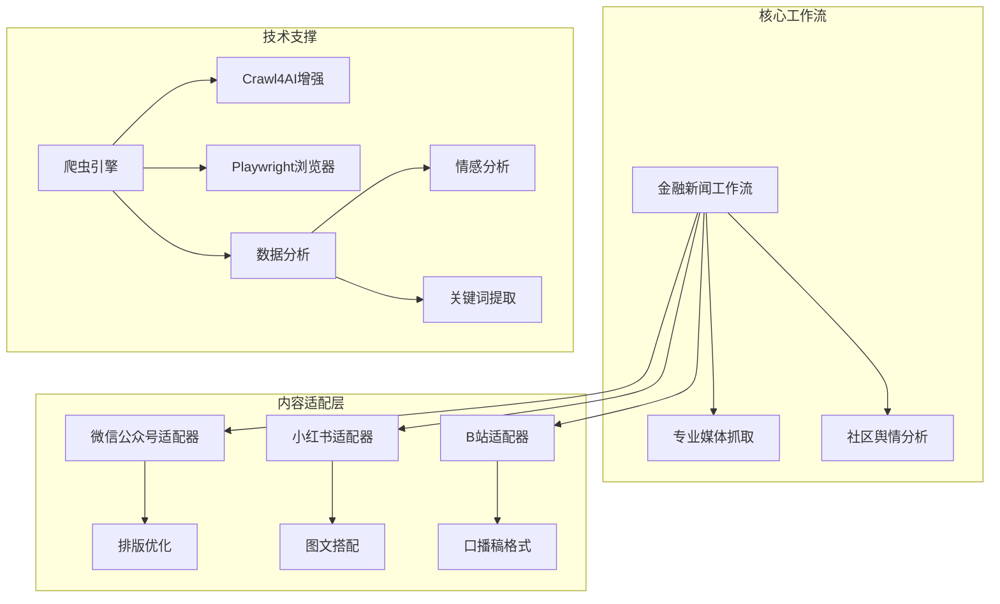
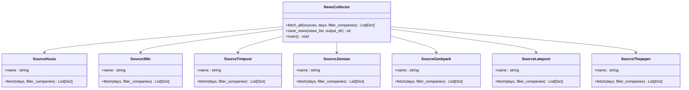
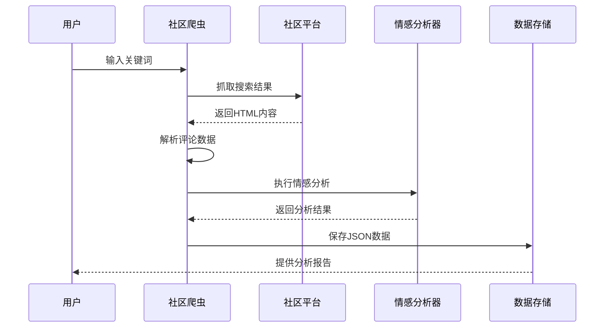
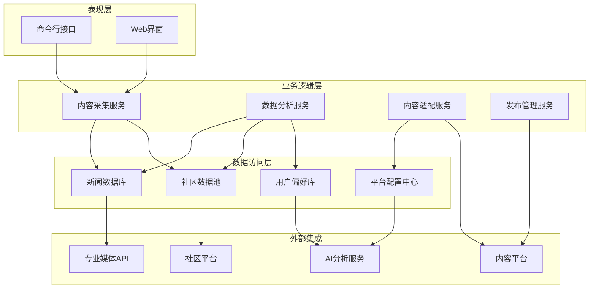
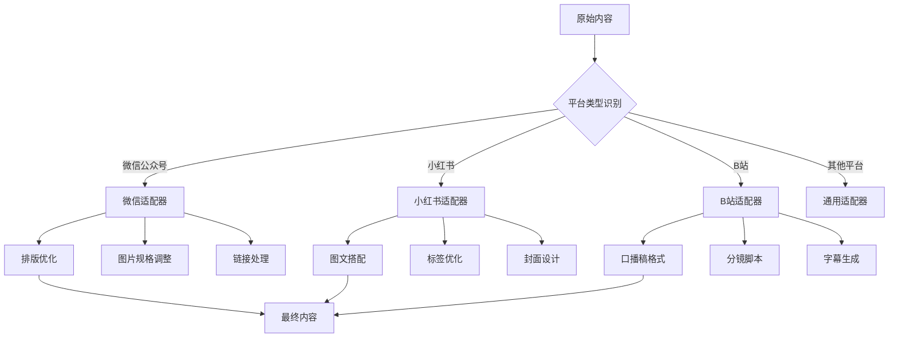
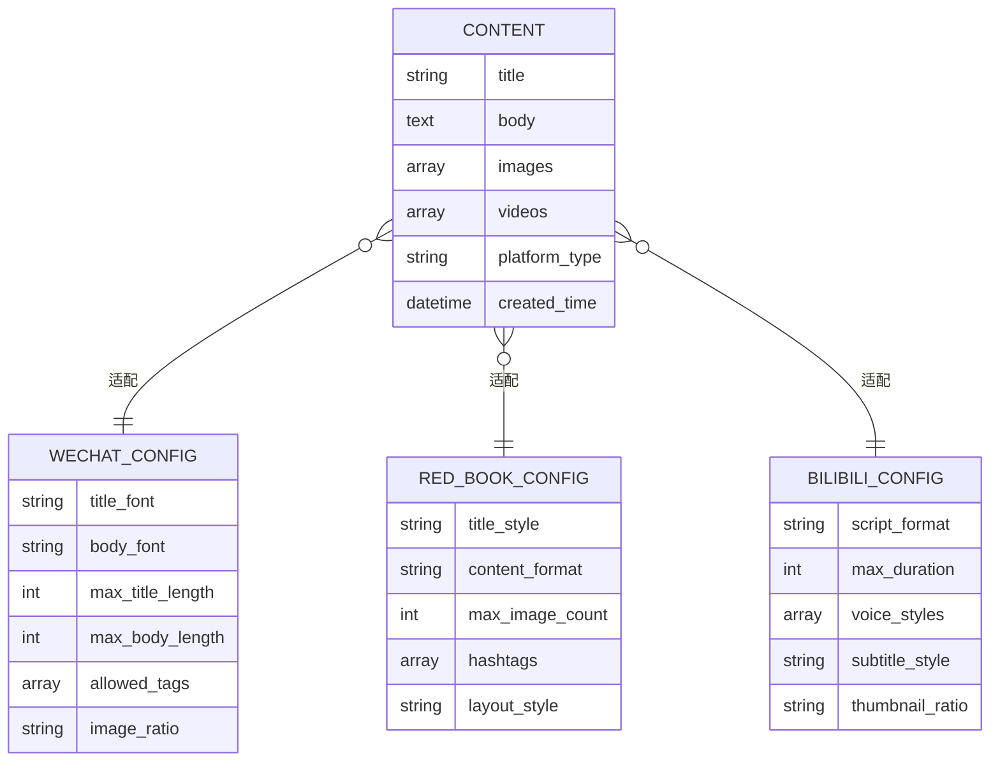
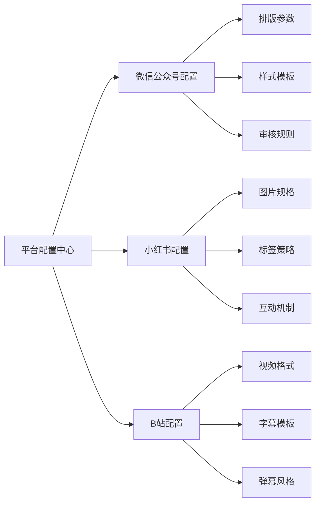
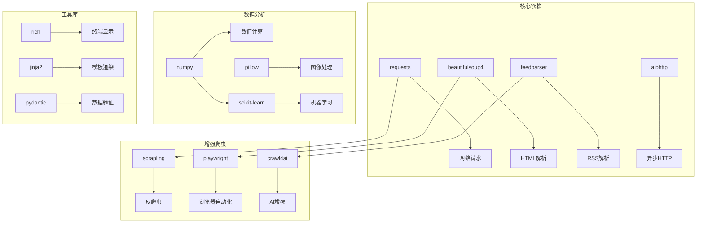
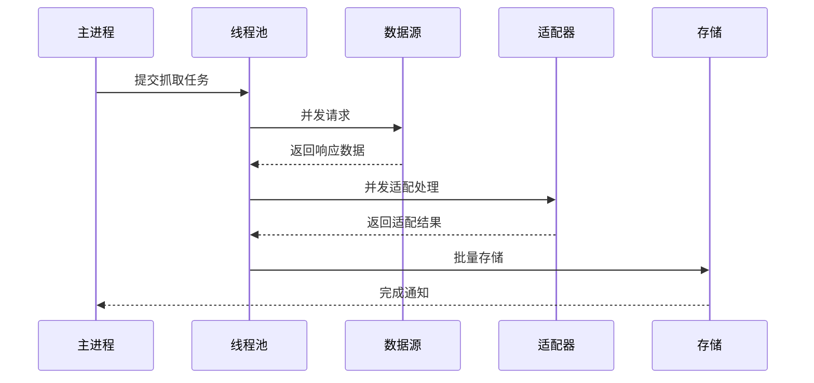

# 多平台适配策略

<cite>
**本文档引用的文件**
- [financial_news_workflow_crawl4ai.py](file://financial_news_workflow_crawl4ai.py)
- [community_crawler.py](file://community_crawler.py)
- [requirements.txt](file://requirements.txt)
- [docs/SPEC.md](file://docs/SPEC.md)
- [docs/RUN.md](file://docs/RUN.md)
- [design_philosophy.md](file://design/design_philosophy.md)
- [output/本田利润暴跌的b站口播稿大纲.md](file://output/本田利润暴跌的b站口播稿大纲.md)
- [output/稿子v2.txt](file://output/稿子v2.txt)
- [news_output_crawl4ai_20260324_103448/prompt.txt](file://news_output_crawl4ai_20260324_103448/prompt.txt)
- [.claude/settings.local.json](file://.claude/settings.local.json)
</cite>

## 目录
1. [引言](#引言)
2. [项目结构](#项目结构)
3. [核心组件](#核心组件)
4. [架构概览](#架构概览)
5. [详细组件分析](#详细组件分析)
6. [依赖关系分析](#依赖关系分析)
7. [性能考虑](#性能考虑)
8. [故障排除指南](#故障排除指南)
9. [结论](#结论)
10. [附录](#附录)

## 引言

本项目旨在构建一套完整的多平台内容适配策略，专门针对中国主流内容平台（微信公众号、小红书、B站等）进行深度优化。该策略不仅关注技术实现层面的适配要求，更注重内容创作的商业价值和用户体验。

项目的核心价值体现在以下几个方面：
- **自动化内容采集**：从7大权威财经媒体和社区平台自动抓取高质量内容
- **智能内容分析**：基于AI技术进行深度内容理解和情感分析
- **多平台适配**：针对不同平台特性提供定制化的内容格式和风格
- **商业化应用**：支持短视频、图文等多种内容形式的快速生产

## 项目结构

项目采用模块化设计，主要包含以下核心模块：

**图表来源**
- [financial_news_workflow_crawl4ai.py:1-454](file://financial_news_workflow_crawl4ai.py#L1-L454)
- [community_crawler.py:1-604](file://community_crawler.py#L1-L604)

**章节来源**
- [docs/RUN.md:1-252](file://docs/RUN.md#L1-L252)
- [docs/SPEC.md:1-183](file://docs/SPEC.md#L1-L183)

## 核心组件

### 专业新闻采集系统

系统支持7大权威财经媒体的自动化抓取，包括虎嗅网、36氪、钛媒体、界面新闻、极客公园、晚点LatePost和澎湃新闻。

**图表来源**
- [financial_news_workflow_crawl4ai.py:94-358](file://financial_news_workflow_crawl4ai.py#L94-L358)

### 社区舆情分析系统

系统能够从雪球网和知乎等社区平台抓取用户评论和讨论，进行情感分析和热点识别。

**图表来源**
- [community_crawler.py:197-410](file://community_crawler.py#L197-L410)

**章节来源**
- [financial_news_workflow_crawl4ai.py:1-454](file://financial_news_workflow_crawl4ai.py#L1-L454)
- [community_crawler.py:1-604](file://community_crawler.py#L1-L604)

## 架构概览

系统采用分层架构设计，确保各组件间的松耦合和高内聚：

**图表来源**
- [docs/SPEC.md:98-112](file://docs/SPEC.md#L98-L112)

## 详细组件分析

### 平台适配策略设计原理

#### 内容结构调整机制

系统通过统一的数据模型来适配不同平台的内容要求：

**图表来源**
- [docs/SPEC.md:72-75](file://docs/SPEC.md#L72-L75)

#### 语言风格转换机制

系统实现了多维度的语言风格转换：

| 转换维度 | 微信公众号 | 小红书 | B站 |
|---------|-----------|--------|-----|
| 语体风格 | 正式、客观 | 生动、亲切 | 活泼、有趣 |
| 词汇选择 | 专业术语 | 热词、表情 | 网络用语 |
| 句式结构 | 复句、完整 | 短句、感叹 | 口语化表达 |
| 互动元素 | 评论引导 | 话题标签 | 弹幕互动 |

#### 视觉元素适配方案

针对不同平台的视觉要求，系统提供了标准化的适配方案：

**图表来源**
- [docs/SPEC.md:40-63](file://docs/SPEC.md#L40-L63)

**章节来源**
- [docs/SPEC.md:24-75](file://docs/SPEC.md#L24-L75)

### 平台特定优化方案

#### 微信公众号优化方案

微信公众号作为专业的资讯平台，具有严格的排版规范和用户习惯：

**排版要求优化**：
- 标题层级清晰，使用H2-H6规范
- 段落间距合理，避免密集文字块
- 重点信息突出显示，使用强调标记
- 图片尺寸适配移动端阅读

**内容格式适配**：
- 长文章分段处理，每段控制在300字以内
- 关键数据使用表格或列表形式展示
- 外链添加nofollow属性，确保安全性
- 底部添加分享和关注引导

#### 小红书图文搭配优化

小红书作为生活方式分享平台，注重视觉冲击力和情感共鸣：

**图文搭配策略**：
- 封面图使用高对比度色彩，突出主题
- 内容图片与文字形成互补关系
- 图片数量控制在6-12张之间
- 添加适当的留白和装饰元素

**内容风格调整**：
- 使用第一人称叙述，增强亲和力
- 加入个人体验和感受描述
- 适当使用表情符号和网络用语
- 结尾添加行动号召和互动问题

#### B站口播稿格式优化

B站作为视频内容平台，需要适应音频和视觉双重传播：

**口播稿结构优化**：
- 开场3秒黄金钩子，直接抛出核心信息
- 逻辑层次清晰，每个要点独立成段
- 适当加入停顿和强调，便于配音录制
- 结尾总结升华，强化记忆点

**内容节奏控制**：
- 重要信息前置，确保观众注意力
- 使用递进式论述，逐步深入主题
- 适时插入案例和数据，增强说服力
- 结合视觉元素，提供画面联想

**章节来源**
- [output/本田利润暴跌的b站口播稿大纲.md:1-464](file://output/本田利润暴跌的b站口播稿大纲.md#L1-L464)
- [output/稿子v2.txt:1-168](file://output/稿子v2.txt#L1-L168)

### 配置指南和自定义适配规则

#### 平台配置文件结构

系统通过配置文件实现平台特性的灵活管理：

**图表来源**
- [docs/SPEC.md:164-183](file://docs/SPEC.md#L164-L183)

#### 自定义适配规则开发方法

开发自定义平台适配器的基本流程：

1. **需求分析**：明确目标平台的特性和用户偏好
2. **数据模型设计**：建立适配器的数据结构定义
3. **转换规则实现**：编写内容转换和格式化逻辑
4. **测试验证**：通过样例数据验证适配效果
5. **性能优化**：确保适配过程的高效性和稳定性

**章节来源**
- [docs/SPEC.md:164-183](file://docs/SPEC.md#L164-L183)

## 依赖关系分析

系统采用现代化的依赖管理体系，确保各组件间的协调运作：

**图表来源**
- [requirements.txt:1-144](file://requirements.txt#L1-L144)

**章节来源**
- [requirements.txt:1-144](file://requirements.txt#L1-L144)

## 性能考虑

### 并发处理优化

系统采用异步编程模型提高并发处理能力：

### 缓存策略设计

系统实现了多层次的缓存机制：

1. **网络请求缓存**：避免重复抓取相同内容
2. **解析结果缓存**：复用已处理的中间结果
3. **配置参数缓存**：减少频繁的配置读取
4. **分析结果缓存**：保存情感分析等计算结果

### 错误处理机制

系统建立了完善的错误处理和恢复机制：

- **网络异常处理**：自动重试和降级策略
- **解析错误处理**：容错解析和数据清洗
- **平台限制处理**：IP限制和频率控制
- **内存管理**：及时释放资源，防止内存泄漏

## 故障排除指南

### 常见问题诊断

**爬虫相关问题**：
- 检查网络连接和代理设置
- 验证目标网站的robots.txt规则
- 确认User-Agent和请求头配置
- 检查反爬虫机制的应对策略

**依赖安装问题**：
- 确认Python版本兼容性
- 检查系统依赖库的安装状态
- 验证Crawl4AI和Playwright的配置
- 清理pip缓存后重新安装

**性能问题排查**：
- 监控CPU和内存使用情况
- 分析网络请求的响应时间
- 检查数据库连接池状态
- 评估磁盘I/O性能瓶颈

### 调试工具和技巧

系统提供了丰富的调试工具：

- **日志系统**：详细的执行日志和错误追踪
- **性能监控**：关键指标的实时监控和告警
- **数据验证**：输入输出数据的完整性检查
- **可视化工具**：抓取进度和结果的图形化展示

**章节来源**
- [docs/RUN.md:144-188](file://docs/RUN.md#L144-L188)

## 结论

本多平台适配策略通过技术架构创新和内容创作优化，为内容运营提供了完整的解决方案。系统的核心优势包括：

1. **技术先进性**：采用最新的爬虫技术和AI分析能力
2. **适配灵活性**：支持多种平台的定制化适配
3. **内容质量**：确保在不同平台上的最佳呈现效果
4. **运营效率**：大幅提升内容生产和发布的效率

未来发展方向：
- 扩展更多内容平台的支持
- 增强AI内容生成和编辑能力
- 优化个性化推荐算法
- 完善数据分析和洞察功能

通过持续的技术创新和平台扩展，该策略将为内容创作者和企业提供更加智能化、个性化的多平台内容服务。

## 附录

### 最佳实践指导

**内容运营策略**：
- 建立内容日历和发布计划
- 关注平台算法变化和用户偏好
- 持续优化内容质量和用户体验
- 建立数据分析和效果评估体系

**技术实施建议**：
- 定期更新爬虫规则和反爬策略
- 优化数据库查询和索引设计
- 实施监控告警和故障恢复机制
- 建立版本管理和部署流程

**合规注意事项**：
- 遵守各平台的内容规范和社区准则
- 尊重知识产权和版权保护
- 确保用户隐私和个人信息安全
- 建立内容审核和风险控制机制