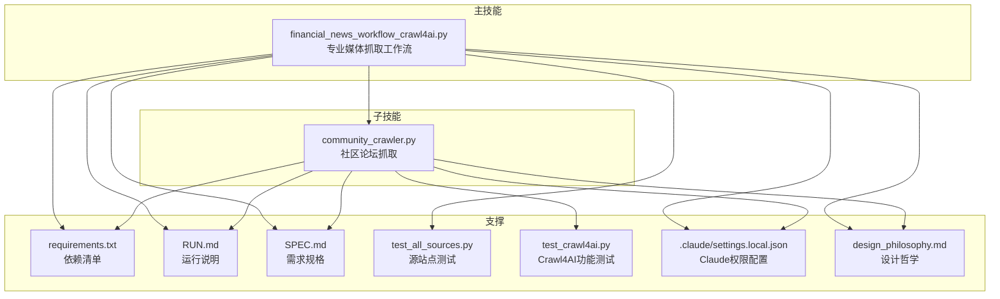
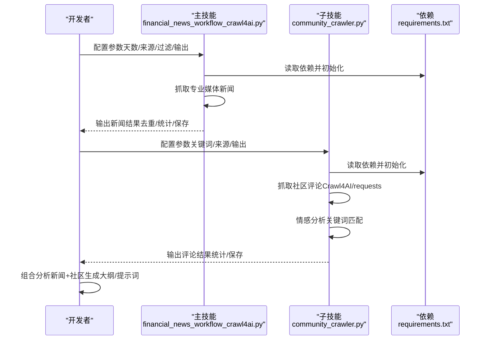
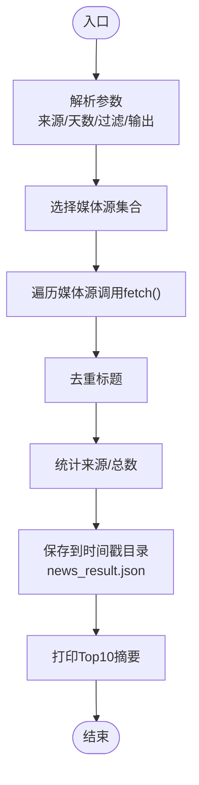
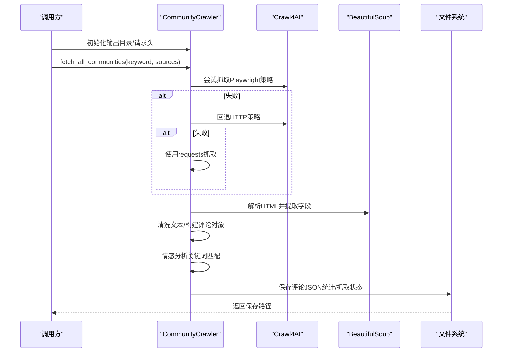
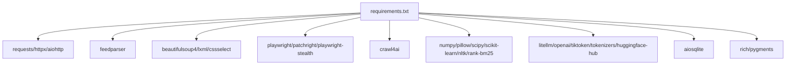

# 技能开发与定制

<cite>
**本文引用的文件**   
- [financial_news_workflow_crawl4ai.py](file://financial_news_workflow_crawl4ai.py)
- [community_crawler.py](file://community_crawler.py)
- [requirements.txt](file://requirements.txt)
- [RUN.md](file://docs/RUN.md)
- [SPEC.md](file://docs/SPEC.md)
- [test_all_sources.py](file://test_all_sources.py)
- [test_crawl4ai.py](file://test_crawl4ai.py)
- [settings.local.json](file://.claude/settings.local.json)
- [design_philosophy.md](file://design/design_philosophy.md)
- [output_本田利润暴跌的b站口播稿大纲.md](file://output/本田利润暴跌的b站口播稿大纲.md)
</cite>

## 目录
1. [引言](#引言)
2. [项目结构](#项目结构)
3. [核心组件](#核心组件)
4. [架构总览](#架构总览)
5. [详细组件分析](#详细组件分析)
6. [依赖关系分析](#依赖关系分析)
7. [性能考量](#性能考量)
8. [故障排查指南](#故障排查指南)
9. [结论](#结论)
10. [附录](#附录)

## 引言
本指南面向希望基于现有AI技能系统进行“技能开发与定制”的开发者，围绕以下目标展开：
- 理解主技能与子技能的关系、技能组合机制与参数配置方法
- 掌握开发新子技能的全流程：定义、参数设置、执行逻辑编写
- 形成技能定制的最佳实践：参数调优、性能优化、错误处理
- 提供可复用的开发示例，展示如何创建面向特定领域的专业技能
- 给出技能测试、调试与部署的完整指导，确保稳定性与可靠性

本项目提供了“金融新闻自动化工作流”的主技能，以及“社区论坛抓取”的子技能样例，二者共同构成一个可扩展的技能体系。读者可据此扩展更多子技能，组合形成更强大的专业技能。

## 项目结构
项目采用“主技能 + 子技能”的分层组织方式：
- 主技能：金融新闻自动化工作流（专业媒体抓取 + 社区舆情抓取 + 结果汇总）
- 子技能：社区论坛抓取（雪球、知乎等）
- 配套文档：运行说明、需求规格、变更日志
- 依赖管理：集中于requirements.txt，统一安装与验证
- 测试工具：独立的测试脚本，覆盖源站点连通性与Crawl4AI功能

图表来源
- [financial_news_workflow_crawl4ai.py:1-454](file://financial_news_workflow_crawl4ai.py#L1-L454)
- [community_crawler.py:1-604](file://community_crawler.py#L1-L604)
- [requirements.txt:1-144](file://requirements.txt#L1-L144)
- [RUN.md:1-252](file://docs/RUN.md#L1-L252)
- [SPEC.md:1-183](file://docs/SPEC.md#L1-L183)
- [test_all_sources.py:1-49](file://test_all_sources.py#L1-L49)
- [test_crawl4ai.py:1-163](file://test_crawl4ai.py#L1-L163)
- [settings.local.json:1-51](file://.claude/settings.local.json#L1-L51)
- [design_philosophy.md:1-16](file://design/design_philosophy.md#L1-L16)

章节来源
- [RUN.md:1-252](file://docs/RUN.md#L1-L252)
- [SPEC.md:1-183](file://docs/SPEC.md#L1-L183)

## 核心组件
- 专业媒体抓取主技能
  - 支持7大权威媒体源（RSS/API/Playwright）
  - 提供参数：抓取天数、来源集合、是否启用公司名过滤、输出目录
  - 输出：去重后的新闻列表、按来源统计、时间戳目录
- 社区论坛抓取子技能
  - 支持雪球、知乎关键词搜索与评论抓取
  - 提供参数：关键词、来源集合、输出目录
  - 输出：评论JSON、按来源/情感统计、抓取状态
- 依赖与环境
  - 依赖集中在requirements.txt，涵盖网络请求、解析、Crawl4AI、Playwright等
  - 运行说明与安装步骤见RUN.md
- 测试与验证
  - test_all_sources.py：验证各媒体源连通性与解析能力
  - test_crawl4ai.py：验证Crawl4AI功能可用性

章节来源
- [financial_news_workflow_crawl4ai.py:405-454](file://financial_news_workflow_crawl4ai.py#L405-L454)
- [community_crawler.py:501-604](file://community_crawler.py#L501-L604)
- [requirements.txt:1-144](file://requirements.txt#L1-L144)
- [RUN.md:1-252](file://docs/RUN.md#L1-L252)
- [test_all_sources.py:1-49](file://test_all_sources.py#L1-L49)
- [test_crawl4ai.py:1-163](file://test_crawl4ai.py#L1-L163)

## 架构总览
主技能与子技能通过统一的参数接口与输出规范协同工作，形成“信息采集—分析—产出”的闭环。

图表来源
- [financial_news_workflow_crawl4ai.py:405-454](file://financial_news_workflow_crawl4ai.py#L405-L454)
- [community_crawler.py:501-604](file://community_crawler.py#L501-L604)
- [requirements.txt:1-144](file://requirements.txt#L1-L144)

## 详细组件分析

### 主技能：专业媒体抓取（主技能）
- 设计要点
  - 模块化媒体源：每个媒体源封装为独立类，统一实现fetch接口
  - 统一参数：支持天数、来源集合、公司名过滤、输出目录
  - 统一输出：去重、统计、保存到时间戳目录
- 关键流程
  - 参数解析与默认来源选择
  - 依次调用各媒体源fetch
  - 去重与统计
  - 保存结果并打印摘要

图表来源
- [financial_news_workflow_crawl4ai.py:405-454](file://financial_news_workflow_crawl4ai.py#L405-L454)
- [financial_news_workflow_crawl4ai.py:363-382](file://financial_news_workflow_crawl4ai.py#L363-L382)
- [financial_news_workflow_crawl4ai.py:384-403](file://financial_news_workflow_crawl4ai.py#L384-L403)

章节来源
- [financial_news_workflow_crawl4ai.py:94-359](file://financial_news_workflow_crawl4ai.py#L94-L359)
- [financial_news_workflow_crawl4ai.py:405-454](file://financial_news_workflow_crawl4ai.py#L405-L454)

### 子技能：社区论坛抓取（子技能）
- 设计要点
  - 社区源配置：统一映射（雪球、知乎）
  - 抓取策略：优先Crawl4AI（Playwright/HTTP策略），回退requests
  - 清洗与解析：BeautifulSoup解析HTML，清洗HTML标签
  - 分析与保存：情感分析（关键词匹配）、按来源/情感统计、保存JSON
- 关键流程
  - 初始化输出目录与请求头
  - 异步抓取各社区源
  - 清洗与解析，构建评论对象
  - 情感分析与统计
  - 保存结果

图表来源
- [community_crawler.py:82-497](file://community_crawler.py#L82-L497)
- [community_crawler.py:501-604](file://community_crawler.py#L501-L604)

章节来源
- [community_crawler.py:56-78](file://community_crawler.py#L56-L78)
- [community_crawler.py:127-194](file://community_crawler.py#L127-L194)
- [community_crawler.py:197-410](file://community_crawler.py#L197-L410)
- [community_crawler.py:444-497](file://community_crawler.py#L444-L497)

### 参数配置与组合机制
- 主技能参数
  - --days：抓取天数
  - --sources：来源集合（all或逗号分隔）
  - --output：输出基础目录（自动创建时间戳子目录）
  - --filter-companies：是否启用公司名过滤
- 子技能参数
  - --keyword：关键词
  - --sources：来源集合（all或逗号分隔）
  - --output：输出基础目录（自动创建时间戳子目录）
- 组合机制
  - 主技能负责“信息采集”，子技能负责“社区舆情”
  - 两者均以JSON输出，便于后续统一分析与生成提示词

章节来源
- [financial_news_workflow_crawl4ai.py:405-412](file://financial_news_workflow_crawl4ai.py#L405-L412)
- [community_crawler.py:504-522](file://community_crawler.py#L504-L522)

### 开发新子技能的流程（模板）
- 步骤1：定义子技能类
  - 设计统一接口（如fetch），支持关键词/来源/输出目录等参数
  - 选择抓取策略：Crawl4AI（Playwright/HTTP）或requests
- 步骤2：实现解析与清洗
  - 使用BeautifulSoup解析HTML，提取标题、链接、内容、作者、时间等字段
  - 清洗HTML标签与多余空白，保证输出一致性
- 步骤3：实现分析与统计
  - 可选：情感分析（关键词匹配）、按来源/情感统计
- 步骤4：实现保存与输出
  - 保存为JSON，包含抓取时间、关键词、总数、统计、原始数据等
- 步骤5：集成与测试
  - 在主技能中注册新子技能，添加到参数解析与调用链
  - 使用test_crawl4ai.py与test_all_sources.py进行功能与连通性测试

章节来源
- [community_crawler.py:82-497](file://community_crawler.py#L82-L497)
- [test_crawl4ai.py:1-163](file://test_crawl4ai.py#L1-L163)
- [test_all_sources.py:1-49](file://test_all_sources.py#L1-L49)

### 面向特定领域的专业技能示例
- 示例：汽车/科技领域
  - 可基于现有子技能扩展：增加“汽车之家”“爱卡汽车”等来源
  - 可扩展分析维度：品牌销量、车型口碑、技术路线对比
- 示例：金融/宏观领域
  - 可基于主技能扩展：增加“财新”“第一财经”等RSS源
  - 可扩展分析维度：政策影响、行业景气度、区域差异
- 输出形态参考
  - 可参考输出样例：口播稿大纲（包含事件背景、深度解读、影响分析、投资观点等维度）

章节来源
- [SPEC.md:26-75](file://docs/SPEC.md#L26-L75)
- [output_本田利润暴跌的b站口播稿大纲.md:1-464](file://output/本田利润暴跌的b站口播稿大纲.md#L1-L464)

## 依赖关系分析
- 依赖清单
  - requests、httpx、aiohttp：网络请求与异步HTTP客户端
  - feedparser：RSS解析
  - beautifulsoup4/lxml/cssselect：HTML解析
  - playwright/patchright/playwright-stealth：浏览器自动化与反爬
  - crawl4ai：AI驱动的爬虫（可选增强）
  - orjson/w3lib/tld：数据处理与清洗
  - numpy/pillow/scipy/scikit-learn/nltk/rank-bm25：AI/ML相关
  - litellm/openai/tiktoken/tokenizers/huggingface-hub：大模型调用
  - aiosqlite、rich/pygments：向量数据库与终端显示
- 依赖安装与验证
  - 安装：pip install -r requirements.txt
  - Playwright：npx playwright install chromium
  - Crawl4AI：pip install crawl4ai；test_crawl4ai.py验证

图表来源
- [requirements.txt:1-144](file://requirements.txt#L1-L144)

章节来源
- [requirements.txt:1-144](file://requirements.txt#L1-L144)
- [test_crawl4ai.py:15-22](file://test_crawl4ai.py#L15-L22)

## 性能考量
- 并行与异步
  - 主技能：媒体源串行抓取，可考虑并发改造以提升吞吐
  - 子技能：已采用async/await与Crawl4AI异步策略，建议保持
- 超时与重试
  - 设置合理的超时时间（如15-30秒），对失败站点进行重试或降级
- 解析与清洗
  - 使用高效的CSS选择器与正则表达式，避免重复解析
- 输出与存储
  - 时间戳目录自动创建，避免文件冲突；定期清理旧输出

章节来源
- [financial_news_workflow_crawl4ai.py:126-155](file://financial_news_workflow_crawl4ai.py#L126-L155)
- [community_crawler.py:179-194](file://community_crawler.py#L179-L194)

## 故障排查指南
- 常见问题
  - 抓取失败：检查网络、目标站点可访问性、降低来源数量
  - Playwright启动失败：确认已安装Chromium；以管理员权限运行
  - 依赖安装失败：升级pip，使用--only-binary :all:安装，检查网络
- 调试技巧
  - 查看命令行输出的日志信息
  - 检查输出目录中的JSON文件，定位解析问题
  - 使用test_all_sources.py验证媒体源连通性
  - 使用test_crawl4ai.py验证Crawl4AI功能
- 权限与合规
  - 遵守robots.txt，避免过度抓取
  - 合理使用抓取信息，尊重版权

章节来源
- [RUN.md:144-188](file://docs/RUN.md#L144-L188)
- [test_all_sources.py:18-48](file://test_all_sources.py#L18-L48)
- [test_crawl4ai.py:121-163](file://test_crawl4ai.py#L121-L163)
- [settings.local.json:1-51](file://.claude/settings.local.json#L1-L51)

## 结论
本指南基于现有主技能与子技能，给出了技能开发与定制的系统化方法论与实践路径。通过统一的参数接口、清晰的流程设计与完善的测试验证，开发者可以快速扩展新的子技能，并将其融入主技能的组合中，形成面向特定领域的专业技能体系。建议在开发过程中持续关注性能优化、错误处理与合规性，确保技能的稳定性与可靠性。

## 附录
- 运行与安装
  - 安装依赖：pip install -r requirements.txt
  - 安装Playwright：npx playwright install chromium
  - 运行主技能：python financial_news_workflow_crawl4ai.py --days 10 --sources huxiu,yicai
  - 运行子技能：python community_crawler.py --keyword "小米汽车" --sources all
- 设计哲学
  - 项目强调“可视化哲学”与“金融张力”，可借鉴其视觉与信息层次设计，提升技能输出的可读性与表现力

章节来源
- [RUN.md:26-80](file://docs/RUN.md#L26-L80)
- [design_philosophy.md:1-16](file://design/design_philosophy.md#L1-L16)