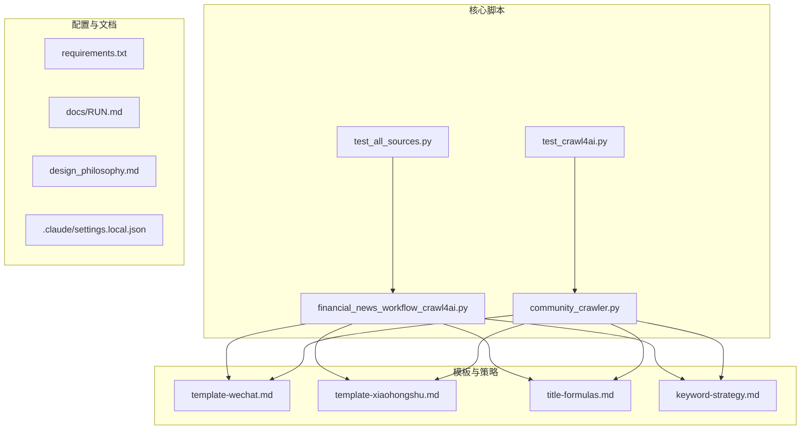
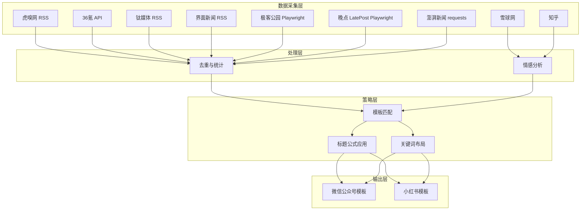
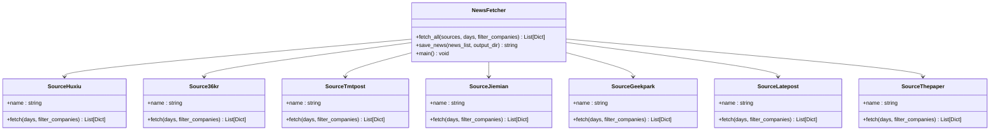
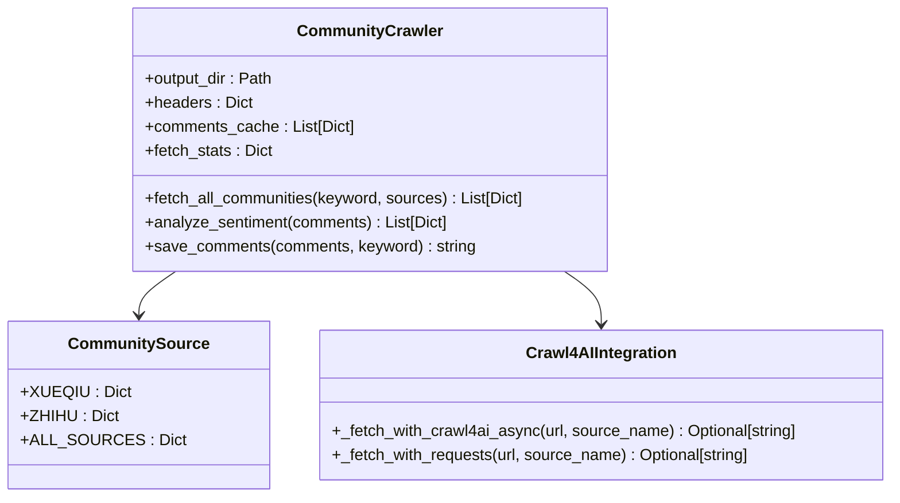
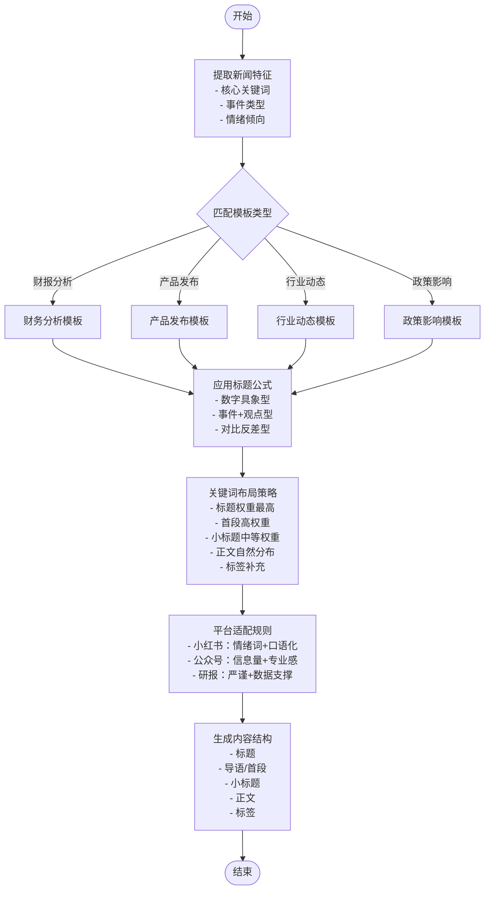
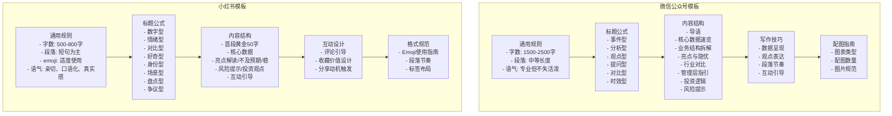

# 模板匹配系统

<cite>
**本文档引用的文件**
- [financial_news_workflow_crawl4ai.py](file://financial_news_workflow_crawl4ai.py)
- [community_crawler.py](file://community_crawler.py)
- [requirements.txt](file://requirements.txt)
- [RUN.md](file://docs/RUN.md)
- [design_philosophy.md](file://design/design_philosophy.md)
- [settings.local.json](file://.claude/settings.local.json)
- [template-wechat.md](file://.agents/skills/china-financial-news-writer/references/template-wechat.md)
- [template-xiaohongshu.md](file://.agents/skills/china-financial-news-writer/references/template-xiaohongshu.md)
- [title-formulas.md](file://.agents/skills/china-financial-news-writer/references/title-formulas.md)
- [keyword-strategy.md](file://.agents/skills/china-financial-news-writer/references/keyword-strategy.md)
- [test_all_sources.py](file://test_all_sources.py)
- [test_crawl4ai.py](file://test_crawl4ai.py)
</cite>

## 目录
1. [简介](#简介)
2. [项目结构](#项目结构)
3. [核心组件](#核心组件)
4. [架构概览](#架构概览)
5. [详细组件分析](#详细组件分析)
6. [依赖关系分析](#依赖关系分析)
7. [性能考量](#性能考量)
8. [故障排除指南](#故障排除指南)
9. [结论](#结论)
10. [附录](#附录)

## 简介
本模板匹配系统旨在为金融内容创作提供智能化的模板选择与生成解决方案。系统通过抓取权威财经媒体与社区论坛的热点内容，结合标题公式、关键词策略与平台适配规则，自动匹配最适合的模板（微信公众号、小红书等），并输出符合各平台格式要求的内容结构。

系统核心能力包括：
- 多源新闻抓取与去重
- 社区舆情分析与情感统计
- 标题公式与关键词策略应用
- 平台模板适配与内容结构生成
- 模板定制与扩展指南

## 项目结构
项目采用功能模块化组织，核心脚本负责内容抓取与处理，模板与策略位于技能参考目录中，便于维护与扩展。



**图表来源**
- [financial_news_workflow_crawl4ai.py:1-454](file://financial_news_workflow_crawl4ai.py#L1-L454)
- [community_crawler.py:1-604](file://community_crawler.py#L1-L604)
- [template-wechat.md:1-518](file://.agents/skills/china-financial-news-writer/references/template-wechat.md#L1-L518)
- [template-xiaohongshu.md:1-424](file://.agents/skills/china-financial-news-writer/references/template-xiaohongshu.md#L1-L424)
- [title-formulas.md:1-288](file://.agents/skills/china-financial-news-writer/references/title-formulas.md#L1-L288)
- [keyword-strategy.md:1-302](file://.agents/skills/china-financial-news-writer/references/keyword-strategy.md#L1-L302)

**章节来源**
- [financial_news_workflow_crawl4ai.py:1-454](file://financial_news_workflow_crawl4ai.py#L1-L454)
- [community_crawler.py:1-604](file://community_crawler.py#L1-L604)
- [requirements.txt:1-144](file://requirements.txt#L1-L144)
- [RUN.md:1-252](file://docs/RUN.md#L1-L252)

## 核心组件
系统由以下核心组件构成：

- **新闻抓取引擎**：支持7大权威财经媒体的RSS、API与动态网页抓取，具备去重与统计功能。
- **社区舆情抓取**：支持雪球、知乎等社区论坛的评论抓取与情感分析。
- **模板与策略库**：提供微信公众号与小红书的模板规范、标题公式与关键词布局策略。
- **测试与验证工具**：提供媒体源连通性测试与Crawl4AI功能验证。

**章节来源**
- [financial_news_workflow_crawl4ai.py:94-358](file://financial_news_workflow_crawl4ai.py#L94-L358)
- [community_crawler.py:82-496](file://community_crawler.py#L82-L496)
- [template-wechat.md:1-518](file://.agents/skills/china-financial-news-writer/references/template-wechat.md#L1-L518)
- [template-xiaohongshu.md:1-424](file://.agents/skills/china-financial-news-writer/references/template-xiaohongshu.md#L1-L424)
- [keyword-strategy.md:1-302](file://.agents/skills/china-financial-news-writer/references/keyword-strategy.md#L1-L302)

## 架构概览
系统采用分层架构，数据采集层负责从多个来源获取原始内容；处理层进行清洗、去重与统计；策略层应用模板与关键词规则；输出层生成符合平台规范的内容结构。



**图表来源**
- [financial_news_workflow_crawl4ai.py:94-358](file://financial_news_workflow_crawl4ai.py#L94-L358)
- [community_crawler.py:197-409](file://community_crawler.py#L197-L409)
- [template-wechat.md:1-518](file://.agents/skills/china-financial-news-writer/references/template-wechat.md#L1-L518)
- [template-xiaohongshu.md:1-424](file://.agents/skills/china-financial-news-writer/references/template-xiaohongshu.md#L1-L424)
- [keyword-strategy.md:60-125](file://.agents/skills/china-financial-news-writer/references/keyword-strategy.md#L60-L125)

## 详细组件分析

### 新闻抓取引擎（专业媒体）
该组件负责从7大权威财经媒体抓取新闻，支持RSS、API与动态网页抓取，并提供去重与统计功能。



**图表来源**
- [financial_news_workflow_crawl4ai.py:94-358](file://financial_news_workflow_crawl4ai.py#L94-L358)
- [financial_news_workflow_crawl4ai.py:363-454](file://financial_news_workflow_crawl4ai.py#L363-L454)

**章节来源**
- [financial_news_workflow_crawl4ai.py:94-358](file://financial_news_workflow_crawl4ai.py#L94-L358)
- [financial_news_workflow_crawl4ai.py:363-454](file://financial_news_workflow_crawl4ai.py#L363-L454)

### 社区舆情抓取器
该组件负责从雪球、知乎等社区论坛抓取用户评论，支持Crawl4AI增强抓取与情感分析。



**图表来源**
- [community_crawler.py:56-77](file://community_crawler.py#L56-L77)
- [community_crawler.py:82-496](file://community_crawler.py#L82-L496)
- [community_crawler.py:127-176](file://community_crawler.py#L127-L176)

**章节来源**
- [community_crawler.py:56-77](file://community_crawler.py#L56-L77)
- [community_crawler.py:82-496](file://community_crawler.py#L82-L496)

### 标题公式与关键词策略
系统内置标题公式与关键词策略，支持不同平台的适配规则与布局建议。



**图表来源**
- [title-formulas.md:9-147](file://.agents/skills/china-financial-news-writer/references/title-formulas.md#L9-L147)
- [keyword-strategy.md:60-125](file://.agents/skills/china-financial-news-writer/references/keyword-strategy.md#L60-L125)
- [template-wechat.md:12-22](file://.agents/skills/china-financial-news-writer/references/template-wechat.md#L12-L22)
- [template-xiaohongshu.md:12-24](file://.agents/skills/china-financial-news-writer/references/template-xiaohongshu.md#L12-L24)

**章节来源**
- [title-formulas.md:1-288](file://.agents/skills/china-financial-news-writer/references/title-formulas.md#L1-L288)
- [keyword-strategy.md:1-302](file://.agents/skills/china-financial-news-writer/references/keyword-strategy.md#L1-L302)

### 模板库与平台适配
系统提供微信公众号与小红书的模板库，涵盖内容特征、标题公式、写作技巧与格式规范。



**图表来源**
- [template-wechat.md:3-158](file://.agents/skills/china-financial-news-writer/references/template-wechat.md#L3-L158)
- [template-xiaohongshu.md:3-148](file://.agents/skills/china-financial-news-writer/references/template-xiaohongshu.md#L3-L148)

**章节来源**
- [template-wechat.md:1-518](file://.agents/skills/china-financial-news-writer/references/template-wechat.md#L1-L518)
- [template-xiaohongshu.md:1-424](file://.agents/skills/china-financial-news-writer/references/template-xiaohongshu.md#L1-L424)

## 依赖关系分析
系统依赖包括网络请求、HTML解析、反爬机制、AI增强抓取等多个方面，确保在不同环境下稳定运行。

```mermaid
graph TB
subgraph "核心依赖"
R1[requests >= 2.31.0]
R2[httpx >= 0.27.0]
R3[aiohttp >= 3.9.0]
R4[feedparser >= 6.0.10]
R5[beautifulsoup4 >= 4.12.0]
R6[lxml >= 6.0.2]
end
subgraph "增强爬虫库"
R7[scrapling[fetchers] >= 0.4.0]
R8[playwright >= 1.40.0]
R9[playwright-stealth >= 2.0.0]
R10[crawl4ai >= 0.8.0]
end
subgraph "数据处理"
R11[orjson >= 3.11.0]
R12[w3lib >= 2.4.0]
R13[tld >= 0.13.0]
end
subgraph "辅助工具"
R14[fake-useragent >= 2.0.0]
R15[browserforge >= 1.2.0]
R16[apify-fingerprint-datapoints >= 0.11.0]
R17[chardet >= 5.2.0]
end
subgraph "AI/ML相关"
R18[numpy >= 1.26.0,<2.0.0]
R19[pillow >= 10.4.0]
R20[scipy >= 1.10.0]
R21[scikit-learn >= 1.3.0]
R22[nltk >= 3.9.0]
R23[rank-bm25 >= 0.2.0]
R24[snowballstemmer >= 2.2.0]
end
subgraph "大模型调用"
R25[litellm >= 1.50.0]
R26[openai >= 1.0.0]
R27[tiktoken >= 0.7.0]
R28[tokenizers >= 0.19.0]
R29[huggingface-hub >= 0.20.0]
end
subgraph "向量数据库"
R30[aiosqlite >= 0.20.0]
end
subgraph "地理数据处理"
R31[alphashape >= 1.3.0]
R32[shapely >= 2.0.0]
R33[trimesh >= 4.0.0]
R34[rtree >= 1.0.0]
end
subgraph "其他工具"
R35[rich >= 13.9.0]
R36[pygments >= 2.17.0]
R37[jinja2 >= 3.1.0]
R38[jsonschema >= 4.20.0]
R39[typing-extensions >= 4.9.0]
R40[anyio >= 4.0.0]
end
```

**图表来源**
- [requirements.txt:1-144](file://requirements.txt#L1-L144)

**章节来源**
- [requirements.txt:1-144](file://requirements.txt#L1-L144)

## 性能考量
- **并发与异步**：使用asyncio与aiohttp进行异步抓取，提高I/O密集型任务的吞吐量。
- **反爬策略**：集成playwright-stealth与scrapling，增强对反爬机制的应对能力。
- **缓存与去重**：在新闻抓取阶段进行标题去重，减少重复数据的存储与处理开销。
- **资源管理**：合理设置超时时间与重试机制，避免长时间占用网络资源。
- **内存优化**：使用生成器与分块处理，降低大文件处理时的内存压力。

## 故障排除指南
- **依赖安装失败**：确保pip版本为最新，必要时使用二进制安装选项；检查网络连接稳定性。
- **Playwright浏览器启动失败**：确认已安装Chromium浏览器，检查系统权限与管理员身份。
- **媒体源抓取失败**：检查目标网站的robots.txt规则，适当减少并发请求频率。
- **Crawl4AI功能异常**：验证API密钥配置与网络连接，尝试切换HTTP策略作为备用方案。
- **情感分析不准确**：扩展情感词典或引入更高级的NLP模型，提高分析精度。

**章节来源**
- [RUN.md:144-188](file://docs/RUN.md#L144-L188)
- [community_crawler.py:127-176](file://community_crawler.py#L127-L176)
- [test_crawl4ai.py:1-163](file://test_crawl4ai.py#L1-L163)

## 结论
模板匹配系统通过多源内容抓取、智能模板匹配与平台适配，为金融内容创作提供了高效、标准化的解决方案。系统具备良好的扩展性与维护性，能够根据业务需求灵活调整模板与策略，满足不同平台的内容规范与用户偏好。

## 附录

### 开发指南：模板定制与扩展
- **新增模板类型**：在模板库中定义新的模板结构，遵循现有格式规范，确保与标题公式和关键词策略兼容。
- **平台适配规则**：根据目标平台的用户习惯与内容规范，调整标题长度、语气与格式要求。
- **关键词策略优化**：结合业务场景，扩展关键词矩阵与布局策略，提升内容的搜索可见性与用户参与度。
- **测试与验证**：使用提供的测试脚本验证媒体源连通性与Crawl4AI功能，确保新模板在实际环境中的稳定性。

**章节来源**
- [template-wechat.md:1-518](file://.agents/skills/china-financial-news-writer/references/template-wechat.md#L1-L518)
- [template-xiaohongshu.md:1-424](file://.agents/skills/china-financial-news-writer/references/template-xiaohongshu.md#L1-L424)
- [keyword-strategy.md:1-302](file://.agents/skills/china-financial-news-writer/references/keyword-strategy.md#L1-L302)
- [test_all_sources.py:1-49](file://test_all_sources.py#L1-L49)
- [test_crawl4ai.py:1-163](file://test_crawl4ai.py#L1-L163)

### 最佳实践建议
- **内容创作**：优先使用标题公式与关键词策略，确保内容具备高搜索可见性与用户吸引力。
- **平台选择**：根据目标受众与内容特性选择合适的平台模板，严格遵守平台的格式规范与审核要求。
- **质量控制**：定期评估模板效果与用户反馈，持续优化标题公式与关键词布局，提升内容质量与传播效果。
- **合规性**：遵循金融内容的合规要求，避免使用敏感词汇与绝对化表述，确保内容的准确性与客观性。

**章节来源**
- [title-formulas.md:219-288](file://.agents/skills/china-financial-news-writer/references/title-formulas.md#L219-L288)
- [keyword-strategy.md:128-164](file://.agents/skills/china-financial-news-writer/references/keyword-strategy.md#L128-L164)