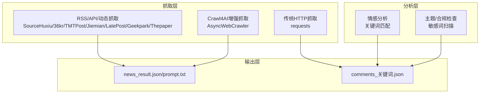
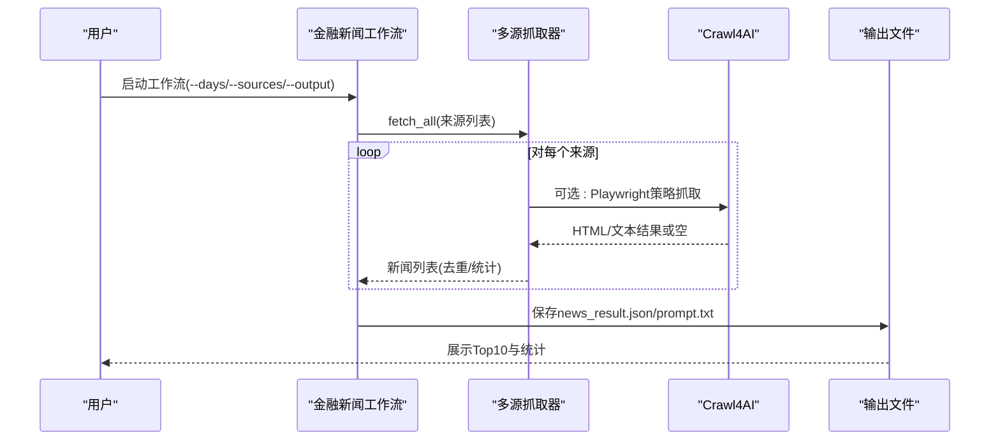
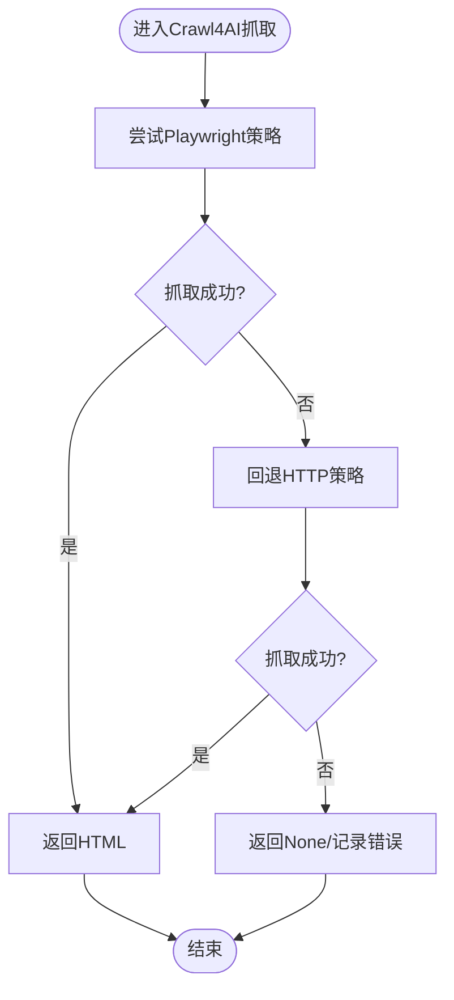
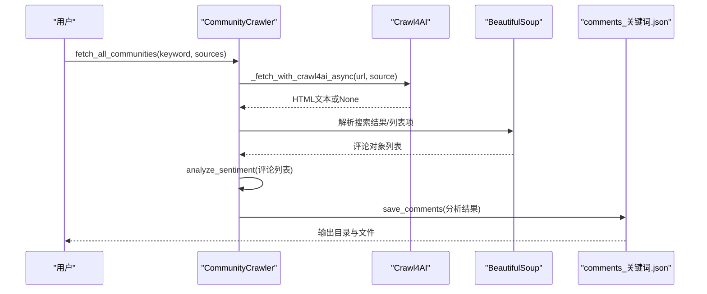
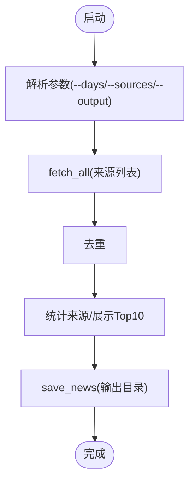
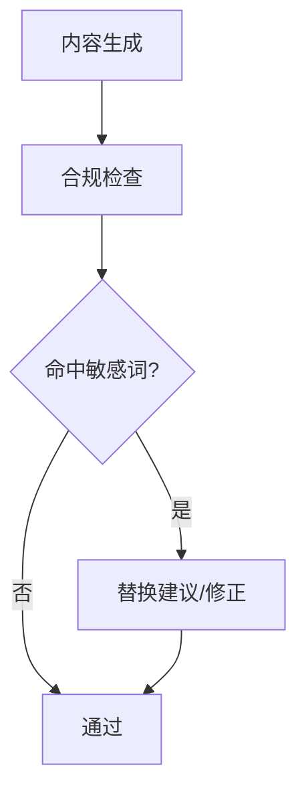
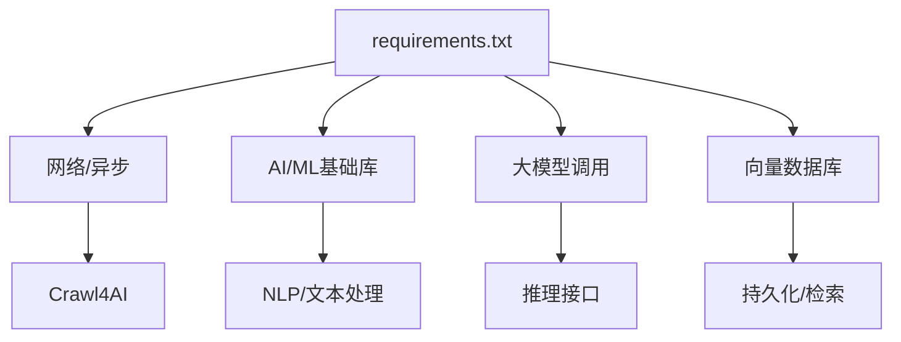

# AI模型集成

<cite>
**本文引用的文件**
- [financial_news_workflow_crawl4ai.py](file://financial_news_workflow_crawl4ai.py)
- [community_crawler.py](file://community_crawler.py)
- [test_crawl4ai.py](file://test_crawl4ai.py)
- [requirements.txt](file://requirements.txt)
- [docs/RUN.md](file://docs/RUN.md)
- [news_source_test_result.json](file://news_source_test_result.json)
- [.agents/skills/china-financial-news-writer/SKILL.md](file://.agents/skills/china-financial-news-writer/SKILL.md)
</cite>

## 目录
1. [简介](#简介)
2. [项目结构](#项目结构)
3. [核心组件](#核心组件)
4. [架构总览](#架构总览)
5. [组件详解](#组件详解)
6. [依赖关系分析](#依赖关系分析)
7. [性能考量](#性能考量)
8. [故障排查指南](#故障排查指南)
9. [结论](#结论)
10. [附录](#附录)

## 简介
本文件面向开发者，系统化阐述如何在Redbook系统中集成AI模型与算法，围绕Crawl4AI、NLP与机器学习能力，构建“抓取-分析-合规”的AI增强工作流。文档涵盖：
- AI分析框架的架构设计：模型加载、推理接口、结果处理
- 具体模型集成示例：情感分析、主题抽取、合规检查
- 配置管理、版本控制与性能监控
- 训练数据准备、评估指标与部署策略
- 为新增模型提供可复用的集成范式，确保系统分析能力持续增强

## 项目结构
Redbook项目包含两类与AI分析密切相关的脚本：
- 金融新闻自动化工作流：基于多源RSS/API/动态渲染抓取，输出标准化新闻结果与分析提示词
- 社区论坛抓取与情感分析：基于Crawl4AI与传统HTTP抓取，对评论进行简单情感打分与保存

**图表来源**
- [financial_news_workflow_crawl4ai.py:94-358](file://financial_news_workflow_crawl4ai.py#L94-L358)
- [community_crawler.py:127-410](file://community_crawler.py#L127-L410)
- [community_crawler.py:444-465](file://community_crawler.py#L444-L465)

**章节来源**
- [financial_news_workflow_crawl4ai.py:94-358](file://financial_news_workflow_crawl4ai.py#L94-L358)
- [community_crawler.py:127-410](file://community_crawler.py#L127-L410)
- [docs/RUN.md:50-112](file://docs/RUN.md#L50-L112)

## 核心组件
- 多源抓取器：封装7大权威媒体的RSS/API/Playwright抓取逻辑，统一输出结构化新闻
- Crawl4AI增强抓取：在动态渲染与反爬场景下，优先使用Playwright策略，失败时回退HTTP策略
- 社区评论抓取：对雪球、知乎等社区进行搜索与解析，输出评论集合
- 情感分析：基于中文关键词匹配的简单情感打分
- 合规检查：敏感词扫描与合规规则校验（在技能框架中定义）

**章节来源**
- [financial_news_workflow_crawl4ai.py:94-358](file://financial_news_workflow_crawl4ai.py#L94-L358)
- [community_crawler.py:127-410](file://community_crawler.py#L127-L410)
- [community_crawler.py:444-465](file://community_crawler.py#L444-L465)
- [.agents/skills/china-financial-news-writer/SKILL.md:249-266](file://.agents/skills/china-financial-news-writer/SKILL.md#L249-L266)

## 架构总览
整体采用“抓取-分析-输出”的流水线架构，AI能力以Crawl4AI与NLP模块形式嵌入，既保证稳定性（HTTP回退），又提升对复杂网页的解析能力。

**图表来源**
- [financial_news_workflow_crawl4ai.py:363-450](file://financial_news_workflow_crawl4ai.py#L363-L450)

**章节来源**
- [financial_news_workflow_crawl4ai.py:363-450](file://financial_news_workflow_crawl4ai.py#L363-L450)

## 组件详解

### 组件A：Crawl4AI增强抓取与回退策略
- 设计要点
  - 优先使用Playwright策略应对动态渲染与反爬
  - 失败时自动切换HTTP策略，保证抓取成功率
  - 统一返回HTML文本，便于后续解析
- 关键接口
  - 异步抓取入口：AsyncWebCrawler + AsyncPlaywrightCrawlerStrategy
  - 回退策略：AsyncHTTPCrawlerStrategy
- 结果处理
  - 返回对象具备html/text属性，便于后续BeautifulSoup解析

**图表来源**
- [community_crawler.py:127-169](file://community_crawler.py#L127-L169)

**章节来源**
- [community_crawler.py:127-169](file://community_crawler.py#L127-L169)
- [test_crawl4ai.py:29-119](file://test_crawl4ai.py#L29-L119)

### 组件B：社区评论抓取与情感分析
- 设计要点
  - 支持雪球、知乎搜索结果解析
  - 清洗HTML，提取标题、链接、作者、时间、点赞/评论数等字段
  - 简单情感分析：基于正负向词典进行关键词计数打分
- 关键接口
  - fetch_all_communities(keyword, sources)
  - analyze_sentiment(comments)
  - save_comments(comments, keyword)

**图表来源**
- [community_crawler.py:197-410](file://community_crawler.py#L197-L410)
- [community_crawler.py:444-465](file://community_crawler.py#L444-L465)

**章节来源**
- [community_crawler.py:197-410](file://community_crawler.py#L197-L410)
- [community_crawler.py:444-465](file://community_crawler.py#L444-L465)

### 组件C：金融新闻抓取与提示词生成
- 设计要点
  - 封装7个来源的抓取器类，统一返回结构化新闻
  - 去重、统计来源分布、展示Top10
  - 保存news_result.json与prompt.txt
- 关键接口
  - fetch_all(sources, days, filter_companies)
  - save_news(news_list, output_dir)

**图表来源**
- [financial_news_workflow_crawl4ai.py:405-450](file://financial_news_workflow_crawl4ai.py#L405-L450)

**章节来源**
- [financial_news_workflow_crawl4ai.py:405-450](file://financial_news_workflow_crawl4ai.py#L405-L450)

### 组件D：合规检查与敏感词扫描（技能框架）
- 设计要点
  - 在写作/分析流程中进行敏感词扫描与合规校验
  - 规则与替换建议在技能文档中定义
- 关键接口
  - 合规检查阶段（在技能框架中定义）

**图表来源**
- [.agents/skills/china-financial-news-writer/SKILL.md:249-266](file://.agents/skills/china-financial-news-writer/SKILL.md#L249-L266)

**章节来源**
- [.agents/skills/china-financial-news-writer/SKILL.md:249-266](file://.agents/skills/china-financial-news-writer/SKILL.md#L249-L266)

## 依赖关系分析
- Crawl4AI相关依赖集中在requirements.txt中，包含：
  - 网络与异步：requests、httpx、aiohttp、playwright、patchright
  - AI/ML：numpy、scipy、scikit-learn、nltk、rank-bm25、snowballstemmer
  - 大模型调用：litellm、openai、tiktoken、tokenizers、huggingface-hub
  - 向量数据库：aiosqlite
  - 其他：rich、pydantic、typing-extensions等

**图表来源**
- [requirements.txt:67-98](file://requirements.txt#L67-L98)

**章节来源**
- [requirements.txt:67-98](file://requirements.txt#L67-L98)

## 性能考量
- 抓取并发与稳定性
  - 对Playwright浏览器进行headless模式与超时控制，降低资源占用
  - 回退策略减少失败重试成本
- 解析与存储
  - 使用BeautifulSoup解析HTML，注意选择器健壮性与容错
  - 统一JSON输出结构，便于后续分析与可视化
- 网络与反爬
  - 使用合理的User-Agent与请求头，必要时结合代理轮换
  - 对RSS/API源优先使用官方接口，减少动态渲染开销

[本节为通用指导，无需列出具体文件来源]

## 故障排查指南
- Crawl4AI不可用
  - 现象：导入失败或功能受限
  - 处理：安装crawl4ai及相关依赖；确认Playwright浏览器已安装
- Playwright启动失败
  - 现象：浏览器无法启动或超时
  - 处理：执行安装命令；以管理员权限运行；检查系统权限
- 源站点抓取失败
  - 现象：部分源返回空或错误
  - 处理：查看测试结果文件；缩小来源范围；调整参数（如--days）
- 依赖安装失败
  - 现象：pip安装报错
  - 处理：升级pip；使用二进制安装；检查网络

**章节来源**
- [test_crawl4ai.py:15-22](file://test_crawl4ai.py#L15-L22)
- [docs/RUN.md:144-161](file://docs/RUN.md#L144-L161)
- [news_source_test_result.json:8-12](file://news_source_test_result.json#L8-L12)

## 结论
Redbook系统通过Crawl4AI与NLP模块，实现了对多源新闻与社区评论的高效抓取与初步分析。现有架构清晰、扩展点明确，适合在此基础上集成更成熟的NLP模型（如情感分析、主题抽取、合规检查）与机器学习算法，以进一步提升系统的智能化水平与分析精度。

[本节为总结性内容，无需列出具体文件来源]

## 附录

### A. 模型集成示例（范式）
- 情感分析模型
  - 输入：评论文本
  - 推理接口：可接入scikit-learn或transformers模型，统一返回情感类别与置信度
  - 结果处理：写入comments_关键词.json的每条评论字段
- 主题抽取模型
  - 输入：新闻正文/评论
  - 推理接口：TF-IDF、BM25或BERT句子嵌入聚类
  - 结果处理：在news_result.json中增加主题标签字段
- 合规检查模型
  - 输入：生成内容
  - 推理接口：基于规则引擎或轻量分类模型进行敏感词/合规性判定
  - 结果处理：在技能框架的合规阶段插入判定与替换建议

[本节为概念性内容，无需列出具体文件来源]

### B. 配置管理与版本控制
- 依赖版本
  - 使用requirements.txt集中管理，建议固定版本并定期审阅
- 模型版本
  - 将模型文件纳入版本控制或制品库，标注版本号与评估指标
- 运行参数
  - 通过命令行参数与环境变量控制抓取范围、输出目录与开关

**章节来源**
- [requirements.txt:132-143](file://requirements.txt#L132-L143)
- [docs/RUN.md:75-80](file://docs/RUN.md#L75-L80)

### C. 性能监控与评估
- 抓取成功率与耗时
  - 记录各源抓取数量、错误类型与耗时，形成监控报表
- 分析质量
  - 情感分析：人工抽样评估准确率、召回率
  - 主题抽取：一致性与覆盖率评估
- 合规检查
  - 命中率与误报率统计，持续优化规则与阈值

**章节来源**
- [news_source_test_result.json:4-73](file://news_source_test_result.json#L4-L73)

### D. 部署策略
- 本地开发
  - 使用requirements.txt安装依赖；Playwright安装Chromium
- CI/CD
  - 在流水线中执行抓取与测试脚本，产出结果文件供后续分析
- 运维
  - 定期更新依赖；监控抓取失败率；按需扩容抓取节点

**章节来源**
- [docs/RUN.md:180-188](file://docs/RUN.md#L180-L188)