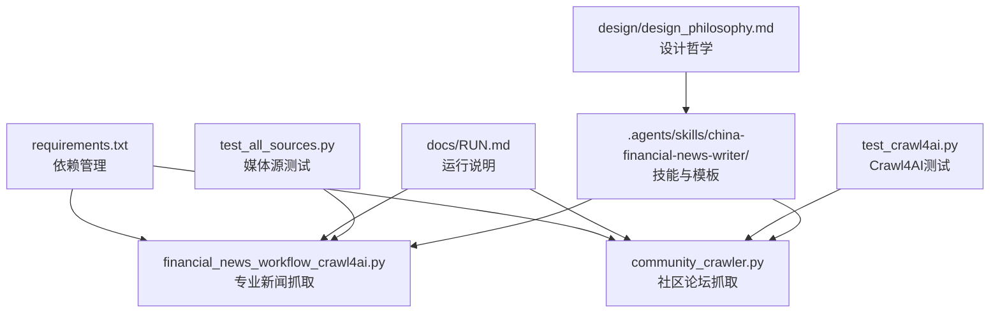
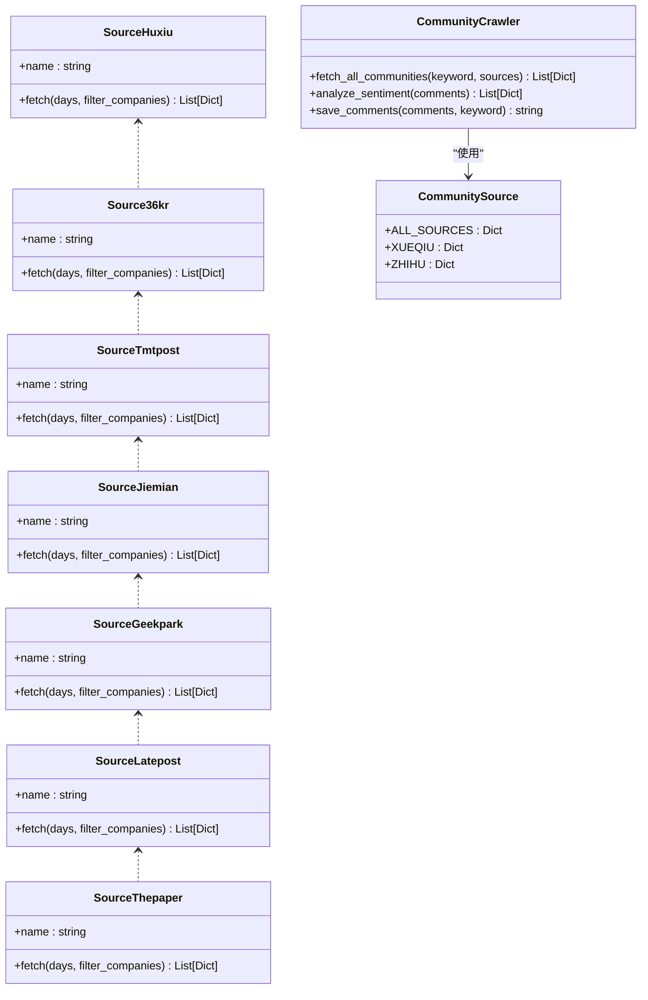
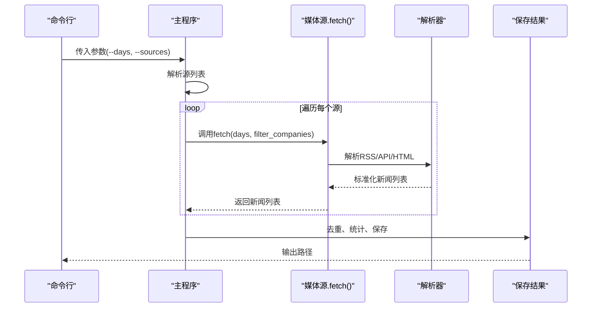
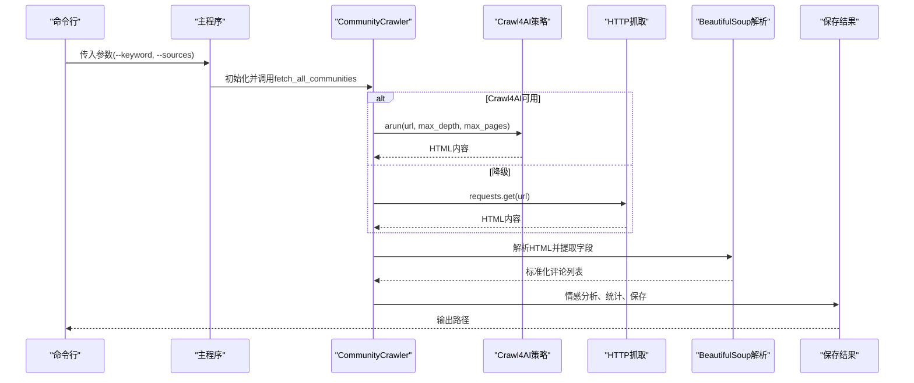
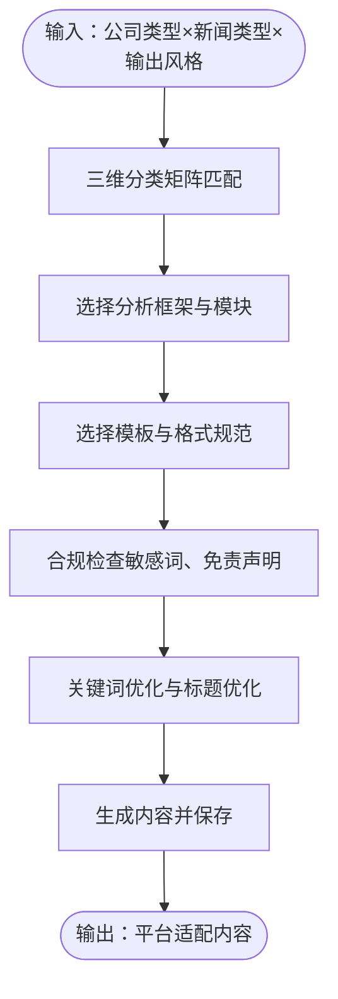
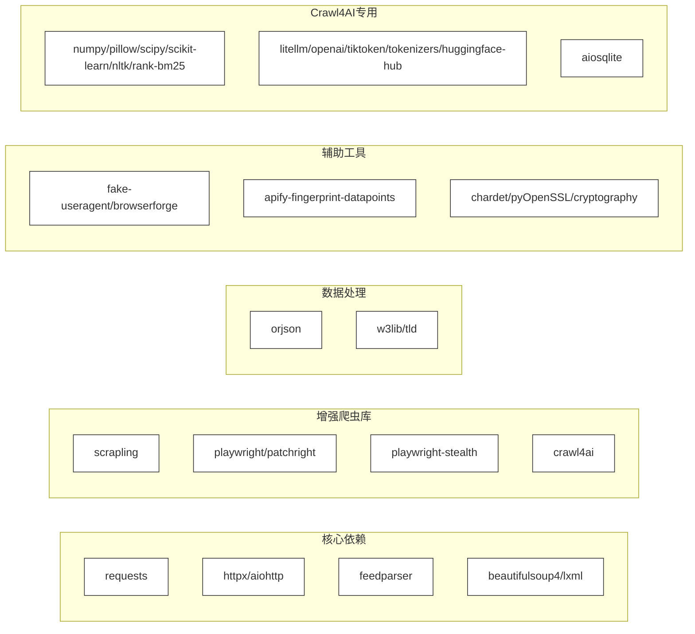

# 扩展开发指南

<cite>
**本文档引用的文件**
- [requirements.txt](file://requirements.txt)
- [docs/RUN.md](file://docs/RUN.md)
- [financial_news_workflow_crawl4ai.py](file://financial_news_workflow_crawl4ai.py)
- [community_crawler.py](file://community_crawler.py)
- [test_all_sources.py](file://test_all_sources.py)
- [test_crawl4ai.py](file://test_crawl4ai.py)
- [.agents/skills/china-financial-news-writer/SKILL.md](file://.agents/skills/china-financial-news-writer/SKILL.md)
- [.agents/skills/china-financial-news-writer/references/universal_financial_analysis_framework.md](file://.agents/skills/china-financial-news-writer/references/universal_financial_analysis_framework.md)
- [.agents/skills/china-financial-news-writer/references/template-xiaohongshu.md](file://.agents/skills/china-financial-news-writer/references/template-xiaohongshu.md)
- [.agents/skills/china-financial-news-writer/references/template-wechat.md](file://.agents/skills/china-financial-news-writer/references/template-wechat.md)
- [design/design_philosophy.md](file://design/design_philosophy.md)
</cite>

## 目录
1. [简介](#简介)
2. [项目结构](#项目结构)
3. [核心组件](#核心组件)
4. [架构总览](#架构总览)
5. [详细组件分析](#详细组件分析)
6. [依赖分析](#依赖分析)
7. [性能考量](#性能考量)
8. [故障排查指南](#故障排查指南)
9. [结论](#结论)
10. [附录](#附录)

## 简介
本指南面向希望扩展该金融内容生产与分析系统的开发者，涵盖新增媒体源插件、自定义分析算法与第三方集成的完整开发流程。系统采用模块化架构，支持多种抓取策略（RSS、API、requests、Playwright、Crawl4AI），并通过统一的输出规范与模板体系实现内容生成与合规检查。本文将从架构设计、接口规范、扩展点识别、钩子函数使用、配置管理、测试策略、调试技巧到发布流程，提供循序渐进的实践指导。

## 项目结构
项目由多个独立脚本组成，分别负责专业新闻抓取、社区论坛抓取、Crawl4AI功能测试与技能模板体系。核心文件如下：
- 专业新闻抓取：financial_news_workflow_crawl4ai.py
- 社区论坛抓取：community_crawler.py
- 依赖管理：requirements.txt
- 运行说明：docs/RUN.md
- 扩展测试：test_all_sources.py、test_crawl4ai.py
- 技能与模板：.agents/skills/china-financial-news-writer/*
- 设计哲学：design/design_philosophy.md

**图表来源**
- [requirements.txt:1-144](file://requirements.txt#L1-L144)
- [financial_news_workflow_crawl4ai.py:1-454](file://financial_news_workflow_crawl4ai.py#L1-L454)
- [community_crawler.py:1-604](file://community_crawler.py#L1-L604)
- [docs/RUN.md:1-252](file://docs/RUN.md#L1-L252)
- [test_all_sources.py:1-49](file://test_all_sources.py#L1-L49)
- [test_crawl4ai.py:1-163](file://test_crawl4ai.py#L1-L163)
- [.agents/skills/china-financial-news-writer/SKILL.md:1-476](file://.agents/skills/china-financial-news-writer/SKILL.md#L1-L476)
- [design/design_philosophy.md:1-16](file://design/design_philosophy.md#L1-L16)

**章节来源**
- [requirements.txt:1-144](file://requirements.txt#L1-L144)
- [docs/RUN.md:1-252](file://docs/RUN.md#L1-L252)

## 核心组件
- 专业新闻抓取引擎：基于多种抓取策略（RSS、API、requests、Playwright）聚合7大权威媒体，支持去重、统计与输出。
- 社区论坛抓取器：支持雪球、知乎等社区，具备Crawl4AI增强抓取与传统HTTP抓取双通道，内置情感分析与统计输出。
- 模板与技能体系：提供小红书、公众号等风格的模板与合规检查、标题公式、关键词策略等方法论。
- 测试与验证：媒体源连通性测试与Crawl4AI功能测试，保障扩展后的稳定性。

**章节来源**
- [financial_news_workflow_crawl4ai.py:94-358](file://financial_news_workflow_crawl4ai.py#L94-L358)
- [community_crawler.py:82-496](file://community_crawler.py#L82-L496)
- [.agents/skills/china-financial-news-writer/SKILL.md:1-476](file://.agents/skills/china-financial-news-writer/SKILL.md#L1-L476)

## 架构总览
系统采用“策略+适配器”模式，每个媒体源封装为独立类，统一暴露fetch接口；社区抓取器支持Crawl4AI与传统HTTP两种抓取策略，并提供统一的数据结构输出。模板与技能体系通过配置化的模板库与分析框架实现内容生成与合规检查。

**图表来源**
- [financial_news_workflow_crawl4ai.py:94-358](file://financial_news_workflow_crawl4ai.py#L94-L358)
- [community_crawler.py:56-77](file://community_crawler.py#L56-L77)

## 详细组件分析

### 专业新闻抓取组件（媒体源插件）
- 插件架构：每个媒体源实现统一的静态方法fetch，接收days与filter_companies参数，返回标准化新闻列表。
- 扩展点：在source_map中注册新源类名与类映射；在fetch_all中加入新源；在命令行参数中添加新源选项。
- 接口规范：fetch返回字段包含source、title、link、summary、published；支持可选的公司名过滤。
- 典型实现模式：RSS源使用feedparser解析；API源使用requests；动态渲染使用Playwright；普通站点使用requests解析。

**图表来源**
- [financial_news_workflow_crawl4ai.py:363-450](file://financial_news_workflow_crawl4ai.py#L363-L450)

**章节来源**
- [financial_news_workflow_crawl4ai.py:94-358](file://financial_news_workflow_crawl4ai.py#L94-L358)
- [financial_news_workflow_crawl4ai.py:363-450](file://financial_news_workflow_crawl4ai.py#L363-L450)
- [test_all_sources.py:18-48](file://test_all_sources.py#L18-L48)

### 社区论坛抓取组件（第三方集成）
- 插件架构：CommunityCrawler统一管理抓取流程，支持Crawl4AI增强抓取与传统HTTP抓取双通道。
- 扩展点：在CommunitySource中新增源配置；在CommunityCrawler中新增对应抓取方法；在fetch_all_communities中注册。
- 接口规范：抓取方法返回标准化评论列表，包含source、keyword、title、content、link、author、time、like_count、comment_count、fetched_at等字段。
- 第三方集成：Crawl4AI提供AsyncWebCrawler与AsyncPlaywrightCrawlerStrategy/AsyncHTTPCrawlerStrategy，支持复杂页面与反爬场景。

**图表来源**
- [community_crawler.py:127-175](file://community_crawler.py#L127-L175)
- [community_crawler.py:179-193](file://community_crawler.py#L179-L193)
- [community_crawler.py:413-496](file://community_crawler.py#L413-L496)

**章节来源**
- [community_crawler.py:56-77](file://community_crawler.py#L56-L77)
- [community_crawler.py:82-496](file://community_crawler.py#L82-L496)
- [test_crawl4ai.py:1-163](file://test_crawl4ai.py#L1-L163)

### 模板与分析框架（自定义分析算法）
- 模板体系：提供小红书、公众号等风格的模板与标题公式、标签布局、互动设计等规范。
- 分析框架：万能财经分析框架包含12大模块（事件引爆点、战略失误分析、市场竞争格局、财务深度分析、全网舆情分析、技术路线分析、历史对比分析、未来预测模块、故事化叙事、情感共鸣点、互动设计、图表模板库），支持按平台适配。
- 扩展点：新增模板文件、新增分析模块、新增平台适配权重。

**图表来源**
- [.agents/skills/china-financial-news-writer/SKILL.md:24-52](file://.agents/skills/china-financial-news-writer/SKILL.md#L24-L52)
- [.agents/skills/china-financial-news-writer/references/universal_financial_analysis_framework.md:1-126](file://.agents/skills/china-financial-news-writer/references/universal_financial_analysis_framework.md#L1-L126)
- [.agents/skills/china-financial-news-writer/references/template-xiaohongshu.md:1-424](file://.agents/skills/china-financial-news-writer/references/template-xiaohongshu.md#L1-L424)
- [.agents/skills/china-financial-news-writer/references/template-wechat.md:1-518](file://.agents/skills/china-financial-news-writer/references/template-wechat.md#L1-L518)

**章节来源**
- [.agents/skills/china-financial-news-writer/SKILL.md:1-476](file://.agents/skills/china-financial-news-writer/SKILL.md#L1-L476)
- [.agents/skills/china-financial-news-writer/references/universal_financial_analysis_framework.md:1-126](file://.agents/skills/china-financial-news-writer/references/universal_financial_analysis_framework.md#L1-L126)
- [.agents/skills/china-financial-news-writer/references/template-xiaohongshu.md:1-424](file://.agents/skills/china-financial-news-writer/references/template-xiaohongshu.md#L1-L424)
- [.agents/skills/china-financial-news-writer/references/template-wechat.md:1-518](file://.agents/skills/china-financial-news-writer/references/template-wechat.md#L1-L518)

## 依赖分析
系统依赖分为核心依赖、增强爬虫库、数据处理、辅助工具、Crawl4AI专用依赖等类别。新增扩展时应遵循最小依赖原则，尽量复用已有库，避免重复造轮子。

**图表来源**
- [requirements.txt:6-144](file://requirements.txt#L6-L144)

**章节来源**
- [requirements.txt:1-144](file://requirements.txt#L1-L144)

## 性能考量
- 并发与异步：社区抓取器使用async/await与Crawl4AI异步策略，提高IO密集型任务吞吐。
- 降级策略：当Crawl4AI不可用时自动回退到HTTP策略；当Playwright不可用时回退到requests。
- 去重与缓存：专业新闻抓取阶段进行标题去重，减少重复存储与后续处理开销。
- 超时与重试：为网络请求设置合理超时与异常处理，避免阻塞主线程。
- 资源释放：Playwright浏览器实例在使用后及时关闭，避免资源泄漏。

[本节为通用性能建议，无需特定文件引用]

## 故障排查指南
- 依赖安装失败：升级pip，使用二进制安装，检查网络连接。
- Playwright启动失败：确认已安装Chromium，以管理员权限运行，检查系统权限。
- 抓取失败：检查目标网站robots.txt，适当减少并发与抓取范围，查看命令行输出的错误信息。
- Crawl4AI功能异常：检查网络连接与API配置，尝试HTTP策略作为降级方案。
- 编码问题：Windows控制台使用UTF-8包装，避免输出乱码。

**章节来源**
- [docs/RUN.md:144-188](file://docs/RUN.md#L144-L188)
- [test_crawl4ai.py:1-163](file://test_crawl4ai.py#L1-L163)

## 结论
本指南提供了从架构设计到扩展实现的完整路径。通过统一的插件接口、灵活的抓取策略与强大的模板体系，开发者可以快速新增媒体源、集成第三方能力并定制分析算法。建议在扩展时遵循最小依赖、可测试性与可维护性的原则，确保新功能与现有系统无缝集成。

[本节为总结性内容，无需特定文件引用]

## 附录

### 开发流程与最佳实践
- 新增媒体源插件
  - 在source_map中注册新源类名与类映射
  - 在命令行参数中添加新源选项
  - 在fetch_all中加入新源调用
  - 编写单元测试验证连通性与解析正确性
- 自定义分析算法
  - 在万能分析框架中新增模块或权重
  - 在模板体系中新增平台适配规则
  - 编写合规检查与关键词优化逻辑
- 第三方集成
  - 优先使用Crawl4AI增强抓取能力
  - 提供HTTP降级策略
  - 统一数据结构与输出格式
- 配置管理
  - 使用环境变量与配置文件分离敏感信息
  - 为不同环境提供默认值与覆盖机制
- 测试策略
  - 单元测试：验证媒体源fetch方法与解析逻辑
  - 集成测试：验证抓取流程与输出文件
  - 回归测试：定期运行test_all_sources.py与test_crawl4ai.py
- 调试技巧
  - 使用详细日志输出中间状态
  - 逐步缩小问题范围（网络、解析、输出）
  - 使用最小化样例复现问题
- 发布流程
  - 更新requirements.txt与依赖版本
  - 编写变更日志与运行说明
  - 进行端到端集成测试
  - 打包发布并提供迁移指南

[本节为实践建议，无需特定文件引用]