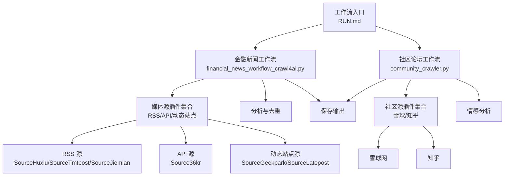
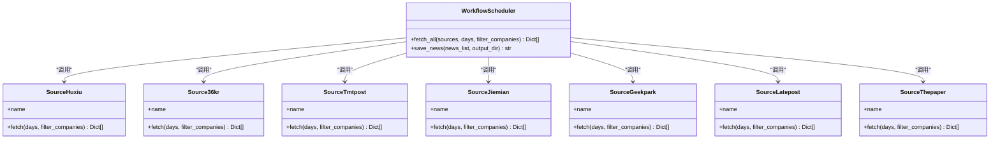
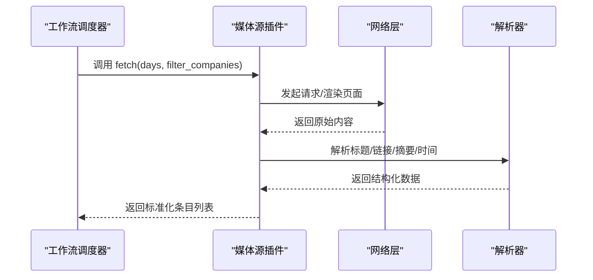
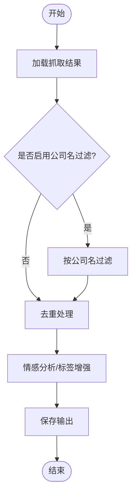
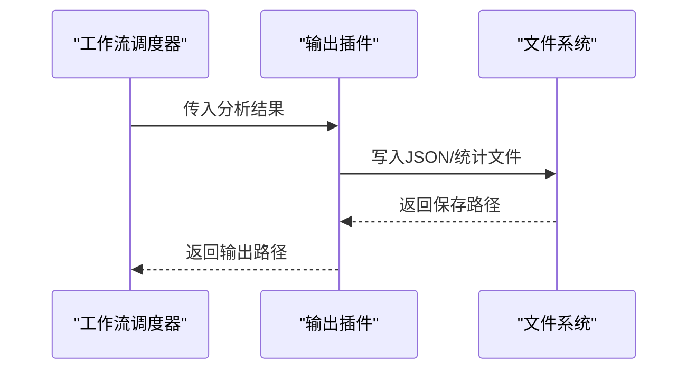
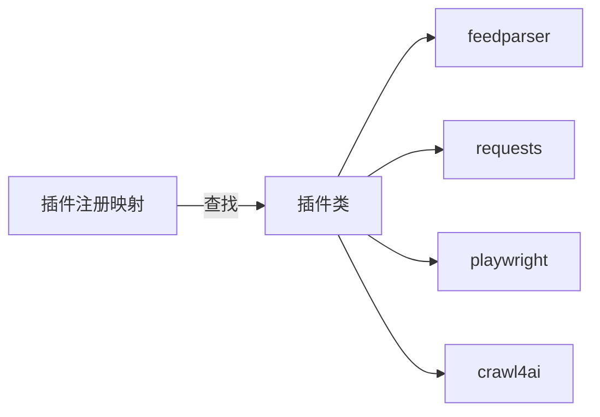
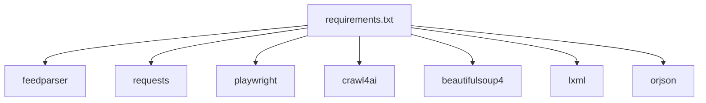

# 插件开发

<cite>
**本文引用的文件**
- [requirements.txt](file://requirements.txt)
- [financial_news_workflow_crawl4ai.py](file://financial_news_workflow_crawl4ai.py)
- [community_crawler.py](file://community_crawler.py)
- [test_all_sources.py](file://test_all_sources.py)
- [test_crawl4ai.py](file://test_crawl4ai.py)
- [docs/RUN.md](file://docs/RUN.md)
- [design_philosophy.md](file://design/design_philosophy.md)
</cite>

## 目录
1. [简介](#简介)
2. [项目结构](#项目结构)
3. [核心组件](#核心组件)
4. [架构总览](#架构总览)
5. [详细组件分析](#详细组件分析)
6. [依赖分析](#依赖分析)
7. [性能考虑](#性能考虑)
8. [故障排查指南](#故障排查指南)
9. [结论](#结论)
10. [附录](#附录)

## 简介
本文件面向希望为 Redbook 项目开发“插件”的开发者，系统性阐述插件架构设计与开发实践，覆盖媒体源插件、分析插件与输出插件的开发模式；明确插件接口规范、生命周期管理与配置机制；提供新增媒体源（RSS、动态网站、API）的完整实现示例路径；解释插件注册机制、依赖注入与错误处理；并给出测试方法、调试技巧与性能优化建议，确保新插件与现有系统无缝集成。

## 项目结构
Redbook 当前以“脚本化工作流”为主，围绕“金融新闻抓取 + 社区评论抓取”两条主线组织代码。插件化扩展应遵循以下原则：
- 插件以“模块化类/函数”形式存在，暴露统一的抓取接口；
- 插件注册通过集中映射表进行管理；
- 插件生命周期由工作流调度，包含初始化、抓取、解析、去重、保存等阶段；
- 插件配置通过参数传递与环境变量结合，必要时支持配置文件；
- 插件错误处理遵循统一的日志与回退策略。

图表来源
- [docs/RUN.md:50-112](file://docs/RUN.md#L50-L112)
- [financial_news_workflow_crawl4ai.py:363-382](file://financial_news_workflow_crawl4ai.py#L363-L382)
- [community_crawler.py:74-77](file://community_crawler.py#L74-L77)

章节来源
- [docs/RUN.md:1-252](file://docs/RUN.md#L1-L252)
- [financial_news_workflow_crawl4ai.py:1-454](file://financial_news_workflow_crawl4ai.py#L1-L454)
- [community_crawler.py:1-604](file://community_crawler.py#L1-L604)

## 核心组件
- 媒体源插件（SourceXxx）：封装单个媒体的数据源特性，统一实现抓取方法，返回标准化新闻条目。
- 工作流调度器：负责选择插件、并发/串行执行、去重、保存与输出。
- 分析与输出：对抓取结果进行分析（如公司名过滤、情感分析）、生成报告与文件。
- 测试与验证：提供针对各插件的单元测试与集成测试脚本。

章节来源
- [financial_news_workflow_crawl4ai.py:94-358](file://financial_news_workflow_crawl4ai.py#L94-L358)
- [community_crawler.py:82-496](file://community_crawler.py#L82-L496)
- [test_all_sources.py:1-49](file://test_all_sources.py#L1-L49)
- [test_crawl4ai.py:1-163](file://test_crawl4ai.py#L1-L163)

## 架构总览
Redbook 插件架构采用“类驱动 + 映射注册”的轻量插件体系：
- 插件接口规范：每个媒体源插件类提供静态方法或实例方法，统一签名，返回标准化字段（来源、标题、链接、摘要、发布时间等）。
- 生命周期管理：工作流在运行时按需调用插件的抓取方法，随后进行去重与保存。
- 配置机制：通过命令行参数、全局常量或环境变量控制抓取范围、过滤策略与输出目录。
- 依赖注入：通过导入第三方库（如 feedparser、requests、playwright、crawl4ai）实现能力注入；工作流根据可用能力选择抓取策略。

图表来源
- [financial_news_workflow_crawl4ai.py:94-358](file://financial_news_workflow_crawl4ai.py#L94-L358)
- [financial_news_workflow_crawl4ai.py:363-382](file://financial_news_workflow_crawl4ai.py#L363-L382)

章节来源
- [financial_news_workflow_crawl4ai.py:94-358](file://financial_news_workflow_crawl4ai.py#L94-L358)
- [financial_news_workflow_crawl4ai.py:363-382](file://financial_news_workflow_crawl4ai.py#L363-L382)

## 详细组件分析

### 媒体源插件开发模式
- 接口规范
  - 类型：类或命名空间，包含 name 字段与 fetch 方法。
  - 签名：fetch(days=3, filter_companies=False) -> List[Dict]。
  - 返回字段：source、title、link、summary、published 等。
- 生命周期
  - 初始化：读取全局常量（如公司名列表）与配置（如 days、filter_companies）。
  - 抓取：根据媒体类型选择合适的技术栈（RSS、API、动态渲染）。
  - 解析：提取标题、链接、摘要、发布时间等字段。
  - 过滤：可选的公司名过滤逻辑。
  - 结果：返回标准化条目列表。
- 错误处理
  - 捕获网络异常、解析异常与空结果，记录错误并返回空列表或降级结果。

图表来源
- [financial_news_workflow_crawl4ai.py:94-358](file://financial_news_workflow_crawl4ai.py#L94-L358)

章节来源
- [financial_news_workflow_crawl4ai.py:94-358](file://financial_news_workflow_crawl4ai.py#L94-L358)

### 分析插件开发模式
- 接口规范
  - 输入：抓取得到的新闻条目列表。
  - 输出：增强后的条目（如添加情感标签、置信度、分组统计）。
- 常见实现
  - 公司名过滤：基于关键词集合筛选标题。
  - 去重：按标题去重，保留首次出现条目。
  - 情感分析：基于关键词匹配或外部模型（如 Crawl4AI）。
- 生命周期
  - 在抓取完成后调用，贯穿保存前的最终加工阶段。

图表来源
- [financial_news_workflow_crawl4ai.py:363-449](file://financial_news_workflow_crawl4ai.py#L363-L449)
- [community_crawler.py:444-465](file://community_crawler.py#L444-L465)

章节来源
- [financial_news_workflow_crawl4ai.py:363-449](file://financial_news_workflow_crawl4ai.py#L363-L449)
- [community_crawler.py:444-465](file://community_crawler.py#L444-L465)

### 输出插件开发模式
- 接口规范
  - 输入：分析后的条目列表。
  - 输出：文件（JSON、CSV、Markdown 等）与统计信息。
- 常见实现
  - JSON 输出：包含抓取时间、来源分布、条目明细。
  - 统计报表：按来源/情感/公司名分组统计。
- 生命周期
  - 在分析完成后执行，负责落盘与报告生成。

图表来源
- [financial_news_workflow_crawl4ai.py:384-403](file://financial_news_workflow_crawl4ai.py#L384-L403)
- [community_crawler.py:467-496](file://community_crawler.py#L467-L496)

章节来源
- [financial_news_workflow_crawl4ai.py:384-403](file://financial_news_workflow_crawl4ai.py#L384-L403)
- [community_crawler.py:467-496](file://community_crawler.py#L467-L496)

### 插件注册机制与依赖注入
- 注册机制
  - 工作流通过字典映射管理插件：键为源标识（如 huxiu、36kr），值为插件类。
  - 调用时按键查找并调用对应插件的 fetch 方法。
- 依赖注入
  - 通过导入第三方库实现能力注入：feedparser（RSS）、requests（HTTP）、playwright（动态渲染）、crawl4ai（AI增强抓取）。
  - 运行时检测依赖可用性，决定抓取策略与回退方案。

图表来源
- [financial_news_workflow_crawl4ai.py:366-374](file://financial_news_workflow_crawl4ai.py#L366-L374)
- [requirements.txt:13-36](file://requirements.txt#L13-L36)

章节来源
- [financial_news_workflow_crawl4ai.py:366-374](file://financial_news_workflow_crawl4ai.py#L366-L374)
- [requirements.txt:13-36](file://requirements.txt#L13-L36)

### 新媒体源添加示例（RSS、动态网站、API）

- RSS 源（以 SourceHuxiu/SourceTmtpost/SourceJiemian 为例）
  - 实现要点：使用 feedparser 解析 RSS 源，遍历 entries 提取标题、链接、摘要、发布时间。
  - 参考路径：[RSS 源实现:94-119](file://financial_news_workflow_crawl4ai.py#L94-L119)、[RSS 源实现:158-183](file://financial_news_workflow_crawl4ai.py#L158-L183)、[RSS 源实现:186-212](file://financial_news_workflow_crawl4ai.py#L186-L212)
  - 注册方式：在映射表中添加键值对，键为源标识，值为类名。
  - 参考路径：[插件注册映射:366-374](file://financial_news_workflow_crawl4ai.py#L366-L374)

- 动态网站源（以 SourceGeekpark/SourceLatepost 为例）
  - 实现要点：使用 Playwright 启动无头浏览器，等待页面加载，提取链接与标题。
  - 参考路径：[动态源实现:215-263](file://financial_news_workflow_crawl4ai.py#L215-L263)、[动态源实现:266-318](file://financial_news_workflow_crawl4ai.py#L266-L318)
  - 回退策略：若 Playwright 不可用，可降级为 requests 抓取（视具体源而定）。
  - 参考路径：[回退策略示例:127-170](file://community_crawler.py#L127-L170)

- API 源（以 Source36kr 为例）
  - 实现要点：使用 requests 发送 HTTP 请求，解析 JSON 数据，构造标准条目。
  - 参考路径：[API 源实现:122-155](file://financial_news_workflow_crawl4ai.py#L122-L155)
  - 错误处理：捕获网络异常与解析异常，返回空列表或降级结果。
  - 参考路径：[错误处理示例:117-118](file://financial_news_workflow_crawl4ai.py#L117-L118)

章节来源
- [financial_news_workflow_crawl4ai.py:94-155](file://financial_news_workflow_crawl4ai.py#L94-L155)
- [financial_news_workflow_crawl4ai.py:158-212](file://financial_news_workflow_crawl4ai.py#L158-L212)
- [financial_news_workflow_crawl4ai.py:215-263](file://financial_news_workflow_crawl4ai.py#L215-L263)
- [financial_news_workflow_crawl4ai.py:266-318](file://financial_news_workflow_crawl4ai.py#L266-L318)
- [financial_news_workflow_crawl4ai.py:366-374](file://financial_news_workflow_crawl4ai.py#L366-L374)
- [community_crawler.py:127-170](file://community_crawler.py#L127-L170)

### 配置机制
- 命令行参数
  - 金融新闻工作流：支持 --days、--sources、--output 等参数。
  - 社区工作流：支持 --keyword、--sources、--output 等参数。
  - 参考路径：[参数定义与用法:57-112](file://docs/RUN.md#L57-L112)
- 全局常量与过滤
  - 公司名列表与过滤函数：用于新闻标题筛选。
  - 参考路径：[公司名过滤:62-84](file://financial_news_workflow_crawl4ai.py#L62-L84)
- 输出目录
  - 自动创建带时间戳的输出目录，便于归档与溯源。
  - 参考路径：[输出目录创建:387-389](file://financial_news_workflow_crawl4ai.py#L387-L389)、[输出目录创建:86-89](file://community_crawler.py#L86-L89)

章节来源
- [docs/RUN.md:57-112](file://docs/RUN.md#L57-L112)
- [financial_news_workflow_crawl4ai.py:62-84](file://financial_news_workflow_crawl4ai.py#L62-L84)
- [financial_news_workflow_crawl4ai.py:387-389](file://financial_news_workflow_crawl4ai.py#L387-L389)
- [community_crawler.py:86-89](file://community_crawler.py#L86-L89)

## 依赖分析
- 核心依赖
  - 网络请求：requests、httpx、aiohttp
  - RSS 解析：feedparser
  - HTML 解析：beautifulsoup4、lxml、cssselect
  - 动态渲染：playwright、patchright、playwright-stealth
  - AI/增强抓取：crawl4ai
  - JSON 处理：orjson
  - 其他：rich、pygments、typer、click、pydantic 等
- 插件能力矩阵
  - RSS 源：依赖 feedparser
  - API 源：依赖 requests
  - 动态站点源：依赖 playwright
  - 增强抓取：依赖 crawl4ai

图表来源
- [requirements.txt:13-36](file://requirements.txt#L13-L36)

章节来源
- [requirements.txt:13-36](file://requirements.txt#L13-L36)

## 性能考虑
- 并发与限速
  - 对于多个源并行抓取，建议引入异步与限速策略，避免对目标站点造成压力。
  - 参考路径：[异步增强抓取示例:127-170](file://community_crawler.py#L127-L170)
- 超时与重试
  - 为网络请求设置合理超时与指数退避重试，提高稳定性。
  - 参考路径：[超时设置示例:139-144](file://community_crawler.py#L139-L144)
- 解析优化
  - 使用高效的解析库（如 lxml）与选择器缓存，减少重复计算。
  - 参考路径：[解析选择器示例:214-231](file://community_crawler.py#L214-L231)
- 去重与内存
  - 使用集合去重，避免重复存储；对大结果集分批处理。
  - 参考路径：[去重实现:432-438](file://financial_news_workflow_crawl4ai.py#L432-L438)

章节来源
- [community_crawler.py:127-170](file://community_crawler.py#L127-L170)
- [community_crawler.py:214-231](file://community_crawler.py#L214-L231)
- [financial_news_workflow_crawl4ai.py:432-438](file://financial_news_workflow_crawl4ai.py#L432-L438)

## 故障排查指南
- 依赖缺失
  - 症状：导入失败或功能不可用。
  - 处理：根据 requirements.txt 安装缺失依赖；参考路径：[依赖安装说明:132-144](file://requirements.txt#L132-L144)
- Playwright 启动失败
  - 症状：浏览器无法启动或页面加载超时。
  - 处理：安装 Chromium 并运行 playwright install；参考路径：[Playwright 安装:44-48](file://docs/RUN.md#L44-L48)
- 抓取失败
  - 症状：返回空列表或抛出异常。
  - 处理：检查网络、目标站点结构变化、UA 与 Cookie 设置；参考路径：[错误处理示例:117-118](file://financial_news_workflow_crawl4ai.py#L117-L118)
- Crawl4AI 功能异常
  - 症状：抓取无结果或报错。
  - 处理：运行 Crawl4AI 功能测试脚本，确认安装与网络；参考路径：[Crawl4AI 测试:1-163](file://test_crawl4ai.py#L1-L163)
- 插件测试
  - 症状：插件无法连通或解析异常。
  - 处理：使用测试脚本逐一验证各插件；参考路径：[插件测试:1-49](file://test_all_sources.py#L1-L49)

章节来源
- [requirements.txt:132-144](file://requirements.txt#L132-L144)
- [docs/RUN.md:44-48](file://docs/RUN.md#L44-L48)
- [financial_news_workflow_crawl4ai.py:117-118](file://financial_news_workflow_crawl4ai.py#L117-L118)
- [test_crawl4ai.py:1-163](file://test_crawl4ai.py#L1-L163)
- [test_all_sources.py:1-49](file://test_all_sources.py#L1-L49)

## 结论
Redbook 的插件体系以“类驱动 + 映射注册”为核心，配合清晰的接口规范与生命周期管理，实现了媒体源、分析与输出的模块化扩展。通过合理的依赖注入与错误处理策略，开发者可以快速添加 RSS、动态网站与 API 媒体源插件，并将其无缝集成到现有工作流中。建议在新增插件时严格遵循本文规范，确保一致性与可维护性。

## 附录
- 设计哲学参考：用于理解项目整体风格与表达方式，有助于在插件输出与展示层面保持一致的视觉与语言风格。
  - 参考路径：[设计哲学:1-16](file://design/design_philosophy.md#L1-L16)