# 模板定制

<cite>
**本文引用的文件**
- [SKILL.md](file://.agents/skills/china-financial-news-writer/SKILL.md)
- [template-xiaohongshu.md](file://.agents/skills/china-financial-news-writer/references/template-xiaohongshu.md)
- [template-wechat.md](file://.agents/skills/china-financial-news-writer/references/template-wechat.md)
- [template-research.md](file://.agents/skills/china-financial-news-writer/references/template-research.md)
- [research-report-template.md](file://.agents/skills/china-financial-news-writer/references/research-report-template.md)
- [title-formulas.md](file://.agents/skills/china-financial-news-writer/references/title-formulas.md)
- [keyword-strategy.md](file://.agents/skills/china-financial-news-writer/references/keyword-strategy.md)
- [compliance-rules.md](file://.agents/skills/china-financial-news-writer/references/compliance-rules.md)
- [sensitive-words-finance.md](file://.agents/skills/china-financial-news-writer/references/sensitive-words-finance.md)
- [universal_financial_analysis_framework.md](file://.agents/skills/china-financial-news-writer/references/universal_financial_analysis_framework.md)
- [deep-research.md](file://.agents/skills/china-financial-news-writer/references/deep-research.md)
- [tech-giant.md](file://.agents/skills/china-financial-news-writer/subskills/tech-giant.md)
- [ev-maker.md](file://.agents/skills/china-financial-news-writer/subskills/ev-maker.md)
- [financial_news_workflow_crawl4ai.py](file://financial_news_workflow_crawl4ai.py)
- [community_crawler.py](file://community_crawler.py)
</cite>

## 目录
1. [简介](#简介)
2. [项目结构](#项目结构)
3. [核心组件](#核心组件)
4. [架构总览](#架构总览)
5. [详细组件分析](#详细组件分析)
6. [依赖分析](#依赖分析)
7. [性能考量](#性能考量)
8. [故障排查指南](#故障排查指南)
9. [结论](#结论)
10. [附录](#附录)

## 简介
本文件面向开发者与内容创作者，系统化阐述“模板定制”的完整方法论与实践路径。围绕研究报告模板、微信公众号模板与小红书内容模板，结合标题公式、关键词策略、合规规则与多平台适配，提供从设计到落地的全流程指导。同时，结合仓库内的分析框架、深度情报搜集与数据采集工具，帮助你构建可扩展、可维护、可测试的模板系统。

## 项目结构
模板系统以“技能”为中心，围绕“三维分类矩阵”（公司类型 × 新闻类型 × 输出风格）组织内容。模板库分为三类输出风格：小红书、公众号、研报；另有“深度分析报告”模板用于重大事件的全网深度调研输出。配套的标题公式、关键词策略、合规规则与分析框架共同构成模板系统的“元规则”。

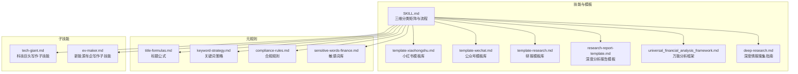

**图示来源**
- [SKILL.md:1-476](file://.agents/skills/china-financial-news-writer/SKILL.md#L1-L476)
- [template-xiaohongshu.md:1-424](file://.agents/skills/china-financial-news-writer/references/template-xiaohongshu.md#L1-L424)
- [template-wechat.md:1-518](file://.agents/skills/china-financial-news-writer/references/template-wechat.md#L1-L518)
- [template-research.md:1-459](file://.agents/skills/china-financial-news-writer/references/template-research.md#L1-L459)
- [research-report-template.md:1-395](file://.agents/skills/china-financial-news-writer/references/research-report-template.md#L1-L395)
- [universal_financial_analysis_framework.md:1-126](file://.agents/skills/china-financial-news-writer/references/universal_financial_analysis_framework.md#L1-L126)
- [deep-research.md:1-397](file://.agents/skills/china-financial-news-writer/references/deep-research.md#L1-L397)
- [title-formulas.md:1-288](file://.agents/skills/china-financial-news-writer/references/title-formulas.md#L1-L288)
- [keyword-strategy.md:1-302](file://.agents/skills/china-financial-news-writer/references/keyword-strategy.md#L1-L302)
- [compliance-rules.md:1-394](file://.agents/skills/china-financial-news-writer/references/compliance-rules.md#L1-L394)
- [sensitive-words-finance.md:1-317](file://.agents/skills/china-financial-news-writer/references/sensitive-words-finance.md#L1-L317)
- [tech-giant.md:1-345](file://.agents/skills/china-financial-news-writer/subskills/tech-giant.md#L1-L345)
- [ev-maker.md:1-398](file://.agents/skills/china-financial-news-writer/subskills/ev-maker.md#L1-L398)

**章节来源**
- [.agents/skills/china-financial-news-writer/SKILL.md:1-476](file://.agents/skills/china-financial-news-writer/SKILL.md#L1-L476)

## 核心组件
- 模板库
  - 小红书模板：强调情绪、短句、标签与互动设计，适合快速传播与用户参与。
  - 公众号模板：强调专业性与数据密度，适合深度解读与观点输出。
  - 研报模板：强调结构化、数据表格与图表规范，适合专业投资者与机构客户。
  - 深度分析报告模板：用于重大事件的全网深度调研，包含执行摘要、原因分析、全网观点汇总等。
- 元规则
  - 标题公式：提供多平台适配的标题公式，确保抓眼与合规。
  - 关键词策略：覆盖核心词、长尾词、场景词、人群词与修饰词的布局与密度。
  - 合规规则与敏感词库：明确禁止内容、合规表述与风险提示模板。
- 分析框架与情报搜集
  - 万能分析框架：12大模块覆盖事件、战略、竞争、技术、历史、预测等维度。
  - 深度情报搜集：6维情报网（新闻/视频/社交/论坛/官方/数据）。
- 子技能
  - 科技巨头写作子技能：聚焦用户规模、变现效率、监管影响等关键指标。
  - 新能源车企写作子技能：聚焦销量、毛利率、现金流、技术与产品分析。

**章节来源**
- [.agents/skills/china-financial-news-writer/references/template-xiaohongshu.md:1-424](file://.agents/skills/china-financial-news-writer/references/template-xiaohongshu.md#L1-L424)
- [.agents/skills/china-financial-news-writer/references/template-wechat.md:1-518](file://.agents/skills/china-financial-news-writer/references/template-wechat.md#L1-L518)
- [.agents/skills/china-financial-news-writer/references/template-research.md:1-459](file://.agents/skills/china-financial-news-writer/references/template-research.md#L1-L459)
- [.agents/skills/china-financial-news-writer/references/research-report-template.md:1-395](file://.agents/skills/china-financial-news-writer/references/research-report-template.md#L1-L395)
- [.agents/skills/china-financial-news-writer/references/title-formulas.md:1-288](file://.agents/skills/china-financial-news-writer/references/title-formulas.md#L1-L288)
- [.agents/skills/china-financial-news-writer/references/keyword-strategy.md:1-302](file://.agents/skills/china-financial-news-writer/references/keyword-strategy.md#L1-L302)
- [.agents/skills/china-financial-news-writer/references/compliance-rules.md:1-394](file://.agents/skills/china-financial-news-writer/references/compliance-rules.md#L1-L394)
- [.agents/skills/china-financial-news-writer/references/sensitive-words-finance.md:1-317](file://.agents/skills/china-financial-news-writer/references/sensitive-words-finance.md#L1-L317)
- [.agents/skills/china-financial-news-writer/references/universal_financial_analysis_framework.md:1-126](file://.agents/skills/china-financial-news-writer/references/universal_financial_analysis_framework.md#L1-L126)
- [.agents/skills/china-financial-news-writer/references/deep-research.md:1-397](file://.agents/skills/china-financial-news-writer/references/deep-research.md#L1-L397)
- [.agents/skills/china-financial-news-writer/subskills/tech-giant.md:1-345](file://.agents/skills/china-financial-news-writer/subskills/tech-giant.md#L1-L345)
- [.agents/skills/china-financial-news-writer/subskills/ev-maker.md:1-398](file://.agents/skills/china-financial-news-writer/subskills/ev-maker.md#L1-L398)

## 架构总览
模板系统采用“规则驱动 + 模板库 + 分析框架 + 情报采集”的分层架构。输入为“公司类型 × 新闻类型 × 输出风格”的组合，系统通过元规则与分析框架生成内容骨架，再由模板库填充结构化内容，最终输出多平台适配的成品。

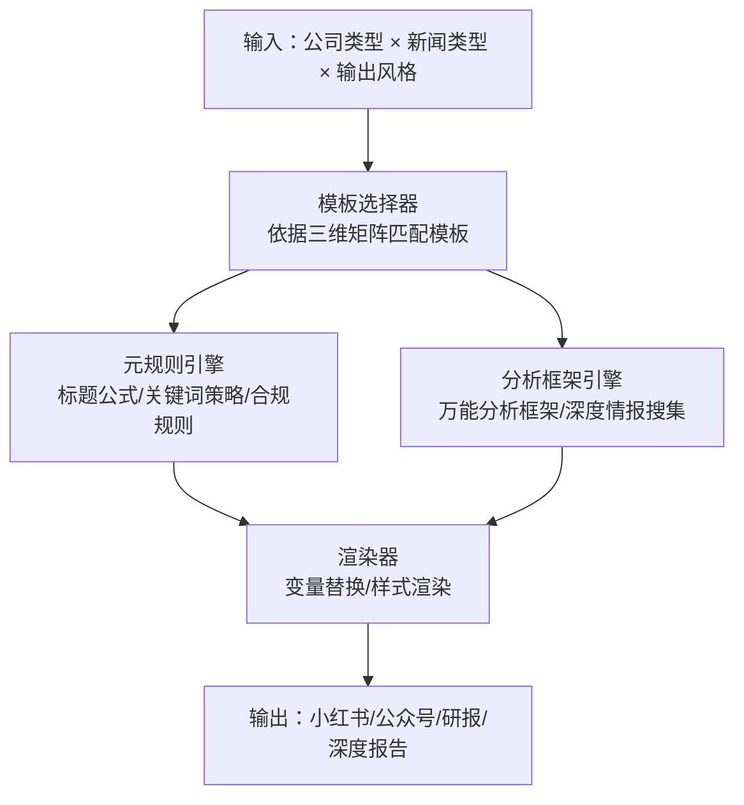

**图示来源**
- [SKILL.md:24-52](file://.agents/skills/china-financial-news-writer/SKILL.md#L24-L52)
- [template-xiaohongshu.md:1-424](file://.agents/skills/china-financial-news-writer/references/template-xiaohongshu.md#L1-L424)
- [template-wechat.md:1-518](file://.agents/skills/china-financial-news-writer/references/template-wechat.md#L1-L518)
- [template-research.md:1-459](file://.agents/skills/china-financial-news-writer/references/template-research.md#L1-L459)
- [research-report-template.md:1-395](file://.agents/skills/china-financial-news-writer/references/research-report-template.md#L1-L395)
- [title-formulas.md:1-288](file://.agents/skills/china-financial-news-writer/references/title-formulas.md#L1-L288)
- [keyword-strategy.md:1-302](file://.agents/skills/china-financial-news-writer/references/keyword-strategy.md#L1-L302)
- [compliance-rules.md:1-394](file://.agents/skills/china-financial-news-writer/references/compliance-rules.md#L1-L394)
- [universal_financial_analysis_framework.md:1-126](file://.agents/skills/china-financial-news-writer/references/universal_financial_analysis_framework.md#L1-L126)
- [deep-research.md:1-397](file://.agents/skills/china-financial-news-writer/references/deep-research.md#L1-L397)

## 详细组件分析

### 小红书模板设计与实现
- 内容特征：字数500-800，短段落、emoji适度、标签5-10个，强调情绪与互动。
- 标题公式：数字型、情绪型、对比型、好奇型、身份型、场景型、盘点型、争议型。
- 首段黄金50字：痛点/场景引入 + 核心信息预告 + 继续阅读钩子。
- 正文结构：核心数据（emoji+短句）→ 亮点解读 → 风险提示 → 结尾互动。
- 互动设计：评论引导、投票式、求助式、共鸣式、争议式；收藏价值设计（数据清单、对比表格、时间线、公式/方法论、避坑指南）。

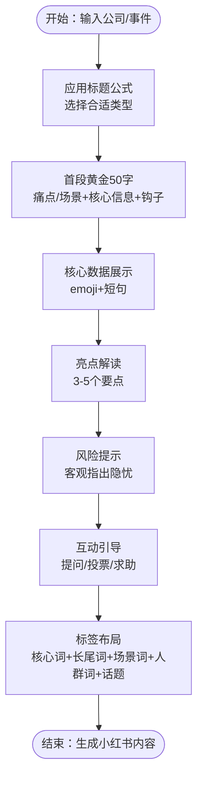

**图示来源**
- [template-xiaohongshu.md:12-150](file://.agents/skills/china-financial-news-writer/references/template-xiaohongshu.md#L12-L150)
- [title-formulas.md:12-172](file://.agents/skills/china-financial-news-writer/references/title-formulas.md#L12-L172)

**章节来源**
- [.agents/skills/china-financial-news-writer/references/template-xiaohongshu.md:1-424](file://.agents/skills/china-financial-news-writer/references/template-xiaohongshu.md#L1-L424)
- [.agents/skills/china-financial-news-writer/references/title-formulas.md:1-288](file://.agents/skills/china-financial-news-writer/references/title-formulas.md#L1-L288)

### 公众号模板设计与实现
- 内容特征：字数1500-2500，中等长度段落，专业但不失活泼，配图5-8张。
- 标题公式：事件型、分析型、观点型、提问型、对比型、时效型。
- 导语写法：新闻概述（100字）+ 核心观点（50字）+ 阅读指引（50字）。
- 正文结构：核心数据速览 → 业务拆解 → 亮点与隐忧 → 行业对比/管理层指引 → 投资逻辑（短期催化/中长期逻辑/估值视角）→ 风险提示 → 免责声明与关注引导。
- 写作技巧：数据呈现（换算/对比/表格/图表）、观点表达（明确/数据支撑/承认不确定性）、段落节奏（每段一个主题/小标题分割/避免大段）、互动引导（提问/关注/转发）。

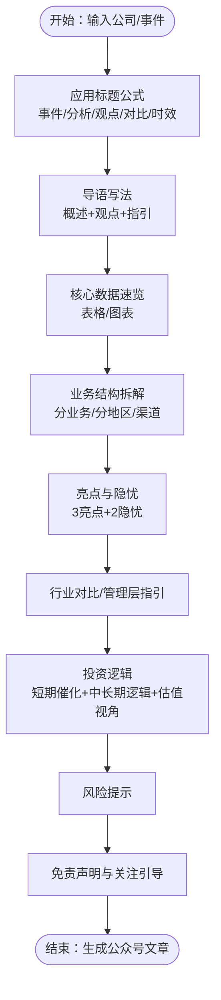

**图示来源**
- [template-wechat.md:12-158](file://.agents/skills/china-financial-news-writer/references/template-wechat.md#L12-L158)
- [template-wechat.md:162-422](file://.agents/skills/china-financial-news-writer/references/template-wechat.md#L162-L422)

**章节来源**
- [.agents/skills/china-financial-news-writer/references/template-wechat.md:1-518](file://.agents/skills/china-financial-news-writer/references/template-wechat.md#L1-L518)

### 研报模板设计与实现
- 内容特征：字数3000-5000，Times New Roman（中文用宋体），专业、客观、数据密集，表格3-5个，图表8-12个。
- 标题规范：公司名（代码）+ 事件 + 核心观点 + 评级。
- 评级体系：买入、增持、中性、减持、卖出。
- 结构：投资要点 → 事件概述（关键财务数据） → 业绩分析（收入/盈利能力/费用/现金流） → 业务亮点 → 关注要点 → 管理层指引与业绩会要点 → 行业对比 → 盈利预测调整 → 估值分析（方法/目标价推导/历史区间） → 投资建议（逻辑/催化剂/评级与目标价） → 风险提示 → 附录（财务预测表/分析师声明/免责声明/数据来源说明）。
- 图表规范：图表编号与标题、常用图表类型（趋势/对比/结构/同业/估值/预测）、表格规范（加粗/对齐/单位/来源/合并单元格）。
- 数据来源标注：标准格式与示例。

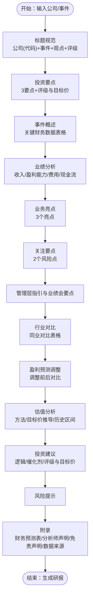

**图示来源**
- [template-research.md:12-279](file://.agents/skills/china-financial-news-writer/references/template-research.md#L12-L279)
- [template-research.md:283-459](file://.agents/skills/china-financial-news-writer/references/template-research.md#L283-L459)

**章节来源**
- [.agents/skills/china-financial-news-writer/references/template-research.md:1-459](file://.agents/skills/china-financial-news-writer/references/template-research.md#L1-L459)

### 深度分析报告模板设计与实现
- 适用场景：重大财报事件、突发负面新闻、行业重大变化、需要深度分析的投资标的。
- 报告结构：执行摘要 → 事件概述（时间线/核心数据/市场反应） → 事件背景与历史脉络（公司历程/历史对比/行业大环境） → 原因分析（直接/深层/外部/内部因素） → 全网观点汇总（媒体报道/分析师观点/社交媒体情绪/视频平台解读） → 影响评估（短期/中期/长期） → 关键观察点（指标/潜在催化剂/风险提示） → 结论与建议（核心结论/情景分析/操作建议） → 附录（信息来源/数据表格/术语解释）。
- 使用指南：场景推荐章节与字数、撰写流程（信息收集/整理/分析/审核）、质量检查清单。

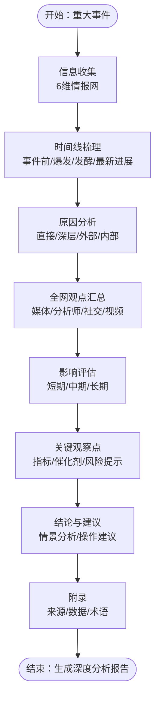

**图示来源**
- [research-report-template.md:13-323](file://.agents/skills/china-financial-news-writer/references/research-report-template.md#L13-L323)
- [deep-research.md:15-344](file://.agents/skills/china-financial-news-writer/references/deep-research.md#L15-L344)

**章节来源**
- [.agents/skills/china-financial-news-writer/references/research-report-template.md:1-395](file://.agents/skills/china-financial-news-writer/references/research-report-template.md#L1-L395)
- [.agents/skills/china-financial-news-writer/references/deep-research.md:1-397](file://.agents/skills/china-financial-news-writer/references/deep-research.md#L1-L397)

### 标题公式与关键词策略
- 标题公式（金融版）：数字具象型、事件+观点型、对比反差型、提问悬念型、身份权威型、情绪共鸣型、场景代入型、清单合集型。
- 平台适配：小红书（15-20字，情绪词+emoji+口语化）、公众号（20-30字，信息量+时效性+专业感）、研报（30-40字，公司全称+代码+事件+观点+评级）。
- 关键词策略：核心词（高搜索量）、长尾词（具体场景）、场景词（财报季/年报披露）、人群词（股民/投资者/散户）、修饰词（重磅/突发/深度/全面）。布局位置优先级与密度控制。

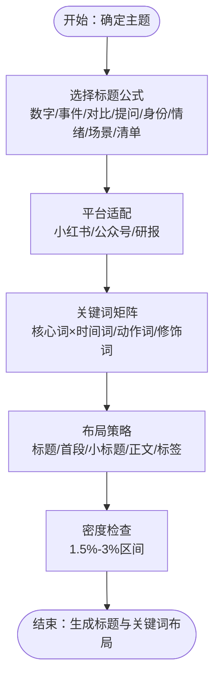

**图示来源**
- [title-formulas.md:9-216](file://.agents/skills/china-financial-news-writer/references/title-formulas.md#L9-L216)
- [keyword-strategy.md:60-176](file://.agents/skills/china-financial-news-writer/references/keyword-strategy.md#L60-L176)

**章节来源**
- [.agents/skills/china-financial-news-writer/references/title-formulas.md:1-288](file://.agents/skills/china-financial-news-writer/references/title-formulas.md#L1-L288)
- [.agents/skills/china-financial-news-writer/references/keyword-strategy.md:1-302](file://.agents/skills/china-financial-news-writer/references/keyword-strategy.md#L1-L302)

### 合规规则与敏感词管理
- 核心原则：不承诺收益、不构成建议、充分披露风险、数据来源透明、避免绝对化。
- 平台合规：小红书（禁止荐股/开户引导/收益承诺/代客理财/配资杠杆等；允许财报解读/行业分析/投资知识科普/个人理财经验分享/理财工具教程；必须包含风险提示/“仅供参考”声明/不构成投资建议）；公众号（必须包含免责声明/风险提示/数据来源标注；建议包含作者资质/利益关系披露/投资评级定义）；研报（必须包含分析师声明/投资评级定义/完整免责声明/公司声明）。
- 敏感词处理：高危（必涨/稳赚/内幕消息/100%收益/荐股/代客理财/保本保息/高收益理财/私募募集/年化收益XX%等）、中危（最好的股票/最强/100%/强烈推荐买入/建议买入/必须持有/赶紧买/满仓/梭哈/抄底机会/必定涨到XX/肯定突破/一定/保证收益等）、低危（借贷/理财产品/期货外汇/数字货币/募资相关/行业特殊词）。
- 风险提示模板：小红书（简短/完整）、公众号（标准）、研报（完整）。

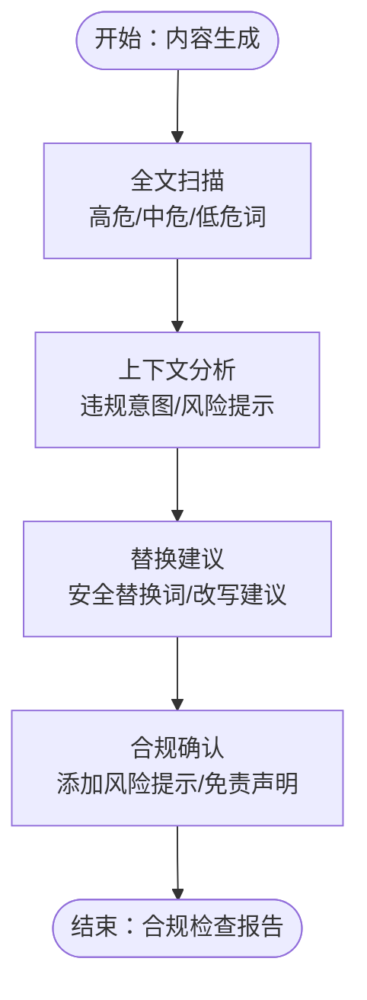

**图示来源**
- [compliance-rules.md:13-203](file://.agents/skills/china-financial-news-writer/references/compliance-rules.md#L13-L203)
- [sensitive-words-finance.md:3-294](file://.agents/skills/china-financial-news-writer/references/sensitive-words-finance.md#L3-L294)

**章节来源**
- [.agents/skills/china-financial-news-writer/references/compliance-rules.md:1-394](file://.agents/skills/china-financial-news-writer/references/compliance-rules.md#L1-L394)
- [.agents/skills/china-financial-news-writer/references/sensitive-words-finance.md:1-317](file://.agents/skills/china-financial-news-writer/references/sensitive-words-finance.md#L1-L317)

### 分析框架与子技能
- 万能分析框架：事件引爆点、战略失误分析、市场竞争格局、财务深度分析、全网舆情分析、技术路线分析、历史对比分析、未来预测模块、故事化叙事、情感共鸣点、互动设计、可视化建议、平台适配指南。
- 子技能：
  - 科技巨头：用户规模、用户时长、变现效率、新业务进展、监管影响。
  - 新能源车企：交付量/销量、汽车毛利率、单车利润、研发费用、现金储备、技术与产品分析、战略分析（品牌定位、出海进展、子品牌战略、合作伙伴）。

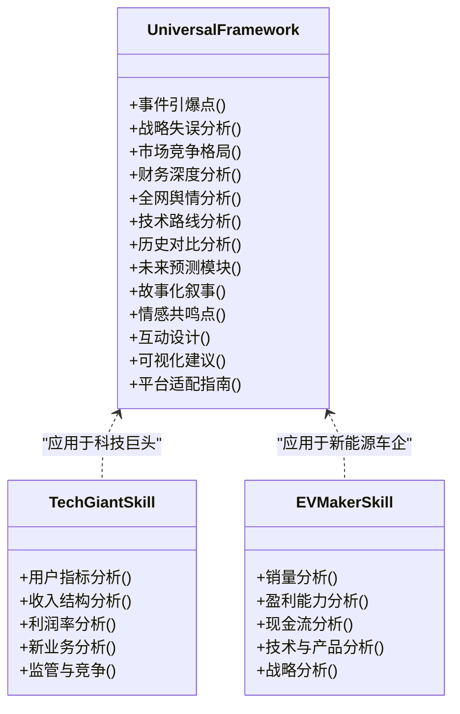

**图示来源**
- [universal_financial_analysis_framework.md:1-126](file://.agents/skills/china-financial-news-writer/references/universal_financial_analysis_framework.md#L1-L126)
- [tech-giant.md:28-103](file://.agents/skills/china-financial-news-writer/subskills/tech-giant.md#L28-L103)
- [ev-maker.md:58-142](file://.agents/skills/china-financial-news-writer/subskills/ev-maker.md#L58-L142)

**章节来源**
- [.agents/skills/china-financial-news-writer/references/universal_financial_analysis_framework.md:1-126](file://.agents/skills/china-financial-news-writer/references/universal_financial_analysis_framework.md#L1-L126)
- [.agents/skills/china-financial-news-writer/subskills/tech-giant.md:1-345](file://.agents/skills/china-financial-news-writer/subskills/tech-giant.md#L1-L345)
- [.agents/skills/china-financial-news-writer/subskills/ev-maker.md:1-398](file://.agents/skills/china-financial-news-writer/subskills/ev-maker.md#L1-L398)

### 模板系统与数据采集集成
- 数据采集：金融新闻自动化工作流（7大权威媒体RSS/API/Playwright抓取）、社区论坛信息抓取工具（雪球/知乎评论与讨论）。
- 集成方式：通过命令行参数控制抓取天数、来源与是否启用公司名过滤；抓取完成后去重并保存为JSON，便于后续模板渲染与分析。

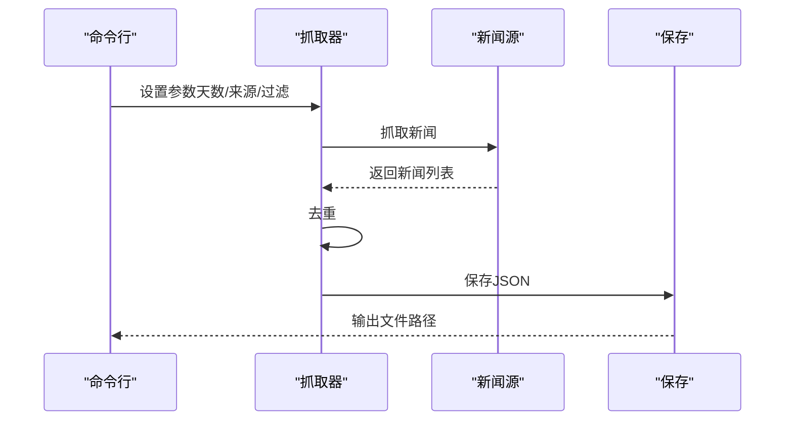

**图示来源**
- [financial_news_workflow_crawl4ai.py:405-454](file://financial_news_workflow_crawl4ai.py#L405-L454)
- [community_crawler.py:501-604](file://community_crawler.py#L501-L604)

**章节来源**
- [financial_news_workflow_crawl4ai.py:1-454](file://financial_news_workflow_crawl4ai.py#L1-L454)
- [community_crawler.py:1-604](file://community_crawler.py#L1-L604)

## 依赖分析
- 模板库依赖元规则：标题公式与关键词策略直接影响模板的可读性与搜索可见性；合规规则与敏感词库保障内容安全。
- 分析框架与情报搜集：为模板提供事实依据与深度洞察，提升内容质量与可信度。
- 子技能：针对特定公司类型的写作要点，帮助模板在具体场景下更具针对性。
- 数据采集工具：为模板提供实时数据与舆情素材，形成“采集—分析—模板—输出”的闭环。

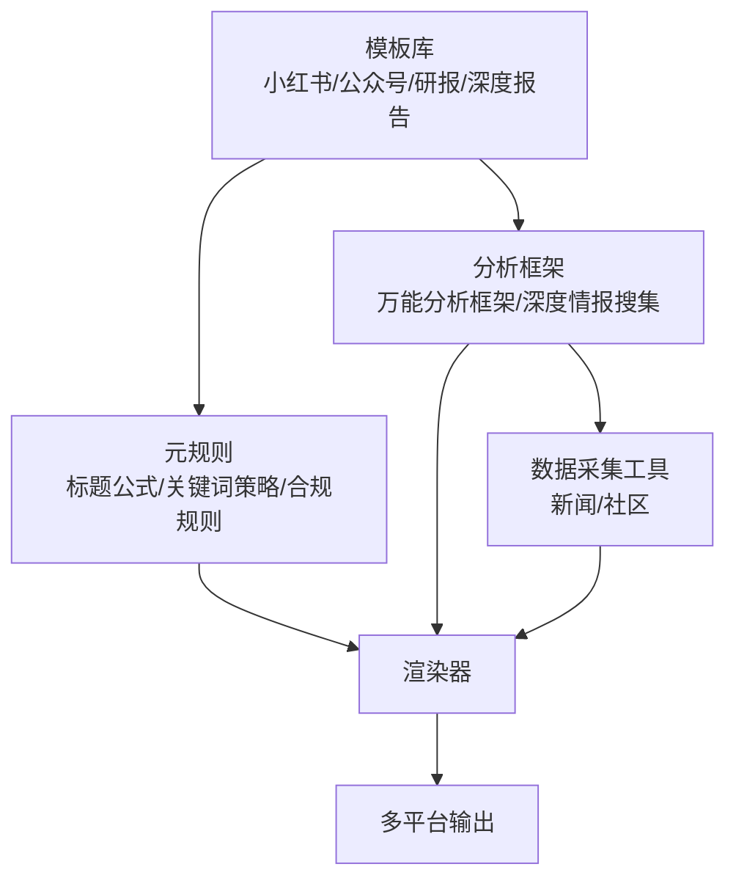

**图示来源**
- [SKILL.md:24-52](file://.agents/skills/china-financial-news-writer/SKILL.md#L24-L52)
- [template-xiaohongshu.md:1-424](file://.agents/skills/china-financial-news-writer/references/template-xiaohongshu.md#L1-L424)
- [template-wechat.md:1-518](file://.agents/skills/china-financial-news-writer/references/template-wechat.md#L1-L518)
- [template-research.md:1-459](file://.agents/skills/china-financial-news-writer/references/template-research.md#L1-L459)
- [research-report-template.md:1-395](file://.agents/skills/china-financial-news-writer/references/research-report-template.md#L1-L395)
- [title-formulas.md:1-288](file://.agents/skills/china-financial-news-writer/references/title-formulas.md#L1-L288)
- [keyword-strategy.md:1-302](file://.agents/skills/china-financial-news-writer/references/keyword-strategy.md#L1-L302)
- [compliance-rules.md:1-394](file://.agents/skills/china-financial-news-writer/references/compliance-rules.md#L1-L394)
- [universal_financial_analysis_framework.md:1-126](file://.agents/skills/china-financial-news-writer/references/universal_financial_analysis_framework.md#L1-L126)
- [deep-research.md:1-397](file://.agents/skills/china-financial-news-writer/references/deep-research.md#L1-L397)
- [financial_news_workflow_crawl4ai.py:1-454](file://financial_news_workflow_crawl4ai.py#L1-L454)
- [community_crawler.py:1-604](file://community_crawler.py#L1-L604)

**章节来源**
- [.agents/skills/china-financial-news-writer/SKILL.md:1-476](file://.agents/skills/china-financial-news-writer/SKILL.md#L1-L476)

## 性能考量
- 模板渲染性能
  - 变量替换与样式渲染：建议采用轻量模板引擎（如Jinja2）进行变量注入与格式化，避免复杂嵌套与重复计算。
  - 图表与表格：在研报模板中，尽量使用矢量格式与简洁样式，减少图片体积与加载时间。
- 合规检查性能
  - 敏感词扫描：建立索引与缓存机制，对高危/中危/低危词库进行分级处理，优先处理高危词。
  - 上下文分析：对敏感词进行上下文判断，避免误判与过度替换。
- 数据采集性能
  - 并发抓取：使用异步抓取（如Crawl4AI）与请求池，控制并发度与超时时间，避免被反爬机制拦截。
  - 去重与存储：对抓取结果进行去重与增量存储，减少重复IO与网络开销。

[本节为通用性能建议，无需特定文件引用]

## 故障排查指南
- 标题与关键词
  - 症状：标题过长/过短、关键词密度异常、标签不相关。
  - 排查：对照平台适配规则与关键词矩阵，检查布局位置与密度，修正标题公式与标签组合。
- 合规问题
  - 症状：高危/中危敏感词未替换、免责声明缺失、风险提示不充分。
  - 排查：使用合规检查报告模板，逐项核对敏感词与替换建议，补齐声明与披露。
- 模板渲染
  - 症状：变量未替换、格式错乱、图表缺失。
  - 排查：检查变量命名一致性、模板语法、图表数据来源与编号，确保渲染顺序正确。
- 数据采集
  - 症状：抓取失败/超时/结果为空。
  - 排查：检查网络连接、代理设置、反爬策略（User-Agent/Referer/Timeout），必要时启用Crawl4AI增强抓取。

**章节来源**
- [.agents/skills/china-financial-news-writer/references/title-formulas.md:219-236](file://.agents/skills/china-financial-news-writer/references/title-formulas.md#L219-L236)
- [.agents/skills/china-financial-news-writer/references/keyword-strategy.md:177-197](file://.agents/skills/china-financial-news-writer/references/keyword-strategy.md#L177-L197)
- [.agents/skills/china-financial-news-writer/references/compliance-rules.md:164-203](file://.agents/skills/china-financial-news-writer/references/compliance-rules.md#L164-L203)
- [.agents/skills/china-financial-news-writer/references/sensitive-words-finance.md:270-294](file://.agents/skills/china-financial-news-writer/references/sensitive-words-finance.md#L270-L294)
- [financial_news_workflow_crawl4ai.py:363-454](file://financial_news_workflow_crawl4ai.py#L363-L454)
- [community_crawler.py:125-176](file://community_crawler.py#L125-L176)

## 结论
模板定制的核心在于“规则先行、框架支撑、平台适配”。通过标题公式与关键词策略确保内容的可发现性与可读性，借助合规规则与敏感词库保障内容安全，运用分析框架与情报搜集提升内容深度与可信度，最终实现小红书的快速传播、公众号的专业解读与研报的严谨输出。结合数据采集工具，形成“采集—分析—模板—输出”的高效闭环，为不同平台与受众提供高质量内容。

[本节为总结性内容，无需特定文件引用]

## 附录
- 模板开发示例路径
  - 小红书：[小红书模板A（正面财报）:50-83](file://.agents/skills/china-financial-news-writer/references/template-xiaohongshu.md#L50-L83)
  - 公众号：[公众号模板A（深度财报解读）:39-158](file://.agents/skills/china-financial-news-writer/references/template-wechat.md#L39-L158)
  - 研报：[研报模板（财报分析）:35-279](file://.agents/skills/china-financial-news-writer/references/template-research.md#L35-L279)
  - 深度报告：[深度分析报告结构:13-323](file://.agents/skills/china-financial-news-writer/references/research-report-template.md#L13-L323)
- 元规则与合规
  - 标题公式：[标题公式库:9-216](file://.agents/skills/china-financial-news-writer/references/title-formulas.md#L9-L216)
  - 关键词策略：[关键词策略:60-176](file://.agents/skills/china-financial-news-writer/references/keyword-strategy.md#L60-L176)
  - 合规规则：[合规规则:13-203](file://.agents/skills/china-financial-news-writer/references/compliance-rules.md#L13-L203)
  - 敏感词库：[敏感词库:3-294](file://.agents/skills/china-financial-news-writer/references/sensitive-words-finance.md#L3-L294)
- 分析框架与子技能
  - 万能分析框架：[分析框架:1-126](file://.agents/skills/china-financial-news-writer/references/universal_financial_analysis_framework.md#L1-L126)
  - 深度情报搜集：[深度情报搜集:1-397](file://.agents/skills/china-financial-news-writer/references/deep-research.md#L1-L397)
  - 科技巨头子技能：[科技巨头写作要点:106-345](file://.agents/skills/china-financial-news-writer/subskills/tech-giant.md#L106-L345)
  - 新能源车企子技能：[新能源车企写作要点:145-398](file://.agents/skills/china-financial-news-writer/subskills/ev-maker.md#L145-L398)
- 数据采集工具
  - 新闻采集：[金融新闻工作流:1-454](file://financial_news_workflow_crawl4ai.py#L1-L454)
  - 社区采集：[社区爬虫:1-604](file://community_crawler.py#L1-L604)