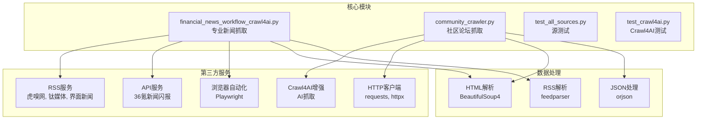
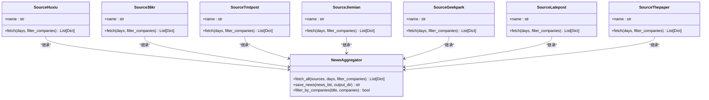
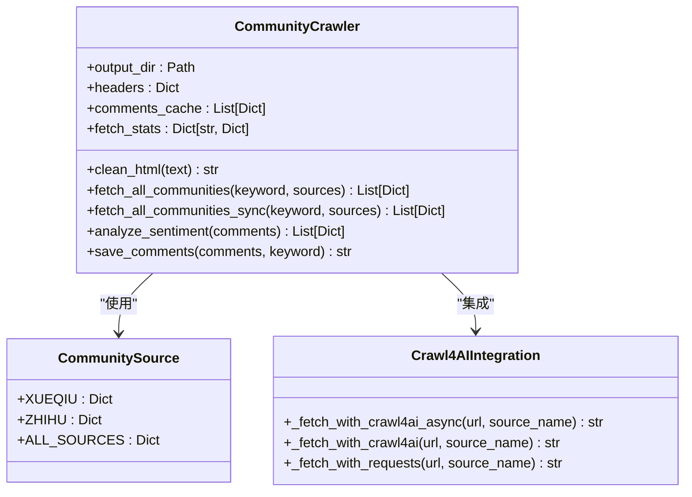
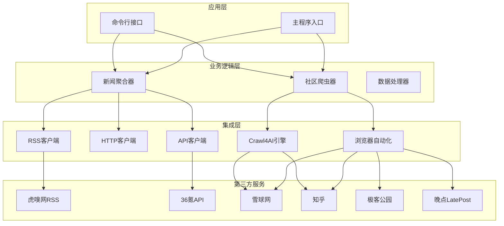
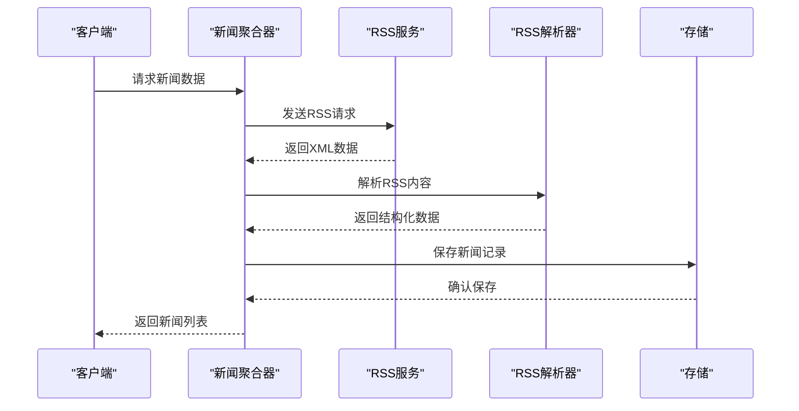
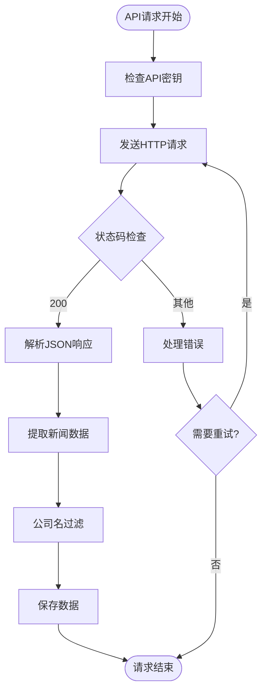
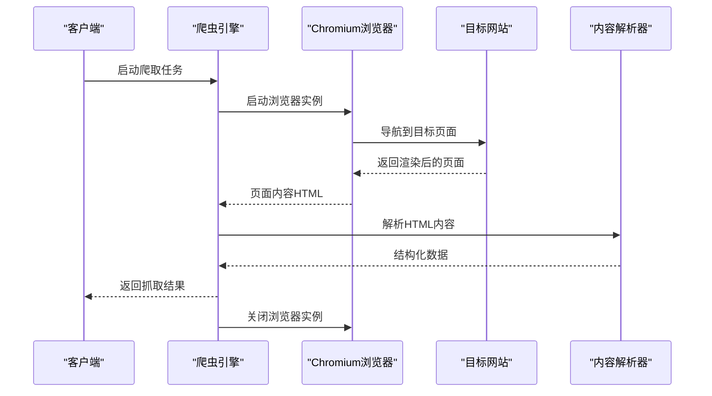
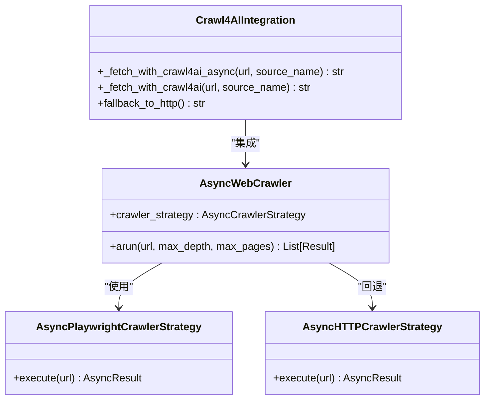
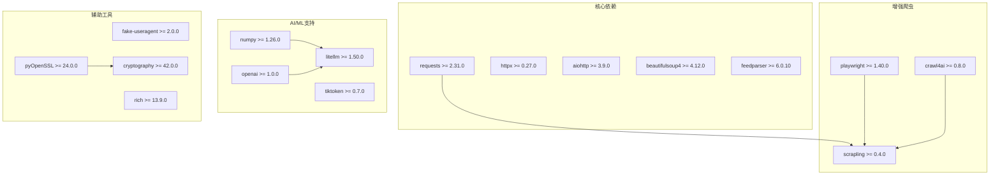

# 第三方集成

<cite>
**本文档引用的文件**
- [requirements.txt](file://requirements.txt)
- [community_crawler.py](file://community_crawler.py)
- [financial_news_workflow_crawl4ai.py](file://financial_news_workflow_crawl4ai.py)
- [test_all_sources.py](file://test_all_sources.py)
- [test_crawl4ai.py](file://test_crawl4ai.py)
- [docs/RUN.md](file://docs/RUN.md)
- [docs/SPEC.md](file://docs/SPEC.md)
</cite>

## 目录
1. [简介](#简介)
2. [项目结构](#项目结构)
3. [核心组件](#核心组件)
4. [架构概览](#架构概览)
5. [详细组件分析](#详细组件分析)
6. [依赖关系分析](#依赖关系分析)
7. [性能考量](#性能考量)
8. [故障排除指南](#故障排除指南)
9. [结论](#结论)
10. [附录](#附录)

## 简介

Redbook项目是一个金融新闻自动化工作流系统，专注于第三方API和服务的集成。该项目实现了从专业财经媒体和社区论坛的数据抓取，为内容创作和投资分析提供支持。系统集成了多种第三方服务，包括RSS订阅服务、API接口、浏览器自动化服务和AI增强抓取能力。

该系统的核心价值在于通过统一的架构整合多个外部数据源，提供稳定可靠的数据采集能力，支持后续的内容分析和生成工作流。

## 项目结构

项目采用模块化设计，主要包含以下核心组件：



**图表来源**
- [financial_news_workflow_crawl4ai.py:1-50](file://financial_news_workflow_crawl4ai.py#L1-L50)
- [community_crawler.py:1-50](file://community_crawler.py#L1-L50)

**章节来源**
- [requirements.txt:1-144](file://requirements.txt#L1-L144)
- [docs/RUN.md:1-252](file://docs/RUN.md#L1-L252)

## 核心组件

### 专业新闻抓取系统

专业新闻抓取系统实现了对7大权威财经媒体的自动化抓取，采用多策略混合架构：



**图表来源**
- [financial_news_workflow_crawl4ai.py:94-359](file://financial_news_workflow_crawl4ai.py#L94-L359)

### 社区论坛抓取系统

社区论坛抓取系统专注于雪球网和知乎的数据采集，实现了智能的反爬机制应对：



**图表来源**
- [community_crawler.py:56-497](file://community_crawler.py#L56-L497)

**章节来源**
- [financial_news_workflow_crawl4ai.py:1-454](file://financial_news_workflow_crawl4ai.py#L1-L454)
- [community_crawler.py:1-604](file://community_crawler.py#L1-L604)

## 架构概览

系统采用分层架构设计，实现了清晰的职责分离和可扩展性：



**图表来源**
- [financial_news_workflow_crawl4ai.py:363-453](file://financial_news_workflow_crawl4ai.py#L363-L453)
- [community_crawler.py:501-604](file://community_crawler.py#L501-L604)

### 集成架构设计

系统实现了多种集成策略：

1. **多协议支持**：同时支持RSS、HTTP和API三种数据获取协议
2. **反爬机制**：集成Crawl4AI和Playwright应对复杂的反爬挑战
3. **错误处理**：实现多层次的错误捕获和恢复机制
4. **异步处理**：采用asyncio实现高效的并发抓取

**章节来源**
- [financial_news_workflow_crawl4ai.py:86-90](file://financial_news_workflow_crawl4ai.py#L86-L90)
- [community_crawler.py:91-98](file://community_crawler.py#L91-L98)

## 详细组件分析

### RSS服务集成

RSS服务集成实现了对多家财经媒体的自动化订阅和解析：



**图表来源**
- [financial_news_workflow_crawl4ai.py:98-119](file://financial_news_workflow_crawl4ai.py#L98-L119)

#### RSS集成特性

- **多源支持**：支持虎嗅网、钛媒体、界面新闻等多个RSS源
- **自动解析**：使用feedparser库自动解析XML格式
- **内容过滤**：支持按日期和公司名进行内容筛选
- **错误恢复**：单个源失败不影响整体抓取流程

**章节来源**
- [financial_news_workflow_crawl4ai.py:94-213](file://financial_news_workflow_crawl4ai.py#L94-L213)

### API服务集成

API服务集成为36氪提供了直接的新闻闪报接口访问：



**图表来源**
- [financial_news_workflow_crawl4ai.py:126-155](file://financial_news_workflow_crawl4ai.py#L126-L155)

#### API集成特性

- **认证机制**：支持API密钥验证
- **参数配置**：灵活的查询参数设置
- **超时控制**：合理的请求超时设置
- **数据验证**：严格的响应格式验证

**章节来源**
- [financial_news_workflow_crawl4ai.py:122-155](file://financial_news_workflow_crawl4ai.py#L122-L155)

### 浏览器自动化集成

浏览器自动化集成为需要JavaScript渲染的网站提供了完整的解决方案：



**图表来源**
- [financial_news_workflow_crawl4ai.py:226-263](file://financial_news_workflow_crawl4ai.py#L226-L263)

#### 浏览器自动化特性

- **无头模式**：支持无头浏览器运行
- **动态内容**：处理JavaScript渲染的页面
- **元素定位**：精确的DOM元素选择和提取
- **稳定性保证**：完善的错误处理和重试机制

**章节来源**
- [financial_news_workflow_crawl4ai.py:215-318](file://financial_news_workflow_crawl4ai.py#L215-L318)

### Crawl4AI增强集成

Crawl4AI集成为复杂网页提供了AI驱动的智能抓取能力：



**图表来源**
- [community_crawler.py:127-175](file://community_crawler.py#L127-L175)

#### Crawl4AI集成特性

- **策略模式**：支持多种爬取策略的切换
- **智能回退**：自动在不同策略间切换
- **异步处理**：完全支持异步并发抓取
- **AI增强**：提供更智能的内容提取能力

**章节来源**
- [community_crawler.py:125-176](file://community_crawler.py#L125-L176)

## 依赖关系分析

系统依赖关系体现了清晰的层次结构和模块化设计：



**图表来源**
- [requirements.txt:6-144](file://requirements.txt#L6-L144)

### 依赖管理策略

系统采用了分层依赖管理策略：

1. **核心依赖**：网络请求、HTML解析、RSS处理等基础功能
2. **增强爬虫**：Scrapling、Playwright、Crawl4AI等高级抓取能力
3. **AI支持**：OpenAI、LiteLLM等大模型集成
4. **辅助工具**：加密、用户代理、日志等支撑功能

**章节来源**
- [requirements.txt:1-144](file://requirements.txt#L1-L144)

## 性能考量

系统在性能方面采用了多项优化策略：

### 并发处理优化

- **异步I/O**：使用asyncio实现非阻塞的网络请求
- **并发抓取**：支持多个数据源的并行抓取
- **连接复用**：HTTP客户端支持连接池复用

### 内存管理优化

- **流式处理**：大文件下载采用流式处理
- **增量缓存**：评论数据采用增量缓存机制
- **资源清理**：自动清理临时文件和浏览器实例

### 网络优化

- **超时控制**：合理的请求超时和重试机制
- **代理支持**：支持HTTP代理和SOCKS代理
- **头部伪装**：模拟真实浏览器请求头

## 故障排除指南

### 常见问题及解决方案

#### 1. 依赖安装问题

**问题症状**：`ModuleNotFoundError: No module named 'requests'`

**解决步骤**：
1. 检查Python版本是否满足要求
2. 运行 `pip install -r requirements.txt`
3. 确认网络连接正常
4. 如需离线安装，使用 `pip install --no-index --find-links <路径> -r requirements.txt`

#### 2. Playwright浏览器问题

**问题症状**：`playwright install chromium` 失败

**解决步骤**：
1. 确认Node.js已正确安装
2. 运行 `npx playwright install chromium`
3. 检查防火墙设置
4. 以管理员权限运行命令

#### 3. Crawl4AI集成问题

**问题症状**：Crawl4AI功能不可用

**解决步骤**：
1. 运行 `python test_crawl4ai.py` 进行功能测试
2. 检查网络连接和DNS解析
3. 确认API密钥配置正确
4. 查看详细的错误日志

#### 4. 数据抓取失败

**问题症状**：某些网站无法抓取数据

**解决步骤**：
1. 运行 `python test_all_sources.py` 进行源测试
2. 检查网站结构是否发生变化
3. 调整请求头和User-Agent
4. 增加请求间隔时间

**章节来源**
- [docs/RUN.md:144-188](file://docs/RUN.md#L144-L188)
- [test_all_sources.py:18-48](file://test_all_sources.py#L18-L48)

## 结论

Redbook项目的第三方集成系统展现了现代Web抓取技术的最佳实践。通过采用多策略混合架构、完善的错误处理机制和智能化的反爬应对方案，系统实现了对多个复杂外部服务的稳定集成。

### 主要优势

1. **架构灵活性**：支持多种数据获取协议和反爬策略
2. **可靠性保障**：多层次的错误处理和恢复机制
3. **性能优化**：异步并发处理和资源管理优化
4. **可扩展性**：模块化设计便于功能扩展

### 技术特色

- **AI增强抓取**：集成Crawl4AI提供智能内容提取
- **多协议支持**：同时支持RSS、API和浏览器自动化
- **智能回退**：自动在不同策略间切换
- **完整测试体系**：包含单元测试和集成测试

该系统为Redbook平台提供了坚实的数据基础设施，支持后续的内容分析、生成和分发工作流。

## 附录

### 配置管理最佳实践

#### 环境变量配置

建议使用 `.env` 文件管理敏感配置：

```python
# 示例配置结构
import os
from dotenv import load_dotenv

load_dotenv()

# API密钥配置
OPENAI_API_KEY = os.getenv('OPENAI_API_KEY')
LITELLM_API_KEY = os.getenv('LITELLM_API_KEY')

# 爬虫配置
REQUEST_TIMEOUT = int(os.getenv('REQUEST_TIMEOUT', '15'))
MAX_RETRIES = int(os.getenv('MAX_RETRIES', '3'))
```

#### 密钥管理策略

1. **环境隔离**：不同环境使用不同的密钥
2. **最小权限原则**：为每个服务分配最小必要权限
3. **定期轮换**：建立API密钥定期轮换机制
4. **审计日志**：记录所有密钥使用情况

### 安全考虑

#### 数据安全

- **传输加密**：所有API通信使用HTTPS
- **数据脱敏**：敏感信息在日志中进行脱敏处理
- **访问控制**：限制对敏感数据的访问权限

#### 网络安全

- **IP限制**：为API服务配置IP白名单
- **速率限制**：遵守第三方服务的速率限制
- **代理安全**：使用可信的代理服务器

#### 代码安全

- **输入验证**：对所有外部输入进行严格验证
- **SQL注入防护**：如需数据库存储，使用参数化查询
- **XSS防护**：对用户输入进行适当的转义处理

### 监控和日志

#### 监控指标

建议监控以下关键指标：
- 抓取成功率
- 响应时间分布
- 错误率统计
- 资源使用情况
- API配额使用情况

#### 日志策略

- **结构化日志**：使用JSON格式记录重要事件
- **分级日志**：区分DEBUG、INFO、WARNING、ERROR级别
- **审计日志**：记录所有敏感操作
- **性能日志**：记录关键操作的性能数据