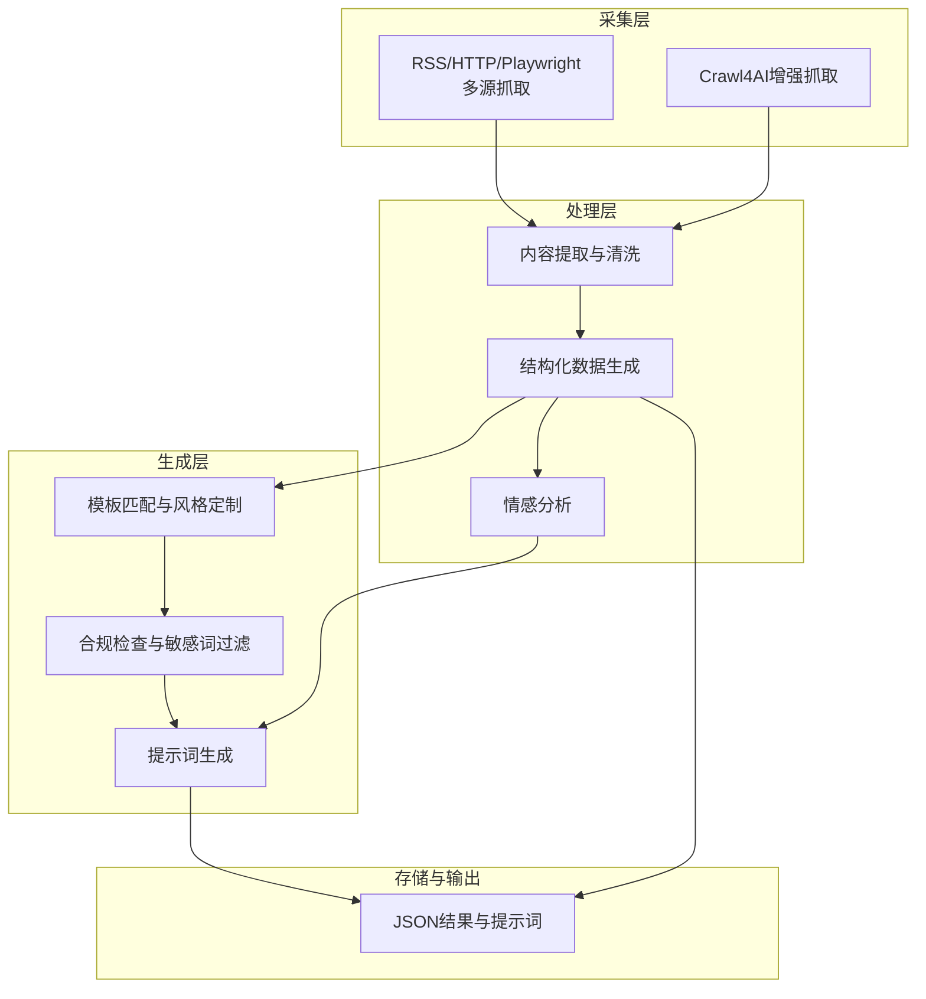
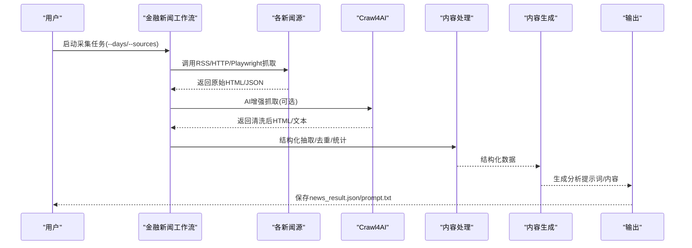
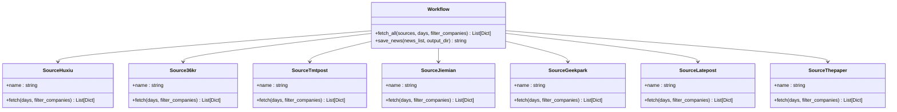
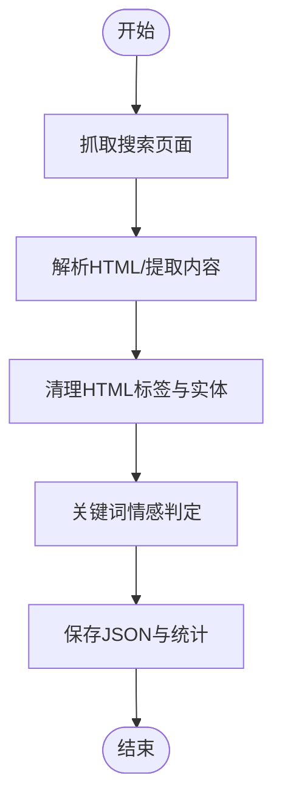
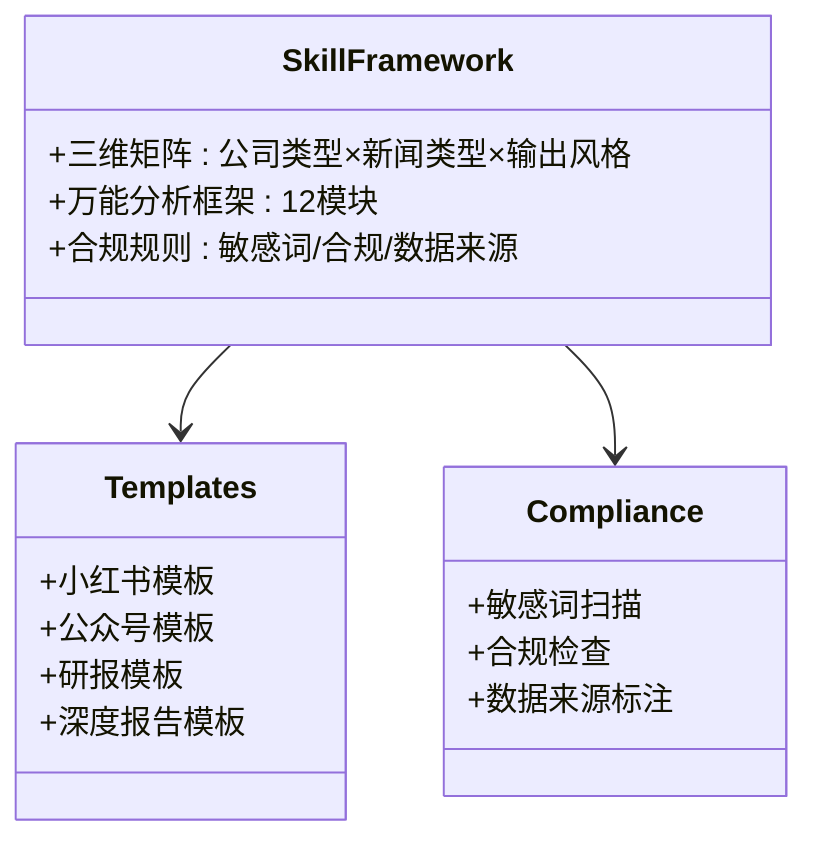
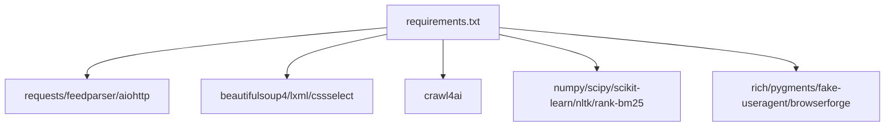

# AI分析引擎

<cite>
**本文引用的文件**
- [financial_news_workflow_crawl4ai.py](file://financial_news_workflow_crawl4ai.py)
- [community_crawler.py](file://community_crawler.py)
- [test_crawl4ai.py](file://test_crawl4ai.py)
- [requirements.txt](file://requirements.txt)
- [RUN.md](file://docs/RUN.md)
- [design_philosophy.md](file://design/design_philosophy.md)
- [SKILL.md](file://.agents/skills/china-financial-news-writer/SKILL.md)
- [universal_financial_analysis_framework.md](file://.agents/skills/china-financial-news-writer/references/universal_financial_analysis_framework.md)
- [news_result.json](file://news_output_crawl4ai_20260324_095151/news_result.json)
- [prompt.txt](file://news_output_crawl4ai_20260324_103448/prompt.txt)
- [test_all_sources.py](file://test_all_sources.py)
</cite>

## 目录
1. [简介](#简介)
2. [项目结构](#项目结构)
3. [核心组件](#核心组件)
4. [架构总览](#架构总览)
5. [详细组件分析](#详细组件分析)
6. [依赖关系分析](#依赖关系分析)
7. [性能考量](#性能考量)
8. [故障排除指南](#故障排除指南)
9. [结论](#结论)
10. [附录](#附录)

## 简介
本技术文档系统性阐述基于Crawl4AI的AI分析引擎实现，覆盖金融新闻自动化采集、网页内容提取与结构化生成、社区舆情抓取与情感分析、以及AI内容生成与合规检查的完整工作流。文档从架构设计、数据流、处理逻辑、NLP应用与模板化生成等方面进行深入剖析，并提供可操作的扩展指导。

## 项目结构
项目采用功能模块化组织，核心脚本与技能模块分离，便于扩展与维护：
- 金融新闻自动化采集：基于多源RSS/HTTP/Playwright的抓取与去重
- 社区论坛抓取与情感分析：基于Crawl4AI增强抓取与关键词情感判定
- AI内容生成与合规：基于技能模板与合规规则的生成与检查
- 依赖与运行：统一requirements与运行说明

**章节来源**
- [financial_news_workflow_crawl4ai.py:1-454](file://financial_news_workflow_crawl4ai.py#L1-L454)
- [community_crawler.py:1-604](file://community_crawler.py#L1-L604)
- [RUN.md:1-252](file://docs/RUN.md#L1-L252)

## 核心组件
- 金融新闻采集工作流：封装7大权威媒体的RSS/HTTP/Playwright抓取逻辑，统一输出结构化JSON与分析提示词
- 社区论坛抓取与情感分析：支持雪球/知乎等社区，Crawl4AI增强抓取与关键词情感判定
- AI内容生成与合规：基于技能模板与合规规则，生成小红书/公众号/研报等风格内容
- 依赖与运行：统一requirements与运行说明，支持Playwright安装与Crawl4AI功能测试

**章节来源**
- [financial_news_workflow_crawl4ai.py:94-358](file://financial_news_workflow_crawl4ai.py#L94-L358)
- [community_crawler.py:82-496](file://community_crawler.py#L82-L496)
- [SKILL.md:1-476](file://.agents/skills/china-financial-news-writer/SKILL.md#L1-L476)

## 架构总览
AI分析引擎采用“采集-处理-生成-输出”的流水线架构，结合Crawl4AI的AI增强能力与自研NLP模块，实现从原始网页到结构化内容与分析提示词的端到端自动化。

**图表来源**
- [financial_news_workflow_crawl4ai.py:363-450](file://financial_news_workflow_crawl4ai.py#L363-L450)
- [community_crawler.py:127-175](file://community_crawler.py#L127-L175)

**章节来源**
- [financial_news_workflow_crawl4ai.py:405-450](file://financial_news_workflow_crawl4ai.py#L405-L450)
- [community_crawler.py:501-595](file://community_crawler.py#L501-L595)

## 详细组件分析

### 金融新闻采集工作流
- 多源适配：RSS（feedparser）、HTTP（requests）、动态渲染（Playwright），统一返回结构化字段（来源、标题、链接、摘要、发布时间）
- 去重与统计：基于标题集合去重，按来源与公司维度统计
- 输出：news_result.json包含抓取时间、日期范围、来源统计、公司统计、新闻列表与相关度

**图表来源**
- [financial_news_workflow_crawl4ai.py:94-358](file://financial_news_workflow_crawl4ai.py#L94-L358)
- [financial_news_workflow_crawl4ai.py:363-403](file://financial_news_workflow_crawl4ai.py#L363-L403)

**章节来源**
- [financial_news_workflow_crawl4ai.py:94-358](file://financial_news_workflow_crawl4ai.py#L94-L358)
- [financial_news_workflow_crawl4ai.py:363-450](file://financial_news_workflow_crawl4ai.py#L363-L450)

### 社区论坛抓取与情感分析
- Crawl4AI增强抓取：优先使用Playwright策略，失败时回退HTTP策略，提升复杂页面抓取成功率
- HTML解析与清洗：BeautifulSoup解析，HTML实体解码与标签清理
- 情感分析：基于关键词集合的简单情感判定与情感分值计算

**图表来源**
- [community_crawler.py:127-175](file://community_crawler.py#L127-L175)
- [community_crawler.py:214-282](file://community_crawler.py#L214-L282)
- [community_crawler.py:444-465](file://community_crawler.py#L444-L465)

**章节来源**
- [community_crawler.py:82-496](file://community_crawler.py#L82-L496)

### AI内容生成与合规检查
- 三维分类矩阵：公司类型×新闻类型×输出风格，匹配写作框架与模板
- 万能分析框架：12大模块覆盖事件、战略、竞争、技术、历史、预测、故事、情感、互动、可视化等
- 合规检查：敏感词扫描、投资建议合规、数据来源标注

**图表来源**
- [SKILL.md:24-52](file://.agents/skills/china-financial-news-writer/SKILL.md#L24-L52)
- [SKILL.md:151-237](file://.agents/skills/china-financial-news-writer/SKILL.md#L151-L237)
- [universal_financial_analysis_framework.md:1-126](file://.agents/skills/china-financial-news-writer/references/universal_financial_analysis_framework.md#L1-L126)

**章节来源**
- [SKILL.md:1-476](file://.agents/skills/china-financial-news-writer/SKILL.md#L1-L476)
- [universal_financial_analysis_framework.md:1-126](file://.agents/skills/china-financial-news-writer/references/universal_financial_analysis_framework.md#L1-L126)

### NLP在金融新闻分析中的应用
- 情感分析：基于关键词集合的简单情感判定，可用于社区评论与新闻摘要的情绪倾向分析
- 关键词识别：用于新闻标题与摘要的关键词抽取，辅助主题与热点识别
- 结构化生成：将分析结果映射到模板框架，生成不同风格的内容

**章节来源**
- [community_crawler.py:444-465](file://community_crawler.py#L444-L465)
- [SKILL.md:240-287](file://.agents/skills/china-financial-news-writer/SKILL.md#L240-L287)

### 机器学习模型集成与数据挖掘
- 模型集成：Crawl4AI依赖AI/ML相关库（numpy、scipy、scikit-learn、nltk、rank-bm25等），支持网页内容理解与结构化抽取
- 数据挖掘：基于关键词与主题的新闻聚合、社区讨论挖掘与舆情趋势分析
- 趋势预测：结合历史数据与外部指标，构建事件影响与市场反应的预测框架

**章节来源**
- [requirements.txt:69-83](file://requirements.txt#L69-L83)
- [requirements.txt:132-144](file://requirements.txt#L132-L144)

## 依赖关系分析
项目依赖分为核心网络库、HTML解析、Crawl4AI增强库、AI/ML库与辅助工具，统一在requirements.txt中管理。

**图表来源**
- [requirements.txt:1-144](file://requirements.txt#L1-L144)

**章节来源**
- [requirements.txt:1-144](file://requirements.txt#L1-L144)

## 性能考量
- 抓取并发与稳定性：合理设置超时与重试，Playwright无头模式降低资源消耗
- 内容提取效率：BeautifulSoup解析与正则清洗相结合，平衡准确性与性能
- 输出与存储：结构化JSON按来源与情感分组统计，便于后续分析与可视化

[本节为通用性能建议，无需特定文件引用]

## 故障排除指南
- Crawl4AI未安装：运行安装命令并验证功能
- Playwright浏览器未安装：执行安装命令并以管理员权限运行
- 依赖安装失败：升级pip并使用二进制安装策略
- 抓取失败：检查网络连接、网站可访问性与来源参数

**章节来源**
- [test_crawl4ai.py:15-22](file://test_crawl4ai.py#L15-L22)
- [RUN.md:144-161](file://docs/RUN.md#L144-L161)

## 结论
本AI分析引擎通过多源采集、Crawl4AI增强、NLP情感分析与模板化生成，构建了从原始网页到结构化内容与分析提示词的完整流水线。技能模板与合规规则确保生成内容的质量与合规性，为金融新闻分析与内容创作提供了可扩展的技术基础。

## 附录
- 运行示例与输出：参考运行文档中的示例输出与工作流说明
- 设计哲学：视觉与信息传达的设计理念，指导内容呈现与排版

**章节来源**
- [RUN.md:113-252](file://docs/RUN.md#L113-L252)
- [design_philosophy.md:1-16](file://design/design_philosophy.md#L1-L16)