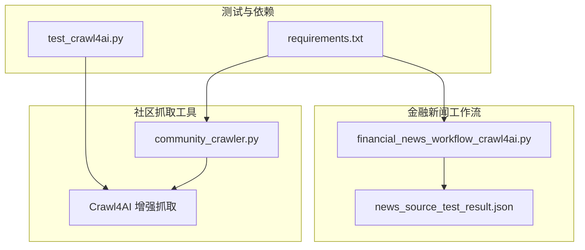
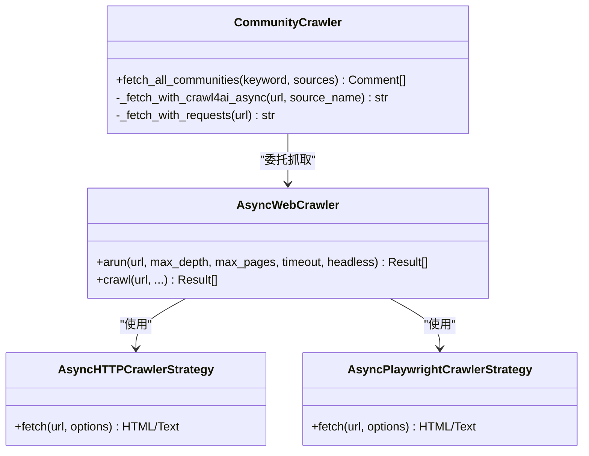
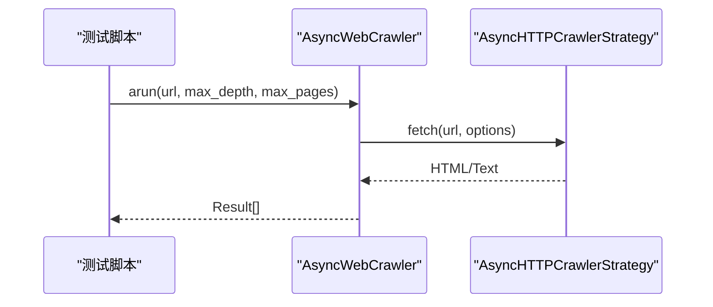
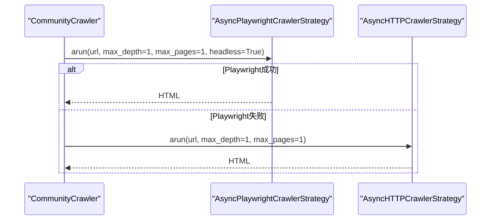
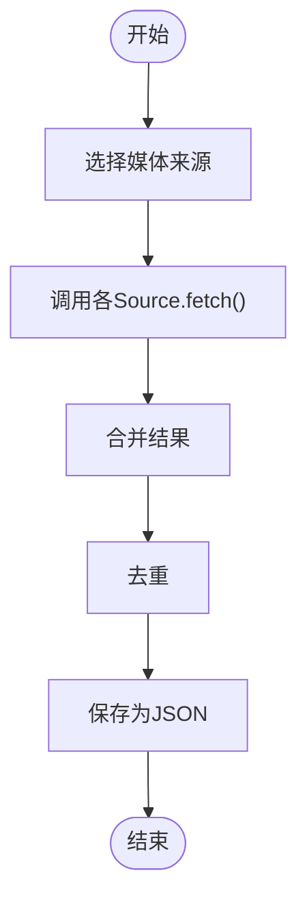
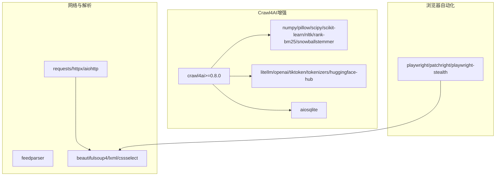

# Crawl4AI增强抓取

<cite>
**本文引用的文件**
- [financial_news_workflow_crawl4ai.py](file://financial_news_workflow_crawl4ai.py)
- [test_crawl4ai.py](file://test_crawl4ai.py)
- [community_crawler.py](file://community_crawler.py)
- [requirements.txt](file://requirements.txt)
- [test_all_sources.py](file://test_all_sources.py)
- [news_source_test_result.json](file://news_source_test_result.json)
- [news_output_crawl4ai_20260324_103448\news_result.json](file://news_output_crawl4ai_20260324_103448/news_result.json)
- [news_output_crawl4ai_20260325_142309\news_result.json](file://news_output_crawl4ai_20260325_142309/news_result.json)
- [design_philosophy.md](file://design\design_philosophy.md)
</cite>

## 目录
1. [简介](#简介)
2. [项目结构](#项目结构)
3. [核心组件](#核心组件)
4. [架构总览](#架构总览)
5. [详细组件分析](#详细组件分析)
6. [依赖分析](#依赖分析)
7. [性能考量](#性能考量)
8. [故障排除指南](#故障排除指南)
9. [结论](#结论)
10. [附录](#附录)

## 简介
本技术文档围绕Crawl4AI增强抓取功能展开，系统阐述异步网页抓取的实现机制、AsyncWebCrawler类的架构设计、AsyncHTTPCrawlerStrategy策略模式的应用，以及AI增强功能如何提升网页内容提取质量。文档结合仓库中的金融新闻自动化工作流与社区论坛抓取工具，提供从简单到复杂再到AI增强的完整实践路径，并给出错误处理策略、性能优化技巧与常见问题解决方案。

## 项目结构
该项目围绕“金融新闻自动化工作流”和“社区论坛信息抓取工具”两大主线构建，同时展示了Crawl4AI在不同场景下的应用方式：
- 金融新闻自动化工作流：集成多家权威媒体源，支持RSS、API与动态网页抓取，具备去重与结果保存能力。
- 社区论坛信息抓取工具：在传统requests抓取基础上，引入Crawl4AI增强抓取，支持Playwright与HTTP两种策略，并提供降级回退机制。
- Crawl4AI功能测试：验证AsyncWebCrawler与AsyncHTTPCrawlerStrategy的使用方式与返回结果形态。

图表来源
- [financial_news_workflow_crawl4ai.py](file://financial_news_workflow_crawl4ai.py)
- [community_crawler.py](file://community_crawler.py)
- [test_crawl4ai.py](file://test_crawl4ai.py)
- [requirements.txt](file://requirements.txt)

章节来源
- [financial_news_workflow_crawl4ai.py](file://financial_news_workflow_crawl4ai.py)
- [community_crawler.py](file://community_crawler.py)
- [test_crawl4ai.py](file://test_crawl4ai.py)
- [requirements.txt](file://requirements.txt)

## 核心组件
- AsyncWebCrawler：异步网页抓取核心类，支持通过策略模式切换抓取策略（HTTP或Playwright）。
- AsyncHTTPCrawlerStrategy：HTTP策略，基于异步HTTP客户端，适合静态或轻动态网页。
- AsyncPlaywrightCrawlerStrategy：Playwright策略，基于Chromium浏览器自动化，适合复杂动态网页与反爬场景。
- CommunityCrawler：社区抓取工具，封装Crawl4AI增强抓取与传统requests抓取，提供降级回退与结果解析。
- SourceXxx系列：各媒体源的抓取实现，统一返回结构化新闻数据。

章节来源
- [community_crawler.py](file://community_crawler.py)
- [test_crawl4ai.py](file://test_crawl4ai.py)

## 架构总览
Crawl4AI增强抓取在本项目中的应用采用“策略模式 + 降级回退”的架构设计：
- 策略模式：通过AsyncWebCrawler注入不同的CrawlerStrategy，实现HTTP与Playwright策略的无缝切换。
- 降级回退：当Playwright策略失败时，自动回退到HTTP策略，保证抓取成功率。
- 结果统一：无论采用哪种策略，最终返回统一的结果对象，便于上层解析与存储。

图表来源
- [community_crawler.py](file://community_crawler.py)
- [test_crawl4ai.py](file://test_crawl4ai.py)

## 详细组件分析

### AsyncWebCrawler与策略模式
- AsyncWebCrawler提供arun与crawl两个入口方法，其中arun为异步入口，crawl为同步入口。在本项目中，测试与社区抓取工具均使用arun进行异步调用。
- 通过构造函数注入AsyncHTTPCrawlerStrategy或AsyncPlaywrightCrawlerStrategy，实现不同抓取策略的切换。
- 返回结果统一为结果对象列表，包含url、html/text等字段，便于后续解析与存储。

图表来源
- [test_crawl4ai.py](file://test_crawl4ai.py)

章节来源
- [test_crawl4ai.py](file://test_crawl4ai.py)

### CommunityCrawler的增强抓取流程
- _fetch_with_crawl4ai_async：优先使用Playwright策略抓取，失败时回退到HTTP策略；支持headless模式与超时控制。
- _fetch_with_requests：传统requests抓取，作为降级兜底。
- fetch_all_communities：统一调度各社区源，聚合结果并进行情感分析与保存。

图表来源
- [community_crawler.py](file://community_crawler.py)

章节来源
- [community_crawler.py](file://community_crawler.py)

### 媒体源抓取与结果保存
- SourceXxx系列：实现各媒体源的抓取逻辑，统一返回包含source、title、link、summary、published等字段的结构化数据。
- fetch_all：按需抓取指定来源，支持去重与统计。
- save_news：将结果保存为JSON文件，包含抓取时间、总数、按来源统计与明细。

图表来源
- [financial_news_workflow_crawl4ai.py](file://financial_news_workflow_crawl4ai.py)

章节来源
- [financial_news_workflow_crawl4ai.py](file://financial_news_workflow_crawl4ai.py)

## 依赖分析
- Crawl4AI相关依赖：crawl4ai>=0.8.0，配合numpy、pillow、scipy、scikit-learn、nltk、rank-bm25、snowballstemmer、litellm、openai、tiktoken、tokenizers、huggingface-hub、aiosqlite等，支撑AI增强与向量化能力。
- 网络与解析：requests、httpx、aiohttp、feedparser、beautifulsoup4、lxml、cssselect等。
- 浏览器自动化：playwright、patchright、playwright-stealth。
- 其他：orjson、w3lib、tld、fake-useragent、browserforge、apify指纹、chardet、pyOpenSSL、cryptography、psutil、rich、pygments等。

图表来源
- [requirements.txt](file://requirements.txt)

章节来源
- [requirements.txt](file://requirements.txt)

## 性能考量
- 策略选择：静态或轻动态网页优先使用HTTP策略，复杂动态网页使用Playwright策略。
- 超时与并发：合理设置timeout，避免阻塞；在批量抓取时控制并发度，防止被目标站点限流。
- 结果缓存：对重复URL可考虑缓存，减少重复抓取。
- 降级回退：Playwright失败时自动回退HTTP策略，提升整体成功率。
- 资源释放：使用Playwright时注意浏览器实例的创建与销毁，避免资源泄漏。

## 故障排除指南
- Crawl4AI未安装：确保pip安装crawl4ai>=0.8.0，并正确导入AsyncWebCrawler与AsyncHTTPCrawlerStrategy。
- Playwright相关错误：检查playwright安装与Chromium浏览器初始化；必要时启用headless模式。
- 网络超时/连接异常：适当增大timeout，检查代理与网络环境；对不稳定站点采用重试策略。
- RSS/API解析失败：检查feedparser与目标API的可用性与返回格式；对异常站点采用降级方案。
- 结果为空：确认max_depth与max_pages参数设置；检查目标站点的robots.txt与反爬策略。

章节来源
- [test_crawl4ai.py](file://test_crawl4ai.py)
- [community_crawler.py](file://community_crawler.py)
- [news_source_test_result.json](file://news_source_test_result.json)

## 结论
本项目通过策略模式与降级回退机制，将Crawl4AI的增强抓取能力融入金融新闻与社区论坛的自动化流程中。AsyncWebCrawler与AsyncHTTPCrawlerStrategy提供了统一的异步抓取接口，Playwright策略增强了对复杂动态网页的适配能力。配合完善的错误处理与性能优化策略，能够在多变的网络环境中稳定、高效地获取高质量内容。

## 附录

### 代码示例路径
- 简单网页抓取（HTTP策略 + arun）：[test_crawl4ai.py](file://test_crawl4ai.py)
- 复杂网页抓取（Playwright策略 + arun）：[community_crawler.py](file://community_crawler.py)
- AI增强抓取（统一入口与策略切换）：[test_crawl4ai.py](file://test_crawl4ai.py)、[community_crawler.py](file://community_crawler.py)

### 实际输出示例
- 社区抓取输出（含情感分析与统计）：[news_output_crawl4ai_20260324_103448\news_result.json](file://news_output_crawl4ai_20260324_103448/news_result.json)
- 金融新闻抓取输出（多来源聚合）：[news_output_crawl4ai_20260325_142309\news_result.json](file://news_output_crawl4ai_20260325_142309/news_result.json)

### 设计哲学参考
- Flux Economics设计哲学强调视觉张力与几何精准，体现金融市场的动态与节奏。该哲学可用于抓取结果的可视化设计与信息架构布局，提升数据传达的直观性与专业性。

章节来源
- [design_philosophy.md](file://design\design_philosophy.md)