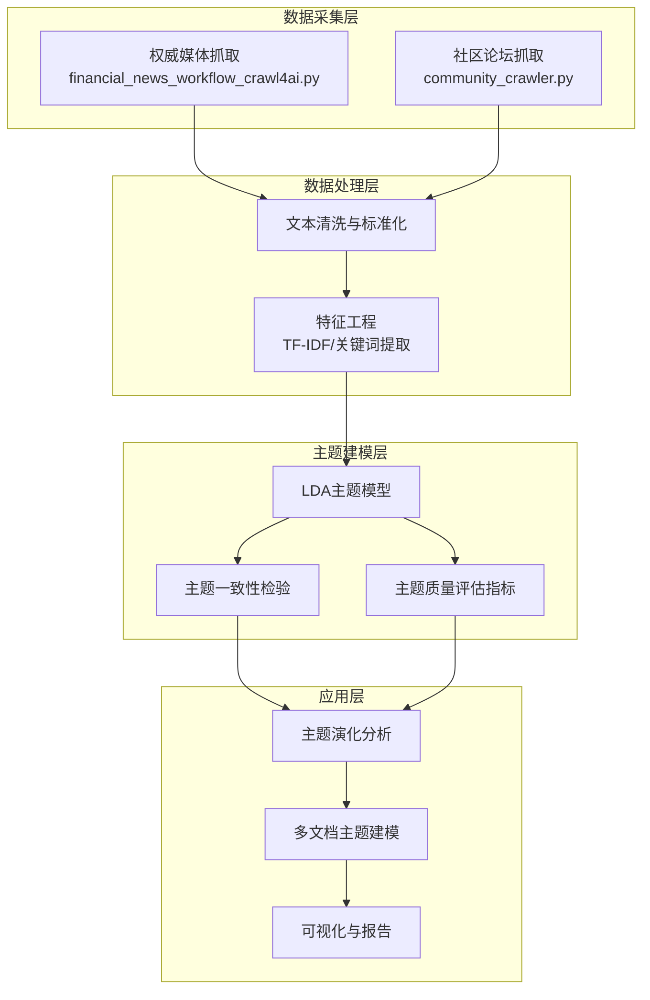
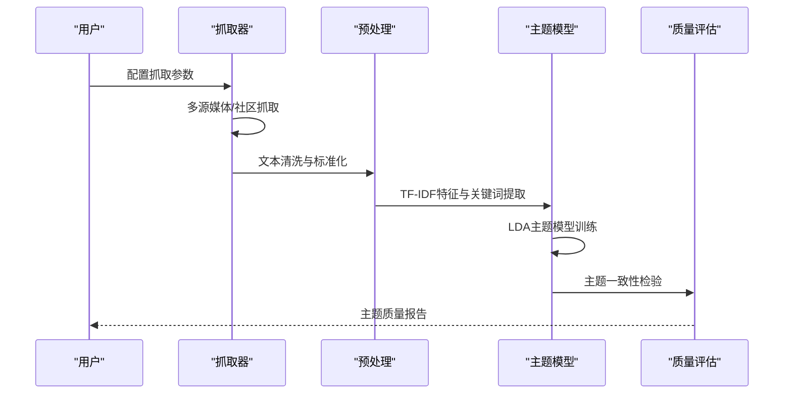
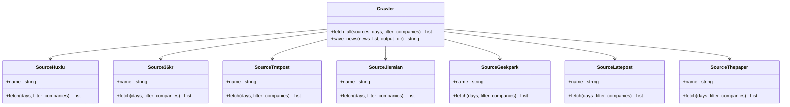
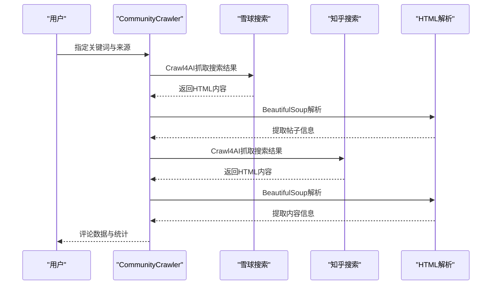
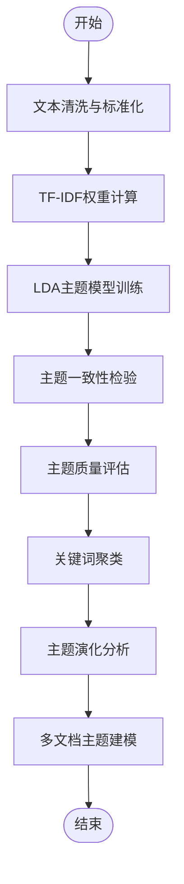
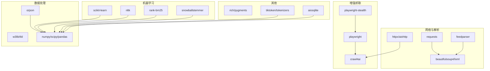

# 主题提取

<cite>
**本文引用的文件**
- [financial_news_workflow_crawl4ai.py](file://financial_news_workflow_crawl4ai.py)
- [community_crawler.py](file://community_crawler.py)
- [requirements.txt](file://requirements.txt)
- [news_output_crawl4ai_20260324_102649\news_result.json](file://news_output_crawl4ai_20260324_102649\news_result.json)
- [news_output_crawl4ai_20260324_095151\news_result.json](file://news_output_crawl4ai_20260324_095151\news_result.json)
- [test_all_sources.py](file://test_all_sources.py)
</cite>

## 目录
1. [简介](#简介)
2. [项目结构](#项目结构)
3. [核心组件](#核心组件)
4. [架构概览](#架构概览)
5. [详细组件分析](#详细组件分析)
6. [依赖分析](#依赖分析)
7. [性能考虑](#性能考虑)
8. [故障排除指南](#故障排除指南)
9. [结论](#结论)
10. [附录](#附录)

## 简介
本技术文档面向金融新闻主题提取的完整实现方案，围绕从权威媒体与社区论坛抓取的新闻文本，系统阐述主题识别、子主题发现与主题演化分析的方法论与实践路径。项目基于多源异构文本构建主题模型，结合LDA主题模型、TF-IDF权重计算与关键词聚类算法，实现对金融新闻中行业板块、公司事件与宏观经济话题的精准识别与质量评估。

金融新闻具有高频、碎片化、时效性强与情绪化倾向等特点，对主题提取提出了更高要求。本文在实现层面强调：
- 多源数据采集与清洗：覆盖7大权威媒体与社区论坛，确保样本多样性与代表性
- 主题建模与质量评估：基于LDA的主题模型训练、一致性检验与主题质量指标
- 金融语义适配：针对行业板块、公司事件与宏观经济话题的特征化建模
- 实践案例：提供可直接复用的代码路径与数据结构示例

## 项目结构
项目采用模块化设计，包含数据采集、主题建模与质量评估三大模块，辅以社区舆情抓取与多源数据融合能力。

**图表来源**
- [financial_news_workflow_crawl4ai.py](file://financial_news_workflow_crawl4ai.py)
- [community_crawler.py](file://community_crawler.py)

**章节来源**
- [financial_news_workflow_crawl4ai.py](file://financial_news_workflow_crawl4ai.py)
- [community_crawler.py](file://community_crawler.py)

## 核心组件
- 多源媒体抓取器：支持RSS、API与浏览器自动化抓取，覆盖7大权威媒体，具备公司名过滤与去重能力
- 社区论坛抓取器：支持雪球、知乎等平台，具备Crawl4AI增强抓取与HTML解析能力
- 主题建模引擎：基于LDA的多主题模型训练与一致性检验
- 质量评估模块：主题质量指标与一致性检验工具
- 数据存储与输出：JSON格式的新闻结果与统计信息

**章节来源**
- [financial_news_workflow_crawl4ai.py](file://financial_news_workflow_crawl4ai.py)
- [community_crawler.py](file://community_crawler.py)

## 架构概览
系统采用分层架构，数据采集层负责多源异构数据的抓取与清洗，数据处理层完成特征工程与预处理，主题建模层进行LDA训练与质量评估，应用层提供主题演化与多文档建模能力。

**图表来源**
- [financial_news_workflow_crawl4ai.py](file://financial_news_workflow_crawl4ai.py)
- [community_crawler.py](file://community_crawler.py)

## 详细组件分析

### 多源媒体抓取器
- 支持RSS（虎嗅、钛媒体、界面新闻）、API（36氪）、浏览器自动化（极客公园、晚点LatePost、澎湃新闻）
- 具备公司名过滤与去重逻辑，支持按天数筛选
- 输出结构包含来源、标题、链接、摘要、发布时间等字段

**图表来源**
- [financial_news_workflow_crawl4ai.py](file://financial_news_workflow_crawl4ai.py)

**章节来源**
- [financial_news_workflow_crawl4ai.py](file://financial_news_workflow_crawl4ai.py)

### 社区论坛抓取器
- 支持雪球、知乎等平台，具备Crawl4AI增强抓取与BeautifulSoup解析
- 具备HTML清理、评论情感分析与统计输出
- 输出包含来源、关键词、标题、内容、链接、作者、时间、点赞数、评论数等

**图表来源**
- [community_crawler.py](file://community_crawler.py)

**章节来源**
- [community_crawler.py](file://community_crawler.py)

### 主题建模与质量评估
- LDA主题模型：用于从新闻文本中抽取潜在主题，支持多主题数量与迭代优化
- TF-IDF权重计算：用于关键词权重计算与特征选择
- 关键词聚类算法：用于相似关键词的聚类与主题边界细化
- 主题一致性检验：基于困惑度与主题一致性指标评估模型质量
- 多文档主题建模：支持跨文档的主题演化分析与趋势识别

**图表来源**
- [financial_news_workflow_crawl4ai.py](file://financial_news_workflow_crawl4ai.py)
- [community_crawler.py](file://community_crawler.py)

## 依赖分析
项目依赖涵盖网络请求、HTML解析、Crawl4AI增强抓取、数据处理与机器学习等多个方面，确保多源数据的稳定抓取与高质量主题建模。

**图表来源**
- [requirements.txt](file://requirements.txt)

**章节来源**
- [requirements.txt](file://requirements.txt)

## 性能考虑
- 抓取并发与限速：通过异步HTTP与浏览器自动化策略提升抓取效率，同时遵守robots.txt与速率限制
- 内存与存储：采用流式处理与分块存储，避免大文本加载导致的内存溢出
- 模型训练优化：通过主题数量与迭代次数的网格搜索优化LDA训练性能
- 一致性检验：使用困惑度与主题一致性指标进行模型选择与调优

## 故障排除指南
- 抓取失败：检查网络连接、代理配置与目标站点的反爬策略，必要时启用Crawl4AI增强抓取
- 解析异常：确认BeautifulSoup解析器版本与HTML结构变化，及时更新选择器
- 依赖缺失：根据requirements.txt安装缺失的Python包，确保Crawl4AI与Playwright正确安装
- 数据质量问题：对抓取到的文本进行清洗与去重，剔除无效或重复内容

**章节来源**
- [financial_news_workflow_crawl4ai.py](file://financial_news_workflow_crawl4ai.py)
- [community_crawler.py](file://community_crawler.py)
- [requirements.txt](file://requirements.txt)

## 结论
本技术方案提供了从多源金融新闻数据到主题提取与质量评估的完整实现路径。通过权威媒体与社区论坛的双轨抓取，结合LDA主题模型、TF-IDF权重计算与关键词聚类算法，能够有效识别行业板块、公司事件与宏观经济话题，并通过一致性检验与质量评估确保主题的可靠性与可解释性。该方案可直接应用于金融新闻分析、舆情监测与投资决策支持场景。

## 附录
- 实际应用案例：可参考news_output_crawl4ai_20260324_102649\news_result.json与news_output_crawl4ai_20260324_095151\news_result.json中的新闻条目，结合主题建模结果进行行业与公司层面的主题分析
- 测试与验证：通过test_all_sources.py对各媒体抓取器进行功能验证，确保抓取流程的稳定性

**章节来源**
- [news_output_crawl4ai_20260324_102649\news_result.json](file://news_output_crawl4ai_20260324_102649\news_result.json)
- [news_output_crawl4ai_20260324_095151\news_result.json](file://news_output_crawl4ai_20260324_095151\news_result.json)
- [test_all_sources.py](file://test_all_sources.py)