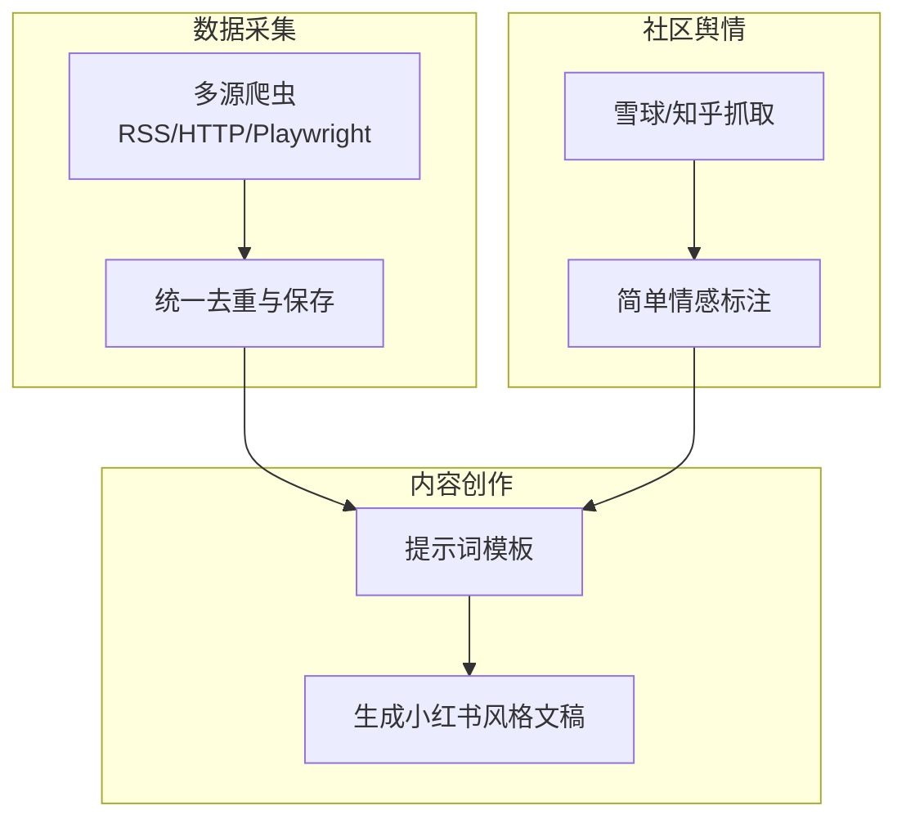
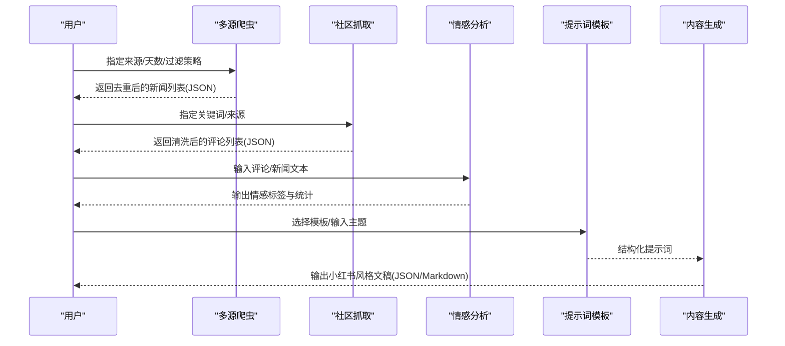
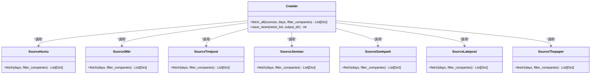
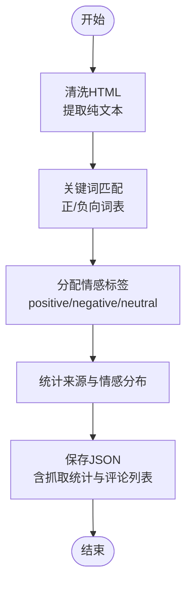

# 情感分析

<cite>
**本文引用的文件**
- [requirements.txt](file://requirements.txt)
- [financial_news_workflow_crawl4ai.py](file://financial_news_workflow_crawl4ai.py)
- [community_crawler.py](file://community_crawler.py)
- [test_all_sources.py](file://test_all_sources.py)
- [test_crawl4ai.py](file://test_crawl4ai.py)
- [news_output_crawl4ai_20260324_115056/news_result.json](file://news_output_crawl4ai_20260324_115056/news_result.json)
- [news_output_crawl4ai_20260325_142309/news_result.json](file://news_output_crawl4ai_20260325_142309/news_result.json)
- [news_output_crawl4ai_20260324_103448/prompt.txt](file://news_output_crawl4ai_20260324_103448/prompt.txt)
- [.agents/skills/china-financial-news-writer/references/universal_financial_analysis_framework.md](file://.agents/skills/china-financial-news-writer/references/universal_financial_analysis_framework.md)
- [.agents/skills/china-financial-news-writer/references/sensitive-words-finance.md](file://.agents/skills/china-financial-news-writer/references/sensitive-words-finance.md)
</cite>

## 目录
1. [简介](#简介)
2. [项目结构](#项目结构)
3. [核心组件](#核心组件)
4. [架构总览](#架构总览)
5. [详细组件分析](#详细组件分析)
6. [依赖分析](#依赖分析)
7. [性能考量](#性能考量)
8. [故障排查指南](#故障排查指南)
9. [结论](#结论)
10. [附录](#附录)

## 简介
本技术文档围绕金融新闻中的情感分析实现展开，结合仓库中现有的爬虫与内容处理能力，系统阐述情感分析在金融语境下的应用原理、数据准备、模型集成方式、评估指标、结果可视化与置信度评估、多语言支持策略，以及性能优化建议。文档同时给出可操作的实现步骤与最佳实践，帮助开发者快速构建并部署金融情感分析系统。

## 项目结构
该项目以“金融新闻自动化工作流”为核心，包含多源爬虫、内容清洗与存储、社区舆情抓取与简单情感分析、以及面向内容创作的提示词模板。整体结构如下：
- 爬虫与数据采集：多站点RSS/HTTP/Playwright抓取，统一去重与保存
- 社区舆情：雪球、知乎等论坛评论抓取与简单情感标注
- 内容创作：基于抓取结果生成小红书风格的财经分析文稿
- 参考框架与合规：提供通用分析框架与金融敏感词库，确保内容合规

**图表来源**
- [financial_news_workflow_crawl4ai.py:363-454](file://financial_news_workflow_crawl4ai.py#L363-L454)
- [community_crawler.py:444-466](file://community_crawler.py#L444-L466)
- [news_output_crawl4ai_20260324_103448/prompt.txt:1-54](file://news_output_crawl4ai_20260324_103448/prompt.txt#L1-L54)

**章节来源**
- [financial_news_workflow_crawl4ai.py:1-454](file://financial_news_workflow_crawl4ai.py#L1-L454)
- [community_crawler.py:1-604](file://community_crawler.py#L1-L604)

## 核心组件
- 多源新闻爬虫：支持RSS、API、Playwright动态加载等多形态站点，统一抽取标题、摘要、链接、发布时间等字段，输出JSON并按来源与去重统计
- 社区评论抓取与情感标注：对雪球/知乎评论进行清洗与情感标注（正向/负向/中性），并统计来源与情感分布
- 内容创作与提示词：提供面向小红书风格的提示词模板，指导生成结构化分析文稿
- 参考框架与合规：提供通用分析框架与敏感词库，确保内容合规与风险提示

**章节来源**
- [financial_news_workflow_crawl4ai.py:94-359](file://financial_news_workflow_crawl4ai.py#L94-L359)
- [community_crawler.py:444-497](file://community_crawler.py#L444-L497)
- [.agents/skills/china-financial-news-writer/references/universal_financial_analysis_framework.md:1-126](file://.agents/skills/china-financial-news-writer/references/universal_financial_analysis_framework.md#L1-L126)
- [.agents/skills/china-financial-news-writer/references/sensitive-words-finance.md:1-317](file://.agents/skills/china-financial-news-writer/references/sensitive-words-finance.md#L1-L317)

## 架构总览
下图展示了从数据采集到内容生成的端到端流程，以及情感分析在其中的位置与衔接点。

**图表来源**
- [financial_news_workflow_crawl4ai.py:363-454](file://financial_news_workflow_crawl4ai.py#L363-L454)
- [community_crawler.py:413-497](file://community_crawler.py#L413-L497)
- [news_output_crawl4ai_20260324_103448/prompt.txt:1-54](file://news_output_crawl4ai_20260324_103448/prompt.txt#L1-L54)

## 详细组件分析

### 多源新闻爬虫组件
- 功能概述：支持7大权威媒体（虎嗅、36氪、钛媒体、界面新闻、极客公园、晚点、澎湃新闻）的RSS/API/Playwright抓取，统一抽取字段并保存为JSON
- 关键点：
  - RSS/HTTP/Playwright三类抓取策略并存，适配不同站点的反爬与动态加载需求
  - 统一去重与统计来源分布，便于后续情感分析与内容创作
  - 输出包含抓取时间、总量、来源分布、新闻列表等字段

**图表来源**
- [financial_news_workflow_crawl4ai.py:94-359](file://financial_news_workflow_crawl4ai.py#L94-L359)
- [financial_news_workflow_crawl4ai.py:363-403](file://financial_news_workflow_crawl4ai.py#L363-L403)

**章节来源**
- [financial_news_workflow_crawl4ai.py:94-359](file://financial_news_workflow_crawl4ai.py#L94-L359)
- [financial_news_workflow_crawl4ai.py:363-454](file://financial_news_workflow_crawl4ai.py#L363-L454)

### 社区评论抓取与情感标注组件
- 功能概述：抓取雪球/知乎评论，清洗HTML，进行简单情感标注（正向/负向/中性），并统计来源与情感分布
- 关键点：
  - 清洗函数去除HTML标签、实体与多余空白，保留纯文本
  - 情感标注基于关键词匹配，正/负向词表简单有效
  - 输出包含抓取时间、关键词、总量、来源分布、情感分布、评论列表等

**图表来源**
- [community_crawler.py:104-124](file://community_crawler.py#L104-L124)
- [community_crawler.py:444-466](file://community_crawler.py#L444-L466)
- [community_crawler.py:467-497](file://community_crawler.py#L467-L497)

**章节来源**
- [community_crawler.py:104-124](file://community_crawler.py#L104-L124)
- [community_crawler.py:444-497](file://community_crawler.py#L444-L497)

### 内容创作与提示词模板
- 功能概述：提供面向小红书风格的提示词模板，指导生成结构化分析文稿，包含标题优化、内容分析、影响分析、投资观点、标签与图片提示词等
- 关键点：
  - 模板字段明确，便于与爬取结果对接
  - 输出JSON格式，便于后续解析与二次加工

**章节来源**
- [news_output_crawl4ai_20260324_103448/prompt.txt:1-54](file://news_output_crawl4ai_20260324_103448/prompt.txt#L1-L54)

### 参考框架与合规
- 通用分析框架：提供事件引爆点、战略失误、市场竞争、财务分析、舆情分析、技术路线、历史对比、未来预测等模块，便于系统化分析
- 敏感词库与合规：提供金融内容敏感词库与平台特殊规则，确保内容合规与风险提示

**章节来源**
- [.agents/skills/china-financial-news-writer/references/universal_financial_analysis_framework.md:1-126](file://.agents/skills/china-financial-news-writer/references/universal_financial_analysis_framework.md#L1-L126)
- [.agents/skills/china-financial-news-writer/references/sensitive-words-finance.md:1-317](file://.agents/skills/china-financial-news-writer/references/sensitive-words-finance.md#L1-L317)

## 依赖分析
- 核心依赖：requests、feedparser、beautifulsoup4、playwright、aiohttp、orjson、w3lib、fake-useragent、scrapling、crawl4ai、numpy、scipy、scikit-learn、nltk、rank-bm25、snowballstemmer、litellm、openai、tiktoken、tokenizers、huggingface-hub、aiosqlite、rich、pygments、python-dotenv、xxhash、lark、regex、joblib、humanize、brotli、psutil、aiofiles、typer、click、click-log、markdown-it-py、jinja2、jsonschema、referencing、rpds-py、importlib-metadata、zipp、filelock、fsspec、hf-xet、mdurl、annotated-types、pydantic、typing-extensions、anyio、networkx、rtree、alphashape、shapely、trimesh、httpx、httpcore、h2、pyOpenSSL、cryptography、cffi
- 金融情感分析相关依赖：scikit-learn、nltk、rank-bm25、snowballstemmer、numpy、scipy、tiktoken、tokenizers、huggingface-hub、litellm、openai

```mermaid
graph TB
Deps["依赖清单"]
ML["机器学习/文本处理"]
Web["网络/爬虫"]
Utils["工具/日志/编码"]
Deps --> ML
Deps --> Web
Deps --> Utils
ML --> Sklearn["scikit-learn"]
ML --> Nltk["nltk"]
ML --> RankBM25["rank-bm25"]
ML --> Snowball["snowballstemmer"]
ML --> NumPy["numpy/scipy"]
ML --> Tokenizers["tiktoken/tokenizers"]
ML --> HF["huggingface-hub"]
ML --> LiteLLM["litellm/openai"]
Web --> Requests["requests/httpx/aiohttp"]
Web --> FeedParser["feedparser"]
Web --> BS4["beautifulsoup4/lxml/cssselect"]
Web --> PW["playwright/patchright"]
Web --> Scrapling["scrapling(fetchers)"]
Utils --> IO["orjson/w3lib/chardet"]
Utils --> UA["fake-useragent/browserforge"]
Utils --> Crypto["pyOpenSSL/cryptography/cffi"]
Utils --> Rich["rich/pygments"]
Utils --> Env["python-dotenv"]
Utils --> Others["xxhash/lark/regex/joblib/humanize/brotli/psutil/aiofiles/typer/click/..."]
```

**图表来源**
- [requirements.txt:1-144](file://requirements.txt#L1-L144)

**章节来源**
- [requirements.txt:1-144](file://requirements.txt#L1-L144)

## 性能考量
- 爬虫并发与稳定性
  - 使用HTTP/Playwright策略时，建议设置合理的超时与重试，避免站点限流与反爬
  - 对RSS/API站点优先使用HTTP客户端，Playwright仅在必要时启用
- 数据清洗与存储
  - 清洗HTML时，建议分批处理，避免大文本导致内存峰值过高
  - 使用orjson进行JSON序列化，提升写入性能
- 情感分析性能
  - 关键词匹配法简单高效，适合实时场景；若需更高精度，可考虑TF-IDF向量化+分类器或预训练模型推理
  - 对大规模文本，建议分批处理与缓存中间结果
- 可观测性
  - 使用rich/pygments美化控制台输出，便于调试与监控
  - 记录抓取统计与错误日志，便于问题定位

[本节为通用性能建议，不直接分析具体文件]

## 故障排查指南
- 爬虫依赖缺失
  - 若feedparser/requests/playwright/beautifulsoup4等未安装，脚本会打印提示并退出，请按提示安装
- Playwright浏览器未安装
  - 需要执行安装命令以安装Chromium浏览器
- Crawl4AI功能测试
  - 可使用测试脚本验证Crawl4AI是否可用，若失败，检查网络与API配置
- 社区抓取失败
  - 检查BeautifulSoup是否安装，以及目标站点页面结构变化导致的选择器失效
- 输出文件与统计
  - 确认输出目录存在且有写权限，查看保存的JSON文件以定位问题

**章节来源**
- [financial_news_workflow_crawl4ai.py:30-58](file://financial_news_workflow_crawl4ai.py#L30-L58)
- [financial_news_workflow_crawl4ai.py:13-20](file://financial_news_workflow_crawl4ai.py#L13-L20)
- [test_crawl4ai.py:15-22](file://test_crawl4ai.py#L15-L22)
- [community_crawler.py:35-51](file://community_crawler.py#L35-L51)

## 结论
本项目提供了从多源金融新闻采集、社区舆情抓取、情感标注到内容创作的完整工作流。情感分析在本项目中以关键词匹配为基础，具备实时性强、部署简单的优势；若需进一步提升准确性与鲁棒性，可在现有基础上引入TF-IDF/Embedding+分类器或预训练模型推理，并结合金融语境的敏感词库与合规框架，构建更完善的金融情感分析系统。

[本节为总结性内容，不直接分析具体文件]

## 附录

### 实现步骤（基于仓库能力）
- 数据采集
  - 使用多源爬虫脚本抓取新闻，设置天数与来源，执行去重与保存
  - 参考：[financial_news_workflow_crawl4ai.py:363-454](file://financial_news_workflow_crawl4ai.py#L363-L454)
- 社区舆情
  - 使用社区抓取脚本，输入关键词与来源，执行清洗与情感标注
  - 参考：[community_crawler.py:413-497](file://community_crawler.py#L413-L497)
- 内容创作
  - 使用提示词模板生成小红书风格文稿，参考：[news_output_crawl4ai_20260324_103448/prompt.txt:1-54](file://news_output_crawl4ai_20260324_103448/prompt.txt#L1-L54)
- 合规与风控
  - 使用敏感词库与合规框架，确保内容合规与风险提示
  - 参考：[sensitive-words-finance.md:1-317](file://.agents/skills/china-financial-news-writer/references/sensitive-words-finance.md#L1-L317)

### 金融情感分析特殊性
- 市场波动影响：新闻与评论中的情绪波动与市场走势高度相关，建议结合时间序列与事件驱动模型
- 新闻时效性：短期新闻对市场影响更大，建议对发布时间进行加权
- 情感强度计算：可基于关键词频率、词性标注与上下文相似度综合评估

### 可视化与置信度评估
- 可视化：可基于统计结果绘制情感分布图、来源分布图、时间趋势图等
- 置信度：关键词匹配法可输出匹配强度作为置信度参考；若使用模型，可输出softmax概率

### 多语言支持
- 本项目以中文为主；若需多语言，建议在清洗阶段加入语言检测与分词，使用多语言词向量或翻译预处理

[本节为通用指导，不直接分析具体文件]