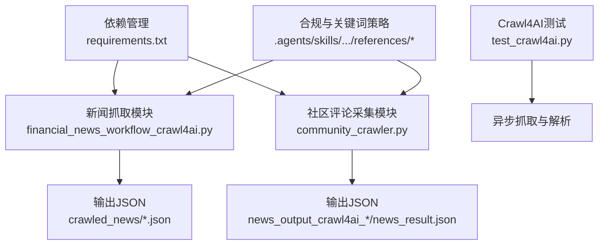
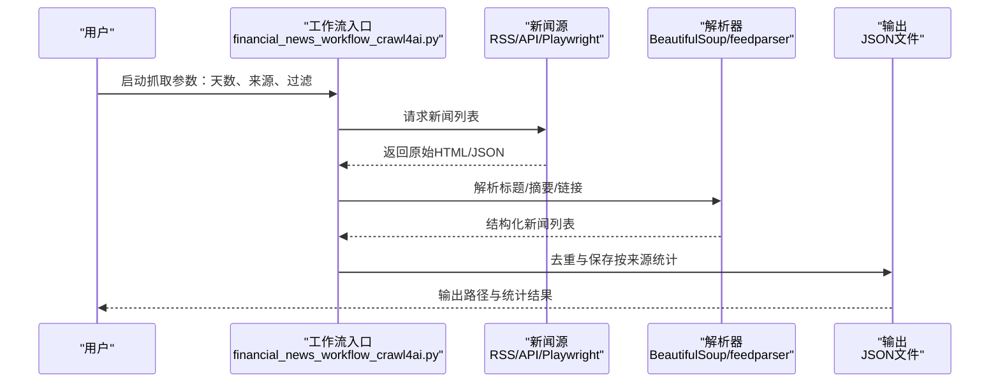
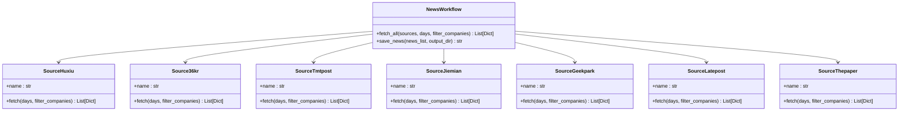
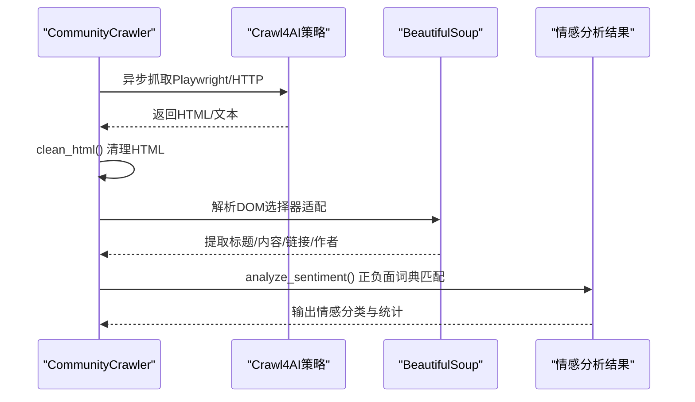
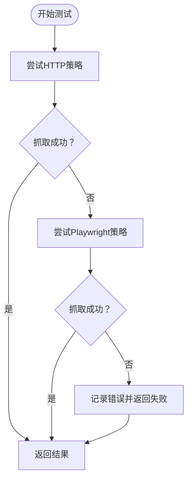
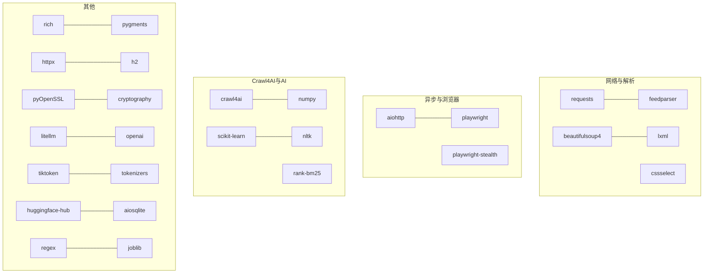

# 自然语言处理

<cite>
**本文引用的文件**
- [financial_news_workflow_crawl4ai.py](file://financial_news_workflow_crawl4ai.py)
- [community_crawler.py](file://community_crawler.py)
- [test_crawl4ai.py](file://test_crawl4ai.py)
- [requirements.txt](file://requirements.txt)
- [universal_financial_analysis_framework.md](file://.agents/skills/china-financial-news-writer/references/universal_financial_analysis_framework.md)
- [sensitive-words-finance.md](file://.agents/skills/china-financial-news-writer/references/sensitive-words-finance.md)
- [company-profiles.md](file://.agents/skills/china-financial-news-writer/references/company-profiles.md)
- [keyword-strategy.md](file://.agents/skills/china-financial-news-writer/references/keyword-strategy.md)
- [title-formulas.md](file://.agents/skills/china-financial-news-writer/references/title-formulas.md)
- [all_news_20260325_122653.json](file://crawled_news/all_news_20260325_122653.json)
- [news_result.json](file://news_output_crawl4ai_20260324_115056/news_result.json)
- [news_result.json](file://news_output_crawl4ai_20260324_103448/news_result.json)
</cite>

## 目录
1. [简介](#简介)
2. [项目结构](#项目结构)
3. [核心组件](#核心组件)
4. [架构概览](#架构概览)
5. [详细组件分析](#详细组件分析)
6. [依赖分析](#依赖分析)
7. [性能考虑](#性能考虑)
8. [故障排除指南](#故障排除指南)
9. [结论](#结论)
10. [附录](#附录)

## 简介
本文件面向开发者与金融分析师，系统阐述如何在金融新闻分析中应用自然语言处理（NLP）技术。项目基于多源新闻抓取与社区评论采集，提供从数据获取、清洗、结构化到主题提取与合规检查的完整工作流。文档重点覆盖：
- 文本预处理与中文文本处理的特殊考虑
- 分词、词性标注与命名实体识别（NER）在金融领域的应用
- 财经术语识别、公司名称标准化与财务指标抽取
- 关键词识别、文本分类与语义分析方法
- 情感分析与敏感词合规检测
- 代码实现路径与最佳实践

## 项目结构
项目采用模块化设计，包含新闻抓取、社区评论采集、Crawl4AI增强抓取、合规与关键词策略等模块。核心文件与职责如下：
- financial_news_workflow_crawl4ai.py：多源新闻抓取与去重，支持RSS、API与Playwright动态抓取
- community_crawler.py：社区论坛评论采集与情感分析，支持Crawl4AI与BeautifulSoup解析
- test_crawl4ai.py：Crawl4AI库功能测试与异步抓取示例
- requirements.txt：项目依赖清单，包含NLP与AI相关库
- .agents/skills/china-financial-news-writer/references：金融写作与合规参考文档，提供关键词策略、标题公式、敏感词库与公司画像

**图表来源**
- [financial_news_workflow_crawl4ai.py:1-454](file://financial_news_workflow_crawl4ai.py#L1-L454)
- [community_crawler.py:1-604](file://community_crawler.py#L1-L604)
- [test_crawl4ai.py:1-163](file://test_crawl4ai.py#L1-L163)
- [requirements.txt:1-144](file://requirements.txt#L1-L144)

**章节来源**
- [financial_news_workflow_crawl4ai.py:1-454](file://financial_news_workflow_crawl4ai.py#L1-L454)
- [community_crawler.py:1-604](file://community_crawler.py#L1-L604)
- [test_crawl4ai.py:1-163](file://test_crawl4ai.py#L1-L163)
- [requirements.txt:1-144](file://requirements.txt#L1-L144)

## 核心组件
- 多源新闻抓取器：支持RSS（feedparser）、API（requests）、动态页面（Playwright），并提供公司名过滤与去重
- 社区评论采集器：支持雪球、知乎等平台，提供HTML清理、BeautifulSoup解析与情感分析
- Crawl4AI增强抓取：异步HTTP/Playwright策略，支持复杂页面与AI增强内容理解
- 合规与关键词策略：敏感词检测、标题公式、关键词布局与公司画像

**章节来源**
- [financial_news_workflow_crawl4ai.py:94-358](file://financial_news_workflow_crawl4ai.py#L94-L358)
- [community_crawler.py:82-410](file://community_crawler.py#L82-L410)
- [test_crawl4ai.py:15-120](file://test_crawl4ai.py#L15-L120)
- [sensitive-words-finance.md:1-317](file://.agents/skills/china-financial-news-writer/references/sensitive-words-finance.md#L1-L317)
- [keyword-strategy.md:1-302](file://.agents/skills/china-financial-news-writer/references/keyword-strategy.md#L1-L302)

## 架构概览
系统采用“抓取-解析-结构化-分析-输出”的流水线架构。抓取层支持静态与动态页面；解析层使用BeautifulSoup与Crawl4AI；结构化层将原始文本转换为统一字段；分析层包含情感分析、敏感词检测与关键词抽取；输出层生成JSON与合规报告。

**图表来源**
- [financial_news_workflow_crawl4ai.py:363-450](file://financial_news_workflow_crawl4ai.py#L363-L450)

**章节来源**
- [financial_news_workflow_crawl4ai.py:363-450](file://financial_news_workflow_crawl4ai.py#L363-L450)

## 详细组件分析

### 新闻抓取与解析组件
- RSS/Atom源：使用feedparser解析，提取标题、摘要、链接与发布时间
- API源：使用requests获取JSON数据，解析新闻列表
- 动态页面：使用Playwright加载JavaScript渲染页面，提取文章链接与内容
- 公司名过滤：基于预置公司名单进行关键词过滤
- 去重与统计：按标题去重并统计来源分布

**图表来源**
- [financial_news_workflow_crawl4ai.py:94-358](file://financial_news_workflow_crawl4ai.py#L94-L358)

**章节来源**
- [financial_news_workflow_crawl4ai.py:94-358](file://financial_news_workflow_crawl4ai.py#L94-L358)

### 社区评论采集与情感分析组件
- Crawl4AI增强抓取：优先使用Playwright策略，失败时回退HTTP策略
- HTML清理：去除标签、实体与多余空白，保留纯文本
- 多平台解析：针对雪球、知乎的不同DOM结构进行选择器适配
- 情感分析：基于正负面词典进行简单情感打分与分类

**图表来源**
- [community_crawler.py:127-176](file://community_crawler.py#L127-L176)
- [community_crawler.py:179-194](file://community_crawler.py#L179-L194)
- [community_crawler.py:197-410](file://community_crawler.py#L197-L410)

**章节来源**
- [community_crawler.py:127-176](file://community_crawler.py#L127-L176)
- [community_crawler.py:179-194](file://community_crawler.py#L179-L194)
- [community_crawler.py:197-410](file://community_crawler.py#L197-L410)

### Crawl4AI测试与异步抓取
- 异步策略：AsyncHTTPCrawlerStrategy与AsyncPlaywrightCrawlerStrategy
- 测试用例：基础网页、复杂网页与AI增强抓取
- 错误处理：网络异常、SSL错误与回退策略

**图表来源**
- [test_crawl4ai.py:29-120](file://test_crawl4ai.py#L29-L120)

**章节来源**
- [test_crawl4ai.py:29-120](file://test_crawl4ai.py#L29-L120)

### 数据结构与示例
- 新闻数据结构：包含来源、标题、链接、摘要、发布时间等字段
- 社区评论数据结构：包含来源、关键词、标题、内容、链接、作者、时间、点赞/评论数等字段
- 输出示例：抓取结果JSON与社区评论JSON

**章节来源**
- [all_news_20260325_122653.json:1-495](file://crawled_news/all_news_20260325_122653.json#L1-L495)
- [news_result.json:1-267](file://news_output_crawl4ai_20260324_115056/news_result.json#L1-L267)
- [news_result.json:1-34](file://news_output_crawl4ai_20260324_103448/news_result.json#L1-L34)

## 依赖分析
项目依赖涵盖网络请求、HTML解析、异步抓取、Crawl4AI、NLP与AI模型等模块。关键依赖包括：
- 网络与解析：requests、feedparser、beautifulsoup4、lxml、cssselect
- 异步与浏览器：aiohttp、playwright、playwright-stealth
- Crawl4AI：crawl4ai、numpy、scipy、scikit-learn、nltk、rank-bm25
- 其他：rich、pygments、httpx、h2、pyOpenSSL、cryptography、litellm、openai、tiktoken、tokenizers、huggingface-hub、aiosqlite、regex、joblib、humanize、brotli、psutil、aiofiles、typer、click、markdown-it-py、jinja2、jsonschema、referencing、rpds-py、importlib-metadata、zipp、filelock、fsspec、hf-xet、mdurl、annotated-types、pydantic、typing-inspection

**图表来源**
- [requirements.txt:1-144](file://requirements.txt#L1-L144)

**章节来源**
- [requirements.txt:1-144](file://requirements.txt#L1-L144)

## 性能考虑
- 异步抓取：使用aiohttp与AsyncWebCrawler降低I/O阻塞，提升并发吞吐
- 策略回退：Crawl4AI优先使用Playwright，失败时回退HTTP策略，兼顾稳定性与性能
- 解析优化：BeautifulSoup与lxml组合，针对不同页面结构选择合适解析器
- 缓存与去重：抓取后按标题去重，减少重复处理与存储开销
- 超时与重试：合理设置超时与重试策略，避免长时间阻塞

[本节为通用指导，不直接分析具体文件]

## 故障排除指南
- 依赖缺失：根据提示安装缺失模块，如feedparser、beautifulsoup4、playwright等
- 网络与SSL错误：检查网络连接与证书配置，必要时调整代理或降级TLS版本
- Crawl4AI安装：确保已安装crawl4ai并正确初始化Playwright浏览器
- 页面结构变化：当目标站点DOM结构变化时，需更新选择器与解析逻辑
- 编码问题：Windows控制台编码问题可通过TextIOWrapper修复

**章节来源**
- [financial_news_workflow_crawl4ai.py:31-57](file://financial_news_workflow_crawl4ai.py#L31-L57)
- [community_crawler.py:36-51](file://community_crawler.py#L36-L51)
- [test_crawl4ai.py:15-22](file://test_crawl4ai.py#L15-L22)

## 结论
本项目提供了金融新闻与社区评论的自动化抓取与分析框架，结合Crawl4AI与NLP技术，能够实现从原始文本到结构化数据的高效处理。通过关键词策略、标题公式与敏感词检测，系统在内容合规与传播效果方面提供有力支撑。开发者可在此基础上扩展命名实体识别、情感分析与主题建模等高级NLP能力，构建更完善的金融信息理解与主题提取系统。

[本节为总结性内容，不直接分析具体文件]

## 附录

### NLP在金融新闻中的应用指南
- 文本预处理
  - 清理HTML标签与实体，保留纯文本
  - 中文分词与词性标注：可使用jieba、HanLP或spaCy中文模型
  - 停用词过滤：构建金融领域停用词表，过滤常见虚词与无意义词汇
- 命名实体识别（NER）
  - 公司名标准化：将不同表述统一为标准简称或股票代码
  - 财经术语识别：识别财务指标、政策术语与行业概念
- 关键词识别与文本分类
  - TF-IDF/BM25关键词抽取
  - 文本分类：基于新闻类型（财报、产品、行业、政策）进行分类
- 语义分析与情感分析
  - 情感词典：结合金融领域情感词典，进行细粒度情感打分
  - 主题建模：LDA或BERTopic进行主题发现与文档聚类
- 合规与敏感词检测
  - 基于敏感词库进行扫描与替换
  - 标题与内容的合规性检查，确保表述符合平台规则

[本节为概念性内容，不直接分析具体文件]