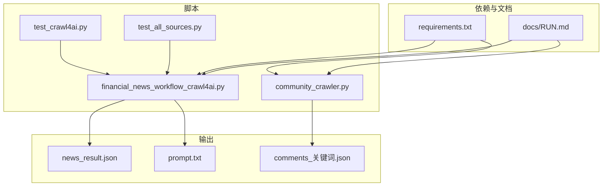
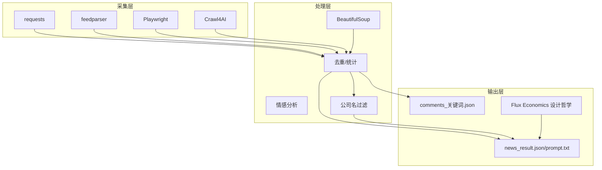
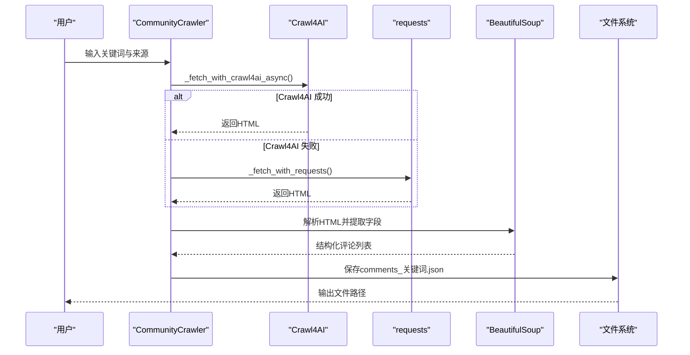
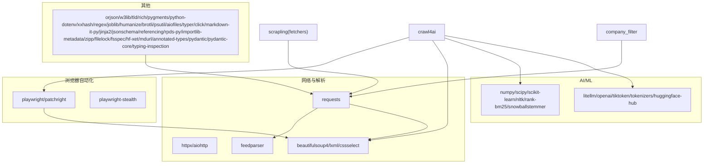

# 技术实现细节

<cite>
**本文引用的文件**
- [community_crawler.py](file://community_crawler.py)
- [financial_news_workflow_crawl4ai.py](file://financial_news_workflow_crawl4ai.py)
- [test_crawl4ai.py](file://test_crawl4ai.py)
- [test_all_sources.py](file://test_all_sources.py)
- [requirements.txt](file://requirements.txt)
- [docs/RUN.md](file://docs/RUN.md)
- [news_output_crawl4ai_20260324_102649/news_result.json](file://news_output_crawl4ai_20260324_102649/news_result.json)
- [news_output_crawl4ai_20260324_102649/prompt.txt](file://news_output_crawl4ai_20260324_102649/prompt.txt)
- [company_filter.py](file://company_filter.py)
- [design_philosophy.md](file://design/design_philosophy.md)
</cite>

## 目录
1. [简介](#简介)
2. [项目结构](#项目结构)
3. [核心组件](#核心组件)
4. [架构总览](#架构总览)
5. [详细组件分析](#详细组件分析)
6. [依赖关系分析](#依赖关系分析)
7. [性能与优化](#性能与优化)
8. [故障排查指南](#故障排查指南)
9. [结论](#结论)
10. [附录](#附录)

## 简介
本文件面向开发者与技术读者，系统梳理本仓库在"金融新闻与社区舆情"自动化采集与分析方面的技术实现细节，重点覆盖以下方面：
- 反爬虫与浏览器自动化：Scrapling、Playwright、Crawl4AI 的策略与集成
- 异步抓取优化：并发控制、超时与重试、降噪与降级
- 数据处理与存储：清洗、去重、结构化输出、提示词生成
- AI增强抓取与分析：Crawl4AI 的内容抽取与提示词生成
- 第三方库集成与扩展：依赖清单、安装与验证
- 实践指南：调试方法、常见问题与性能优化

## 项目结构
项目采用"脚本化工作流 + 结构化输出"的组织方式，核心文件与输出目录如下：
- 脚本
  - 社区论坛抓取：community_crawler.py
  - 金融新闻自动化工作流：financial_news_workflow_crawl4ai.py
  - Crawl4AI 功能测试：test_crawl4ai.py
  - 多源抓取测试：test_all_sources.py
- 依赖与运行说明：requirements.txt、docs/RUN.md
- 输出
  - 金融新闻结果：news_output_crawl4ai_YYYYMMDD_HHMMSS/news_result.json
  - 社区评论结果：community_output_YYYYMMDD_HHMMSS/comments_关键词.json
  - 提示词：news_output_crawl4ai_YYYYMMDD_HHMMSS/prompt.txt

**图表来源**
- [community_crawler.py](file://community_crawler.py)
- [financial_news_workflow_crawl4ai.py](file://financial_news_workflow_crawl4ai.py)
- [test_crawl4ai.py](file://test_crawl4ai.py)
- [test_all_sources.py](file://test_all_sources.py)
- [requirements.txt](file://requirements.txt)
- [docs/RUN.md](file://docs/RUN.md)

**章节来源**
- [docs/RUN.md](file://docs/RUN.md)
- [requirements.txt](file://requirements.txt)

## 核心组件
- 社区论坛抓取器（CommunityCrawler）
  - 支持雪球、知乎等来源，提供异步抓取、HTML清理、情感分析与结果保存
- 金融新闻自动化工作流（financial_news_workflow_crawl4ai.py）
  - 多源抓取（RSS/API/Playwright/requests），去重与统计，生成分析提示词
- Crawl4AI 测试（test_crawl4ai.py）
  - 验证 Crawl4AI 的抓取能力与返回结构
- 多源测试（test_all_sources.py）
  - 验证各新闻源抓取的连通性与解析稳定性

**章节来源**
- [community_crawler.py](file://community_crawler.py)
- [financial_news_workflow_crawl4ai.py](file://financial_news_workflow_crawl4ai.py)
- [test_crawl4ai.py](file://test_crawl4ai.py)
- [test_all_sources.py](file://test_all_sources.py)

## 架构总览
整体架构分为三层：
- 数据采集层：requests、feedparser、Playwright、Crawl4AI
- 处理与分析层：BeautifulSoup（可选）、情感分析、去重与统计
- 输出与提示词层：JSON 结构化输出、提示词生成

**图表来源**
- [community_crawler.py](file://community_crawler.py)
- [financial_news_workflow_crawl4ai.py](file://financial_news_workflow_crawl4ai.py)

## 详细组件分析

### 社区论坛抓取器（CommunityCrawler）
- 功能要点
  - 多来源配置与抓取：雪球、知乎
  - 异步抓取与降级：优先 Crawl4AI（Playwright/HTTP），失败回退 requests
  - HTML 清洗：去除标签、实体、多余空白
  - 情感分析：基于关键词的简易分类
  - 结果保存：按来源与情感分组统计，输出 JSON
- 关键实现路径
  - 异步抓取与降级策略：[community_crawler.py](file://community_crawler.py)
  - HTML 清洗：[community_crawler.py](file://community_crawler.py)
  - 情感分析：[community_crawler.py](file://community_crawler.py)
  - 结果保存：[community_crawler.py](file://community_crawler.py)

**图表来源**
- [community_crawler.py](file://community_crawler.py)

**章节来源**
- [community_crawler.py](file://community_crawler.py)

### 金融新闻自动化工作流
- 功能要点
  - 多源抓取：RSS（feedparser）、API（requests）、Playwright（动态加载）、普通 HTTP（requests）
  - 去重与统计：按标题去重，统计来源分布
  - 输出结构：news_result.json（含抓取时间、来源统计、公司分布、新闻列表、相关度）
  - 提示词生成：prompt.txt（用于后续分析与内容创作）
- 关键实现路径
  - 各源抓取器：[financial_news_workflow_crawl4ai.py](file://financial_news_workflow_crawl4ai.py)
  - 去重与保存：[financial_news_workflow_crawl4ai.py](file://financial_news_workflow_crawl4ai.py)
  - 输出示例：[news_output_crawl4ai_20260324_102649/news_result.json](file://news_output_crawl4ai_20260324_102649/news_result.json)

```mermaid
flowchart TD
Start(["开始"]) --> PickSources["选择来源集合"]
PickSources --> FetchRSS["RSS 源抓取<br/>feedparser"]
PickSources --> FetchAPI["API 源抓取<br/>requests"]
PickSources --> FetchPW["Playwright 源抓取<br/>动态加载"]
PickSources --> FetchHTTP["HTTP 源抓取<br/>普通请求"]
FetchRSS --> Merge["合并结果"]
FetchAPI --> Merge
FetchPW --> Merge
FetchHTTP --> Merge
Merge --> Dedup["按标题去重"]
Dedup --> Stats["统计来源与公司分布"]
Stats --> SaveJSON["保存 news_result.json"]
Stats --> SavePrompt["生成并保存 prompt.txt"]
SaveJSON --> End(["结束"])
SavePrompt --> End
```

**图表来源**
- [financial_news_workflow_crawl4ai.py](file://financial_news_workflow_crawl4ai.py)

**章节来源**
- [financial_news_workflow_crawl4ai.py](file://financial_news_workflow_crawl4ai.py)
- [news_output_crawl4ai_20260324_102649/news_result.json](file://news_output_crawl4ai_20260324_102649/news_result.json)

### Crawl4AI 功能测试
- 功能要点
  - 验证 Crawl4AI 安装与可用性
  - 测试 HTTP 策略抓取与返回结构
  - 为后续增强抓取提供基础验证
- 关键实现路径
  - 测试脚本：[test_crawl4ai.py](file://test_crawl4ai.py)

**章节来源**
- [test_crawl4ai.py](file://test_crawl4ai.py)

### 多源抓取测试
- 功能要点
  - 验证各新闻源抓取的连通性与解析稳定性
  - 便于快速定位源失效或解析规则变更
- 关键实现路径
  - 测试脚本：[test_all_sources.py](file://test_all_sources.py)

**章节来源**
- [test_all_sources.py](file://test_all_sources.py)

### 公司名过滤模块
- 功能要点
  - 基于公司名单过滤新闻标题
  - 支持公司名匹配与评分
  - 为新闻内容分析提供筛选机制
- 关键实现路径
  - 过滤逻辑：[company_filter.py](file://company_filter.py)
  - 测试用例：[company_filter.py](file://company_filter.py)

**章节来源**
- [company_filter.py](file://company_filter.py)

## 依赖关系分析
- 核心依赖
  - 网络请求：requests、httpx、aiohttp
  - RSS 解析：feedparser
  - HTML 解析：beautifulsoup4、lxml、cssselect
  - 浏览器自动化：playwright、patchright、playwright-stealth
  - AI/ML 与向量化：numpy、scipy、scikit-learn、nltk、rank-bm25、snowballstemmer
  - 大模型调用：litellm、openai、tiktoken、tokenizers、huggingface-hub
  - 其他：orjson、w3lib、tld、rich、pygments、python-dotenv、xxhash、regex、joblib、humanize、brotli、psutil、aiofiles、typer、click、markdown-it-py、jinja2、jsonschema、referencing、rpds-py、importlib-metadata、zipp、filelock、fsspec、hf-xet、mdurl、annotated-types、pydantic、pydantic-core、typing-inspection
- 爬虫增强库
  - Scrapling：反爬克星（主力爬虫，支持 Cloudflare Turnstile 绕过、自适应解析、代理轮换）
  - Crawl4AI：AI 驱动的爬虫（备用）

**图表来源**
- [requirements.txt](file://requirements.txt)

**章节来源**
- [requirements.txt](file://requirements.txt)

## 性能与优化
- 异步与并发
  - 社区抓取器使用 asyncio 进行异步抓取，减少 I/O 等待
  - 金融新闻工作流按源并行抓取，最后统一去重
- 超时与重试
  - requests 设置超时，Playwright 设置等待与滚动策略
  - Crawl4AI 提供 Playwright/HTTP 双策略回退
- 降噪与降级
  - BeautifulSoup 可选依赖，缺失时仍可使用 requests 抓取
  - RSS/API/Playwright/HTTP 多策略并存，任一可用即继续
- 存储与压缩
  - 使用 orjson 提升 JSON 处理性能
- 调试与日志
  - 丰富的打印日志，便于定位失败源与解析问题

**章节来源**
- [community_crawler.py](file://community_crawler.py)
- [financial_news_workflow_crawl4ai.py](file://financial_news_workflow_crawl4ai.py)
- [requirements.txt](file://requirements.txt)

## 故障排查指南
- Crawl4AI 未安装
  - 现象：提示未安装，回退到 requests
  - 处理：安装 crawl4ai 并验证
  - 参考：[test_crawl4ai.py](file://test_crawl4ai.py)
- Playwright 未安装或浏览器未安装
  - 现象：源抓取失败或浏览器启动异常
  - 处理：安装 playwright 并执行 npx playwright install chromium
  - 参考：[docs/RUN.md](file://docs/RUN.md)
- 依赖安装失败
  - 现象：pip 安装报错
  - 处理：升级 pip，使用 --only-binary :all:，检查网络
  - 参考：[docs/RUN.md](file://docs/RUN.md)
- 源解析失败或返回空
  - 现象：抓取到 0 条或解析异常
  - 处理：运行 test_all_sources.py 定位具体源问题；检查 feedparser/requests/Playwright 依赖
  - 参考：[test_all_sources.py](file://test_all_sources.py)
- 输出为空或结构异常
  - 现象：news_result.json/prompt.txt 为空或字段缺失
  - 处理：检查抓取源是否可用、去重逻辑是否生效、输出目录权限
  - 参考：[financial_news_workflow_crawl4ai.py](file://financial_news_workflow_crawl4ai.py)

**章节来源**
- [test_crawl4ai.py](file://test_crawl4ai.py)
- [docs/RUN.md](file://docs/RUN.md)
- [test_all_sources.py](file://test_all_sources.py)
- [financial_news_workflow_crawl4ai.py](file://financial_news_workflow_crawl4ai.py)

## 结论
本项目通过"多策略抓取 + 异步优化 + 结构化输出"的技术路径，实现了对金融新闻与社区舆情的自动化采集与分析。Crawl4AI 与 Playwright 的引入显著增强了对动态/反爬站点的适配能力；异步与降级策略保障了抓取的稳定性；BeautifulSoup 与 orjson 提升了解析与存储效率。配合提示词生成与分析框架，可进一步支撑内容创作与投资研究。

## 附录

### 代码实现示例（路径）
- 社区抓取入口与异步策略：[community_crawler.py](file://community_crawler.py)
- 金融新闻多源抓取与去重：[financial_news_workflow_crawl4ai.py](file://financial_news_workflow_crawl4ai.py)
- Crawl4AI 功能验证：[test_crawl4ai.py](file://test_crawl4ai.py)
- 多源连通性测试：[test_all_sources.py](file://test_all_sources.py)

### API 与接口说明
- 社区抓取 CLI
  - 参数：--keyword、--sources、--output
  - 输出：comments_关键词.json（含情感分析与统计）
- 金融新闻工作流 CLI
  - 参数：--days、--sources、--output、--fixed-output、--filter-companies
  - 输出：news_result.json、prompt.txt

**章节来源**
- [docs/RUN.md](file://docs/RUN.md)
- [community_crawler.py](file://community_crawler.py)
- [financial_news_workflow_crawl4ai.py](file://financial_news_workflow_crawl4ai.py)

### 扩展开发指导
- 新增抓取源
  - 在对应模块中新增 SourceX 类，实现 fetch(days, filter_companies)
  - 在 fetch_all 中注册映射
- 集成 AI 分析
  - 使用 Crawl4AI 的 AI 增强能力抽取正文与结构化字段
  - 基于提示词生成框架（universal_financial_analysis_framework.md）扩展分析维度
- 可视化与设计
  - 参考 Flux Economics 设计哲学，构建数据可视化与内容表达

**章节来源**
- [design/design_philosophy.md](file://design/design_philosophy.md)