# 数据处理与存储

<cite>
**本文档引用的文件**
- [community_crawler.py](file://community_crawler.py)
- [financial_news_workflow_crawl4ai.py](file://financial_news_workflow_crawl4ai.py)
- [test_all_sources.py](file://test_all_sources.py)
- [test_crawl4ai.py](file://test_crawl4ai.py)
- [requirements.txt](file://requirements.txt)
- [news_output_20260323_235950\news_result.json](file://news_output_20260323_235950\news_result.json)
- [news_output_crawl4ai_20260324_095151\news_result.json](file://news_output_crawl4ai_20260324_095151\news_result.json)
- [news_output\news_20260324_182234.json](file://news_output\news_20260324_182234.json)
- [crawled_news\all_news_20260325_122653.json](file://crawled_news\all_news_20260325_122653.json)
- [news_source_test_result.json](file://news_source_test_result.json)
</cite>

## 目录
1. [简介](#简介)
2. [项目结构](#项目结构)
3. [核心组件](#核心组件)
4. [架构概览](#架构概览)
5. [详细组件分析](#详细组件分析)
6. [依赖关系分析](#依赖关系分析)
7. [性能考虑](#性能考虑)
8. [故障排除指南](#故障排除指南)
9. [结论](#结论)
10. [附录](#附录)

## 简介

本项目是一个综合性数据处理与存储系统，专注于金融新闻和社区论坛数据的采集、清洗、去重和格式化处理。系统采用模块化设计，支持多种数据源的并行抓取，提供完整的数据验证规则、字段标准化和异常数据处理机制。

系统主要包含两大核心功能模块：
- **金融新闻自动化工作流**：从7大权威媒体抓取热点新闻，支持RSS、API和动态网页抓取
- **社区论坛信息抓取工具**：从雪球网、知乎等社区平台抓取用户评论和讨论

## 项目结构

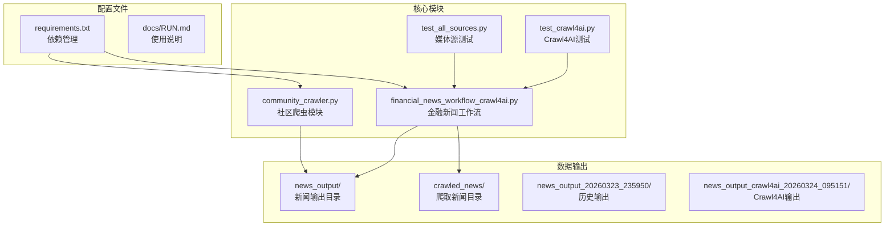

**图表来源**
- [community_crawler.py:1-604](file://community_crawler.py#L1-L604)
- [financial_news_workflow_crawl4ai.py:1-454](file://financial_news_workflow_crawl4ai.py#L1-L454)

**章节来源**
- [community_crawler.py:1-604](file://community_crawler.py#L1-L604)
- [financial_news_workflow_crawl4ai.py:1-454](file://financial_news_workflow_crawl4ai.py#L1-L454)

## 核心组件

### 数据采集组件

系统采用多源并行采集策略，支持不同类型的新闻源：

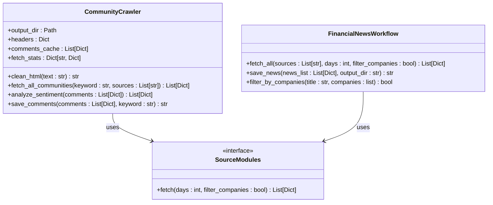

**图表来源**
- [community_crawler.py:82-497](file://community_crawler.py#L82-L497)
- [financial_news_workflow_crawl4ai.py:94-382](file://financial_news_workflow_crawl4ai.py#L94-L382)

### 数据处理管道

系统实现了完整的数据处理管道，包括数据清洗、去重和格式化：

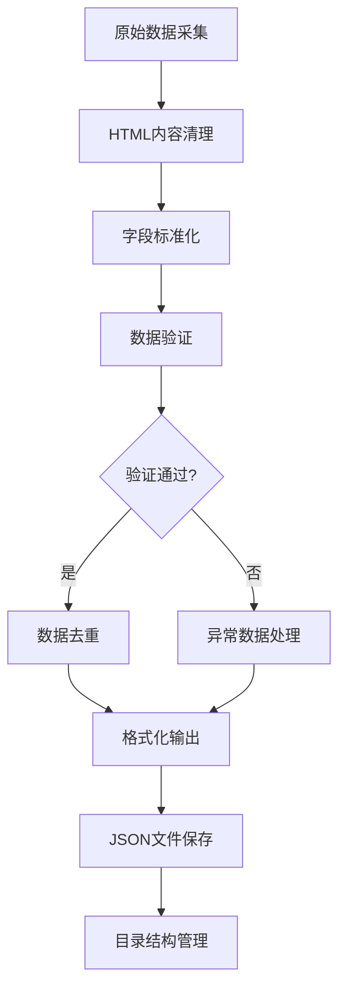

**图表来源**
- [community_crawler.py:105-124](file://community_crawler.py#L105-L124)
- [financial_news_workflow_crawl4ai.py:432-440](file://financial_news_workflow_crawl4ai.py#L432-L440)

**章节来源**
- [community_crawler.py:82-497](file://community_crawler.py#L82-L497)
- [financial_news_workflow_crawl4ai.py:94-382](file://financial_news_workflow_crawl4ai.py#L94-L382)

## 架构概览

系统采用分层架构设计，确保模块间的松耦合和高内聚：

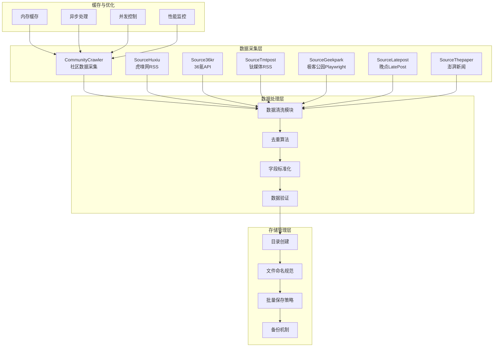

**图表来源**
- [community_crawler.py:56-497](file://community_crawler.py#L56-L497)
- [financial_news_workflow_crawl4ai.py:94-454](file://financial_news_workflow_crawl4ai.py#L94-L454)

## 详细组件分析

### 社区数据采集组件

#### CommunityCrawler 类分析

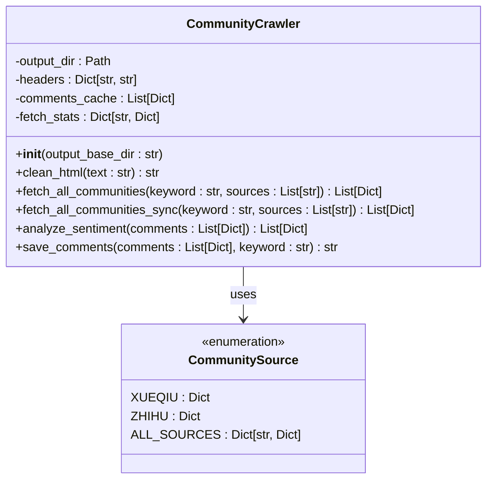

**图表来源**
- [community_crawler.py:82-497](file://community_crawler.py#L82-L497)
- [community_crawler.py:56-78](file://community_crawler.py#L56-L78)

#### 数据清洗与验证流程

系统实现了多层次的数据清洗和验证机制：

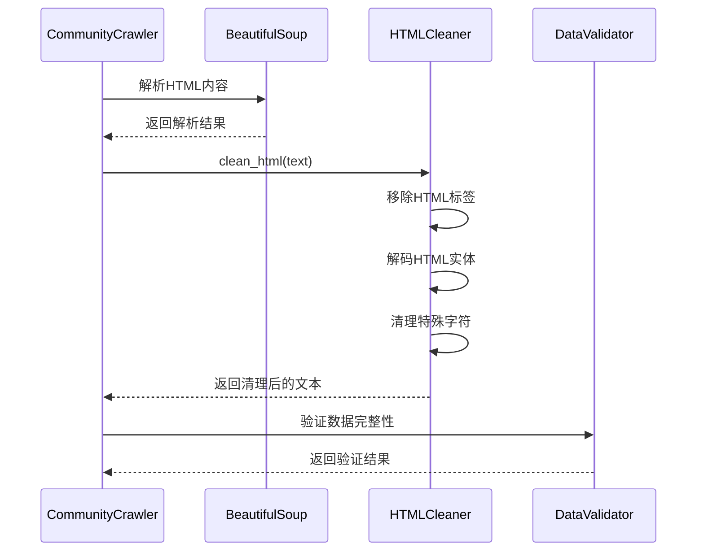

**图表来源**
- [community_crawler.py:105-124](file://community_crawler.py#L105-L124)

**章节来源**
- [community_crawler.py:82-497](file://community_crawler.py#L82-L497)

### 金融新闻工作流组件

#### Source 专用爬虫分析

系统为每个新闻源提供了专门的爬虫实现：

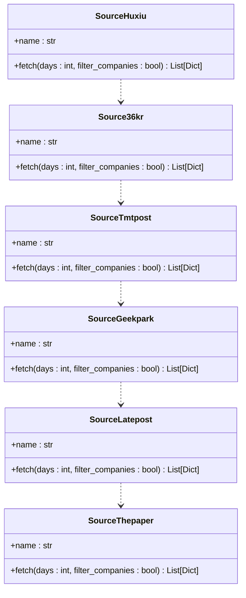

**图表来源**
- [financial_news_workflow_crawl4ai.py:94-359](file://financial_news_workflow_crawl4ai.py#L94-L359)

#### 去重算法实现

系统采用了高效的去重策略：

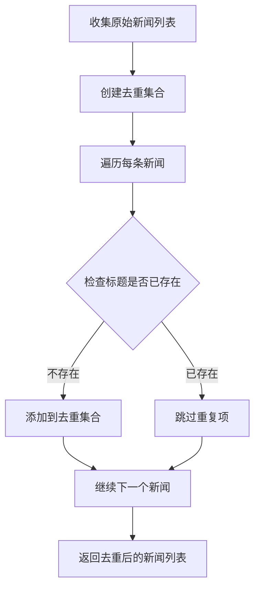

**图表来源**
- [financial_news_workflow_crawl4ai.py:432-440](file://financial_news_workflow_crawl4ai.py#L432-L440)

**章节来源**
- [financial_news_workflow_crawl4ai.py:94-382](file://financial_news_workflow_crawl4ai.py#L94-L382)

### JSON数据格式设计

#### 数据结构定义

系统采用统一的JSON数据格式，确保数据的一致性和可扩展性：

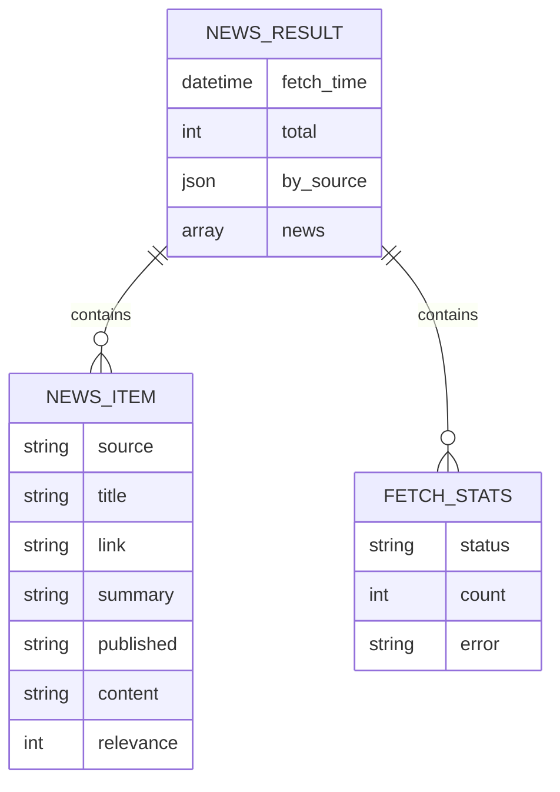

**图表来源**
- [news_output_20260323_235950\news_result.json:1-168](file://news_output_20260323_235950\news_result.json#L1-L168)
- [news_output_crawl4ai_20260324_095151\news_result.json:1-272](file://news_output_crawl4ai_20260324_095151\news_result.json#L1-L272)

#### 嵌套对象处理

系统支持复杂的嵌套数据结构：

| 字段名称 | 数据类型 | 描述 | 示例 |
|---------|----------|------|------|
| fetch_time | datetime | 数据抓取时间 | "2026-03-24T18:22:34.500544" |
| total | int | 新闻总数 | 9 |
| by_source | dict | 按来源统计 | {"虎嗅网": 3, "36氪": 3} |
| news | array | 新闻列表 | [{}] |
| source | string | 新闻来源 | "虎嗅网" |
| title | string | 新闻标题 | "抱紧英伟达..." |
| link | string | 新闻链接 | "http://www.huxiu.com/..." |
| summary | string | 新闻摘要 | "" |
| published | string | 发布时间 | "Fri, 20 Mar 2026 14:45:00 +0800" |

**章节来源**
- [news_output_20260323_235950\news_result.json:1-168](file://news_output_20260323_235950\news_result.json#L1-L168)
- [news_output_crawl4ai_20260324_095151\news_result.json:1-272](file://news_output_crawl4ai_20260324_095151\news_result.json#L1-L272)

### 文件存储管理机制

#### 目录创建策略

系统采用时间戳命名的目录结构，确保数据的有序存储：

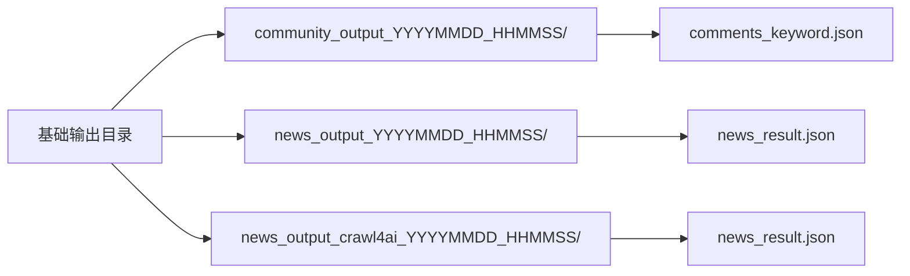

**图表来源**
- [community_crawler.py:85-89](file://community_crawler.py#L85-L89)
- [financial_news_workflow_crawl4ai.py:387-390](file://financial_news_workflow_crawl4ai.py#L387-L390)

#### 文件命名规范

系统遵循统一的文件命名规范：

| 文件类型 | 命名模式 | 示例 |
|---------|----------|------|
| 社区评论 | comments_{keyword}.json | comments_小米汽车.json |
| 新闻结果 | news_result.json | news_result.json |
| 时间戳目录 | YYYYMMDD_HHMMSS | 20260324_182234 |

**章节来源**
- [community_crawler.py:467-497](file://community_crawler.py#L467-L497)
- [financial_news_workflow_crawl4ai.py:384-402](file://financial_news_workflow_crawl4ai.py#L384-L402)

## 依赖关系分析

### 核心依赖管理

系统采用requirements.txt统一管理依赖，确保环境一致性：

```mermaid
graph TB
subgraph "核心依赖"
A[requests>=2.31.0<br/>网络请求]
B[feedparser>=6.0.10<br/>RSS解析]
C[beautifulsoup4>=4.12.0<br/>HTML解析]
D[playwright>=1.40.0<br/>浏览器自动化]
end
subgraph "增强爬虫库"
E[crawl4ai>=0.8.0<br/>AI驱动爬虫]
F[scrapling[fetchers]>=0.4.0<br/>反爬虫]
G[playwright-stealth>=2.0.0<br/>反检测]
end
subgraph "数据处理"
H[orjson>=3.11.0<br/>JSON加速]
I[w3lib>=2.4.0<br/>数据清洗]
J[tld>=0.13.0<br/>域名处理]
end
subgraph "辅助工具"
K[fake-useragent>=2.0.0<br/>用户代理]
L[browserforge>=1.2.0<br/>指纹数据]
M[rich>=13.9.0<br/>终端显示]
end
A --> E
B --> E
C --> E
D --> E
E --> H
F --> I
G --> J
H --> K
I --> L
J --> M
```

**图表来源**
- [requirements.txt:1-144](file://requirements.txt#L1-L144)

### 模块间依赖关系

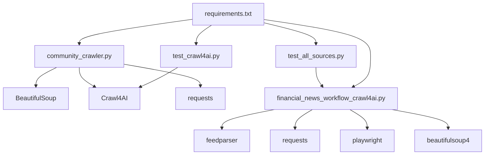

**图表来源**
- [requirements.txt:1-144](file://requirements.txt#L1-L144)
- [community_crawler.py:36-51](file://community_crawler.py#L36-L51)
- [financial_news_workflow_crawl4ai.py:30-57](file://financial_news_workflow_crawl4ai.py#L30-L57)

**章节来源**
- [requirements.txt:1-144](file://requirements.txt#L1-L144)

## 性能考虑

### 缓存机制设计

系统实现了多层次的缓存策略：

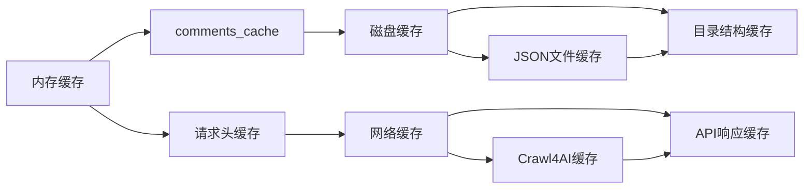

### 内存管理优化

系统采用渐进式数据处理策略：

1. **分批处理**：社区数据采用分批处理，避免内存溢出
2. **生成器模式**：新闻数据采用生成器模式，按需加载
3. **及时释放**：处理完成后及时释放内存资源

### 并发控制策略

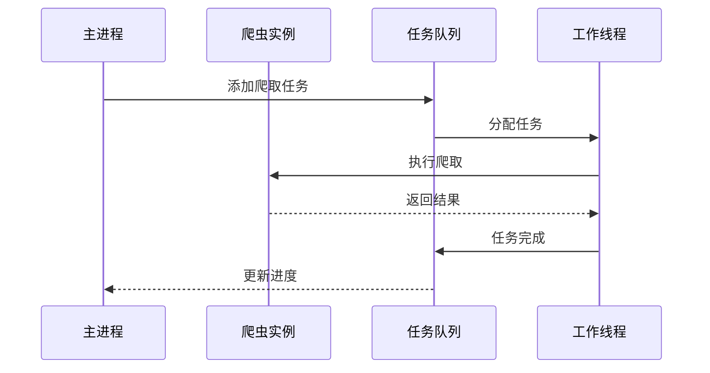

## 故障排除指南

### 常见问题诊断

#### 网络连接问题

| 问题类型 | 症状 | 解决方案 |
|---------|------|---------|
| SSL证书错误 | HTTPSConnectionPool错误 | 更新证书或使用HTTP协议 |
| 网络超时 | Timeout错误 | 增加超时时间或重试机制 |
| 404错误 | 页面不存在 | 检查URL有效性或更新解析规则 |
| 502/503错误 | 服务器错误 | 实施指数退避重试策略 |

#### 数据解析问题

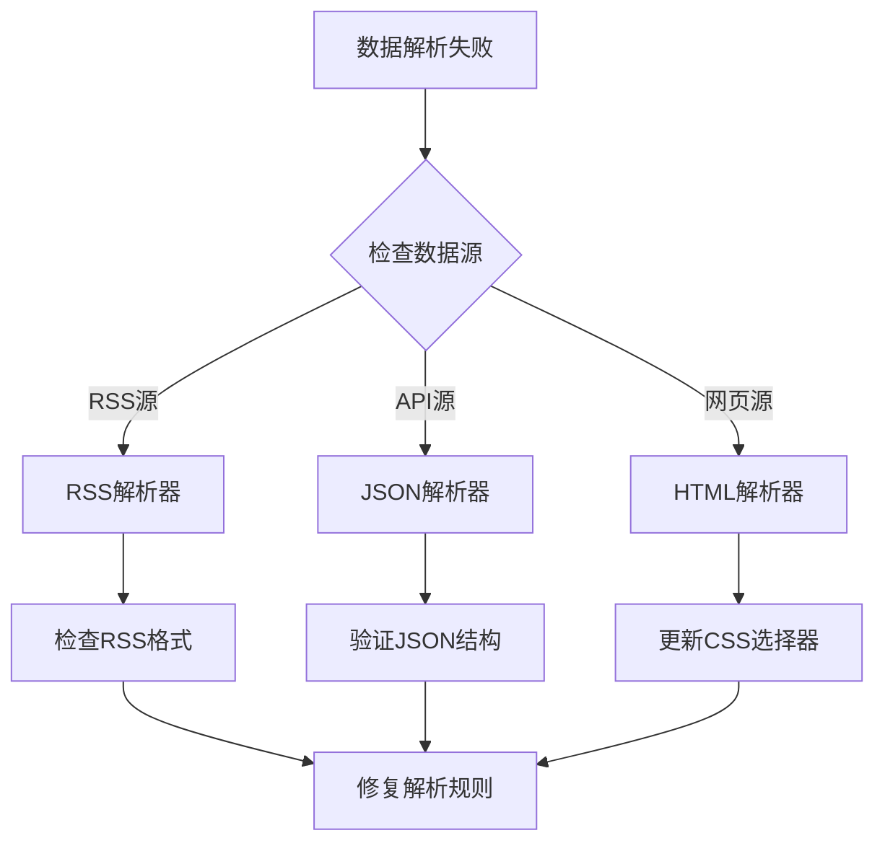

**图表来源**
- [news_source_test_result.json:1-74](file://news_source_test_result.json#L1-L74)

#### 性能问题排查

1. **内存使用过高**：检查数据缓存大小和清理策略
2. **网络请求缓慢**：优化并发数量和超时设置
3. **磁盘IO瓶颈**：实施批量写入和异步存储

**章节来源**
- [news_source_test_result.json:1-74](file://news_source_test_result.json#L1-L74)

## 结论

本数据处理与存储系统提供了完整的新闻数据采集、清洗、去重和格式化解决方案。系统采用模块化设计，支持多种数据源的并行处理，具备良好的扩展性和维护性。

### 主要优势

1. **多源支持**：支持RSS、API和动态网页等多种数据源
2. **数据质量保证**：完善的清洗、验证和去重机制
3. **性能优化**：异步处理、缓存机制和并发控制
4. **存储管理**：规范的目录结构和文件命名
5. **故障恢复**：完善的错误处理和重试机制

### 技术特色

- **统一的数据格式**：标准化的JSON结构，便于后续处理
- **灵活的配置**：支持按关键词、时间范围和公司名过滤
- **可扩展架构**：模块化设计，易于添加新的数据源
- **监控与日志**：完整的执行状态跟踪和错误日志

## 附录

### 使用示例

#### 社区数据采集

```bash
python community_crawler.py --keyword "小米汽车" --sources all --output .
```

#### 金融新闻抓取

```bash
python financial_news_workflow_crawl4ai.py --days 3 --sources all --filter-companies
```

### 配置说明

#### 依赖安装

```bash
pip install -r requirements.txt
playwright install chromium
```

#### 环境变量

系统支持以下环境变量配置：

| 变量名 | 默认值 | 描述 |
|-------|--------|------|
| REQUEST_TIMEOUT | 15 | 请求超时时间（秒） |
| MAX_RETRIES | 3 | 最大重试次数 |
| CONCURRENT_LIMIT | 5 | 并发任务限制 |
| OUTPUT_DIR | "." | 输出目录路径 |

### 数据生命周期管理

#### 数据保留策略

1. **短期数据**：最近7天的新闻数据
2. **中期数据**：按月归档的历史数据
3. **长期数据**：年度统计数据和报表

#### 备份策略

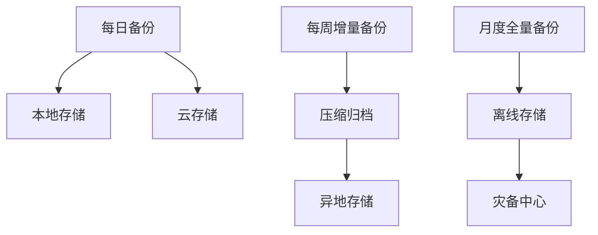

#### 数据迁移方案

1. **版本兼容**：保持JSON格式向后兼容
2. **增量迁移**：支持部分数据迁移
3. **回滚机制**：提供数据恢复能力
4. **验证机制**：迁移后自动验证数据完整性