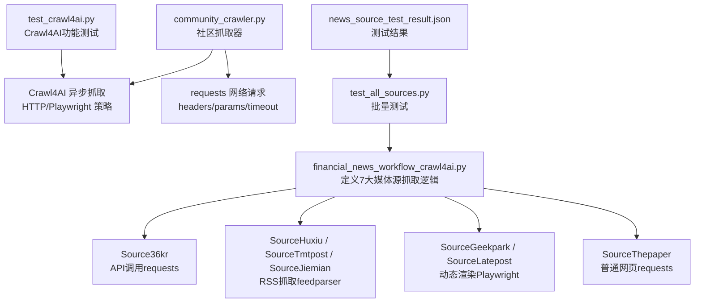
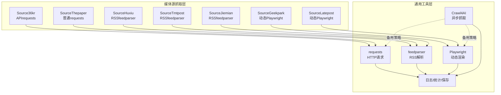
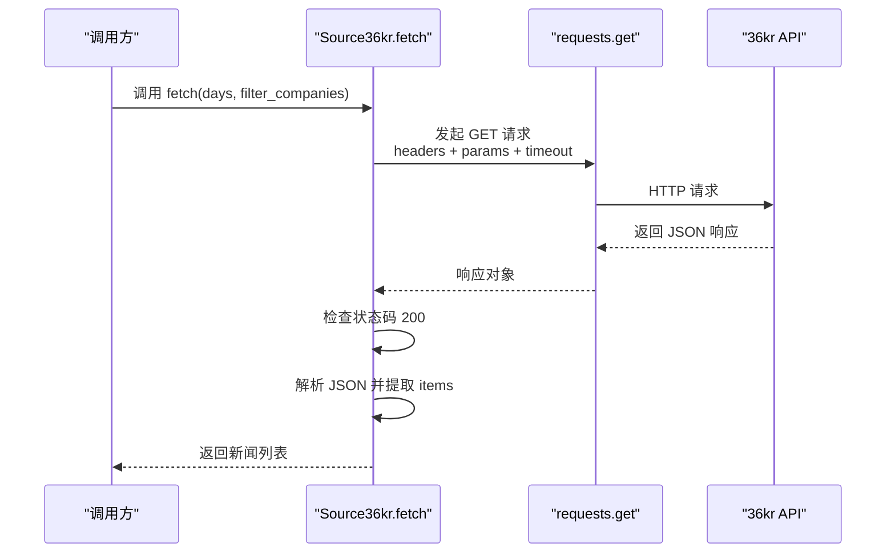
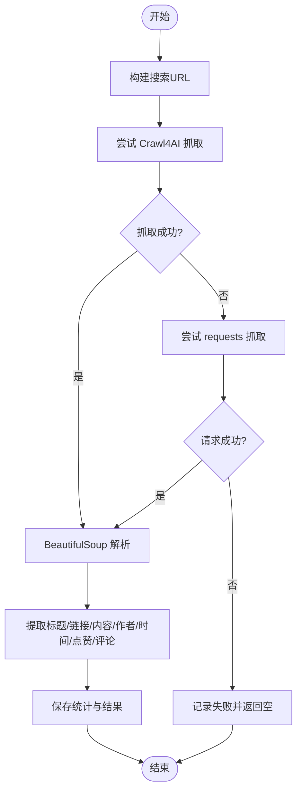
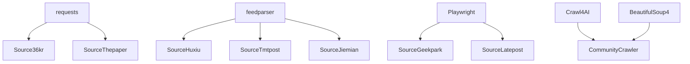

# API数据获取

<cite>
**本文引用的文件**
- [requirements.txt](file://requirements.txt)
- [financial_news_workflow_crawl4ai.py](file://financial_news_workflow_crawl4ai.py)
- [community_crawler.py](file://community_crawler.py)
- [test_all_sources.py](file://test_all_sources.py)
- [test_crawl4ai.py](file://test_crawl4ai.py)
- [news_source_test_result.json](file://news_source_test_result.json)
</cite>

## 目录
1. [简介](#简介)
2. [项目结构](#项目结构)
3. [核心组件](#核心组件)
4. [架构总览](#架构总览)
5. [详细组件分析](#详细组件分析)
6. [依赖关系分析](#依赖关系分析)
7. [性能考量](#性能考量)
8. [故障排查指南](#故障排查指南)
9. [结论](#结论)
10. [附录](#附录)

## 简介
本技术文档聚焦于API数据获取的最佳实践与实现细节，结合仓库中的实际代码，系统讲解以下主题：
- requests库的使用方法与HTTP请求构建
- 响应处理、JSON数据解析与错误处理机制
- 具体API调用示例：以36氪（Source36kr）为例，展示headers设置、params参数传递、timeout配置与状态码检查
- API认证、重试机制、限流处理与数据验证技巧
- 结合Crawl4AI的异步抓取能力，提供多策略混合方案（HTTP/Playwright）

## 项目结构
该项目围绕“金融新闻自动化工作流”展开，包含多个媒体源的抓取实现，其中涉及RSS、API与动态渲染网页三类抓取方式。核心文件如下：
- financial_news_workflow_crawl4ai.py：定义7大媒体源的抓取逻辑，包含36氪API、RSS订阅与Playwright抓取
- community_crawler.py：社区论坛抓取器，演示requests与Crawl4AI的混合使用
- test_all_sources.py：批量测试各媒体源的可用性
- test_crawl4ai.py：Crawl4AI功能测试
- requirements.txt：项目依赖清单
- news_source_test_result.json：媒体源测试结果快照

图表来源
- [financial_news_workflow_crawl4ai.py:122-155](file://financial_news_workflow_crawl4ai.py#L122-L155)
- [community_crawler.py:127-176](file://community_crawler.py#L127-L176)

章节来源
- [financial_news_workflow_crawl4ai.py:1-454](file://financial_news_workflow_crawl4ai.py#L1-L454)
- [community_crawler.py:1-604](file://community_crawler.py#L1-L604)
- [requirements.txt:1-144](file://requirements.txt#L1-L144)
- [test_all_sources.py:1-49](file://test_all_sources.py#L1-L49)
- [test_crawl4ai.py:1-163](file://test_crawl4ai.py#L1-L163)
- [news_source_test_result.json:1-74](file://news_source_test_result.json#L1-L74)

## 核心组件
- Source36kr：基于requests的API调用，演示标准HTTP请求构建与JSON解析流程
- SourceHuxiu/SourceTmtpost/SourceJiemian：基于feedparser的RSS抓取
- SourceGeekpark/SourceLatepost：基于Playwright的动态渲染抓取
- SourceThepaper：基于requests的正则匹配抓取
- CommunityCrawler：社区论坛抓取器，演示requests与Crawl4AI混合策略

章节来源
- [financial_news_workflow_crawl4ai.py:94-155](file://financial_news_workflow_crawl4ai.py#L94-L155)
- [financial_news_workflow_crawl4ai.py:158-183](file://financial_news_workflow_crawl4ai.py#L158-L183)
- [financial_news_workflow_crawl4ai.py:186-212](file://financial_news_workflow_crawl4ai.py#L186-L212)
- [financial_news_workflow_crawl4ai.py:215-263](file://financial_news_workflow_crawl4ai.py#L215-L263)
- [financial_news_workflow_crawl4ai.py:266-318](file://financial_news_workflow_crawl4ai.py#L266-L318)
- [financial_news_workflow_crawl4ai.py:321-358](file://financial_news_workflow_crawl4ai.py#L321-L358)
- [community_crawler.py:82-103](file://community_crawler.py#L82-L103)

## 架构总览
整体架构由“媒体源抓取层”和“通用工具层”组成：
- 媒体会根据自身特性选择不同抓取策略：API（requests）、RSS（feedparser）、动态渲染（Playwright）、普通网页（requests）
- 通用工具层提供统一的错误处理、日志输出与结果保存
- 对于不稳定的目标站点，采用Crawl4AI作为备用抓取策略，提升成功率

图表来源
- [financial_news_workflow_crawl4ai.py:94-358](file://financial_news_workflow_crawl4ai.py#L94-L358)
- [community_crawler.py:127-176](file://community_crawler.py#L127-L176)

## 详细组件分析

### Source36kr：API调用最佳实践
- 请求构建
  - 使用requests.get发起GET请求，传入headers、params与timeout
  - headers包含User-Agent与Accept等字段，模拟浏览器访问
  - params传入page与page_size，限制返回数量
- 响应处理
  - 检查HTTP状态码是否为200
  - 使用resp.json()解析响应体
  - 从data.items中提取新闻列表
- 数据解析与封装
  - 读取title、description、published_at等字段
  - 生成标准新闻对象，包含source、title、link、summary、published
- 错误处理
  - 使用try/except捕获异常并打印错误信息
  - 在无依赖时返回空列表，避免崩溃

图表来源
- [financial_news_workflow_crawl4ai.py:127-155](file://financial_news_workflow_crawl4ai.py#L127-L155)

章节来源
- [financial_news_workflow_crawl4ai.py:122-155](file://financial_news_workflow_crawl4ai.py#L122-L155)

### CommunityCrawler：requests与Crawl4AI混合策略
- requests抓取
  - 使用统一headers，设置timeout为15秒
  - 对非200状态码进行降级处理并记录日志
- Crawl4AI抓取
  - 优先使用Playwright策略，必要时回退到HTTP策略
  - 支持异步arun调用，设置timeout与headless参数
- HTML解析
  - 使用BeautifulSoup解析页面结构，针对不同站点尝试多种CSS选择器
  - 清洗HTML标签，提取纯文本内容
- 统计与保存
  - 记录各来源抓取统计，保存为JSON文件

图表来源
- [community_crawler.py:179-194](file://community_crawler.py#L179-L194)
- [community_crawler.py:127-176](file://community_crawler.py#L127-L176)
- [community_crawler.py:214-282](file://community_crawler.py#L214-L282)

章节来源
- [community_crawler.py:82-103](file://community_crawler.py#L82-L103)
- [community_crawler.py:127-176](file://community_crawler.py#L127-L176)
- [community_crawler.py:179-194](file://community_crawler.py#L179-L194)
- [community_crawler.py:197-301](file://community_crawler.py#L197-L301)
- [community_crawler.py:305-409](file://community_crawler.py#L305-L409)

### 其他媒体源对比
- RSS源（虎嗅、钛媒体、界面新闻）：使用feedparser解析XML，无需登录态，适合稳定抓取
- 动态源（极客公园、晚点）：使用Playwright，适合JavaScript渲染页面
- 普通网页（澎湃新闻）：使用正则匹配页面中的文章ID，再逐一请求详情页

章节来源
- [financial_news_workflow_crawl4ai.py:94-119](file://financial_news_workflow_crawl4ai.py#L94-L119)
- [financial_news_workflow_crawl4ai.py:158-183](file://financial_news_workflow_crawl4ai.py#L158-L183)
- [financial_news_workflow_crawl4ai.py:186-212](file://financial_news_workflow_crawl4ai.py#L186-L212)
- [financial_news_workflow_crawl4ai.py:215-263](file://financial_news_workflow_crawl4ai.py#L215-L263)
- [financial_news_workflow_crawl4ai.py:266-318](file://financial_news_workflow_crawl4ai.py#L266-L318)
- [financial_news_workflow_crawl4ai.py:321-358](file://financial_news_workflow_crawl4ai.py#L321-L358)

## 依赖关系分析
- requests：用于HTTP请求（API与普通网页）
- feedparser：用于RSS解析
- playwright：用于动态渲染页面
- Crawl4AI：提供异步抓取能力，支持HTTP与Playwright策略
- beautifulsoup4：用于HTML解析（可选）

图表来源
- [requirements.txt:30-57](file://requirements.txt#L30-L57)
- [financial_news_workflow_crawl4ai.py:30-57](file://financial_news_workflow_crawl4ai.py#L30-L57)
- [community_crawler.py:35-51](file://community_crawler.py#L35-L51)

章节来源
- [requirements.txt:1-144](file://requirements.txt#L1-L144)
- [financial_news_workflow_crawl4ai.py:30-57](file://financial_news_workflow_crawl4ai.py#L30-L57)
- [community_crawler.py:35-51](file://community_crawler.py#L35-L51)

## 性能考量
- 超时配置
  - requests默认timeout为15秒；Crawl4AI在某些场景设置为30秒，以应对复杂页面
- 并发与异步
  - Crawl4AI使用异步arun，减少阻塞；社区抓取器同样采用异步接口
- 选择器优化
  - 针对不同站点尝试多种CSS选择器，提高解析稳定性
- 去重与过滤
  - 工作流中对新闻进行去重处理，避免重复存储

章节来源
- [financial_news_workflow_crawl4ai.py:132-137](file://financial_news_workflow_crawl4ai.py#L132-L137)
- [community_crawler.py:139-144](file://community_crawler.py#L139-L144)
- [financial_news_workflow_crawl4ai.py:432-439](file://financial_news_workflow_crawl4ai.py#L432-L439)

## 故障排查指南
- 依赖缺失
  - 若缺少requests/feedparser/playwright/Crawl4AI，脚本会提示安装命令
- 状态码异常
  - requests抓取时检查HTTP状态码，非200时记录并降级
- 网络波动
  - 使用Crawl4AI的HTTP策略作为备用，提升成功率
- 页面结构变化
  - BeautifulSoup选择器采用多种备选方案，增强鲁棒性
- 测试结果参考
  - 可参考news_source_test_result.json了解各媒体源当前可用性

章节来源
- [financial_news_workflow_crawl4ai.py:30-57](file://financial_news_workflow_crawl4ai.py#L30-L57)
- [community_crawler.py:183-193](file://community_crawler.py#L183-L193)
- [community_crawler.py:135-169](file://community_crawler.py#L135-L169)
- [news_source_test_result.json:1-74](file://news_source_test_result.json#L1-L74)

## 结论
本项目提供了完整的API数据获取与处理方案：
- 对于API型媒体（如36氪），采用requests构建标准HTTP请求，严格检查状态码并解析JSON
- 对于RSS型媒体，使用feedparser进行稳定解析
- 对于动态渲染页面，采用Playwright或Crawl4AI异步抓取
- 对于普通网页，结合正则与requests进行二次解析
- 通过headers、params、timeout等配置，以及错误处理与回退策略，确保抓取的稳定性与可靠性

## 附录

### API调用最佳实践清单
- 请求构建
  - 设置合理的User-Agent与Accept头
  - 使用params传递查询参数
  - 配置timeout避免长时间阻塞
- 响应处理
  - 检查HTTP状态码
  - 使用JSON解析并校验关键字段存在性
- 错误处理
  - 使用try/except捕获异常
  - 对不可用站点提供降级策略（如Crawl4AI备用）
- 数据验证
  - 校验字段完整性与类型
  - 去重与过滤（按需启用公司名过滤）

章节来源
- [financial_news_workflow_crawl4ai.py:127-155](file://financial_news_workflow_crawl4ai.py#L127-L155)
- [community_crawler.py:179-194](file://community_crawler.py#L179-L194)
- [community_crawler.py:135-169](file://community_crawler.py#L135-L169)