# Playwright浏览器自动化

<cite>
**本文档引用的文件**
- [requirements.txt](file://requirements.txt)
- [financial_news_workflow_crawl4ai.py](file://financial_news_workflow_crawl4ai.py)
- [community_crawler.py](file://community_crawler.py)
- [test_all_sources.py](file://test_all_sources.py)
- [test_crawl4ai.py](file://test_crawl4ai.py)
- [news_output_20260323_235950/news_result.json](file://news_output_20260323_235950/news_result.json)
</cite>

## 目录
1. [简介](#简介)
2. [项目结构](#项目结构)
3. [核心组件](#核心组件)
4. [架构概览](#架构概览)
5. [详细组件分析](#详细组件分析)
6. [依赖关系分析](#依赖关系分析)
7. [性能考虑](#性能考虑)
8. [故障排除指南](#故障排除指南)
9. [结论](#结论)

## 简介

本项目是一个基于Playwright的浏览器自动化解决方案，专门用于动态网页抓取和新闻聚合。项目实现了7大权威媒体源的自动化抓取，包括极客公园(SourceGeekpark)和晚点(SourceLatepost)等动态加载网站。

项目采用多种抓取策略：
- **Playwright策略**：用于需要JavaScript渲染的动态网站
- **Crawl4AI策略**：AI驱动的网页抓取，支持复杂的反爬机制
- **传统HTTP策略**：适用于静态内容的快速抓取
- **RSS/API策略**：用于订阅源和官方API接口

## 项目结构

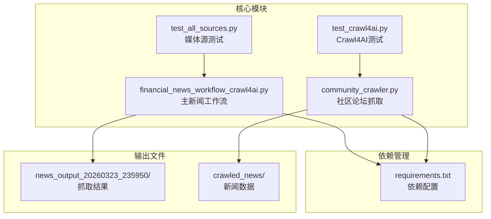

**图表来源**
- [financial_news_workflow_crawl4ai.py:1-454](file://financial_news_workflow_crawl4ai.py#L1-L454)
- [community_crawler.py:1-604](file://community_crawler.py#L1-L604)

**章节来源**
- [requirements.txt:1-144](file://requirements.txt#L1-L144)
- [financial_news_workflow_crawl4ai.py:1-454](file://financial_news_workflow_crawl4ai.py#L1-L454)

## 核心组件

### Playwright集成架构

项目实现了两种主要的Playwright集成方式：

1. **同步Playwright模式**：使用`sync_playwright()`上下文管理器
2. **Crawl4AI Playwright模式**：通过AsyncPlaywrightCrawlerStrategy实现

### 媒体源分类

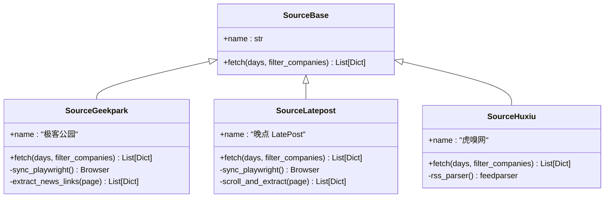

**图表来源**
- [financial_news_workflow_crawl4ai.py:215-318](file://financial_news_workflow_crawl4ai.py#L215-L318)

**章节来源**
- [financial_news_workflow_crawl4ai.py:94-358](file://financial_news_workflow_crawl4ai.py#L94-L358)

## 架构概览

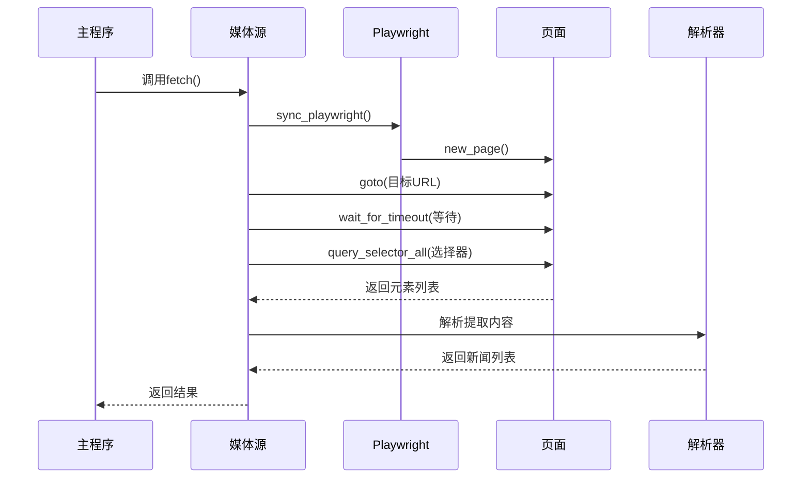

**图表来源**
- [financial_news_workflow_crawl4ai.py:226-263](file://financial_news_workflow_crawl4ai.py#L226-L263)
- [financial_news_workflow_crawl4ai.py:277-318](file://financial_news_workflow_crawl4ai.py#L277-L318)

## 详细组件分析

### SourceGeekpark实现详解

极客公园是典型的需要JavaScript渲染的动态网站，采用了以下策略：

#### 启动流程
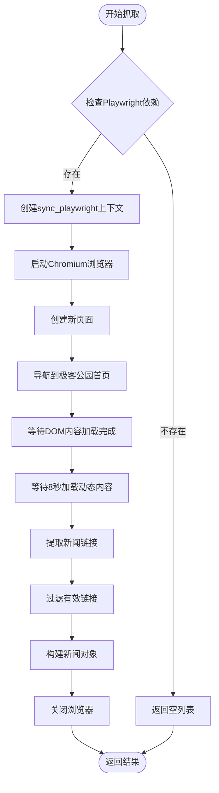

**图表来源**
- [financial_news_workflow_crawl4ai.py:226-263](file://financial_news_workflow_crawl4ai.py#L226-L263)

#### 关键实现要点

1. **浏览器启动配置**：
   - 使用headless=True启用无头模式
   - 设置60秒超时确保页面完全加载
   - 使用wait_until="domcontentloaded"确保DOM内容加载完成

2. **元素选择器策略**：
   ```python
   links = page.query_selector_all('a[href*="/news/"]')
   ```
   - 使用包含"/news/"的链接筛选有效文章
   - 限制提取前30个链接避免过度抓取

3. **反爬虫应对**：
   - 使用set()避免重复URL
   - 实现公司名过滤功能
   - 添加随机等待时间

**章节来源**
- [financial_news_workflow_crawl4ai.py:215-263](file://financial_news_workflow_crawl4ai.py#L215-L263)

### SourceLatepost实现详解

晚点新闻是另一个动态加载的媒体源，采用了更复杂的滚动控制策略：

#### 滚动控制流程
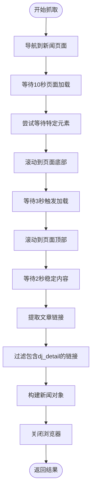

**图表来源**
- [financial_news_workflow_crawl4ai.py:277-318](file://financial_news_workflow_crawl4ai.py#L277-L318)

#### 滚动控制策略

1. **多阶段滚动**：
   - 初始滚动到底部触发懒加载
   - 等待3秒让新内容加载
   - 回滚到顶部确保完整内容

2. **智能等待机制**：
   ```python
   page.wait_for_selector('a[href*="dj_detail"]', timeout=5000)
   ```
   - 尝试等待特定的文章元素
   - 超时后继续执行，提高成功率

3. **链接过滤策略**：
   - 只提取包含"dj_detail"的链接
   - 确保是有效的文章详情页

**章节来源**
- [financial_news_workflow_crawl4ai.py:266-318](file://financial_news_workflow_crawl4ai.py#L266-L318)

### Crawl4AI集成实现

项目实现了Crawl4AI库的双重集成模式：

#### Crawl4AI策略模式
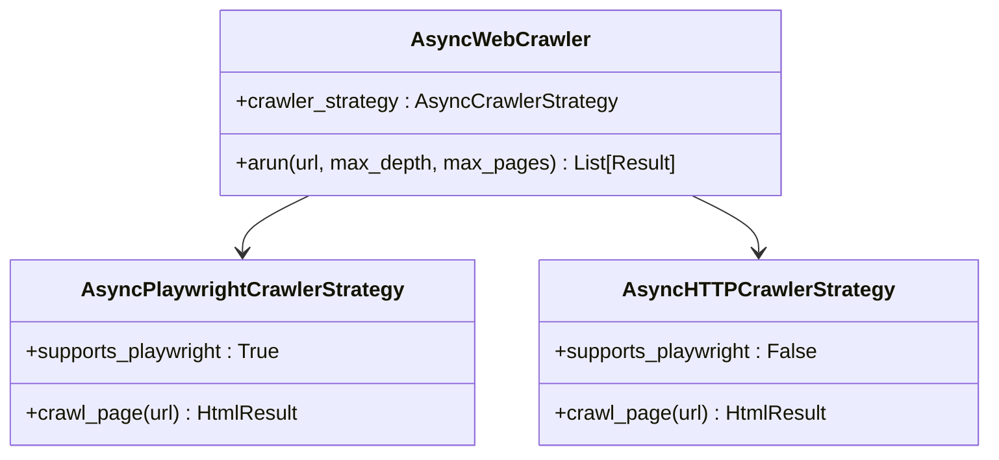

**图表来源**
- [community_crawler.py:127-175](file://community_crawler.py#L127-L175)

#### 异步抓取流程
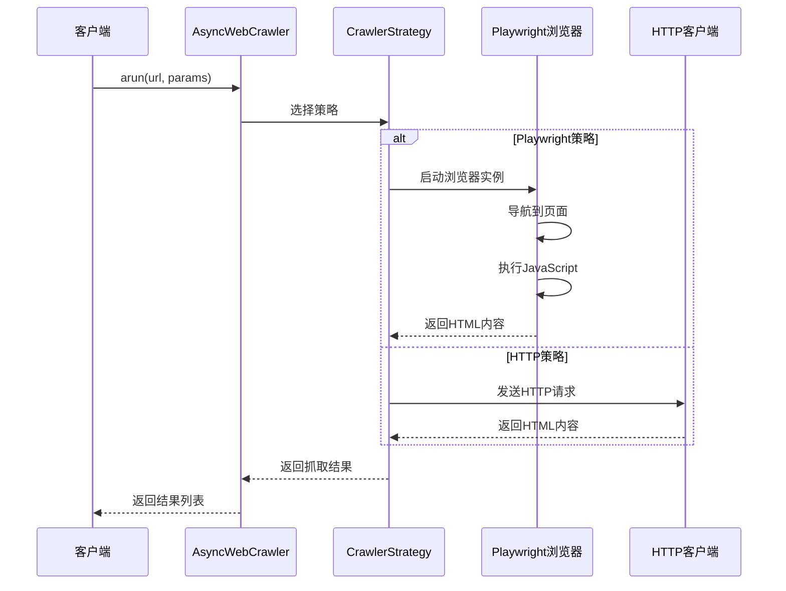

**图表来源**
- [community_crawler.py:127-175](file://community_crawler.py#L127-L175)

**章节来源**
- [community_crawler.py:125-175](file://community_crawler.py#L125-L175)

### 反爬虫应对策略

项目实现了多层次的反爬虫应对机制：

#### 1. User-Agent轮换
```python
HEADERS = {
    "User-Agent": "Mozilla/5.0 (Windows NT 10.0; Win64; x64) AppleWebKit/537.36 (KHTML, like Gecko) Chrome/120.0.0.0 Safari/537.36",
    "Accept": "text/html,application/xhtml+xml,application/xml;q=0.9,*/*;q=0.8",
}
```

#### 2. 多策略降级
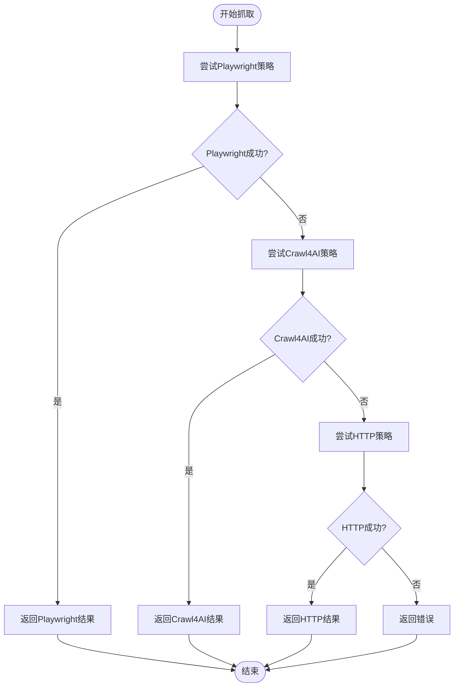

#### 3. 动态等待机制
- 使用`wait_for_timeout()`进行固定等待
- 使用`wait_for_selector()`进行条件等待
- 实现智能滚动控制

**章节来源**
- [community_crawler.py:127-175](file://community_crawler.py#L127-L175)
- [financial_news_workflow_crawl4ai.py:226-318](file://financial_news_workflow_crawl4ai.py#L226-L318)

## 依赖关系分析

### 核心依赖架构

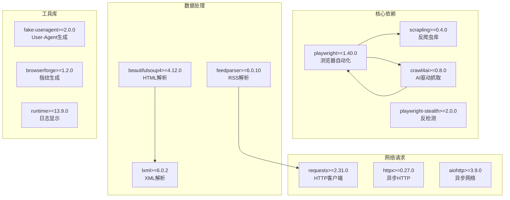

**图表来源**
- [requirements.txt:27-35](file://requirements.txt#L27-L35)
- [requirements.txt:16-20](file://requirements.txt#L16-L20)
- [requirements.txt:6-14](file://requirements.txt#L6-L14)

### 组件耦合关系

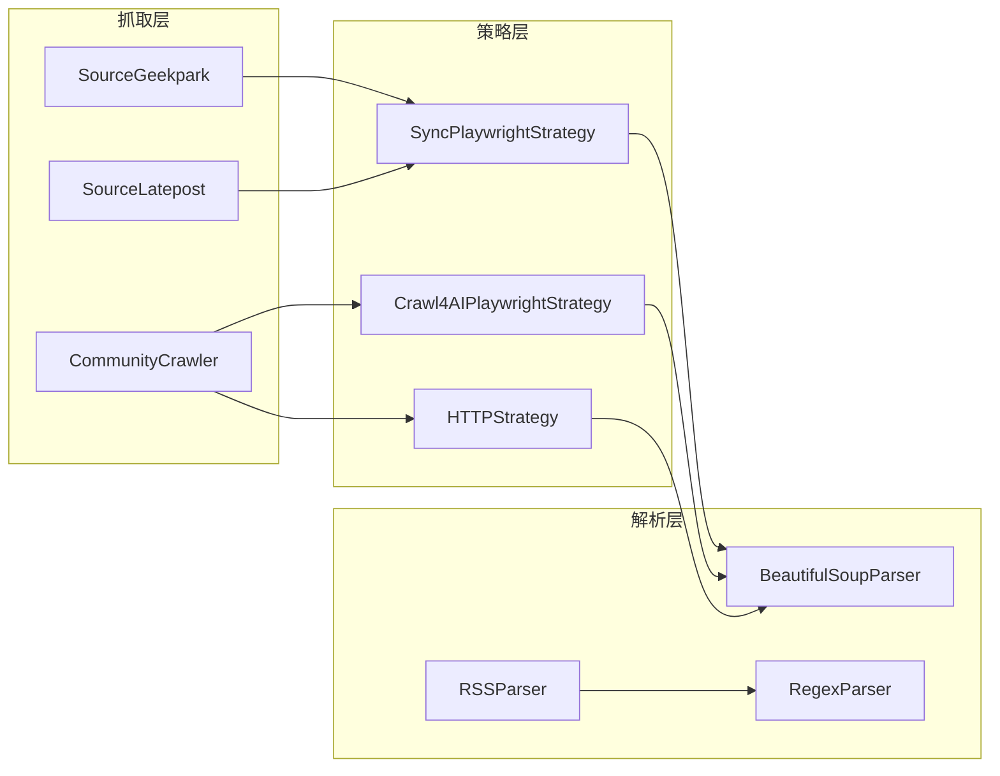

**图表来源**
- [financial_news_workflow_crawl4ai.py:215-318](file://financial_news_workflow_crawl4ai.py#L215-L318)
- [community_crawler.py:127-175](file://community_crawler.py#L127-L175)

**章节来源**
- [requirements.txt:1-144](file://requirements.txt#L1-144)

## 性能考虑

### 并发优化策略

1. **异步抓取模式**：使用asyncio实现并发抓取
2. **浏览器复用**：在同一浏览器实例中处理多个页面
3. **缓存机制**：避免重复抓取相同内容

### 资源管理

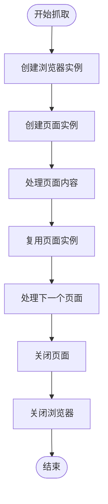

### 性能监控指标

- **抓取成功率**：统计各媒体源的成功率
- **响应时间**：监控页面加载时间
- **内存使用**：跟踪浏览器内存占用
- **错误率**：记录各种异常类型

## 故障排除指南

### 常见问题及解决方案

#### 1. Playwright安装问题
```bash
# 安装Playwright浏览器
playwright install chromium
```

#### 2. 依赖冲突解决
```bash
# 升级所有依赖
pip install -r requirements.txt --upgrade
```

#### 3. 网络连接问题
- 检查代理设置
- 验证防火墙配置
- 测试DNS解析

#### 4. 页面加载失败
```python
# 增加超时时间
page.goto(url, timeout=90000)

# 使用更宽松的等待条件
page.wait_for_load_state("networkidle")
```

### 调试技巧

1. **启用调试模式**：
   ```python
   browser = p.chromium.launch(headless=False, slow_mo=100)
   ```

2. **截图调试**：
   ```python
   page.screenshot(path="debug.png", full_page=True)
   ```

3. **控制台日志**：
   ```python
   page.on("console", lambda msg: print(f"控制台: {msg.text}"))
   ```

**章节来源**
- [requirements.txt:139-143](file://requirements.txt#L139-L143)

## 结论

本项目展示了现代浏览器自动化抓取的最佳实践，通过多种策略的组合实现了高成功率的动态网页抓取。主要特点包括：

1. **多策略架构**：Playwright、Crawl4AI、HTTP三种策略的智能切换
2. **反爬虫应对**：多层次的反检测机制和降级策略
3. **性能优化**：异步处理、资源复用和智能等待
4. **可扩展性**：模块化的媒体源设计，易于添加新的抓取目标

对于开发者而言，该项目提供了完整的Playwright使用示例，包括浏览器启动、页面导航、元素选择器、JavaScript执行和截图功能的实现方案。同时，项目中的反爬虫策略和性能优化技巧为生产环境的部署提供了宝贵的实践经验。