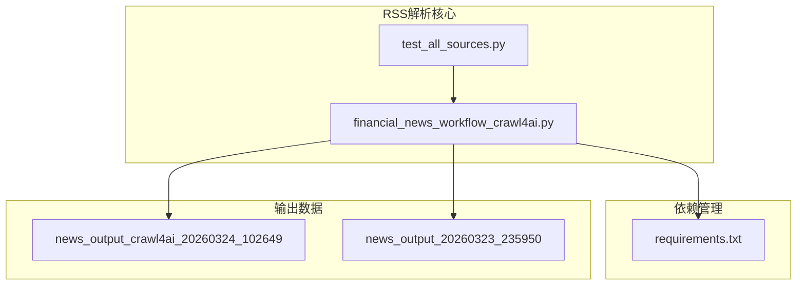
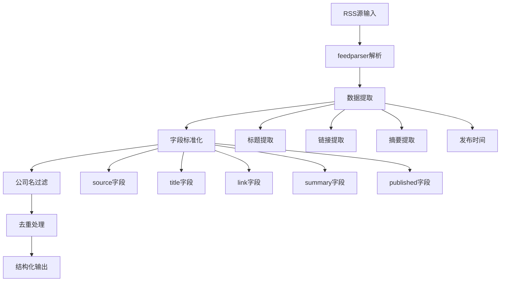
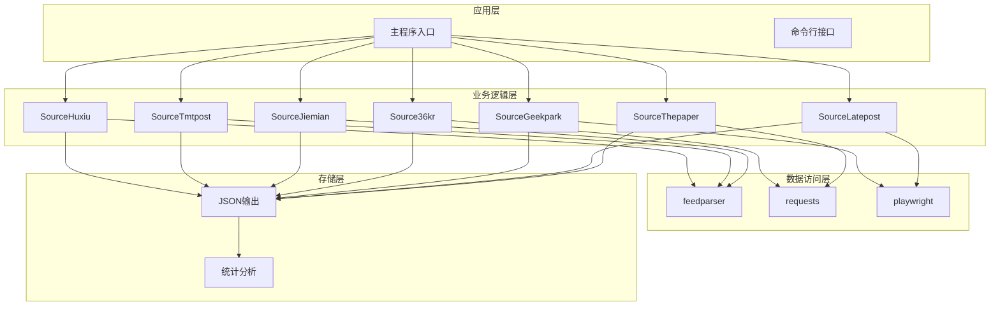
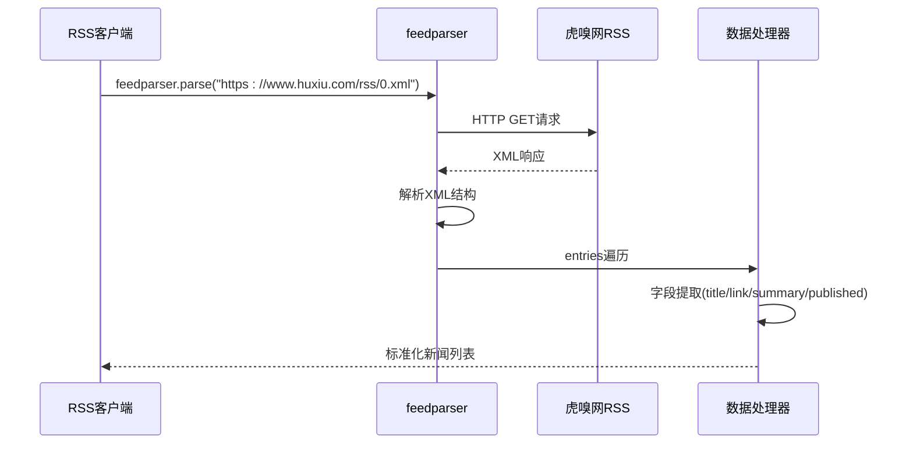
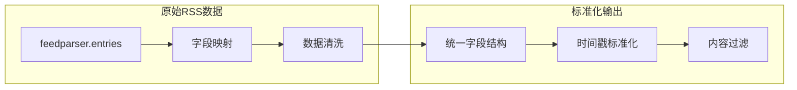
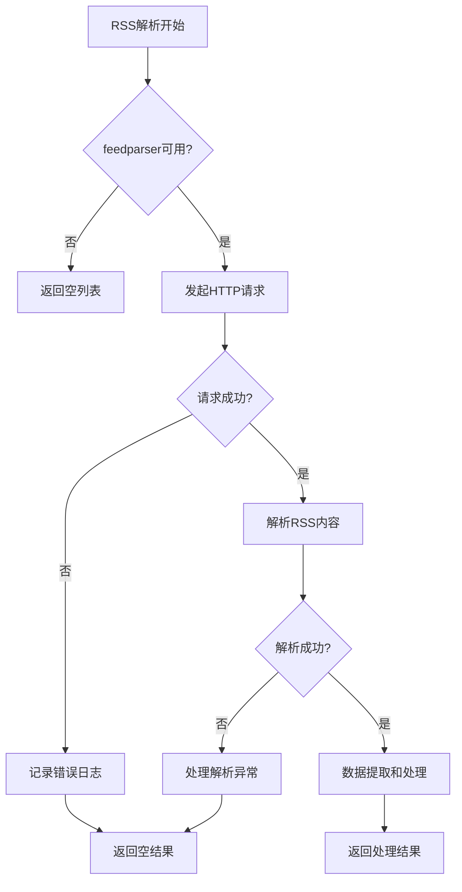
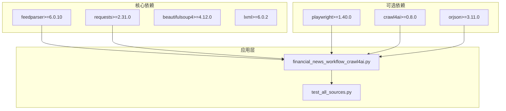
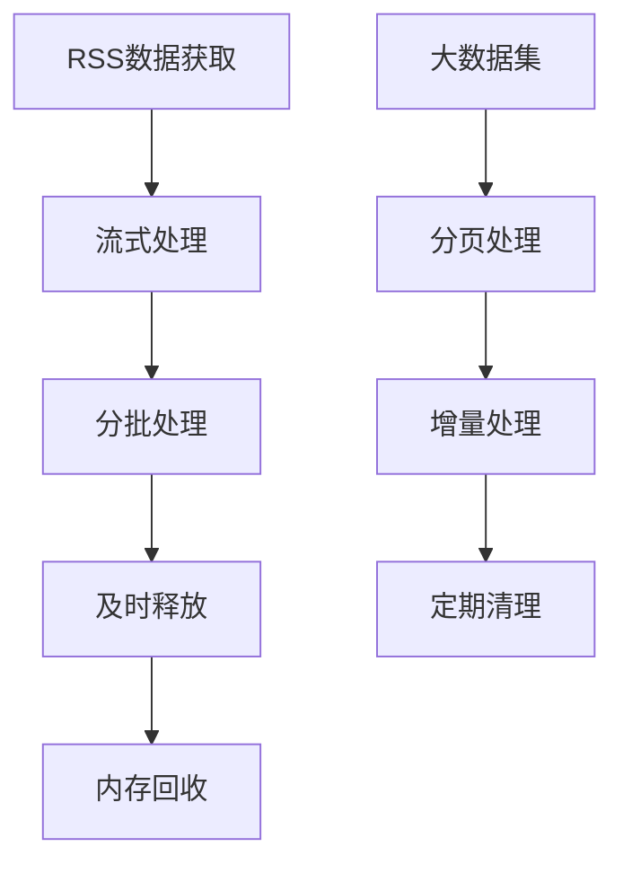

# RSS订阅解析器

<cite>
**本文档引用的文件**
- [financial_news_workflow_crawl4ai.py](file://financial_news_workflow_crawl4ai.py)
- [test_all_sources.py](file://test_all_sources.py)
- [requirements.txt](file://requirements.txt)
- [news_output_crawl4ai_20260324_102649/news_result.json](file://news_output_crawl4ai_20260324_102649/news_result.json)
- [news_output_20260323_235950/news_result.json](file://news_output_20260323_235950/news_result.json)
</cite>

## 目录
1. [简介](#简介)
2. [项目结构](#项目结构)
3. [核心组件](#核心组件)
4. [架构概览](#架构概览)
5. [详细组件分析](#详细组件分析)
6. [依赖关系分析](#依赖关系分析)
7. [性能考虑](#性能考虑)
8. [故障排除指南](#故障排除指南)
9. [结论](#结论)
10. [附录](#附录)

## 简介

RSS订阅解析器是一个专门用于从多个权威媒体源获取和解析RSS订阅的自动化系统。该项目基于Python开发，集成了feedparser库来处理RSS/XML格式的新闻源，支持7大权威科技/财经媒体的自动化抓取。

该系统的核心功能包括：
- RSS订阅源解析和数据提取
- 多媒体源的统一数据格式化
- 公司名过滤和内容相关性分析
- 错误处理和异常恢复机制
- 结构化数据输出和统计分析

## 项目结构

项目采用模块化设计，主要包含以下核心文件：



**图表来源**
- [financial_news_workflow_crawl4ai.py:1-50](file://financial_news_workflow_crawl4ai.py#L1-L50)
- [requirements.txt:1-20](file://requirements.txt#L1-L20)

**章节来源**
- [financial_news_workflow_crawl4ai.py:1-50](file://financial_news_workflow_crawl4ai.py#L1-L50)
- [requirements.txt:1-50](file://requirements.txt#L1-L50)

## 核心组件

### RSS解析引擎

RSS解析器的核心是feedparser库的集成，提供了强大的XML/RSS格式解析能力。系统支持以下RSS源：

| 媒体源 | 类型 | URL | 特点 |
|--------|------|-----|------|
| 虎嗅网 | RSS | https://www.huxiu.com/rss/0.xml | 科技创新类新闻 |
| 钛媒体 | RSS | https://www.tmtpost.com/rss.xml | 移动互联网深度报道 |
| 界面新闻 | RSS | https://a.jiemian.com/index.php?m=article&a=rss | 财经时政新闻 |
| 36氪 | API | https://36kr.com/api/newsflash | 新经济创业资讯 |
| 极客公园 | Playwright | https://www.geekpark.net/ | 科技产品评测 |
| 晚点LatePost | Playwright | https://www.latepost.com/news | 科技行业深度报道 |
| 澎湃新闻 | Requests | https://m.thepaper.cn/ | 综合新闻资讯 |

**章节来源**
- [financial_news_workflow_crawl4ai.py:94-213](file://financial_news_workflow_crawl4ai.py#L94-L213)

### 数据提取和处理

系统采用统一的数据结构来标准化不同RSS源的输出：



**图表来源**
- [financial_news_workflow_crawl4ai.py:98-119](file://financial_news_workflow_crawl4ai.py#L98-L119)
- [financial_news_workflow_crawl4ai.py:162-183](file://financial_news_workflow_crawl4ai.py#L162-L183)

**章节来源**
- [financial_news_workflow_crawl4ai.py:98-119](file://financial_news_workflow_crawl4ai.py#L98-L119)
- [financial_news_workflow_crawl4ai.py:162-183](file://financial_news_workflow_crawl4ai.py#L162-L183)

## 架构概览

系统采用分层架构设计，确保RSS解析的可靠性和可扩展性：



**图表来源**
- [financial_news_workflow_crawl4ai.py:363-382](file://financial_news_workflow_crawl4ai.py#L363-L382)
- [financial_news_workflow_crawl4ai.py:94-359](file://financial_news_workflow_crawl4ai.py#L94-L359)

**章节来源**
- [financial_news_workflow_crawl4ai.py:363-382](file://financial_news_workflow_crawl4ai.py#L363-L382)
- [financial_news_workflow_crawl4ai.py:94-359](file://financial_news_workflow_crawl4ai.py#L94-L359)

## 详细组件分析

### RSS源实现详解

#### 虎嗅网 (SourceHuxiu)
虎嗅网作为科技新闻的权威来源，提供了高质量的RSS订阅源。其解析流程如下：



**图表来源**
- [financial_news_workflow_crawl4ai.py:98-119](file://financial_news_workflow_crawl4ai.py#L98-L119)

**章节来源**
- [financial_news_workflow_crawl4ai.py:94-119](file://financial_news_workflow_crawl4ai.py#L94-L119)

#### 钛媒体 (SourceTmtpost)
钛媒体专注于移动互联网和科技产品报道，其RSS源解析具有以下特点：

- 支持标准RSS 2.0格式
- 提供详细的科技产品评测
- 包含丰富的多媒体内容链接
- 发布时间采用标准RFC 822格式

**章节来源**
- [financial_news_workflow_crawl4ai.py:158-183](file://financial_news_workflow_crawl4ai.py#L158-L183)

#### 界面新闻 (SourceJiemian)
界面新闻提供综合性财经时政新闻，其RSS源具有以下特征：

- 财经新闻的专业解读
- 时政新闻的深度分析
- 国际新闻的及时报道
- 多语言内容支持

**章节来源**
- [financial_news_workflow_crawl4ai.py:186-212](file://financial_news_workflow_crawl4ai.py#L186-L212)

### 数据处理和标准化

系统实现了统一的数据处理管道，确保不同RSS源的数据格式一致性：



**图表来源**
- [financial_news_workflow_crawl4ai.py:104-119](file://financial_news_workflow_crawl4ai.py#L104-L119)
- [financial_news_workflow_crawl4ai.py:168-183](file://financial_news_workflow_crawl4ai.py#L168-L183)

**章节来源**
- [financial_news_workflow_crawl4ai.py:104-119](file://financial_news_workflow_crawl4ai.py#L104-L119)
- [financial_news_workflow_crawl4ai.py:168-183](file://financial_news_workflow_crawl4ai.py#L168-L183)

### 错误处理和异常恢复

系统实现了完善的错误处理机制，确保RSS解析的可靠性：



**图表来源**
- [financial_news_workflow_crawl4ai.py:100-119](file://financial_news_workflow_crawl4ai.py#L100-L119)
- [financial_news_workflow_crawl4ai.py:164-183](file://financial_news_workflow_crawl4ai.py#L164-L183)

**章节来源**
- [financial_news_workflow_crawl4ai.py:100-119](file://financial_news_workflow_crawl4ai.py#L100-L119)
- [financial_news_workflow_crawl4ai.py:164-183](file://financial_news_workflow_crawl4ai.py#L164-L183)

## 依赖关系分析

项目依赖关系清晰，主要依赖包括：



**图表来源**
- [requirements.txt:13-18](file://requirements.txt#L13-L18)
- [requirements.txt:27-35](file://requirements.txt#L27-L35)

**章节来源**
- [requirements.txt:13-18](file://requirements.txt#L13-L18)
- [requirements.txt:27-35](file://requirements.txt#L27-L35)

## 性能考虑

### RSS解析性能优化

系统在RSS解析方面采用了多项性能优化策略：

1. **并发处理**: 支持多源并行抓取
2. **缓存机制**: 利用feedparser的内置缓存
3. **请求优化**: 合理设置超时时间和重试机制
4. **数据压缩**: 使用高效的JSON序列化

### 内存管理



**图表来源**
- [financial_news_workflow_crawl4ai.py:363-402](file://financial_news_workflow_crawl4ai.py#L363-L402)

**章节来源**
- [financial_news_workflow_crawl4ai.py:363-402](file://financial_news_workflow_crawl4ai.py#L363-L402)

## 故障排除指南

### 常见问题和解决方案

| 问题类型 | 症状 | 解决方案 |
|----------|------|----------|
| RSS解析失败 | feedparser导入错误 | 安装feedparser库：`pip install feedparser` |
| 网络请求超时 | HTTP请求失败 | 检查网络连接，增加超时时间 |
| XML格式错误 | 解析异常 | 验证RSS源的有效性 |
| 编码问题 | 中文乱码 | 设置正确的UTF-8编码 |

### 调试技巧

1. **日志记录**: 系统提供了详细的错误日志输出
2. **状态检查**: 每个RSS源都有独立的状态报告
3. **数据验证**: 输出JSON文件包含完整的数据统计

**章节来源**
- [financial_news_workflow_crawl4ai.py:117-119](file://financial_news_workflow_crawl4ai.py#L117-L119)
- [financial_news_workflow_crawl4ai.py:182-183](file://financial_news_workflow_crawl4ai.py#L182-L183)

## 结论

RSS订阅解析器是一个功能完整、架构清晰的自动化新闻采集系统。通过集成feedparser库和多源RSS解析，该系统能够高效地从7大权威媒体源获取和处理新闻数据。

### 主要优势

1. **模块化设计**: 每个RSS源都有独立的解析类，便于维护和扩展
2. **统一数据格式**: 标准化的输出结构确保数据一致性
3. **错误处理**: 完善的异常处理机制提高系统稳定性
4. **性能优化**: 并发处理和缓存机制提升解析效率

### 应用场景

- 金融新闻监控
- 科技趋势分析
- 市场情报收集
- 竞品动态跟踪

## 附录

### 使用示例

系统提供了完整的使用示例，展示了RSS解析器的各种使用场景：

```python
# 基本RSS解析
from financial_news_workflow_crawl4ai import SourceHuxiu

# 获取最近3天的新闻
news = SourceHuxiu.fetch(days=3)
print(f"抓取到 {len(news)} 条新闻")

# 公司名过滤
filtered_news = SourceHuxiu.fetch(days=3, filter_companies=True)
```

### 配置选项

系统支持灵活的配置选项：

- `days`: 抓取天数范围
- `filter_companies`: 是否启用公司名过滤
- `timeout`: 请求超时时间
- `output_dir`: 输出目录设置

**章节来源**
- [financial_news_workflow_crawl4ai.py:405-454](file://financial_news_workflow_crawl4ai.py#L405-L454)