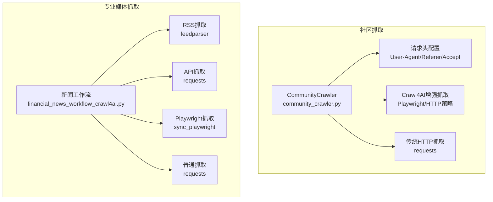
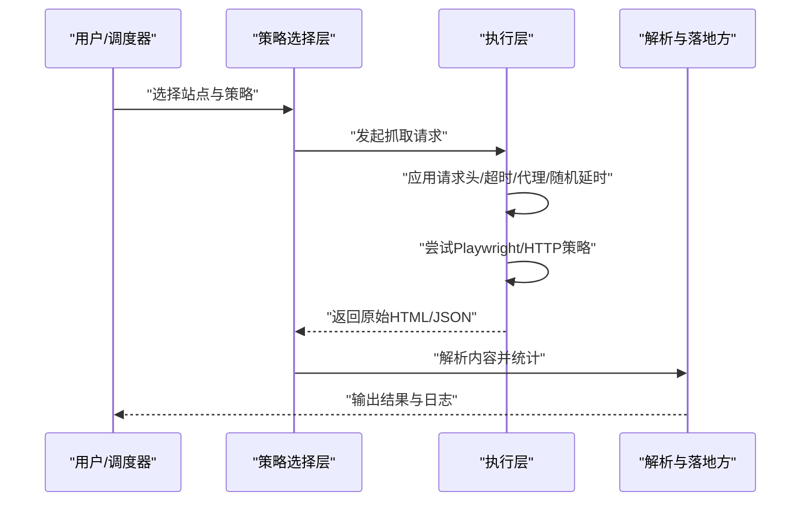
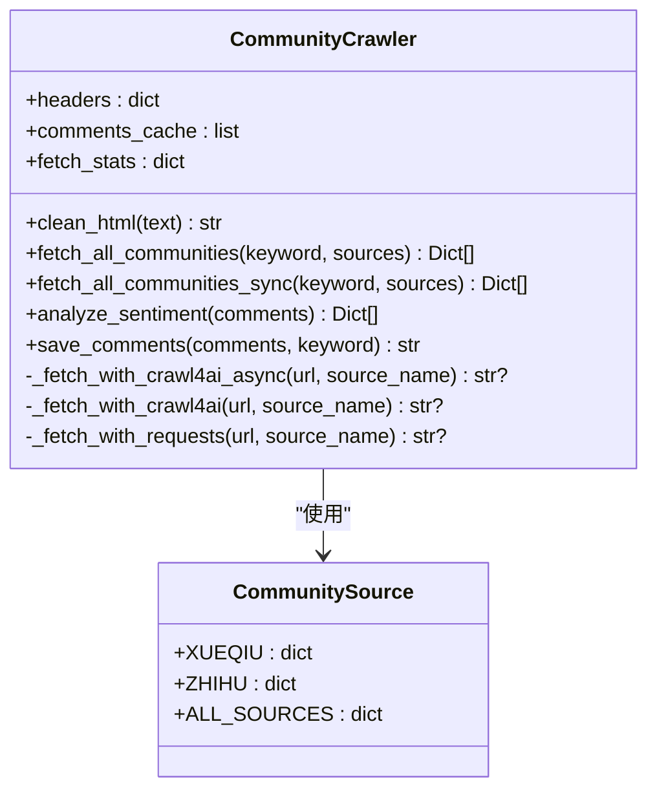
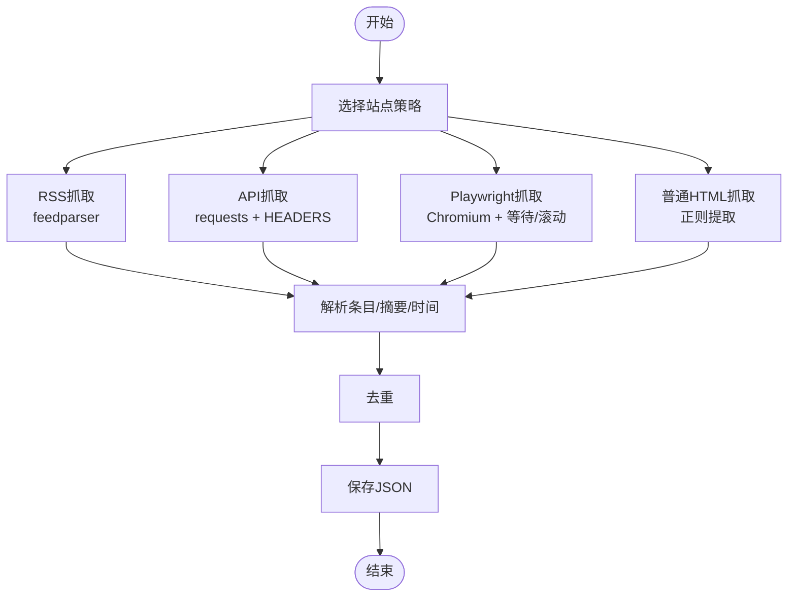
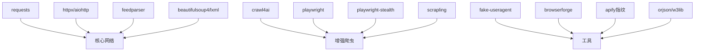

# 反爬虫机制应对

<cite>
**本文引用的文件**
- [community_crawler.py](file://community_crawler.py)
- [financial_news_workflow_crawl4ai.py](file://financial_news_workflow_crawl4ai.py)
- [requirements.txt](file://requirements.txt)
- [test_all_sources.py](file://test_all_sources.py)
- [test_crawl4ai.py](file://test_crawl4ai.py)
- [docs/RUN.md](file://docs/RUN.md)
</cite>

## 目录
1. [引言](#引言)
2. [项目结构](#项目结构)
3. [核心组件](#核心组件)
4. [架构总览](#架构总览)
5. [详细组件分析](#详细组件分析)
6. [依赖分析](#依赖分析)
7. [性能考虑](#性能考虑)
8. [故障排查指南](#故障排查指南)
9. [结论](#结论)
10. [附录](#附录)

## 引言
本技术文档围绕仓库中的抓取脚本，系统性梳理反爬虫应对策略与实现要点，覆盖请求头设置、User-Agent轮换、IP代理使用、行为模拟、请求频率控制、随机延时、会话保持与Cookie管理、异常重试与降级策略，并结合实际代码路径给出可操作的实现建议。文档同时总结不同媒体源的反爬特征与对应方案，提供性能优化、稳定性保障与监控告警思路，帮助开发者构建稳定可靠的抓取系统。

## 项目结构
该项目包含两条主要抓取工作流：
- 社区论坛抓取：面向雪球、知乎等社区，支持Crawl4AI增强抓取与传统HTTP抓取双通道。
- 专业财经媒体抓取：面向多家权威媒体，采用RSS、API、Playwright与requests等多策略组合。

图表来源
- [community_crawler.py:91-97](file://community_crawler.py#L91-L97)
- [community_crawler.py:127-175](file://community_crawler.py#L127-L175)
- [community_crawler.py:179-193](file://community_crawler.py#L179-L193)
- [financial_news_workflow_crawl4ai.py:86-89](file://financial_news_workflow_crawl4ai.py#L86-L89)
- [financial_news_workflow_crawl4ai.py:98-155](file://financial_news_workflow_crawl4ai.py#L98-L155)
- [financial_news_workflow_crawl4ai.py:216-263](file://financial_news_workflow_crawl4ai.py#L216-L263)
- [financial_news_workflow_crawl4ai.py:321-358](file://financial_news_workflow_crawl4ai.py#L321-L358)

章节来源
- [community_crawler.py:56-77](file://community_crawler.py#L56-L77)
- [financial_news_workflow_crawl4ai.py:94-358](file://financial_news_workflow_crawl4ai.py#L94-L358)
- [docs/RUN.md:3-15](file://docs/RUN.md#L3-L15)

## 核心组件
- 请求头与会话管理
  - 统一HEADERS配置，包含User-Agent、Accept、Accept-Language、Referer等，模拟真实浏览器。
  - 传统HTTP抓取使用requests会话，配合timeout参数控制响应时间。
- Crawl4AI增强抓取
  - 自动化浏览器策略（Playwright）与HTTP回退策略，提升反爬对抗能力。
  - 支持超时调整与无头模式，适配不同站点的反爬强度。
- 多媒体源适配
  - RSS源（feedparser）、API源（requests）、动态渲染（Playwright）、常规HTML（requests）。
- 异常处理与降级
  - 捕获异常并记录状态，失败时进行策略回退（如Playwright失败回退HTTP）。
- 输出与统计
  - 结果按来源与情感分布统计，便于质量评估与后续分析。

章节来源
- [community_crawler.py:91-97](file://community_crawler.py#L91-L97)
- [community_crawler.py:127-175](file://community_crawler.py#L127-L175)
- [community_crawler.py:179-193](file://community_crawler.py#L179-L193)
- [financial_news_workflow_crawl4ai.py:86-89](file://financial_news_workflow_crawl4ai.py#L86-L89)
- [financial_news_workflow_crawl4ai.py:98-155](file://financial_news_workflow_crawl4ai.py#L98-L155)
- [financial_news_workflow_crawl4ai.py:216-263](file://financial_news_workflow_crawl4ai.py#L216-L263)
- [financial_news_workflow_crawl4ai.py:321-358](file://financial_news_workflow_crawl4ai.py#L321-L358)

## 架构总览
整体架构由“策略选择层”“抓取执行层”“解析与落地方”三部分组成。策略选择层根据站点特征选择合适抓取策略；执行层负责实际请求与渲染；解析与落地方负责内容抽取与持久化。

图表来源
- [community_crawler.py:127-175](file://community_crawler.py#L127-L175)
- [financial_news_workflow_crawl4ai.py:216-263](file://financial_news_workflow_crawl4ai.py#L216-L263)
- [financial_news_workflow_crawl4ai.py:321-358](file://financial_news_workflow_crawl4ai.py#L321-L358)

## 详细组件分析

### 社区论坛抓取器（CommunityCrawler）
- 请求头配置与会话
  - HEADERS包含User-Agent、Accept、Accept-Language、Referer等字段，模拟真实浏览器访问。
  - 传统HTTP抓取使用requests.get并设置timeout，捕获异常并记录状态。
- Crawl4AI增强抓取
  - 优先使用Playwright策略，若失败则回退至HTTP策略，提升成功率。
  - 超时参数可调，无头模式降低资源占用。
- 页面解析与缓存
  - 使用BeautifulSoup解析HTML，针对不同站点选择器进行适配。
  - 结果缓存至comments_cache，统计各来源抓取情况。
- 情感分析与输出
  - 基于关键词匹配进行简单情感分析，输出JSON文件并统计来源与情感分布。

图表来源
- [community_crawler.py:56-77](file://community_crawler.py#L56-L77)
- [community_crawler.py:82-103](file://community_crawler.py#L82-L103)
- [community_crawler.py:127-175](file://community_crawler.py#L127-L175)
- [community_crawler.py:179-193](file://community_crawler.py#L179-L193)

章节来源
- [community_crawler.py:91-97](file://community_crawler.py#L91-L97)
- [community_crawler.py:127-175](file://community_crawler.py#L127-L175)
- [community_crawler.py:179-193](file://community_crawler.py#L179-L193)
- [community_crawler.py:197-409](file://community_crawler.py#L197-L409)
- [community_crawler.py:444-496](file://community_crawler.py#L444-L496)

### 专业财经媒体工作流
- RSS抓取（虎嗅、钛媒体、界面新闻）
  - 使用feedparser解析RSS，限制条目数量，可选公司名过滤。
- API抓取（36氪）
  - 使用requests调用API，设置HEADERS与timeout，解析JSON并抽取字段。
- 动态渲染抓取（极客公园、晚点LatePost）
  - 使用Playwright启动Chromium，等待页面加载与滚动触发，提取链接与标题。
- 普通HTML抓取（澎湃新闻）
  - 使用requests抓取移动端页面，正则提取文章ID并逐一请求详情页，正则提取标题。

图表来源
- [financial_news_workflow_crawl4ai.py:98-155](file://financial_news_workflow_crawl4ai.py#L98-L155)
- [financial_news_workflow_crawl4ai.py:158-183](file://financial_news_workflow_crawl4ai.py#L158-L183)
- [financial_news_workflow_crawl4ai.py:186-213](file://financial_news_workflow_crawl4ai.py#L186-L213)
- [financial_news_workflow_crawl4ai.py:216-263](file://financial_news_workflow_crawl4ai.py#L216-L263)
- [financial_news_workflow_crawl4ai.py:266-318](file://financial_news_workflow_crawl4ai.py#L266-L318)
- [financial_news_workflow_crawl4ai.py:321-358](file://financial_news_workflow_crawl4ai.py#L321-L358)

章节来源
- [financial_news_workflow_crawl4ai.py:86-89](file://financial_news_workflow_crawl4ai.py#L86-L89)
- [financial_news_workflow_crawl4ai.py:98-155](file://financial_news_workflow_crawl4ai.py#L98-L155)
- [financial_news_workflow_crawl4ai.py:216-263](file://financial_news_workflow_crawl4ai.py#L216-L263)
- [financial_news_workflow_crawl4ai.py:321-358](file://financial_news_workflow_crawl4ai.py#L321-L358)

### 不同媒体源的反爬特征与应对
- RSS源（虎嗅、钛媒体、界面新闻）
  - 特征：静态XML/JSON，抗爬强度相对较低。
  - 应对：feedparser解析，限制条目数，必要时添加HEADERS与随机延时。
- API源（36氪）
  - 特征：接口直出JSON，可能有限流与签名校验。
  - 应对：设置HEADERS，合理timeout，必要时增加随机延时与User-Agent轮换。
- 动态渲染（极客公园、晚点LatePost）
  - 特征：前端框架渲染，需浏览器驱动。
  - 应对：Playwright启动Chromium，设置headless与wait_until，滚动触发加载。
- 普通HTML（澎湃新闻）
  - 特征：移动端页面，存在正则提取逻辑。
  - 应对：requests抓取+正则解析，注意超时与异常处理。

章节来源
- [financial_news_workflow_crawl4ai.py:98-155](file://financial_news_workflow_crawl4ai.py#L98-L155)
- [financial_news_workflow_crawl4ai.py:216-263](file://financial_news_workflow_crawl4ai.py#L216-L263)
- [financial_news_workflow_crawl4ai.py:321-358](file://financial_news_workflow_crawl4ai.py#L321-L358)

### 请求头设置与会话保持
- 请求头配置
  - 使用统一HEADERS，包含User-Agent、Accept、Accept-Language、Referer等，模拟真实浏览器。
- 会话与Cookie
  - 传统HTTP抓取使用requests会话对象，可复用连接与Cookie。
  - 若站点启用严格会话校验，建议在会话中持久化Cookie并定期刷新。

章节来源
- [community_crawler.py:91-97](file://community_crawler.py#L91-L97)
- [financial_news_workflow_crawl4ai.py:86-89](file://financial_news_workflow_crawl4ai.py#L86-L89)

### IP代理使用与行为模拟
- IP代理
  - 在requests中通过proxies参数传入代理，支持HTTP/HTTPS/SOCKS。
  - 建议使用代理池并设置失败重试与切换策略。
- 行为模拟
  - 使用Playwright进行页面交互（滚动、等待、点击），降低被识别为机器人的概率。
  - 随机延时与请求频率控制，避免高频访问。

章节来源
- [community_crawler.py:127-175](file://community_crawler.py#L127-L175)
- [financial_news_workflow_crawl4ai.py:216-263](file://financial_news_workflow_crawl4ai.py#L216-L263)

### 请求频率控制与随机延时
- 频率控制
  - 对每个站点设置最小请求间隔，避免触发限流。
- 随机延时
  - 在每次请求之间加入随机抖动，模拟人类访问节奏。
- 超时设置
  - 针对不同站点设置合理timeout，避免长时间阻塞。

章节来源
- [community_crawler.py:184-185](file://community_crawler.py#L184-L185)
- [community_crawler.py:139-144](file://community_crawler.py#L139-L144)
- [financial_news_workflow_crawl4ai.py:132-136](file://financial_news_workflow_crawl4ai.py#L132-L136)
- [financial_news_workflow_crawl4ai.py:331-332](file://financial_news_workflow_crawl4ai.py#L331-L332)

### 异常重试与降级策略
- 重试机制
  - 对网络异常与超时进行指数退避重试，避免雪崩效应。
- 降级策略
  - Playwright失败时回退至HTTP策略；动态渲染失败时回退至静态抓取。
  - 解析失败时记录日志并跳过该条目，继续处理其他内容。

章节来源
- [community_crawler.py:154-169](file://community_crawler.py#L154-L169)
- [community_crawler.py:190-193](file://community_crawler.py#L190-L193)
- [financial_news_workflow_crawl4ai.py:260-263](file://financial_news_workflow_crawl4ai.py#L260-L263)
- [financial_news_workflow_crawl4ai.py:355-358](file://financial_news_workflow_crawl4ai.py#L355-L358)

### 具体实现示例（代码路径）
- 请求头配置与timeout设置
  - [community_crawler.py:91-97](file://community_crawler.py#L91-L97)
  - [community_crawler.py:184-185](file://community_crawler.py#L184-L185)
  - [financial_news_workflow_crawl4ai.py:86-89](file://financial_news_workflow_crawl4ai.py#L86-L89)
  - [financial_news_workflow_crawl4ai.py:132-136](file://financial_news_workflow_crawl4ai.py#L132-L136)
- 异常重试与降级
  - [community_crawler.py:154-169](file://community_crawler.py#L154-L169)
  - [financial_news_workflow_crawl4ai.py:260-263](file://financial_news_workflow_crawl4ai.py#L260-L263)
- 行为模拟（Playwright）
  - [financial_news_workflow_crawl4ai.py:226-233](file://financial_news_workflow_crawl4ai.py#L226-L233)
  - [financial_news_workflow_crawl4ai.py:277-295](file://financial_news_workflow_crawl4ai.py#L277-L295)

## 依赖分析
项目依赖分为“核心网络库”“增强爬虫库”“数据处理与工具”三大类，其中包含多个反爬虫相关能力：
- 核心网络库：requests、httpx、aiohttp、feedparser、beautifulsoup4等。
- 增强爬虫库：Crawl4AI、Playwright、playwright-stealth、Scrapling等。
- 数据处理与工具：fake-useragent、browserforge、apify指纹、orjson、w3lib等。

图表来源
- [requirements.txt:6-18](file://requirements.txt#L6-L18)
- [requirements.txt:23-35](file://requirements.txt#L23-L35)
- [requirements.txt:48-53](file://requirements.txt#L48-L53)
- [requirements.txt:63-65](file://requirements.txt#L63-L65)

章节来源
- [requirements.txt:1-144](file://requirements.txt#L1-L144)

## 性能考虑
- 并发与限速
  - 使用异步抓取（aiohttp/httpx）提升吞吐，同时对站点设置速率限制与随机延时。
- 资源复用
  - 复用HTTP会话与浏览器实例，减少握手与初始化开销。
- 内容解析优化
  - 使用高效的HTML解析库（lxml），并尽量减少DOM遍历次数。
- 缓存与去重
  - 对重复内容进行去重，减少存储与传输成本。
- 代理与指纹
  - 使用高质量代理池与指纹库，降低被封风险。

## 故障排查指南
- 常见问题
  - 抓取失败：检查网络连接、站点可达性、HEADERS有效性。
  - Playwright启动失败：确认已安装Chromium并具备足够权限。
  - 依赖安装失败：升级pip，使用二进制安装或更换镜像源。
- 日志与调试
  - 通过命令行输出与文件日志定位问题，关注状态码与异常堆栈。
- 快速恢复
  - 临时降低并发与频率，启用降级策略（如HTTP回退）。
  - 对不稳定站点暂停抓取，待规则更新后再恢复。

章节来源
- [docs/RUN.md:144-188](file://docs/RUN.md#L144-L188)
- [test_all_sources.py:18-48](file://test_all_sources.py#L18-L48)
- [test_crawl4ai.py:15-22](file://test_crawl4ai.py#L15-L22)

## 结论
本项目通过“策略选择+多通道抓取+异常降级”的设计，有效应对不同媒体源的反爬挑战。建议在生产环境中进一步引入代理池、User-Agent轮换、指纹管理、随机延时与频率控制，并建立完善的监控与告警体系，确保长期稳定运行。

## 附录
- 运行与测试
  - 社区抓取与专业媒体抓取均提供命令行参数与输出目录管理。
  - 提供Crawl4AI功能测试脚本，验证增强抓取能力。
- 参考路径
  - [docs/RUN.md:50-112](file://docs/RUN.md#L50-L112)
  - [test_crawl4ai.py:121-163](file://test_crawl4ai.py#L121-L163)