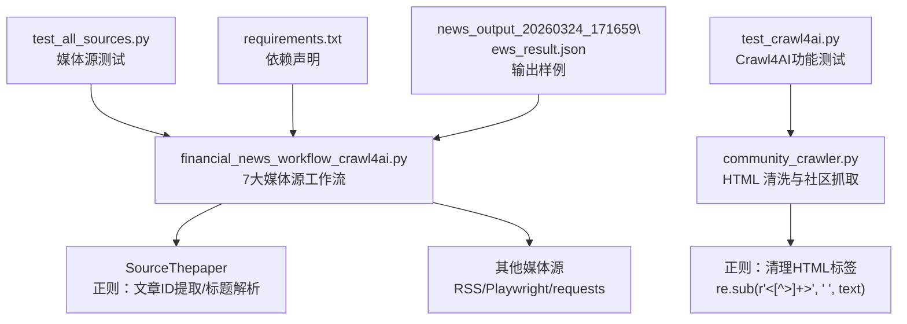
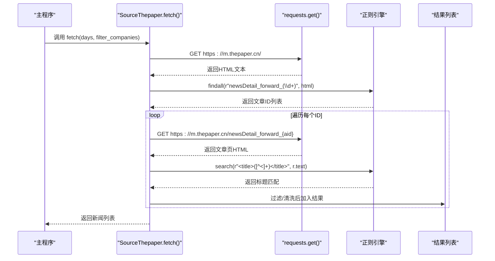
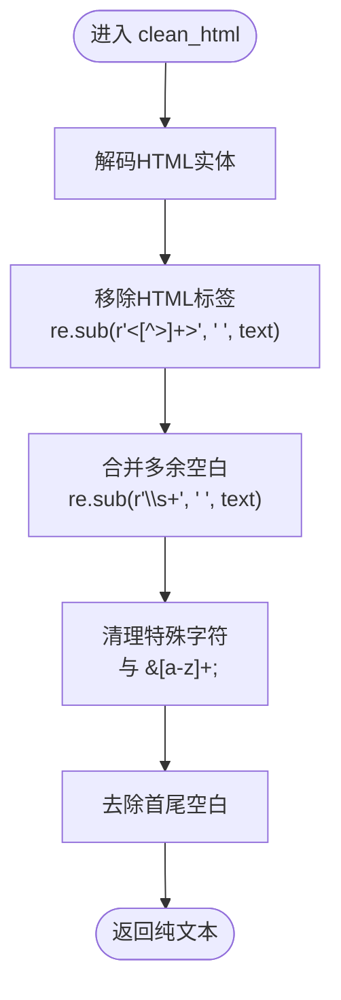
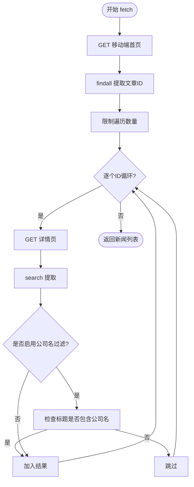
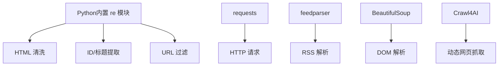

# 正则表达式匹配

<cite>
**本文引用的文件**
- [community_crawler.py](file://community_crawler.py)
- [financial_news_workflow_crawl4ai.py](file://financial_news_workflow_crawl4ai.py)
- [test_all_sources.py](file://test_all_sources.py)
- [requirements.txt](file://requirements.txt)
- [test_crawl4ai.py](file://test_crawl4ai.py)
- [news_output_20260324_171659\news_result.json](file://news_output_20260324_171659\news_result.json)
</cite>

## 目录
1. [简介](#简介)
2. [项目结构](#项目结构)
3. [核心组件](#核心组件)
4. [架构总览](#架构总览)
5. [详细组件分析](#详细组件分析)
6. [依赖分析](#依赖分析)
7. [性能考量](#性能考量)
8. [故障排查指南](#故障排查指南)
9. [结论](#结论)
10. [附录](#附录)

## 简介
本技术文档围绕正则表达式在网页内容提取中的应用展开，结合仓库中实际使用的正则表达式模式，系统讲解 findall()、search()、match() 的使用场景与差异，解释捕获组与预编译优化，覆盖 HTML 标签提取、URL 匹配、标题解析与内容清理等实战技巧。文档同时深入剖析 SourceThepaper 媒体源的实现细节，给出可复用的模式与最佳实践，帮助开发者高效完成文本模式匹配与内容提取任务。

## 项目结构
本仓库包含两类与正则表达式密切相关的脚本：
- 社区论坛内容抓取：展示 HTML 清洗与多源聚合，其中包含正则用于清理 HTML 标签与空白字符。
- 金融新闻自动化工作流：包含多个媒体源的抓取实现，其中 SourceThepaper 展示了典型的正则匹配与标题解析流程。

图表来源
- [community_crawler.py:105-123](file://community_crawler.py#L105-L123)
- [financial_news_workflow_crawl4ai.py:326-358](file://financial_news_workflow_crawl4ai.py#L326-L358)
- [test_all_sources.py:18-48](file://test_all_sources.py#L18-L48)
- [requirements.txt:1-144](file://requirements.txt#L1-L144)
- [test_crawl4ai.py:15-22](file://test_crawl4ai.py#L15-L22)
- [news_output_20260324_171659\news_result.json:1-44](file://news_output_20260324_171659\news_result.json#L1-L44)

章节来源
- [community_crawler.py:105-123](file://community_crawler.py#L105-L123)
- [financial_news_workflow_crawl4ai.py:326-358](file://financial_news_workflow_crawl4ai.py#L326-L358)
- [test_all_sources.py:18-48](file://test_all_sources.py#L18-L48)
- [requirements.txt:1-144](file://requirements.txt#L1-L144)
- [test_crawl4ai.py:15-22](file://test_crawl4ai.py#L15-L22)
- [news_output_20260324_171659\news_result.json:1-44](file://news_output_20260324_171659\news_result.json#L1-L44)

## 核心组件
- 正则表达式在本项目中的角色
  - HTML 标签清理：使用 re.sub 移除标签与多余空白，保留纯文本。
  - URL/路径匹配：使用 re.search 在动态链接中筛选特定格式。
  - 文章ID/标题提取：使用 re.findall 和 re.search 提取关键字段。
- 关键实现位置
  - HTML 清洗：[clean_html:105-123](file://community_crawler.py#L105-L123)
  - URL 匹配（极客公园）：[re.search(r'/news/\d+', href)](file://financial_news_workflow_crawl4ai.py#L244)
  - 文章ID提取（澎湃新闻）：[re.findall(r'newsDetail_forward_(\d+)', html)](file://financial_news_workflow_crawl4ai.py#L334)
  - 标题解析（澎湃新闻）：[re.search(r'<title>([^<]+)</title>', r.text)](file://financial_news_workflow_crawl4ai.py#L340)

章节来源
- [community_crawler.py:105-123](file://community_crawler.py#L105-L123)
- [financial_news_workflow_crawl4ai.py:244](file://financial_news_workflow_crawl4ai.py#L244)
- [financial_news_workflow_crawl4ai.py:334](file://financial_news_workflow_crawl4ai.py#L334)
- [financial_news_workflow_crawl4ai.py:340](file://financial_news_workflow_crawl4ai.py#L340)

## 架构总览
以下序列图展示了 SourceThepaper 的抓取与解析流程，突出正则表达式的使用点与数据流向。

图表来源
- [financial_news_workflow_crawl4ai.py:326-358](file://financial_news_workflow_crawl4ai.py#L326-L358)

## 详细组件分析

### 组件A：HTML 标签清理（CommunityCrawler.clean_html）
- 目标：从富文本中提取纯文本，去除 HTML 标签、实体与多余空白。
- 关键正则
  - 移除标签：re.sub(r'<[^>]+>', ' ', text)
  - 合并空白：re.sub(r'\s+', ' ', text)
  - 特殊字符清理：re.sub(r'&nbsp;', ' ', text)，re.sub(r'&[a-z]+;', '', text)
- 实现要点
  - 先解码 HTML 实体，再移除标签，最后统一空白与特殊字符。
  - 返回 strip() 后的字符串，避免首尾空格。
- 复杂度与性能
  - 时间复杂度 O(n)，n 为文本长度；多次正则串联，整体仍线性。
  - 建议：如需高频调用，可将常用正则预编译为对象，减少重复编译开销。

图表来源
- [community_crawler.py:105-123](file://community_crawler.py#L105-L123)

章节来源
- [community_crawler.py:105-123](file://community_crawler.py#L105-L123)

### 组件B：SourceThepaper 媒体源（正则驱动的ID与标题提取）
- 目标：从移动端页面提取文章ID，拼接详情页URL，解析标题并进行可选的公司名过滤。
- 关键正则
  - 文章ID提取：re.findall(r'newsDetail_forward_(\d+)', html)
  - 标题解析：re.search(r'<title>([^<]+)</title>', r.text)
  - URL 过滤：re.search(r'/news/\d+', href)（用于极客公园）
- 实现要点
  - 使用 findall 获取所有候选ID，限制遍历数量以控制成本。
  - 使用 search 提取标题，避免全局扫描带来的额外开销。
  - 标题清洗：去除“_澎湃新闻”后缀，确保标题简洁一致。
  - 可选过滤：根据公司名列表进行标题过滤，提升相关性。
- 复杂度与性能
  - findall/search 为 O(n)；对每个ID发起一次请求，整体受网络与站点结构影响。
  - 建议：对高频使用的模式进行预编译，减少重复编译。

图表来源
- [financial_news_workflow_crawl4ai.py:326-358](file://financial_news_workflow_crawl4ai.py#L326-L358)

章节来源
- [financial_news_workflow_crawl4ai.py:326-358](file://financial_news_workflow_crawl4ai.py#L326-L358)

### 组件C：URL 匹配与过滤（极客公园）
- 目标：从页面中筛选出形如 /news/\d+ 的文章链接，避免非文章链接。
- 关键正则：re.search(r'/news/\d+', href)
- 实现要点
  - 使用 query_selector_all 获取所有链接，再用正则过滤。
  - 通过集合去重，避免重复抓取同一URL。
  - 结合可选公司名过滤，进一步提升相关性。

章节来源
- [financial_news_workflow_crawl4ai.py:244](file://financial_news_workflow_crawl4ai.py#L244)

### 组件D：媒体源测试与输出验证
- 目标：验证各媒体源抓取稳定性与解析正确性。
- 关键点
  - test_all_sources.py：逐一调用各源 fetch()，记录状态与条数。
  - 输出样例：news_output_20260324_171659\news_result.json 展示了抓取后的结构，便于校验正则解析结果。

章节来源
- [test_all_sources.py:18-48](file://test_all_sources.py#L18-L48)
- [news_output_20260324_171659\news_result.json:1-44](file://news_output_20260324_171659\news_result.json#L1-L44)

## 依赖分析
- 正则表达式相关依赖
  - Python 内置 re 模块：用于 findall/search/match、sub、compile 等。
  - regex 库：requirements.txt 中声明，可用于更强大的正则能力（如平衡组、原子组等），但本项目未直接使用。
- 爬虫与解析依赖
  - requests：用于 HTTP 请求。
  - feedparser：用于 RSS 源解析（虎嗅、钛媒体、界面新闻）。
  - BeautifulSoup：用于 HTML 结构化解析（社区抓取器中使用）。
  - Crawl4AI：用于复杂网页与反爬场景（社区抓取器中使用）。

图表来源
- [requirements.txt:1-144](file://requirements.txt#L1-L144)
- [community_crawler.py:105-123](file://community_crawler.py#L105-L123)
- [financial_news_workflow_crawl4ai.py:326-358](file://financial_news_workflow_crawl4ai.py#L326-L358)

章节来源
- [requirements.txt:1-144](file://requirements.txt#L1-L144)
- [community_crawler.py:105-123](file://community_crawler.py#L105-L123)
- [financial_news_workflow_crawl4ai.py:326-358](file://financial_news_workflow_crawl4ai.py#L326-L358)

## 性能考量
- 正则编译优化
  - 对频繁使用的固定模式（如 HTML 标签清理、URL 过滤）建议预编译为 Pattern 对象，避免重复编译。
  - 在高频循环中使用已编译对象，可显著降低 CPU 开销。
- 匹配策略选择
  - 全局扫描 vs 单次匹配：findall 适合一次性收集全部候选，search 适合快速定位首个匹配，match 仅匹配开头，通常不适用于网页内容提取。
- I/O 与正则的协同
  - SourceThepaper 对每个ID发起独立请求，整体性能受网络与站点响应影响。建议：
    - 限制遍历数量（如取前N个）。
    - 使用并发（如 aiohttp）或批量请求策略。
    - 对标题与正文进行缓存，避免重复解析。
- 内存与字符串处理
  - 大文本正则匹配时，尽量使用惰性匹配与合理的分段处理，避免一次性加载过大的 HTML 文本。

## 故障排查指南
- 正则匹配不到预期结果
  - 检查目标页面结构是否发生变化（如标签名、类名、属性值）。
  - 使用更宽松的模式或增加容错分支（如多选择器/多匹配策略）。
- 标题解析失败
  - 确认页面是否返回了有效 HTML；某些站点可能返回重定向或错误页。
  - 检查编码问题，必要时设置正确的 Content-Type 或手动解码。
- URL 过滤误判
  - 确认正则是否覆盖了所有可能的路径格式；可增加边界条件与容错。
- Crawl4AI/Playwright 未安装
  - 按 requirements.txt 安装对应依赖，并确保浏览器环境可用。
- 输出为空或条数为0
  - 检查公司名过滤开关与标题内容；必要时临时关闭过滤以定位问题。

章节来源
- [test_crawl4ai.py:15-22](file://test_crawl4ai.py#L15-L22)
- [requirements.txt:139-143](file://requirements.txt#L139-L143)

## 结论
本项目在实际网页内容提取中，系统地运用了正则表达式：从 HTML 标签清理到文章ID与标题提取，再到 URL 过滤与标题清洗，形成了完整的模式匹配链路。通过合理选择匹配策略、预编译优化与 I/O 协同，可以在保证准确性的同时提升整体性能。对于 SourceThepaper 等媒体源，正则表达式是实现稳定解析的关键手段之一。

## 附录

### 正则表达式方法与差异（概念性说明）
- findall(pattern, string)
  - 返回所有非重叠匹配组成的列表；适合一次性收集全部候选。
- search(pattern, string)
  - 返回第一个匹配对象；适合快速定位首个满足条件的片段。
- match(pattern, string)
  - 仅在字符串开头匹配；通常不适用于网页内容提取场景。

### 捕获组与命名捕获
- 捕获组：使用括号 () 提取子串，如 r'newsDetail_forward_(\d+)' 中的 \d+。
- 命名捕获：可使用 (?P<name>pattern) 为组命名，便于后续读取与维护。

### 预编译优化建议
- 将常用正则编译为 Pattern 对象，如：
  - pattern = re.compile(r'<[^>]+>')
  - text = pattern.sub(' ', text)
- 在高频循环中复用该对象，避免重复编译。

### HTML 标签提取与内容清理技巧
- 清理顺序建议：实体解码 → 标签移除 → 空白合并 → 特殊字符清理 → 去除首尾空白。
- 使用 BeautifulSoup 与正则结合：先用 BeautifulSoup 定位结构，再用正则做精细清洗。

### URL 匹配与标题解析技巧
- URL 匹配：优先使用精确路径模式（如 /news/\d+），避免误匹配。
- 标题解析：使用 search 定位 <title>，注意去除后缀与多余空白。