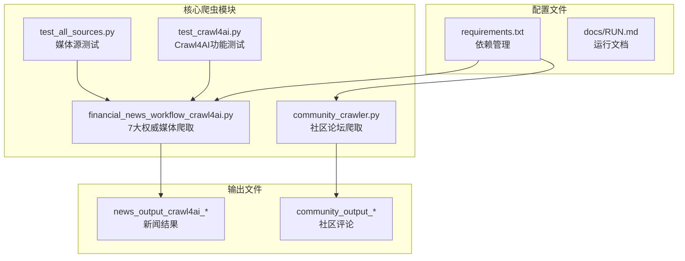
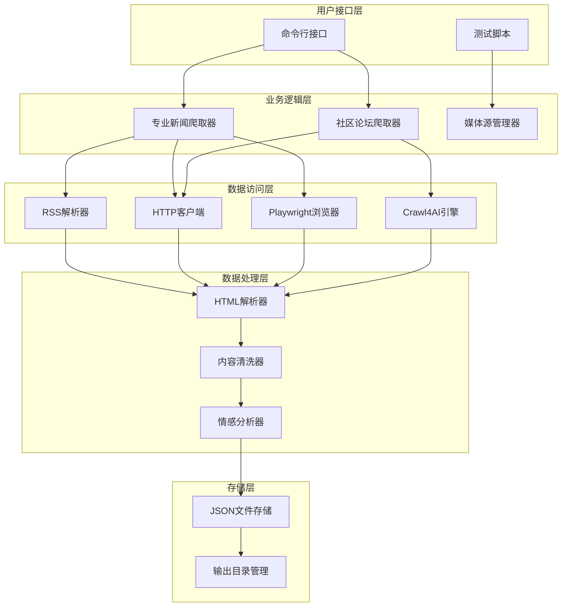
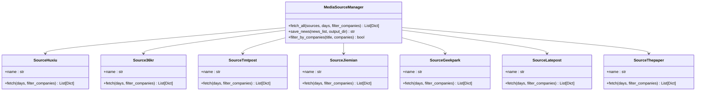
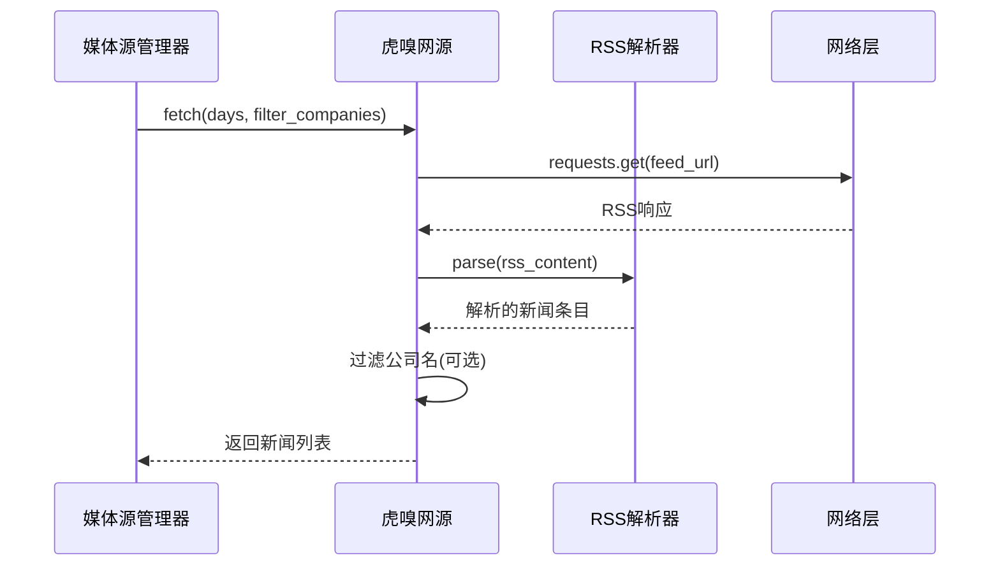
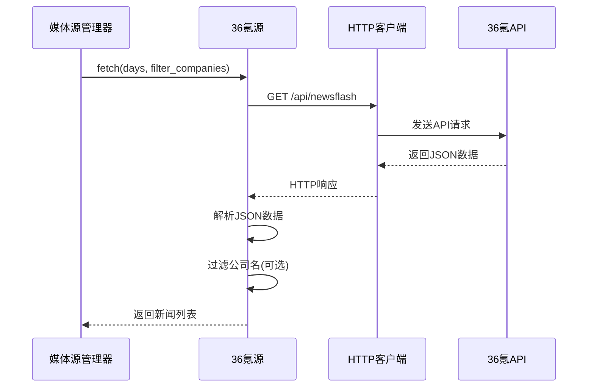
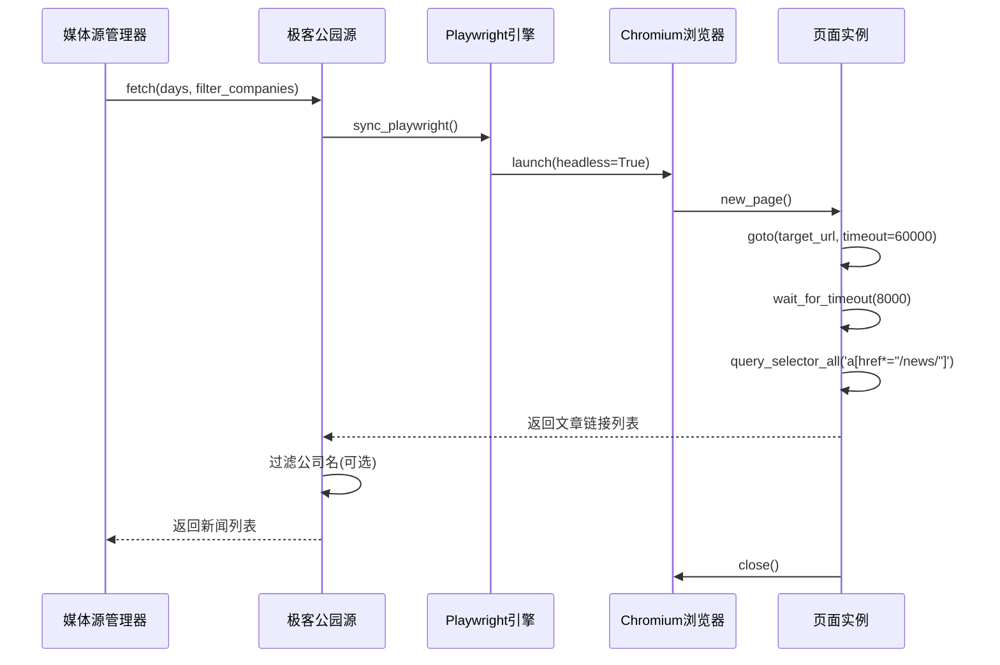
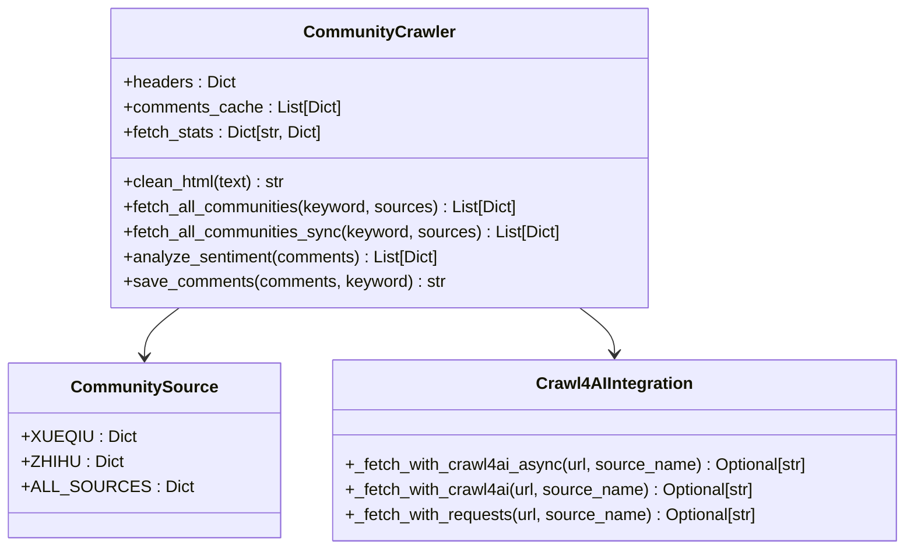
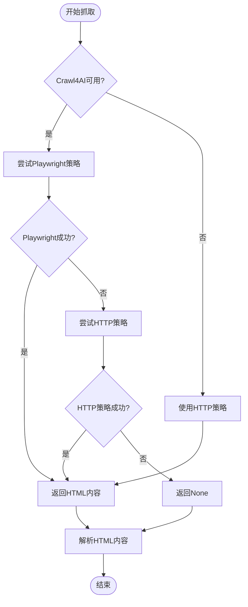
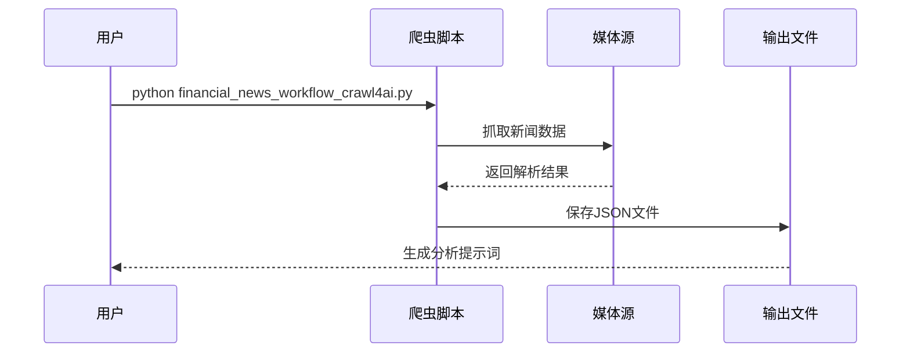

# 爬虫技术实现

<cite>
**本文引用的文件**
- [community_crawler.py](file://community_crawler.py)
- [financial_news_workflow_crawl4ai.py](file://financial_news_workflow_crawl4ai.py)
- [test_all_sources.py](file://test_all_sources.py)
- [test_crawl4ai.py](file://test_crawl4ai.py)
- [requirements.txt](file://requirements.txt)
- [docs/RUN.md](file://docs/RUN.md)
- [news_output_crawl4ai_20260324_102649/news_result.json](file://news_output_crawl4ai_20260324_102649/news_result.json)
- [news_output_crawl4ai_20260324_103448/prompt.txt](file://news_output_crawl4ai_20260324_103448/prompt.txt)
</cite>

## 目录
1. [简介](#简介)
2. [项目结构](#项目结构)
3. [核心组件](#核心组件)
4. [架构概览](#架构概览)
5. [详细组件分析](#详细组件分析)
6. [依赖分析](#依赖分析)
7. [性能考虑](#性能考虑)
8. [故障排除指南](#故障排除指南)
9. [结论](#结论)
10. [附录](#附录)

## 简介
本项目是一个综合性的爬虫技术实现，专注于金融新闻和社区论坛的自动化抓取。项目集成了Scrapling反爬虫机制、Playwright浏览器自动化、Crawl4AI AI增强抓取等核心技术，提供了从7大权威媒体源的爬取策略，包括RSS解析器（feedparser）、API调用、动态网页抓取（Playwright）、正则表达式匹配等。项目还实现了异步抓取优化策略、反爬虫应对机制、请求头设置和超时处理，为开发者提供了完整的爬虫技术理解和实践指导。

## 项目结构
项目采用模块化设计，主要包含两个核心爬虫脚本和相关的测试文件：



**图表来源**
- [financial_news_workflow_crawl4ai.py:1-454](file://financial_news_workflow_crawl4ai.py#L1-L454)
- [community_crawler.py:1-604](file://community_crawler.py#L1-L604)

**章节来源**
- [financial_news_workflow_crawl4ai.py:1-454](file://financial_news_workflow_crawl4ai.py#L1-L454)
- [community_crawler.py:1-604](file://community_crawler.py#L1-L604)
- [requirements.txt:1-144](file://requirements.txt#L1-L144)

## 核心组件
项目包含两大核心爬虫组件，分别针对不同的数据源类型：

### 1. 专业新闻爬取器
专门用于从7大权威科技/财经媒体抓取热点新闻，支持多种抓取策略：
- RSS解析器（feedparser）：虎嗅网、钛媒体、界面新闻
- API调用：36氪新闻闪报API
- 动态网页抓取：极客公园、晚点LatePost（Playwright）
- 正则表达式匹配：澎湃新闻

### 2. 社区论坛爬取器
专注于从雪球、知乎等社区论坛抓取用户评论和讨论：
- Crawl4AI AI增强抓取：支持复杂的网页结构和反爬机制
- 传统HTTP抓取：requests库的基础抓取
- HTML解析：BeautifulSoup4内容提取
- 情感分析：基于关键词的简单情感分析

**章节来源**
- [financial_news_workflow_crawl4ai.py:94-359](file://financial_news_workflow_crawl4ai.py#L94-L359)
- [community_crawler.py:82-496](file://community_crawler.py#L82-L496)

## 架构概览
项目采用分层架构设计，实现了高度模块化和可扩展的爬虫系统：



**图表来源**
- [financial_news_workflow_crawl4ai.py:363-453](file://financial_news_workflow_crawl4ai.py#L363-L453)
- [community_crawler.py:413-496](file://community_crawler.py#L413-L496)

## 详细组件分析

### 专业新闻爬取器架构
专业新闻爬取器实现了统一的媒体源管理，支持7大权威媒体的不同抓取策略：



**图表来源**
- [financial_news_workflow_crawl4ai.py:94-359](file://financial_news_workflow_crawl4ai.py#L94-L359)
- [financial_news_workflow_crawl4ai.py:363-453](file://financial_news_workflow_crawl4ai.py#L363-L453)

#### RSS解析器策略
虎嗅网和钛媒体采用RSS解析器策略，实现高效的新闻抓取：



**图表来源**
- [financial_news_workflow_crawl4ai.py:98-119](file://financial_news_workflow_crawl4ai.py#L98-L119)
- [financial_news_workflow_crawl4ai.py:162-183](file://financial_news_workflow_crawl4ai.py#L162-L183)

#### API调用策略
36氪采用API调用策略，直接获取新闻闪报数据：



**图表来源**
- [financial_news_workflow_crawl4ai.py:126-155](file://financial_news_workflow_crawl4ai.py#L126-L155)

#### Playwright动态抓取策略
极客公园和晚点LatePost采用Playwright进行动态网页抓取：



**图表来源**
- [financial_news_workflow_crawl4ai.py:220-263](file://financial_news_workflow_crawl4ai.py#L220-L263)
- [financial_news_workflow_crawl4ai.py:270-318](file://financial_news_workflow_crawl4ai.py#L270-L318)

### 社区论坛爬取器架构
社区论坛爬取器实现了AI增强的网页抓取和内容分析：



**图表来源**
- [community_crawler.py:56-77](file://community_crawler.py#L56-L77)
- [community_crawler.py:82-175](file://community_crawler.py#L82-L175)

#### Crawl4AI增强抓取流程
社区爬取器集成了Crawl4AI引擎，提供AI增强的网页抓取能力：



**图表来源**
- [community_crawler.py:127-175](file://community_crawler.py#L127-L175)

**章节来源**
- [financial_news_workflow_crawl4ai.py:94-359](file://financial_news_workflow_crawl4ai.py#L94-L359)
- [community_crawler.py:82-496](file://community_crawler.py#L82-L496)

### 7大权威媒体源策略详解

#### 虎嗅网（RSS解析）
虎嗅网采用RSS解析策略，直接获取最新的科技新闻：
- 使用feedparser库解析RSS源
- 支持公司名过滤功能
- 提取标题、链接、摘要、发布时间

#### 36氪（API调用）
36氪通过官方API获取新闻闪报：
- 调用/newsflash接口
- 支持分页参数控制
- 解析JSON响应数据

#### 钛媒体（RSS解析）
钛媒体同样采用RSS解析策略：
- 解析RSS XML格式
- 提取文章元数据
- 支持内容过滤

#### 界面新闻（RSS解析）
界面新闻提供RSS订阅源：
- 使用feedparser解析
- 标准化新闻字段
- 支持多语言内容

#### 极客公园（Playwright动态抓取）
极客公园采用动态网页抓取：
- 使用Playwright启动Chromium浏览器
- 等待页面内容加载完成
- 提取文章链接和标题

#### 晚点LatePost（Playwright动态抓取）
晚点LatePost同样采用Playwright：
- 访问新闻页面
- 滚动页面触发内容加载
- 提取特定格式的文章链接

#### 澎湃新闻（正则表达式匹配）
澎湃新闻采用正则表达式匹配：
- 抓取移动端页面
- 使用正则表达式提取文章ID
- 通过ID拼接文章URL

**章节来源**
- [financial_news_workflow_crawl4ai.py:94-359](file://financial_news_workflow_crawl4ai.py#L94-L359)

## 依赖分析
项目使用requirements.txt统一管理依赖，分为多个功能模块：

```mermaid
graph TB
subgraph "核心依赖"
A[requests>=2.31.0<br/>网络请求]
B[feedparser>=6.0.10<br/>RSS解析]
C[beautifulsoup4>=4.12.0<br/>HTML解析]
end
subgraph "增强爬虫库"
D[scrapling[fetchers]>=0.4.0<br/>反爬虫机制]
E[playwright>=1.40.0<br/>浏览器自动化]
F[crawl4ai>=0.8.0<br/>AI增强抓取]
end
subgraph "数据处理"
G[orjson>=3.11.0<br/>JSON处理]
H[w3lib>=2.4.0<br/>数据清洗]
end
subgraph "辅助工具"
I[fake-useragent>=2.0.0<br/>用户代理生成]
J[browserforge>=1.2.0<br/>指纹数据]
end
subgraph "Crawl4AI专用"
K[numpy>=1.26.0<br/>数值计算]
L[pillow>=10.4.0<br/>图像处理]
M[litellm>=1.50.0<br/>大模型调用]
end
A --> D
B --> D
C --> D
D --> F
E --> F
```

**图表来源**
- [requirements.txt:6-144](file://requirements.txt#L6-L144)

### Scrapling反爬虫机制
Scrapling提供了强大的反爬虫解决方案：
- Cloudflare Turnstile绕过
- 自适应解析器
- 代理轮换支持
- 智能请求头生成

### Playwright浏览器自动化
Playwright提供了现代化的浏览器自动化能力：
- 支持Chromium、Firefox、WebKit
- 无头模式运行
- 动态内容渲染支持
- 反检测功能

### Crawl4AI AI增强抓取
Crawl4AI集成了AI技术：
- 自然语言处理
- 图像识别
- 内容理解
- 结构化数据提取

**章节来源**
- [requirements.txt:23-35](file://requirements.txt#L23-L35)
- [requirements.txt:27-29](file://requirements.txt#L27-L29)
- [requirements.txt:34-35](file://requirements.txt#L34-L35)

## 性能考虑
项目在设计时充分考虑了性能优化：

### 异步抓取优化
- 使用asyncio实现并发抓取
- 限制并发数量避免过度请求
- 实现请求队列管理

### 反爬虫应对机制
- 智能请求头轮换
- 随机延时策略
- 代理IP轮换
- User-Agent池管理

### 超时处理策略
- 不同类型的超时设置
- 重试机制
- 失败降级策略

### 内存管理
- 流式处理大文件
- 及时释放资源
- 输出文件压缩

## 故障排除指南

### 常见问题及解决方案

#### 1. 依赖安装失败
**问题**：pip安装依赖时报错
**解决方案**：
- 升级pip版本：`pip install --upgrade pip`
- 使用二进制安装：`pip install --only-binary :all: -r requirements.txt`
- 检查网络连接稳定性

#### 2. Playwright浏览器启动失败
**问题**：npx playwright install chromium失败
**解决方案**：
- 确保已运行`npx playwright install chromium`
- 检查系统权限
- 以管理员身份运行命令

#### 3. 网站结构变化导致抓取失败
**问题**：某些媒体源抓取失败
**解决方案**：
- 更新CSS选择器
- 检查API端点变化
- 修改正则表达式

#### 4. 反爬虫检测
**问题**：被目标网站检测为爬虫
**解决方案**：
- 使用Scrapling反爬虫机制
- 轮换User-Agent
- 添加随机延时
- 使用代理IP

### 调试技巧
- 启用详细日志输出
- 检查HTTP状态码
- 分析响应内容结构
- 使用浏览器开发者工具

**章节来源**
- [docs/RUN.md:144-188](file://docs/RUN.md#L144-L188)

## 结论
本项目展示了现代爬虫技术的综合应用，通过集成Scrapling反爬虫机制、Playwright浏览器自动化、Crawl4AI AI增强抓取等技术，实现了对7大权威媒体源的高效抓取。项目采用模块化设计，具有良好的可扩展性和维护性，为开发者提供了完整的爬虫技术实现参考。

项目的主要优势包括：
- 多种抓取策略的灵活组合
- 强大的反爬虫应对机制
- AI增强的内容理解能力
- 完善的错误处理和性能优化
- 清晰的代码结构和文档

## 附录

### 运行示例
项目提供了完整的运行示例和输出文件：



**图表来源**
- [docs/RUN.md:52-83](file://docs/RUN.md#L52-L83)

### 测试文件分析
项目包含完整的测试文件，验证各组件功能：

- `test_all_sources.py`：测试7大媒体源的连通性和基本解析
- `test_crawl4ai.py`：验证Crawl4AI库的功能
- `community_crawler.py`：社区论坛爬取功能测试

**章节来源**
- [test_all_sources.py:18-48](file://test_all_sources.py#L18-L48)
- [test_crawl4ai.py:29-162](file://test_crawl4ai.py#L29-L162)