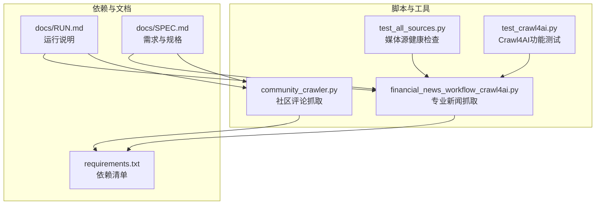
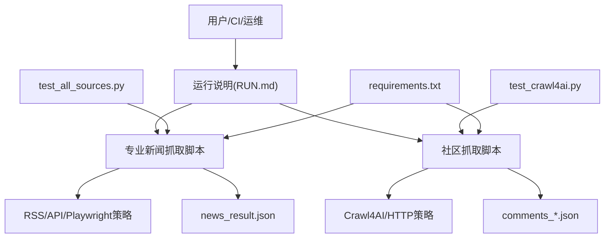
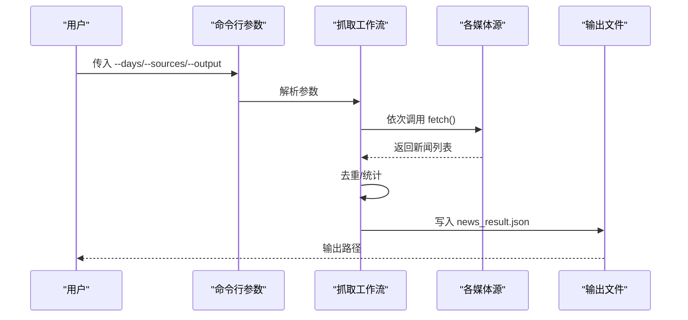
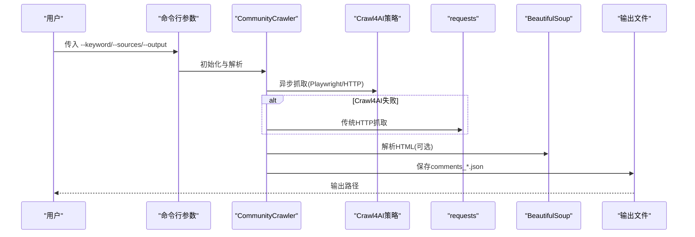
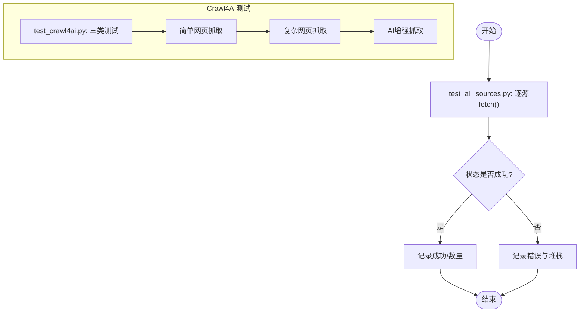

# 故障排除与调试

<cite>
**本文引用的文件**
- [requirements.txt](file://requirements.txt)
- [community_crawler.py](file://community_crawler.py)
- [financial_news_workflow_crawl4ai.py](file://financial_news_workflow_crawl4ai.py)
- [test_all_sources.py](file://test_all_sources.py)
- [test_crawl4ai.py](file://test_crawl4ai.py)
- [docs/RUN.md](file://docs/RUN.md)
- [docs/SPEC.md](file://docs/SPEC.md)
</cite>

## 目录
1. [简介](#简介)
2. [项目结构](#项目结构)
3. [核心组件](#核心组件)
4. [架构总览](#架构总览)
5. [详细组件分析](#详细组件分析)
6. [依赖分析](#依赖分析)
7. [性能考虑](#性能考虑)
8. [故障排除指南](#故障排除指南)
9. [结论](#结论)
10. [附录](#附录)

## 简介
本指南面向技术支持人员与高级用户，聚焦于抓取系统的故障排除与调试实践。内容覆盖抓取失败、依赖安装问题、Playwright浏览器启动失败、网络问题诊断、反爬虫应对、数据完整性检查、性能调优、内存管理与并发控制、监控与告警配置、错误追踪与问题定位等主题，并结合仓库中的实际脚本与文档，提供系统化的方法论与实操建议。

## 项目结构
该项目围绕“金融新闻自动化工作流”与“社区论坛抓取工具”两大功能模块展开，配套依赖清单、运行说明与规格文档，便于快速定位问题与验证环境。

图表来源
- [financial_news_workflow_crawl4ai.py:1-454](file://financial_news_workflow_crawl4ai.py#L1-L454)
- [community_crawler.py:1-604](file://community_crawler.py#L1-L604)
- [test_all_sources.py:1-49](file://test_all_sources.py#L1-L49)
- [test_crawl4ai.py:1-163](file://test_crawl4ai.py#L1-L163)
- [requirements.txt:1-144](file://requirements.txt#L1-L144)
- [docs/RUN.md:1-252](file://docs/RUN.md#L1-L252)
- [docs/SPEC.md:1-183](file://docs/SPEC.md#L1-L183)

章节来源
- [docs/RUN.md:1-252](file://docs/RUN.md#L1-L252)
- [docs/SPEC.md:1-183](file://docs/SPEC.md#L1-L183)

## 核心组件
- 专业新闻抓取工作流：封装7大权威媒体的RSS/API/Playwright抓取逻辑，支持按天数与来源过滤，输出JSON与分析提示词。
- 社区论坛抓取器：统一抓取雪球、知乎等社区，支持Crawl4AI增强抓取与BeautifulSoup解析，输出评论与情感分析结果。
- 健康检查与测试：媒体源逐一测试、Crawl4AI功能验证，辅助快速定位依赖与环境问题。

章节来源
- [financial_news_workflow_crawl4ai.py:1-454](file://financial_news_workflow_crawl4ai.py#L1-L454)
- [community_crawler.py:1-604](file://community_crawler.py#L1-L604)
- [test_all_sources.py:1-49](file://test_all_sources.py#L1-L49)
- [test_crawl4ai.py:1-163](file://test_crawl4ai.py#L1-L163)

## 架构总览
整体采用“脚本驱动 + 多策略抓取 + 统一输出”的架构。专业新闻抓取侧重稳定与覆盖面，社区抓取强调反爬与解析能力，测试脚本负责环境与功能验证。

图表来源
- [docs/RUN.md:50-112](file://docs/RUN.md#L50-L112)
- [financial_news_workflow_crawl4ai.py:363-454](file://financial_news_workflow_crawl4ai.py#L363-L454)
- [community_crawler.py:127-176](file://community_crawler.py#L127-L176)
- [test_all_sources.py:18-48](file://test_all_sources.py#L18-L48)
- [test_crawl4ai.py:13-163](file://test_crawl4ai.py#L13-L163)
- [requirements.txt:1-144](file://requirements.txt#L1-L144)

## 详细组件分析

### 专业新闻抓取组件（financial_news_workflow_crawl4ai.py）
- 多源适配：RSS（feedparser）、API（requests）、动态渲染（Playwright）三类策略，分别对应不同站点特性。
- 可选过滤：按公司名过滤，便于聚焦目标企业。
- 输出与统计：统一JSON输出，包含来源分布与条目统计；提供Top展示与去重逻辑。
- 错误处理：各源独立捕获异常并记录状态，保证整体流程稳健。

图表来源
- [financial_news_workflow_crawl4ai.py:405-454](file://financial_news_workflow_crawl4ai.py#L405-L454)
- [financial_news_workflow_crawl4ai.py:363-382](file://financial_news_workflow_crawl4ai.py#L363-L382)

章节来源
- [financial_news_workflow_crawl4ai.py:94-359](file://financial_news_workflow_crawl4ai.py#L94-L359)

### 社区论坛抓取组件（community_crawler.py）
- 多策略回退：优先Crawl4AI（Playwright/HTTP），失败时回退至requests；若无BeautifulSoup则降级解析。
- 清洗与解析：HTML清理、多选择器尝试、字段提取与缓存统计。
- 输出与分析：保存JSON并统计来源与情感分布；情感分析为关键词粗粒度统计。

图表来源
- [community_crawler.py:127-176](file://community_crawler.py#L127-L176)
- [community_crawler.py:179-194](file://community_crawler.py#L179-L194)
- [community_crawler.py:467-497](file://community_crawler.py#L467-L497)

章节来源
- [community_crawler.py:82-497](file://community_crawler.py#L82-L497)

### 健康检查与测试组件
- test_all_sources.py：对7大媒体源逐一调用fetch，记录状态与数量，便于快速发现不可达或解析异常。
- test_crawl4ai.py：验证Crawl4AI安装与功能，覆盖简单/复杂网页抓取与AI增强抓取路径。

图表来源
- [test_all_sources.py:18-48](file://test_all_sources.py#L18-L48)
- [test_crawl4ai.py:29-119](file://test_crawl4ai.py#L29-L119)

章节来源
- [test_all_sources.py:1-49](file://test_all_sources.py#L1-L49)
- [test_crawl4ai.py:1-163](file://test_crawl4ai.py#L1-L163)

## 依赖分析
- 核心网络与解析：requests、httpx、aiohttp、feedparser、beautifulsoup4、lxml、cssselect。
- 反爬与浏览器：playwright、patchright、playwright-stealth、Crawl4AI。
- 数据处理与工具：orjson、w3lib、tld、fake-useragent、browserforge、apify-fingerprint-datapoints、chardet、pyOpenSSL、cryptography、httpcore、h2。
- AI/ML与向量化：numpy、pillow、scipy、scikit-learn、nltk、rank-bm25、snowballstemmer、litellm、openai、tiktoken、tokenizers、huggingface-hub、aiosqlite、alphashape、shapely、trimesh、networkx、rtree。
- 异步与终端：anyio、typing-extensions、rich、pygments、python-dotenv、xxhash、lark、regex、joblib、humanize、brotli、psutil、aiofiles、typer、click、click-log、markdown-it-py、jinja2、jsonschema、referencing、rpds-py、importlib-metadata、zipp、filelock、fsspec、hf-xet、mdurl、annotated-types、pydantic、pydantic-core、typing-inspection。

章节来源
- [requirements.txt:1-144](file://requirements.txt#L1-L144)

## 性能考虑
- 并发与异步：专业新闻抓取脚本采用同步调用，社区抓取脚本提供异步入口；建议在批量抓取时使用异步或进程池，避免阻塞。
- 超时与重试：为HTTP请求设置合理超时，对易波动站点增加重试与退避策略。
- 解析成本：BeautifulSoup解析较重，建议在必要时才启用；对静态内容优先使用轻量解析。
- 内存管理：避免一次性加载大量HTML；及时释放中间变量；定期清理输出目录。
- 网络与反爬：合理设置User-Agent、随机延时、代理轮换与指纹伪装，降低被封概率。

章节来源
- [community_crawler.py:179-194](file://community_crawler.py#L179-L194)
- [financial_news_workflow_crawl4ai.py:220-263](file://financial_news_workflow_crawl4ai.py#L220-L263)
- [docs/SPEC.md:92-97](file://docs/SPEC.md#L92-L97)

## 故障排除指南

### 一、抓取失败排查
- 症状：某媒体源抓取为空或报错。
- 排查步骤：
  1) 使用媒体源健康检查脚本定位问题源。
  2) 检查网络连通性与目标站点可达性。
  3) 对动态站点（如极客公园、晚点）确认Playwright安装与Chromium可用。
  4) 对RSS/API站点检查URL与参数是否变更。
  5) 查看命令行输出与异常堆栈，关注“未找到结果”“HTTP状态码”“浏览器启动失败”等提示。
- 建议：
  - 逐步缩小来源范围（--sources），先验证单源再全量。
  - 适当放宽时间窗口（--days）以规避临时不可用。
  - 对解析失败的站点，尝试启用BeautifulSoup或切换到Crawl4AI策略。

章节来源
- [test_all_sources.py:18-48](file://test_all_sources.py#L18-L48)
- [financial_news_workflow_crawl4ai.py:216-263](file://financial_news_workflow_crawl4ai.py#L216-L263)
- [financial_news_workflow_crawl4ai.py:158-183](file://financial_news_workflow_crawl4ai.py#L158-L183)
- [docs/RUN.md:144-151](file://docs/RUN.md#L144-L151)

### 二、依赖安装问题
- 症状：ImportError或功能缺失提示。
- 排查步骤：
  1) 确认Python版本满足要求（3.8+）。
  2) 使用requirements.txt完整安装依赖。
  3) 若安装失败，尝试升级pip并使用二进制包策略。
  4) 检查可选依赖（BeautifulSoup4、Crawl4AI、Playwright）是否按需安装。
- 建议：
  - 在虚拟环境中安装，避免全局污染。
  - 使用官方镜像源加速下载。
  - 对Crawl4AI与Playwright，遵循其独立安装与初始化流程。

章节来源
- [requirements.txt:132-144](file://requirements.txt#L132-L144)
- [docs/RUN.md:38-48](file://docs/RUN.md#L38-L48)
- [docs/RUN.md:157-161](file://docs/RUN.md#L157-L161)

### 三、Playwright浏览器启动失败
- 症状：浏览器无法启动、无头模式失败、权限不足。
- 排查步骤：
  1) 确认已执行浏览器安装命令。
  2) 检查系统权限与杀软拦截。
  3) 尝试以管理员身份运行或调整安全策略。
  4) 对动态站点，优先使用Crawl4AI策略作为备选。
- 建议：
  - 在CI/容器环境中确保无头模式可用。
  - 对稳定性要求高的场景，优先采用非浏览器策略（HTTP/Crawl4AI）。

章节来源
- [docs/RUN.md:44-48](file://docs/RUN.md#L44-L48)
- [docs/RUN.md:152-156](file://docs/RUN.md#L152-L156)
- [community_crawler.py:127-176](file://community_crawler.py#L127-L176)
- [financial_news_workflow_crawl4ai.py:216-263](file://financial_news_workflow_crawl4ai.py#L216-L263)

### 四、网络问题诊断
- 症状：超时、DNS解析失败、代理不通。
- 排查步骤：
  1) 使用ping/trace路由检查网络连通性。
  2) 验证代理设置（如需）与证书链。
  3) 对HTTPS站点检查TLS版本与证书有效性。
- 建议：
  - 为请求设置合理的超时与重试。
  - 使用HTTP/2与连接复用提升吞吐。
  - 对不稳定网络启用指数退避与断路器。

章节来源
- [requirements.txt:63-66](file://requirements.txt#L63-L66)
- [community_crawler.py:179-194](file://community_crawler.py#L179-L194)
- [financial_news_workflow_crawl4ai.py:132-137](file://financial_news_workflow_crawl4ai.py#L132-L137)

### 五、反爬虫应对
- 症状：IP封禁、验证码、行为检测、内容差异。
- 排查步骤：
  1) 检查User-Agent、Referer、Accept等头部是否合理。
  2) 启用浏览器自动化或反爬插件（如playwright-stealth）。
  3) 使用代理池与指纹伪装，降低特征集中度。
- 建议：
  - 对高防站点优先采用Crawl4AI策略。
  - 结合随机延时与请求节流，避免触发风控。
  - 对静态内容优先HTTP策略，减少浏览器开销。

章节来源
- [requirements.txt:27-32](file://requirements.txt#L27-L32)
- [community_crawler.py:92-97](file://community_crawler.py#L92-L97)
- [community_crawler.py:127-176](file://community_crawler.py#L127-L176)

### 六、数据完整性检查
- 症状：输出文件缺失、字段不全、重复条目。
- 排查步骤：
  1) 检查输出目录权限与磁盘空间。
  2) 校验JSON结构与必填字段。
  3) 对新闻抓取执行去重逻辑，确认标题唯一性。
- 建议：
  - 在保存前进行字段校验与空值处理。
  - 对社区评论补充情感字段与抓取时间戳。
  - 建立数据校验脚本，定期巡检输出质量。

章节来源
- [financial_news_workflow_crawl4ai.py:384-403](file://financial_news_workflow_crawl4ai.py#L384-L403)
- [community_crawler.py:467-497](file://community_crawler.py#L467-L497)

### 七、性能调优与并发控制
- 症状：抓取慢、CPU/内存占用高、超时频繁。
- 排查步骤：
  1) 分析瓶颈：IO、CPU、网络或解析。
  2) 评估并发度：对静态站点适度并发，对动态站点谨慎并发。
  3) 优化解析：减少BeautifulSoup使用频次，优先正则/轻量解析。
- 建议：
  - 使用异步或进程池，结合限速与队列。
  - 对高频站点引入缓存与增量抓取。
  - 监控资源使用，设置上限与告警阈值。

章节来源
- [docs/SPEC.md:92-97](file://docs/SPEC.md#L92-L97)
- [community_crawler.py:179-194](file://community_crawler.py#L179-L194)
- [financial_news_workflow_crawl4ai.py:363-382](file://financial_news_workflow_crawl4ai.py#L363-L382)

### 八、监控与告警配置
- 建议指标：
  - 抓取成功率、平均耗时、错误率、内存峰值、并发数。
  - 各媒体源成功率与响应时间。
- 建议手段：
  - 在脚本中埋点统计与日志采集。
  - 使用系统监控（如psutil）与APM工具。
  - 对异常建立邮件/IM告警通道。

章节来源
- [docs/SPEC.md:138-142](file://docs/SPEC.md#L138-L142)

### 九、错误追踪与问题定位
- 建议方法：
  - 使用统一的日志框架，记录时间戳、来源、URL、状态码、异常堆栈。
  - 对Crawl4AI与Playwright异常，单独分类与归档。
  - 建立问题反馈模板，包含环境、依赖版本、最小复现步骤。
- 建议工具：
  - Python异常追踪（traceback）与日志级别划分。
  - CI流水线中加入健康检查与测试报告。

章节来源
- [test_all_sources.py:38-41](file://test_all_sources.py#L38-L41)
- [test_crawl4ai.py:58-60](file://test_crawl4ai.py#L58-L60)

## 结论
本指南基于仓库中的脚本与文档，总结了从环境准备、依赖安装、抓取策略、反爬应对到性能优化与监控告警的全流程故障排除方法。建议在生产环境中结合异步并发、缓存与限速策略，配合日志与监控体系，持续迭代抓取规则与稳定性保障。

## 附录

### A. 常用命令与参数速查
- 专业新闻抓取：指定天数与来源，输出到带时间戳目录。
- 社区评论抓取：指定关键词与来源，输出评论JSON并统计情感分布。
- 媒体源健康检查：逐源测试，输出状态与数量。
- Crawl4AI功能测试：验证HTTP策略与AI增强抓取能力。

章节来源
- [docs/RUN.md:58-112](file://docs/RUN.md#L58-L112)
- [test_all_sources.py:18-48](file://test_all_sources.py#L18-L48)
- [test_crawl4ai.py:121-163](file://test_crawl4ai.py#L121-L163)