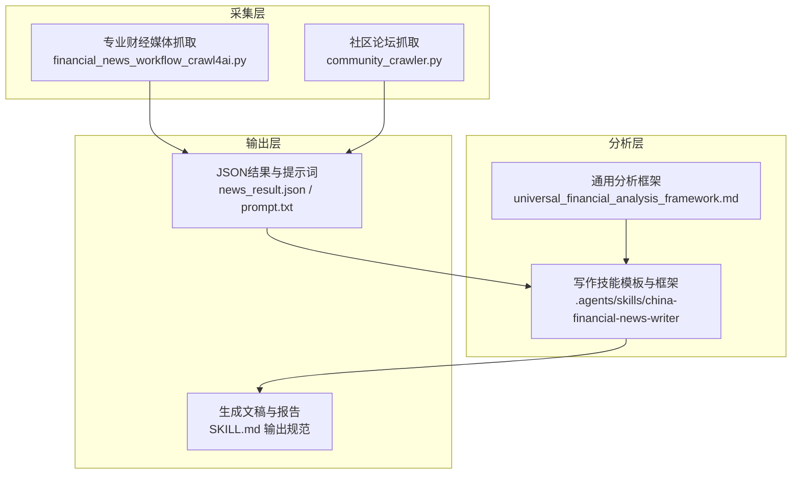
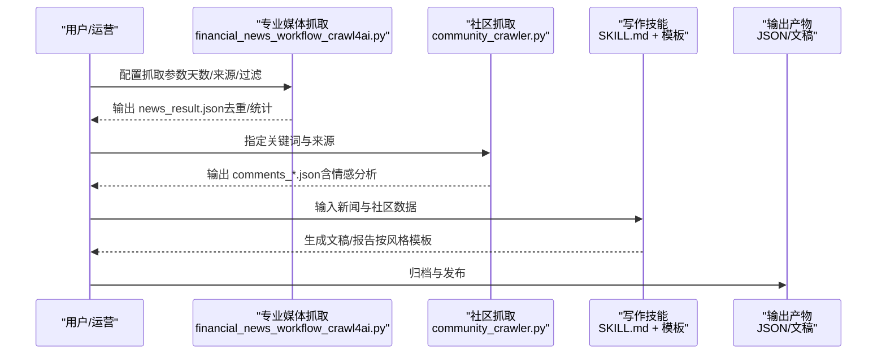
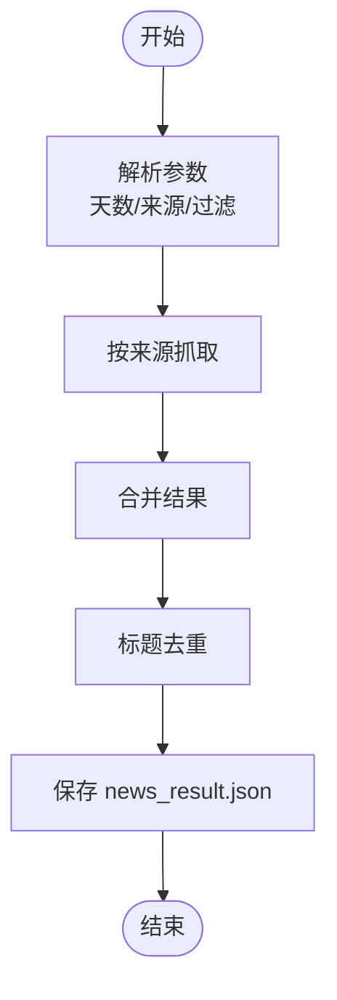
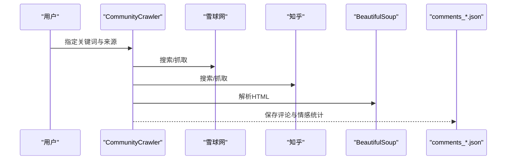
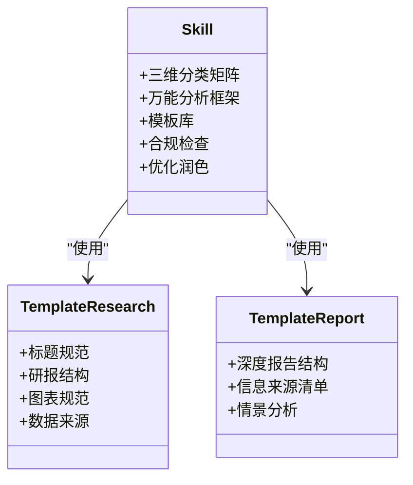
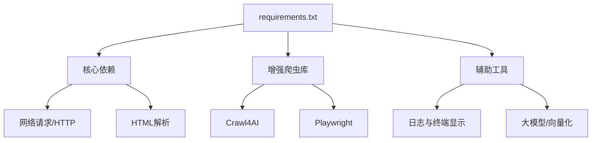

# 最佳实践与案例

<cite>
**本文引用的文件**
- [requirements.txt](file://requirements.txt)
- [financial_news_workflow_crawl4ai.py](file://financial_news_workflow_crawl4ai.py)
- [community_crawler.py](file://community_crawler.py)
- [test_all_sources.py](file://test_all_sources.py)
- [test_crawl4ai.py](file://test_crawl4ai.py)
- [RUN.md](file://docs/RUN.md)
- [design_philosophy.md](file://design/design_philosophy.md)
- [SKILL.md](file://.agents/skills/china-financial-news-writer/SKILL.md)
- [universal_financial_analysis_framework.md](file://.agents/skills/china-financial-news-writer/references/universal_financial_analysis_framework.md)
- [template-research.md](file://.agents/skills/china-financial-news-writer/references/template-research.md)
- [research-report-template.md](file://.agents/skills/china-financial-news-writer/references/research-report-template.md)
- [news_output_20260323_235950\news_result.json](file://news_output_20260323_235950/news_result.json)
- [news_output\news_20260324_182234.json](file://news_output/news_20260324_182234.json)
- [news_output_crawl4ai_20260324_103448\prompt.txt](file://news_output_crawl4ai_20260324_103448/prompt.txt)
</cite>

## 目录
1. [引言](#引言)
2. [项目结构](#项目结构)
3. [核心组件](#核心组件)
4. [架构总览](#架构总览)
5. [详细组件分析](#详细组件分析)
6. [依赖分析](#依赖分析)
7. [性能考虑](#性能考虑)
8. [故障排查指南](#故障排查指南)
9. [结论](#结论)
10. [附录](#附录)

## 引言
本文件面向金融内容生产与分析团队，系统化总结本仓库在“新闻监控—舆情分析—内容创作—投资决策支持”全流程的最佳实践与成功案例。文档以真实脚本与输出样例为依据，提供可复用的业务流程范式、性能优化经验、合规与数据安全建议，以及行业应用与效果评估方法，帮助读者快速搭建稳定高效的自动化内容生产与分析体系。

## 项目结构
项目采用“脚本驱动 + 技能模板 + 输出产物”的分层组织方式：
- 爬虫与采集：专业财经媒体抓取与社区论坛抓取两条主线，支持多源聚合与去重。
- 内容生成：基于“三维分类矩阵”与“万能分析框架”的写作技能，覆盖小红书、公众号、研报简报、深度报告等风格。
- 输出与发布：统一的文件命名与目录规范，便于自动化集成与归档。

**图表来源**
- [financial_news_workflow_crawl4ai.py:1-454](file://financial_news_workflow_crawl4ai.py#L1-L454)
- [community_crawler.py:1-604](file://community_crawler.py#L1-L604)
- [SKILL.md:1-476](file://.agents/skills/china-financial-news-writer/SKILL.md#L1-L476)
- [universal_financial_analysis_framework.md:1-126](file://.agents/skills/china-financial-news-writer/references/universal_financial_analysis_framework.md#L1-L126)

**章节来源**
- [RUN.md:1-252](file://docs/RUN.md#L1-L252)

## 核心组件
- 专业财经媒体抓取工作流：支持7大权威媒体源，具备RSS/Playwright/API/HTML解析等多策略，提供去重与统计输出。
- 社区论坛抓取与情感分析：支持雪球、知乎等平台，提供评论清洗、情感打分与统计。
- 写作技能与模板：提供三维分类矩阵、万能分析框架、研报模板与深度报告模板，覆盖多种输出风格。
- 输出规范与文件命名：统一输出目录与文件命名，便于自动化归档与检索。

**章节来源**
- [financial_news_workflow_crawl4ai.py:94-359](file://financial_news_workflow_crawl4ai.py#L94-L359)
- [community_crawler.py:82-497](file://community_crawler.py#L82-L497)
- [SKILL.md:24-52](file://.agents/skills/china-financial-news-writer/SKILL.md#L24-L52)
- [universal_financial_analysis_framework.md:1-126](file://.agents/skills/china-financial-news-writer/references/universal_financial_analysis_framework.md#L1-L126)

## 架构总览
下图展示了从“新闻采集—内容分析—生成创作—合规与发布”的完整业务闭环：

**图表来源**
- [financial_news_workflow_crawl4ai.py:405-454](file://financial_news_workflow_crawl4ai.py#L405-L454)
- [community_crawler.py:501-604](file://community_crawler.py#L501-L604)
- [SKILL.md:357-414](file://.agents/skills/china-financial-news-writer/SKILL.md#L357-L414)

## 详细组件分析

### 专业财经媒体抓取工作流
- 多源适配：RSS（虎嗅、钛媒体、界面）、API（36氪）、Playwright（极客公园、晚点）、HTML解析（澎湃新闻）。
- 过滤与去重：支持按公司名过滤与标题去重，输出按来源与总量统计。
- 输出结构：包含抓取时间、总数、来源分布、新闻列表等字段，便于二次加工。

**图表来源**
- [financial_news_workflow_crawl4ai.py:405-454](file://financial_news_workflow_crawl4ai.py#L405-L454)

**章节来源**
- [financial_news_workflow_crawl4ai.py:94-359](file://financial_news_workflow_crawl4ai.py#L94-L359)
- [test_all_sources.py:18-48](file://test_all_sources.py#L18-L48)
- [news_output_20260323_235950/news_result.json:1-168](file://news_output_20260323_235950/news_result.json#L1-L168)
- [news_output/news_20260324_182234.json:1-75](file://news_output/news_20260324_182234.json#L1-L75)

### 社区论坛抓取与情感分析
- 多源社区：雪球、知乎，支持Crawl4AI增强抓取与BeautifulSoup解析。
- 清洗与情感：HTML清理、关键词匹配打分，输出按来源与情感分布统计。
- 输出结构：包含抓取时间、关键词、总数、来源/情感统计、评论明细。

**图表来源**
- [community_crawler.py:197-410](file://community_crawler.py#L197-L410)

**章节来源**
- [community_crawler.py:82-497](file://community_crawler.py#L82-L497)

### 写作技能与模板
- 三维分类矩阵：公司类型×新闻类型×输出风格，自动匹配写作框架与模板。
- 万能分析框架：覆盖事件、战略、竞争、财务、舆情、技术、历史、预测、故事、情感、互动、可视化等模块。
- 模板体系：小红书、公众号、研报简报、深度报告，配套标题公式、关键词策略、敏感词库与合规规则。

**图表来源**
- [SKILL.md:24-52](file://.agents/skills/china-financial-news-writer/SKILL.md#L24-L52)
- [universal_financial_analysis_framework.md:1-126](file://.agents/skills/china-financial-news-writer/references/universal_financial_analysis_framework.md#L1-L126)
- [template-research.md:1-459](file://.agents/skills/china-financial-news-writer/references/template-research.md#L1-L459)
- [research-report-template.md:1-395](file://.agents/skills/china-financial-news-writer/references/research-report-template.md#L1-L395)

**章节来源**
- [SKILL.md:11-52](file://.agents/skills/china-financial-news-writer/SKILL.md#L11-L52)
- [universal_financial_analysis_framework.md:1-126](file://.agents/skills/china-financial-news-writer/references/universal_financial_analysis_framework.md#L1-L126)
- [template-research.md:1-459](file://.agents/skills/china-financial-news-writer/references/template-research.md#L1-L459)
- [research-report-template.md:1-395](file://.agents/skills/china-financial-news-writer/references/research-report-template.md#L1-L395)

### 输出规范与文件命名
- 输出目录：自动创建带时间戳的子目录，避免冲突。
- 文件命名：统一前缀+时间戳+类型，确保唯一性与可检索性。
- 内容类型：文稿、报告、大纲、脚本等，满足不同平台与用途。

**章节来源**
- [financial_news_workflow_crawl4ai.py:384-403](file://financial_news_workflow_crawl4ai.py#L384-L403)
- [community_crawler.py:467-497](file://community_crawler.py#L467-L497)
- [SKILL.md:417-440](file://.agents/skills/china-financial-news-writer/SKILL.md#L417-L440)

## 依赖分析
- 核心依赖：requests、httpx、aiohttp、feedparser、beautifulsoup4、lxml、playwright、crawl4ai 等。
- 增强能力：Crawl4AI提供AI增强抓取与解析，Playwright用于反爬对抗与动态内容抓取。
- 工具链：rich、pygments、jinja2、pydantic、tiktoken、litellm 等，支撑日志、模板与大模型调用。

**图表来源**
- [requirements.txt:1-144](file://requirements.txt#L1-L144)

**章节来源**
- [requirements.txt:1-144](file://requirements.txt#L1-L144)

## 性能考虑
- 并发与异步：社区抓取采用异步策略，减少IO等待；可结合限速与并发上限控制资源占用。
- 选择性抓取：通过参数控制抓取天数与来源，避免无效负载；对动态站点优先使用Playwright策略。
- 缓存与去重：标题去重与来源统计减少重复处理；输出文件结构便于增量分析。
- 依赖优化：按需安装Crawl4AI与Playwright，避免不必要的依赖开销；定期升级依赖保持兼容性。

**章节来源**
- [community_crawler.py:127-176](file://community_crawler.py#L127-L176)
- [RUN.md:180-188](file://docs/RUN.md#L180-L188)

## 故障排查指南
- 抓取失败：检查网络与目标站点状态，缩小来源范围，查看命令行错误信息。
- Playwright启动失败：确认已安装Chromium浏览器；以管理员权限运行；检查系统权限。
- 依赖安装失败：升级pip版本；尝试二进制安装；检查网络与镜像源。
- Crawl4AI功能测试：使用测试脚本验证抓取策略与返回结构，逐步排查配置问题。

**章节来源**
- [RUN.md:144-161](file://docs/RUN.md#L144-L161)
- [test_crawl4ai.py:1-163](file://test_crawl4ai.py#L1-L163)

## 结论
本项目提供了从“新闻采集—社区舆情—内容生成—合规发布”的完整自动化流水线，结合写作技能模板与分析框架，可高效支撑新闻监控、舆情分析、内容创作与投资决策支持。通过严格的输出规范、性能优化与合规建议，可在保障质量的同时提升效率与可维护性。

## 附录

### 业务流程案例：从采集到发布的全过程
- 步骤1：专业媒体抓取
  - 命令示例：python financial_news_workflow_crawl4ai.py --days 10 --sources huxiu,36kr,jiemian
  - 输出：news_result.json（含来源统计与新闻列表）
- 步骤2：分析新闻结果
  - 依据来源与关键词确定核心选题
- 步骤3：社区评论抓取
  - 命令示例：python community_crawler.py --keyword "小米汽车" --sources all
  - 输出：comments_小米汽车.json（含情感分析）
- 步骤4：生成文稿/报告
  - 基于写作技能模板与分析框架生成内容
- 步骤5：发布与归档
  - 使用统一命名与目录规范归档输出

**章节来源**
- [RUN.md:113-143](file://docs/RUN.md#L113-L143)
- [news_output_20260323_235950/news_result.json:1-168](file://news_output_20260323_235950/news_result.json#L1-L168)
- [news_output/news_20260324_182234.json:1-75](file://news_output/news_20260324_182234.json#L1-L75)
- [news_output_crawl4ai_20260324_103448/prompt.txt:1-54](file://news_output_crawl4ai_20260324_103448/prompt.txt#L1-L54)

### 合规注意事项、数据保护与隐私安全
- 法律与道德：遵守robots.txt、避免过度抓取、尊重版权与隐私。
- 数据最小化：仅采集必要字段，去除敏感信息；对图片与链接进行脱敏处理。
- 存储与传输：输出文件加密存储，传输通道使用HTTPS/TLS；定期清理日志与缓存。
- 内容合规：使用敏感词库与合规规则，避免不当表述；在文末添加免责声明与来源标注。

**章节来源**
- [RUN.md:173-189](file://docs/RUN.md#L173-L189)
- [SKILL.md:249-267](file://.agents/skills/china-financial-news-writer/SKILL.md#L249-L267)

### 行业应用案例与效果评估
- 应用场景：新闻监控、舆情分析、内容创作、投资决策支持。
- 成功案例：以“本田利润暴跌90%”为例，通过6维情报网与万能分析框架，输出深度报告，覆盖事件时间线、原因分析、全网观点、影响评估与情景分析。
- 效果评估：以“抓取命中率、情感分布、平台互动指标、报告阅读时长/转发率”等指标衡量产出质量与传播效果。

**章节来源**
- [research-report-template.md:357-387](file://.agents/skills/china-financial-news-writer/references/research-report-template.md#L357-L387)

### 设计哲学与视觉表达
- 设计理念：以几何与对比表达金融张力，强调视觉层次与信号色彩，形成兼具分析性与冲击力的视觉语言。
- 应用建议：在报告与文稿中融入简洁的图表与排版规范，提升可读性与专业度。

**章节来源**
- [design_philosophy.md:1-16](file://design/design_philosophy.md#L1-L16)