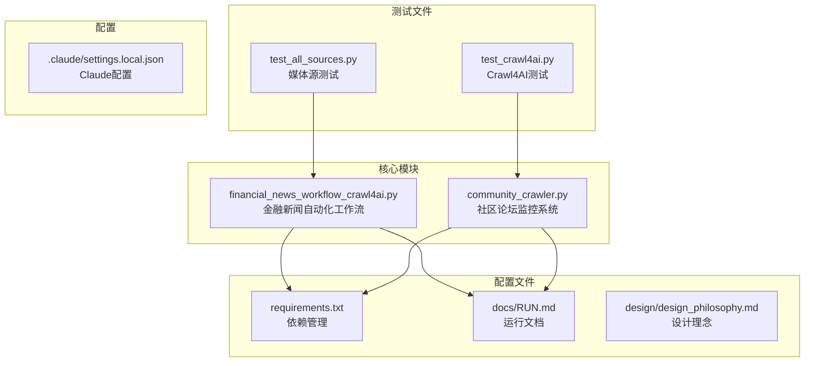
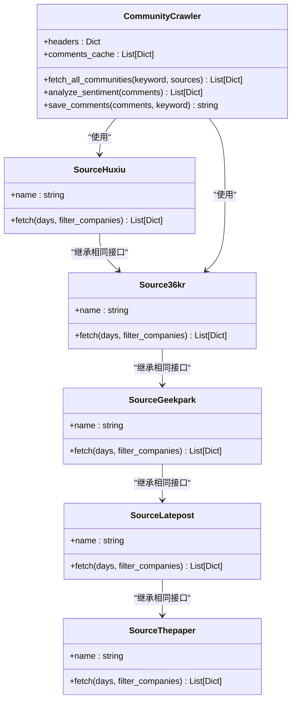
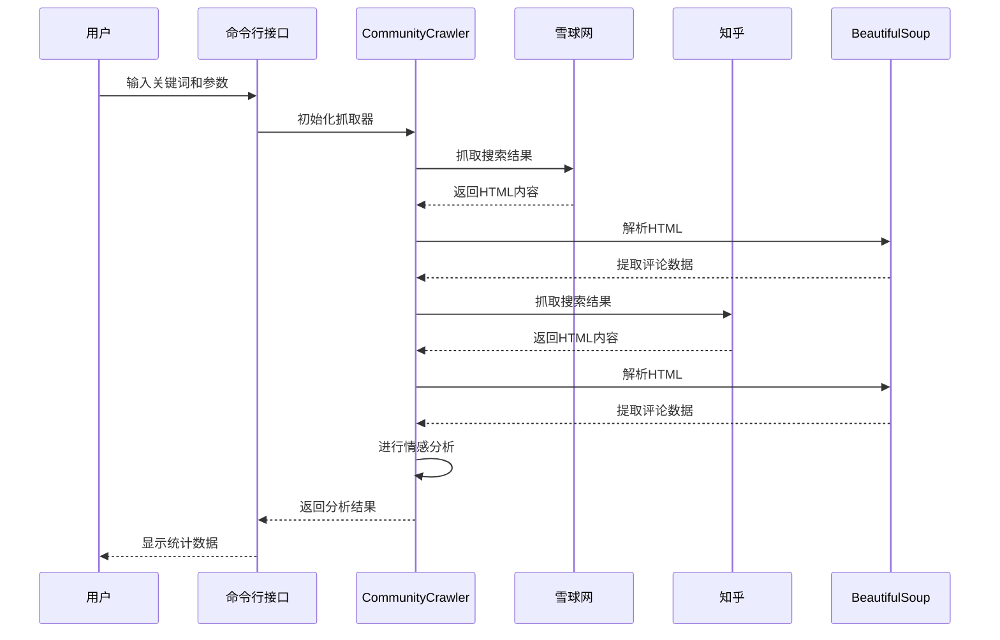
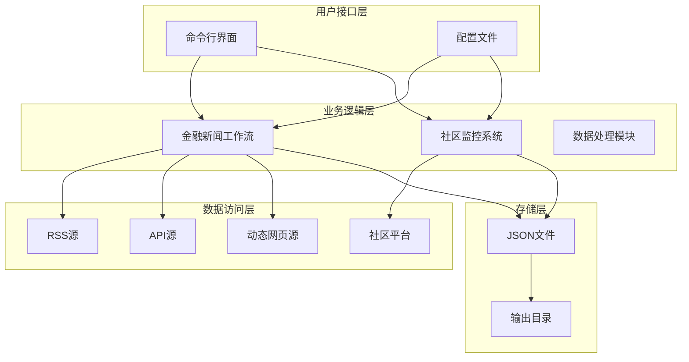
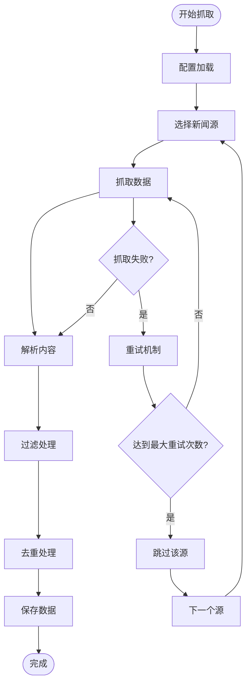
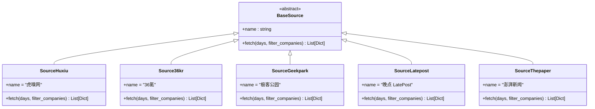
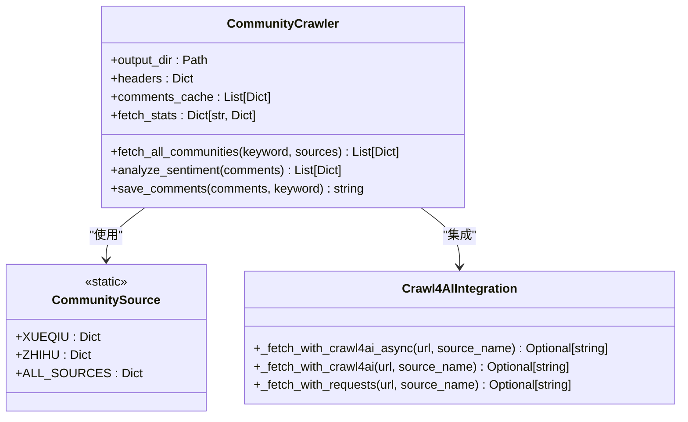
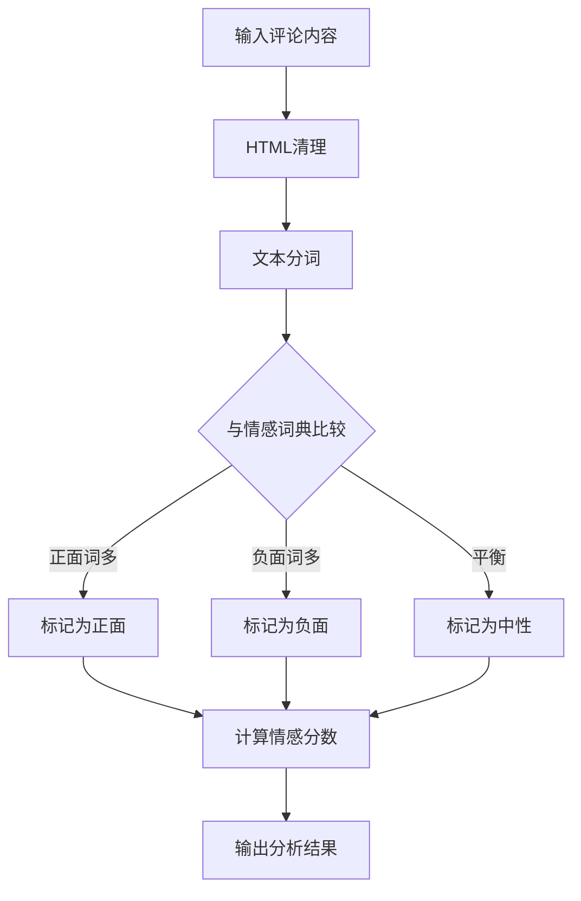
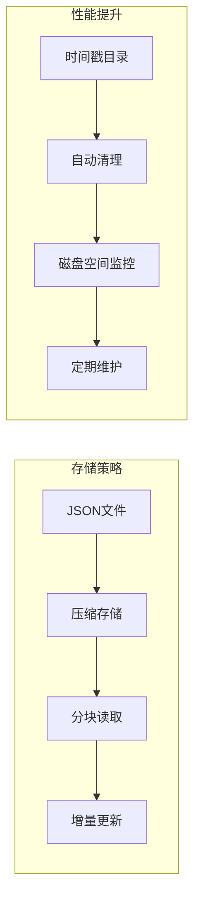
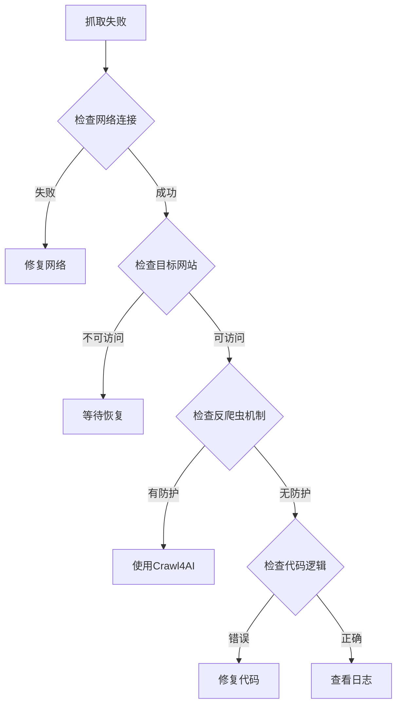

# 核心模块

<cite>
**本文引用的文件**
- [financial_news_workflow_crawl4ai.py](file://financial_news_workflow_crawl4ai.py)
- [community_crawler.py](file://community_crawler.py)
- [requirements.txt](file://requirements.txt)
- [test_all_sources.py](file://test_all_sources.py)
- [test_crawl4ai.py](file://test_crawl4ai.py)
- [docs/RUN.md](file://docs/RUN.md)
- [design/design_philosophy.md](file://design/design_philosophy.md)
- [.claude/settings.local.json](file://.claude/settings.local.json)
</cite>

## 目录
1. [简介](#简介)
2. [项目结构](#项目结构)
3. [核心组件](#核心组件)
4. [架构概览](#架构概览)
5. [详细组件分析](#详细组件分析)
6. [依赖分析](#依赖分析)
7. [性能考虑](#性能考虑)
8. [故障排除指南](#故障排除指南)
9. [结论](#结论)
10. [附录](#附录)

## 简介

Redbook项目是一个专业的金融新闻自动化工作流系统，专注于为中国市场提供高质量的财经内容创作支持。该系统通过两个核心模块实现了完整的新闻采集和社区监控功能：

- **金融新闻自动化工作流**：从7大权威财经媒体抓取热点新闻，支持RSS、API和动态网页抓取
- **社区论坛监控系统**：监控雪球、知乎等社区论坛的用户讨论，进行情感分析和舆情监控

该项目采用模块化设计，支持灵活的配置和扩展，为内容创作者提供了从数据采集到内容生成的完整解决方案。

## 项目结构

项目采用清晰的模块化组织结构，主要包含以下核心文件：



**图表来源**
- [financial_news_workflow_crawl4ai.py:1-454](file://financial_news_workflow_crawl4ai.py#L1-L454)
- [community_crawler.py:1-604](file://community_crawler.py#L1-L604)
- [requirements.txt:1-144](file://requirements.txt#L1-L144)

**章节来源**
- [financial_news_workflow_crawl4ai.py:1-50](file://financial_news_workflow_crawl4ai.py#L1-L50)
- [community_crawler.py:1-20](file://community_crawler.py#L1-L20)
- [requirements.txt:1-20](file://requirements.txt#L1-L20)

## 核心组件

### 金融新闻自动化工作流

金融新闻自动化工作流是项目的核心组件，负责从多个权威财经媒体抓取新闻内容。该系统支持7种不同的新闻源，每种都有其独特的抓取策略和技术要求。

#### 主要特性
- **多源支持**：支持RSS、API和动态网页抓取
- **智能过滤**：基于公司名的新闻筛选功能
- **去重处理**：自动去除重复的新闻条目
- **灵活配置**：支持自定义抓取时间和来源

#### 技术架构


**图表来源**
- [financial_news_workflow_crawl4ai.py:94-358](file://financial_news_workflow_crawl4ai.py#L94-L358)
- [community_crawler.py:82-496](file://community_crawler.py#L82-L496)

**章节来源**
- [financial_news_workflow_crawl4ai.py:94-358](file://financial_news_workflow_crawl4ai.py#L94-L358)
- [financial_news_workflow_crawl4ai.py:363-454](file://financial_news_workflow_crawl4ai.py#L363-L454)

### 社区论坛监控系统

社区论坛监控系统专注于从雪球、知乎等平台抓取用户评论和讨论，提供情感分析和舆情监控功能。

#### 核心功能
- **多平台支持**：支持雪球网和知乎的评论抓取
- **智能解析**：使用BeautifulSoup解析HTML内容
- **情感分析**：基于关键词的简单情感分析
- **数据统计**：按来源和情感分组统计分析

#### 技术实现


**图表来源**
- [community_crawler.py:413-496](file://community_crawler.py#L413-L496)

**章节来源**
- [community_crawler.py:82-496](file://community_crawler.py#L82-L496)

## 架构概览

### 整体架构设计

项目采用分层架构设计，将功能划分为清晰的层次：



**图表来源**
- [financial_news_workflow_crawl4ai.py:405-454](file://financial_news_workflow_crawl4ai.py#L405-L454)
- [community_crawler.py:501-604](file://community_crawler.py#L501-L604)

### 数据流架构



**图表来源**
- [financial_news_workflow_crawl4ai.py:363-454](file://financial_news_workflow_crawl4ai.py#L363-L454)

## 详细组件分析

### 金融新闻工作流组件

#### 新闻源抽象层

每个新闻源都实现了统一的接口，确保系统的可扩展性：



**图表来源**
- [financial_news_workflow_crawl4ai.py:94-358](file://financial_news_workflow_crawl4ai.py#L94-L358)

#### 抓取策略实现

系统针对不同类型的新闻源采用了相应的抓取策略：

| 新闻源类型 | 抓取方式 | 技术栈 | 特点 |
|-----------|----------|--------|------|
| RSS源 | feedparser | feedparser | 轻量、稳定、适合静态内容 |
| API源 | requests | requests | 结构化数据、实时性强 |
| 动态网页 | Playwright | playwright.sync_api | 处理JavaScript渲染内容 |
| 混合源 | requests + BeautifulSoup | requests + bs4 | 传统HTML解析 |

**章节来源**
- [financial_news_workflow_crawl4ai.py:94-358](file://financial_news_workflow_crawl4ai.py#L94-L358)

### 社区监控系统组件

#### 社区平台抽象层



**图表来源**
- [community_crawler.py:56-176](file://community_crawler.py#L56-L176)
- [community_crawler.py:82-496](file://community_crawler.py#L82-L496)

#### 情感分析算法

系统实现了简单而有效的情感分析算法：



**图表来源**
- [community_crawler.py:444-465](file://community_crawler.py#L444-L465)

**章节来源**
- [community_crawler.py:82-496](file://community_crawler.py#L82-L496)

## 依赖分析

### 核心依赖关系

项目采用模块化的依赖管理策略，将依赖分为不同的类别：

```mermaid
graph TB
subgraph "核心依赖"
A[requests>=2.31.0<br/>网络请求]
B[feedparser>=6.0.10<br/>RSS解析]
C[beautifulsoup4>=4.12.0<br/>HTML解析]
end
subgraph "增强爬虫"
D[playwright>=1.40.0<br/>浏览器自动化]
E[crawl4ai>=0.8.0<br/>AI驱动爬虫]
F[scrapling[fetchers]>=0.4.0<br/>反爬虫]
end
subgraph "数据处理"
G[orjson>=3.11.0<br/>JSON加速]
H[w3lib>=2.4.0<br/>数据清洗]
end
subgraph "AI/ML支持"
I[numpy>=1.26.0<br/>数值计算]
J[openai>=1.0.0<br/>大模型调用]
K[scikit-learn>=1.3.0<br/>机器学习]
end
A --> D
C --> E
F --> G
H --> I
I --> J
J --> K
```

**图表来源**
- [requirements.txt:1-144](file://requirements.txt#L1-L144)

### 依赖版本兼容性

系统对Python版本有明确的要求：

- **最低版本**：Python 3.8
- **推荐版本**：Python 3.9+
- **兼容性**：支持Windows 10/11和Linux系统

**章节来源**
- [requirements.txt:1-144](file://requirements.txt#L1-L144)
- [docs/RUN.md:19-25](file://docs/RUN.md#L19-L25)

## 性能考虑

### 抓取性能优化

系统在设计时充分考虑了性能优化：

#### 并发处理
- **异步抓取**：社区监控系统使用asyncio实现并发抓取
- **批量处理**：金融新闻工作流支持批量处理多个新闻源
- **资源限制**：合理的超时设置和重试机制

#### 内存管理
- **流式处理**：大型文件采用流式读取方式
- **缓存机制**：评论数据缓存减少重复抓取
- **垃圾回收**：及时释放不再使用的资源

#### 网络优化
- **连接复用**：使用持久连接减少握手开销
- **压缩传输**：支持gzip压缩提高传输效率
- **智能重试**：指数退避重试策略

### 存储优化



**章节来源**
- [financial_news_workflow_crawl4ai.py:384-402](file://financial_news_workflow_crawl4ai.py#L384-L402)
- [community_crawler.py:85-89](file://community_crawler.py#L85-L89)

## 故障排除指南

### 常见问题及解决方案

#### 依赖安装问题

| 问题类型 | 症状 | 解决方案 |
|---------|------|----------|
| 依赖缺失 | ImportError错误 | 运行 `pip install -r requirements.txt` |
| 版本冲突 | 兼容性错误 | 使用虚拟环境隔离依赖 |
| 网络问题 | 下载失败 | 更换镜像源或离线安装 |

#### 抓取失败问题



#### 性能问题

| 问题 | 诊断方法 | 解决方案 |
|------|----------|----------|
| 抓取缓慢 | 监控网络和CPU使用率 | 减少并发数量 |
| 内存泄漏 | 检查对象生命周期 | 优化资源管理 |
| 超时错误 | 查看超时设置 | 调整超时参数 |

**章节来源**
- [docs/RUN.md:144-189](file://docs/RUN.md#L144-L189)

### 调试技巧

#### 日志分析
- **详细日志**：系统提供详细的执行日志
- **错误追踪**：完整的异常堆栈信息
- **性能监控**：执行时间统计和资源使用情况

#### 测试验证
- **单元测试**：独立测试每个新闻源
- **集成测试**：测试完整工作流程
- **回归测试**：验证功能变更不影响现有功能

**章节来源**
- [test_all_sources.py:18-48](file://test_all_sources.py#L18-L48)
- [test_crawl4ai.py:29-146](file://test_crawl4ai.py#L29-L146)

## 结论

Redbook项目通过精心设计的架构和实现，为金融内容创作提供了完整的自动化解决方案。系统的主要优势包括：

### 技术优势
- **模块化设计**：清晰的组件分离便于维护和扩展
- **多源支持**：灵活的新闻源适配机制
- **智能处理**：自动化的数据清洗和去重
- **性能优化**：高效的并发处理和资源管理

### 实用价值
- **降低门槛**：简化了复杂的新闻采集流程
- **提高效率**：自动化处理减少了人工干预
- **保证质量**：标准化的数据处理确保内容质量
- **扩展性强**：易于添加新的新闻源和功能

### 发展方向
随着AI技术的发展，系统还有很大的优化空间：
- **智能内容分析**：集成更先进的自然语言处理技术
- **个性化推荐**：基于用户偏好的内容推荐系统
- **实时监控**：建立更完善的实时新闻监控机制
- **多模态内容**：支持图片、视频等多媒体内容的分析

该项目为内容创作者提供了一个强大而实用的工具，通过自动化的方式提高了内容生产的效率和质量。

## 附录

### 配置选项说明

#### 金融新闻工作流参数

| 参数 | 类型 | 默认值 | 描述 |
|------|------|--------|------|
| `--days` | int | 3 | 抓取近X天的新闻 |
| `--sources` | string | "all" | 新闻来源，逗号分隔 |
| `--output` | string | "." | 输出基础目录 |
| `--filter-companies` | flag | False | 是否启用公司名过滤 |

#### 社区监控系统参数

| 参数 | 类型 | 默认值 | 描述 |
|------|------|--------|------|
| `--keyword` | string | 必填 | 搜索关键词 |
| `--sources` | string | "all" | 社区来源，逗号分隔 |
| `--output` | string | "." | 输出基础目录 |

### 最佳实践建议

#### 开发最佳实践
- **错误处理**：为所有网络请求添加适当的异常处理
- **资源管理**：确保所有打开的文件和网络连接都能正确关闭
- **日志记录**：提供详细的日志信息便于调试和监控
- **配置管理**：使用配置文件管理可变参数

#### 运维最佳实践
- **监控告警**：建立系统健康状态监控
- **备份策略**：定期备份重要的抓取数据
- **性能监控**：持续监控系统性能指标
- **安全防护**：实施必要的网络安全措施

#### 使用最佳实践
- **合理配置**：根据实际需求调整抓取频率和范围
- **数据验证**：定期检查抓取数据的质量和完整性
- **合规使用**：遵守相关法律法规和网站服务条款
- **持续优化**：根据使用反馈不断改进系统功能