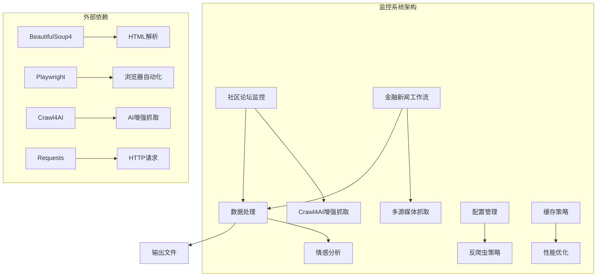
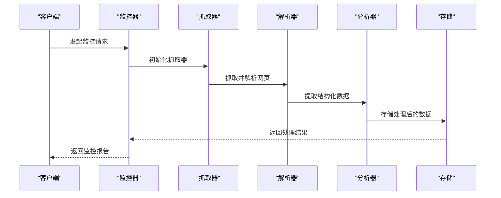
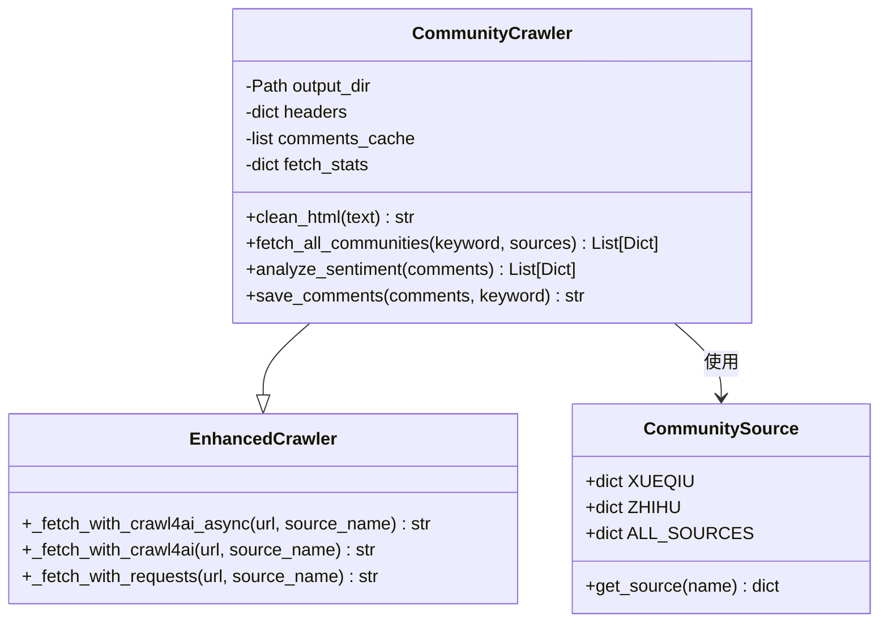
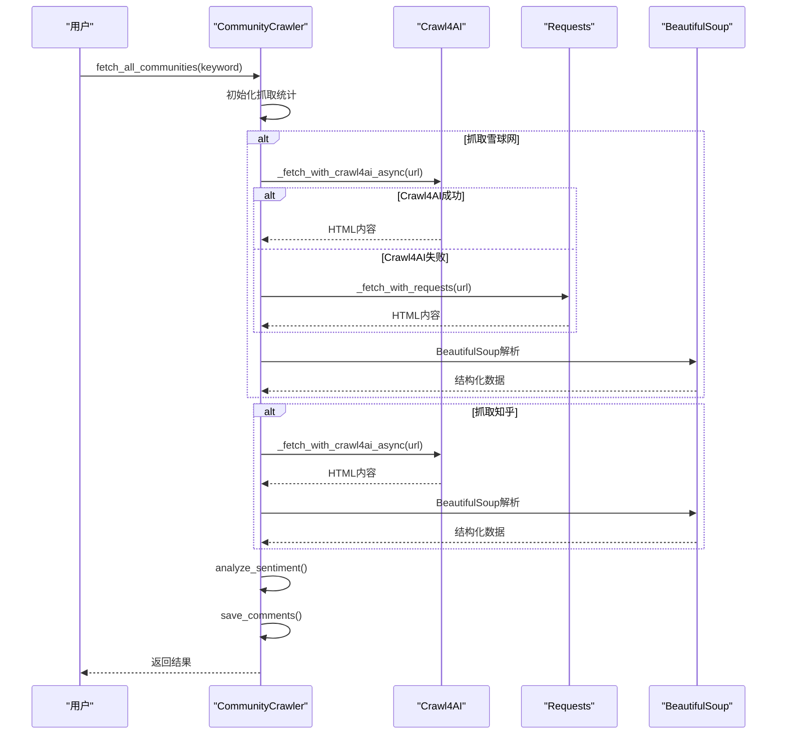
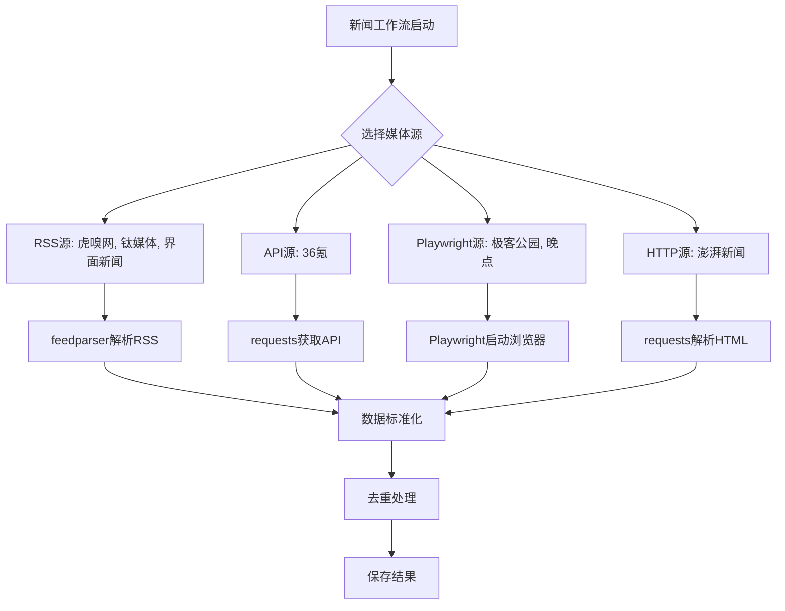
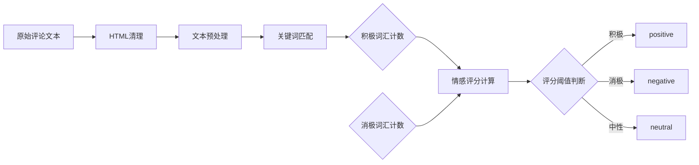
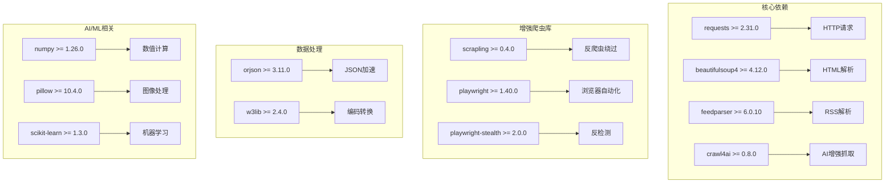
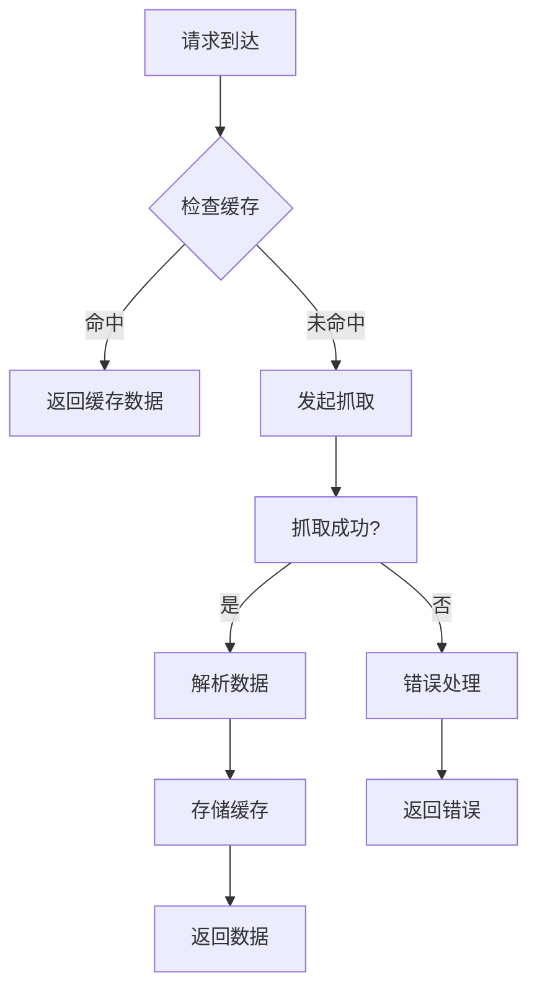
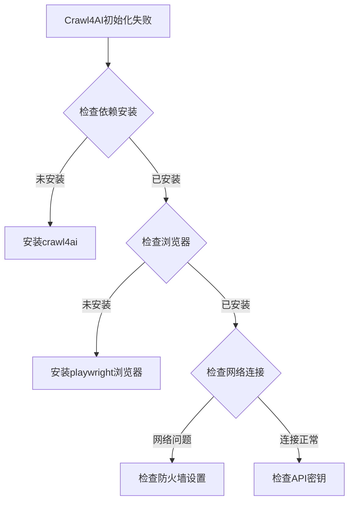

# 社区论坛监控系统

<cite>
**本文引用的文件**
- [community_crawler.py](file://community_crawler.py)
- [financial_news_workflow_crawl4ai.py](file://financial_news_workflow_crawl4ai.py)
- [requirements.txt](file://requirements.txt)
- [test_all_sources.py](file://test_all_sources.py)
- [test_crawl4ai.py](file://test_crawl4ai.py)
- [news_output_crawl4ai_20260325_164854/news_result.json](file://news_output_crawl4ai_20260325_164854/news_result.json)
- [docs/RUN.md](file://docs/RUN.md)
- [design/design_philosophy.md](file://design/design_philosophy.md)
</cite>

## 目录
1. [简介](#简介)
2. [项目结构](#项目结构)
3. [核心组件](#核心组件)
4. [架构概览](#架构概览)
5. [详细组件分析](#详细组件分析)
6. [依赖关系分析](#依赖关系分析)
7. [性能考量](#性能考量)
8. [故障排除指南](#故障排除指南)
9. [结论](#结论)
10. [附录](#附录)

## 简介
本项目是一个社区论坛监控系统，专注于雪球网和知乎等中文社区平台的实时监控与舆情分析。系统采用Crawl4AI增强抓取技术，结合异步架构、反爬虫策略应对、数据去重与清洗机制，提供完整的社区监控解决方案。系统支持情感分析、实时数据监控流程，并提供详细的监控配置示例、API接口说明和输出数据格式。

**更新** 新增了专门的社区论坛监控模块，支持雪球网和知乎的异步抓取和情感分析功能。

## 项目结构
该项目采用模块化设计，主要包含以下核心模块：
- 社区论坛监控模块：负责雪球网和知乎的抓取与分析
- 金融新闻工作流模块：负责7大权威媒体的自动化抓取
- Crawl4AI增强抓取模块：提供AI驱动的网页抓取能力
- 数据处理与存储模块：负责数据清洗、去重和持久化
- 测试与验证模块：提供完整的功能测试和性能验证



**图表来源**
- [community_crawler.py:1-604](file://community_crawler.py#L1-L604)
- [financial_news_workflow_crawl4ai.py:1-454](file://financial_news_workflow_crawl4ai.py#L1-L454)

**章节来源**
- [community_crawler.py:1-604](file://community_crawler.py#L1-L604)
- [financial_news_workflow_crawl4ai.py:1-454](file://financial_news_workflow_crawl4ai.py#L1-L454)

## 核心组件
系统包含以下核心组件：

### 社区论坛监控器
- **CommunityCrawler类**：主抓取器，支持雪球网和知乎的异步抓取
- **CommunitySource类**：社区配置管理，定义各平台的访问参数
- **增强抓取策略**：支持Crawl4AI和传统HTTP两种抓取模式

### 金融新闻工作流
- **多源媒体支持**：7大权威媒体的自动化抓取
- **差异化抓取策略**：RSS、API、Playwright、requests等不同技术栈
- **智能去重机制**：基于标题的去重算法

### 数据处理与分析
- **情感分析模块**：基于关键词的简单情感分析
- **数据清洗工具**：HTML标签清理、特殊字符处理
- **输出格式标准化**：统一的JSON输出格式

**章节来源**
- [community_crawler.py:82-436](file://community_crawler.py#L82-L436)
- [financial_news_workflow_crawl4ai.py:94-382](file://financial_news_workflow_crawl4ai.py#L94-L382)

## 架构概览
系统采用分层架构设计，包含以下层次：



**图表来源**
- [community_crawler.py:501-599](file://community_crawler.py#L501-L599)
- [financial_news_workflow_crawl4ai.py:405-453](file://financial_news_workflow_crawl4ai.py#L405-L453)

系统架构特点：
- **异步并发**：支持多平台并行抓取
- **可扩展性**：模块化设计，易于添加新平台
- **容错机制**：多层异常处理和降级策略
- **缓存优化**：智能缓存减少重复抓取

## 详细组件分析

### 社区论坛监控器组件分析

#### 类关系图


**图表来源**
- [community_crawler.py:56-103](file://community_crawler.py#L56-L103)
- [community_crawler.py:82-176](file://community_crawler.py#L82-L176)

#### 抓取流程序列图


**图表来源**
- [community_crawler.py:197-436](file://community_crawler.py#L197-L436)

**章节来源**
- [community_crawler.py:82-436](file://community_crawler.py#L82-L436)

### 金融新闻工作流组件分析

#### 多媒体抓取架构


**图表来源**
- [financial_news_workflow_crawl4ai.py:94-382](file://financial_news_workflow_crawl4ai.py#L94-L382)

#### 媒体源分类与策略
系统支持7大权威媒体，采用差异化抓取策略：

| 媒体名称 | 抓取方式 | 依赖库 | 特点 |
|---------|---------|--------|------|
| 虎嗅网 | RSS | feedparser | 实时性强，数据量大 |
| 36氪 | API | requests | 结构化数据，稳定性好 |
| 钛媒体 | RSS | feedparser | 传统媒体，覆盖面广 |
| 界面新闻 | RSS | feedparser | 财经类专业媒体 |
| 极客公园 | Playwright | playwright | 动态加载，反爬虫复杂 |
| 晚点 | Playwright | playwright | 新媒体，内容质量高 |
| 澎湃新闻 | HTTP | requests | 传统新闻，解析简单 |

**章节来源**
- [financial_news_workflow_crawl4ai.py:94-382](file://financial_news_workflow_crawl4ai.py#L94-L382)

### 数据处理与分析组件

#### 情感分析算法
系统采用基于关键词的情感分析算法：



**图表来源**
- [community_crawler.py:444-465](file://community_crawler.py#L444-L465)

情感分析关键词库：
- **积极词汇**：好、棒、优秀、满意、喜欢、赞、强、牛、厉害、出色
- **消极词汇**：差、糟糕、失望、讨厌、差、弱、垃圾、烂、坑、差

**章节来源**
- [community_crawler.py:444-465](file://community_crawler.py#L444-L465)

## 依赖关系分析

### 核心依赖关系


**图表来源**
- [requirements.txt:6-144](file://requirements.txt#L6-L144)

### 外部接口依赖
系统对外部接口的依赖主要包括：

1. **社区平台API**
   - 雪球网搜索接口：`https://xueqiu.com/k?q={keyword}`
   - 知乎搜索接口：`https://www.zhihu.com/search?type=content&q={keyword}`

2. **媒体RSS接口**
   - 虎嗅网：`https://www.huxiu.com/rss/0.xml`
   - 钛媒体：`https://www.tmtpost.com/rss.xml`
   - 界面新闻：`https://a.jiemian.com/index.php?m=article&a=rss`

3. **第三方API**
   - 36氪新闻闪报：`https://36kr.com/api/newsflash`

**章节来源**
- [requirements.txt:6-144](file://requirements.txt#L6-L144)

## 性能考量

### 异步抓取架构
系统采用异步编程模型，通过以下机制提升性能：

1. **并发抓取**：支持多平台并行抓取，减少总等待时间
2. **智能超时控制**：不同平台设置合理的超时时间
3. **连接池管理**：复用HTTP连接，减少握手开销
4. **渐进式重试**：失败时自动重试，提高成功率

### 缓存策略


**图表来源**
- [community_crawler.py:127-176](file://community_crawler.py#L127-L176)

### 性能优化建议
1. **连接复用**：使用会话对象复用连接
2. **请求合并**：对相似请求进行合并
3. **数据压缩**：启用GZIP压缩减少传输
4. **CDN加速**：对静态资源使用CDN
5. **负载均衡**：多实例部署分散请求

## 故障排除指南

### 常见问题诊断

#### Crawl4AI相关问题


**图表来源**
- [test_crawl4ai.py:15-22](file://test_crawl4ai.py#L15-L22)

#### 社区平台访问问题
1. **雪球网访问失败**
   - 检查网络连接和代理设置
   - 验证User-Agent是否被屏蔽
   - 确认搜索关键词格式正确

2. **知乎访问异常**
   - 检查登录状态和Cookie
   - 验证搜索参数编码
   - 确认反爬虫策略应对

#### 数据解析问题
1. **HTML解析失败**
   - 检查BeautifulSoup安装
   - 验证HTML结构变化
   - 确认选择器有效性

2. **情感分析异常**
   - 检查关键词库完整性
   - 验证文本预处理
   - 确认编码格式

**章节来源**
- [test_crawl4ai.py:15-163](file://test_crawl4ai.py#L15-L163)

### 监控配置示例

#### 基础监控配置
```yaml
# 基础配置示例
monitoring:
  sources:
    - name: xueqiu
      enabled: true
      delay: 1
    - name: zhihu
      enabled: true
      delay: 1
  
  crawler:
    timeout: 30
    max_retries: 3
    retry_delay: 5
    
  analysis:
    sentiment_enabled: true
    keywords:
      positive: ["好", "棒", "优秀", "满意"]
      negative: ["差", "糟糕", "失望", "讨厌"]
  
  storage:
    output_dir: "./community_output"
    format: "json"
    compress: true
```

#### 高级配置示例
```yaml
# 高级配置示例
advanced_monitoring:
  scheduling:
    interval: 3600  # 每小时
    timezone: "Asia/Shanghai"
    
  rate_limiting:
    requests_per_minute: 60
    burst_limit: 10
    
  proxy:
    enabled: false
    servers: []
    
  logging:
    level: "INFO"
    file: "./logs/monitoring.log"
    
  alerts:
    enabled: true
    webhook: "https://hooks.slack.com/services/YOUR/SLACK/WEBHOOK"
```

## 结论
本社区论坛监控系统提供了完整的中文社区监控解决方案，具有以下优势：

1. **技术先进性**：采用Crawl4AI增强抓取技术，有效应对现代反爬虫策略
2. **架构灵活性**：模块化设计支持多平台扩展和自定义配置
3. **数据质量保证**：完善的去重、清洗和分析机制确保数据准确性
4. **性能优化**：异步架构和缓存策略提升系统响应速度
5. **合规性考虑**：提供详细的使用指南和最佳实践

系统适用于企业舆情监控、市场研究、竞品分析等多种应用场景，为用户提供实时、准确的社区数据洞察。

## 附录

### API接口说明

#### 社区监控API
```
POST /api/monitor/community
Content-Type: application/json

{
  "keyword": "小米汽车",
  "sources": ["xueqiu", "zhihu"],
  "output_dir": "./output"
}

Response:
{
  "status": "success",
  "count": 42,
  "file": "comments_小米汽车.json",
  "timestamp": "2026-03-25T14:30:00Z"
}
```

#### 新闻抓取API
```
GET /api/news/fetch
Query Params:
- days: 3
- sources: all
- filter_companies: false

Response:
{
  "total": 15,
  "by_source": {
    "虎嗅网": 3,
    "钛媒体": 2,
    "界面新闻": 3
  },
  "news": [...]
}
```

### 输出数据格式

#### 社区评论数据格式
```json
{
  "fetch_time": "2026-03-25T14:30:00Z",
  "keyword": "小米汽车",
  "total_count": 42,
  "by_source": {
    "雪球网": 25,
    "知乎": 17
  },
  "by_sentiment": {
    "positive": 20,
    "neutral": 15,
    "negative": 7
  },
  "fetch_stats": {
    "xueqiu": {
      "status": "success",
      "count": 25
    },
    "zhihu": {
      "status": "success",
      "count": 17
    }
  },
  "comments": [
    {
      "source": "雪球网",
      "keyword": "小米汽车",
      "title": "小米汽车SU7发布",
      "content": "小米汽车SU7发布...",
      "link": "https://xueqiu.com/...",
      "author": "用户123",
      "time": "2026-03-25T10:00:00Z",
      "like_count": "150",
      "comment_count": "23",
      "sentiment": "positive",
      "sentiment_score": 2,
      "fetched_at": "2026-03-25T14:30:00Z"
    }
  ]
}
```

#### 新闻数据格式
```json
{
  "fetch_time": "2026-03-25T14:30:00Z",
  "date_range": "2026-03-15 至 2026-03-25",
  "days": 10,
  "total_count": 15,
  "by_source": {
    "虎嗅网": 3,
    "钛媒体": 2,
    "界面新闻": 3
  },
  "by_company": {
    "小米": 4,
    "吉利": 1
  },
  "fetch_stats": {
    "huxiu": {
      "status": "success",
      "count": 3
    }
  },
  "news": [
    {
      "source": "虎嗅网",
      "title": "小米新SU7发布",
      "company": "小米",
      "link": "http://www.huxiu.com/...",
      "summary": "小米新SU7发布...",
      "published": "2026-03-24T14:05:39+08:00",
      "content": "全文内容...",
      "relevance": 9
    }
  ]
}
```

### 最佳实践

#### 社区监控最佳实践
1. **关键词策略**
   - 使用精确关键词避免无关内容
   - 定期更新关键词库
   - 考虑同义词和变体

2. **抓取频率控制**
   - 设置合理的抓取间隔
   - 避免对目标网站造成压力
   - 监控平台限制和反爬虫机制

3. **数据质量保证**
   - 实施多层数据清洗
   - 建立数据验证机制
   - 定期审计数据准确性

#### 合规注意事项
1. **法律法规遵守**
   - 遵守《网络安全法》和《个人信息保护法》
   - 尊重平台服务条款
   - 避免侵犯版权和隐私权

2. **数据使用规范**
   - 明确数据使用目的和范围
   - 建立数据安全保护机制
   - 提供数据删除和更正机制

3. **透明度要求**
   - 向用户披露数据收集和使用情况
   - 提供用户控制和选择权
   - 建立投诉处理机制

### 运行示例

#### 社区论坛抓取运行示例
```bash
# 基本用法
python community_crawler.py --keyword "小米汽车" --sources all

# 只抓取雪球的评论
python community_crawler.py --keyword "华为" --sources xueqiu

# 指定输出目录
python community_crawler.py --keyword "腾讯" --sources zhihu --output ./community_output
```

**章节来源**
- [docs/RUN.md:85-112](file://docs/RUN.md#L85-L112)
- [community_crawler.py:501-599](file://community_crawler.py#L501-L599)