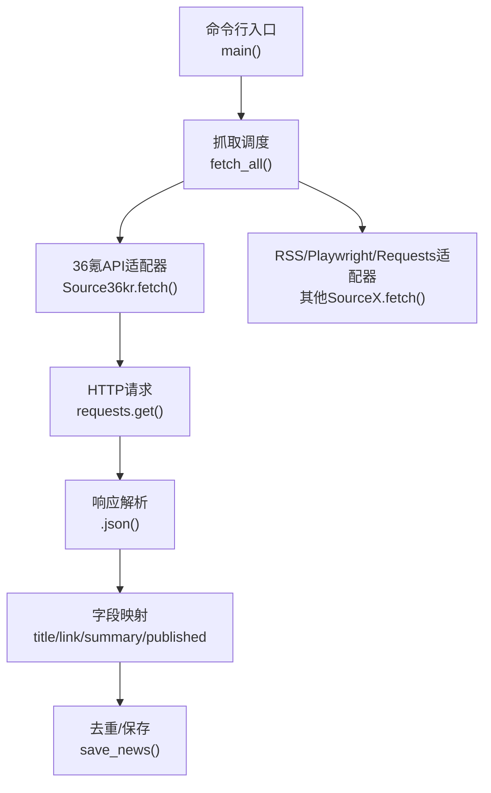
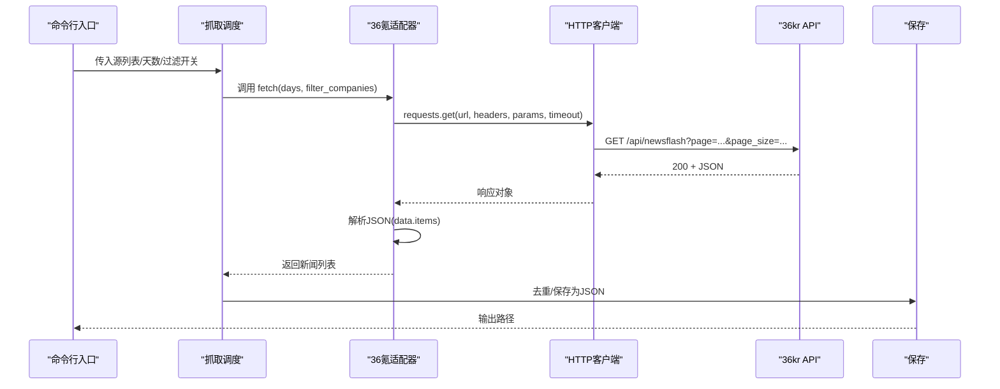
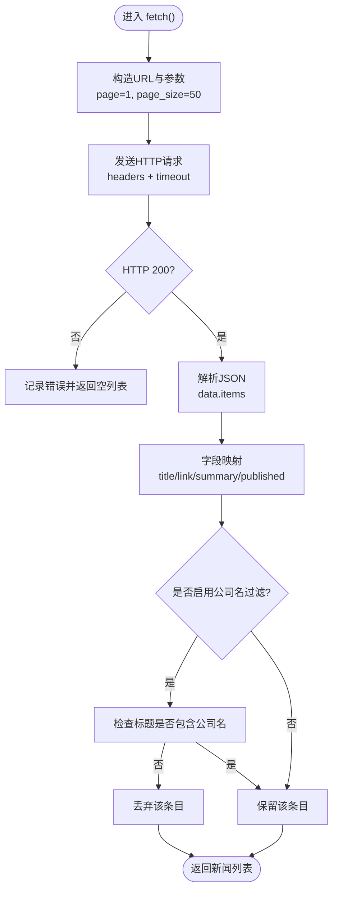
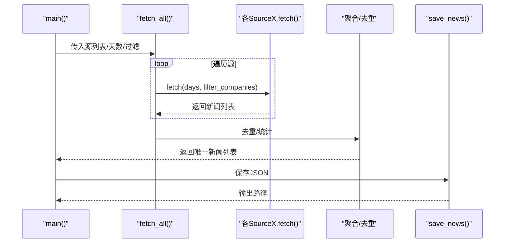
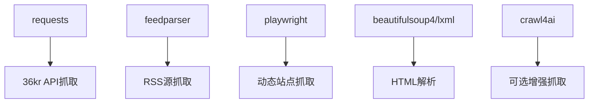

# API媒体源抓取

<cite>
**本文引用的文件**   
- [financial_news_workflow_crawl4ai.py](file://financial_news_workflow_crawl4ai.py)
- [test_all_sources.py](file://test_all_sources.py)
- [requirements.txt](file://requirements.txt)
- [news_output_20260324_171659/news_result.json](file://news_output_20260324_171659/news_result.json)
- [news_output_20260324_172637/news_result.json](file://news_output_20260324_172637/news_result.json)
</cite>

## 目录
1. [简介](#简介)
2. [项目结构](#项目结构)
3. [核心组件](#核心组件)
4. [架构总览](#架构总览)
5. [详细组件分析](#详细组件分析)
6. [依赖分析](#依赖分析)
7. [性能考虑](#性能考虑)
8. [故障排查指南](#故障排查指南)
9. [结论](#结论)
10. [附录](#附录)

## 简介
本文件面向“API媒体源抓取”主题，聚焦于36氪API源的抓取实现。文档系统性阐述API端点配置、HTTP请求构建、响应数据解析与JSON格式处理，详述API认证机制、请求参数(page/page_size)、响应状态码处理与数据字段映射，并对比API抓取相较RSS与网页抓取的优势与限制，结合金融新闻自动化应用场景给出实践建议与优化策略。

## 项目结构
围绕金融新闻自动化工作流，仓库提供了统一的抓取框架与多源适配器，其中36氪采用API直取方式，其他媒体采用RSS或浏览器自动化/普通HTTP抓取。抓取流程由命令行入口驱动，最终汇总为结构化JSON输出。

图表来源
- [financial_news_workflow_crawl4ai.py:363-454](file://financial_news_workflow_crawl4ai.py#L363-L454)
- [financial_news_workflow_crawl4ai.py:122-155](file://financial_news_workflow_crawl4ai.py#L122-L155)

章节来源
- [financial_news_workflow_crawl4ai.py:1-454](file://financial_news_workflow_crawl4ai.py#L1-454)

## 核心组件
- 36氪API适配器：封装API端点、请求参数、认证策略、响应解析与字段映射。
- 统一抓取调度：根据源列表调用各适配器，聚合结果并去重保存。
- 输出与统计：生成带时间戳的输出目录，保存JSON并统计来源分布与抓取状态。

章节来源
- [financial_news_workflow_crawl4ai.py:122-155](file://financial_news_workflow_crawl4ai.py#L122-L155)
- [financial_news_workflow_crawl4ai.py:363-454](file://financial_news_workflow_crawl4ai.py#L363-L454)

## 架构总览
36氪API抓取在整体工作流中作为“API直取”组件，与其他媒体源并列，通过统一入口进行调度与结果合并。

图表来源
- [financial_news_workflow_crawl4ai.py:122-155](file://financial_news_workflow_crawl4ai.py#L122-L155)
- [financial_news_workflow_crawl4ai.py:363-454](file://financial_news_workflow_crawl4ai.py#L363-L454)

## 详细组件分析

### 36氪API适配器（Source36kr）
- 端点与请求参数
  - 端点：固定为“/api/newsflash”
  - 参数：page（页码，默认1）、page_size（每页条数，默认50）
  - 超时：15秒
  - 请求头：包含User-Agent与Accept
- 认证机制
  - 未检测到显式鉴权头或令牌字段，通常为公开接口
- 响应解析与字段映射
  - 成功条件：HTTP 200
  - JSON结构：顶层包含data对象，data中包含items数组
  - 字段映射：
    - 标题：item.title
    - 链接：拼接为“https://36kr.com/newsflashes/{id}”
    - 摘要：item.description（截断至200字符）
    - 发布时间：item.published_at（转字符串）
- 错误处理
  - 捕获异常并打印错误信息
  - 未抓取到数据时返回空列表

图表来源
- [financial_news_workflow_crawl4ai.py:122-155](file://financial_news_workflow_crawl4ai.py#L122-L155)

章节来源
- [financial_news_workflow_crawl4ai.py:122-155](file://financial_news_workflow_crawl4ai.py#L122-L155)

### 统一抓取调度与保存
- 源映射：将源标识映射到对应适配器类
- 调用链：遍历源列表，依次调用适配器fetch()，聚合结果
- 去重：基于标题去重
- 保存：输出带时间戳目录，保存JSON，包含抓取时间、总数、来源分布、条目列表等

图表来源
- [financial_news_workflow_crawl4ai.py:363-454](file://financial_news_workflow_crawl4ai.py#L363-L454)

章节来源
- [financial_news_workflow_crawl4ai.py:363-454](file://financial_news_workflow_crawl4ai.py#L363-L454)

### 实际输出示例（字段结构）
- 输出包含：抓取时间、条目总数、来源分布、公司分布、抓取统计、新闻列表
- 新闻条目字段：source、title、company（若启用过滤）、link、summary、published

章节来源
- [news_output_20260324_171659/news_result.json:1-44](file://news_output_20260324_171659/news_result.json#L1-L44)
- [news_output_20260324_172637/news_result.json:1-75](file://news_output_20260324_172637/news_result.json#L1-L75)

## 依赖分析
- 核心依赖
  - requests：HTTP请求库
  - feedparser：RSS解析
  - playwright：浏览器自动化（用于动态加载站点）
  - beautifulsoup4/lxml/cssselect：HTML解析
- Crawl4AI：可选增强（非36氪API所必需）

图表来源
- [requirements.txt:1-144](file://requirements.txt#L1-L144)

章节来源
- [requirements.txt:1-144](file://requirements.txt#L1-L144)

## 性能考虑
- 并发与批量
  - 当前实现为串行调用各源fetch()，可引入异步并发以缩短总耗时
- 超时与重试
  - 36氪API请求超时为15秒；可根据网络状况适当放宽
  - 可增加指数退避重试策略，提升稳定性
- 分页与限速
  - page/page_size参数可按需调整；避免频繁请求导致限流
  - 可在不同源间加入最小间隔，降低对上游的压力
- 缓存与去重
  - 已实现基于标题的去重；可扩展为基于URL或指纹的更强去重
- 输出与存储
  - 建议将抓取结果先写入临时文件，再原子性替换，避免中断导致损坏

## 故障排查指南
- 依赖缺失
  - requests未安装：无法进行HTTP请求；安装后重试
  - feedparser/playwright/beautifulsoup4缺失：对应RSS/动态站点/HTML解析功能受限
- 网络与超时
  - 36氪API请求超时或返回非200：检查网络、DNS、代理；必要时增加timeout
- 结构变更
  - 若36kr接口返回结构变化，需更新字段映射逻辑（如data.items）
- 过滤逻辑
  - 公司名过滤依赖内置公司列表；若未命中，可能导致返回为空
- 测试验证
  - 使用test_all_sources.py对各源进行连通性与解析测试，定位异常源

章节来源
- [financial_news_workflow_crawl4ai.py:363-454](file://financial_news_workflow_crawl4ai.py#L363-L454)
- [test_all_sources.py:1-49](file://test_all_sources.py#L1-L49)

## 结论
36氪API抓取在本工作流中以“结构化、稳定、可预测”的方式提供热点新闻数据。其优势在于API直取、字段清晰、响应可控；局限在于需遵循上游接口规范与速率限制。结合RSS与网页抓取，可形成互补的多源融合方案，满足金融新闻自动化对时效性与覆盖面的需求。

## 附录

### API端点与参数对照
- 端点：/api/newsflash
- 参数：
  - page：页码（默认1）
  - page_size：每页条数（默认50）
- 请求头：User-Agent、Accept
- 超时：15秒

章节来源
- [financial_news_workflow_crawl4ai.py:122-155](file://financial_news_workflow_crawl4ai.py#L122-L155)

### 字段映射清单
- 输入JSON字段（来自data.items）：
  - title：标题
  - id：用于拼接详情链接
  - description：摘要（截断至200字符）
  - published_at：发布时间
- 输出字段：
  - source：来源名称
  - title：标题
  - link：详情链接
  - summary：摘要
  - published：发布时间字符串

章节来源
- [financial_news_workflow_crawl4ai.py:122-155](file://financial_news_workflow_crawl4ai.py#L122-L155)

### 与其他抓取方式的对比
- API抓取（36氪）：结构化、稳定、字段明确，适合自动化与二次加工
- RSS抓取（虎嗅/钛媒体/界面）：无需鉴权、解析简单，但字段与结构依赖RSS源
- 网页抓取（极客公园/晚点/澎湃新闻）：灵活性高，但需处理反爬与页面结构变化

章节来源
- [financial_news_workflow_crawl4ai.py:94-359](file://financial_news_workflow_crawl4ai.py#L94-L359)