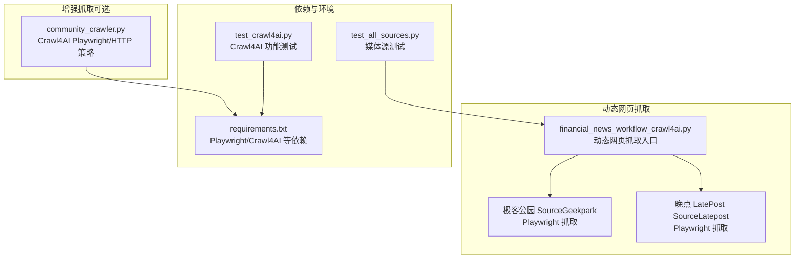
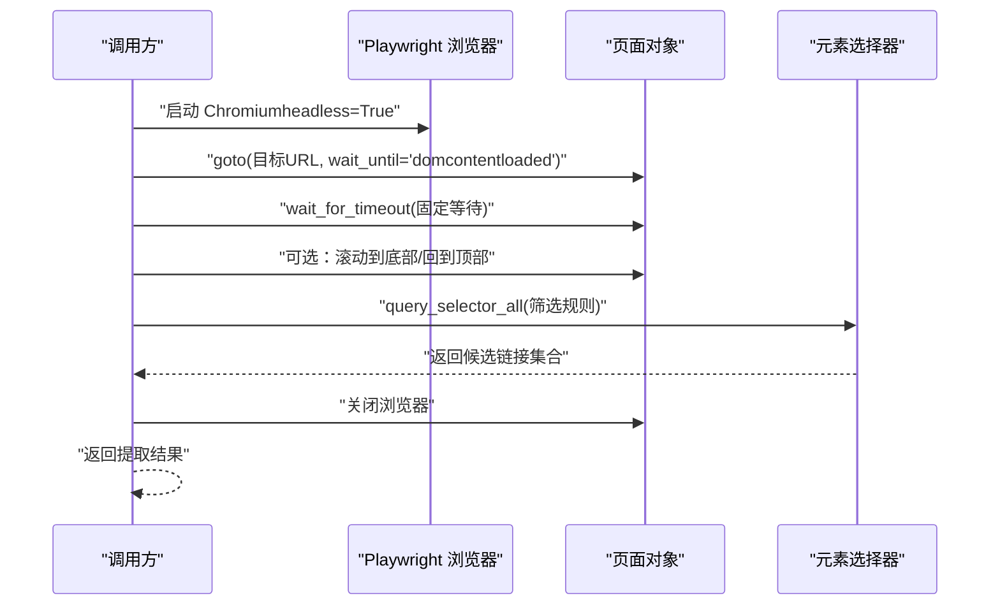
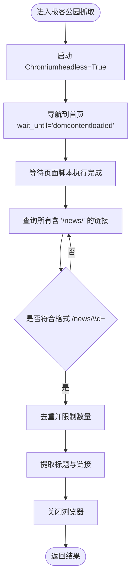
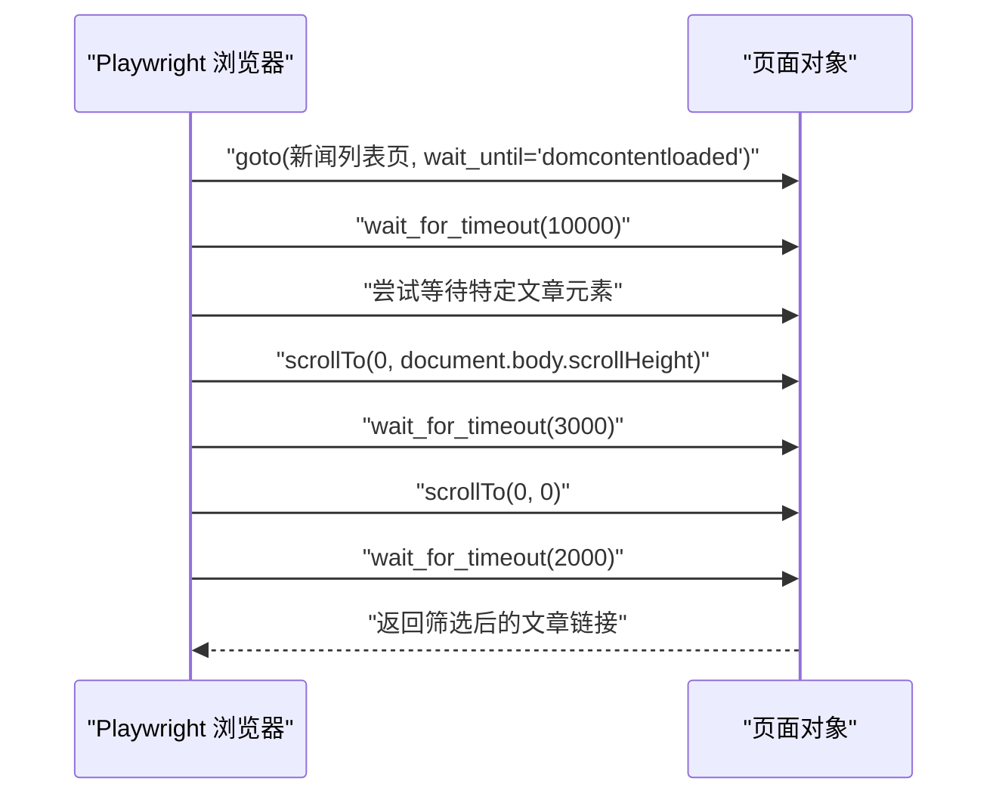
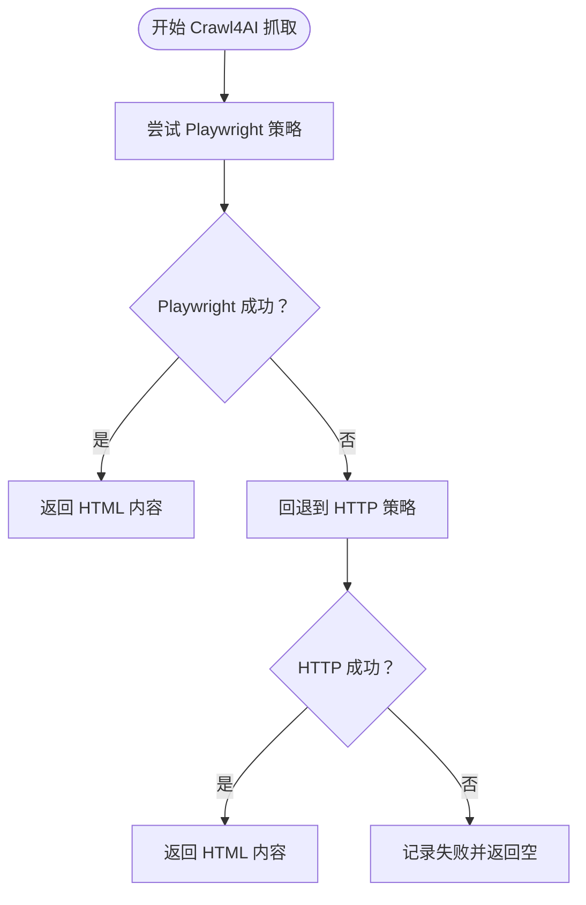
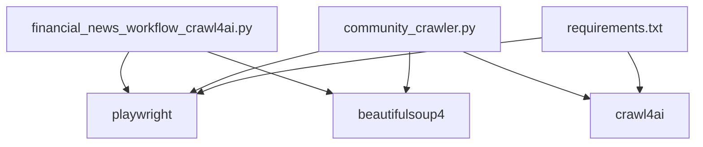

# Playwright动态网页抓取

<cite>
**本文引用的文件**
- [financial_news_workflow_crawl4ai.py](file://financial_news_workflow_crawl4ai.py)
- [community_crawler.py](file://community_crawler.py)
- [requirements.txt](file://requirements.txt)
- [test_all_sources.py](file://test_all_sources.py)
- [test_crawl4ai.py](file://test_crawl4ai.py)
- [news_output_crawl4ai_20260324_103448/news_result.json](file://news_output_crawl4ai_20260324_103448/news_result.json)
- [news_source_test_result.json](file://news_source_test_result.json)
</cite>

## 目录
1. [简介](#简介)
2. [项目结构](#项目结构)
3. [核心组件](#核心组件)
4. [架构总览](#架构总览)
5. [详细组件分析](#详细组件分析)
6. [依赖关系分析](#依赖关系分析)
7. [性能考量](#性能考量)
8. [故障排查指南](#故障排查指南)
9. [结论](#结论)
10. [附录](#附录)

## 简介
本技术文档聚焦于项目中的动态网页抓取能力，重点覆盖以下两个动态网页源的实现与最佳实践：
- 极客公园（Geekpark）：基于 Playwright 的浏览器自动化抓取，解决 JavaScript 渲染与反爬机制。
- 晚点 LatePost：基于 Playwright 的动态内容加载与滚动交互模拟，提取新闻链接。

文档将系统阐述浏览器启动配置、页面导航策略、元素选择器使用、滚动交互模拟、链接提取逻辑，并总结动态网页抓取的技术挑战、解决方案与性能优化策略。同时提供错误处理机制与可操作的配置建议，帮助读者快速上手并稳定运行。

## 项目结构
该项目围绕“金融新闻自动化工作流”展开，包含多个媒体源的抓取实现，其中极客公园与晚点 LatePost 采用 Playwright 实现动态网页抓取；另有社区论坛抓取器，支持 Crawl4AI 的 Playwright 策略与 HTTP 策略双通道。

图表来源
- [financial_news_workflow_crawl4ai.py:1-454](file://financial_news_workflow_crawl4ai.py#L1-L454)
- [community_crawler.py:1-604](file://community_crawler.py#L1-L604)
- [requirements.txt:1-144](file://requirements.txt#L1-L144)
- [test_all_sources.py:1-49](file://test_all_sources.py#L1-L49)
- [test_crawl4ai.py:1-163](file://test_crawl4ai.py#L1-L163)

章节来源
- [financial_news_workflow_crawl4ai.py:1-454](file://financial_news_workflow_crawl4ai.py#L1-L454)
- [community_crawler.py:1-604](file://community_crawler.py#L1-L604)
- [requirements.txt:1-144](file://requirements.txt#L1-L144)
- [test_all_sources.py:1-49](file://test_all_sources.py#L1-L49)
- [test_crawl4ai.py:1-163](file://test_crawl4ai.py#L1-L163)

## 核心组件
- 动态网页抓取工作流：封装了7大媒体源的抓取逻辑，其中极客公园与晚点 LatePost 使用 Playwright。
- Playwright 策略：在社区论坛抓取器中，优先使用 Crawl4AI 的 AsyncPlaywrightCrawlerStrategy，失败时回退至 AsyncHTTPCrawlerStrategy。
- 页面导航与等待：统一采用 wait_until 与显式等待策略，结合滚动交互触发懒加载。
- 元素选择器与链接提取：针对不同站点采用差异化选择器，确保在页面结构变化时仍能稳健提取。
- 错误处理与降级：对 Playwright 失败进行捕获并切换到 HTTP 策略，保障抓取稳定性。

章节来源
- [financial_news_workflow_crawl4ai.py:215-318](file://financial_news_workflow_crawl4ai.py#L215-L318)
- [community_crawler.py:127-175](file://community_crawler.py#L127-L175)
- [community_crawler.py:179-193](file://community_crawler.py#L179-L193)

## 架构总览
动态网页抓取的整体流程如下：初始化 Playwright 浏览器实例，打开目标页面，等待页面资源加载完成，必要时进行滚动交互以触发懒加载，最后提取所需链接并返回结果。

图表来源
- [financial_news_workflow_crawl4ai.py:226-263](file://financial_news_workflow_crawl4ai.py#L226-L263)
- [financial_news_workflow_crawl4ai.py:277-318](file://financial_news_workflow_crawl4ai.py#L277-L318)

## 详细组件分析

### 极客公园（Geekpark）抓取实现
- 页面导航策略
  - 使用同步 Playwright，启动 Chromium 并设置 headless=True。
  - 导航到首页，等待 DOM 内容加载完成，随后进行固定时长的等待以确保脚本执行完毕。
- 元素选择器与链接提取
  - 通过查询所有包含“/news/”路径的链接，限定为 /news/\d+ 格式的新闻详情页。
  - 对重复链接进行去重，最多提取前若干条。
- 反爬虫应对
  - 使用 headless 模式降低被识别概率。
  - 通过固定等待与 DOM 加载策略减少动态渲染带来的不确定性。
- 错误处理
  - 捕获异常并打印错误信息，保证流程继续执行其他媒体源。

图表来源
- [financial_news_workflow_crawl4ai.py:226-263](file://financial_news_workflow_crawl4ai.py#L226-L263)

章节来源
- [financial_news_workflow_crawl4ai.py:215-263](file://financial_news_workflow_crawl4ai.py#L215-L263)

### 晚点 LatePost（Latepost）抓取实现
- 页面导航策略
  - 导航到新闻列表页，等待 DOM 内容加载完成。
  - 在固定等待基础上，尝试等待特定文章元素出现，若超时则继续执行。
- 滚动交互模拟
  - 向下滚动页面以触发懒加载，再次向上滚动回到顶部，确保列表完整加载。
- 链接提取逻辑
  - 查询包含“/news/”的链接，进一步过滤包含“dj_detail”的详情页链接，避免非文章链接。
- 反爬虫应对
  - 结合滚动与等待策略，提升动态内容加载的稳定性。
  - 使用 headless 模式与合理的超时设置，平衡速度与可靠性。

图表来源
- [financial_news_workflow_crawl4ai.py:277-318](file://financial_news_workflow_crawl4ai.py#L277-L318)

章节来源
- [financial_news_workflow_crawl4ai.py:266-318](file://financial_news_workflow_crawl4ai.py#L266-L318)

### Crawl4AI 增强抓取（社区论坛）
- 策略选择
  - 优先使用 AsyncPlaywrightCrawlerStrategy，利用 Playwright 自动化处理复杂页面。
  - 若 Playwright 失败，则回退至 AsyncHTTPCrawlerStrategy，确保抓取可用性。
- 请求参数
  - 设置最大深度与最大页面数，控制抓取范围。
  - 超时时间适当增加，提高复杂页面的稳定性。
- 错误处理
  - 捕获异常并记录日志，避免中断整个抓取流程。

图表来源
- [community_crawler.py:127-175](file://community_crawler.py#L127-L175)

章节来源
- [community_crawler.py:127-175](file://community_crawler.py#L127-L175)

## 依赖关系分析
- 核心依赖
  - Playwright：提供浏览器自动化能力，支持 headless 模式与页面等待策略。
  - Crawl4AI：提供 AI 驱动的抓取策略，支持 Playwright 与 HTTP 双通道。
  - BeautifulSoup：用于静态 HTML 解析（在社区论坛抓取器中使用）。
- 环境要求
  - 需要先安装 Playwright 并下载 Chromium 浏览器。
  - Crawl4AI 依赖较多，建议按需安装或使用 requirements 中的完整依赖清单。

图表来源
- [requirements.txt:27-35](file://requirements.txt#L27-L35)
- [financial_news_workflow_crawl4ai.py:46-57](file://financial_news_workflow_crawl4ai.py#L46-L57)
- [community_crawler.py:44-51](file://community_crawler.py#L44-L51)

章节来源
- [requirements.txt:1-144](file://requirements.txt#L1-L144)
- [financial_news_workflow_crawl4ai.py:1-57](file://financial_news_workflow_crawl4ai.py#L1-L57)
- [community_crawler.py:1-51](file://community_crawler.py#L1-L51)

## 性能考量
- 浏览器启动成本
  - 使用 headless 模式减少资源消耗；在多源抓取时复用浏览器实例可降低启动开销。
- 等待策略
  - 优先使用 wait_until 与显式等待，避免盲目 sleep；对动态内容可结合滚动触发加载。
- 选择器稳定性
  - 针对页面结构变化设计多套选择器方案，提升鲁棒性。
- 超时与重试
  - 合理设置超时时间，对偶发网络波动进行重试；在社区抓取器中已体现回退策略。
- 输出与去重
  - 抓取完成后进行去重与统计，减少无效数据传输与存储压力。

[本节为通用性能建议，无需特定文件引用]

## 故障排查指南
- Playwright 未安装或浏览器不可用
  - 症状：动态源抓取失败，提示需要安装 Playwright。
  - 处理：安装 Playwright 并执行浏览器安装命令，确保 Chromium 可用。
- 动态内容未加载
  - 症状：页面为空或链接缺失。
  - 处理：增加等待时间、使用滚动触发懒加载、尝试等待特定元素出现。
- 选择器失效
  - 症状：链接提取失败或提取到非目标链接。
  - 处理：更新选择器规则，增加格式校验（如正则匹配）与去重逻辑。
- Crawl4AI 回退策略
  - 症状：Playwright 失败，改用 HTTP 策略。
  - 处理：确认 HTTP 策略可用，检查网络与代理设置；必要时调整请求头。
- 历史测试结果参考
  - 晚点 LatePost 在某次测试中出现连接中断错误，建议检查网络稳定性与代理设置。
  - 极客公园与财新网在测试中提示“网页可访问（需进一步解析）”，建议优化选择器与等待策略。

章节来源
- [requirements.txt:139-143](file://requirements.txt#L139-L143)
- [news_source_test_result.json:8-11](file://news_source_test_result.json#L8-L11)
- [news_output_crawl4ai_20260324_103448/news_result.json:12-21](file://news_output_crawl4ai_20260324_103448/news_result.json#L12-L21)

## 结论
本项目在动态网页抓取方面提供了两条清晰的实现路径：
- 使用 Playwright 的极客公园与晚点 LatePost 抓取，强调页面等待策略、滚动交互与链接提取的稳定性。
- 使用 Crawl4AI 的增强抓取，提供 Playwright 与 HTTP 双通道回退，提升整体可用性。

通过合理的浏览器配置、等待策略与选择器设计，能够有效应对 JavaScript 渲染与反爬虫挑战。建议在生产环境中结合超时重试、代理池与日志监控，持续优化抓取稳定性与性能。

[本节为总结性内容，无需特定文件引用]

## 附录

### 浏览器启动配置示例（概念性）
- 启动参数
  - headless=True：无头模式，减少资源占用。
  - viewport：根据目标站点设置合适的视口尺寸。
  - user_agent：模拟真实浏览器请求头。
- 等待策略
  - wait_until='domcontentloaded'：等待 DOM 内容加载完成。
  - wait_for_timeout：固定等待时间，确保脚本执行完毕。
- 滚动交互
  - scrollTo(0, document.body.scrollHeight)：触发懒加载。
  - scrollTo(0, 0)：回到顶部，确保列表完整加载。

[本节为通用配置建议，无需特定文件引用]

### 错误处理与回退策略
- Playwright 失败时回退到 HTTP 策略，确保抓取可用性。
- 对网络异常与超时进行捕获与记录，避免中断整个流程。
- 在动态源抓取中，对选择器失效与内容为空的情况进行降级处理。

章节来源
- [community_crawler.py:127-175](file://community_crawler.py#L127-L175)
- [financial_news_workflow_crawl4ai.py:226-263](file://financial_news_workflow_crawl4ai.py#L226-L263)
- [financial_news_workflow_crawl4ai.py:277-318](file://financial_news_workflow_crawl4ai.py#L277-L318)