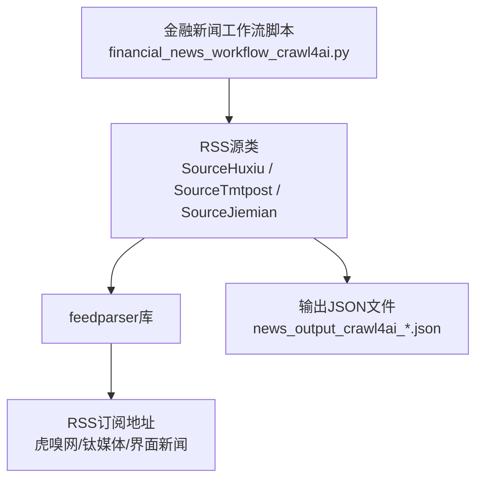
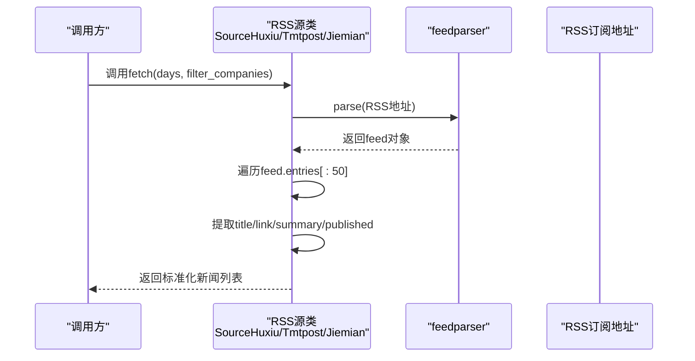
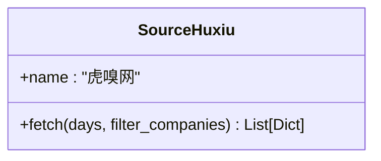
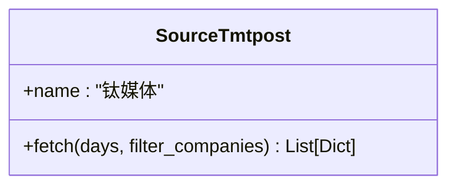
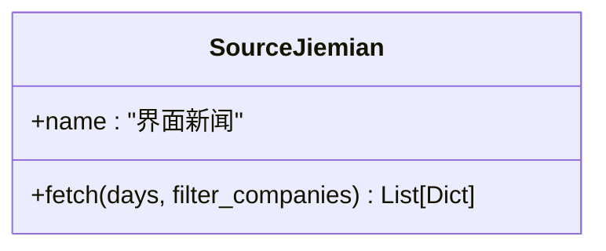
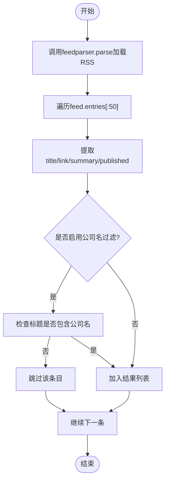
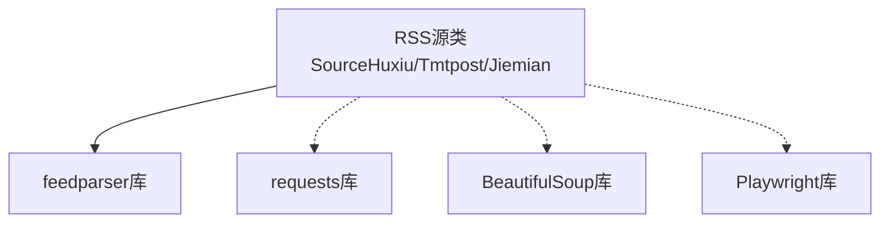

# RSS媒体源抓取

<cite>
**本文引用的文件**
- [financial_news_workflow_crawl4ai.py](file://financial_news_workflow_crawl4ai.py)
- [requirements.txt](file://requirements.txt)
- [test_all_sources.py](file://test_all_sources.py)
- [news_output_crawl4ai_20260324_115056/news_result.json](file://news_output_crawl4ai_20260324_115056/news_result.json)
- [news_output_crawl4ai_20260325_142309/news_result.json](file://news_output_crawl4ai_20260325_142309/news_result.json)
</cite>

## 目录
1. [简介](#简介)
2. [项目结构](#项目结构)
3. [核心组件](#核心组件)
4. [架构总览](#架构总览)
5. [详细组件分析](#详细组件分析)
6. [依赖关系分析](#依赖关系分析)
7. [性能考量](#性能考量)
8. [故障排查指南](#故障排查指南)
9. [结论](#结论)
10. [附录](#附录)

## 简介
本文件面向RSS媒体源抓取模块，聚焦于虎嗅网、钛媒体、界面新闻三个RSS源的实现与使用。文档基于仓库中的金融新闻工作流脚本，系统阐述feedparser库的使用、RSS订阅地址配置、XML数据解析与标准化处理流程，覆盖条目遍历、标题与摘要提取、发布时间处理、错误处理机制，并总结RSS抓取在金融新闻场景中的优势、局限与实践建议。同时提供配置参数说明、输出格式规范与使用示例路径，帮助读者快速上手与扩展。

## 项目结构
- 金融新闻工作流脚本包含7大权威媒体源的抓取实现，其中虎嗅网、钛媒体、界面新闻采用RSS源抓取，其余媒体采用API或浏览器自动化策略。
- RSS抓取模块位于金融新闻工作流脚本中，分别定义了SourceHuxiu、SourceTmtpost、SourceJiemian三类RSS源的抓取类，统一通过fetch方法对外提供接口。
- requirements.txt声明了feedparser等核心依赖，确保RSS解析可用。
- test_all_sources.py提供了对多个源的集成测试入口，便于验证RSS源抓取的连通性与基本解析能力。

图表来源
- [financial_news_workflow_crawl4ai.py:94-212](file://financial_news_workflow_crawl4ai.py#L94-L212)
- [requirements.txt:13-14](file://requirements.txt#L13-L14)

章节来源
- [financial_news_workflow_crawl4ai.py:1-11](file://financial_news_workflow_crawl4ai.py#L1-L11)
- [requirements.txt:1-144](file://requirements.txt#L1-L144)

## 核心组件
- RSS源抓取类
  - SourceHuxiu：虎嗅网RSS抓取，订阅地址为“https://www.huxiu.com/rss/0.xml”
  - SourceTmtpost：钛媒体RSS抓取，订阅地址为“https://www.tmtpost.com/rss.xml”
  - SourceJiemian：界面新闻RSS抓取，订阅地址为“https://a.jiemian.com/index.php?m=article&a=rss”
- feedparser库：用于解析RSS XML，获取entries并遍历条目
- 标准化输出：统一字段包括source、title、link、summary、published

章节来源
- [financial_news_workflow_crawl4ai.py:94-212](file://financial_news_workflow_crawl4ai.py#L94-L212)

## 架构总览
RSS抓取流程采用“类封装 + feedparser解析 + 标准化输出”的结构化设计。每个RSS源类提供静态fetch方法，内部通过feedparser.parse加载RSS，遍历entries，提取标题、链接、摘要、发布时间等字段，构造统一的新闻条目列表返回。

图表来源
- [financial_news_workflow_crawl4ai.py:98-119](file://financial_news_workflow_crawl4ai.py#L98-L119)
- [financial_news_workflow_crawl4ai.py:162-183](file://financial_news_workflow_crawl4ai.py#L162-L183)
- [financial_news_workflow_crawl4ai.py:190-212](file://financial_news_workflow_crawl4ai.py#L190-L212)

## 详细组件分析

### 虎嗅网RSS源（SourceHuxiu）
- 订阅地址：https://www.huxiu.com/rss/0.xml
- 实现要点
  - 使用feedparser.parse加载RSS
  - 遍历feed.entries前50条
  - 提取字段：title、link、summary（截取前200字符）、published
  - 可选公司名过滤：filter_companies参数控制是否基于公司名单过滤标题
  - 错误处理：捕获异常并打印错误信息，返回空列表
- 输出字段
  - source：虎嗅网
  - title：标题
  - link：原文链接
  - summary：摘要（截断）
  - published：发布时间（RFC 822格式）

图表来源
- [financial_news_workflow_crawl4ai.py:94-119](file://financial_news_workflow_crawl4ai.py#L94-L119)

章节来源
- [financial_news_workflow_crawl4ai.py:94-119](file://financial_news_workflow_crawl4ai.py#L94-L119)

### 钛媒体RSS源（SourceTmtpost）
- 订阅地址：https://www.tmtpost.com/rss.xml
- 实现要点
  - 使用feedparser.parse加载RSS
  - 遍历feed.entries前50条
  - 提取字段：title、link、summary（截断）、published
  - 可选公司名过滤：filter_companies参数控制
  - 错误处理：捕获异常并打印错误信息，返回空列表
- 输出字段
  - source：钛媒体
  - title：标题
  - link：原文链接
  - summary：摘要（截断）
  - published：发布时间（RFC 822格式）

图表来源
- [financial_news_workflow_crawl4ai.py:158-183](file://financial_news_workflow_crawl4ai.py#L158-L183)

章节来源
- [financial_news_workflow_crawl4ai.py:158-183](file://financial_news_workflow_crawl4ai.py#L158-L183)

### 界面新闻RSS源（SourceJiemian）
- 订阅地址：https://a.jiemian.com/index.php?m=article&a=rss
- 实现要点
  - 使用feedparser.parse加载RSS
  - 遍历feed.entries前50条
  - 提取字段：title、link、summary（截断）、published
  - 可选公司名过滤：filter_companies参数控制
  - 错误处理：捕获异常并打印错误信息，返回空列表
- 输出字段
  - source：界面新闻
  - title：标题
  - link：原文链接
  - summary：摘要（截断）
  - published：发布时间（RFC 822格式）

图表来源
- [financial_news_workflow_crawl4ai.py:186-212](file://financial_news_workflow_crawl4ai.py#L186-L212)

章节来源
- [financial_news_workflow_crawl4ai.py:186-212](file://financial_news_workflow_crawl4ai.py#L186-L212)

### feedparser库使用与RSS解析流程
- 依赖声明：requirements.txt中声明feedparser>=6.0.10
- 使用方式：在RSS源类中调用feedparser.parse加载RSS地址，返回feed对象
- 条目遍历：遍历feed.entries，限制最多50条，保证性能与时效性
- 字段提取：从entry对象中读取title、link、summary、published等字段
- 标准化输出：构造统一的字典列表，包含source、title、link、summary、published

图表来源
- [financial_news_workflow_crawl4ai.py:98-119](file://financial_news_workflow_crawl4ai.py#L98-L119)
- [financial_news_workflow_crawl4ai.py:162-183](file://financial_news_workflow_crawl4ai.py#L162-L183)
- [financial_news_workflow_crawl4ai.py:190-212](file://financial_news_workflow_crawl4ai.py#L190-L212)

章节来源
- [requirements.txt:13-14](file://requirements.txt#L13-L14)
- [financial_news_workflow_crawl4ai.py:98-212](file://financial_news_workflow_crawl4ai.py#L98-L212)

### 错误处理机制
- 依赖缺失：若feedparser未安装，RSS源类的fetch方法直接返回空列表并打印提示
- 网络异常：feedparser.parse或HTTP请求失败时，捕获异常并打印错误信息
- 结果为空：当RSS解析成功但entries为空时，返回空列表
- 统一返回：所有RSS源类均返回List[Dict]，便于上层统一处理

章节来源
- [financial_news_workflow_crawl4ai.py:31-36](file://financial_news_workflow_crawl4ai.py#L31-L36)
- [financial_news_workflow_crawl4ai.py:98-119](file://financial_news_workflow_crawl4ai.py#L98-L119)
- [financial_news_workflow_crawl4ai.py:162-183](file://financial_news_workflow_crawl4ai.py#L162-L183)
- [financial_news_workflow_crawl4ai.py:190-212](file://financial_news_workflow_crawl4ai.py#L190-L212)

## 依赖关系分析
- feedparser依赖：RSS解析核心库，版本要求>=6.0.10
- requests依赖：部分媒体源使用requests进行HTTP请求（如36氪API），但RSS源不依赖requests
- BeautifulSoup依赖：RSS源不依赖bs4，但工作流中其他媒体源使用bs4进行HTML解析
- Playwright依赖：用于极客公园等需要反爬机制的媒体源，RSS源不依赖

图表来源
- [requirements.txt:13-14](file://requirements.txt#L13-L14)
- [financial_news_workflow_crawl4ai.py:31-50](file://financial_news_workflow_crawl4ai.py#L31-L50)

章节来源
- [requirements.txt:1-144](file://requirements.txt#L1-L144)
- [financial_news_workflow_crawl4ai.py:31-50](file://financial_news_workflow_crawl4ai.py#L31-L50)

## 性能考量
- 条目数量限制：每个RSS源仅遍历前50条entries，兼顾时效性与性能
- 字段截断：summary字段截取前200字符，减少存储与传输开销
- 依赖安装：确保feedparser正确安装，避免运行时导入失败
- 错误快速返回：RSS源类在异常时快速返回空列表，避免阻塞整体流程

## 故障排查指南
- feedparser未安装
  - 现象：RSS源类返回空列表并提示未安装
  - 处理：安装feedparser>=6.0.10
- RSS地址不可达
  - 现象：feedparser.parse失败，返回空entries
  - 处理：检查RSS地址有效性与网络连通性
- 输出为空
  - 现象：RSS解析成功但entries为空
  - 处理：确认RSS源是否提供有效内容，或调整遍历条目数量
- 公司名过滤导致无结果
  - 现象：启用filter_companies后返回空列表
  - 处理：关闭过滤或调整公司名单

章节来源
- [financial_news_workflow_crawl4ai.py:31-36](file://financial_news_workflow_crawl4ai.py#L31-L36)
- [financial_news_workflow_crawl4ai.py:98-212](file://financial_news_workflow_crawl4ai.py#L98-L212)

## 结论
RSS媒体源抓取模块通过feedparser库实现了对虎嗅网、钛媒体、界面新闻三个RSS源的稳定抓取，具备部署简单、无需反爬虫处理、解析标准化等优势。在金融新闻场景中，RSS抓取可作为热点信息的快速入口，配合公司名过滤与去重策略，形成高质量的新闻素材库。同时，RSS源的局限在于内容时效性与字段标准化程度有限，建议结合其他媒体源策略（API、浏览器自动化）与全文解析能力，构建更完善的金融新闻采集体系。

## 附录

### 使用示例
- 直接调用RSS源类的fetch方法，获取标准化新闻列表
  - 示例路径：[调用RSS源类fetch方法:98-119](file://financial_news_workflow_crawl4ai.py#L98-L119)
  - 示例路径：[调用RSS源类fetch方法:162-183](file://financial_news_workflow_crawl4ai.py#L162-L183)
  - 示例路径：[调用RSS源类fetch方法:190-212](file://financial_news_workflow_crawl4ai.py#L190-L212)
- 集成测试入口
  - 示例路径：[测试7大媒体源入口:18-46](file://test_all_sources.py#L18-L46)

章节来源
- [financial_news_workflow_crawl4ai.py:98-212](file://financial_news_workflow_crawl4ai.py#L98-L212)
- [test_all_sources.py:18-46](file://test_all_sources.py#L18-L46)

### 配置参数说明
- days：抓取天数（RSS源类中未使用，保留参数以兼容统一接口）
- filter_companies：是否启用公司名过滤（可选）
- 源名称映射：huxiu、tmtpost、jiemian分别对应虎嗅网、钛媒体、界面新闻

章节来源
- [financial_news_workflow_crawl4ai.py:363-381](file://financial_news_workflow_crawl4ai.py#L363-L381)

### 输出格式规范
- 统一字段
  - source：媒体源名称（虎嗅网/钛媒体/界面新闻）
  - title：标题
  - link：原文链接
  - summary：摘要（截断至200字符）
  - published：发布时间（RFC 822格式）
- 输出文件
  - 示例路径：[输出示例1:1-267](file://news_output_crawl4ai_20260324_115056/news_result.json#L1-L267)
  - 示例路径：[输出示例2:1-61](file://news_output_crawl4ai_20260325_142309/news_result.json#L1-L61)

章节来源
- [financial_news_workflow_crawl4ai.py:98-212](file://financial_news_workflow_crawl4ai.py#L98-L212)
- [news_output_crawl4ai_20260324_115056/news_result.json:1-267](file://news_output_crawl4ai_20260324_115056/news_result.json#L1-L267)
- [news_output_crawl4ai_20260325_142309/news_result.json:1-61](file://news_output_crawl4ai_20260325_142309/news_result.json#L1-L61)