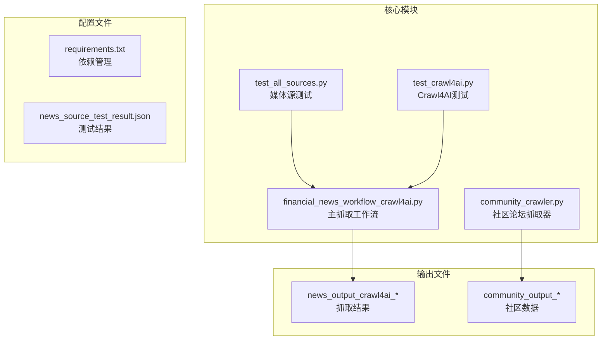
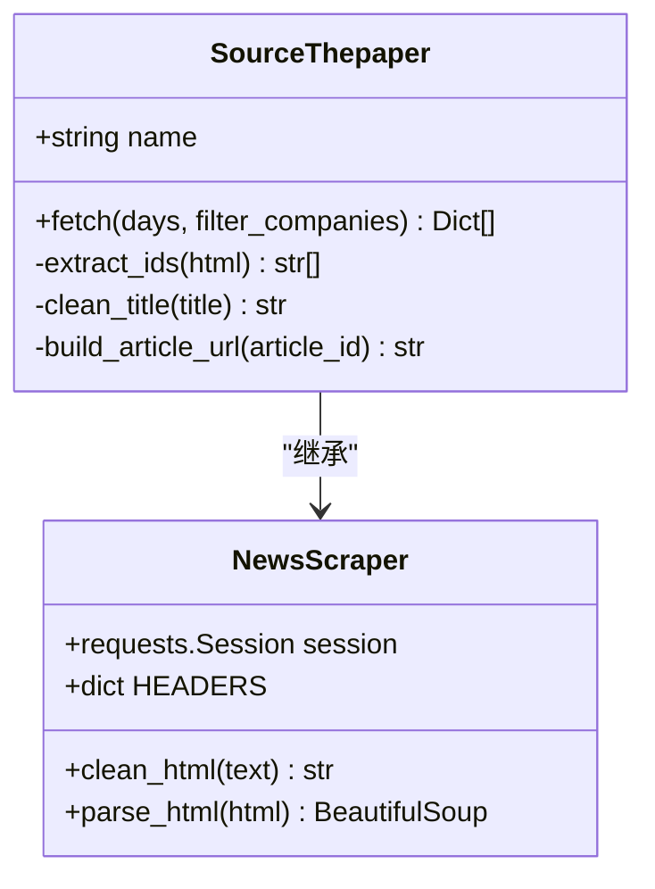
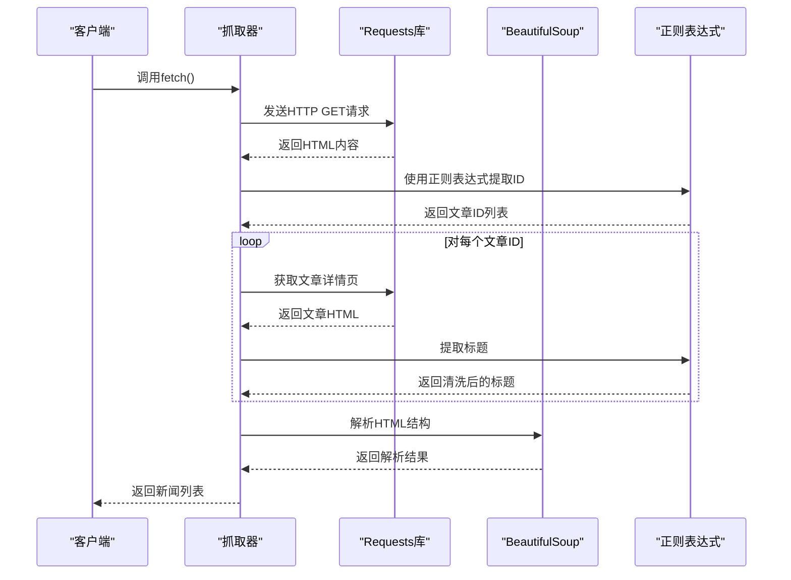
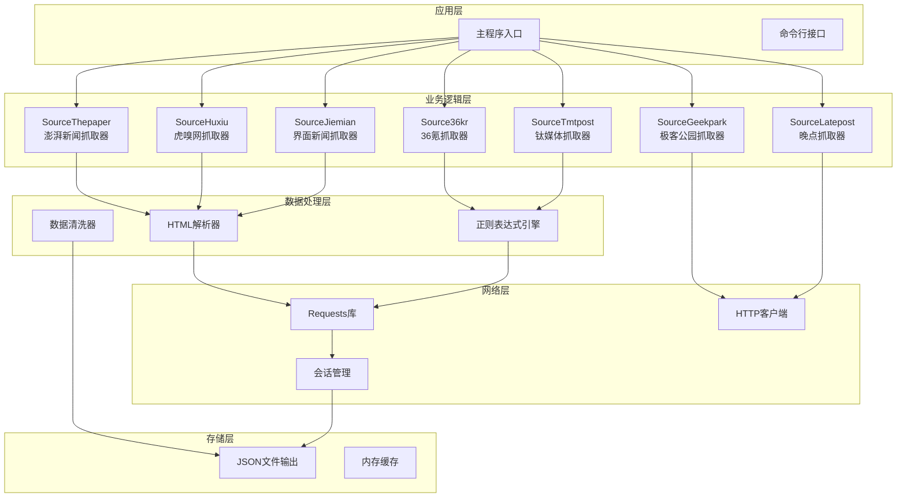
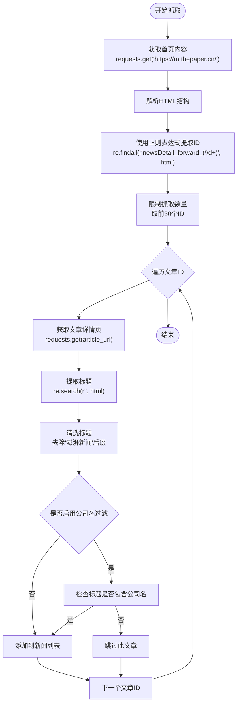
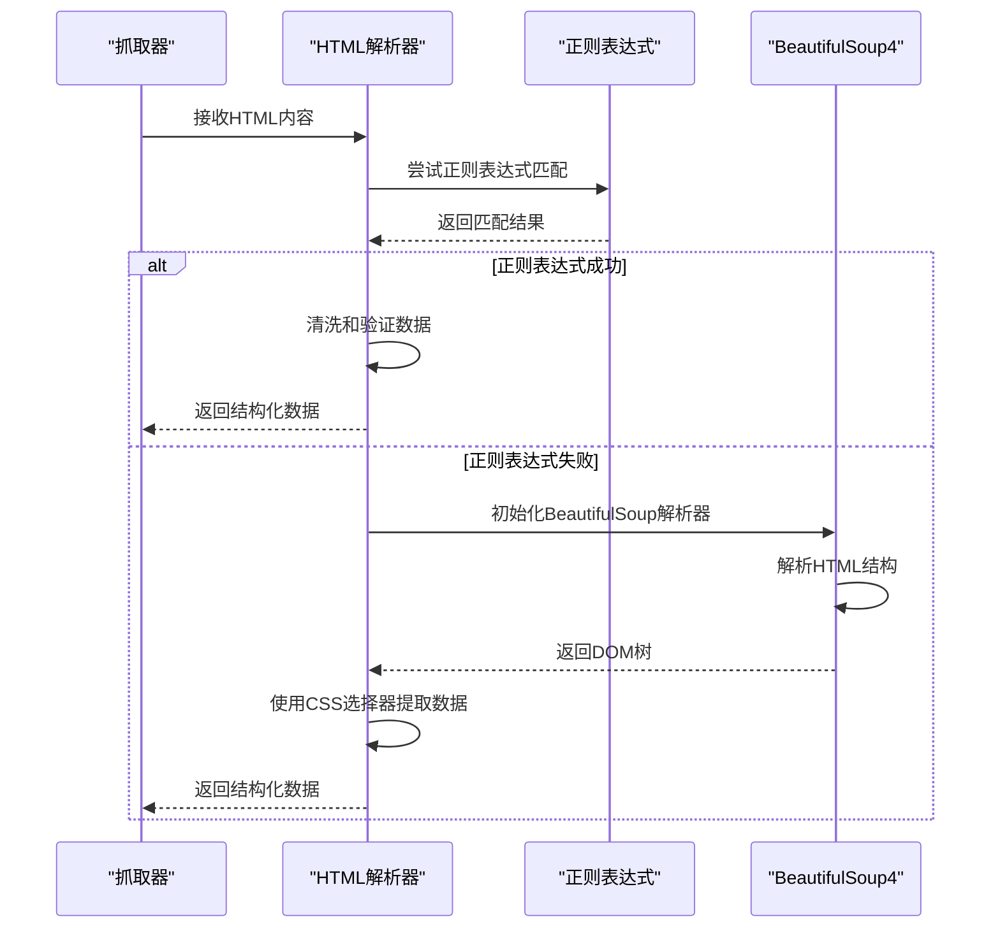
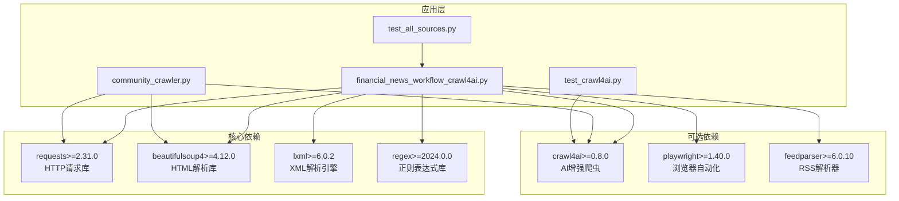
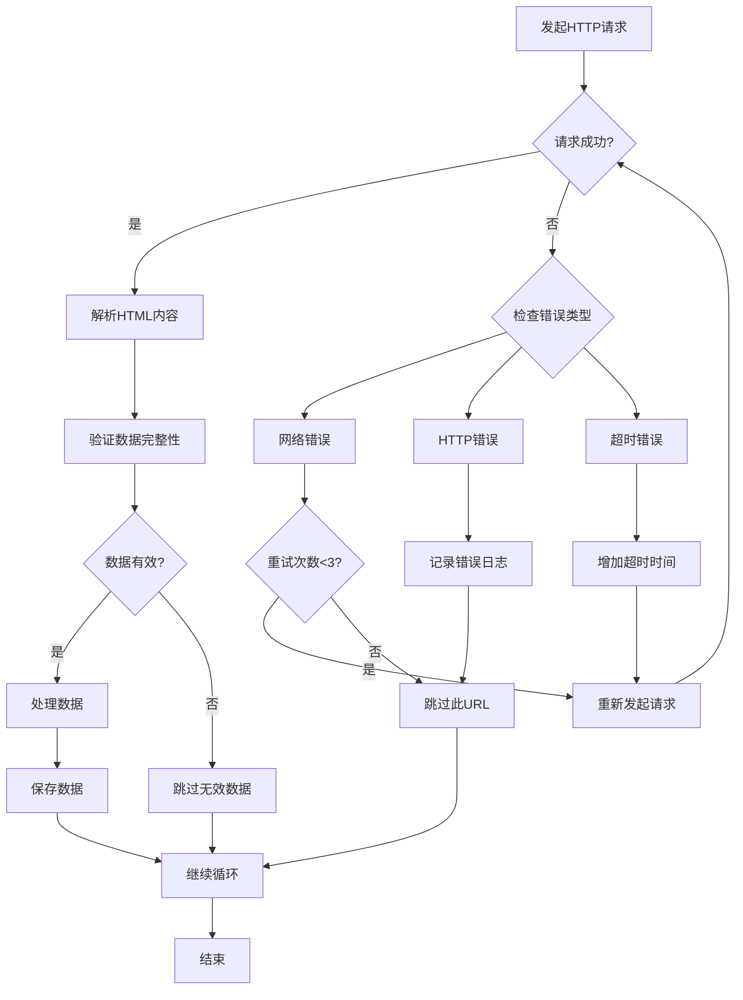

# Requests传统网页抓取

<cite>
**本文档引用的文件**
- [financial_news_workflow_crawl4ai.py](file://financial_news_workflow_crawl4ai.py)
- [community_crawler.py](file://community_crawler.py)
- [requirements.txt](file://requirements.txt)
- [test_all_sources.py](file://test_all_sources.py)
- [test_crawl4ai.py](file://test_crawl4ai.py)
- [news_source_test_result.json](file://news_source_test_result.json)
</cite>

## 目录
1. [简介](#简介)
2. [项目结构](#项目结构)
3. [核心组件](#核心组件)
4. [架构概览](#架构概览)
5. [详细组件分析](#详细组件分析)
6. [依赖关系分析](#依赖关系分析)
7. [性能考虑](#性能考虑)
8. [故障排除指南](#故障排除指南)
9. [结论](#结论)

## 简介

本文档专注于Requests传统网页抓取模块，特别是澎湃新闻（ThePaper）的抓取实现。该模块展示了如何使用Python的requests库进行HTTP请求、HTML内容解析、正则表达式匹配和BeautifulSoup4辅助处理的完整流程。

传统网页抓取具有直接HTML解析、灵活度高的特点，但也面临着反爬虫防护、页面结构变化等挑战。本文档将详细解释澎湃新闻的抓取策略、HTML解析流程、文章ID提取逻辑、标题清洗处理和链接构建规则。

## 项目结构

该项目采用模块化设计，主要包含以下核心文件：



**图表来源**
- [financial_news_workflow_crawl4ai.py:1-454](file://financial_news_workflow_crawl4ai.py#L1-L454)
- [community_crawler.py:1-604](file://community_crawler.py#L1-L604)

**章节来源**
- [financial_news_workflow_crawl4ai.py:1-454](file://financial_news_workflow_crawl4ai.py#L1-L454)
- [community_crawler.py:1-604](file://community_crawler.py#L1-L604)

## 核心组件

### 澎湃新闻抓取器（SourceThepaper）

澎湃新闻的抓取实现位于`SourceThepaper`类中，采用传统的requests库进行HTTP请求和正则表达式解析：



**图表来源**
- [financial_news_workflow_crawl4ai.py:321-358](file://financial_news_workflow_crawl4ai.py#L321-L358)

### 请求策略组件

系统实现了多层次的请求策略，确保在不同环境下都能有效抓取：



**图表来源**
- [financial_news_workflow_crawl4ai.py:326-358](file://financial_news_workflow_crawl4ai.py#L326-L358)

**章节来源**
- [financial_news_workflow_crawl4ai.py:321-358](file://financial_news_workflow_crawl4ai.py#L321-L358)

## 架构概览

整个抓取系统采用分层架构设计，包含以下主要层次：



**图表来源**
- [financial_news_workflow_crawl4ai.py:94-358](file://financial_news_workflow_crawl4ai.py#L94-L358)

## 详细组件分析

### 澎湃新闻抓取实现详解

#### 页面请求策略

澎湃新闻的抓取采用了两阶段请求策略：

1. **首页抓取阶段**：从移动端首页提取文章ID
2. **详情页抓取阶段**：根据ID获取详细内容



**图表来源**
- [financial_news_workflow_crawl4ai.py:326-358](file://financial_news_workflow_crawl4ai.py#L326-L358)

#### HTML解析流程

虽然澎湃新闻主要使用正则表达式进行解析，但系统仍具备BeautifulSoup4的解析能力：



**图表来源**
- [financial_news_workflow_crawl4ai.py:334-358](file://financial_news_workflow_crawl4ai.py#L334-L358)

#### 文章ID提取逻辑

文章ID提取使用正则表达式模式匹配：

```python
# 文章ID提取模式
ids = re.findall(r'newsDetail_forward_(\d+)', html)
```

这个模式专门针对澎湃新闻的移动端URL结构设计，能够准确提取文章ID。

#### 标题清洗处理

标题清洗包含多个步骤：

1. **HTML实体解码**：将`&amp;`等转义字符还原
2. **特殊字符处理**：移除多余的空白字符
3. **后缀清理**：去除"_澎湃新闻"后缀
4. **格式标准化**：统一标题格式

#### 链接构建规则

链接构建遵循以下规则：

1. **基础URL**：使用移动端域名 `https://m.thepaper.cn/`
2. **路径拼接**：将文章ID拼接到 `newsDetail_forward_` 后面
3. **完整URL**：最终形成 `https://m.thepaper.cn/newsDetail_forward_{id}`

**章节来源**
- [financial_news_workflow_crawl4ai.py:326-358](file://financial_news_workflow_crawl4ai.py#L326-L358)

### 传统网页抓取特点分析

#### 优势特点

1. **直接HTML解析**：无需复杂的浏览器自动化，直接解析HTML内容
2. **灵活度高**：可以根据具体网站结构调整解析策略
3. **资源消耗低**：相比浏览器自动化，CPU和内存占用较少
4. **部署简单**：只需要基础的HTTP库即可运行

#### 面临挑战

1. **反爬虫防护**：现代网站普遍采用各种反爬虫技术
2. **页面结构变化**：网站改版可能导致解析失败
3. **JavaScript渲染**：动态内容需要额外处理
4. **请求频率控制**：需要合理控制请求频率避免被封IP

#### 适用场景

1. **静态内容抓取**：适合抓取不需要JavaScript渲染的页面
2. **批量数据获取**：适合大规模的数据采集任务
3. **成本敏感项目**：预算有限的爬虫项目
4. **快速原型开发**：需要快速验证抓取可行性的场景

**章节来源**
- [financial_news_workflow_crawl4ai.py:321-358](file://financial_news_workflow_crawl4ai.py#L321-L358)

## 依赖关系分析

### 核心依赖关系



**图表来源**
- [requirements.txt:1-144](file://requirements.txt#L1-L144)

### 版本兼容性

系统对依赖库的版本要求体现了不同功能模块的需求：

- **requests**：提供基础HTTP功能
- **beautifulsoup4**：提供HTML解析能力
- **crawl4ai**：提供AI增强的爬虫功能
- **playwright**：提供浏览器自动化能力
- **feedparser**：提供RSS订阅解析

**章节来源**
- [requirements.txt:1-144](file://requirements.txt#L1-L144)

## 性能考虑

### 请求优化策略

1. **超时设置**：合理设置请求超时时间，避免长时间阻塞
2. **重试机制**：对失败的请求实施有限次数的重试
3. **并发控制**：控制同时进行的请求数量
4. **缓存策略**：对重复访问的页面实施缓存

### 内存管理

1. **流式处理**：对于大文件采用流式下载
2. **及时释放**：及时释放不再使用的对象
3. **分批处理**：将大数据集分批处理，避免内存溢出

### 网络优化

1. **连接复用**：使用会话对象复用HTTP连接
2. **压缩传输**：启用GZIP压缩减少传输数据量
3. **CDN加速**：优先使用CDN节点提高访问速度

## 故障排除指南

### 常见问题及解决方案

#### 网络连接问题

**问题症状**：请求超时或连接失败
**解决方法**：
1. 检查网络连接状态
2. 设置合理的超时时间
3. 实施重试机制
4. 配置代理服务器

#### 反爬虫防护

**问题症状**：返回验证码或访问被拒绝
**解决方法**：
1. 修改User-Agent字符串
2. 添加请求头信息
3. 实施随机延时
4. 使用代理IP池

#### 页面结构变化

**问题症状**：解析失败或数据不完整
**解决方法**：
1. 定期更新解析规则
2. 实施多策略解析
3. 添加异常处理机制
4. 建立监控告警系统

#### 数据质量问题

**问题症状**：抓取到重复或无效数据
**解决方法**：
1. 实施数据去重算法
2. 添加数据验证规则
3. 建立数据质量监控
4. 实施增量更新机制

**章节来源**
- [financial_news_workflow_crawl4ai.py:356-358](file://financial_news_workflow_crawl4ai.py#L356-L358)

### 错误恢复机制

系统实现了多层次的错误恢复机制：



**图表来源**
- [financial_news_workflow_crawl4ai.py:326-358](file://financial_news_workflow_crawl4ai.py#L326-L358)

## 结论

Requests传统网页抓取模块展现了经典爬虫技术的完整实现，特别是在澎湃新闻抓取中的应用体现了以下特点：

1. **技术成熟度**：基于成熟的requests库和正则表达式技术
2. **实现简洁性**：代码结构清晰，易于理解和维护
3. **功能完整性**：涵盖了从请求到数据处理的完整流程
4. **扩展性强**：支持多种解析策略和错误恢复机制

尽管面临反爬虫防护和页面结构变化等挑战，但通过合理的策略设计和错误处理机制，传统网页抓取仍然能够在大多数场景下稳定运行。对于需要快速部署和成本控制的爬虫项目，这种技术方案提供了可靠的解决方案。

在未来的发展中，建议结合现代技术如Crawl4AI等增强功能，以应对更加复杂的爬取需求，同时保持传统技术的优势特性。