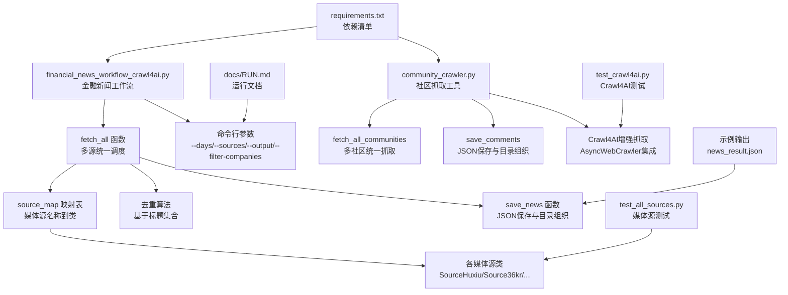
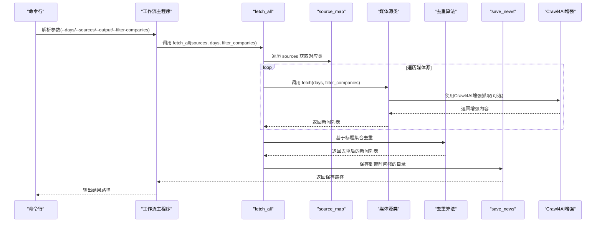
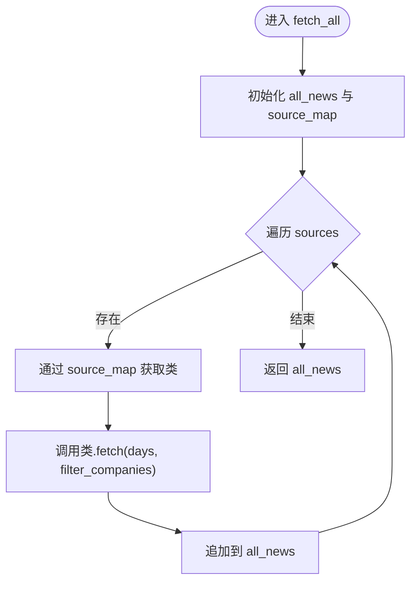
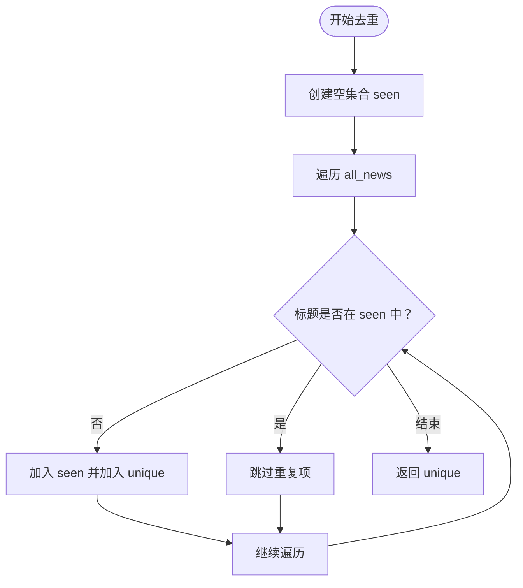
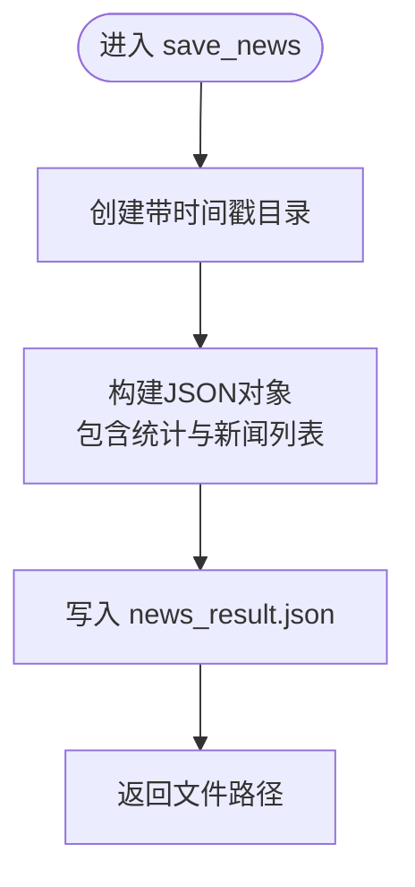
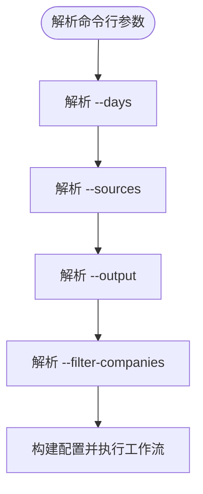
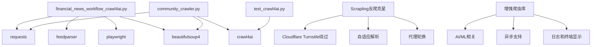

# 工作流核心功能

<cite>
**本文档引用的文件**
- [financial_news_workflow_crawl4ai.py](file://financial_news_workflow_crawl4ai.py)
- [community_crawler.py](file://community_crawler.py)
- [test_all_sources.py](file://test_all_sources.py)
- [requirements.txt](file://requirements.txt)
- [docs/RUN.md](file://docs/RUN.md)
- [news_output_crawl4ai_20260325_164854/news_result.json](file://news_output_crawl4ai_20260325_164854/news_result.json)
- [news_output_20260323_235950/news_result.json](file://news_output_20260323_235950/news_result.json)
- [test_crawl4ai.py](file://test_crawl4ai.py)
</cite>

## 更新摘要
**变更内容**
- 更新Crawl4AI集成和增强爬虫架构
- 新增社区论坛抓取工具的Crawl4AI增强功能
- 完善错误处理机制和性能优化策略
- 扩展多源媒体抓取架构说明

## 目录
1. [简介](#简介)
2. [项目结构](#项目结构)
3. [核心组件](#核心组件)
4. [架构概览](#架构概览)
5. [详细组件分析](#详细组件分析)
6. [依赖分析](#依赖分析)
7. [性能考虑](#性能考虑)
8. [故障排除指南](#故障排除指南)
9. [结论](#结论)
10. [附录](#附录)

## 简介
本文件聚焦于工作流核心功能模块，系统性阐述新闻抓取的统一调度机制、去重算法、数据保存与命令行参数处理。文档基于实际代码与输出样例，详细说明 fetch_all 函数的多源协调、source_map 映射表、并行处理策略与错误聚合机制；解释去重算法的实现原理（基于标题的集合去重）、数据结构设计与性能考量；详述 save_news 函数的文件组织、JSON 格式规范、时间戳命名策略与目录结构管理；并提供完整的命令行参数说明、使用示例与故障排除指南。

**更新** 本版本新增Crawl4AI集成和社区抓取工具的增强功能，扩展了多源媒体抓取架构。

## 项目结构
项目包含两个核心工作流脚本与配套文档、测试脚本与示例输出：
- financial_news_workflow_crawl4ai.py：金融新闻自动化工作流，支持7大权威媒体源，提供 fetch_all 统一调度、去重与保存功能
- community_crawler.py：社区论坛信息抓取工具，支持雪球、知乎等社区，提供统一抓取入口与保存功能，集成Crawl4AI增强抓取
- test_all_sources.py：测试脚本，验证各媒体源连通性与解析能力
- requirements.txt：完整依赖清单，包含 feedparser、requests、playwright、beautifulsoup4、crawl4ai 等
- docs/RUN.md：运行文档，包含命令行参数说明与使用示例
- 示例输出：news_output_crawl4ai_* 与 news_output_* 目录下的 news_result.json

**图表来源**
- [financial_news_workflow_crawl4ai.py:363-454](file://financial_news_workflow_crawl4ai.py#L363-L454)
- [community_crawler.py:413-596](file://community_crawler.py#L413-L596)
- [test_all_sources.py:1-49](file://test_all_sources.py#L1-L49)
- [requirements.txt:1-144](file://requirements.txt#L1-L144)
- [docs/RUN.md:1-252](file://docs/RUN.md#L1-L252)
- [test_crawl4ai.py:1-163](file://test_crawl4ai.py#L1-L163)

**章节来源**
- [financial_news_workflow_crawl4ai.py:1-454](file://financial_news_workflow_crawl4ai.py#L1-L454)
- [community_crawler.py:1-604](file://community_crawler.py#L1-L604)
- [test_all_sources.py:1-49](file://test_all_sources.py#L1-L49)
- [requirements.txt:1-144](file://requirements.txt#L1-L144)
- [docs/RUN.md:1-252](file://docs/RUN.md#L1-L252)

## 核心组件
本节概述工作流核心功能模块及其职责：
- fetch_all 函数：统一调度各媒体源，聚合结果并返回
- source_map 映射表：媒体源名称到对应 Source 类的映射
- 去重算法：基于标题的集合去重，保证唯一性
- save_news 函数：创建带时间戳的输出目录，保存 JSON 文件
- 命令行参数：支持 days、sources、output、filter-companies 等参数
- 社区抓取工具：提供 fetch_all_communities 与 save_comments，支持情感分析和Crawl4AI增强抓取
- Crawl4AI集成：提供AI驱动的网页抓取和内容理解能力

**更新** 新增Crawl4AI集成和社区抓取工具的增强功能。

**章节来源**
- [financial_news_workflow_crawl4ai.py:363-403](file://financial_news_workflow_crawl4ai.py#L363-L403)
- [financial_news_workflow_crawl4ai.py:405-454](file://financial_news_workflow_crawl4ai.py#L405-L454)
- [community_crawler.py:413-496](file://community_crawler.py#L413-L496)
- [community_crawler.py:125-176](file://community_crawler.py#L125-L176)

## 架构概览
工作流采用"统一调度 + 多源抓取 + 去重 + 保存"的流水线架构。fetch_all 通过 source_map 将媒体源名称映射到具体实现类，依次调用各类的 fetch 方法获取新闻列表，然后进行去重与保存。命令行参数控制抓取范围与输出位置。

**更新** 新架构支持Crawl4AI增强抓取，提供AI驱动的内容理解和网页处理能力。

**图表来源**
- [financial_news_workflow_crawl4ai.py:363-454](file://financial_news_workflow_crawl4ai.py#L363-L454)
- [community_crawler.py:125-176](file://community_crawler.py#L125-L176)

**章节来源**
- [financial_news_workflow_crawl4ai.py:363-454](file://financial_news_workflow_crawl4ai.py#L363-L454)
- [community_crawler.py:125-176](file://community_crawler.py#L125-L176)

## 详细组件分析

### 组件A：fetch_all 函数与多源协调
- 统一调度：接收媒体源列表，遍历并调用各源的 fetch 方法
- source_map 映射表：将字符串源名映射到对应 Source 类，支持 huxiu、36kr、tmtpost、jiemian、geekpark、latepost、thepaper
- 错误聚合：各源抓取异常被捕获并记录，最终汇总到 fetch_stats
- 结果聚合：将各源返回的新闻列表合并为 all_news

**图表来源**
- [financial_news_workflow_crawl4ai.py:363-382](file://financial_news_workflow_crawl4ai.py#L363-L382)

**章节来源**
- [financial_news_workflow_crawl4ai.py:363-382](file://financial_news_workflow_crawl4ai.py#L363-L382)

### 组件B：去重算法与数据结构设计
- 实现原理：基于标题的集合去重，使用 set 维护已见过的标题，遍历新闻列表，仅保留未见过的条目
- 时间复杂度：O(n)，n 为新闻总数
- 空间复杂度：O(k)，k 为去重后条目数
- 性能考虑：集合查找为 O(1) 平均时间；对大列表去重时，内存占用与去重后条目数相关

**图表来源**
- [financial_news_workflow_crawl4ai.py:432-440](file://financial_news_workflow_crawl4ai.py#L432-L440)

**章节来源**
- [financial_news_workflow_crawl4ai.py:432-440](file://financial_news_workflow_crawl4ai.py#L432-L440)

### 组件C：save_news 函数与文件组织
- 目录结构：创建带时间戳的输出目录 news_output_crawl4ai_YYYYMMDD_HHMMSS
- 文件命名：news_result.json
- JSON 结构：包含 fetch_time、total、by_source、news 等字段
- 统计信息：按来源统计条目数量，便于后续分析

**图表来源**
- [financial_news_workflow_crawl4ai.py:384-402](file://financial_news_workflow_crawl4ai.py#L384-L402)

**章节来源**
- [financial_news_workflow_crawl4ai.py:384-402](file://financial_news_workflow_crawl4ai.py#L384-L402)

### 组件D：命令行参数处理
- 参数说明：
  - --days：抓取近 X 天的新闻，默认 3
  - --sources：媒体来源，逗号分隔，默认 all
  - --output：输出目录，默认当前目录
  - --filter-companies：是否启用公司名过滤，默认关闭
- 参数解析与默认值：根据参数构造 sources 列表与布尔标志

**图表来源**
- [financial_news_workflow_crawl4ai.py:405-412](file://financial_news_workflow_crawl4ai.py#L405-L412)

**章节来源**
- [financial_news_workflow_crawl4ai.py:405-412](file://financial_news_workflow_crawl4ai.py#L405-L412)

### 组件E：社区抓取工具（对比参考）
- 统一抓取入口：fetch_all_communities，支持多社区源
- 保存函数：save_comments，按关键词生成文件名并保存
- 情感分析：基于关键词的简单情感分析
- **更新** Crawl4AI增强抓取：支持AsyncWebCrawler，提供AI驱动的网页内容提取和处理

**章节来源**
- [community_crawler.py:413-496](file://community_crawler.py#L413-L496)
- [community_crawler.py:125-176](file://community_crawler.py#L125-L176)

### 组件F：Crawl4AI集成与增强抓取
- **新增功能**：AsyncWebCrawler集成，支持Playwright和HTTP两种爬虫策略
- **增强能力**：AI驱动的网页内容提取、链接提取、动态网页处理
- **错误处理**：Playwright失败时自动降级到HTTP策略
- **应用场景**：复杂网页结构、反爬机制绕过、AI增强内容理解

**章节来源**
- [community_crawler.py:125-176](file://community_crawler.py#L125-L176)
- [test_crawl4ai.py:1-163](file://test_crawl4ai.py#L1-L163)

## 依赖分析
工作流依赖包括网络请求、RSS 解析、HTML 解析、Playwright 浏览器自动化与 BeautifulSoup 等。requirements.txt 提供完整依赖清单，包括 feedparser、requests、playwright、beautifulsoup4、crawl4ai 等。

**更新** 新增Scrapling反爬克星、AI/ML相关依赖、增强爬虫库等。

**图表来源**
- [requirements.txt:1-144](file://requirements.txt#L1-L144)
- [financial_news_workflow_crawl4ai.py:30-58](file://financial_news_workflow_crawl4ai.py#L30-L58)
- [community_crawler.py:35-51](file://community_crawler.py#L35-L51)
- [test_crawl4ai.py:15-22](file://test_crawl4ai.py#L15-L22)

**章节来源**
- [requirements.txt:1-144](file://requirements.txt#L1-L144)
- [financial_news_workflow_crawl4ai.py:30-58](file://financial_news_workflow_crawl4ai.py#L30-L58)
- [community_crawler.py:35-51](file://community_crawler.py#L35-L51)

## 性能考虑
- 去重性能：基于集合的 O(1) 查找，整体 O(n) 复杂度，适合大规模新闻列表
- I/O 性能：JSON 写入为顺序写入，文件大小与条目数线性相关
- 并发策略：当前实现为串行抓取，可考虑引入异步并发以提升吞吐量
- 资源控制：Playwright 浏览器启动与页面加载可能消耗较多内存与 CPU，建议限制并发数量
- **更新** Crawl4AI性能：AsyncWebCrawler提供更好的并发处理能力，支持异步HTTP客户端
- **更新** 反爬优化：Scrapling提供Cloudflare Turnstile绕过和代理轮换，提升抓取成功率

**章节来源**
- [requirements.txt:23-35](file://requirements.txt#L23-L35)
- [community_crawler.py:125-176](file://community_crawler.py#L125-L176)

## 故障排除指南
- 抓取失败：检查网络连接与目标网站可访问性，缩小 sources 参数范围，查看命令行输出的错误信息
- Playwright 浏览器启动失败：确保已安装 Chromium，以管理员权限运行，检查系统权限
- 依赖安装失败：升级 pip，使用 --only-binary :all: 安装，检查网络连接
- 输出目录空间不足：定期清理输出目录，避免磁盘空间不足
- **更新** Crawl4AI集成问题：检查crawl4ai安装，确认网络连接和API配置
- **更新** 反爬检测：使用Scrapling的代理轮换功能，调整User-Agent和请求频率

**章节来源**
- [docs/RUN.md:144-188](file://docs/RUN.md#L144-L188)
- [test_crawl4ai.py:19-22](file://test_crawl4ai.py#L19-L22)

## 结论
本文档系统阐述了工作流核心功能模块的设计与实现，包括统一调度机制、去重算法、数据保存与命令行参数处理。通过 source_map 映射表与 fetch_all 函数实现多源协调，基于标题集合的去重算法保证数据唯一性，save_news 函数提供规范化的文件组织与 JSON 格式。配合完善的命令行参数与故障排除指南，工作流可在实际场景中稳定运行并易于扩展。

**更新** 新版本集成了Crawl4AI增强功能，提供了AI驱动的网页抓取能力和更强的反爬机制，扩展了多源媒体抓取架构，提升了整体性能和可靠性。

## 附录
- 使用示例与参数说明详见 docs/RUN.md
- 示例输出文件可参考 news_output_crawl4ai_* 与 news_output_* 目录下的 news_result.json
- Crawl4AI 功能测试脚本 test_crawl4ai.py 可验证爬虫增强功能
- **更新** Scrapling反爬克星库提供Cloudflare绕过和代理轮换功能

**章节来源**
- [docs/RUN.md:50-112](file://docs/RUN.md#L50-L112)
- [news_output_crawl4ai_20260325_164854/news_result.json:1-361](file://news_output_crawl4ai_20260325_164854/news_result.json#L1-L361)
- [news_output_20260323_235950/news_result.json:1-168](file://news_output_20260323_235950/news_result.json#L1-L168)
- [test_crawl4ai.py:1-163](file://test_crawl4ai.py#L1-L163)
- [requirements.txt:23-35](file://requirements.txt#L23-L35)