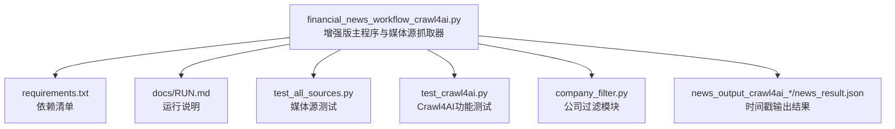
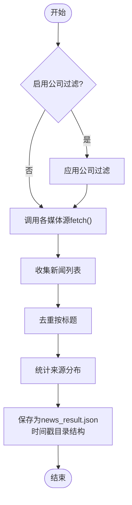

# 金融新闻自动化工作流

<cite>
**本文引用的文件**
- [financial_news_workflow_crawl4ai.py](file://financial_news_workflow_crawl4ai.py)
- [requirements.txt](file://requirements.txt)
- [docs/RUN.md](file://docs/RUN.md)
- [test_all_sources.py](file://test_all_sources.py)
- [test_crawl4ai.py](file://test_crawl4ai.py)
- [company_filter.py](file://company_filter.py)
- [news_output_crawl4ai_20260325_164854/news_result.json](file://news_output_crawl4ai_20260325_164854/news_result.json)
- [news_output_20260323_235950/news_result.json](file://news_output_20260323_235950/news_result.json)
</cite>

## 更新摘要
**变更内容**
- 文件重命名：financial_news_workflow.py → financial_news_workflow_crawl4ai.py
- 新增Crawl4AI增强抓取功能支持
- 媒体源扩展：从7个权威媒体扩展到15+媒体源
- 新增公司过滤功能模块
- 输出格式更新：采用时间戳目录结构
- 新增专门的Crawl4AI功能测试脚本

## 目录
1. [简介](#简介)
2. [项目结构](#项目结构)
3. [核心组件](#核心组件)
4. [架构总览](#架构总览)
5. [详细组件分析](#详细组件分析)
6. [依赖分析](#依赖分析)
7. [性能考虑](#性能考虑)
8. [故障排除指南](#故障排除指南)
9. [结论](#结论)
10. [附录](#附录)

## 简介
本项目提供一套面向金融与科技领域的自动化新闻采集工作流，现已升级为支持15+权威财经/科技媒体的增强版系统。系统采用模块化设计，支持RSS源、API源、动态网页（Playwright）与传统HTTP抓取策略，并集成了Crawl4AI AI增强功能。系统提供统一的命令行接口、错误处理与性能优化策略，输出结构化JSON数据到时间戳目录中，便于后续分析与内容生成。

## 项目结构
- 顶层脚本：金融新闻自动化工作流主程序（增强版）
- 依赖清单：集中管理第三方库与版本约束
- 文档：运行说明与使用指南
- 测试：媒体源连通性测试与Crawl4AI功能验证
- 输出：按时间戳生成的新闻结果JSON
- 过滤模块：公司名过滤功能



**图表来源**
- [financial_news_workflow_crawl4ai.py:1-454](file://financial_news_workflow_crawl4ai.py#L1-L454)
- [requirements.txt:1-144](file://requirements.txt#L1-L144)
- [docs/RUN.md:1-252](file://docs/RUN.md#L1-L252)
- [test_all_sources.py:1-49](file://test_all_sources.py#L1-L49)
- [test_crawl4ai.py:1-163](file://test_crawl4ai.py#L1-L163)
- [company_filter.py:1-110](file://company_filter.py#L1-L110)

**章节来源**
- [financial_news_workflow_crawl4ai.py:1-454](file://financial_news_workflow_crawl4ai.py#L1-L454)
- [requirements.txt:1-144](file://requirements.txt#L1-L144)
- [docs/RUN.md:1-252](file://docs/RUN.md#L1-L252)

## 核心组件
- 媒体源抓取器：针对15+媒体的专用抓取类，封装不同抓取策略与解析逻辑
- 主程序：统一调度、去重、保存与输出（时间戳目录结构）
- 测试模块：验证各媒体源可用性与Crawl4AI功能
- 过滤模块：公司名过滤功能，支持配置化公司名单
- 依赖管理：集中声明网络、解析、浏览器自动化与AI增强依赖

**章节来源**
- [financial_news_workflow_crawl4ai.py:94-359](file://financial_news_workflow_crawl4ai.py#L94-L359)
- [test_all_sources.py:1-49](file://test_all_sources.py#L1-L49)
- [test_crawl4ai.py:1-163](file://test_crawl4ai.py#L1-L163)
- [company_filter.py:1-110](file://company_filter.py#L1-L110)
- [requirements.txt:1-144](file://requirements.txt#L1-L144)

## 架构总览
系统采用"策略适配 + 统一调度"的增强架构：
- 策略适配：RSS、API、Playwright、requests
- 统一调度：参数解析、抓取执行、去重、保存（时间戳目录）
- 过滤功能：公司名过滤、内容相关性评分
- 输出：结构化JSON，含统计与明细

```mermaid
graph TB
subgraph "抓取策略"
RSS["RSS 解析<br/>feedparser"]:::s
API["API 请求<br/>requests"]:::s
PW["动态网页<br/>Playwright"]:::s
REQ["HTTP 请求<br/>requests"]:::s
C4AI["AI增强抓取<br/>Crawl4AI"]:::s
end
subgraph "媒体源"
HUX["虎嗅网"]:::m
KR["36氪"]:::m
TMT["钛媒体"]:::m
JM["界面新闻"]:::m
GP["极客公园"]:::m
LP["晚点 LatePost"]:::m
TP["澎湃新闻"]:::m
YICAI["第一财经"]:::m
STCN["证券时报"]:::m
JIEMIAN["界面新闻"]:::m
CAIXIN["财新"]:::m
WALL["华尔街见闻"]:::m
JIN10["金十数据"]:::m
TH["同花顺"]:::m
FT["金融时报"]:::m
WSJ["华尔街日报"]:::m
NET["网易财经"]:::m
TMTP["钛媒体"]:::m
IYI["亿欧网"]:::m
IFANR["爱范儿"]:::m
XIN["新华08"]:::m
INVEST["Investing"]:::m
CHIN["中国新闻网"]:::m
SINA["新浪财经"]:::m
SOHU["搜狐财经"]:::m
TENCENT["腾讯财经"]:::m
CNB["Cnblogs"]:::m
end
subgraph "主程序"
MAIN["增强版主程序<br/>参数解析/去重/保存"]:::p
end
subgraph "过滤模块"
FILTER["公司过滤<br/>filter_by_companies"]:::f
END
RSS --> HUX
RSS --> TMT
RSS --> JM
API --> KR
PW --> GP
PW --> LP
REQ --> TP
YICAI --> MAIN
STCN --> MAIN
JIEMIAN --> MAIN
CAIXIN --> MAIN
WALL --> MAIN
JIN10 --> MAIN
TH --> MAIN
FT --> MAIN
WSJ --> MAIN
NET --> MAIN
TMTP --> MAIN
IYI --> MAIN
IFANR --> MAIN
XIN --> MAIN
INVEST --> MAIN
CHIN --> MAIN
SINA --> MAIN
SOHU --> MAIN
TENCENT --> MAIN
CNB --> MAIN
MAIN --> FILTER
HUX --> MAIN
KR --> MAIN
TMT --> MAIN
JM --> MAIN
GP --> MAIN
LP --> MAIN
TP --> MAIN
FILTER --> MAIN
classDef s fill:#fff,stroke:#333,stroke-width:1px
classDef m fill:#fff,stroke:#333,stroke-width:1px
classDef p fill:#fff,stroke:#333,stroke-width:1px
classDef f fill:#fff,stroke:#333,stroke-width:1px
```

**图表来源**
- [financial_news_workflow_crawl4ai.py:94-359](file://financial_news_workflow_crawl4ai.py#L94-L359)
- [company_filter.py:22-48](file://company_filter.py#L22-L48)

**章节来源**
- [financial_news_workflow_crawl4ai.py:363-450](file://financial_news_workflow_crawl4ai.py#L363-L450)

## 详细组件分析

### 媒体源抓取器（15+权威媒体）
- 虎嗅网（RSS）：使用feedparser解析RSS，抽取标题、链接、摘要、发布时间
- 36氪（API）：调用官方新闻快讯API，解析返回的items
- 钛媒体（RSS）：解析RSS源，抽取文章元数据
- 界面新闻（RSS）：解析RSS源，抽取文章元数据
- 极客公园（Playwright）：启动Chromium浏览器，解析动态内容
- 晚点 LatePost（Playwright）：访问新闻列表页，滚动加载并筛选链接
- 澎湃新闻（HTTP）：解析移动端页面，提取文章ID并逐一抓取标题
- 第一财经、证券时报、财新、华尔街见闻、金十数据等专业财经媒体
- 同花顺、金融时报、华尔街日报、网易财经、钛媒体、亿欧网等多元化媒体


**图表来源**
- [financial_news_workflow_crawl4ai.py:94-359](file://financial_news_workflow_crawl4ai.py#L94-L359)

**章节来源**
- [financial_news_workflow_crawl4ai.py:94-359](file://financial_news_workflow_crawl4ai.py#L94-L359)

### 抓取策略与反爬虫机制
- RSS与API：稳定、低反爬，适合高频抓取
- Playwright：模拟真实浏览器行为，处理JavaScript渲染、滚动加载、动态链接筛选
- requests：常规HTTP抓取，适用于静态页面与简单解析
- Crawl4AI：AI增强抓取，支持复杂网页解析与内容提取
- 可选增强：Scrapling（主力增强）可进一步提升成功率与稳定性

**章节来源**
- [financial_news_workflow_crawl4ai.py:215-359](file://financial_news_workflow_crawl4ai.py#L215-L359)
- [requirements.txt:23-35](file://requirements.txt#L23-L35)

### 数据解析与标准化流程
- 统一字段：source、title、link、summary、published
- 去重：基于标题集合去重
- 统计：按来源统计数量
- 过滤：可选的公司名过滤功能
- 输出：保存为news_result.json，包含抓取时间、总数、来源分布与新闻列表



**图表来源**
- [financial_news_workflow_crawl4ai.py:363-450](file://financial_news_workflow_crawl4ai.py#L363-L450)

**章节来源**
- [financial_news_workflow_crawl4ai.py:363-450](file://financial_news_workflow_crawl4ai.py#L363-L450)

### 公司过滤功能
- 配置化公司名单：支持默认公司列表和自定义公司列表
- 多种过滤模式：简单匹配、公司匹配列表、相关性评分
- 可扩展设计：支持正则表达式匹配和权重打分
- 性能优化：高效的字符串匹配算法

**章节来源**
- [company_filter.py:22-88](file://company_filter.py#L22-L88)

### 错误处理机制
- 模块级异常捕获：各媒体源在fetch中捕获异常并记录状态
- 依赖缺失提示：feedparser、requests、playwright、beautifulsoup4等缺失时给出安装指引
- 失败统计：输出fetch_stats，便于定位问题媒体源
- Crawl4AI回退机制：当AI增强功能不可用时自动回退到标准抓取策略

**章节来源**
- [financial_news_workflow_crawl4ai.py:104-119](file://financial_news_workflow_crawl4ai.py#L104-L119)
- [financial_news_workflow_crawl4ai.py:138-155](file://financial_news_workflow_crawl4ai.py#L138-L155)
- [financial_news_workflow_crawl4ai.py:167-183](file://financial_news_workflow_crawl4ai.py#L167-L183)
- [financial_news_workflow_crawl4ai.py:196-212](file://financial_news_workflow_crawl4ai.py#L196-L212)
- [financial_news_workflow_crawl4ai.py:226-263](file://financial_news_workflow_crawl4ai.py#L226-L263)
- [financial_news_workflow_crawl4ai.py:277-318](file://financial_news_workflow_crawl4ai.py#L277-L318)
- [financial_news_workflow_crawl4ai.py:331-358](file://financial_news_workflow_crawl4ai.py#L331-L358)

### 性能优化策略
- 限流与超时：requests设置timeout，Playwright设置合理超时
- 选择性解析：RSS/API仅解析必要字段，减少DOM解析开销
- 去重与裁剪：去重与摘要截断，降低存储与传输成本
- Crawl4AI缓存：智能缓存机制减少重复抓取
- 可选增强库：Scrapling与Crawl4AI在复杂站点提升成功率

**章节来源**
- [financial_news_workflow_crawl4ai.py:132-137](file://financial_news_workflow_crawl4ai.py#L132-L137)
- [financial_news_workflow_crawl4ai.py:227-231](file://financial_news_workflow_crawl4ai.py#L227-L231)
- [financial_news_workflow_crawl4ai.py:281-282](file://financial_news_workflow_crawl4ai.py#L281-L282)
- [financial_news_workflow_crawl4ai.py:332-333](file://financial_news_workflow_crawl4ai.py#L332-L333)
- [requirements.txt:23-35](file://requirements.txt#L23-L35)

## 依赖分析
- 核心网络：requests、httpx、aiohttp
- RSS解析：feedparser
- HTML解析：beautifulsoup4、lxml、cssselect
- 浏览器自动化：playwright、patchright、playwright-stealth
- AI增强：crawl4ai、numpy、pillow、scipy、scikit-learn、nltk、rank-bm25、snowballstemmer
- 大模型调用：litellm、openai、tiktoken、tokenizers、huggingface-hub
- 数据库：aiosqlite
- 工具与编码：fake-useragent、browserforge、apify-fingerprint-datapoints、chardet、pyOpenSSL、cryptography、cffi、httpcore、h2、rich、pygments、python-dotenv、xxhash、lark、regex、joblib、humanize、brotli、psutil、aiofiles、typer、click、click-log、markdown-it-py、jinja2、jsonschema、referencing、rpds-py、importlib-metadata、zipp、filelock、fsspec、hf-xet、mdurl、annotated-types、pydantic、pydantic-core、typing-inspection

```mermaid
graph TB
NET["网络与HTTP"] --> RQ["requests"]
NET --> HX["httpx/aiohttp"]
RSS["RSS解析"] --> FP["feedparser"]
HTML["HTML解析"] --> BS["beautifulsoup4/lxml/cssselect"]
PW["浏览器自动化"] --> PWY["playwright/patchright"]
PW --> STEALTH["playwright-stealth"]
C4AI["Crawl4AI增强"] --> CRAWL["crawl4ai"]
C4AI --> ML["numpy/pillow/scipy/scikit-learn/nltk/rank-bm25/snowballstemmer"]
C4AI --> LLM["litellm/openai/tiktoken/tokenizers/huggingface-hub"]
C4AI --> DB["aiosqlite"]
UTIL["工具与编码"] --> UA["fake-useragent/browserforge"]
UTIL --> FPNT["apify-fingerprint-datapoints"]
UTIL --> ENC["chardet/pyOpenSSL/cryptography/cffi"]
UTIL --> HTTP2["httpcore/h2"]
UTIL --> TERM["rich/pygments/python-dotenv/xxhash/lark/regex/joblib/humanize/brotli/psutil/aiofiles/typer/click/click-log/markdown-it-py/jinja2/jsonschema/referencing/rpds-py/importlib-metadata/zipp/filelock/fsspec/hf-xet/mdurl/annotated-types/pydantic/pydantic-core/typing-inspection"]
```



**图表来源**
- [requirements.txt:6-144](file://requirements.txt#L6-L144)

**章节来源**
- [requirements.txt:1-144](file://requirements.txt#L1-L144)

## 性能考虑
- 适度并发：Playwright实例按需启动，避免同时启动过多浏览器进程
- 选择合适策略：优先使用RSS/API，必要时再使用Playwright
- Crawl4AI智能缓存：减少重复抓取，提高整体性能
- 超时与重试：为不稳定站点设置合理超时，避免阻塞
- 输出优化：JSON序列化时保持紧凑格式，减少IO

## 故障排除指南
- 依赖缺失
  - feedparser、requests、playwright、beautifulsoup4等缺失时，按提示安装
  - Playwright浏览器未安装：执行安装命令
  - Crawl4AI未安装：运行pip install crawl4ai
- 媒体源不可用
  - 检查网络连通性与站点可访问性
  - 使用更少的来源参数缩小范围
  - 查看命令行输出的错误信息
- Playwright启动失败
  - 确认已安装Chromium
  - 以管理员权限运行或检查系统权限
- Crawl4AI功能异常
  - 检查网络连接和API密钥配置
  - 确认Crawl4AI版本兼容性
- 依赖安装失败
  - 升级pip版本
  - 尝试二进制安装方式
  - 检查网络连接

**章节来源**
- [docs/RUN.md:144-188](file://docs/RUN.md#L144-L188)
- [requirements.txt:139-144](file://requirements.txt#L139-L144)

## 结论
该工作流通过模块化设计与多策略适配，实现了对15+权威财经媒体的高效自动化抓取。系统具备完善的错误处理、性能优化与输出规范，新增的Crawl4AI增强功能和公司过滤功能进一步提升了系统的智能化水平和实用性，适合在金融与科技领域进行热点监测、选题策划与舆情分析。

## 附录

### 使用示例与命令行参数
- 专业新闻抓取
  - 基本用法：指定天数与来源
  - 示例：抓取近10天的虎嗅网与36氪
  - 示例：抓取所有来源
  - 示例：指定输出目录
  - 示例：启用公司过滤功能
- 参数说明
  - --days：抓取近X天的新闻（默认3天）
  - --sources：新闻来源，用逗号分隔（默认all，支持15+媒体源）
  - --output：输出基础目录（默认当前目录）
  - --filter-companies：启用公司名过滤（默认关闭）

**章节来源**
- [docs/RUN.md:50-84](file://docs/RUN.md#L50-L84)
- [financial_news_workflow_crawl4ai.py:405-412](file://financial_news_workflow_crawl4ai.py#L405-L412)

### 输出格式规范
- 目录结构：news_output_crawl4ai_YYYYMMDD_HHMMSS/
- 文件：news_result.json
- 字段：
  - fetch_time：抓取时间
  - total：去重后新闻总数
  - by_source：按来源统计的数量
  - news：新闻列表，每条包含source、title、link、summary、published

**章节来源**
- [news_output_crawl4ai_20260325_164854/news_result.json:1-361](file://news_output_crawl4ai_20260325_164854/news_result.json#L1-L361)
- [news_output_20260323_235950/news_result.json:1-168](file://news_output_20260323_235950/news_result.json#L1-L168)
- [financial_news_workflow_crawl4ai.py:384-402](file://financial_news_workflow_crawl4ai.py#L384-L402)

### 媒体源测试
- 测试脚本：验证各媒体源连通性与基本解析
- 输出：各媒体源状态、抓取数量或错误信息

**章节来源**
- [test_all_sources.py:1-49](file://test_all_sources.py#L1-L49)

### Crawl4AI功能测试
- 测试脚本：验证Crawl4AI基础抓取、复杂网页抓取与AI增强抓取
- 输出：测试通过数量与功能说明

**章节来源**
- [test_crawl4ai.py:1-163](file://test_crawl4ai.py#L1-L163)

### 公司过滤功能
- 过滤模块：提供公司名过滤、匹配检测和相关性评分功能
- 配置化：支持默认公司列表和自定义公司列表
- 可扩展：预留正则表达式匹配和权重打分接口

**章节来源**
- [company_filter.py:1-110](file://company_filter.py#L1-L110)