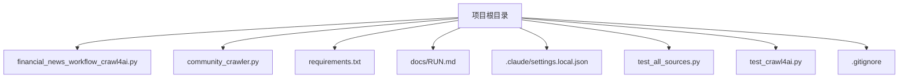
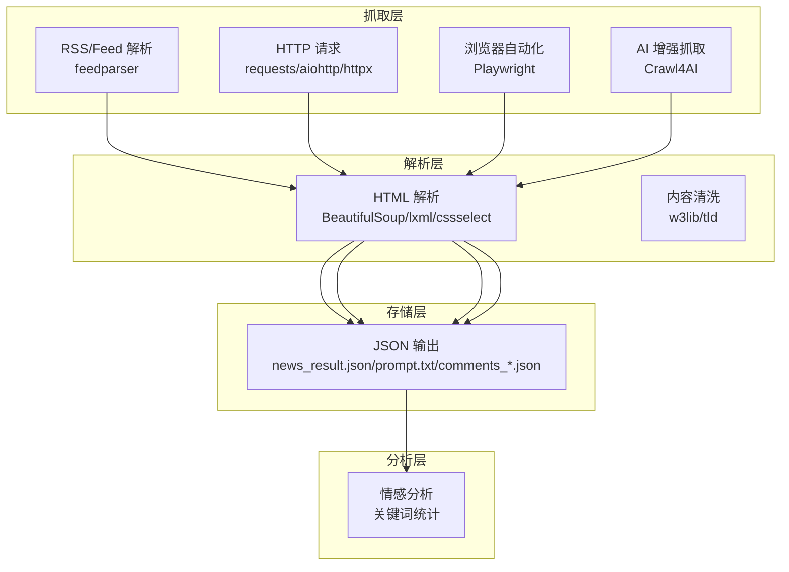
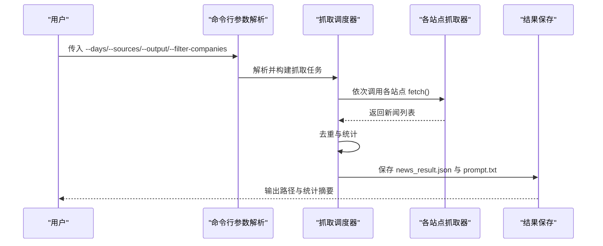
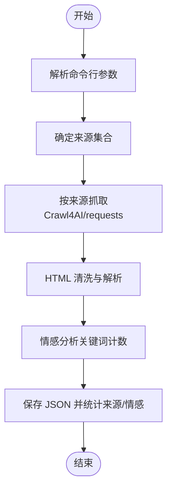
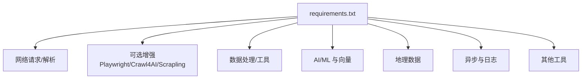

# 配置与部署

<cite>
**本文引用的文件**
- [.claude/settings.local.json](file://.claude/settings.local.json)
- [requirements.txt](file://requirements.txt)
- [docs/RUN.md](file://docs/RUN.md)
- [financial_news_workflow_crawl4ai.py](file://financial_news_workflow_crawl4ai.py)
- [community_crawler.py](file://community_crawler.py)
- [test_all_sources.py](file://test_all_sources.py)
- [test_crawl4ai.py](file://test_crawl4ai.py)
- [.gitignore](file://.gitignore)
- [design_philosophy.md](file://design/design_philosophy.md)
</cite>

## 目录
1. [简介](#简介)
2. [项目结构](#项目结构)
3. [核心组件](#核心组件)
4. [架构总览](#架构总览)
5. [详细组件分析](#详细组件分析)
6. [依赖分析](#依赖分析)
7. [性能考虑](#性能考虑)
8. [故障排查指南](#故障排查指南)
9. [结论](#结论)
10. [附录](#附录)

## 简介
本指南面向运维与开发人员，提供该金融新闻自动化工作流项目的完整配置与部署说明。内容覆盖：
- 配置文件结构与参数设置（Claude 配置、环境变量、运行参数）
- 不同部署环境（Windows/Linux/macOS）最佳实践
- 性能优化、资源管理与监控建议
- 容器化与云部署思路
- 安全配置、备份与灾难恢复
- 运维操作与排障要点

## 项目结构
该项目围绕“专业新闻抓取 + 社区论坛抓取”的工作流展开，核心脚本与依赖如下：
- 专业新闻抓取：financial_news_workflow_crawl4ai.py
- 社区论坛抓取：community_crawler.py
- 依赖管理：requirements.txt
- 运行说明：docs/RUN.md
- Claude 配置：.claude/settings.local.json
- 测试与验证：test_all_sources.py、test_crawl4ai.py
- 版本控制忽略项：.gitignore

图表来源
- [financial_news_workflow_crawl4ai.py](file://financial_news_workflow_crawl4ai.py)
- [community_crawler.py](file://community_crawler.py)
- [requirements.txt](file://requirements.txt)
- [docs/RUN.md](file://docs/RUN.md)
- [.claude/settings.local.json](file://.claude/settings.local.json)
- [test_all_sources.py](file://test_all_sources.py)
- [test_crawl4ai.py](file://test_crawl4ai.py)
- [.gitignore](file://.gitignore)

章节来源
- [docs/RUN.md](file://docs/RUN.md)
- [financial_news_workflow_crawl4ai.py](file://financial_news_workflow_crawl4ai.py)
- [community_crawler.py](file://community_crawler.py)

## 核心组件
- 专业新闻抓取工作流：基于多源 RSS/API/浏览器自动化抓取，支持参数化筛选与输出归档。
- 社区论坛抓取工作流：基于 requests/Crawl4AI 的混合策略，支持情感分析与结果保存。
- 依赖与环境：集中于 requirements.txt；Playwright 需单独安装；可选 Crawl4AI 增强能力。
- 运行与测试：提供命令行参数与测试脚本，便于快速验证环境与功能。

章节来源
- [financial_news_workflow_crawl4ai.py](file://financial_news_workflow_crawl4ai.py)
- [community_crawler.py](file://community_crawler.py)
- [requirements.txt](file://requirements.txt)
- [docs/RUN.md](file://docs/RUN.md)

## 架构总览
整体架构由“抓取层”“解析层”“存储层”“分析层”组成，结合命令行参数与可选增强库实现灵活部署。

图表来源
- [financial_news_workflow_crawl4ai.py](file://financial_news_workflow_crawl4ai.py)
- [community_crawler.py](file://community_crawler.py)
- [requirements.txt](file://requirements.txt)

## 详细组件分析

### 专业新闻抓取组件（financial_news_workflow_crawl4ai.py）
- 功能特性
  - 多源抓取：虎嗅网、36氪、钛媒体、界面新闻、极客公园、晚点 LatePost、澎湃新闻。
  - 抓取方式：RSS/requests/Playwright，满足不同站点的反爬与动态加载需求。
  - 参数化：支持天数、来源、输出目录、公司名过滤等。
  - 输出：统一 JSON 结构，含统计与去重逻辑。
- 关键参数
  - --days：抓取天数，默认值与默认来源见运行文档。
  - --sources：来源列表，支持 all 或逗号分隔的具体来源。
  - --output：输出基础目录（自动创建带时间戳子目录）。
  - --filter-companies：是否启用公司名过滤（默认关闭）。
- 输出产物
  - news_result.json：抓取结果与统计。
  - prompt.txt：分析提示词（若生成）。
- 依赖与安装
  - 核心依赖：requests、httpx、aiohttp、feedparser、beautifulsoup4、lxml、cssselect。
  - 可选增强：playwright、crawl4ai、scrapling 等。
  - Playwright 安装：npx playwright install chromium。

图表来源
- [financial_news_workflow_crawl4ai.py](file://financial_news_workflow_crawl4ai.py)

章节来源
- [financial_news_workflow_crawl4ai.py](file://financial_news_workflow_crawl4ai.py)
- [docs/RUN.md](file://docs/RUN.md)

### 社区论坛抓取组件（community_crawler.py）
- 功能特性
  - 支持雪球、知乎搜索与解析。
  - 混合抓取策略：优先 Crawl4AI（Playwright/HTTP 策略），回退 requests。
  - 情感分析：基于关键词统计的简易情感打分。
  - 输出：comments_<关键词>.json，含来源统计与情感分布。
- 关键参数
  - --keyword：必填关键词。
  - --sources：来源列表（默认 all，可选 xueqiu/zhihu）。
  - --output：输出基础目录（自动创建带时间戳子目录）。
- 依赖与安装
  - requests、BeautifulSoup（可选）、Crawl4AI（可选）。

图表来源
- [community_crawler.py](file://community_crawler.py)

章节来源
- [community_crawler.py](file://community_crawler.py)
- [docs/RUN.md](file://docs/RUN.md)

### 配置与运行参数
- Claude 配置（.claude/settings.local.json）
  - 用途：授予脚本在 Claude 环境下的 Bash 权限与 Web 访问权限，便于安装依赖、克隆技能、运行脚本等。
  - 注意：该文件为 Claude 本地配置，不参与本项目 Python 运行时的直接配置。
- 环境变量与本地配置
  - 仓库忽略文件包含 .env、.env.local、credentials.json，可用于存放敏感信息（如 API 密钥）。
  - 建议：在本地创建 .env.local，使用 python-dotenv 在运行时加载。
- 运行参数
  - 专业新闻：参考 docs/RUN.md 的命令与参数说明。
  - 社区抓取：参考 docs/RUN.md 的命令与参数说明。
- 依赖安装
  - 基础安装：pip install -r requirements.txt
  - 完整安装：pip install -r requirements.txt --upgrade
  - Playwright 安装：npx playwright install chromium
  - 验证安装：test_crawl4ai.py、test_all_sources.py

章节来源
- [.claude/settings.local.json](file://.claude/settings.local.json)
- [.gitignore](file://.gitignore)
- [requirements.txt](file://requirements.txt)
- [docs/RUN.md](file://docs/RUN.md)
- [test_crawl4ai.py](file://test_crawl4ai.py)
- [test_all_sources.py](file://test_all_sources.py)

## 依赖分析
- 核心依赖
  - 网络请求：requests、httpx、aiohttp
  - RSS 解析：feedparser
  - HTML 解析：beautifulsoup4、lxml、cssselect
  - 可选增强：playwright、crawl4ai、scrapling
- 数据处理与工具
  - JSON 加速：orjson
  - 数据清洗：w3lib、tld
  - 用户代理与指纹：fake-useragent、browserforge、apify-fingerprint-datapoints
  - 编解码与加密：chardet、pyOpenSSL、cryptography、cffi
  - HTTP/2 支持：httpcore、h2
  - AI/ML 与向量：numpy、pillow、scipy、scikit-learn、nltk、rank-bm25、snowballstemmer、litellm、openai、tiktoken、tokenizers、huggingface-hub、aiosqlite
  - 地理数据：alphashape、shapely、trimesh、networkx、rtree
  - 异步与日志：anyio、typing-extensions、rich、pygments
  - 其他：python-dotenv、xxhash、lark、regex、joblib、humanize、brotli、psutil、aiofiles、typer、click、click-log、markdown-it-py、jinja2、jsonschema、referencing、rpds-py、importlib-metadata、zipp、filelock、fsspec、hf-xet、mdurl、annotated-types、pydantic、pydantic-core、typing-inspection

图表来源
- [requirements.txt](file://requirements.txt)

章节来源
- [requirements.txt](file://requirements.txt)

## 性能考虑
- 并发与异步
  - 使用 aiohttp/httpx/aiofiles 等异步库提升网络请求效率。
  - 社区抓取采用 asyncio 并行抓取多个来源，减少总耗时。
- 抓取策略
  - 优先使用 RSS/API（feedparser/requests）降低浏览器开销。
  - Playwright 仅在必要时启用，避免不必要的浏览器启动成本。
- 输出与缓存
  - 自动创建带时间戳的输出目录，避免覆盖与冲突。
  - 去重与统计在内存中完成，注意大数据量时的内存占用。
- 资源管理
  - 控制并发来源数量与抓取天数，避免对目标站点造成压力。
  - 定期清理输出目录，防止磁盘空间不足。
- 监控建议
  - 结合日志输出与统计信息，观察抓取成功率与失败原因。
  - 对于 Crawl4AI，记录策略切换与回退路径，便于诊断。

章节来源
- [financial_news_workflow_crawl4ai.py](file://financial_news_workflow_crawl4ai.py)
- [community_crawler.py](file://community_crawler.py)
- [docs/RUN.md](file://docs/RUN.md)

## 故障排查指南
- Playwright 浏览器启动失败
  - 确保已执行 npx playwright install chromium。
  - 检查系统权限与管理员身份。
- 依赖安装失败
  - 升级 pip：pip install --upgrade pip。
  - 使用二进制安装：pip install --only-binary :all: -r requirements.txt。
  - 检查网络与镜像源。
- 抓取失败
  - 减少来源数量，逐步定位问题站点。
  - 查看命令行输出的错误信息与状态码。
- Crawl4AI 功能测试
  - 使用 test_crawl4ai.py 验证 Crawl4AI 安装与基本抓取能力。
- 源站连通性测试
  - 使用 test_all_sources.py 对各新闻源进行连通性与解析测试。

章节来源
- [docs/RUN.md](file://docs/RUN.md)
- [test_crawl4ai.py](file://test_crawl4ai.py)
- [test_all_sources.py](file://test_all_sources.py)

## 结论
本项目提供了完整的金融新闻与社区舆情抓取工作流，具备良好的可配置性与可扩展性。通过合理的依赖管理、参数化配置与测试验证，可在不同操作系统与环境中稳定运行。建议在生产环境中结合异步并发、资源限制与监控告警，确保抓取稳定性与合规性。

## 附录

### 部署环境最佳实践
- Windows
  - 使用 PowerShell/命令提示符，注意控制台编码修复。
  - Playwright 需要 Chromium，首次运行需安装。
  - 建议使用虚拟环境隔离依赖。
- Linux/macOS
  - 使用 bash/zsh，确保 Python 3.8+ 与 pip 最新版本。
  - 安装系统依赖（如 libglib2.0-dev、libnss3-dev 等）以支持浏览器自动化。
  - 使用 systemd/cron 定时任务调度抓取作业。

章节来源
- [docs/RUN.md](file://docs/RUN.md)
- [requirements.txt](file://requirements.txt)

### 安全配置建议
- 本地配置
  - 将敏感信息放入 .env/.env.local，并加入 .gitignore。
  - 使用 python-dotenv 在运行时加载环境变量。
- Claude 配置
  - 严格控制 Bash 权限范围，避免授予不必要的系统级权限。
- 网络与反爬
  - 设置合理的请求头与延时，遵守 robots.txt。
  - 使用代理池与 UA 池，避免单一 IP 被封禁。

章节来源
- [.gitignore](file://.gitignore)
- [.claude/settings.local.json](file://.claude/settings.local.json)
- [requirements.txt](file://requirements.txt)

### 备份与灾难恢复
- 备份策略
  - 定期备份输出目录（news_output_*、community_output_*）。
  - 备份 requirements.txt 与 .env.local，便于快速重建环境。
- 灾难恢复
  - 使用 requirements.txt 一键重建依赖。
  - 重新安装 Playwright 浏览器。
  - 通过测试脚本验证环境与功能。

章节来源
- [docs/RUN.md](file://docs/RUN.md)
- [requirements.txt](file://requirements.txt)
- [test_crawl4ai.py](file://test_crawl4ai.py)

### 容器化与云部署（思路）
- Docker 镜像
  - 基于官方 Python 镜像，安装系统依赖与 Playwright。
  - 将项目代码与 requirements.txt 复制到镜像内，执行 pip 安装。
  - 挂载输出目录到宿主机卷，持久化数据。
- Kubernetes
  - 使用 CronJob 定时触发抓取 Pod。
  - 通过 ConfigMap/Secret 管理配置与密钥。
- 云平台
  - AWS/GCP/Azure 上的无服务器或容器服务均可承载该工作流。
  - 结合对象存储（如 S3/Cloud Storage）保存输出文件。

[本节为概念性部署建议，不直接对应具体源文件]

### 设计哲学与内容创作
- 项目包含设计哲学文档，体现对金融视觉语言的理解与表达，有助于内容创作与品牌一致性。

章节来源
- [design_philosophy.md](file://design/design_philosophy.md)