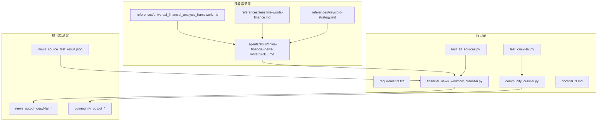
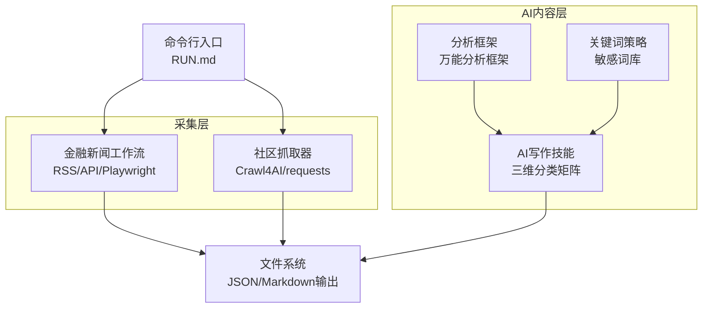
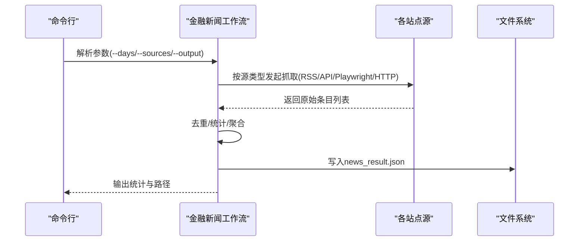
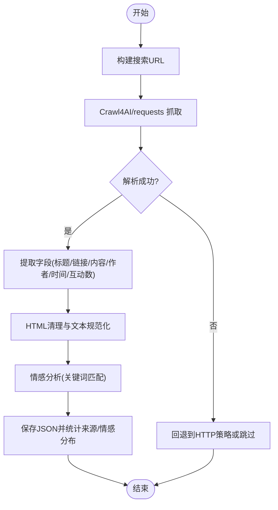
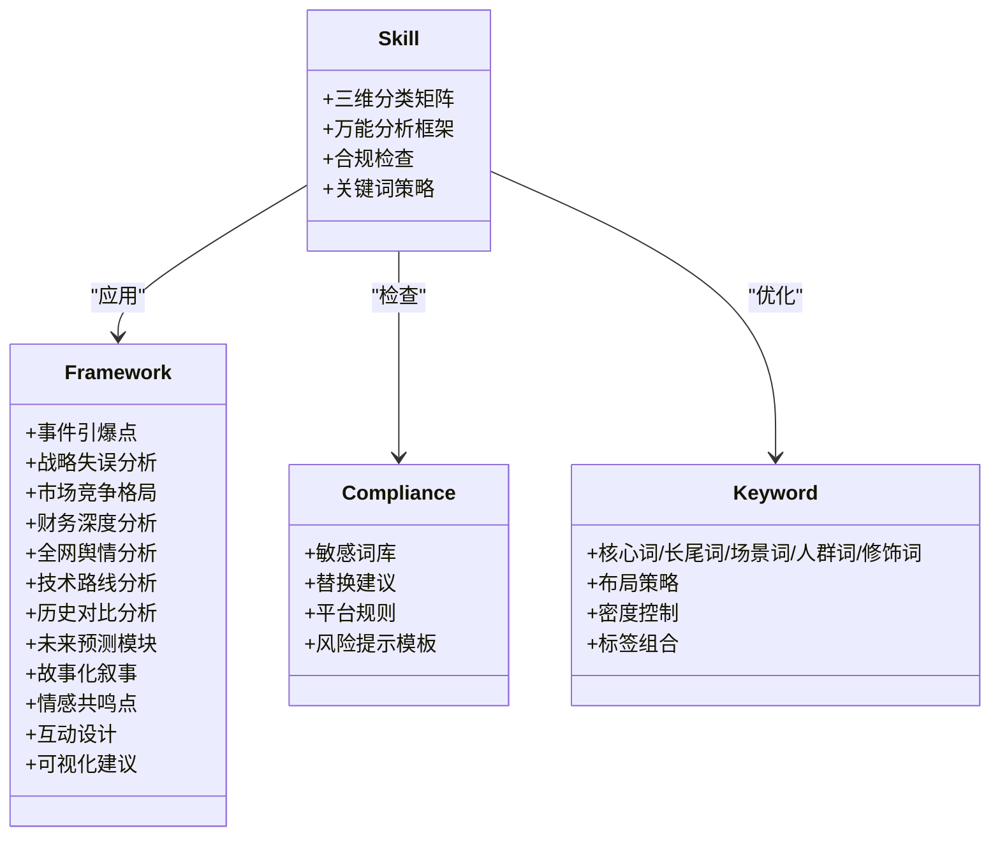
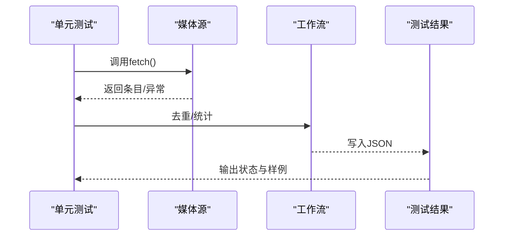

# 技术架构概览

<cite>
**本文引用的文件**
- [requirements.txt](file://requirements.txt)
- [community_crawler.py](file://community_crawler.py)
- [financial_news_workflow_crawl4ai.py](file://financial_news_workflow_crawl4ai.py)
- [test_all_sources.py](file://test_all_sources.py)
- [test_crawl4ai.py](file://test_crawl4ai.py)
- [design_philosophy.md](file://design/design_philosophy.md)
- [RUN.md](file://docs/RUN.md)
- [SKILL.md](file://.agents/skills/china-financial-news-writer/SKILL.md)
- [universal_financial_analysis_framework.md](file://.agents/skills/china-financial-news-writer/references/universal_financial_analysis_framework.md)
- [sensitive-words-finance.md](file://.agents/skills/china-financial-news-writer/references/sensitive-words-finance.md)
- [keyword-strategy.md](file://.agents/skills/china-financial-news-writer/references/keyword-strategy.md)
- [news_source_test_result.json](file://news_source_test_result.json)
</cite>

## 目录
1. [引言](#引言)
2. [项目结构](#项目结构)
3. [核心组件](#核心组件)
4. [架构总览](#架构总览)
5. [详细组件分析](#详细组件分析)
6. [依赖关系分析](#依赖关系分析)
7. [性能考量](#性能考量)
8. [故障排查指南](#故障排查指南)
9. [结论](#结论)
10. [附录](#附录)

## 引言
本文件面向Redbook系统的技术架构概览，聚焦于前端界面、后端服务、数据存储与第三方集成的整体设计。系统采用Python生态系统构建，结合爬虫技术栈与AI集成方案，形成“新闻采集-社区舆情-内容生成”的闭环工作流。文档旨在帮助开发者快速理解系统模块化设计、组件交互关系与数据流向，并提供可扩展性、性能与安全方面的实践建议。

## 项目结构
项目采用按功能模块划分的目录结构，核心脚本位于根目录，技能与参考材料位于“.agents/skills”目录，文档与运行说明位于“docs”目录，输出结果按时间戳自动归档至独立子目录。

**图表来源**
- [community_crawler.py](file://community_crawler.py)
- [financial_news_workflow_crawl4ai.py](file://financial_news_workflow_crawl4ai.py)
- [test_all_sources.py](file://test_all_sources.py)
- [test_crawl4ai.py](file://test_crawl4ai.py)
- [SKILL.md](file://.agents/skills/china-financial-news-writer/SKILL.md)
- [universal_financial_analysis_framework.md](file://.agents/skills/china-financial-news-writer/references/universal_financial_analysis_framework.md)
- [sensitive-words-finance.md](file://.agents/skills/china-financial-news-writer/references/sensitive-words-finance.md)
- [keyword-strategy.md](file://.agents/skills/china-financial-news-writer/references/keyword-strategy.md)
- [news_source_test_result.json](file://news_source_test_result.json)

**章节来源**
- [RUN.md](file://docs/RUN.md)
- [requirements.txt](file://requirements.txt)

## 核心组件
- 专业新闻采集工作流：从多家权威媒体抓取热点新闻，支持RSS、API与动态渲染等多种抓取策略，具备去重与统计功能。
- 社区论坛抓取器：从雪球、知乎等社区抓取用户评论，支持Crawl4AI增强抓取与传统HTTP抓取双通道，内置情感分析与结果保存。
- AI写作技能：基于三维分类矩阵与万能分析框架，提供合规检查、关键词优化与多平台风格输出。
- 测试与验证：提供媒体源连通性测试、Crawl4AI功能测试，辅助定位依赖与网络问题。

**章节来源**
- [financial_news_workflow_crawl4ai.py](file://financial_news_workflow_crawl4ai.py)
- [community_crawler.py](file://community_crawler.py)
- [SKILL.md](file://.agents/skills/china-financial-news-writer/SKILL.md)
- [test_all_sources.py](file://test_all_sources.py)
- [test_crawl4ai.py](file://test_crawl4ai.py)

## 架构总览
系统采用“脚本驱动 + 多策略抓取 + AI内容生成”的分层架构：
- 前端界面：系统以命令行为主，辅以输出目录中的JSON与Markdown文件作为“界面”，便于人工审阅与二次加工。
- 后端服务：无独立后端服务进程，核心逻辑以Python脚本形式运行，通过参数化接口与定时任务调度。
- 数据存储：抓取结果以JSON文件落地，按时间戳归档；AI生成内容以Markdown文件输出。
- 第三方集成：集成Crawl4AI、Playwright、RSS订阅、HTTP客户端等，满足不同站点的反爬与动态内容需求。

**图表来源**
- [financial_news_workflow_crawl4ai.py](file://financial_news_workflow_crawl4ai.py)
- [community_crawler.py](file://community_crawler.py)
- [SKILL.md](file://.agents/skills/china-financial-news-writer/SKILL.md)
- [universal_financial_analysis_framework.md](file://.agents/skills/china-financial-news-writer/references/universal_financial_analysis_framework.md)
- [keyword-strategy.md](file://.agents/skills/china-financial-news-writer/references/keyword-strategy.md)
- [sensitive-words-finance.md](file://.agents/skills/china-financial-news-writer/references/sensitive-words-finance.md)
- [RUN.md](file://docs/RUN.md)

## 详细组件分析

### 专业新闻采集工作流
- 多源适配：支持RSS（虎嗅、钛媒体、界面）、API（36氪）、动态渲染（极客公园、晚点）与常规HTTP（澎湃新闻）。
- 抓取策略：根据站点特性选择feedparser、requests或Playwright；对动态内容优先使用Playwright。
- 数据处理：统一抽取标题、链接、摘要与发布时间，进行去重与来源统计，输出JSON文件。
- 参数化运行：支持天数过滤、来源选择、输出目录等参数，便于批量与自动化。

**图表来源**
- [financial_news_workflow_crawl4ai.py](file://financial_news_workflow_crawl4ai.py)
- [RUN.md](file://docs/RUN.md)

**章节来源**
- [financial_news_workflow_crawl4ai.py](file://financial_news_workflow_crawl4ai.py)
- [test_all_sources.py](file://test_all_sources.py)
- [news_source_test_result.json](file://news_source_test_result.json)

### 社区论坛抓取器
- 多源聚合：支持雪球、知乎，统一抽取标题、链接、内容、作者、时间、互动数等字段。
- 抓取通道：优先使用Crawl4AI（Playwright策略）应对复杂反爬与动态内容；回退至requests。
- 数据清洗：HTML清理、实体解码、空白规范化，提升可读性。
- 情感分析：内置简单关键词匹配，输出正向/负向/中性标签与分数。
- 结果保存：按时间戳创建输出目录，保存JSON与统计信息。

**图表来源**
- [community_crawler.py](file://community_crawler.py)

**章节来源**
- [community_crawler.py](file://community_crawler.py)

### AI写作技能与内容生成
- 三维分类矩阵：公司类型×新闻类型×输出风格，自动匹配写作框架与模板。
- 万能分析框架：12大模块覆盖事件、战略、竞争、财务、舆情、技术、历史、预测、故事、情感、互动、可视化。
- 合规检查：内置敏感词库与替换建议，提供平台合规模板与风险提示。
- 关键词策略：核心词、长尾词、场景词、人群词与修饰词的布局与密度控制。

**图表来源**
- [SKILL.md](file://.agents/skills/china-financial-news-writer/SKILL.md)
- [universal_financial_analysis_framework.md](file://.agents/skills/china-financial-news-writer/references/universal_financial_analysis_framework.md)
- [sensitive-words-finance.md](file://.agents/skills/china-financial-news-writer/references/sensitive-words-finance.md)
- [keyword-strategy.md](file://.agents/skills/china-financial-news-writer/references/keyword-strategy.md)

**章节来源**
- [SKILL.md](file://.agents/skills/china-financial-news-writer/SKILL.md)
- [universal_financial_analysis_framework.md](file://.agents/skills/china-financial-news-writer/references/universal_financial_analysis_framework.md)
- [sensitive-words-finance.md](file://.agents/skills/china-financial-news-writer/references/sensitive-words-finance.md)
- [keyword-strategy.md](file://.agents/skills/china-financial-news-writer/references/keyword-strategy.md)

### 测试与验证
- 媒体源测试：遍历7大媒体源，记录状态、数量与示例，辅助定位解析与网络问题。
- Crawl4AI测试：验证HTTP策略抓取、复杂网页抓取与AI增强能力，指导依赖与网络配置。

**图表来源**
- [test_all_sources.py](file://test_all_sources.py)
- [financial_news_workflow_crawl4ai.py](file://financial_news_workflow_crawl4ai.py)
- [news_source_test_result.json](file://news_source_test_result.json)

**章节来源**
- [test_all_sources.py](file://test_all_sources.py)
- [test_crawl4ai.py](file://test_crawl4ai.py)
- [news_source_test_result.json](file://news_source_test_result.json)

## 依赖关系分析
系统依赖以requirements.txt集中管理，涵盖网络请求、HTML解析、反爬增强、AI/ML、日志与工具等模块。Crawl4AI与Playwright用于复杂站点抓取，feedparser用于RSS订阅，requests用于常规HTTP抓取。

```mermaid
graph TB
REQ["requirements.txt"]
NET["网络请求<br/>requests/aiohttp/httpx"]
HTML["HTML解析<br/>beautifulsoup4/lxml/cssselect"]
ENH["反爬增强<br/>scrapling/playwright-stealth"]
PW["浏览器自动化<br/>playwright"]
C4AI["AI抓取引擎<br/>crawl4ai"]
DATA["数据处理<br/>orjson/w3lib/tld"]
ML["AI/ML<br/>numpy/pillow/scipy/sklearn/nltk/rank-bm25"]
LLM["大模型调用<br/>litellm/openai/tiktoken/tokenizers/huggingface-hub"]
VDB["向量数据库<br/>aiosqlite"]
GEO["地理数据处理<br/>alphashape/shapely/trimesh/networkx/rtree"]
LOG["日志与终端<br/>rich/pygments"]
TOOL["工具集<br/>python-dotenv/xxhash/lark/regex/joblib/humanize/brotli/psutil/aiofiles/typer/click"]
REQ --> NET
REQ --> HTML
REQ --> ENH
REQ --> PW
REQ --> C4AI
REQ --> DATA
REQ --> ML
REQ --> LLM
REQ --> VDB
REQ --> GEO
REQ --> LOG
REQ --> TOOL
```

**图表来源**
- [requirements.txt](file://requirements.txt)

**章节来源**
- [requirements.txt](file://requirements.txt)

## 性能考量
- 抓取并发与超时：合理设置超时与并发限制，避免对目标站点造成压力；对动态站点优先使用Playwright，提高成功率。
- 数据去重与缓存：工作流内置去重逻辑，建议结合本地缓存与增量抓取策略降低重复开销。
- 输出归档：按时间戳创建输出目录，便于版本管理与回溯。
- 依赖优化：定期更新依赖，关注兼容性与性能改进；对大型AI库按需安装，避免不必要的资源占用。

[本节为通用性能建议，无需特定文件引用]

## 故障排查指南
- 抓取失败：检查网络连接、目标站点可访问性与反爬策略；缩小来源范围或调整参数；查看命令行输出的错误信息。
- Playwright启动失败：确认已安装Chromium浏览器；以管理员权限运行；检查系统权限与防火墙设置。
- 依赖安装失败：升级pip版本；尝试二进制安装；检查网络稳定性与镜像源。
- 媒体源异常：参考测试结果JSON，定位具体站点状态与错误原因；必要时调整解析规则或切换抓取策略。

**章节来源**
- [RUN.md](file://docs/RUN.md)
- [test_all_sources.py](file://test_all_sources.py)
- [news_source_test_result.json](file://news_source_test_result.json)

## 结论
Redbook系统通过Python脚本化与多策略抓取，实现了从权威媒体到社区论坛的全链路信息采集，并借助AI写作技能完成内容生成与合规优化。系统采用模块化设计，组件边界清晰、职责单一，便于扩展与维护。建议在生产环境中加强日志与监控、完善异常处理与重试机制，并持续优化抓取策略与AI内容质量。

[本节为总结性内容，无需特定文件引用]

## 附录
- 运行与使用：参考运行文档，了解命令行参数与输出规范。
- 设计哲学：设计文档体现系统在视觉与内容上的理念，有助于理解内容风格与呈现方式。

**章节来源**
- [RUN.md](file://docs/RUN.md)
- [design_philosophy.md](file://design/design_philosophy.md)