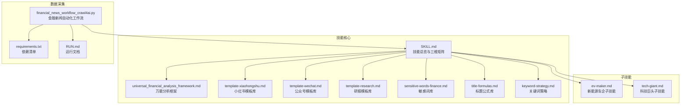
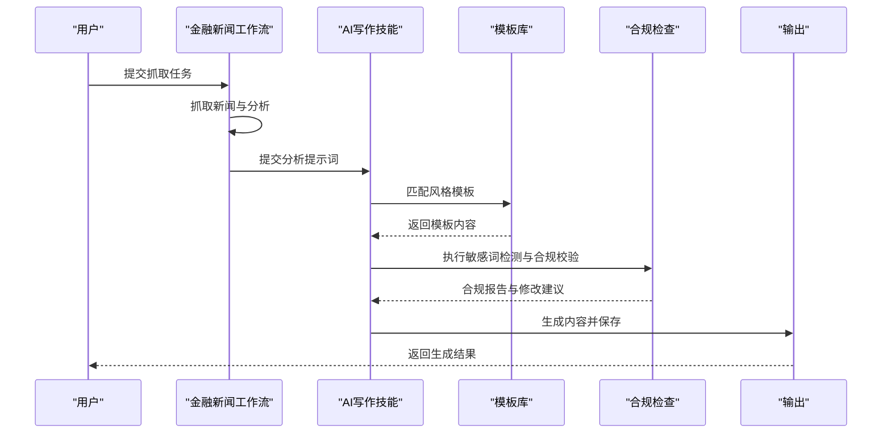
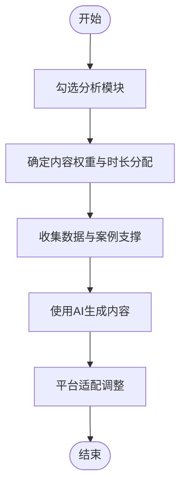
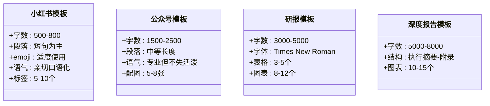
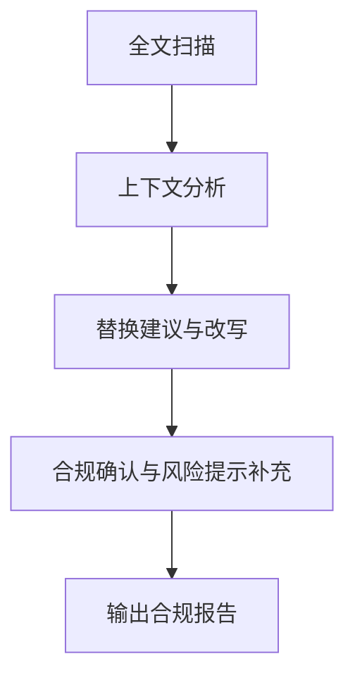
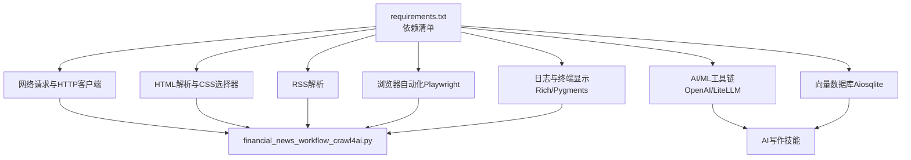

# AI内容生成系统

<cite>
**本文档引用的文件**
- [SKILL.md](file://.agents/skills/china-financial-news-writer/SKILL.md)
- [universal_financial_analysis_framework.md](file://.agents/skills/china-financial-news-writer/references/universal_financial_analysis_framework.md)
- [template-xiaohongshu.md](file://.agents/skills/china-financial-news-writer/references/template-xiaohongshu.md)
- [template-wechat.md](file://.agents/skills/china-financial-news-writer/references/template-wechat.md)
- [template-research.md](file://.agents/skills/china-financial-news-writer/references/template-research.md)
- [sensitive-words-finance.md](file://.agents/skills/china-financial-news-writer/references/sensitive-words-finance.md)
- [title-formulas.md](file://.agents/skills/china-financial-news-writer/references/title-formulas.md)
- [keyword-strategy.md](file://.agents/skills/china-financial-news-writer/references/keyword-strategy.md)
- [ev-maker.md](file://.agents/skills/china-financial-news-writer/subskills/ev-maker.md)
- [tech-giant.md](file://.agents/skills/china-financial-news-writer/subskills/tech-giant.md)
- [financial_news_workflow_crawl4ai.py](file://financial_news_workflow_crawl4ai.py)
- [requirements.txt](file://requirements.txt)
- [RUN.md](file://docs/RUN.md)
- [design_philosophy.md](file://design/design_philosophy.md)
</cite>

## 目录
1. [简介](#简介)
2. [项目结构](#项目结构)
3. [核心组件](#核心组件)
4. [架构总览](#架构总览)
5. [详细组件分析](#详细组件分析)
6. [依赖关系分析](#依赖关系分析)
7. [性能考量](#性能考量)
8. [故障排除指南](#故障排除指南)
9. [结论](#结论)
10. [附录](#附录)

## 简介
本系统为Redbook平台的AI内容生成系统，专注于中国金融新闻的自动化写作。系统采用“万能分析框架”作为核心分析引擎，结合“多风格模板匹配”实现不同平台（小红书、公众号、研报简报、深度报告）的定制化内容生成；通过“合规检查机制”和“敏感词过滤系统”保障内容安全；利用“自然语言处理技术”实现风格转换与质量评估；并通过“模板库管理”和“多平台适配策略”实现高效的内容规模化生产。

## 项目结构
系统围绕“技能（Skill）+ 参考资料（References）+ 子技能（Subskills）+ 工作流脚本”的结构组织，形成从数据采集到内容生成再到合规审核的完整闭环。

**图表来源**
- [SKILL.md:1-476](file://.agents/skills/china-financial-news-writer/SKILL.md#L1-L476)
- [financial_news_workflow_crawl4ai.py:1-454](file://financial_news_workflow_crawl4ai.py#L1-L454)
- [requirements.txt:1-144](file://requirements.txt#L1-L144)
- [RUN.md:1-252](file://docs/RUN.md#L1-L252)

**章节来源**
- [SKILL.md:1-476](file://.agents/skills/china-financial-news-writer/SKILL.md#L1-L476)
- [RUN.md:1-252](file://docs/RUN.md#L1-L252)

## 核心组件
- 万能分析框架：提供12大模块的通用分析模板，覆盖事件引爆点、战略失误、市场竞争、财务分析、舆情分析、技术路线、历史对比、未来预测、故事化叙事、情感共鸣、互动设计、可视化建议等，适用于任何公司危机事件。
- 多风格模板匹配：针对不同输出风格（小红书、公众号、研报简报、深度报告）提供标准化模板，确保内容在不同平台的表达一致性与专业度。
- 合规检查机制：内置敏感词检测与替换、投资建议合规、数据来源标注、风险提示模板，满足平台与监管要求。
- 敏感词过滤系统：按高危、中危、低危分级管理，提供安全表述替换表与合规确认流程。
- 自然语言处理技术：通过标题公式、关键词策略、风格转换算法实现内容的可读性、传播性与合规性的平衡。
- 模板库管理：统一管理各类模板与参考资料，支持版本演进与平台适配。
- 多平台适配策略：针对小红书的社交化表达、公众号的专业深度、研报的严谨格式、深度报告的全景分析，提供差异化内容策略。

**章节来源**
- [universal_financial_analysis_framework.md:1-126](file://.agents/skills/china-financial-news-writer/references/universal_financial_analysis_framework.md#L1-L126)
- [template-xiaohongshu.md:1-424](file://.agents/skills/china-financial-news-writer/references/template-xiaohongshu.md#L1-L424)
- [template-wechat.md:1-518](file://.agents/skills/china-financial-news-writer/references/template-wechat.md#L1-L518)
- [template-research.md:1-459](file://.agents/skills/china-financial-news-writer/references/template-research.md#L1-L459)
- [sensitive-words-finance.md:1-317](file://.agents/skills/china-financial-news-writer/references/sensitive-words-finance.md#L1-L317)
- [title-formulas.md:1-288](file://.agents/skills/china-financial-news-writer/references/title-formulas.md#L1-L288)
- [keyword-strategy.md:1-302](file://.agents/skills/china-financial-news-writer/references/keyword-strategy.md#L1-L302)

## 架构总览
系统采用“数据采集-分析建模-模板匹配-合规检查-生成输出”的流水线架构，前端通过工作流脚本抓取新闻，后端通过技能引擎进行分析与生成，最终输出符合平台规范的内容。

**图表来源**
- [financial_news_workflow_crawl4ai.py:405-454](file://financial_news_workflow_crawl4ai.py#L405-L454)
- [SKILL.md:24-52](file://.agents/skills/china-financial-news-writer/SKILL.md#L24-L52)

## 详细组件分析

### 万能分析框架（Universal Financial Analysis Framework）
- 核心模块：事件引爆点、战略失误分析、市场竞争格局、财务深度分析、全网舆情分析、技术路线分析、历史对比分析、未来预测模块、故事化叙事、情感共鸣点、互动设计、图表模板库。
- 使用流程：内容勾选→优先级排序→数据收集→内容生成→平台适配。
- 适用场景：企业危机事件、行业分析、投资研究、内容创作。

**图表来源**
- [universal_financial_analysis_framework.md:105-121](file://.agents/skills/china-financial-news-writer/references/universal_financial_analysis_framework.md#L105-L121)

**章节来源**
- [universal_financial_analysis_framework.md:1-126](file://.agents/skills/china-financial-news-writer/references/universal_financial_analysis_framework.md#L1-L126)

### 多风格模板匹配（Multi-style Template Matching）
- 小红书风格：500-800字，短段落+emoji+口语化，强调互动与共鸣。
- 公众号风格：1500-2500字，专业但不失活泼，包含导语、分析、投资建议与风险提示。
- 研报简报风格：3000-5000字，Times New Roman格式，强调数据密集与图表可视化。
- 深度报告风格：5000-8000字，全景分析框架，包含执行摘要、事件引爆点、战略失误分析、市场竞争格局、技术路线分析、历史对比、未来预测、故事化叙事与附录。

**图表来源**
- [template-xiaohongshu.md:1-424](file://.agents/skills/china-financial-news-writer/references/template-xiaohongshu.md#L1-L424)
- [template-wechat.md:1-518](file://.agents/skills/china-financial-news-writer/references/template-wechat.md#L1-L518)
- [template-research.md:1-459](file://.agents/skills/china-financial-news-writer/references/template-research.md#L1-L459)

**章节来源**
- [template-xiaohongshu.md:1-424](file://.agents/skills/china-financial-news-writer/references/template-xiaohongshu.md#L1-L424)
- [template-wechat.md:1-518](file://.agents/skills/china-financial-news-writer/references/template-wechat.md#L1-L518)
- [template-research.md:1-459](file://.agents/skills/china-financial-news-writer/references/template-research.md#L1-L459)

### 合规检查机制（Compliance Check Mechanism）
- 敏感词扫描：高危词（封号/处罚风险）、中危词（限流风险）、低危词（可能延迟审核）分级管理。
- 投资建议合规：禁止承诺收益、必须提示风险、免责声明。
- 数据来源标注：确保所有数据可追溯。
- 风险提示模板：小红书、公众号、研报分别提供标准模板。

**图表来源**
- [sensitive-words-finance.md:270-294](file://.agents/skills/china-financial-news-writer/references/sensitive-words-finance.md#L270-L294)

**章节来源**
- [sensitive-words-finance.md:1-317](file://.agents/skills/china-financial-news-writer/references/sensitive-words-finance.md#L1-L317)

### 敏感词过滤系统（Sensitive Word Filtering System）
- 高危词汇：涉及非法荐股、内幕交易、虚假宣传等，直接封号/处罚。
- 中危词汇：绝对化用语、投资建议类、预测类，存在限流风险。
- 低危词汇：借贷、理财产品、期货外汇、数字货币等，需谨慎表述。
- 安全表述替换：提供安全替换词与改写建议，确保替换后通顺。

**章节来源**
- [sensitive-words-finance.md:1-317](file://.agents/skills/china-financial-news-writer/references/sensitive-words-finance.md#L1-L317)

### 自然语言处理技术（NLP in Financial Content Generation）
- 标题公式：数字具象型、事件+观点型、对比反差型、提问悬念型、身份权威型、情绪共鸣型、场景代入型、清单合集型，覆盖小红书、公众号、研报的平台适配规则。
- 关键词策略：核心词、长尾词、场景词、人群词、修饰词的布局与密度控制，确保SEO友好与可读性平衡。
- 风格转换算法：通过模板库与平台规则实现从专业到口语、从数据到故事的风格切换。

**章节来源**
- [title-formulas.md:1-288](file://.agents/skills/china-financial-news-writer/references/title-formulas.md#L1-L288)
- [keyword-strategy.md:1-302](file://.agents/skills/china-financial-news-writer/references/keyword-strategy.md#L1-L302)

### 模板库管理（Template Library Management）
- 统一管理：模板库与参考资料分离，便于版本演进与维护。
- 平台适配：针对不同平台制定差异化模板与规范，确保输出质量与合规性。
- 版本控制：通过文件命名与版本号管理模板变更，支持回溯与审计。

**章节来源**
- [template-xiaohongshu.md:1-424](file://.agents/skills/china-financial-news-writer/references/template-xiaohongshu.md#L1-L424)
- [template-wechat.md:1-518](file://.agents/skills/china-financial-news-writer/references/template-wechat.md#L1-L518)
- [template-research.md:1-459](file://.agents/skills/china-financial-news-writer/references/template-research.md#L1-L459)

### 内容定制化生成（Customized Content Generation）
- 三维分类矩阵：公司类型×新闻类型×输出风格，自动匹配最优写作框架与模板。
- 子技能支持：新能源车企与科技巨头子技能提供行业特异性分析要点与写作侧重点。
- 深度情报搜集：全网6维情报网（新闻/视频/社交/论坛/官方/数据）辅助事件梳理与观点汇总。

**章节来源**
- [SKILL.md:24-52](file://.agents/skills/china-financial-news-writer/SKILL.md#L24-L52)
- [ev-maker.md:1-398](file://.agents/skills/china-financial-news-writer/subskills/ev-maker.md#L1-L398)
- [tech-giant.md:1-345](file://.agents/skills/china-financial-news-writer/subskills/tech-giant.md#L1-L345)

### 多平台适配策略（Multi-platform Adaptation Strategy）
- 小红书：强调情绪词、口语化、互动引导与标签布局。
- 公众号：强调专业深度、数据解读、导语与风险提示。
- 研报：强调格式规范、数据表格、图表与免责声明。
- 深度报告：强调全景分析、历史对比与故事化叙事。

**章节来源**
- [template-xiaohongshu.md:1-424](file://.agents/skills/china-financial-news-writer/references/template-xiaohongshu.md#L1-L424)
- [template-wechat.md:1-518](file://.agents/skills/china-financial-news-writer/references/template-wechat.md#L1-L518)
- [template-research.md:1-459](file://.agents/skills/china-financial-news-writer/references/template-research.md#L1-L459)

## 依赖关系分析
系统依赖涵盖网络请求、HTML解析、RSS解析、浏览器自动化、AI/ML工具链、向量数据库、日志与终端显示等多个方面，确保数据采集、处理与生成的稳定性与扩展性。

**图表来源**
- [requirements.txt:1-144](file://requirements.txt#L1-L144)
- [financial_news_workflow_crawl4ai.py:30-58](file://financial_news_workflow_crawl4ai.py#L30-L58)

**章节来源**
- [requirements.txt:1-144](file://requirements.txt#L1-L144)
- [financial_news_workflow_crawl4ai.py:30-58](file://financial_news_workflow_crawl4ai.py#L30-L58)

## 性能考量
- 数据采集性能：通过多源并行抓取与去重策略，减少重复数据与网络开销。
- 模板渲染性能：模板库标准化与缓存机制，降低生成时的计算成本。
- 合规检查性能：敏感词分级扫描与批量替换，提高检测效率。
- 平台适配性能：模板预设与规则化处理，减少动态生成的复杂度。

## 故障排除指南
- 抓取失败：检查网络连接、目标网站可访问性、减少并发来源、查看命令行错误信息。
- Playwright浏览器启动失败：确保已安装Chromium、检查系统权限、以管理员身份运行。
- 依赖安装失败：升级pip、使用二进制安装、检查网络连接。
- 平台合规问题：遵循敏感词库与风险提示模板，确保内容不包含违规表述。

**章节来源**
- [RUN.md:144-188](file://docs/RUN.md#L144-L188)

## 结论
本系统通过“万能分析框架+多风格模板+合规检查+敏感词过滤+NLP技术+模板库管理+多平台适配”的完整体系，实现了中国金融新闻的自动化、专业化与合规化生产。系统具备良好的扩展性与维护性，能够快速响应市场变化与平台规则更新，为内容创作者提供高效、可靠、合规的AI写作解决方案。

## 附录
- 设计哲学：以“Flux Economics”为视觉与内容表达的哲学基础，强调金融内容的分析性与视觉冲击力的平衡。
- 运行文档：提供完整的安装、运行与故障排除指南，确保系统稳定可用。

**章节来源**
- [design_philosophy.md:1-16](file://design/design_philosophy.md#L1-L16)
- [RUN.md:1-252](file://docs/RUN.md#L1-L252)