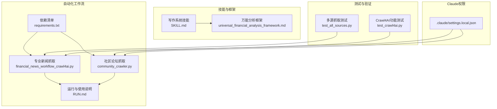
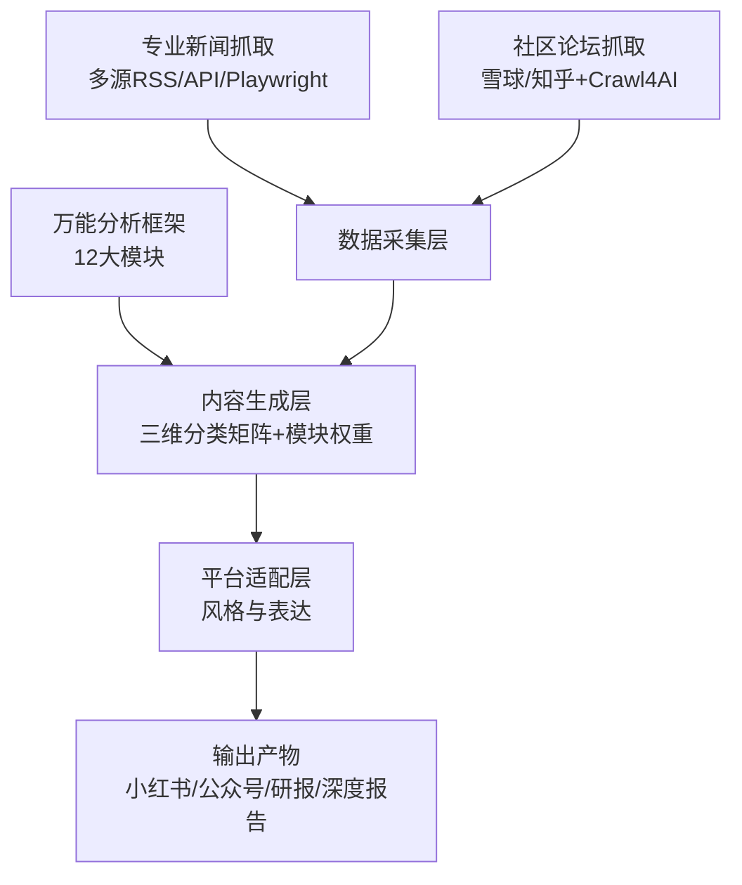
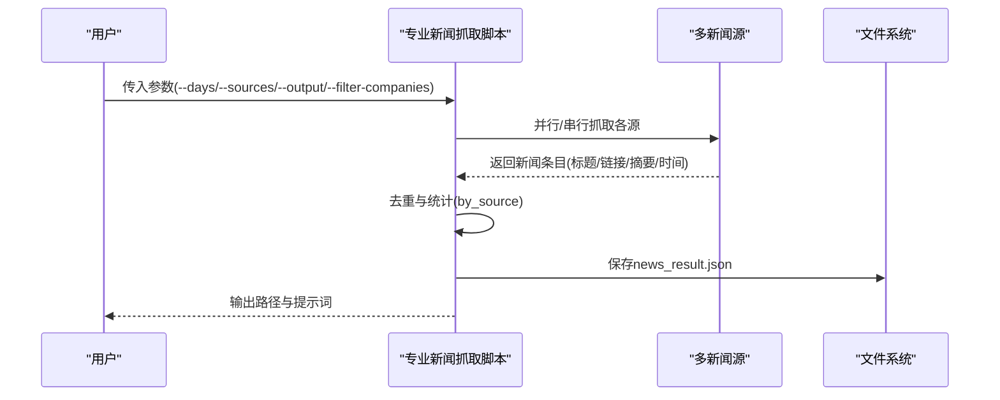
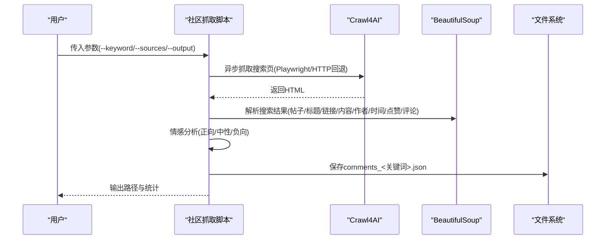
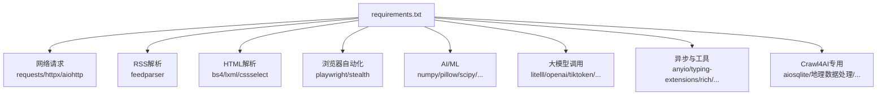

# 万能分析框架

<cite>
**本文引用的文件**   
- [universal_financial_analysis_framework.md](file://.agents/skills/china-financial-news-writer/references/universal_financial_analysis_framework.md)
- [SKILL.md](file://.agents/skills/china-financial-news-writer/SKILL.md)
- [financial_news_workflow_crawl4ai.py](file://financial_news_workflow_crawl4ai.py)
- [community_crawler.py](file://community_crawler.py)
- [RUN.md](file://docs/RUN.md)
- [requirements.txt](file://requirements.txt)
- [test_all_sources.py](file://test_all_sources.py)
- [test_crawl4ai.py](file://test_crawl4ai.py)
- [.claude/settings.local.json](file://.claude/settings.local.json)
</cite>

## 目录
1. [简介](#简介)
2. [项目结构](#项目结构)
3. [核心组件](#核心组件)
4. [架构总览](#架构总览)
5. [详细组件分析](#详细组件分析)
6. [依赖分析](#依赖分析)
7. [性能考虑](#性能考虑)
8. [故障排查指南](#故障排查指南)
9. [结论](#结论)
10. [附录](#附录)

## 简介
本文件面向Redbook系统的“万能分析框架”，系统化阐述12大模块的设计原理、适用场景、分析维度与权重分配，并结合平台类型（B站、小红书、公众号、深度报告）给出模块组合与时长分配建议。框架以“事件诊断”为起点，贯穿“战略分析、竞争格局、技术路线、财务分析、市场趋势”等核心模块，最终落到“故事化叙事、情感共鸣、互动设计”与“可视化图表模板库”的表达与落地。配套的自动化工作流提供专业新闻抓取与社区舆情抓取能力，支撑从数据采集到内容生成的闭环。

## 项目结构
- 技能与框架参考
  - 万能分析框架定义与平台适配指南
  - 写作系统技能文档（三维分类矩阵、模块权重、输出风格）
- 自动化工作流
  - 专业新闻抓取脚本（多源RSS/API/Playwright）
  - 社区论坛抓取脚本（雪球、知乎，含Crawl4AI增强）
  - 运行与依赖说明文档
- 测试与验证
  - 多源抓取测试、Crawl4AI功能测试

**图表来源**
- [universal_financial_analysis_framework.md:1-126](file://.agents/skills/china-financial-news-writer/references/universal_financial_analysis_framework.md#L1-L126)
- [SKILL.md:1-476](file://.agents/skills/china-financial-news-writer/SKILL.md#L1-L476)
- [financial_news_workflow_crawl4ai.py:1-454](file://financial_news_workflow_crawl4ai.py#L1-L454)
- [community_crawler.py:1-604](file://community_crawler.py#L1-L604)
- [RUN.md:1-252](file://docs/RUN.md#L1-L252)
- [requirements.txt:1-144](file://requirements.txt#L1-L144)
- [test_all_sources.py:1-49](file://test_all_sources.py#L1-L49)
- [test_crawl4ai.py:1-163](file://test_crawl4ai.py#L1-L163)
- [.claude/settings.local.json:1-51](file://.claude/settings.local.json#L1-L51)

**章节来源**
- [RUN.md:1-252](file://docs/RUN.md#L1-L252)

## 核心组件
- 万能分析框架（12大模块）
  - 事件引爆点、战略失误分析、市场竞争格局
  - 财务深度分析、全网舆情分析
  - 技术路线分析、历史对比分析、未来预测模块
  - 故事化叙事、情感共鸣点、互动设计
  - 图表模板库（财务、市场份额、时间趋势、对比分析、地理信息图）
- 平台适配指南
  - B站风格：故事化+数据可视化+互动设计
  - 小红书风格：个人体验+实用建议+情感共鸣
  - 公众号风格：深度分析+专业观点+长文阅读
  - 深度报告：全模块覆盖，强调数据与逻辑严谨性
- 三维分类矩阵（公司类型×新闻类型×输出风格）
  - 公司类型：科技巨头、新能源车企、消费品牌、金融券商
  - 新闻类型：财报分析、产品发布、行业动态、政策影响
  - 输出风格：小红书、公众号、研报简报、深度报告
- 模块权重与时长分配（示例）
  - B站视频：事件1分钟+分析3分钟+对比2分钟+技术2分钟+故事1分钟+互动1分钟
  - 小红书：事件+分析+对比+故事+共鸣
  - 公众号：事件+分析+数据+技术+历史+展望
  - 深度报告：全模块按重要性权重分配

**章节来源**
- [universal_financial_analysis_framework.md:1-126](file://.agents/skills/china-financial-news-writer/references/universal_financial_analysis_framework.md#L1-L126)
- [SKILL.md:24-71](file://.agents/skills/china-financial-news-writer/SKILL.md#L24-L71)

## 架构总览
整体架构由“框架定义层”“数据采集层”“内容生成层”“平台适配层”构成。框架定义层提供12大模块与平台适配指南；数据采集层通过专业新闻抓取与社区舆情抓取汇聚信息；内容生成层依据三维分类矩阵与模块权重生成内容；平台适配层将内容转化为不同平台的表达风格。

**图表来源**
- [universal_financial_analysis_framework.md:1-126](file://.agents/skills/china-financial-news-writer/references/universal_financial_analysis_framework.md#L1-L126)
- [SKILL.md:24-71](file://.agents/skills/china-financial-news-writer/SKILL.md#L24-L71)
- [financial_news_workflow_crawl4ai.py:94-359](file://financial_news_workflow_crawl4ai.py#L94-L359)
- [community_crawler.py:196-410](file://community_crawler.py#L196-L410)

## 详细组件分析

### 12大模块详解与适用场景
- 事件引爆点
  - 适用：所有事件分析的起点
  - 维度：核心数据冲击、历史性转折点、财务影响规模、时间节点重要性
- 战略失误分析
  - 适用：企业危机、产品失败、市场失准
  - 维度：战略路线错误、决策时机误判、外部环境误判、竞争对手低估、资源投入失误
- 市场竞争格局
  - 适用：产品/行业对比、替代威胁分析
  - 维度：同行业对比、跨行业替代威胁、市场份额变化、产品竞争力、区域市场表现
- 财务深度分析（可选）
  - 适用：财报分析、投资研究
  - 维度：利润变化趋势、营收结构分析、成本费用分析、资产负债表健康度、投资回报分析
- 全网舆情分析（可选）
  - 适用：热点事件、舆论引导
  - 维度：媒体态度分布、分析师观点、社交媒体情绪、热门评论、搜索热度变化
- 技术路线分析（可选）
  - 适用：科技/制造企业、技术迭代
  - 维度：核心技术竞争力、技术迭代速度、技术路线选择、技术人才储备、技术生态布局
- 历史对比分析（可选）
  - 适用：周期性行业、宏观趋势
  - 维度：行业历史周期、同类企业案例、国家产业变迁、技术革命影响、经济周期规律
- 未来预测模块（可选）
  - 适用：中长期研判、情景分析
  - 维度：短期影响预测、中期趋势分析、长期展望评估、情景分析模型、关键触发因素
- 故事化叙事
  - 适用：长视频、深度报告、公众号
  - 维度：企业发展史回顾、关键人物决策分析、标志性事件时间线、企业文化影响、行业地位变迁
- 情感共鸣点
  - 适用：小红书、微博、B站
  - 维度：代际观念变化、消费者心理变化、民族情感因素、就业影响关注、社会价值讨论
- 互动设计
  - 适用：所有平台的互动引导
  - 维度：观众投票问题、评论区话题引导、下期内容预告、知识问答环节、案例征集活动
- 图表模板库
  - 适用：可视化表达
  - 维度：财务数据图表、市场份额可视化、时间趋势线图、对比分析表格、地理信息图

**章节来源**
- [universal_financial_analysis_framework.md:3-95](file://.agents/skills/china-financial-news-writer/references/universal_financial_analysis_framework.md#L3-L95)

### 平台适配与模块组合建议
- B站视频
  - 推荐组合：事件、战略、竞争、技术、故事、互动
  - 时长分配：事件1分钟+分析3分钟+对比2分钟+技术2分钟+故事1分钟+互动1分钟
- 小红书
  - 推荐组合：事件、战略、竞争、故事、共鸣
  - 时长分配：事件+分析+对比+故事+共鸣
- 公众号
  - 推荐组合：事件、战略、竞争、财务、技术、历史、展望
  - 时长分配：事件+分析+数据+技术+历史+展望
- 深度报告
  - 推荐组合：全模块
  - 时长分配：按重要性权重分配

**章节来源**
- [SKILL.md:55-71](file://.agents/skills/china-financial-news-writer/SKILL.md#L55-L71)

### 专业新闻抓取工作流（多源RSS/API/Playwright）
- 支持源
  - 虎嗅网（RSS）、36氪（API）、钛媒体（RSS）、界面新闻（RSS）、极客公园（Playwright）、晚点LatePost（Playwright）、澎湃新闻（requests）
- 关键能力
  - RSS/接口抓取、动态渲染抓取、反爬应对、去重与统计、输出JSON与分析提示词
- 运行与参数
  - --days、--sources、--output、--filter-companies
- 输出
  - news_result.json、prompt.txt

**图表来源**
- [financial_news_workflow_crawl4ai.py:94-359](file://financial_news_workflow_crawl4ai.py#L94-L359)
- [RUN.md:50-84](file://docs/RUN.md#L50-L84)

**章节来源**
- [financial_news_workflow_crawl4ai.py:1-454](file://financial_news_workflow_crawl4ai.py#L1-L454)
- [RUN.md:50-84](file://docs/RUN.md#L50-L84)

### 社区论坛抓取工作流（雪球/知乎/Crawl4AI）
- 支持源
  - 雪球网、知乎
- 关键能力
  - Crawl4AI增强抓取（Playwright/HTTP策略）、BeautifulSoup解析、情感分析（关键词匹配）、统计与保存
- 运行与参数
  - --keyword、--sources、--output
- 输出
  - comments_<关键词>.json（含by_source、by_sentiment、fetch_stats）

**图表来源**
- [community_crawler.py:127-176](file://community_crawler.py#L127-L176)
- [community_crawler.py:214-232](file://community_crawler.py#L214-L232)
- [community_crawler.py:444-465](file://community_crawler.py#L444-L465)
- [RUN.md:85-112](file://docs/RUN.md#L85-L112)

**章节来源**
- [community_crawler.py:1-604](file://community_crawler.py#L1-L604)
- [RUN.md:85-112](file://docs/RUN.md#L85-L112)

### 框架应用流程（从数据到内容）
- 步骤1：内容勾选（根据事件选择模块）
- 步骤2：优先级排序（按平台特性确定权重与时长）
- 步骤3：数据收集（围绕选中模块收集数据与案例）
- 步骤4：内容生成（使用AI工具基于大纲生成内容）
- 步骤5：平台适配（调整表达方式与内容深度）

**章节来源**
- [universal_financial_analysis_framework.md:105-121](file://.agents/skills/china-financial-news-writer/references/universal_financial_analysis_framework.md#L105-L121)

### 案例分析与时长分配建议
- 案例：某企业利润暴跌事件
  - 事件引爆点：核心数据冲击、历史性转折点、财务影响规模、时间节点重要性
  - 战略失误分析：技术路线错误、决策时机误判、外部环境误判、竞争对手低估、资源投入失误
  - 市场竞争格局：同行业对比、跨行业替代威胁、市场份额变化、产品竞争力、区域市场表现
  - 财务深度分析：利润变化趋势、营收结构分析、成本费用分析、资产负债表健康度、投资回报分析
  - 全网舆情分析：媒体态度分布、分析师观点、社交媒体情绪、热门评论、搜索热度变化
  - 技术路线分析：核心技术竞争力、技术迭代速度、技术路线选择、技术人才储备、技术生态布局
  - 历史对比分析：行业历史周期、同类企业案例、国家产业变迁、技术革命影响、经济周期规律
  - 未来预测模块：短期影响预测、中期趋势分析、长期展望评估、情景分析模型、关键触发因素
  - 故事化叙事：企业发展史回顾、关键人物决策分析、标志性事件时间线、企业文化影响、行业地位变迁
  - 情感共鸣点：代际观念变化、消费者心理变化、民族情感因素、就业影响关注、社会价值讨论
  - 互动设计：观众投票问题、评论区话题引导、下期内容预告、知识问答环节、案例征集活动
  - 图表模板库：财务数据图表、市场份额可视化、时间趋势线图、对比分析表格、地理信息图
- 平台适配与时长分配
  - B站视频：事件1分钟+分析3分钟+对比2分钟+技术2分钟+故事1分钟+互动1分钟
  - 小红书：事件+分析+对比+故事+共鸣
  - 公众号：事件+分析+数据+技术+历史+展望
  - 深度报告：全模块按重要性权重分配

**章节来源**
- [universal_financial_analysis_framework.md:3-95](file://.agents/skills/china-financial-news-writer/references/universal_financial_analysis_framework.md#L3-L95)
- [SKILL.md:55-71](file://.agents/skills/china-financial-news-writer/SKILL.md#L55-L71)

## 依赖分析
- 核心依赖
  - 网络请求：requests、httpx、aiohttp
  - RSS解析：feedparser
  - HTML解析：beautifulsoup4、lxml、cssselect
  - 浏览器自动化：playwright、patchright、playwright-stealth
  - AI/ML与向量化：numpy、pillow、scipy、scikit-learn、nltk、rank-bm25、snowballstemmer
  - 大模型调用：litellm、openai、tiktoken、tokenizers、huggingface-hub
  - 异步与工具：anyio、typing-extensions、rich、pygments、typer、click、joblib、psutil、aiofiles
- Crawl4AI专用依赖
  - 向量数据库：aiosqlite
  - 地理数据处理：alphashape、shapely、trimesh、networkx、rtree
  - 其他：jsonschema、referencing、rpds-py、importlib-metadata、zipp、filelock、fsspec、hf-xet、mdurl、annotated-types、pydantic、typing-inspection

**图表来源**
- [requirements.txt:1-144](file://requirements.txt#L1-L144)

**章节来源**
- [requirements.txt:1-144](file://requirements.txt#L1-L144)

## 性能考虑
- 抓取并发与稳定性
  - 合理设置--days与--sources，避免同时抓取过多来源
  - 使用Crawl4AI的HTTP/Playwright策略回退，提升稳定性
- 反爬与伪装
  - 使用fake-useragent、browserforge、apify指纹数据点
  - 合理设置超时与重试，避免触发风控
- 输出与存储
  - 自动创建带时间戳的输出目录，定期清理避免磁盘压力
- 依赖安装与升级
  - 定期升级依赖：pip install --upgrade -r requirements.txt
  - Playwright安装：npx playwright install chromium

**章节来源**
- [RUN.md:180-189](file://docs/RUN.md#L180-L189)
- [requirements.txt:132-144](file://requirements.txt#L132-L144)

## 故障排查指南
- 抓取失败
  - 检查网络连接与目标站点可达性
  - 减少--sources数量，逐步定位问题源
  - 查看命令行输出的错误信息
- Playwright浏览器启动失败
  - 确保已执行npx playwright install chromium
  - 检查系统权限，必要时以管理员身份运行
- 依赖安装失败
  - 升级pip：pip install --upgrade pip
  - 使用--only-binary :all:安装：pip install --only-binary :all: -r requirements.txt
- Crawl4AI不可用
  - 安装：pip install crawl4ai
  - 测试：python test_crawl4ai.py
- 多源抓取测试
  - 运行：python test_all_sources.py，观察各源状态与抓取数量

**章节来源**
- [RUN.md:144-189](file://docs/RUN.md#L144-L189)
- [test_crawl4ai.py:1-163](file://test_crawl4ai.py#L1-L163)
- [test_all_sources.py:1-49](file://test_all_sources.py#L1-L49)

## 结论
Redbook的万能分析框架以12大模块为核心，覆盖事件诊断、战略分析、竞争格局、技术路线、财务分析、市场趋势、历史对比、未来预测、故事化叙事、情感共鸣、互动设计与可视化图表模板库。配合专业新闻抓取与社区舆情抓取工作流，可实现从数据采集到内容生成再到平台适配的全流程自动化。通过三维分类矩阵与模块权重分配，开发者可根据不同平台类型灵活选择最优模块组合与时间分配，提升内容生产的效率与质量。

## 附录
- Claude权限配置
  - 允许WebSearch、Bash执行、Git操作、NPM技能添加等，便于在本地环境中运行脚本与安装依赖
- 使用建议
  - 在实际项目中，建议先进行多源抓取测试，再结合平台适配指南进行模块组合与时长分配
  - 对于深度报告，建议启用全模块并加强数据与案例支撑

**章节来源**
- [.claude/settings.local.json:1-51](file://.claude/settings.local.json#L1-L51)