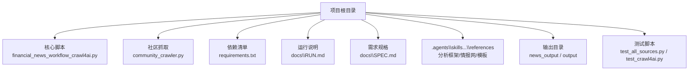
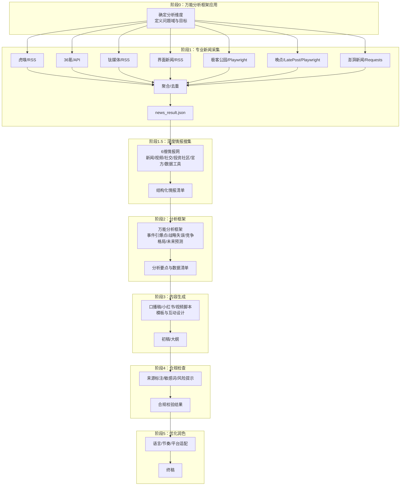
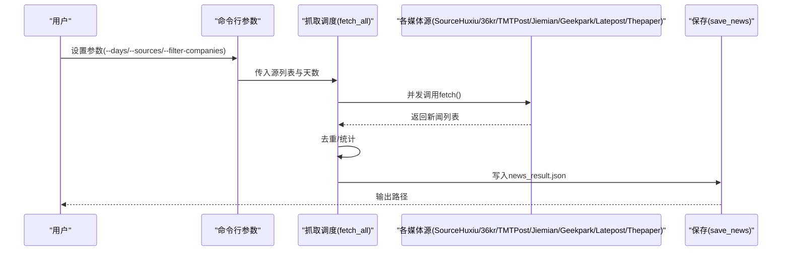
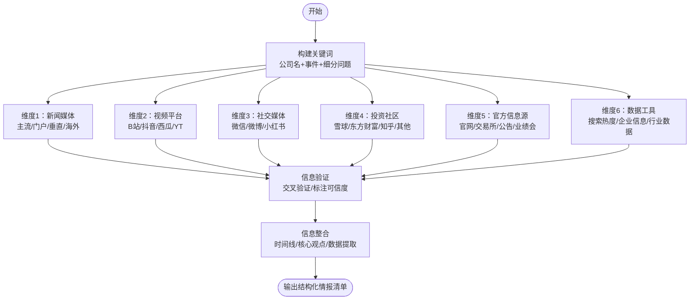
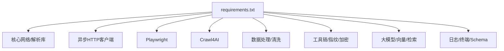

# 内容生成工作流

<cite>
**本文引用的文件**   
- [financial_news_workflow_crawl4ai.py](file://financial_news_workflow_crawl4ai.py)
- [community_crawler.py](file://community_crawler.py)
- [requirements.txt](file://requirements.txt)
- [docs\RUN.md](file://docs\RUN.md)
- [docs\SPEC.md](file://docs\SPEC.md)
- [.agents\skills\china-financial-news-writer\references\universal_financial_analysis_framework.md](file://.agents\skills\china-financial-news-writer\references\universal_financial_analysis_framework.md)
- [.agents\skills\china-financial-news-writer\references\deep-research.md](file://.agents\skills\china-financial-news-writer\references\deep-research.md)
- [.agents\skills\china-financial-news-writer\references\template-xiaohongshu.md](file://.agents\skills\china-financial-news-writer\references\template-xiaohongshu.md)
- [news_output\news_20260324_182234.json](file://news_output\news_20260324_182234.json)
- [output\本田利润暴跌的b站口播稿大纲.md](file://output\本田利润暴跌的b站口播稿大纲.md)
- [test_all_sources.py](file://test_all_sources.py)
- [test_crawl4ai.py](file://test_crawl4ai.py)
</cite>

## 目录
1. [引言](#引言)
2. [项目结构](#项目结构)
3. [核心组件](#核心组件)
4. [架构总览](#架构总览)
5. [详细组件分析](#详细组件分析)
6. [依赖分析](#依赖分析)
7. [性能考量](#性能考量)
8. [故障排查指南](#故障排查指南)
9. [结论](#结论)
10. [附录](#附录)

## 引言
本文件面向Redbook系统的内容生成工作流，围绕从信息采集到最终输出的完整七阶段流程进行系统化说明。工作流以“万能分析框架”为指导，结合“6维情报网”全网信息搜集策略与可信度评估机制，形成可复用、可并行、可优化的自动化内容生产流水线。文档同时给出阶段目标、输入输出、工具与技术栈、并行化与性能优化方案，以及常见问题排查建议。

## 项目结构
仓库采用按功能划分的文件组织方式，核心脚本负责两类抓取任务：专业财经媒体抓取与社区论坛评论抓取；配套文档与参考框架提供运行说明、需求规格、分析模板与深度情报搜集指南；输出目录存放中间产物与样例。

**图表来源**
- [financial_news_workflow_crawl4ai.py](file://financial_news_workflow_crawl4ai.py)
- [community_crawler.py](file://community_crawler.py)
- [requirements.txt](file://requirements.txt)
- [docs\RUN.md](file://docs\RUN.md)
- [docs\SPEC.md](file://docs\SPEC.md)
- [.agents\skills\china-financial-news-writer\references\universal_financial_analysis_framework.md](file://.agents\skills\china-financial-news-writer\references\universal_financial_analysis_framework.md)
- [.agents\skills\china-financial-news-writer\references\deep-research.md](file://.agents\skills\china-financial-news-writer\references\deep-research.md)
- [.agents\skills\china-financial-news-writer\references\template-xiaohongshu.md](file://.agents\skills\china-financial-news-writer\references\template-xiaohongshu.md)
- [news_output\news_20260324_182234.json](file://news_output\news_20260324_182234.json)
- [output\本田利润暴跌的b站口播稿大纲.md](file://output\本田利润暴跌的b站口播稿大纲.md)
- [test_all_sources.py](file://test_all_sources.py)
- [test_crawl4ai.py](file://test_crawl4ai.py)

**章节来源**
- [docs\RUN.md](file://docs\RUN.md)
- [docs\SPEC.md](file://docs\SPEC.md)

## 核心组件
- 专业新闻抓取器：从7大权威媒体（RSS/API/动态渲染）抓取热点新闻，支持去重、统计与保存。
- 社区论坛抓取器：从雪球、知乎等社区抓取用户评论，支持Crawl4AI增强抓取与情感分析。
- 分析框架与模板：提供“万能分析框架”“6维情报网”“小红书模板库”等，指导信息整合与内容表达。
- 输出与样例：新闻结果JSON、社区评论JSON、口播稿大纲等。

**章节来源**
- [financial_news_workflow_crawl4ai.py](file://financial_news_workflow_crawl4ai.py)
- [community_crawler.py](file://community_crawler.py)
- [.agents\skills\china-financial-news-writer\references\universal_financial_analysis_framework.md](file://.agents\skills\china-financial-news-writer\references\universal_financial_analysis_framework.md)
- [.agents\skills\china-financial-news-writer\references\deep-research.md](file://.agents\skills\china-financial-news-writer\references\deep-research.md)
- [.agents\skills\china-financial-news-writer\references\template-xiaohongshu.md](file://.agents\skills\china-financial-news-writer\references\template-xiaohongshu.md)
- [news_output\news_20260324_182234.json](file://news_output\news_20260324_182234.json)
- [output\本田利润暴跌的b站口播稿大纲.md](file://output\本田利润暴跌的b站口播稿大纲.md)

## 架构总览
工作流以“阶段化+并行化+可扩展”的方式组织，分为七个阶段，覆盖从信息采集到最终输出的全流程。

**图表来源**
- [financial_news_workflow_crawl4ai.py](file://financial_news_workflow_crawl4ai.py)
- [.agents\skills\china-financial-news-writer\references\universal_financial_analysis_framework.md](file://.agents\skills\china-financial-news-writer\references\universal_financial_analysis_framework.md)
- [.agents\skills\china-financial-news-writer\references\deep-research.md](file://.agents\skills\china-financial-news-writer\references\deep-research.md)
- [.agents\skills\china-financial-news-writer\references\template-xiaohongshu.md](file://.agents\skills\china-financial-news-writer\references\template-xiaohongshu.md)

## 详细组件分析

### 阶段0：万能分析框架应用
- 目标：明确分析维度、问题边界与输出形态，确保后续采集与分析有的放矢。
- 输入：选题/事件背景、平台目标（如小红书/B站/公众号）。
- 输出：分析框架勾选项、优先级排序、数据收集清单。
- 工具与技术：框架模板、平台适配指南、可视化建议。

**章节来源**
- [.agents\skills\china-financial-news-writer\references\universal_financial_analysis_framework.md](file://.agents\skills\china-financial-news-writer\references\universal_financial_analysis_framework.md)
- [.agents\skills\china-financial-news-writer\references\template-xiaohongshu.md](file://.agents\skills\china-financial-news-writer\references\template-xiaohongshu.md)

### 阶段1：专业新闻采集（7大权威媒体）
- 目标：从专业财经媒体抓取深度报道，确定核心选题与事件背景。
- 输入：媒体源集合、时间窗口、可选公司名过滤开关。
- 输出：去重后的新闻列表（含来源、标题、链接、摘要、发布时间）与统计信息。
- 工具与技术：
  - RSS解析：feedparser
  - HTTP请求：requests
  - 动态渲染：Playwright（Chromium）
  - HTML解析：BeautifulSoup
  - 并行/异步：多源并发抓取
- 关键流程（序列图）：

**图表来源**
- [financial_news_workflow_crawl4ai.py](file://financial_news_workflow_crawl4ai.py)

**章节来源**
- [financial_news_workflow_crawl4ai.py](file://financial_news_workflow_crawl4ai.py)
- [docs\RUN.md](file://docs\RUN.md)
- [test_all_sources.py](file://test_all_sources.py)

### 阶段1.5：深度情报搜集（6维情报网）
- 目标：全网深度调研，确保分析报告的完备性与洞察力。
- 输入：公司/事件关键词、时间范围。
- 输出：6维情报清单（新闻/视频/社交/投资社区/官方/数据工具）与可信度标注。
- 工具与技术：搜索引擎技巧、站点限定搜索、社区爬取、数据工具（百度指数/微信指数/天眼查/启信宝/乘联会等）。
- 关键流程（流程图）：

**图表来源**
- [.agents\skills\china-financial-news-writer\references\deep-research.md](file://.agents\skills\china-financial-news-writer\references\deep-research.md)

**章节来源**
- [.agents\skills\china-financial-news-writer\references\deep-research.md](file://.agents\skills\china-financial-news-writer\references\deep-research.md)

### 阶段2：分析框架（万能分析框架）
- 目标：基于框架对事件进行系统化拆解，形成可执行的分析清单。
- 输入：新闻与社区情报、6维情报清单。
- 输出：分析要点清单（事件引爆点、战略失误、竞争格局、未来预测等）与数据支撑。
- 工具与技术：框架勾选、优先级排序、数据收集、内容生成、平台适配。

**章节来源**
- [.agents\skills\china-financial-news-writer\references\universal_financial_analysis_framework.md](file://.agents\skills\china-financial-news-writer\references\universal_financial_analysis_framework.md)

### 阶段3：内容生成（口播稿/小红书/视频脚本）
- 目标：将分析要点转化为平台化内容，满足不同受众与节奏。
- 输入：分析清单、模板库、互动设计技巧。
- 输出：口播稿/小红书文案/视频脚本初稿。
- 工具与技术：模板公式、标题公式、段落节奏、标签布局、互动引导。

**章节来源**
- [.agents\skills\china-financial-news-writer\references\template-xiaohongshu.md](file://.agents\skills\china-financial-news-writer\references\template-xiaohongshu.md)
- [output\本田利润暴跌的b站口播稿大纲.md](file://output\本田利润暴跌的b站口播稿大纲.md)

### 阶段4：合规检查
- 目标：确保内容来源可追溯、敏感信息可控、风险提示到位。
- 输入：内容初稿、来源清单、敏感词库。
- 输出：合规校验结果与修订建议。
- 工具与技术：敏感词过滤、来源标注、风险提示模板。

**章节来源**
- [.agents\skills\china-financial-news-writer\references\deep-research.md](file://.agents\skills\china-financial-news-writer\references\deep-research.md)

### 阶段5：优化润色
- 目标：提升语言表达、节奏把控与平台适配度。
- 输入：初稿、平台调性、受众画像。
- 输出：终稿。
- 工具与技术：平台适配指南、可视化建议、互动设计技巧。

**章节来源**
- [.agents\skills\china-financial-news-writer\references\template-xiaohongshu.md](file://.agents\skills\china-financial-news-writer\references\template-xiaohongshu.md)
- [.agents\skills\china-financial-news-writer\references\universal_financial_analysis_framework.md](file://.agents\skills\china-financial-news-writer\references\universal_financial_analysis_framework.md)

## 依赖分析
- 核心依赖：requests、feedparser、beautifulsoup4、lxml、aiohttp/httpx（异步）、playwright（动态渲染）、crawl4ai（AI增强抓取）。
- 数据处理：orjson（JSON加速）、w3lib/tld（数据清洗）。
- 工具链：fake-useragent/browserforge（UA指纹）、apify-fingerprint-datapoints（指纹数据）、rich/pygments（终端显示）。
- 大模型与向量：litellm/openai/tiktoken/tokenizers/huggingface-hub（调用与分词）、numpy/pillow/scipy/scikit-learn/nltk/rank-bm25（NLP/检索）。
- 其他：httpcore/h2（HTTP/2）、psutil/aiofiles/typer/click（异步与CLI）、pydantic/jsonschema（数据校验）。

**图表来源**
- [requirements.txt](file://requirements.txt)

**章节来源**
- [requirements.txt](file://requirements.txt)

## 性能考量
- 并行化策略
  - 多源并发：阶段1中对7个媒体源并行抓取，显著缩短总耗时。
  - 异步抓取：对支持异步的源（如36氪API、RSS）采用异步HTTP客户端，降低阻塞。
  - Crawl4AI回退：当Playwright失败时自动切换HTTP策略，保证稳定性。
- 资源控制
  - 请求超时与重试：统一设置超时阈值，避免长时间阻塞。
  - 限速与伪装：使用fake-useragent/browserforge生成随机UA与指纹，降低反爬压力。
  - 内存与IO：使用orjson与流式写入，减少内存峰值与磁盘IO开销。
- 可靠性
  - 依赖检测：在导入阶段检测缺失库并提示安装，避免运行时崩溃。
  - 错误日志：对每个源的抓取过程输出详细日志，便于定位问题。
- 可扩展性
  - 插件化媒体源：新增媒体源只需遵循统一接口，即可无缝接入。
  - 配置化参数：支持通过命令行参数灵活控制抓取范围与输出格式。

**章节来源**
- [financial_news_workflow_crawl4ai.py](file://financial_news_workflow_crawl4ai.py)
- [community_crawler.py](file://community_crawler.py)
- [requirements.txt](file://requirements.txt)

## 故障排查指南
- 常见问题
  - 抓取失败：检查网络连通性、目标站点可访问性；缩小来源范围；查看命令行错误信息。
  - Playwright浏览器启动失败：确认已安装Chromium；以管理员权限运行；检查系统权限。
  - 依赖安装失败：升级pip；使用二进制安装；检查网络与镜像源。
- 定位手段
  - 日志输出：脚本在运行过程中输出详细日志，包括抓取统计、来源状态与错误堆栈。
  - 测试脚本：使用test_all_sources.py验证各媒体源连通性；使用test_crawl4ai.py验证Crawl4AI功能。
- 快速恢复
  - 降级策略：若Playwright不可用，使用requests+BeautifulSoup作为备选。
  - 限流与重试：对易反爬站点增加延时与重试次数，避免被封禁。
  - 输出检查：核对news_result.json与comments_*.json的字段完整性与时间戳一致性。

**章节来源**
- [docs\RUN.md](file://docs\RUN.md)
- [test_all_sources.py](file://test_all_sources.py)
- [test_crawl4ai.py](file://test_crawl4ai.py)

## 结论
Redbook内容生成工作流以“万能分析框架+6维情报网”为指导，结合专业媒体与社区数据的自动化采集，形成从信息采集到内容输出的闭环。通过并行化与异步化策略、完善的错误处理与依赖管理，系统在保证稳定性的同时提升了效率。配合模板库与合规检查机制，能够快速产出高质量、可复用的内容素材，适用于小红书、B站、公众号等多种平台。

## 附录
- 运行示例与输出样例
  - 专业新闻抓取输出：news_result.json包含抓取时间、总数、按来源统计与新闻列表。
  - 社区评论输出：comments_*.json包含情感分析结果与抓取统计。
  - 口播稿样例：本田利润暴跌的B站口播稿大纲，展示从事件到未来预测的完整结构。
- 相关文档
  - 运行说明：涵盖环境准备、安装步骤、命令行参数与输出说明。
  - 需求规格：明确功能需求、技术栈、工作流与验收标准。

**章节来源**
- [news_output\news_20260324_182234.json](file://news_output\news_20260324_182234.json)
- [output\本田利润暴跌的b站口播稿大纲.md](file://output\本田利润暴跌的b站口播稿大纲.md)
- [docs\RUN.md](file://docs\RUN.md)
- [docs\SPEC.md](file://docs\SPEC.md)