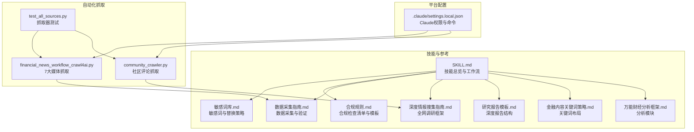
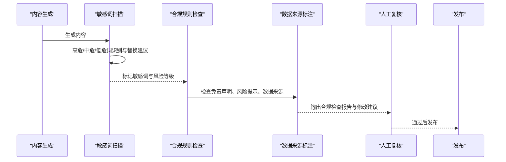
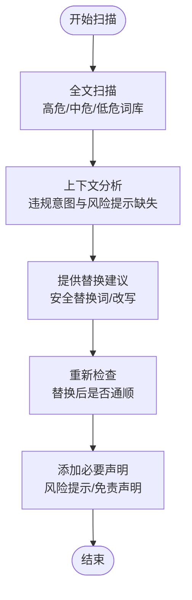
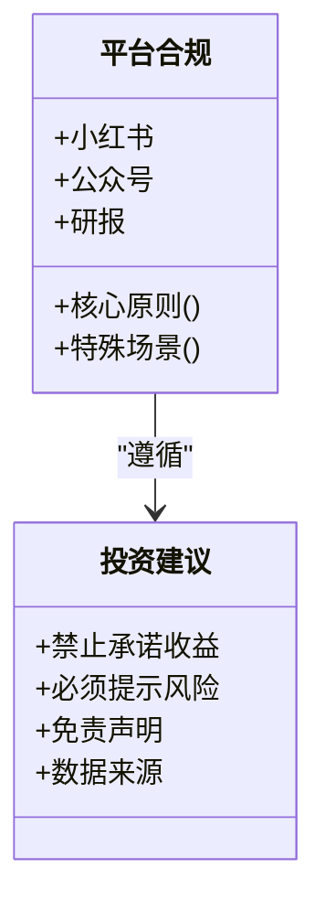
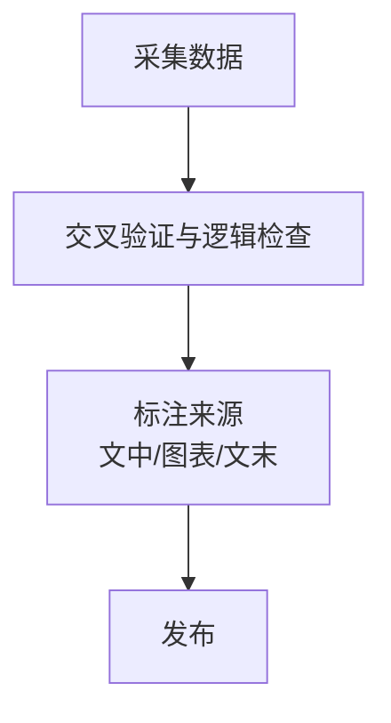
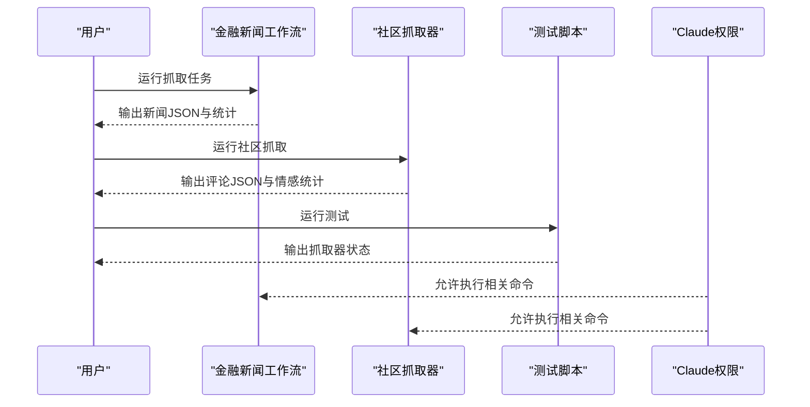
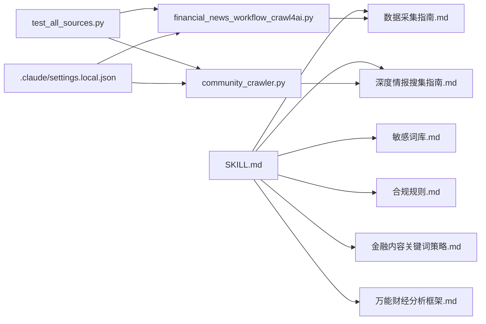

# 合规检查系统

<cite>
**本文引用的文件**
- [SKILL.md](file://.agents/skills/china-financial-news-writer/SKILL.md)
- [敏感词库.md](file://.agents/skills/china-financial-news-writer/references/sensitive-words-finance.md)
- [合规规则.md](file://.agents/skills/china-financial-news-writer/references/compliance-rules.md)
- [数据采集指南.md](file://.agents/skills/china-financial-news-writer/references/data-collection.md)
- [深度情报搜集指南.md](file://.agents/skills/china-financial-news-writer/references/deep-research.md)
- [研究报告模板.md](file://.agents/skills/china-financial-news-writer/references/research-report-template.md)
- [金融内容关键词策略.md](file://.agents/skills/china-financial-news-writer/references/keyword-strategy.md)
- [万能财经分析框架.md](file://.agents/skills/china-financial-news-writer/references/universal_financial_analysis_framework.md)
- [financial_news_workflow_crawl4ai.py](file://financial_news_workflow_crawl4ai.py)
- [community_crawler.py](file://community_crawler.py)
- [test_all_sources.py](file://test_all_sources.py)
- [.claude/settings.local.json](file://.claude/settings.local.json)
</cite>

## 目录
1. [简介](#简介)
2. [项目结构](#项目结构)
3. [核心组件](#核心组件)
4. [架构总览](#架构总览)
5. [详细组件分析](#详细组件分析)
6. [依赖关系分析](#依赖关系分析)
7. [性能考量](#性能考量)
8. [故障排查指南](#故障排查指南)
9. [结论](#结论)
10. [附录](#附录)

## 简介
本文件面向Redbook系统的合规检查系统，围绕金融内容合规检查的完整流程进行系统化说明，涵盖敏感词扫描机制、投资建议合规规则、数据来源标注要求。文档同时给出高危词、中危词的分类标准与替换策略，投资建议中禁止承诺收益、必须提示风险等合规要求，以及数据来源的可追溯性与免责声明的标准化格式。最后提供合规检查的自动化实现方案与人工复核流程，确保生成内容符合金融监管要求。

## 项目结构
本项目以“中国金融新闻自动写作系统”为核心技能，配套完整的合规规则、敏感词库、数据采集与深度情报搜集指南，形成从内容生成到合规检查的闭环。关键文件与职责如下：
- 技能总览与工作流：SKILL.md
- 敏感词与合规规则：敏感词库.md、合规规则.md
- 数据采集与来源标注：数据采集指南.md、深度情报搜集指南.md、研究报告模板.md
- 关键词策略与分析框架：金融内容关键词策略.md、万能财经分析框架.md
- 自动化抓取与测试：financial_news_workflow_crawl4ai.py、community_crawler.py、test_all_sources.py
- Claude权限配置：.claude/settings.local.json

**图表来源**
- [SKILL.md:1-476](file://.agents/skills/china-financial-news-writer/SKILL.md#L1-L476)
- [敏感词库.md:1-317](file://.agents/skills/china-financial-news-writer/references/sensitive-words-finance.md#L1-L317)
- [合规规则.md:1-394](file://.agents/skills/china-financial-news-writer/references/compliance-rules.md#L1-L394)
- [数据采集指南.md:1-357](file://.agents/skills/china-financial-news-writer/references/data-collection.md#L1-L357)
- [深度情报搜集指南.md:1-397](file://.agents/skills/china-financial-news-writer/references/deep-research.md#L1-L397)
- [研究报告模板.md:1-395](file://.agents/skills/china-financial-news-writer/references/research-report-template.md#L1-L395)
- [金融内容关键词策略.md:1-302](file://.agents/skills/china-financial-news-writer/references/keyword-strategy.md#L1-L302)
- [万能财经分析框架.md:1-126](file://.agents/skills/china-financial-news-writer/references/universal_financial_analysis_framework.md#L1-L126)
- [financial_news_workflow_crawl4ai.py:1-454](file://financial_news_workflow_crawl4ai.py#L1-L454)
- [community_crawler.py:1-604](file://community_crawler.py#L1-L604)
- [test_all_sources.py:1-49](file://test_all_sources.py#L1-L49)
- [.claude/settings.local.json:1-51](file://.claude/settings.local.json#L1-L51)

**章节来源**
- [SKILL.md:1-476](file://.agents/skills/china-financial-news-writer/SKILL.md#L1-L476)
- [敏感词库.md:1-317](file://.agents/skills/china-financial-news-writer/references/sensitive-words-finance.md#L1-L317)
- [合规规则.md:1-394](file://.agents/skills/china-financial-news-writer/references/compliance-rules.md#L1-L394)
- [数据采集指南.md:1-357](file://.agents/skills/china-financial-news-writer/references/data-collection.md#L1-L357)
- [深度情报搜集指南.md:1-397](file://.agents/skills/china-financial-news-writer/references/deep-research.md#L1-L397)
- [研究报告模板.md:1-395](file://.agents/skills/china-financial-news-writer/references/research-report-template.md#L1-L395)
- [金融内容关键词策略.md:1-302](file://.agents/skills/china-financial-news-writer/references/keyword-strategy.md#L1-L302)
- [万能财经分析框架.md:1-126](file://.agents/skills/china-financial-news-writer/references/universal_financial_analysis_framework.md#L1-L126)
- [financial_news_workflow_crawl4ai.py:1-454](file://financial_news_workflow_crawl4ai.py#L1-L454)
- [community_crawler.py:1-604](file://community_crawler.py#L1-L604)
- [test_all_sources.py:1-49](file://test_all_sources.py#L1-L49)
- [.claude/settings.local.json:1-51](file://.claude/settings.local.json#L1-L51)

## 核心组件
- 敏感词扫描与替换
  - 高危词：涉及收益承诺、非法荐股、内幕信息等，必须删除或重写
  - 中危词：绝对化用语、强烈推荐、确定性强等，建议替换或加风险提示
  - 低危词：借贷、理财产品、期货外汇等，需谨慎表述并加风险提示
  - 替换策略：提供安全替换词与改写建议，确保语义通顺
- 投资建议合规
  - 禁止承诺收益；必须提示风险；必须添加免责声明
  - 不同平台（小红书、公众号、研报）有差异化合规模板
- 数据来源标注
  - 财务数据、市场数据、行业数据、调研数据均需标注来源
  - 标注格式包括文中、图表、文末三类
- 关键词优化与布局
  - 核心词、长尾词、场景词、人群词、修饰词的布局策略
  - 不同平台的关键词密度与标签策略

**章节来源**
- [敏感词库.md:1-317](file://.agents/skills/china-financial-news-writer/references/sensitive-words-finance.md#L1-L317)
- [合规规则.md:1-394](file://.agents/skills/china-financial-news-writer/references/compliance-rules.md#L1-L394)
- [金融内容关键词策略.md:1-302](file://.agents/skills/china-financial-news-writer/references/keyword-strategy.md#L1-L302)

## 架构总览
合规检查系统由“内容生成—合规扫描—数据标注—人工复核—发布”构成闭环。自动化抓取模块负责为内容生成提供数据与舆情素材，合规模块在生成后进行敏感词扫描与合规要素检查，最终输出合规检查报告与修改建议。

**图表来源**
- [SKILL.md:249-267](file://.agents/skills/china-financial-news-writer/SKILL.md#L249-L267)
- [合规规则.md:164-204](file://.agents/skills/china-financial-news-writer/references/compliance-rules.md#L164-L204)
- [敏感词库.md:270-294](file://.agents/skills/china-financial-news-writer/references/sensitive-words-finance.md#L270-L294)

## 详细组件分析

### 敏感词扫描机制
- 分类与等级
  - 高危：收益承诺、非法荐股、内幕信息等，必须删除或重写
  - 中危：绝对化用语、强烈推荐、确定性强等，建议替换或加风险提示
  - 低危：借贷、理财产品、期货外汇等，需谨慎表述并加风险提示
- 替换策略
  - 提供安全替换词与改写建议
  - 确保替换后语义通顺、逻辑连贯
- 输出格式
  - 合规检查报告包含风险等级、敏感词清单、修改建议、需要添加的风险提示与修改后风险等级

**图表来源**
- [敏感词库.md:270-294](file://.agents/skills/china-financial-news-writer/references/sensitive-words-finance.md#L270-L294)

**章节来源**
- [敏感词库.md:1-317](file://.agents/skills/china-financial-news-writer/references/sensitive-words-finance.md#L1-L317)

### 投资建议合规规则
- 核心原则
  - 不承诺收益；不构成投资建议；充分披露风险；数据来源透明；避免绝对化
- 平台差异化
  - 小红书：禁止荐股、收益承诺、开户引导；必须包含风险提示与“仅供参考”
  - 公众号：必须包含免责声明、风险提示、数据来源标注
  - 研报：必须包含分析师声明、投资评级定义、完整免责声明、公司声明
- 特殊场景
  - 财报分析、行业分析、政策解读中避免直接买入建议与“必涨”“稳赚”等表述

**图表来源**
- [合规规则.md:13-161](file://.agents/skills/china-financial-news-writer/references/compliance-rules.md#L13-L161)

**章节来源**
- [合规规则.md:1-394](file://.agents/skills/china-financial-news-writer/references/compliance-rules.md#L1-L394)

### 数据来源标注与可追溯性
- 必须标注来源的数据类型
  - 财务数据、市场数据、行业数据、调研数据
- 标注格式
  - 文中标注、图表标注、文末标注
- 禁止使用
  - 来源不明、伪造篡改、断章取义、过期未标注时间的数据

**图表来源**
- [数据采集指南.md:155-182](file://.agents/skills/china-financial-news-writer/references/data-collection.md#L155-L182)
- [合规规则.md:294-328](file://.agents/skills/china-financial-news-writer/references/compliance-rules.md#L294-L328)

**章节来源**
- [数据采集指南.md:1-357](file://.agents/skills/china-financial-news-writer/references/data-collection.md#L1-L357)
- [合规规则.md:294-328](file://.agents/skills/china-financial-news-writer/references/compliance-rules.md#L294-L328)

### 自动化抓取与合规素材
- 金融新闻自动化工作流
  - 抓取7大权威媒体（虎嗅、36氪、钛媒体、界面新闻、极客公园、晚点LatePost、澎湃新闻）
  - 支持RSS、API、Playwright动态加载、requests抓取
  - 去重、保存JSON、输出统计
- 社区评论抓取
  - 雪球、知乎搜索与评论抓取，支持Crawl4AI增强抓取与BeautifulSoup解析
  - 情感分析（正/负/中），保存统计与评论数据
- 测试与权限
  - test_all_sources.py用于验证各抓取器可用性
  - .claude/settings.local.json配置Claude权限与命令

**图表来源**
- [financial_news_workflow_crawl4ai.py:405-454](file://financial_news_workflow_crawl4ai.py#L405-L454)
- [community_crawler.py:501-604](file://community_crawler.py#L501-L604)
- [test_all_sources.py:18-49](file://test_all_sources.py#L18-L49)
- [.claude/settings.local.json:1-51](file://.claude/settings.local.json#L1-L51)

**章节来源**
- [financial_news_workflow_crawl4ai.py:1-454](file://financial_news_workflow_crawl4ai.py#L1-L454)
- [community_crawler.py:1-604](file://community_crawler.py#L1-L604)
- [test_all_sources.py:1-49](file://test_all_sources.py#L1-L49)
- [.claude/settings.local.json:1-51](file://.claude/settings.local.json#L1-L51)

### 深度情报搜集与合规证据链
- 6维情报网：新闻媒体、视频平台、社交媒体、投资社区、官方信息源、数据工具
- 信息处理流程：收集→验证→整合，输出时间线、观点汇总、风险提示
- 合规要求：注明信息来源可信度、避免荐股、必须包含风险提示

**章节来源**
- [深度情报搜集指南.md:1-397](file://.agents/skills/china-financial-news-writer/references/deep-research.md#L1-L397)
- [研究报告模板.md:1-395](file://.agents/skills/china-financial-news-writer/references/research-report-template.md#L1-L395)

### 关键词策略与合规密度
- 关键词类型：核心词、长尾词、场景词、人群词、修饰词
- 布局优先级与密度：不同平台的关键词密度与标签策略
- 密度诊断与优化建议：避免堆砌、提升可读性

**章节来源**
- [金融内容关键词策略.md:1-302](file://.agents/skills/china-financial-news-writer/references/keyword-strategy.md#L1-L302)

## 依赖关系分析
- 技能与参考文件耦合度高：SKILL.md串联敏感词、合规规则、数据采集、深度情报、关键词策略与分析框架
- 抓取模块与合规模块解耦：抓取模块负责素材获取，合规模块负责内容后处理
- 平台配置与执行权限：.claude/settings.local.json决定可执行命令与权限范围

**图表来源**
- [SKILL.md:1-476](file://.agents/skills/china-financial-news-writer/SKILL.md#L1-L476)
- [敏感词库.md:1-317](file://.agents/skills/china-financial-news-writer/references/sensitive-words-finance.md#L1-L317)
- [合规规则.md:1-394](file://.agents/skills/china-financial-news-writer/references/compliance-rules.md#L1-L394)
- [数据采集指南.md:1-357](file://.agents/skills/china-financial-news-writer/references/data-collection.md#L1-L357)
- [深度情报搜集指南.md:1-397](file://.agents/skills/china-financial-news-writer/references/deep-research.md#L1-L397)
- [金融内容关键词策略.md:1-302](file://.agents/skills/china-financial-news-writer/references/keyword-strategy.md#L1-L302)
- [万能财经分析框架.md:1-126](file://.agents/skills/china-financial-news-writer/references/universal_financial_analysis_framework.md#L1-L126)
- [financial_news_workflow_crawl4ai.py:1-454](file://financial_news_workflow_crawl4ai.py#L1-L454)
- [community_crawler.py:1-604](file://community_crawler.py#L1-L604)
- [test_all_sources.py:1-49](file://test_all_sources.py#L1-L49)
- [.claude/settings.local.json:1-51](file://.claude/settings.local.json#L1-L51)

**章节来源**
- [SKILL.md:1-476](file://.agents/skills/china-financial-news-writer/SKILL.md#L1-L476)
- [financial_news_workflow_crawl4ai.py:1-454](file://financial_news_workflow_crawl4ai.py#L1-L454)
- [community_crawler.py:1-604](file://community_crawler.py#L1-L604)
- [.claude/settings.local.json:1-51](file://.claude/settings.local.json#L1-L51)

## 性能考量
- 抓取性能
  - RSS/API抓取速度快、资源占用低；动态加载页面需Playwright，启动成本较高
  - 建议按来源与并发策略优化，避免触发反爬机制
- 解析与存储
  - BeautifulSoup解析HTML需网络请求后处理，建议缓存与增量更新
  - JSON输出采用时间戳目录，便于归档与检索
- 合规检查
  - 敏感词扫描与替换建议可批量处理，结合关键词密度检查，避免重复扫描

[本节为通用指导，无需引用具体文件]

## 故障排查指南
- 抓取器不可用
  - 缺少依赖：feedparser、requests、playwright、beautifulsoup4、crawl4ai
  - 解决：安装对应依赖并执行playwright安装命令
- 抓取失败
  - 网络超时或反爬：调整超时、请求头、使用Crawl4AI增强抓取
  - 页面结构变化：更新选择器或切换解析策略
- 测试失败
  - test_all_sources.py输出各抓取器状态，逐项排查
- 权限问题
  - .claude/settings.local.json中未授权相关命令，需补充允许的命令与权限

**章节来源**
- [financial_news_workflow_crawl4ai.py:30-58](file://financial_news_workflow_crawl4ai.py#L30-L58)
- [community_crawler.py:35-52](file://community_crawler.py#L35-L52)
- [test_all_sources.py:18-49](file://test_all_sources.py#L18-L49)
- [.claude/settings.local.json:1-51](file://.claude/settings.local.json#L1-L51)

## 结论
本合规检查系统以“技能—规则—数据—抓取—复核”为主线，形成从内容生成到发布的全流程合规保障。通过敏感词扫描与替换、投资建议合规、数据来源标注与免责声明标准化，结合自动化抓取与人工复核，确保金融内容在小红书、公众号、研报等平台发布时满足监管要求。建议持续完善抓取策略与解析稳定性，强化合规检查的自动化与可追溯性。

[本节为总结，无需引用具体文件]

## 附录
- 合规检查清单（发布前必查）
  - 小红书：风险提示、免责声明、是否包含敏感词、是否避免荐股/收益承诺
  - 公众号：免责声明、风险提示、数据来源、标题合规
  - 研报：分析师声明、投资评级、免责声明、风险提示、数据来源、财务预测
- 风险等级处理
  - 高危：必须删除或重写
  - 中危：建议替换或加声明
  - 低危：可保留，建议加声明
  - 安全：正常发布

**章节来源**
- [合规规则.md:164-242](file://.agents/skills/china-financial-news-writer/references/compliance-rules.md#L164-L242)