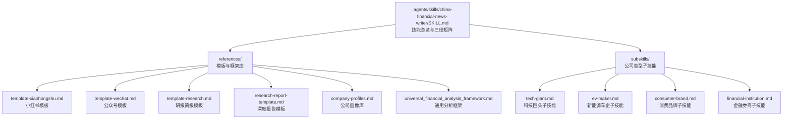
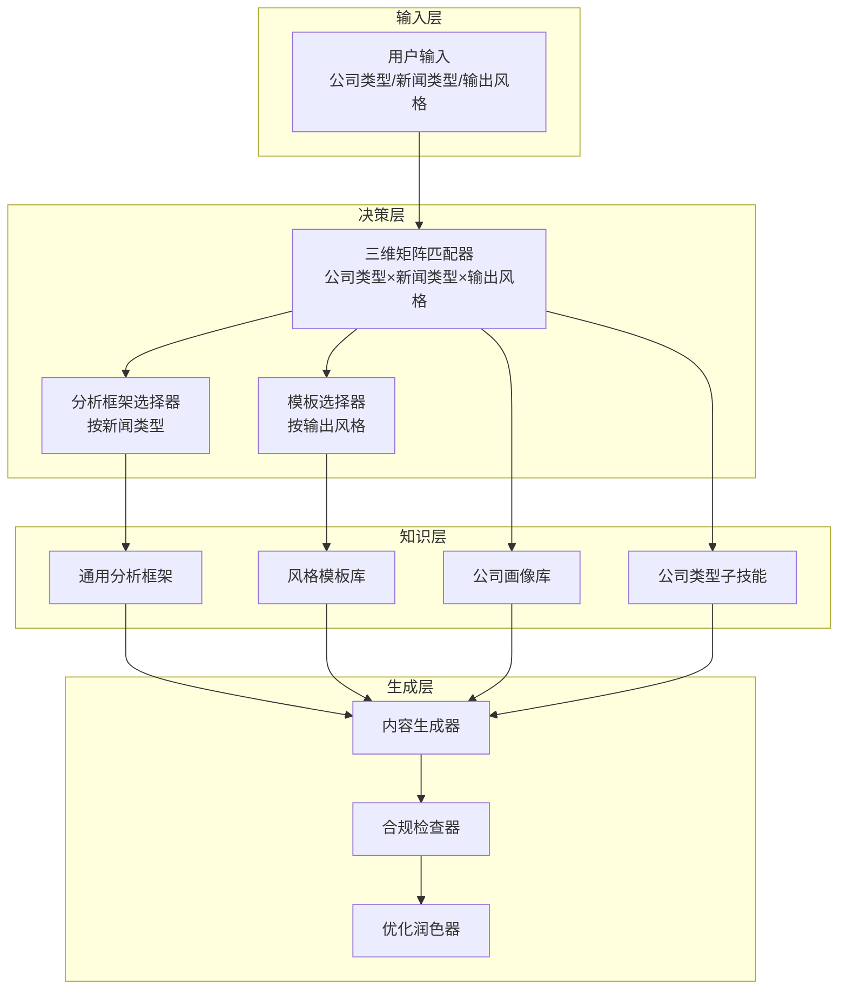
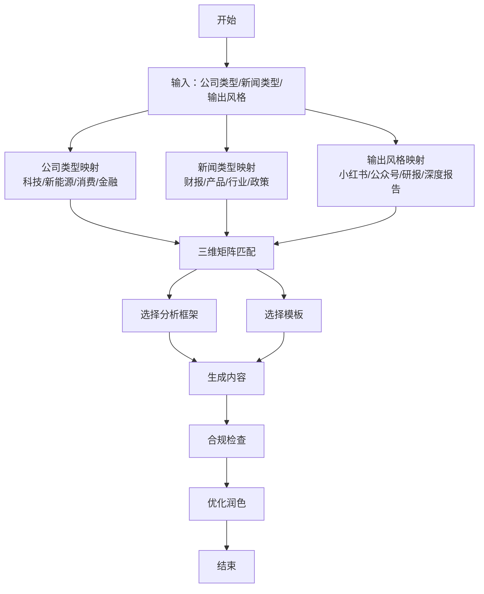
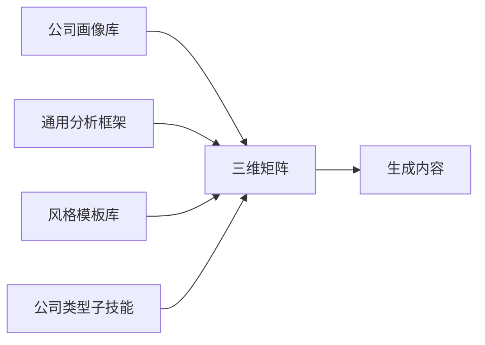

# 模板匹配系统

<cite>
**本文档引用的文件**
- [SKILL.md](file://.agents/skills/china-financial-news-writer/SKILL.md)
- [company-profiles.md](file://.agents/skills/china-financial-news-writer/references/company-profiles.md)
- [universal_financial_analysis_framework.md](file://.agents/skills/china-financial-news-writer/references/universal_financial_analysis_framework.md)
- [template-xiaohongshu.md](file://.agents/skills/china-financial-news-writer/references/template-xiaohongshu.md)
- [template-wechat.md](file://.agents/skills/china-financial-news-writer/references/template-wechat.md)
- [template-research.md](file://.agents/skills/china-financial-news-writer/references/template-research.md)
- [research-report-template.md](file://.agents/skills/china-financial-news-writer/references/research-report-template.md)
- [tech-giant.md](file://.agents/skills/china-financial-news-writer/subskills/tech-giant.md)
- [ev-maker.md](file://.agents/skills/china-financial-news-writer/subskills/ev-maker.md)
- [consumer-brand.md](file://.agents/skills/china-financial-news-writer/subskills/consumer-brand.md)
- [financial-institution.md](file://.agents/skills/china-financial-news-writer/subskills/financial-institution.md)
</cite>

## 目录
1. [简介](#简介)
2. [项目结构](#项目结构)
3. [核心组件](#核心组件)
4. [架构总览](#架构总览)
5. [详细组件分析](#详细组件分析)
6. [依赖分析](#依赖分析)
7. [性能考量](#性能考量)
8. [故障排查指南](#故障排查指南)
9. [结论](#结论)
10. [附录](#附录)

## 简介
本系统为Redbook的模板匹配系统，围绕“三维分类矩阵”实现智能内容生成：  
- 维度一：公司类型（科技巨头、新能源车企、消费品牌、金融券商）  
- 维度二：新闻类型（财报分析、产品发布、行业动态、政策影响）  
- 维度三：输出风格（小红书、公众号、研报简报、深度报告）

系统通过公司画像、新闻类型分析框架、输出风格模板与子技能，形成可配置、可扩展的模板匹配与生成流水线，覆盖从数据采集、分析框架应用、模板选择到合规优化的全流程。

## 项目结构
系统采用“技能+参考模板+子技能”的模块化组织方式，核心位于`.agents/skills/china-financial-news-writer`目录，包含技能说明、模板库与子技能文档。

**图表来源**
- [SKILL.md:1-476](file://.agents/skills/china-financial-news-writer/SKILL.md#L1-L476)
- [template-xiaohongshu.md:1-424](file://.agents/skills/china-financial-news-writer/references/template-xiaohongshu.md#L1-L424)
- [template-wechat.md:1-518](file://.agents/skills/china-financial-news-writer/references/template-wechat.md#L1-L518)
- [template-research.md:1-459](file://.agents/skills/china-financial-news-writer/references/template-research.md#L1-L459)
- [research-report-template.md:1-395](file://.agents/skills/china-financial-news-writer/references/research-report-template.md#L1-L395)
- [company-profiles.md:1-499](file://.agents/skills/china-financial-news-writer/references/company-profiles.md#L1-L499)
- [universal_financial_analysis_framework.md:1-126](file://.agents/skills/china-financial-news-writer/references/universal_financial_analysis_framework.md#L1-L126)
- [tech-giant.md:1-345](file://.agents/skills/china-financial-news-writer/subskills/tech-giant.md#L1-L345)
- [ev-maker.md:1-398](file://.agents/skills/china-financial-news-writer/subskills/ev-maker.md#L1-L398)
- [consumer-brand.md:1-489](file://.agents/skills/china-financial-news-writer/subskills/consumer-brand.md#L1-L489)
- [financial-institution.md:1-483](file://.agents/skills/china-financial-news-writer/subskills/financial-institution.md#L1-L483)

**章节来源**
- [.agents/skills/china-financial-news-writer/SKILL.md:1-476](file://.agents/skills/china-financial-news-writer/SKILL.md#L1-L476)

## 核心组件
- 三维分类矩阵：公司类型×新闻类型×输出风格，作为模板匹配的决策基础
- 公司画像库：提供四类公司类型的核心业务结构、关注指标与写作侧重
- 通用分析框架：12大模块的“万能分析框架”，用于深度事件分析
- 模板库：面向不同输出风格的结构化模板与格式规范
- 子技能：针对不同公司类型的写作要点与风格适配
- 深度报告模板：全网情报搜集后的综合分析报告模板

**章节来源**
- [.agents/skills/china-financial-news-writer/SKILL.md:24-52](file://.agents/skills/china-financial-news-writer/SKILL.md#L24-L52)
- [.agents/skills/china-financial-news-writer/references/company-profiles.md:1-499](file://.agents/skills/china-financial-news-writer/references/company-profiles.md#L1-L499)
- [.agents/skills/china-financial-news-writer/references/universal_financial_analysis_framework.md:1-126](file://.agents/skills/china-financial-news-writer/references/universal_financial_analysis_framework.md#L1-L126)
- [.agents/skills/china-financial-news-writer/references/template-xiaohongshu.md:1-424](file://.agents/skills/china-financial-news-writer/references/template-xiaohongshu.md#L1-L424)
- [.agents/skills/china-financial-news-writer/references/template-wechat.md:1-518](file://.agents/skills/china-financial-news-writer/references/template-wechat.md#L1-L518)
- [.agents/skills/china-financial-news-writer/references/template-research.md:1-459](file://.agents/skills/china-financial-news-writer/references/template-research.md#L1-L459)
- [.agents/skills/china-financial-news-writer/references/research-report-template.md:1-395](file://.agents/skills/china-financial-news-writer/references/research-report-template.md#L1-L395)

## 架构总览
系统以“模板匹配引擎”为核心，接收输入后按三维矩阵进行匹配，调用对应分析框架与模板，结合公司画像与子技能，最终输出合规、结构化的文本。

**图表来源**
- [.agents/skills/china-financial-news-writer/SKILL.md:24-52](file://.agents/skills/china-financial-news-writer/SKILL.md#L24-L52)
- [.agents/skills/china-financial-news-writer/references/universal_financial_analysis_framework.md:1-126](file://.agents/skills/china-financial-news-writer/references/universal_financial_analysis_framework.md#L1-L126)
- [.agents/skills/china-financial-news-writer/references/template-xiaohongshu.md:1-424](file://.agents/skills/china-financial-news-writer/references/template-xiaohongshu.md#L1-L424)
- [.agents/skills/china-financial-news-writer/references/template-wechat.md:1-518](file://.agents/skills/china-financial-news-writer/references/template-wechat.md#L1-L518)
- [.agents/skills/china-financial-news-writer/references/template-research.md:1-459](file://.agents/skills/china-financial-news-writer/references/template-research.md#L1-L459)
- [.agents/skills/china-financial-news-writer/references/research-report-template.md:1-395](file://.agents/skills/china-financial-news-writer/references/research-report-template.md#L1-L395)
- [.agents/skills/china-financial-news-writer/references/company-profiles.md:1-499](file://.agents/skills/china-financial-news-writer/references/company-profiles.md#L1-L499)
- [.agents/skills/china-financial-news-writer/subskills/tech-giant.md:1-345](file://.agents/skills/china-financial-news-writer/subskills/tech-giant.md#L1-L345)
- [.agents/skills/china-financial-news-writer/subskills/ev-maker.md:1-398](file://.agents/skills/china-financial-news-writer/subskills/ev-maker.md#L1-L398)
- [.agents/skills/china-financial-news-writer/subskills/consumer-brand.md:1-489](file://.agents/skills/china-financial-news-writer/subskills/consumer-brand.md#L1-L489)
- [.agents/skills/china-financial-news-writer/subskills/financial-institution.md:1-483](file://.agents/skills/china-financial-news-writer/subskills/financial-institution.md#L1-L483)

## 详细组件分析

### 三维分类矩阵与匹配机制
- 公司类型（四类）
  - 科技巨头：平台型业务、网络效应、用户数据、监管敏感
  - 新能源车企：重资产、高研发、销量/毛利率、价格战、政策敏感
  - 消费品牌：品牌力、渠道、消费趋势、季节性
  - 金融券商：周期性、监管、资本密集、高度依赖市场环境
- 新闻类型（四类）
  - 财报分析：Beat/Miss、指引、趋势、行业对比、估值、风险、催化剂
  - 产品发布：产品力、市场空间、竞争格局、商业模式、时间线
  - 行业动态：事件概述、影响分析、投资逻辑、风险提示
  - 政策影响：政策解读、行业影响、投资建议、风险提示
- 输出风格（四类）
  - 小红书：500-800字、emoji、短段落、口语化、标签
  - 公众号：1500-2500字、专业但不失活泼、配图5-8张
  - 研报简报：3000-5000字、表格3-5个、图表8-12个、Times New Roman
  - 深度报告：5000-8000字、全网情报、12大模块

匹配流程示意：

**图表来源**
- [.agents/skills/china-financial-news-writer/SKILL.md:24-52](file://.agents/skills/china-financial-news-writer/SKILL.md#L24-L52)
- [.agents/skills/china-financial-news-writer/SKILL.md:151-237](file://.agents/skills/china-financial-news-writer/SKILL.md#L151-L237)
- [.agents/skills/china-financial-news-writer/references/template-xiaohongshu.md:1-424](file://.agents/skills/china-financial-news-writer/references/template-xiaohongshu.md#L1-L424)
- [.agents/skills/china-financial-news-writer/references/template-wechat.md:1-518](file://.agents/skills/china-financial-news-writer/references/template-wechat.md#L1-L518)
- [.agents/skills/china-financial-news-writer/references/template-research.md:1-459](file://.agents/skills/china-financial-news-writer/references/template-research.md#L1-L459)
- [.agents/skills/china-financial-news-writer/references/research-report-template.md:1-395](file://.agents/skills/china-financial-news-writer/references/research-report-template.md#L1-L395)

**章节来源**
- [.agents/skills/china-financial-news-writer/SKILL.md:24-52](file://.agents/skills/china-financial-news-writer/SKILL.md#L24-L52)
- [.agents/skills/china-financial-news-writer/SKILL.md:151-237](file://.agents/skills/china-financial-news-writer/SKILL.md#L151-L237)

### 公司类型特征与写作侧重点
- 科技巨头：用户规模、用户时长、变现效率、新业务进展、监管影响
- 新能源车企：交付量/销量、汽车毛利率、单车利润、研发费用、现金储备
- 消费品牌：收入增速、毛利率、同店增长、库销比、经营现金流
- 金融券商：经纪市占率、投行承销、资管规模、自营收益、两融余额

**章节来源**
- [.agents/skills/china-financial-news-writer/subskills/tech-giant.md:9-25](file://.agents/skills/china-financial-news-writer/subskills/tech-giant.md#L9-L25)
- [.agents/skills/china-financial-news-writer/subskills/ev-maker.md:9-25](file://.agents/skills/china-financial-news-writer/subskills/ev-maker.md#L9-L25)
- [.agents/skills/china-financial-news-writer/subskills/consumer-brand.md:13-29](file://.agents/skills/china-financial-news-writer/subskills/consumer-brand.md#L13-L29)
- [.agents/skills/china-financial-news-writer/subskills/financial-institution.md:11-26](file://.agents/skills/china-financial-news-writer/subskills/financial-institution.md#L11-L26)

### 新闻类型分析框架与权重分配
- 财报分析（8维度）
  - 业绩惊喜（25%）、核心指标（20%）、业务结构（15%）、指引解读（15%）、行业对比（10%）、估值水平（10%）、风险因素（5%）、催化剂（5%）
- 产品发布（5维度）
  - 产品力评估（30%）、市场空间（25%）、竞争格局（20%）、商业模式（15%）、时间线（10%）
- 行业动态（4维度）
  - 事件概述（20%）、影响分析（40%）、投资逻辑（30%）、风险提示（10%）
- 政策影响（4维度）
  - 政策解读（30%）、行业影响（30%）、投资建议（30%）、风险提示（10%）

**章节来源**
- [.agents/skills/china-financial-news-writer/SKILL.md:155-237](file://.agents/skills/china-financial-news-writer/SKILL.md#L155-L237)

### 输出风格格式规范与字数要求
- 小红书：500-800字，emoji、短段落、口语化、标签5-10个
- 公众号：1500-2500字，专业但不失活泼，配图5-8张
- 研报简报：3000-5000字，表格3-5个，图表8-12个，Times New Roman
- 深度报告：5000-8000字，全网情报，12大模块

**章节来源**
- [.agents/skills/china-financial-news-writer/SKILL.md:44-52](file://.agents/skills/china-financial-news-writer/SKILL.md#L44-L52)
- [.agents/skills/china-financial-news-writer/references/template-xiaohongshu.md:1-424](file://.agents/skills/china-financial-news-writer/references/template-xiaohongshu.md#L1-L424)
- [.agents/skills/china-financial-news-writer/references/template-wechat.md:1-518](file://.agents/skills/china-financial-news-writer/references/template-wechat.md#L1-L518)
- [.agents/skills/china-financial-news-writer/references/template-research.md:1-459](file://.agents/skills/china-financial-news-writer/references/template-research.md#L1-L459)
- [.agents/skills/china-financial-news-writer/references/research-report-template.md:1-395](file://.agents/skills/china-financial-news-writer/references/research-report-template.md#L1-L395)

### 模板选择与生成流程
- 小红书模板：标题公式（数字型/情绪型/对比型/好奇型/身份型/场景型/盘点型/争议型），首段黄金50字，正文结构（核心数据+亮点解读+风险提示+投资观点+互动引导）
- 公众号模板：导语200字，结构（核心数据速览、业务拆解、亮点与隐忧、行业对比、管理层指引、投资逻辑、风险提示），配图与数据表格
- 研报简报模板：投资要点、事件概述、业绩分析（收入/盈利能力/费用/现金流）、业务亮点、关注要点、管理层指引与业绩会要点、行业对比、盈利预测调整、估值分析、投资建议、风险提示
- 深度报告模板：执行摘要、事件概述、事件背景与历史脉络、原因分析（直接/深层/外部/内部因素）、全网观点汇总、影响评估（短期/中期/长期）、关键观察点、结论与建议、附录

**章节来源**
- [.agents/skills/china-financial-news-writer/references/template-xiaohongshu.md:1-424](file://.agents/skills/china-financial-news-writer/references/template-xiaohongshu.md#L1-L424)
- [.agents/skills/china-financial-news-writer/references/template-wechat.md:1-518](file://.agents/skills/china-financial-news-writer/references/template-wechat.md#L1-L518)
- [.agents/skills/china-financial-news-writer/references/template-research.md:1-459](file://.agents/skills/china-financial-news-writer/references/template-research.md#L1-L459)
- [.agents/skills/china-financial-news-writer/references/research-report-template.md:1-395](file://.agents/skills/china-financial-news-writer/references/research-report-template.md#L1-L395)

### 子技能与风格适配
- 科技巨头：用户指标（25%）、收入结构（25%）、利润率（20%）、新业务（15%）、监管与竞争（15%）
- 新能源车企：销量分析（30%）、盈利能力（25%）、现金流（20%）、技术与产品（15%）、战略（10%）
- 消费品牌：收入增速、毛利率、同店增长、库销比、经营现金流为核心指标
- 金融券商：经纪业务（25%）、投行业务（20%）、资管业务（15%）、自营业务（25%）、资本中介（15%）

**章节来源**
- [.agents/skills/china-financial-news-writer/subskills/tech-giant.md:28-103](file://.agents/skills/china-financial-news-writer/subskills/tech-giant.md#L28-L103)
- [.agents/skills/china-financial-news-writer/subskills/ev-maker.md:58-142](file://.agents/skills/china-financial-news-writer/subskills/ev-maker.md#L58-L142)
- [.agents/skills/china-financial-news-writer/subskills/consumer-brand.md:21-29](file://.agents/skills/china-financial-news-writer/subskills/consumer-brand.md#L21-L29)
- [.agents/skills/china-financial-news-writer/subskills/financial-institution.md:29-96](file://.agents/skills/china-financial-news-writer/subskills/financial-institution.md#L29-L96)

### 决策流程与最佳实践
- 决策流程
  1) 输入解析：识别公司类型、新闻类型、输出风格
  2) 三维匹配：依据矩阵定位分析框架与模板
  3) 框架应用：按新闻类型权重分配，结合公司画像与子技能
  4) 模板生成：套用风格模板，填充数据与分析要点
  5) 合规检查：敏感词扫描、投资建议合规、数据来源标注
  6) 优化润色：关键词密度、标题吸引力、互动触发设计
- 最佳实践
  - 财报分析优先突出“业绩惊喜”和“核心指标”，并结合“行业对比”和“指引解读”
  - 产品发布强调“产品力评估”和“市场空间”，并给出“竞争格局”和“商业模式”分析
  - 行业动态与政策影响注重“影响分析”和“投资逻辑”，并提供“风险提示”
  - 输出风格选择应贴合平台调性：小红书强调情绪与互动，公众号强调专业与数据，研报强调严谨与图表，深度报告强调全网情报与多维度分析

**章节来源**
- [.agents/skills/china-financial-news-writer/SKILL.md:55-287](file://.agents/skills/china-financial-news-writer/SKILL.md#L55-L287)

## 依赖分析
- 组件耦合
  - 三维矩阵是核心耦合点，连接公司画像、新闻类型框架与输出风格模板
  - 子技能为公司类型提供细化写作要点，降低与模板的耦合度
  - 通用分析框架为新闻类型提供统一分析入口，便于扩展
- 外部依赖
  - 数据来源：公司公告、第三方数据库、行业统计
  - 平台规范：小红书、公众号、研报格式要求
- 潜在循环依赖
  - 模板与框架相互引用属正常；通过“引用与来源”清单避免循环

**图表来源**
- [.agents/skills/china-financial-news-writer/references/company-profiles.md:1-499](file://.agents/skills/china-financial-news-writer/references/company-profiles.md#L1-L499)
- [.agents/skills/china-financial-news-writer/references/universal_financial_analysis_framework.md:1-126](file://.agents/skills/china-financial-news-writer/references/universal_financial_analysis_framework.md#L1-L126)
- [.agents/skills/china-financial-news-writer/SKILL.md:24-52](file://.agents/skills/china-financial-news-writer/SKILL.md#L24-L52)

**章节来源**
- [.agents/skills/china-financial-news-writer/SKILL.md:454-476](file://.agents/skills/china-financial-news-writer/SKILL.md#L454-L476)

## 性能考量
- 模板命中率：通过高频场景（如科技巨头财报、新能源车企销量）优化模板命中率，减少重复生成
- 数据采集效率：优先使用权威来源（公司公告、行业数据库），减少交叉验证成本
- 生成速度：按输出风格设定字数上限与结构约束，缩短生成时间
- 合规前置：在生成前进行敏感词扫描与投资建议合规检查，避免返工

## 故障排查指南
- 常见问题
  - 模板未命中：确认输入的公司类型/新闻类型/输出风格是否在矩阵范围内
  - 数据缺失：核查数据来源是否可追溯，必要时补充第三方数据
  - 合规风险：敏感词替换、免责声明、投资建议合规
- 排查步骤
  1) 检查三维矩阵匹配是否正确
  2) 核对分析框架权重与数据支撑
  3) 确认模板字段填充是否完整
  4) 执行合规检查并修正问题
  5) 优化标题与互动设计

**章节来源**
- [.agents/skills/china-financial-news-writer/SKILL.md:249-287](file://.agents/skills/china-financial-news-writer/SKILL.md#L249-L287)

## 结论
模板匹配系统通过“三维分类矩阵”将公司类型、新闻类型与输出风格有机结合，借助公司画像、通用分析框架与风格模板，实现了从数据到内容的一体化生成。系统具备良好的扩展性与可维护性，适合在Redbook平台上快速生成高质量、合规、适配不同平台风格的内容。

## 附录
- 快速使用指南
  - 小红书：科技巨头+财报分析+小红书风格，字数500-800，强调情绪与互动
  - 公众号：新能源车企+产品发布+公众号风格，字数1500-2500，强调数据与专业
  - 研报简报：金融券商+政策影响+研报风格，字数3000-5000，强调图表与严谨
  - 深度报告：消费品牌+行业动态+深度报告风格，字数5000-8000，强调全网情报与多维度分析

**章节来源**
- [.agents/skills/china-financial-news-writer/SKILL.md:357-414](file://.agents/skills/china-financial-news-writer/SKILL.md#L357-L414)