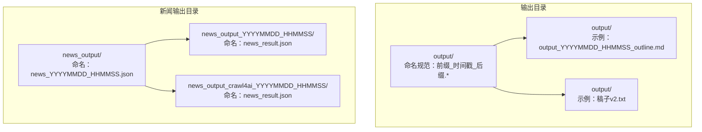
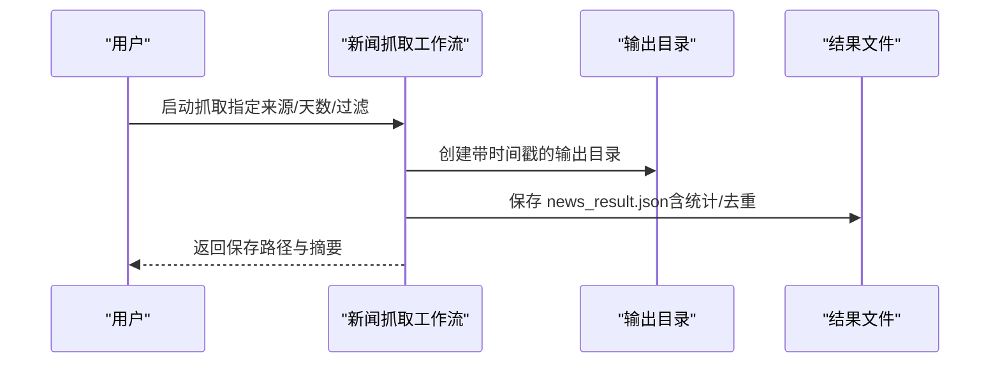
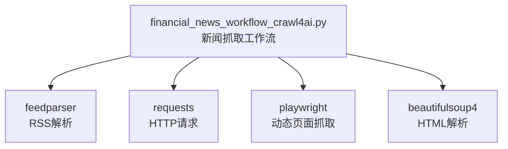

# 输出管理系统

<cite>
**本文引用的文件**
- [output/output_20260321_143500_outline.md](file://output/output_20260321_143500_outline.md)
- [output/output_20260321_150000_outline.md](file://output/output_20260321_150000_outline.md)
- [output/本田利润暴跌的b站口播稿大纲.md](file://output/本田利润暴跌的b站口播稿大纲.md)
- [output/本田利润暴跌的b站口播稿大纲.txt](file://output/本田利润暴跌的b站口播稿大纲.txt)
- [output/稿子v2.txt](file://output/稿子v2.txt)
- [news_output/news_20260324_182234.json](file://news_output/news_20260324_182234.json)
- [news_output_20260324_171659/news_result.json](file://news_output_20260324_171659/news_result.json)
- [news_output_crawl4ai_20260324_115056/news_result.json](file://news_output_crawl4ai_20260324_115056/news_result.json)
- [community_crawler.py](file://community_crawler.py)
- [financial_news_workflow_crawl4ai.py](file://financial_news_workflow_crawl4ai.py)
- [test_all_sources.py](file://test_all_sources.py)
</cite>

## 目录
1. [简介](#简介)
2. [项目结构](#项目结构)
3. [核心组件](#核心组件)
4. [架构总览](#架构总览)
5. [详细组件分析](#详细组件分析)
6. [依赖分析](#依赖分析)
7. [性能考量](#性能考量)
8. [故障排查指南](#故障排查指南)
9. [结论](#结论)
10. [附录](#附录)

## 简介
本文件为 Redbook 系统的输出管理系统提供系统化文档，聚焦输出文件的命名规范、存储管理与版本控制机制，覆盖不同内容类型的命名规则（深度分析报告、B站口播稿、小红书推文、公众号文章、研报简报、大纲/脚本），并梳理 output 文件夹组织结构与管理策略。文档同时阐述时间戳命名的唯一性保障、文件归档最佳实践、质量控制流程、批量处理能力与性能优化建议，帮助读者在不深入代码的情况下高效理解与使用该系统。

## 项目结构
输出管理涉及两类主要输出路径：
- output 目录：存放各类内容产出（大纲、脚本、口播稿等），采用“前缀_时间戳_后缀”的命名约定，确保唯一性与可追溯性。
- news_output 与 news_output_crawl4ai_* 目录：存放新闻抓取结果，采用“前缀_时间戳”的目录命名，内部包含统一的 news_result.json 结果文件，便于批量归档与检索。

**图表来源**
- [output/output_20260321_143500_outline.md](file://output/output_20260321_143500_outline.md)
- [output/output_20260321_150000_outline.md](file://output/output_20260321_150000_outline.md)
- [output/稿子v2.txt](file://output/稿子v2.txt)
- [news_output/news_20260324_182234.json](file://news_output/news_20260324_182234.json)
- [news_output_20260324_171659/news_result.json](file://news_output_20260324_171659/news_result.json)
- [news_output_crawl4ai_20260324_115056/news_result.json](file://news_output_crawl4ai_20260324_115056/news_result.json)

**章节来源**
- [output/output_20260321_143500_outline.md](file://output/output_20260321_143500_outline.md)
- [output/output_20260321_150000_outline.md](file://output/output_20260321_150000_outline.md)
- [output/稿子v2.txt](file://output/稿子v2.txt)
- [news_output/news_20260324_182234.json](file://news_output/news_20260324_182234.json)
- [news_output_20260324_171659/news_result.json](file://news_output_20260324_171659/news_result.json)
- [news_output_crawl4ai_20260324_115056/news_result.json](file://news_output_crawl4ai_20260324_115056/news_result.json)

## 核心组件
- 输出命名与存储
  - output 目录：统一采用“前缀_时间戳_后缀”的命名，时间戳精确到秒，确保文件名唯一性与可排序性。
  - news_output 与 news_output_crawl4ai_*：目录名采用“前缀_时间戳”，内部统一保存 news_result.json，便于批量归档与检索。
- 质量控制与版本管理
  - 大纲与脚本：通过“版本号”字段与“生成时间”字段实现版本追踪与质量控制。
  - JSON 输出：包含抓取统计、来源分布、时间范围等元数据，便于审计与回溯。
- 批量处理与归档
  - 新闻抓取工作流：自动创建带时间戳的输出目录，批量保存结果，支持去重与统计。
  - 社区抓取：自动创建带时间戳的输出目录，保存评论与抓取统计，便于后续分析。

**章节来源**
- [output/output_20260321_143500_outline.md](file://output/output_20260321_143500_outline.md)
- [output/output_20260321_150000_outline.md](file://output/output_20260321_150000_outline.md)
- [output/稿子v2.txt](file://output/稿子v2.txt)
- [news_output/news_20260324_182234.json](file://news_output/news_20260324_182234.json)
- [news_output_20260324_171659/news_result.json](file://news_output_20260324_171659/news_result.json)
- [news_output_crawl4ai_20260324_115056/news_result.json](file://news_output_crawl4ai_20260324_115056/news_result.json)
- [financial_news_workflow_crawl4ai.py](file://financial_news_workflow_crawl4ai.py)
- [community_crawler.py](file://community_crawler.py)

## 架构总览
输出管理系统由“抓取-处理-存储-归档”四个阶段构成，核心流程如下：

**图表来源**
- [financial_news_workflow_crawl4ai.py](file://financial_news_workflow_crawl4ai.py)
- [news_output_crawl4ai_20260324_115056/news_result.json](file://news_output_crawl4ai_20260324_115056/news_result.json)

## 详细组件分析

### 输出命名规范与唯一性保障
- output 目录命名
  - 规范：前缀_时间戳_后缀（如 output_YYYYMMDD_HHMMSS_outline.md）
  - 唯一性：时间戳精确到秒，避免并发重复；前缀用于语义区分（如 outline、稿子）
  - 可读性：时间戳便于排序与检索；后缀指示格式（.md/.txt）
- news_output 目录命名
  - 规范：news_YYYYMMDD_HHMMSS.json（单文件）
  - 规范：news_output_YYYYMMDD_HHMMSS/news_result.json（目录）
  - 规范：news_output_crawl4ai_YYYYMMDD_HHMMSS/news_result.json（目录）
- 唯一性保障机制
  - 时间戳命名：天然唯一，避免文件名冲突
  - 目录隔离：不同批次/来源独立目录，便于归档与回溯
  - 去重策略：新闻抓取工作流对标题进行去重，减少冗余

**章节来源**
- [output/output_20260321_143500_outline.md](file://output/output_20260321_143500_outline.md)
- [output/output_20260321_150000_outline.md](file://output/output_20260321_150000_outline.md)
- [output/稿子v2.txt](file://output/稿子v2.txt)
- [news_output/news_20260324_182234.json](file://news_output/news_20260324_182234.json)
- [news_output_20260324_171659/news_result.json](file://news_output_20260324_171659/news_result.json)
- [news_output_crawl4ai_20260324_115056/news_result.json](file://news_output_crawl4ai_20260324_115056/news_result.json)
- [financial_news_workflow_crawl4ai.py](file://financial_news_workflow_crawl4ai.py)

### 不同内容类型的命名规则
- 深度分析报告
  - 命名：报告主题（中文）+ 生成日期（YYYY-MM）
  - 示例：output_20260321_150000_outline.md（完整版）、output_20260321_143500_outline.md（精简版）
  - 版本控制：包含版本号与适用平台信息，便于追踪与回溯
- B站口播稿
  - 命名：中文主题 + 平台标注（如“B站10分钟口播稿”）
  - 示例：output_20260321_150000_outline.md（含时长分配与删减建议）
  - 多格式：同主题可导出为 .md 与 .txt，便于不同平台使用
- 小红书推文
  - 命名：中文主题 + 时间戳（如 本田利润暴跌的b站口播稿大纲.md）
  - 版本控制：通过“版本号/生成时间/适用平台”字段实现质量控制
- 公众号文章
  - 命名：中文主题 + 时间戳（如 稿子v2.txt）
  - 版本控制：通过“版本号/生成时间/适用平台”字段实现质量控制
- 研报简报
  - 命名：报告主题 + 时间戳（如 output_YYYYMMDD_HHMMSS_outline.md）
  - 版本控制：通过“版本号/生成时间/适用平台”字段实现质量控制
- 大纲/脚本
  - 命名：outline + 时间戳（如 output_YYYYMMDD_HHMMSS_outline.md）
  - 版本控制：通过“版本号/生成时间/适用平台”字段实现质量控制

**章节来源**
- [output/output_20260321_143500_outline.md](file://output/output_20260321_143500_outline.md)
- [output/output_20260321_150000_outline.md](file://output/output_20260321_150000_outline.md)
- [output/本田利润暴跌的b站口播稿大纲.md](file://output/本田利润暴跌的b站口播稿大纲.md)
- [output/本田利润暴跌的b站口播稿大纲.txt](file://output/本田利润暴跌的b站口播稿大纲.txt)
- [output/稿子v2.txt](file://output/稿子v2.txt)

### output 文件夹组织结构与管理策略
- 组织结构
  - output 目录下存放各类内容产物，采用“前缀_时间戳_后缀”的命名，便于按时间排序与检索
  - news_output 目录下存放新闻抓取结果，采用“news_YYYYMMDD_HHMMSS.json”
  - news_output_YYYYMMDD_HHMMSS 目录下统一保存 news_result.json
  - news_output_crawl4ai_YYYYMMDD_HHMMSS 目录下统一保存 news_result.json
- 管理策略
  - 目录隔离：不同批次/来源独立目录，避免覆盖与混淆
  - 元数据标准化：JSON 输出包含抓取时间、来源分布、统计信息等，便于审计与回溯
  - 去重与统计：新闻抓取工作流对标题进行去重，并统计各来源数量

**章节来源**
- [news_output/news_20260324_182234.json](file://news_output/news_20260324_182234.json)
- [news_output_20260324_171659/news_result.json](file://news_output_20260324_171659/news_result.json)
- [news_output_crawl4ai_20260324_115056/news_result.json](file://news_output_crawl4ai_20260324_115056/news_result.json)
- [financial_news_workflow_crawl4ai.py](file://financial_news_workflow_crawl4ai.py)

### 时间戳命名的唯一性保证机制
- 时间戳精确到秒：确保同一秒内不会出现重复文件名
- 目录隔离：不同批次/来源独立目录，避免跨目录冲突
- 去重策略：新闻抓取工作流对标题进行去重，减少冗余
- 可追溯性：时间戳便于排序与检索，支持快速定位与回溯

**章节来源**
- [financial_news_workflow_crawl4ai.py](file://financial_news_workflow_crawl4ai.py)
- [community_crawler.py](file://community_crawler.py)

### 文件归档的最佳实践
- 目录命名规范：统一采用“前缀_时间戳”的目录命名，便于批量归档与检索
- 元数据标准化：JSON 输出包含抓取时间、来源分布、统计信息等，便于审计与回溯
- 去重与统计：新闻抓取工作流对标题进行去重，并统计各来源数量
- 版本控制：通过“版本号/生成时间/适用平台”字段实现质量控制与版本追踪

**章节来源**
- [news_output/news_20260324_182234.json](file://news_output/news_20260324_182234.json)
- [news_output_20260324_171659/news_result.json](file://news_output_20260324_171659/news_result.json)
- [news_output_crawl4ai_20260324_115056/news_result.json](file://news_output_crawl4ai_20260324_115056/news_result.json)
- [financial_news_workflow_crawl4ai.py](file://financial_news_workflow_crawl4ai.py)

### 输出内容的质量控制流程
- 大纲与脚本
  - 版本号字段：用于追踪版本迭代
  - 生成时间字段：用于时间线回溯
  - 适用平台字段：用于平台适配与质量控制
- JSON 输出
  - 抓取统计：记录各来源抓取状态与数量
  - 来源分布：统计各媒体来源数量
  - 时间范围：记录抓取时间范围
- 社区抓取
  - 情感分析：简单关键词匹配实现情感分类
  - 抓取统计：记录各来源抓取状态与数量

**章节来源**
- [output/output_20260321_143500_outline.md](file://output/output_20260321_143500_outline.md)
- [output/output_20260321_150000_outline.md](file://output/output_20260321_150000_outline.md)
- [output/稿子v2.txt](file://output/稿子v2.txt)
- [news_output/news_20260324_182234.json](file://news_output/news_20260324_182234.json)
- [news_output_20260324_171659/news_result.json](file://news_output_20260324_171659/news_result.json)
- [news_output_crawl4ai_20260324_115056/news_result.json](file://news_output_crawl4ai_20260324_115056/news_result.json)
- [community_crawler.py](file://community_crawler.py)

### 批量处理能力
- 新闻抓取工作流
  - 自动创建带时间戳的输出目录
  - 批量保存结果，支持去重与统计
  - 支持多来源组合抓取（如 huxiu、36kr、tmtpost、jiemian、geekpark、latepost、thepaper）
- 社区抓取
  - 自动创建带时间戳的输出目录
  - 批量保存评论与抓取统计
  - 支持多来源组合抓取（如 xueqiu、zhihu）

**章节来源**
- [financial_news_workflow_crawl4ai.py](file://financial_news_workflow_crawl4ai.py)
- [community_crawler.py](file://community_crawler.py)

## 依赖分析
输出管理系统的依赖关系如下：

**图表来源**
- [financial_news_workflow_crawl4ai.py](file://financial_news_workflow_crawl4ai.py)

**章节来源**
- [financial_news_workflow_crawl4ai.py](file://financial_news_workflow_crawl4ai.py)

## 性能考量
- 异步与并发
  - Crawl4AI 支持异步抓取，可显著提升抓取效率
  - 多来源并行抓取，缩短整体耗时
- 超时与重试
  - 设置合理的超时时间，避免长时间阻塞
  - 失败重试与备用策略（如 Playwright 失败后回退到 HTTP 策略）
- 去重与缓存
  - 标题去重减少冗余，提升处理效率
  - 缓存中间结果，避免重复抓取
- I/O 优化
  - 批量写入 JSON 文件，减少频繁 I/O
  - 目录隔离避免文件冲突，提升并发安全性

**章节来源**
- [community_crawler.py](file://community_crawler.py)
- [financial_news_workflow_crawl4ai.py](file://financial_news_workflow_crawl4ai.py)

## 故障排查指南
- 依赖缺失
  - feedparser、requests、playwright、beautifulsoup4 未安装时，系统会打印提示信息
  - 安装命令：pip install feedparser、pip install requests、pip install playwright、pip install beautifulsoup4
- 抓取失败
  - 检查网络连接与目标站点可用性
  - 查看抓取统计与错误信息，定位失败原因
- 解析异常
  - HTML 结构变化导致解析失败，可调整选择器或回退到备用解析策略
- 时间戳冲突
  - 同一秒内多次运行可能产生冲突，建议在自动化调度中增加秒级延时或使用唯一标识符

**章节来源**
- [community_crawler.py](file://community_crawler.py)
- [financial_news_workflow_crawl4ai.py](file://financial_news_workflow_crawl4ai.py)
- [test_all_sources.py](file://test_all_sources.py)

## 结论
Redbook 系统的输出管理系统通过“前缀_时间戳_后缀”的命名规范与目录隔离策略，实现了输出文件的唯一性与可追溯性；通过 JSON 输出的元数据标准化与去重统计，提供了完善的质量控制与审计能力；借助异步抓取与批量处理，显著提升了输出效率。建议在实际使用中遵循命名规范、定期归档、关注依赖安装与网络稳定性，以确保系统稳定运行与高质量输出。

## 附录
- 命名规范速查
  - output 目录：output_YYYYMMDD_HHMMSS_outline.md、稿子v2.txt
  - news_output 目录：news_YYYYMMDD_HHMMSS.json、news_output_YYYYMMDD_HHMMSS/news_result.json、news_output_crawl4ai_YYYYMMDD_HHMMSS/news_result.json
- 版本控制字段
  - 版本号：用于追踪版本迭代
  - 生成时间：用于时间线回溯
  - 适用平台：用于平台适配与质量控制