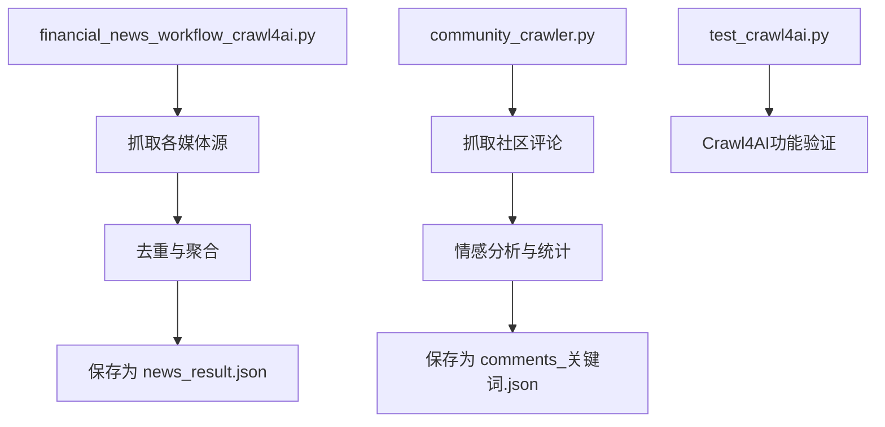
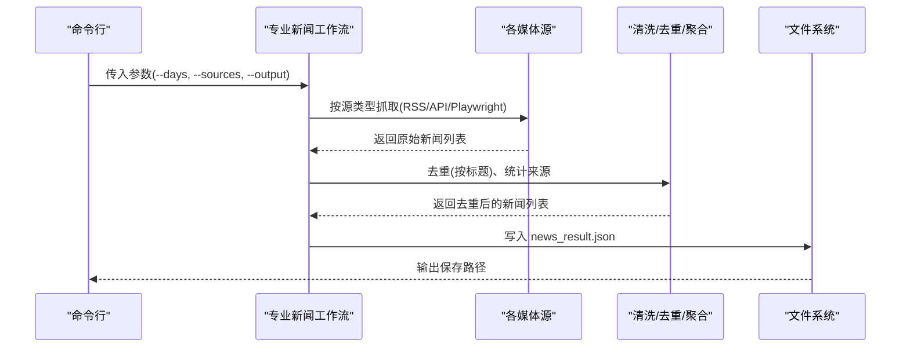
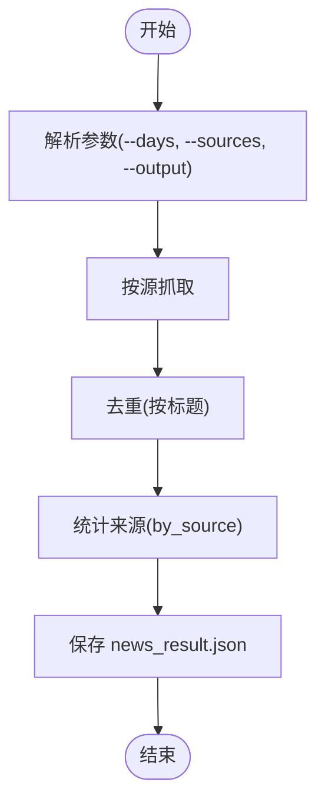
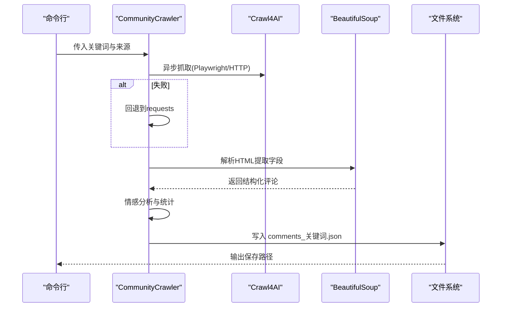
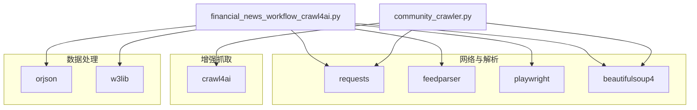

# 数据处理与存储

<cite>
**本文引用的文件**
- [financial_news_workflow_crawl4ai.py](file://financial_news_workflow_crawl4ai.py)
- [community_crawler.py](file://community_crawler.py)
- [test_crawl4ai.py](file://test_crawl4ai.py)
- [requirements.txt](file://requirements.txt)
- [RUN.md](file://docs/RUN.md)
- [news_source_test_result.json](file://news_source_test_result.json)
- [news_20260325_082353.json](file://news_20260325_082353.json)
- [crawled_news/all_news_20260325_122653.json](file://crawled_news/all_news_20260325_122653.json)
- [news_output_20260323_235950/news_result.json](file://news_output_20260323_235950/news_result.json)
- [.gitignore](file://.gitignore)
</cite>

## 目录
1. [简介](#简介)
2. [项目结构](#项目结构)
3. [核心组件](#核心组件)
4. [架构总览](#架构总览)
5. [详细组件分析](#详细组件分析)
6. [依赖分析](#依赖分析)
7. [性能考虑](#性能考虑)
8. [故障排查指南](#故障排查指南)
9. [结论](#结论)
10. [附录](#附录)

## 简介
本文件面向Redbook系统的数据处理与存储功能，系统性梳理新闻数据的采集、清洗、去重、格式化与持久化流程，涵盖以下方面：
- 数据采集与抓取策略：多源RSS/API/动态渲染站点的抓取与回退机制
- 数据清洗与格式化：HTML清理、字段标准化、时间戳管理
- 去重与聚合：基于标题的去重与来源统计
- 存储与命名：统一的JSON格式、时间戳目录与文件命名规则
- 数据完整性与一致性：抓取统计、错误记录与输出结构
- 输出管理与多格式导出：JSON与提示词文本的生成
- 缓存与批量优化：内存缓存、批量写入与并发策略
- 备份与恢复：输出目录结构与版本化命名

## 项目结构
Redbook采用“脚本化工作流 + 结构化输出”的组织方式，核心脚本负责抓取与处理，输出目录按时间戳自动创建，确保每次运行的产物隔离与可追溯。

图表来源
- [financial_news_workflow_crawl4ai.py](file://financial_news_workflow_crawl4ai.py)
- [community_crawler.py](file://community_crawler.py)
- [test_crawl4ai.py](file://test_crawl4ai.py)

章节来源
- [RUN.md](file://docs/RUN.md)
- [financial_news_workflow_crawl4ai.py](file://financial_news_workflow_crawl4ai.py)
- [community_crawler.py](file://community_crawler.py)

## 核心组件
- 专业新闻抓取工作流：从7大权威媒体抓取热点新闻，支持RSS、API与Playwright动态抓取，内置去重与统计输出。
- 社区论坛抓取器：从雪球、知乎抓取用户评论，提供HTML清理、情感分析与统计。
- Crawl4AI功能验证：验证异步抓取与内容提取能力，为动态站点抓取提供保障。
- 输出管理器：统一的JSON结构、时间戳目录与文件命名，支持提示词文本输出。

章节来源
- [financial_news_workflow_crawl4ai.py](file://financial_news_workflow_crawl4ai.py)
- [community_crawler.py](file://community_crawler.py)
- [test_crawl4ai.py](file://test_crawl4ai.py)

## 架构总览
系统采用“多源抓取 -> 清洗与去重 -> 格式化 -> 持久化”的流水线架构，抓取策略按站点类型选择合适手段，并在失败时自动回退，确保数据完整性。

图表来源
- [financial_news_workflow_crawl4ai.py](file://financial_news_workflow_crawl4ai.py)

## 详细组件分析

### 专业新闻抓取工作流
- 多源适配：RSS（feedparser）、API（requests）、动态站点（Playwright）与通用HTTP抓取（requests）。
- 清洗与去重：统一字段结构，按标题去重，统计来源分布。
- 输出管理：自动创建带时间戳的输出目录，保存news_result.json与提示词文本。

图表来源
- [financial_news_workflow_crawl4ai.py](file://financial_news_workflow_crawl4ai.py)

章节来源
- [financial_news_workflow_crawl4ai.py](file://financial_news_workflow_crawl4ai.py)
- [news_20260325_082353.json](file://news_20260325_082353.json)
- [crawled_news/all_news_20260325_122653.json](file://crawled_news/all_news_20260325_122653.json)

### 社区论坛抓取器
- 抓取策略：Crawl4AI异步抓取优先，失败回退到requests；HTML解析依赖BeautifulSoup。
- 清洗：HTML实体解码、标签剔除、空白规范化。
- 分析：简单情感分析（正/负/中性），统计来源与情感分布。
- 输出：保存comments_关键词.json，包含抓取时间、统计与评论列表。

图表来源
- [community_crawler.py](file://community_crawler.py)

章节来源
- [community_crawler.py](file://community_crawler.py)
- [news_output_20260323_235950/news_result.json](file://news_output_20260323_235950/news_result.json)

### Crawl4AI功能验证
- 验证异步抓取、复杂网页解析与AI增强能力，确保动态站点抓取的稳定性。
- 为社区与专业新闻工作流提供回退与增强能力。

章节来源
- [test_crawl4ai.py](file://test_crawl4ai.py)

## 依赖分析
系统依赖分为核心网络库、RSS解析、HTML解析、Playwright浏览器自动化、Crawl4AI增强抓取与数据处理加速等类别，确保多站点抓取与解析的稳定性与性能。

图表来源
- [requirements.txt](file://requirements.txt)
- [financial_news_workflow_crawl4ai.py](file://financial_news_workflow_crawl4ai.py)
- [community_crawler.py](file://community_crawler.py)

章节来源
- [requirements.txt](file://requirements.txt)

## 性能考虑
- 并发与回退：Crawl4AI异步抓取优先，失败自动回退到HTTP策略，减少单点失败影响。
- 批量写入：统一输出目录与JSON序列化，避免频繁IO抖动。
- 去重策略：基于标题集合的去重，时间复杂度接近O(n)，适合批量新闻聚合。
- 依赖优化：使用高性能JSON库与解析库，降低CPU与内存占用。
- 资源控制：Playwright浏览器在headless模式下运行，减少资源消耗。

## 故障排查指南
- 抓取失败：检查网络连接、目标站点可访问性；缩小来源范围；查看命令行输出的错误信息。
- Playwright启动失败：确认已安装Chromium浏览器；以管理员权限运行；检查系统权限。
- 依赖安装失败：升级pip；使用二进制安装；检查网络连通性。
- 输出为空或统计异常：查看测试结果文件，定位具体源的错误类型与原因。

章节来源
- [RUN.md](file://docs/RUN.md)
- [news_source_test_result.json](file://news_source_test_result.json)

## 结论
Redbook系统通过“多源抓取 + 统一清洗 + 去重聚合 + 结构化输出”的流水线，实现了金融新闻与社区评论的高效采集与持久化。系统在可靠性（回退策略）、可扩展性（多源适配）与可维护性（时间戳目录与JSON结构）方面表现良好。建议在生产环境中结合缓存与增量抓取策略，进一步优化性能与资源占用。

## 附录

### 数据格式规范
- 专业新闻输出（news_result.json）
  - 字段概览：抓取时间、总量、来源分布、新闻列表
  - 新闻条目字段：来源、标题、链接、摘要、发布时间
- 社区评论输出（comments_关键词.json）
  - 字段概览：抓取时间、关键词、总量、来源分布、情感分布、抓取统计、评论列表
  - 评论条目字段：来源、关键词、标题、内容、链接、作者、时间、点赞数、评论数、抓取时间、情感、情感分数

章节来源
- [news_20260325_082353.json](file://news_20260325_082353.json)
- [news_output_20260323_235950/news_result.json](file://news_output_20260323_235950/news_result.json)

### 文件命名与目录结构
- 专业新闻输出目录：news_output_crawl4ai_YYYYMMDD_HHMMSS
- 社区评论输出目录：community_output_YYYYMMDD_HHMMSS
- 输出文件：news_result.json、comments_关键词.json、prompt.txt（提示词文本）

章节来源
- [financial_news_workflow_crawl4ai.py](file://financial_news_workflow_crawl4ai.py)
- [community_crawler.py](file://community_crawler.py)

### 时间戳管理
- 抓取时间：抓取时记录ISO 8601格式时间
- 发布时间：各源提供的发布时间字符串，统一保留原格式
- 输出目录：以运行时刻创建带时间戳的子目录，确保幂等与可追溯

章节来源
- [financial_news_workflow_crawl4ai.py](file://financial_news_workflow_crawl4ai.py)
- [community_crawler.py](file://community_crawler.py)

### 数据完整性保证
- 抓取统计：记录每个来源的状态与数量，便于审计与回溯
- 错误记录：对失败来源记录错误类型，辅助定位问题
- 去重策略：按标题去重，避免重复内容污染分析结果

章节来源
- [financial_news_workflow_crawl4ai.py](file://financial_news_workflow_crawl4ai.py)
- [news_source_test_result.json](file://news_source_test_result.json)

### 输出管理器与多格式导出
- JSON导出：news_result.json、comments_关键词.json
- 提示词导出：prompt.txt（专业新闻工作流）
- 导出策略：统一结构、统一编码、缩进一致，便于后续分析与可视化

章节来源
- [financial_news_workflow_crawl4ai.py](file://financial_news_workflow_crawl4ai.py)
- [community_crawler.py](file://community_crawler.py)

### 备份与恢复
- 输出目录按时间戳命名，天然具备版本化特性
- 建议定期归档输出目录，避免磁盘空间不足
- .gitignore排除Python与IDE缓存、本地配置与凭据文件，避免误提交

章节来源
- [.gitignore](file://.gitignore)