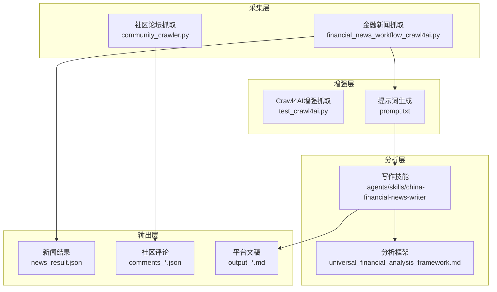
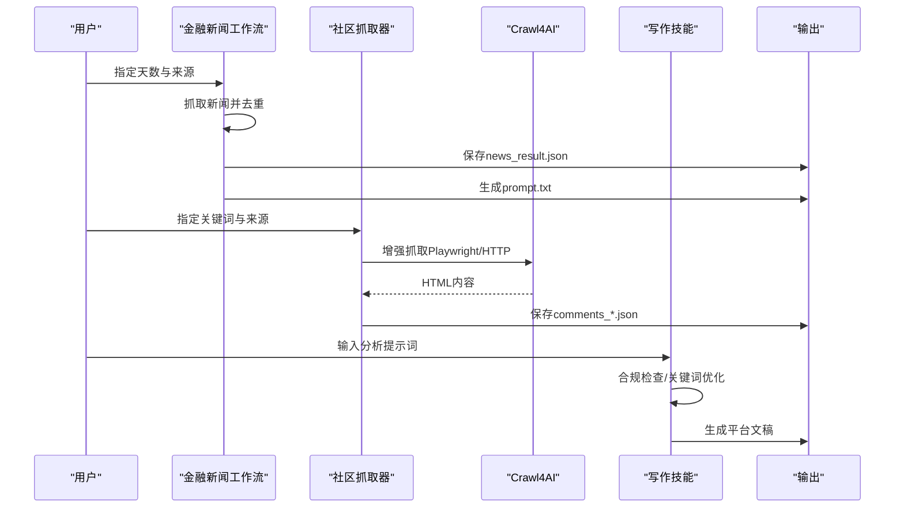
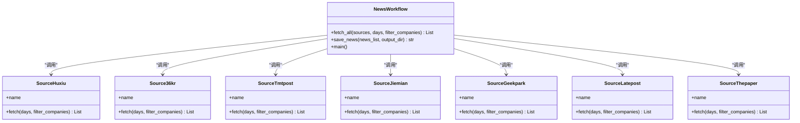
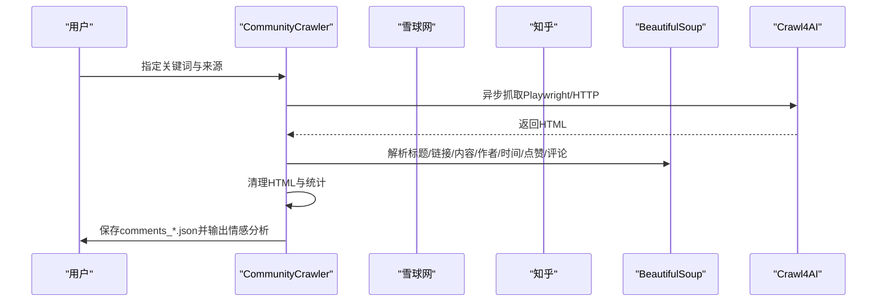
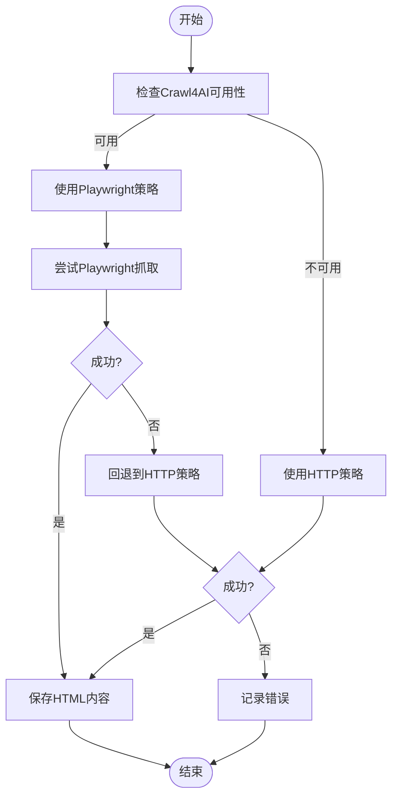
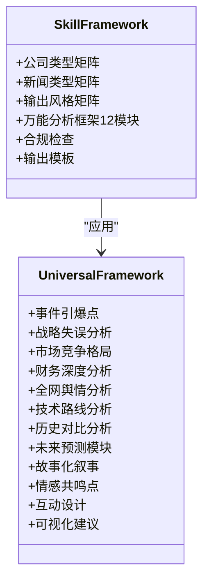
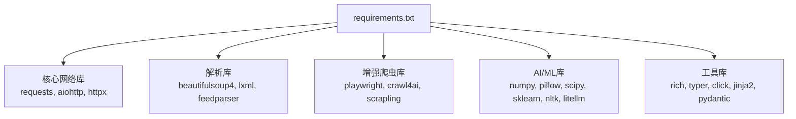

# 核心功能特性

<cite>
**本文引用的文件**
- [financial_news_workflow_crawl4ai.py](file://financial_news_workflow_crawl4ai.py)
- [community_crawler.py](file://community_crawler.py)
- [test_crawl4ai.py](file://test_crawl4ai.py)
- [requirements.txt](file://requirements.txt)
- [news_output_crawl4ai_20260324_103448\news_result.json](file://news_output_crawl4ai_20260324_103448/news_result.json)
- [news_output_crawl4ai_20260324_103448\prompt.txt](file://news_output_crawl4ai_20260324_103448/prompt.txt)
- [news_output_20260323_235950\news_result.json](file://news_output_20260323_235950/news_result.json)
- [.claude\settings.local.json](file://.claude/settings.local.json)
- [design_philosophy.md](file://design/design_philosophy.md)
- [docs\RUN.md](file://docs/RUN.md)
- [docs\SPEC.md](file://docs/SPEC.md)
- [.agents\skills\china-financial-news-writer\SKILL.md](file://.agents/skills/china-financial-news-writer/SKILL.md)
- [.agents\skills\china-financial-news-writer\references\universal_financial_analysis_framework.md](file://.agents/skills/china-financial-news-writer/references/universal_financial_analysis_framework.md)
</cite>

## 目录
1. [简介](#简介)
2. [项目结构](#项目结构)
3. [核心组件](#核心组件)
4. [架构概览](#架构概览)
5. [详细组件分析](#详细组件分析)
6. [依赖分析](#依赖分析)
7. [性能考虑](#性能考虑)
8. [故障排除指南](#故障排除指南)
9. [结论](#结论)
10. [附录](#附录)

## 简介
本文件面向Redbook系统的核心功能特性，系统围绕四大能力构建：自动化新闻采集、AI增强内容分析、社区论坛监控、多平台内容生成。通过统一的工作流，用户可从权威财经媒体抓取热点新闻，结合社区舆情与AI分析，生成面向小红书、公众号、研报等多平台的内容素材，支撑内容创作与投资决策。

## 项目结构
系统采用脚本化与技能化相结合的组织方式：
- 自动化采集脚本：金融新闻抓取与社区论坛抓取
- AI增强能力：Crawl4AI爬虫策略与提示词生成
- 技能化写作：面向不同平台的写作框架与合规检查
- 输出与示例：标准化JSON输出与提示词模板

**图表来源**
- [financial_news_workflow_crawl4ai.py:1-454](file://financial_news_workflow_crawl4ai.py#L1-L454)
- [community_crawler.py:1-604](file://community_crawler.py#L1-L604)
- [test_crawl4ai.py:1-163](file://test_crawl4ai.py#L1-L163)
- [.agents\skills\china-financial-news-writer\SKILL.md:1-476](file://.agents/skills/china-financial-news-writer/SKILL.md#L1-L476)
- [.agents\skills\china-financial-news-writer\references\universal_financial_analysis_framework.md:1-126](file://.agents/skills/china-financial-news-writer/references/universal_financial_analysis_framework.md#L1-L126)

**章节来源**
- [docs\RUN.md:1-252](file://docs/RUN.md#L1-L252)
- [docs\SPEC.md:1-183](file://docs/SPEC.md#L1-L183)

## 核心组件
- 自动化新闻采集：支持RSS/API/动态渲染站点，多源聚合、去重与统计
- 社区论坛监控：关键词搜索、情感分析、多策略抓取（Crawl4AI/requests）
- AI增强内容分析：提示词生成、合规检查、关键词优化
- 多平台内容生成：小红书/公众号/研报模板，配套可视化建议

**章节来源**
- [financial_news_workflow_crawl4ai.py:94-359](file://financial_news_workflow_crawl4ai.py#L94-L359)
- [community_crawler.py:82-497](file://community_crawler.py#L82-L497)
- [.agents\skills\china-financial-news-writer\SKILL.md:11-51](file://.agents/skills/china-financial-news-writer/SKILL.md#L11-L51)

## 架构概览
系统采用“采集-增强-分析-生成”的流水线架构：
- 采集层：多源适配，统一输出JSON
- 增强层：Crawl4AI策略与提示词模板
- 分析层：写作框架与合规检查
- 生成层：多平台模板与可视化建议

**图表来源**
- [financial_news_workflow_crawl4ai.py:405-454](file://financial_news_workflow_crawl4ai.py#L405-L454)
- [community_crawler.py:501-604](file://community_crawler.py#L501-L604)
- [test_crawl4ai.py:29-119](file://test_crawl4ai.py#L29-L119)
- [.agents\skills\china-financial-news-writer\SKILL.md:239-287](file://.agents/skills/china-financial-news-writer/SKILL.md#L239-L287)

## 详细组件分析

### 自动化新闻采集（金融新闻工作流）
- 多源适配：RSS（虎嗅、钛媒体、界面）、API（36氪）、动态渲染（极客公园、晚点LatePost）、请求抓取（澎湃新闻）
- 过滤与去重：按公司名过滤、标题去重、统计来源与公司分布
- 输出：news_result.json（含抓取时间、日期范围、统计与新闻列表）

**图表来源**
- [financial_news_workflow_crawl4ai.py:94-359](file://financial_news_workflow_crawl4ai.py#L94-L359)
- [financial_news_workflow_crawl4ai.py:363-454](file://financial_news_workflow_crawl4ai.py#L363-L454)

**章节来源**
- [financial_news_workflow_crawl4ai.py:94-359](file://financial_news_workflow_crawl4ai.py#L94-L359)
- [financial_news_workflow_crawl4ai.py:363-454](file://financial_news_workflow_crawl4ai.py#L363-L454)
- [news_output_20260323_235950\news_result.json:1-168](file://news_output_20260323_235950/news_result.json#L1-L168)

### 社区论坛监控（社区抓取器）
- 多源支持：雪球、知乎
- 抓取策略：Crawl4AI（Playwright/HTTP）与requests备选
- 内容解析：BeautifulSoup解析、HTML清理、多选择器兼容
- 情感分析：关键词匹配（正/负/中）
- 输出：comments_关键词.json（含来源统计、情感分布）

**图表来源**
- [community_crawler.py:82-497](file://community_crawler.py#L82-L497)
- [test_crawl4ai.py:29-119](file://test_crawl4ai.py#L29-L119)

**章节来源**
- [community_crawler.py:82-497](file://community_crawler.py#L82-L497)
- [test_crawl4ai.py:1-163](file://test_crawl4ai.py#L1-L163)

### AI增强内容分析（Crawl4AI）
- 功能测试：基础抓取、复杂网页、AI增强抓取
- 策略切换：Playwright失败时自动回退HTTP策略
- 应用场景：动态网页、反爬对抗、内容提取与链接提取

**图表来源**
- [test_crawl4ai.py:127-140](file://test_crawl4ai.py#L127-L140)
- [community_crawler.py:127-176](file://community_crawler.py#L127-L176)

**章节来源**
- [test_crawl4ai.py:1-163](file://test_crawl4ai.py#L1-L163)
- [community_crawler.py:127-176](file://community_crawler.py#L127-L176)

### 多平台内容生成（写作技能）
- 三维分类矩阵：公司类型×新闻类型×输出风格
- 万能分析框架：12大模块覆盖事件、战略、竞争、财务、舆情、技术、历史、预测、叙事、情感、互动、可视化
- 合规检查：敏感词扫描、投资建议合规、数据来源标注
- 输出规格：小红书/公众号/研报/深度报告模板与配图建议

**图表来源**
- [.agents\skills\china-financial-news-writer\SKILL.md:24-52](file://.agents/skills/china-financial-news-writer/SKILL.md#L24-L52)
- [.agents\skills\china-financial-news-writer\references\universal_financial_analysis_framework.md:1-126](file://.agents/skills/china-financial-news-writer/references/universal_financial_analysis_framework.md#L1-L126)

**章节来源**
- [.agents\skills\china-financial-news-writer\SKILL.md:11-51](file://.agents/skills/china-financial-news-writer/SKILL.md#L11-L51)
- [.agents\skills\china-financial-news-writer\references\universal_financial_analysis_framework.md:1-126](file://.agents/skills/china-financial-news-writer/references/universal_financial_analysis_framework.md#L1-L126)

## 依赖分析
系统依赖分为核心网络库、解析库、增强爬虫库、AI/ML库与工具库五大类，满足多源抓取、动态渲染、AI增强与内容生成需求。

**图表来源**
- [requirements.txt:1-144](file://requirements.txt#L1-L144)

**章节来源**
- [requirements.txt:1-144](file://requirements.txt#L1-L144)

## 性能考虑
- 并行与异步：多源并发抓取、异步Crawl4AI策略，降低总体延迟
- 策略回退：Playwright失败自动回退HTTP策略，提升成功率
- 内存与IO：统一JSON输出、按需解析、去重与统计减少冗余
- 可观测性：详细日志输出、抓取统计、错误记录，便于定位问题

[本节为通用性能指导，无需列出章节来源]

## 故障排除指南
- 抓取失败：检查网络、网站可访问性、缩小来源范围、查看命令行错误
- Playwright启动失败：确认已安装Chromium浏览器、以管理员权限运行
- 依赖安装失败：升级pip、离线安装或使用二进制包、检查网络
- 输出为空：确认关键词与来源配置、检查解析选择器与HTML结构变化

**章节来源**
- [docs\RUN.md:144-188](file://docs/RUN.md#L144-L188)

## 结论
Redbook系统通过“采集-增强-分析-生成”的闭环，实现了从权威媒体到社区舆情的全链路信息整合，并借助AI增强与写作技能，将原始数据转化为多平台可落地的内容素材。系统具备良好的扩展性与可维护性，适合持续迭代与规模化应用。

[本节为总结性内容，无需列出章节来源]

## 附录

### 使用示例与效果展示
- 金融新闻工作流：抓取近10天的多家权威媒体，生成news_result.json与prompt.txt，用于后续分析与内容生成
- 社区论坛工作流：按关键词抓取雪球/知乎评论，输出comments_*.json并进行情感分析
- 写作技能：基于提示词生成小红书/公众号/研报等风格文稿，内置合规检查与可视化建议

**章节来源**
- [docs\RUN.md:113-143](file://docs/RUN.md#L113-L143)
- [news_output_crawl4ai_20260324_103448\news_result.json:1-34](file://news_output_crawl4ai_20260324_103448/news_result.json#L1-L34)
- [news_output_crawl4ai_20260324_103448\prompt.txt:1-54](file://news_output_crawl4ai_20260324_103448/prompt.txt#L1-L54)

### 设计哲学与视觉表达
- Flux Economics：通过几何与对比表达市场张力，强调视觉层次与信号色彩，为内容呈现提供设计语言

**章节来源**
- [design_philosophy.md:1-16](file://design/design_philosophy.md#L1-L16)