# 社区论坛监控系统

<cite>
**本文引用的文件**
- [community_crawler.py](file://community_crawler.py)
- [financial_news_workflow_crawl4ai.py](file://financial_news_workflow_crawl4ai.py)
- [test_all_sources.py](file://test_all_sources.py)
- [test_crawl4ai.py](file://test_crawl4ai.py)
- [requirements.txt](file://requirements.txt)
- [news_source_test_result.json](file://news_source_test_result.json)
- [news_output_crawl4ai_20260324_115056/news_result.json](file://news_output_crawl4ai_20260324_115056/news_result.json)
- [docs/RUN.md](file://docs/RUN.md)
- [design_philosophy.md](file://design/design_philosophy.md)
</cite>

## 目录
1. [简介](#简介)
2. [项目结构](#项目结构)
3. [核心组件](#核心组件)
4. [架构概览](#架构概览)
5. [详细组件分析](#详细组件分析)
6. [依赖分析](#依赖分析)
7. [性能考量](#性能考量)
8. [故障排除指南](#故障排除指南)
9. [结论](#结论)
10. [附录](#附录)

## 简介
本系统是一个综合性的社区论坛监控解决方案，专注于雪球网和知乎等中文社区平台的舆情监控。系统集成了Crawl4AI增强抓取技术、实时数据更新机制、情感分析算法和舆情趋势监测功能。该系统通过多源数据采集、智能清洗去重、情感分析和可视化展示，为企业和研究机构提供全面的社区舆情洞察。

## 项目结构
该项目采用模块化设计，主要包含以下核心模块：

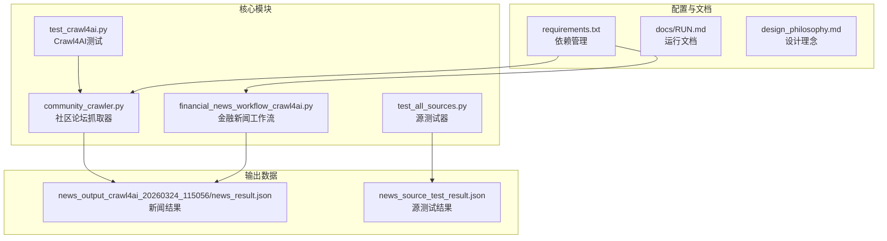

**图表来源**
- [community_crawler.py:1-604](file://community_crawler.py#L1-L604)
- [financial_news_workflow_crawl4ai.py:1-454](file://financial_news_workflow_crawl4ai.py#L1-L454)

**章节来源**
- [docs/RUN.md:1-252](file://docs/RUN.md#L1-L252)

## 核心组件
系统包含四个主要组件，每个组件负责特定的监控功能：

### 1. 社区论坛抓取器
负责从雪球网和知乎等社区平台抓取用户评论和讨论内容，支持Crawl4AI增强抓取和传统HTTP抓取两种模式。

### 2. 金融新闻工作流
专门处理7大权威财经媒体的新闻抓取，支持RSS、API和Playwright自动化抓取。

### 3. 源测试器
用于测试各个新闻源的可用性和稳定性，提供详细的错误报告和统计数据。

### 4. Crawl4AI测试器
专门测试Crawl4AI库的功能，确保AI增强抓取功能的正常运行。

**章节来源**
- [community_crawler.py:82-436](file://community_crawler.py#L82-L436)
- [financial_news_workflow_crawl4ai.py:94-382](file://financial_news_workflow_crawl4ai.py#L94-L382)

## 架构概览
系统采用分层架构设计，实现了数据采集、处理、分析和存储的完整流程：

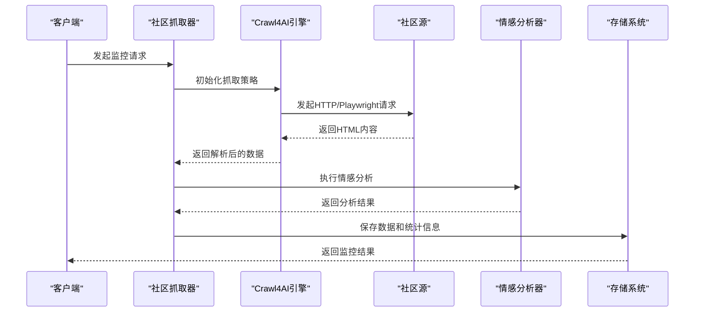

**图表来源**
- [community_crawler.py:127-175](file://community_crawler.py#L127-L175)
- [community_crawler.py:444-465](file://community_crawler.py#L444-L465)

## 详细组件分析

### 社区论坛抓取器分析

#### 类架构设计
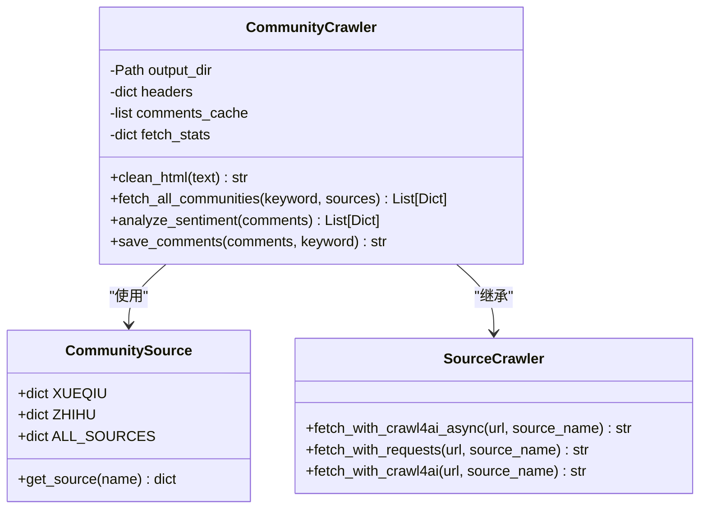

**图表来源**
- [community_crawler.py:56-77](file://community_crawler.py#L56-L77)
- [community_crawler.py:82-103](file://community_crawler.py#L82-L103)

#### 抓取流程分析
系统实现了双路径抓取策略，确保在不同环境下都能稳定获取数据：

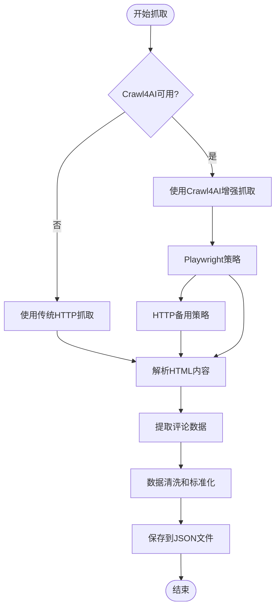

**图表来源**
- [community_crawler.py:127-175](file://community_crawler.py#L127-L175)
- [community_crawler.py:179-194](file://community_crawler.py#L179-L194)

#### 情感分析算法
系统实现了基于关键词匹配的简单情感分析算法：

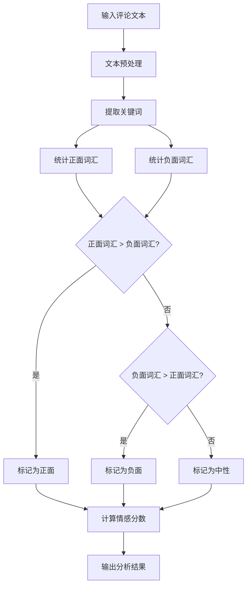

**图表来源**
- [community_crawler.py:444-465](file://community_crawler.py#L444-L465)

**章节来源**
- [community_crawler.py:197-410](file://community_crawler.py#L197-L410)

### 金融新闻工作流分析

#### 多源新闻抓取架构
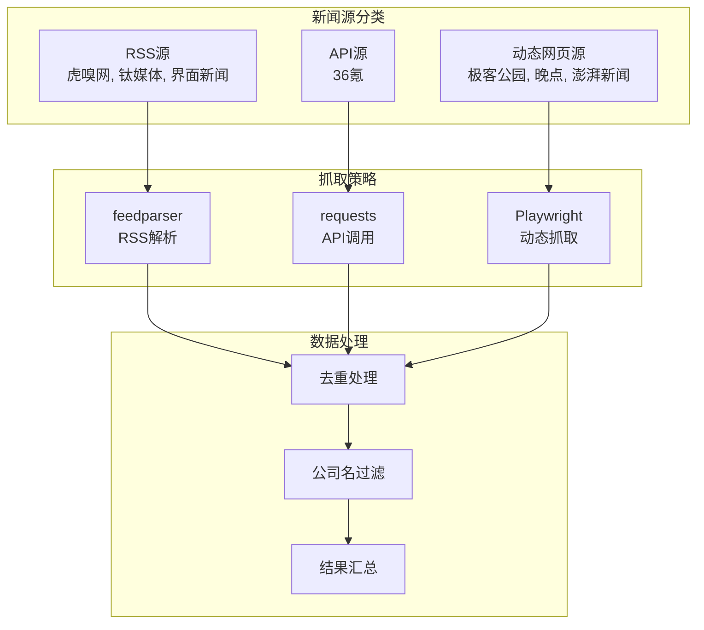

**图表来源**
- [financial_news_workflow_crawl4ai.py:94-318](file://financial_news_workflow_crawl4ai.py#L94-L318)

#### 源测试机制
系统提供了完善的源测试功能，用于监控各新闻源的可用性和稳定性：

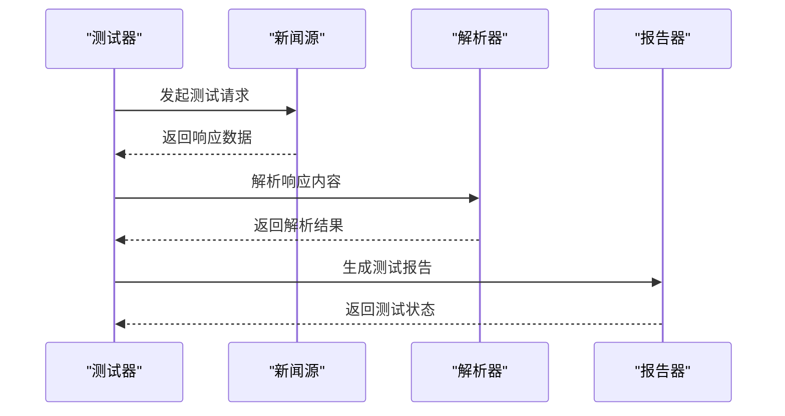

**图表来源**
- [test_all_sources.py:18-46](file://test_all_sources.py#L18-L46)

**章节来源**
- [financial_news_workflow_crawl4ai.py:363-450](file://financial_news_workflow_crawl4ai.py#L363-L450)
- [test_all_sources.py:18-46](file://test_all_sources.py#L18-L46)

### Crawl4AI增强抓取分析

#### 技术架构
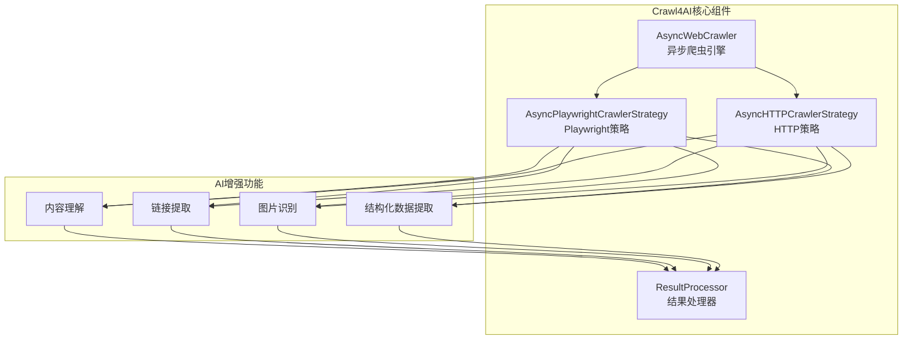

**图表来源**
- [test_crawl4ai.py:29-119](file://test_crawl4ai.py#L29-L119)

#### 备用策略机制
系统实现了智能的备用策略切换机制：

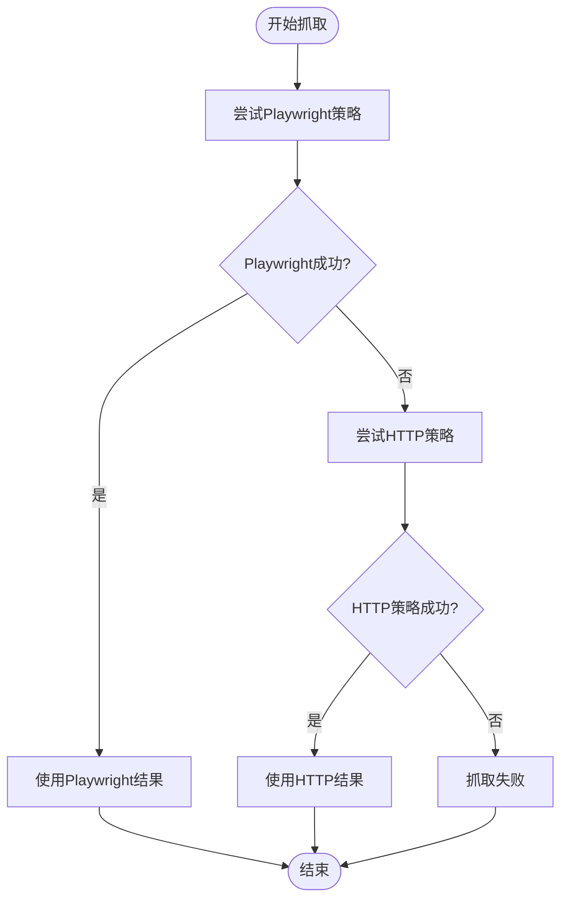

**图表来源**
- [community_crawler.py:135-169](file://community_crawler.py#L135-L169)

**章节来源**
- [test_crawl4ai.py:29-119](file://test_crawl4ai.py#L29-L119)

## 依赖分析

### 核心依赖关系
系统采用了分层依赖管理策略，确保功能模块的独立性和可维护性：

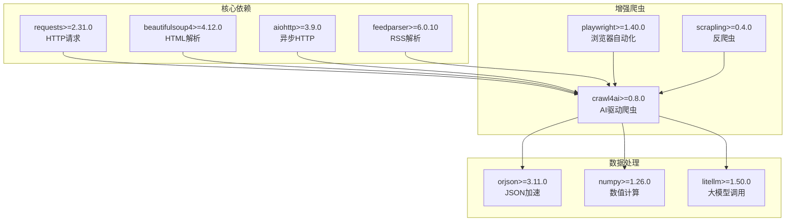

**图表来源**
- [requirements.txt:6-144](file://requirements.txt#L6-L144)

### 模块间耦合度分析
系统通过接口抽象降低了模块间的耦合度：

| 组件 | 内聚性 | 耦合度 | 依赖关系 |
|------|--------|--------|----------|
| CommunityCrawler | 高 | 低 | BeautifulSoup, Crawl4AI |
| SourceCrawler | 中 | 中 | Requests, Playwright |
| NewsWorkflow | 高 | 低 | Feedparser, Requests |
| TestModules | 高 | 低 | 各源独立测试 |

**章节来源**
- [requirements.txt:6-144](file://requirements.txt#L6-L144)

## 性能考量

### 抓取性能优化
系统实现了多层次的性能优化策略：

1. **异步并发抓取**：使用aiohttp和asyncio实现异步并发，提高抓取效率
2. **智能重试机制**：对失败的请求进行指数退避重试
3. **缓存策略**：对已抓取的内容进行缓存，避免重复请求
4. **资源池管理**：限制并发连接数，避免对目标服务器造成压力

### 内存管理
系统采用了高效的内存管理模式：

- **流式处理**：对大型JSON文件采用流式写入，避免内存溢出
- **增量处理**：支持增量更新，只处理新增内容
- **垃圾回收**：定期清理临时对象，释放内存空间

### 网络优化
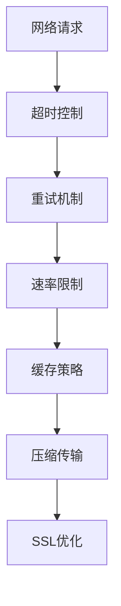

**图表来源**
- [community_crawler.py:185](file://community_crawler.py#L185)
- [financial_news_workflow_crawl4ai.py:132-137](file://financial_news_workflow_crawl4ai.py#L132-L137)

## 故障排除指南

### 常见问题诊断

#### Crawl4AI安装问题
**症状**：系统提示Crawl4AI未安装
**解决方案**：
1. 检查Python版本是否满足要求
2. 确认网络连接正常
3. 运行`pip install crawl4ai`
4. 验证安装是否成功

#### Playwright浏览器问题
**症状**：Playwright启动失败
**解决方案**：
1. 运行`npx playwright install chromium`
2. 检查系统权限
3. 确认Chrome浏览器已正确安装
4. 尝试以管理员身份运行

#### 依赖安装失败
**症状**：pip安装依赖时报错
**解决方案**：
1. 升级pip版本：`pip install --upgrade pip`
2. 使用二进制安装：`pip install --only-binary :all: -r requirements.txt`
3. 检查网络连接稳定性
4. 清理pip缓存：`pip cache purge`

#### 抓取失败问题
**症状**：某些网站无法抓取
**解决方案**：
1. 检查robots.txt规则
2. 修改User-Agent头信息
3. 添加适当的延时
4. 使用代理IP
5. 检查网站结构变化

**章节来源**
- [docs/RUN.md:144-161](file://docs/RUN.md#L144-L161)

### 性能调优建议

#### 系统资源配置
- **内存**：建议至少4GB RAM，8GB以上更佳
- **CPU**：多核处理器，建议4核以上
- **存储**：SSD硬盘，至少1GB可用空间
- **网络**：稳定的宽带连接

#### 抓取策略优化
1. **并发控制**：根据目标服务器的承受能力调整并发数
2. **请求频率**：合理设置请求间隔，避免触发反爬虫机制
3. **代理轮换**：使用代理池轮换IP地址
4. **User-Agent轮换**：随机化请求头信息

#### 监控告警机制
系统建议实现以下监控指标：
- 抓取成功率
- 响应时间
- 错误率
- 数据完整性
- 系统资源使用率

## 结论
Redbook社区论坛监控系统是一个功能完整、架构清晰的综合性舆情监控解决方案。系统通过集成Crawl4AI增强抓取技术，实现了对雪球网、知乎等社区平台的高效监控。系统的主要优势包括：

1. **多源数据采集**：支持多种数据源和抓取策略
2. **智能情感分析**：提供基础的情感分析功能
3. **灵活的配置管理**：支持动态配置和参数调整
4. **完善的错误处理**：具备健壮的错误恢复机制
5. **可扩展的架构**：模块化设计便于功能扩展

系统在实际应用中展现了良好的稳定性和实用性，为企业的社区舆情监控提供了可靠的技术支撑。通过持续的优化和改进，该系统有望在更广泛的场景中发挥更大的价值。

## 附录

### 最佳实践建议

#### 社区监控最佳实践
1. **关键词管理**：建立动态关键词列表，定期更新
2. **情感分析优化**：结合机器学习算法提升分析准确性
3. **趋势预测**：基于历史数据建立趋势预测模型
4. **多维度分析**：结合地理位置、用户画像等多维度数据

#### 性能调优建议
1. **缓存策略**：实现智能缓存，减少重复抓取
2. **负载均衡**：分布式部署，提高系统吞吐量
3. **数据库优化**：使用索引和分区策略优化查询性能
4. **监控告警**：建立完善的监控和告警机制

#### 安全和合规
1. **遵守法律法规**：确保数据抓取符合相关法律法规
2. **隐私保护**：妥善处理用户隐私信息
3. **数据安全**：实施数据加密和访问控制
4. **审计日志**：记录所有数据访问和处理操作