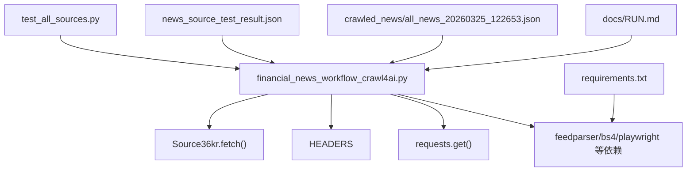
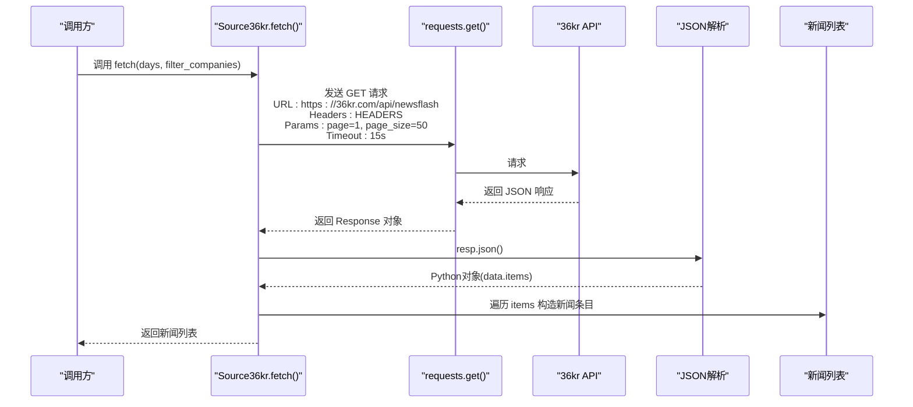
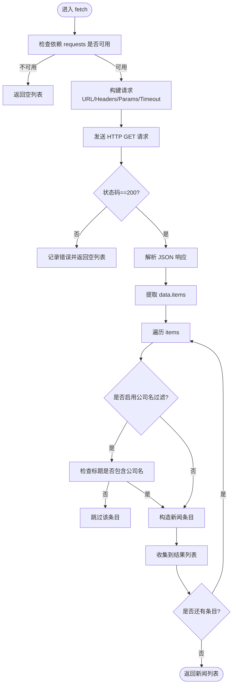
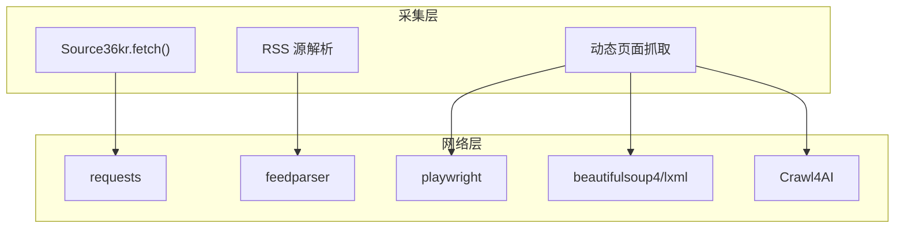

# API接口采集

<cite>
**本文引用的文件**
- [financial_news_workflow_crawl4ai.py](file://financial_news_workflow_crawl4ai.py)
- [requirements.txt](file://requirements.txt)
- [test_all_sources.py](file://test_all_sources.py)
- [news_source_test_result.json](file://news_source_test_result.json)
- [crawled_news/all_news_20260325_122653.json](file://crawled_news/all_news_20260325_122653.json)
- [docs/RUN.md](file://docs/RUN.md)
</cite>

## 目录
1. [简介](#简介)
2. [项目结构](#项目结构)
3. [核心组件](#核心组件)
4. [架构概览](#架构概览)
5. [详细组件分析](#详细组件分析)
6. [依赖分析](#依赖分析)
7. [性能考虑](#性能考虑)
8. [故障排查指南](#故障排查指南)
9. [结论](#结论)
10. [附录](#附录)

## 简介
本文件面向Redbook系统的API接口采集功能，重点围绕36氪API源的采集机制进行深入说明。内容涵盖API端点配置、HTTP请求构建、JSON数据解析、新闻条目提取流程，以及认证机制、请求参数、响应数据结构与错误处理策略。同时对比API源相较RSS与动态抓取的优势（数据结构标准化、接口稳定性好、信息完整性高等），并提供API配置参数、超时设置、重试机制与性能优化建议。

## 项目结构
Redbook项目采用按功能模块划分的组织方式，其中与API采集直接相关的核心文件如下：
- financial_news_workflow_crawl4ai.py：包含7大权威媒体的采集实现，其中36氪使用API方式抓取
- requirements.txt：定义了网络请求、HTML解析、Crawl4AI等依赖
- test_all_sources.py：批量测试各媒体源的连通性与解析能力
- news_source_test_result.json：测试结果样例，展示36氪API的成功状态与样本数据
- crawled_news/all_news_20260325_122653.json：实际采集输出样例，包含36氪条目的字段结构
- docs/RUN.md：运行说明与参数说明，便于部署与使用

图表来源
- [financial_news_workflow_crawl4ai.py:122-155](file://financial_news_workflow_crawl4ai.py#L122-L155)
- [requirements.txt:1-144](file://requirements.txt#L1-L144)
- [test_all_sources.py:1-49](file://test_all_sources.py#L1-L49)
- [news_source_test_result.json:1-74](file://news_source_test_result.json#L1-L74)
- [crawled_news/all_news_20260325_122653.json:1-200](file://crawled_news/all_news_20260325_122653.json#L1-L200)
- [docs/RUN.md:1-252](file://docs/RUN.md#L1-L252)

章节来源
- [financial_news_workflow_crawl4ai.py:122-155](file://financial_news_workflow_crawl4ai.py#L122-L155)
- [requirements.txt:1-144](file://requirements.txt#L1-L144)
- [docs/RUN.md:1-252](file://docs/RUN.md#L1-L252)

## 核心组件
- Source36kr类：封装36氪API的采集逻辑，负责HTTP请求、JSON解析与新闻条目提取
- HEADERS常量：统一的请求头，模拟浏览器访问
- fetch方法：对外暴露的静态方法，支持天数过滤与公司名过滤开关
- 依赖管理：通过requirements.txt声明requests等核心依赖

章节来源
- [financial_news_workflow_crawl4ai.py:122-155](file://financial_news_workflow_crawl4ai.py#L122-L155)
- [financial_news_workflow_crawl4ai.py:86-89](file://financial_news_workflow_crawl4ai.py#L86-L89)
- [requirements.txt:6-11](file://requirements.txt#L6-L11)

## 架构概览
36氪API采集的整体流程如下：
- 初始化：加载HEADERS与依赖
- 发起HTTP请求：向36kr API端点发送GET请求，携带分页参数
- 响应解析：将JSON响应转为Python对象，提取data.items
- 条目提取：遍历条目，构造标准新闻字段（来源、标题、链接、摘要、发布时间）
- 过滤与输出：可选公司名过滤，最终输出统一格式的新闻列表

图表来源
- [financial_news_workflow_crawl4ai.py:126-155](file://financial_news_workflow_crawl4ai.py#L126-L155)
- [financial_news_workflow_crawl4ai.py:86-89](file://financial_news_workflow_crawl4ai.py#L86-L89)

## 详细组件分析

### 36氪API采集流程详解
- 端点与请求参数
  - 端点：https://36kr.com/api/newsflash
  - 参数：page=1, page_size=50
  - 超时：15秒
  - 请求头：使用HEADERS（包含User-Agent与Accept）

- 响应数据结构
  - 顶层包含data字段，其下包含items数组
  - items中的每个条目包含title、description、published_at、id等字段
  - 实际输出中，链接由“https://36kr.com/newsflashes/{id}”拼接

- 新闻条目提取
  - 标题：取自条目title
  - 链接：拼接newsflashes路径与id
  - 摘要：取自description，截断至200字符
  - 发布时间：取自published_at并转为字符串
  - 来源：固定为“36 氪”

- 过滤机制
  - 支持可选的公司名过滤：当filter_companies为True时，仅保留标题包含FAMOUS_COMPANIES中任一公司的条目

- 错误处理
  - 捕获异常并打印错误信息，返回空列表，保证整体流程稳定

图表来源
- [financial_news_workflow_crawl4ai.py:126-155](file://financial_news_workflow_crawl4ai.py#L126-L155)
- [financial_news_workflow_crawl4ai.py:62-84](file://financial_news_workflow_crawl4ai.py#L62-L84)

章节来源
- [financial_news_workflow_crawl4ai.py:122-155](file://financial_news_workflow_crawl4ai.py#L122-L155)
- [financial_news_workflow_crawl4ai.py:62-84](file://financial_news_workflow_crawl4ai.py#L62-L84)

### API配置参数与超时设置
- 端点：https://36kr.com/api/newsflash
- 请求头：HEADERS（包含User-Agent与Accept）
- 分页参数：page=1, page_size=50
- 超时：15秒
- 输出字段：source、title、link、summary、published

章节来源
- [financial_news_workflow_crawl4ai.py:126-155](file://financial_news_workflow_crawl4ai.py#L126-L155)
- [financial_news_workflow_crawl4ai.py:86-89](file://financial_news_workflow_crawl4ai.py#L86-L89)

### 错误处理策略
- 依赖缺失：若requests未安装，直接返回空列表
- HTTP异常：捕获异常并打印错误，返回空列表
- 结果为空：若items为空，仍返回空列表，避免中断流程

章节来源
- [financial_news_workflow_crawl4ai.py:128-130](file://financial_news_workflow_crawl4ai.py#L128-L130)
- [financial_news_workflow_crawl4ai.py:153-155](file://financial_news_workflow_crawl4ai.py#L153-L155)

### 与其他采集方式的对比
- API源优势
  - 数据结构标准化：统一的JSON响应，字段明确，便于解析与入库
  - 接口稳定性好：无需解析复杂HTML，减少因页面结构调整导致的失效
  - 信息完整性高：API通常提供更丰富的元数据（如发布时间、描述等）
- RSS源（如虎嗅、钛媒体、界面新闻）：结构简单，但字段较少，需额外解析HTML摘要
- 动态抓取（如极客公园、晚点）：适合复杂页面，但对反爬虫与网络环境要求更高

章节来源
- [financial_news_workflow_crawl4ai.py:94-119](file://financial_news_workflow_crawl4ai.py#L94-L119)
- [financial_news_workflow_crawl4ai.py:158-183](file://financial_news_workflow_crawl4ai.py#L158-L183)
- [financial_news_workflow_crawl4ai.py:215-263](file://financial_news_workflow_crawl4ai.py#L215-L263)
- [financial_news_workflow_crawl4ai.py:266-318](file://financial_news_workflow_crawl4ai.py#L266-L318)

## 依赖分析
- requests：用于HTTP请求发送与响应解析
- feedparser：用于RSS源解析
- playwright：用于动态页面抓取
- beautifulsoup4/lxml/cssselect：用于HTML解析（在社区抓取中使用）
- Crawl4AI：用于增强抓取（在社区抓取中使用）

图表来源
- [requirements.txt:6-11](file://requirements.txt#L6-L11)
- [requirements.txt:13-19](file://requirements.txt#L13-L19)
- [requirements.txt:27-35](file://requirements.txt#L27-L35)
- [financial_news_workflow_crawl4ai.py:38-57](file://financial_news_workflow_crawl4ai.py#L38-L57)

章节来源
- [requirements.txt:1-144](file://requirements.txt#L1-L144)
- [financial_news_workflow_crawl4ai.py:38-57](file://financial_news_workflow_crawl4ai.py#L38-L57)

## 性能考虑
- 超时设置：36氪API请求超时为15秒，平衡了稳定性与响应速度
- 分页参数：page_size=50，控制单次返回数量，避免过大响应体
- 依赖安装：确保requests等依赖正确安装，减少运行时异常
- 批量测试：通过test_all_sources.py验证各源连通性，提前发现潜在问题
- 输出去重：主程序提供去重逻辑，减少重复数据对下游的影响

章节来源
- [financial_news_workflow_crawl4ai.py:132-137](file://financial_news_workflow_crawl4ai.py#L132-L137)
- [financial_news_workflow_crawl4ai.py:363-381](file://financial_news_workflow_crawl4ai.py#L363-L381)
- [test_all_sources.py:18-46](file://test_all_sources.py#L18-L46)

## 故障排查指南
- 依赖缺失
  - 症状：requests未安装导致36氪API无法使用
  - 处理：安装依赖并重新运行
- 网络异常
  - 症状：HTTP状态码非200或超时
  - 处理：检查网络连接、代理设置或提高超时时间
- 页面结构变化
  - 症状：RSS/动态抓取源解析失败
  - 处理：更新选择器或切换到API源（如36氪）
- 输出验证
  - 使用news_source_test_result.json与crawled_news样例核对字段结构与数据完整性

章节来源
- [requirements.txt:6-11](file://requirements.txt#L6-L11)
- [news_source_test_result.json:14-24](file://news_source_test_result.json#L14-L24)
- [crawled_news/all_news_20260325_122653.json:10-200](file://crawled_news/all_news_20260325_122653.json#L10-L200)

## 结论
36氪API采集通过标准化的HTTP请求与JSON解析，实现了稳定、高效的新闻数据获取。其优势在于接口稳定、数据结构清晰、字段丰富，适合大规模、持续性的新闻采集任务。结合依赖管理、错误处理与批量测试机制，能够有效提升系统的可靠性与可维护性。

## 附录
- 运行参数与示例：参见docs/RUN.md中的命令与参数说明
- 测试样例：news_source_test_result.json展示了36氪API的成功状态与样本数据
- 输出样例：crawled_news/all_news_20260325_122653.json展示了实际采集后的字段结构

章节来源
- [docs/RUN.md:50-84](file://docs/RUN.md#L50-L84)
- [news_source_test_result.json:14-24](file://news_source_test_result.json#L14-L24)
- [crawled_news/all_news_20260325_122653.json:10-200](file://crawled_news/all_news_20260325_122653.json#L10-L200)