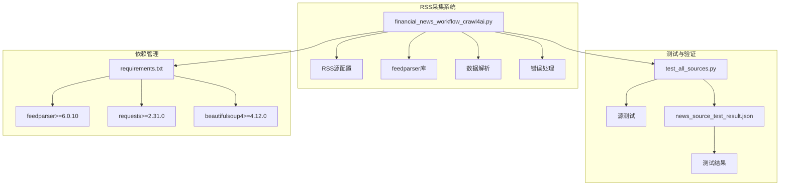
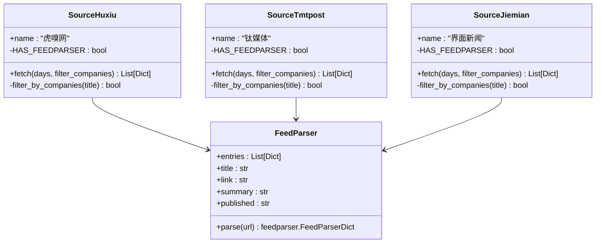
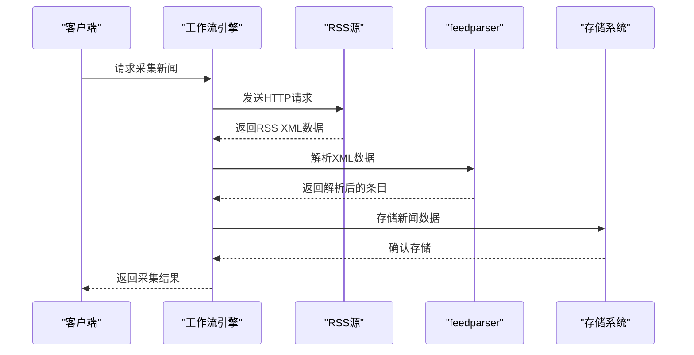
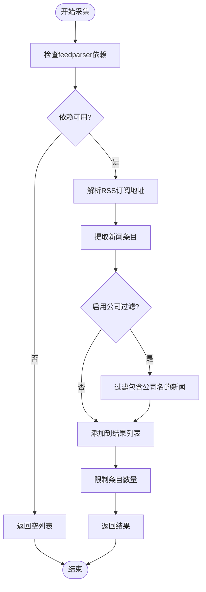
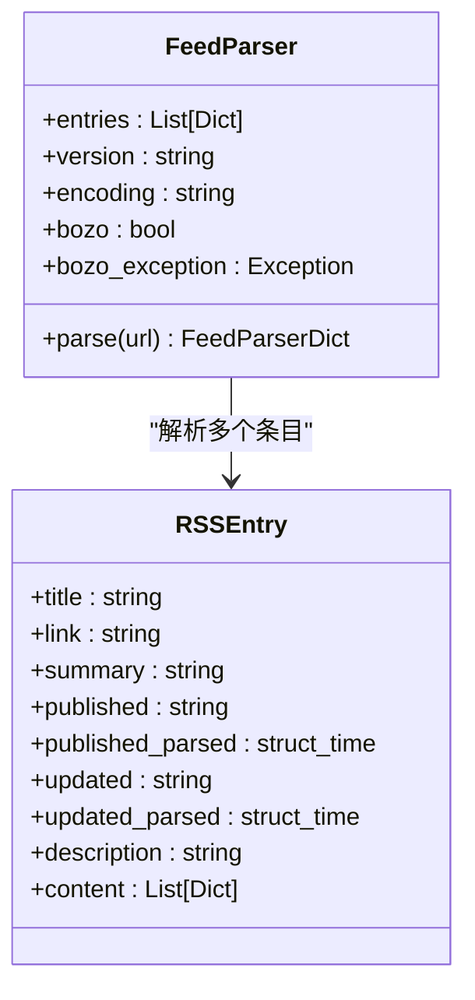
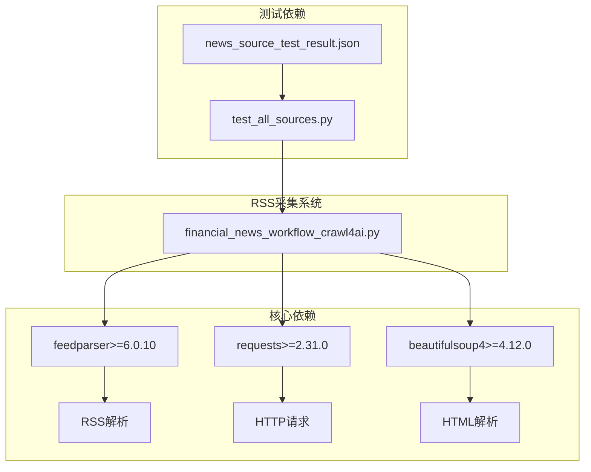
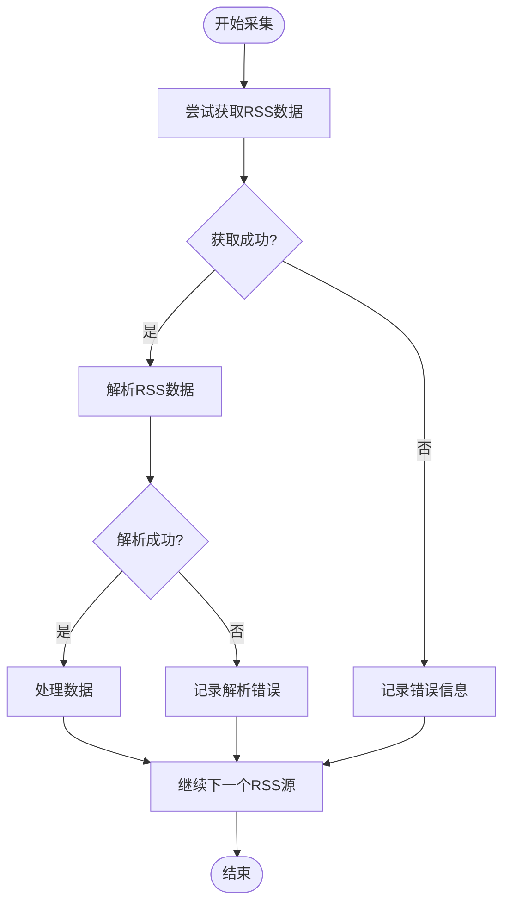

# RSS媒体源采集

<cite>
**本文档引用的文件**
- [financial_news_workflow_crawl4ai.py](file://financial_news_workflow_crawl4ai.py)
- [test_all_sources.py](file://test_all_sources.py)
- [requirements.txt](file://requirements.txt)
- [news_source_test_result.json](file://news_source_test_result.json)
- [news_output_crawl4ai_20260324_102649\news_result.json](file://news_output_crawl4ai_20260324_102649/news_result.json)
- [news_output_crawl4ai_20260324_115056\news_result.json](file://news_output_crawl4ai_20260324_115056/news_result.json)
</cite>

## 目录
1. [简介](#简介)
2. [项目结构](#项目结构)
3. [核心组件](#核心组件)
4. [架构概览](#架构概览)
5. [详细组件分析](#详细组件分析)
6. [依赖关系分析](#依赖关系分析)
7. [性能考虑](#性能考虑)
8. [故障排除指南](#故障排除指南)
9. [结论](#结论)

## 简介

Redbook系统的RSS媒体源采集功能是一个基于feedparser库的RSS订阅采集系统，专门用于从虎嗅网、钛媒体、界面新闻等权威财经媒体源获取新闻资讯。该系统采用RSS订阅方式，相比传统的网页抓取方式具有更高的稳定性、更快的响应速度和更低的资源消耗。

系统支持RSS订阅地址配置、XML数据解析、新闻条目提取等核心功能，能够自动处理RSS源的特殊格式、数据格式转换和时间戳处理，并具备完善的错误恢复机制。

## 项目结构

**图表来源**
- [financial_news_workflow_crawl4ai.py:1-454](file://financial_news_workflow_crawl4ai.py#L1-L454)
- [requirements.txt:1-144](file://requirements.txt#L1-L144)

**章节来源**
- [financial_news_workflow_crawl4ai.py:1-454](file://financial_news_workflow_crawl4ai.py#L1-L454)
- [requirements.txt:1-144](file://requirements.txt#L1-L144)

## 核心组件

### RSS源配置类

系统采用面向对象的设计模式，为每个RSS源创建专门的配置类：

**图表来源**
- [financial_news_workflow_crawl4ai.py:94-212](file://financial_news_workflow_crawl4ai.py#L94-L212)

### 数据结构设计

系统使用标准化的数据结构来存储RSS源采集的信息：

| 字段名称 | 数据类型 | 描述 | 示例 |
|---------|---------|------|------|
| source | string | 媒体源名称 | "虎嗅网" |
| title | string | 新闻标题 | "小米新SU7，雷军输不起" |
| link | string | 新闻链接 | "http://www.huxiu.com/..." |
| summary | string | 新闻摘要 | "本文来自..." |
| published | string | 发布时间 | "Fri, 20 Mar 2026 14:05:39 +0800" |

**章节来源**
- [financial_news_workflow_crawl4ai.py:94-212](file://financial_news_workflow_crawl4ai.py#L94-L212)

## 架构概览

**图表来源**
- [financial_news_workflow_crawl4ai.py:98-119](file://financial_news_workflow_crawl4ai.py#L98-L119)
- [financial_news_workflow_crawl4ai.py:162-180](file://financial_news_workflow_crawl4ai.py#L162-L180)
- [financial_news_workflow_crawl4ai.py:190-212](file://financial_news_workflow_crawl4ai.py#L190-L212)

## 详细组件分析

### 虎嗅网RSS源采集

虎嗅网采用RSS订阅方式获取新闻资讯，使用feedparser库解析RSS XML数据：

**图表来源**
- [financial_news_workflow_crawl4ai.py:98-119](file://financial_news_workflow_crawl4ai.py#L98-L119)

**章节来源**
- [financial_news_workflow_crawl4ai.py:94-119](file://financial_news_workflow_crawl4ai.py#L94-L119)

### 钛媒体RSS源采集

钛媒体RSS源采用相同的采集模式，但使用不同的RSS订阅地址：

**章节来源**
- [financial_news_workflow_crawl4ai.py:158-183](file://financial_news_workflow_crawl4ai.py#L158-L183)

### 界面新闻RSS源采集

界面新闻RSS源使用特殊的RSS订阅地址参数：

**章节来源**
- [financial_news_workflow_crawl4ai.py:186-212](file://financial_news_workflow_crawl4ai.py#L186-L212)

### feedparser库使用详解

系统通过feedparser库实现RSS数据的解析和提取：

**图表来源**
- [financial_news_workflow_crawl4ai.py:31-36](file://financial_news_workflow_crawl4ai.py#L31-L36)

**章节来源**
- [financial_news_workflow_crawl4ai.py:31-36](file://financial_news_workflow_crawl4ai.py#L31-L36)

## 依赖关系分析

**图表来源**
- [requirements.txt:13-18](file://requirements.txt#L13-L18)
- [requirements.txt:6-11](file://requirements.txt#L6-L11)

**章节来源**
- [requirements.txt:1-144](file://requirements.txt#L1-L144)

## 性能考虑

### RSS源采集优势

RSS源相比其他抓取方式具有以下优势：

1. **稳定性高**：RSS是标准化的XML格式，数据结构稳定可靠
2. **响应速度快**：直接获取XML数据，无需解析复杂的网页结构
3. **资源消耗少**：网络请求量小，CPU和内存占用低
4. **数据一致性**：RSS格式统一，解析逻辑简单

### 性能优化策略

系统采用以下优化策略：

1. **批量处理**：每次只处理前50个RSS条目，避免数据过多
2. **错误隔离**：单个RSS源的错误不影响其他源的采集
3. **依赖检查**：在使用feedparser前检查依赖是否安装
4. **时间戳处理**：自动处理RSS中的时间戳格式

## 故障排除指南

### 常见问题及解决方案

| 问题类型 | 症状 | 解决方案 |
|---------|------|----------|
| 依赖缺失 | "feedparser未安装" | 运行 `pip install feedparser` |
| 网络连接 | "HTTP错误" | 检查网络连接和RSS源可用性 |
| 解析失败 | "XML解析错误" | 验证RSS源URL格式正确 |
| 时间戳问题 | "时间格式不正确" | 检查RSS源的时间格式标准 |

### 错误恢复机制

系统具备完善的错误处理和恢复机制：

**图表来源**
- [financial_news_workflow_crawl4ai.py:117-119](file://financial_news_workflow_crawl4ai.py#L117-L119)
- [financial_news_workflow_crawl4ai.py:181-183](file://financial_news_workflow_crawl4ai.py#L181-L183)
- [financial_news_workflow_crawl4ai.py:211-212](file://financial_news_workflow_crawl4ai.py#L211-L212)

**章节来源**
- [financial_news_workflow_crawl4ai.py:117-119](file://financial_news_workflow_crawl4ai.py#L117-L119)
- [financial_news_workflow_crawl4ai.py:181-183](file://financial_news_workflow_crawl4ai.py#L181-L183)
- [financial_news_workflow_crawl4ai.py:211-212](file://financial_news_workflow_crawl4ai.py#L211-L212)

## 结论

Redbook系统的RSS媒体源采集功能通过feedparser库实现了高效、稳定的RSS数据采集。系统采用模块化设计，支持多个RSS源的并行采集，具备完善的错误处理和恢复机制。

RSS源采集相比传统网页抓取方式具有显著优势：更高的稳定性、更快的响应速度和更低的资源消耗。系统通过标准化的数据结构和严格的错误处理，确保了数据质量和系统的可靠性。

未来可以考虑的功能扩展包括：支持更多RSS源、增强数据过滤功能、优化性能指标等，以进一步提升系统的实用性和用户体验。