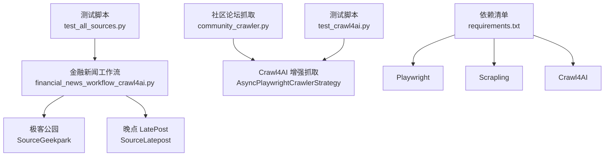
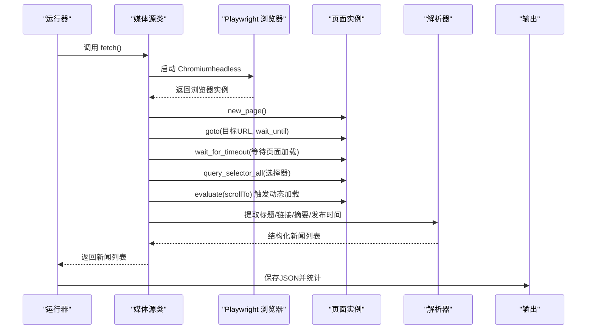
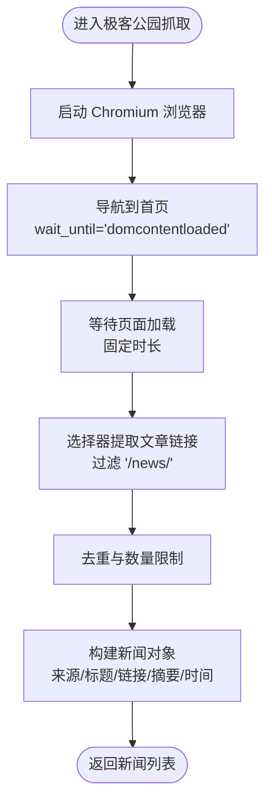
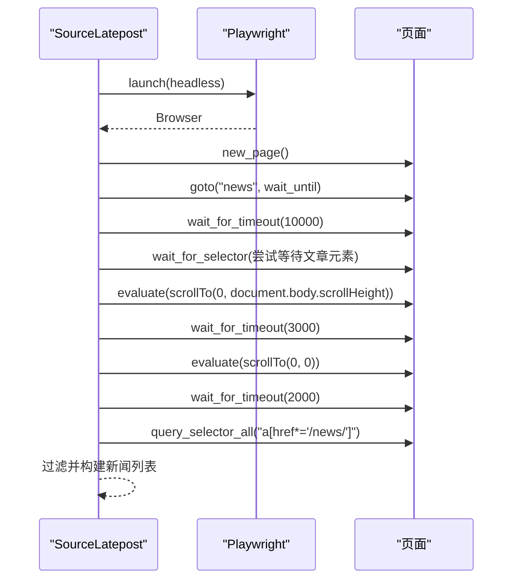
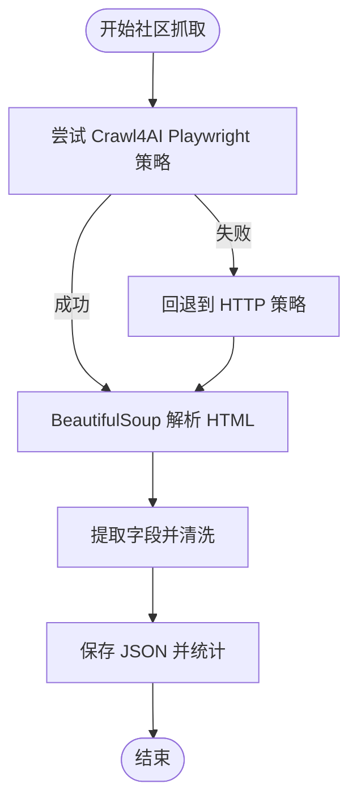
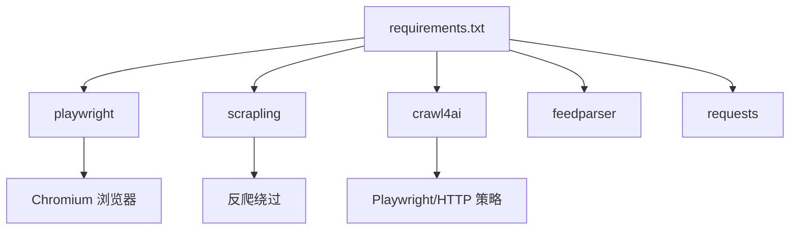

# 动态网页抓取

<cite>
**本文引用的文件**
- [financial_news_workflow_crawl4ai.py](file://financial_news_workflow_crawl4ai.py)
- [community_crawler.py](file://community_crawler.py)
- [requirements.txt](file://requirements.txt)
- [test_all_sources.py](file://test_all_sources.py)
- [test_crawl4ai.py](file://test_crawl4ai.py)
- [news_20260325_082353.json](file://news_20260325_082353.json)
- [news_output_crawl4ai_20260324_103448\news_result.json](file://news_output_crawl4ai_20260324_103448\news_result.json)
- [news_output_crawl4ai_20260324_103448\prompt.txt](file://news_output_crawl4ai_20260324_103448\prompt.txt)
</cite>

## 目录
1. [简介](#简介)
2. [项目结构](#项目结构)
3. [核心组件](#核心组件)
4. [架构总览](#架构总览)
5. [详细组件分析](#详细组件分析)
6. [依赖分析](#依赖分析)
7. [性能考虑](#性能考虑)
8. [故障排查指南](#故障排查指南)
9. [结论](#结论)
10. [附录](#附录)

## 简介
本文件面向Redbook系统的动态网页抓取能力，重点解释极客公园与晚点两个动态网页源的采集机制。系统采用多策略混合抓取：对静态RSS/API/常规HTML站点使用requests或feedparser；对需要JavaScript渲染、动态加载、反爬对抗的站点（如极客公园、晚点）采用Playwright进行浏览器自动化。文档涵盖浏览器启动配置、页面导航控制、元素选择器使用、滚动交互模拟、数据提取逻辑，以及动态抓取相较静态抓取的优势、Playwright配置要点、性能优化技巧与常见问题解决方案。

## 项目结构
- 动态抓取主流程位于金融新闻工作流脚本中，包含7个媒体源的抓取类，其中极客公园与晚点使用Playwright。
- 社区论坛抓取脚本展示了Crawl4AI与Playwright策略的结合使用，体现动态网页抓取的增强能力。
- 依赖清单定义了Playwright、Scrapling、Crawl4AI等关键库及其版本范围。
- 测试脚本验证各媒体源可用性与抓取结果，辅助定位问题。

图表来源
- [financial_news_workflow_crawl4ai.py:361-454](file://financial_news_workflow_crawl4ai.py#L361-L454)
- [community_crawler.py:125-176](file://community_crawler.py#L125-L176)
- [requirements.txt:27-35](file://requirements.txt#L27-L35)
- [test_all_sources.py:18-49](file://test_all_sources.py#L18-L49)
- [test_crawl4ai.py:13-22](file://test_crawl4ai.py#L13-L22)

章节来源
- [financial_news_workflow_crawl4ai.py:1-454](file://financial_news_workflow_crawl4ai.py#L1-L454)
- [community_crawler.py:1-604](file://community_crawler.py#L1-L604)
- [requirements.txt:1-144](file://requirements.txt#L1-L144)
- [test_all_sources.py:1-49](file://test_all_sources.py#L1-L49)
- [test_crawl4ai.py:1-163](file://test_crawl4ai.py#L1-L163)

## 核心组件
- 动态抓取引擎（Playwright）：负责启动Chromium浏览器、导航页面、等待动态内容加载、滚动触发更多内容、提取链接与文本。
- 页面解析与数据提取：对抓取到的HTML进行选择器匹配、正则抽取、字段清洗与结构化输出。
- 多策略回退：当Playwright失败时，系统可回退至HTTP策略或requests策略，提升鲁棒性。
- 输出与统计：统一输出JSON，包含抓取时间、来源分布、去重后的新闻列表等。

章节来源
- [financial_news_workflow_crawl4ai.py:215-318](file://financial_news_workflow_crawl4ai.py#L215-L318)
- [community_crawler.py:125-176](file://community_crawler.py#L125-L176)

## 架构总览
系统采用“媒体源分类 + 动态/静态策略适配”的架构。对需要JS渲染的站点（极客公园、晚点）使用Playwright；对RSS/API/常规HTML站点使用feedparser或requests；对复杂前端应用或反爬站点，提供Crawl4AI与Playwright双策略回退。

图表来源
- [financial_news_workflow_crawl4ai.py:266-318](file://financial_news_workflow_crawl4ai.py#L266-L318)

## 详细组件分析

### 极客公园（动态渲染 + 反爬挑战）
- 浏览器启动与导航
  - 使用同步Playwright，启动Chromium并设置headless模式。
  - 导航至首页，等待DOM内容加载完成，再等待固定时长确保动态内容加载。
- 元素选择与链接提取
  - 通过选择器筛选包含“/news/”路径的链接，限定文章链接格式。
  - 对重复链接进行去重，限制抓取数量。
- 数据提取与输出
  - 从链接文本提取标题摘要，构造标准新闻对象，包含来源、标题、链接、摘要、发布时间等字段。
- 反爬虫应对
  - 使用headless模式降低指纹暴露；页面等待与滚动模拟缓解懒加载与反爬策略。
- 性能与稳定性
  - 设置较长超时时间，避免网络波动导致失败；对异常进行捕获并记录。

图表来源
- [financial_news_workflow_crawl4ai.py:215-264](file://financial_news_workflow_crawl4ai.py#L215-L264)

章节来源
- [financial_news_workflow_crawl4ai.py:215-264](file://financial_news_workflow_crawl4ai.py#L215-L264)

### 晚点（动态内容加载 + 滚动交互）
- 浏览器启动与导航
  - 导航至新闻列表页，等待DOM加载完成后，尝试等待特定文章元素出现。
- 滚动交互模拟
  - 向下滚动到底部触发更多内容加载，再回到顶部，再次等待内容稳定。
- 链接筛选与提取
  - 使用更宽泛的选择器查找文章链接，进一步筛选包含特定标识的详情页链接。
- 数据提取与输出
  - 从链接文本提取标题摘要，构造标准新闻对象，包含来源、标题、链接、摘要、发布时间等字段。

图表来源
- [financial_news_workflow_crawl4ai.py:266-318](file://financial_news_workflow_crawl4ai.py#L266-L318)

章节来源
- [financial_news_workflow_crawl4ai.py:266-318](file://financial_news_workflow_crawl4ai.py#L266-L318)

### 社区论坛抓取（Crawl4AI + Playwright 回退）
- 策略选择
  - 优先使用Crawl4AI的AsyncPlaywrightCrawlerStrategy，利用内置Chromium浏览器处理复杂页面。
  - 若Playwright失败，回退至AsyncHTTPCrawlerStrategy，保证抓取成功率。
- 页面解析
  - 使用BeautifulSoup解析HTML，针对不同站点尝试多种选择器组合，提取标题、链接、内容、作者、时间、点赞数、评论数等字段。
- 输出与统计
  - 统计各来源抓取状态与数量，保存为JSON文件，包含情感分析结果与抓取统计。

图表来源
- [community_crawler.py:125-176](file://community_crawler.py#L125-L176)
- [community_crawler.py:214-286](file://community_crawler.py#L214-L286)

章节来源
- [community_crawler.py:125-176](file://community_crawler.py#L125-L176)
- [community_crawler.py:214-286](file://community_crawler.py#L214-L286)

### 数据结构与输出
- 统一字段
  - source：来源名称
  - title：标题
  - link：原文链接
  - summary：摘要
  - published：发布时间
- 示例输出（节选）
  - [news_20260325_082353.json:1-77](file://news_20260325_082353.json#L1-L77)
  - [news_output_crawl4ai_20260324_103448\news_result.json:1-34](file://news_output_crawl4ai_20260324_103448\news_result.json#L1-L34)

章节来源
- [news_20260325_082353.json:1-77](file://news_20260325_082353.json#L1-L77)
- [news_output_crawl4ai_20260324_103448\news_result.json:1-34](file://news_output_crawl4ai_20260324_103448\news_result.json#L1-L34)

## 依赖分析
- Playwright：用于浏览器自动化，支持Chromium，提供页面导航、等待、滚动、选择器查询等能力。
- Scrapling：提供反爬绕过、自适应解析、代理轮换等增强能力，适合复杂站点。
- Crawl4AI：提供AI驱动的网页解析与内容提取，支持HTTP与Playwright策略，具备回退机制。
- feedparser：用于RSS订阅解析，适合稳定且结构化的新闻源。
- requests：用于常规HTTP请求，适合API或静态HTML站点。

图表来源
- [requirements.txt:27-35](file://requirements.txt#L27-L35)
- [requirements.txt:23-25](file://requirements.txt#L23-L25)
- [requirements.txt:13-14](file://requirements.txt#L13-L14)
- [requirements.txt:7-8](file://requirements.txt#L7-L8)

章节来源
- [requirements.txt:1-144](file://requirements.txt#L1-L144)

## 性能考虑
- 浏览器启动成本
  - Playwright启动Chromium有一定开销，建议复用浏览器实例或减少并发实例数量。
- 等待策略
  - 使用wait_until与wait_for_timeout平衡稳定性与速度；对动态内容可先等待关键元素出现，再滚动触发更多内容。
- 选择器与滚动
  - 选择器尽量精准，减少全页面扫描；滚动次数与等待时长需权衡，避免过度等待。
- 回退策略
  - 在Playwright失败时快速回退到HTTP策略，提高整体成功率。
- 输出与去重
  - 抓取完成后进行去重与统计，减少无效数据传输与存储压力。

## 故障排查指南
- Playwright未安装或浏览器不可用
  - 确认已安装Playwright并执行浏览器安装命令；检查headless模式与超时设置。
  - 参考：[requirements.txt:139-140](file://requirements.txt#L139-L140)
- 页面加载缓慢或超时
  - 增加等待时间或改为等待关键元素出现；检查网络环境与代理配置。
- 选择器失效
  - 针对站点结构变化，准备多种选择器组合并进行降级处理。
- 数据为空或字段缺失
  - 检查HTML结构变化与编码问题；必要时增加BeautifulSoup解析与正则抽取。
- Crawl4AI不可用
  - 确认Crawl4AI安装与依赖；若不可用，回退到HTTP策略。
  - 参考：[test_crawl4ai.py:13-22](file://test_crawl4ai.py#L13-L22)
- 媒体源测试失败
  - 使用测试脚本逐个验证媒体源可用性，定位具体异常。
  - 参考：[test_all_sources.py:18-49](file://test_all_sources.py#L18-L49)

章节来源
- [requirements.txt:139-140](file://requirements.txt#L139-L140)
- [test_crawl4ai.py:13-22](file://test_crawl4ai.py#L13-L22)
- [test_all_sources.py:18-49](file://test_all_sources.py#L18-L49)

## 结论
Redbook系统通过Playwright与Crawl4AI的组合，实现了对动态网页的高效抓取。极客公园与晚点的动态内容加载与反爬策略通过浏览器自动化、滚动交互与等待策略得到有效应对。配合多策略回退与稳健的数据提取逻辑，系统在复杂前端应用与反爬站点上具备良好的鲁棒性与扩展性。建议在生产环境中合理配置等待与滚动参数，结合去重与统计，持续优化抓取性能与稳定性。

## 附录
- 示例输出文件
  - [news_20260325_082353.json:1-77](file://news_20260325_082353.json#L1-L77)
  - [news_output_crawl4ai_20260324_103448\news_result.json:1-34](file://news_output_crawl4ai_20260324_103448\news_result.json#L1-L34)
  - [news_output_crawl4ai_20260324_103448\prompt.txt:1-54](file://news_output_crawl4ai_20260324_103448\prompt.txt#L1-L54)