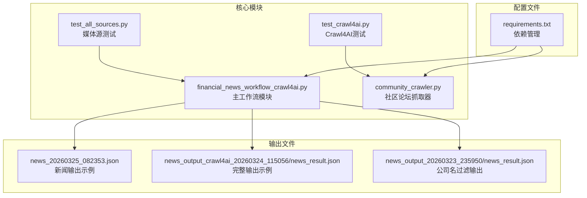
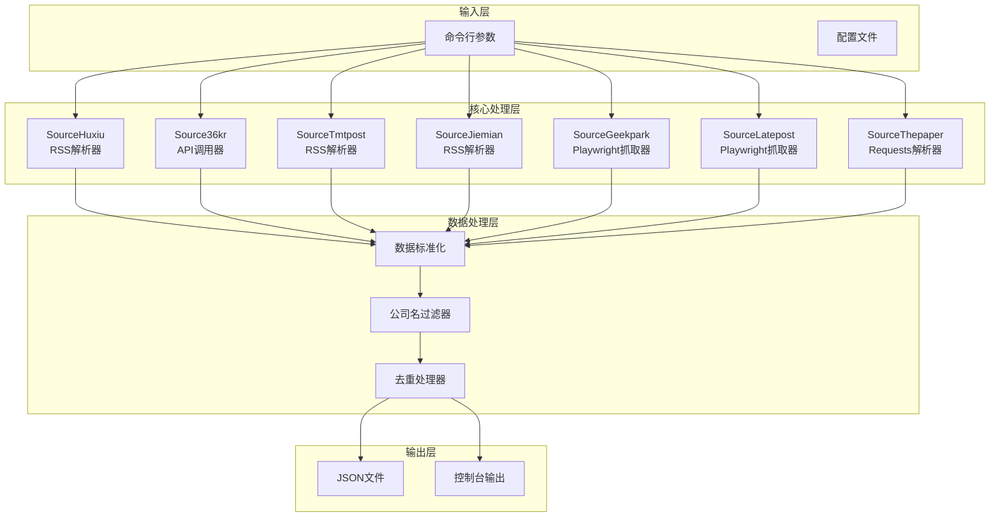
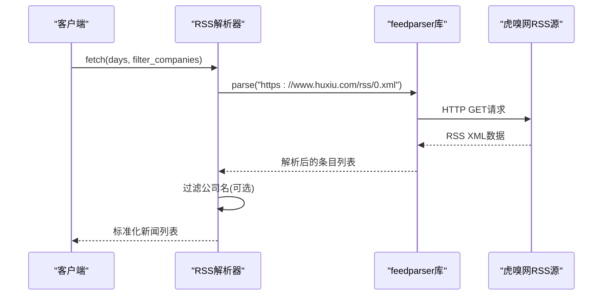
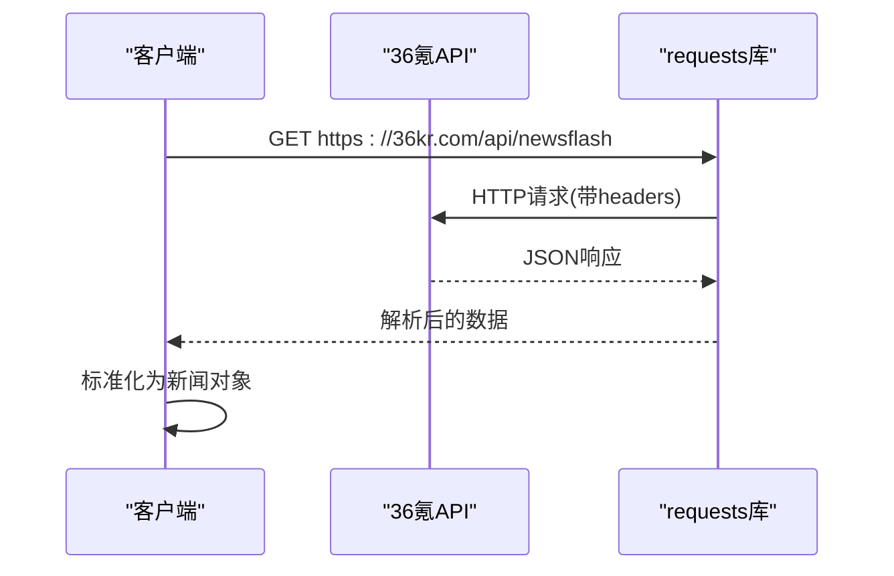
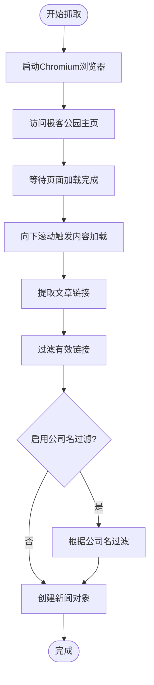
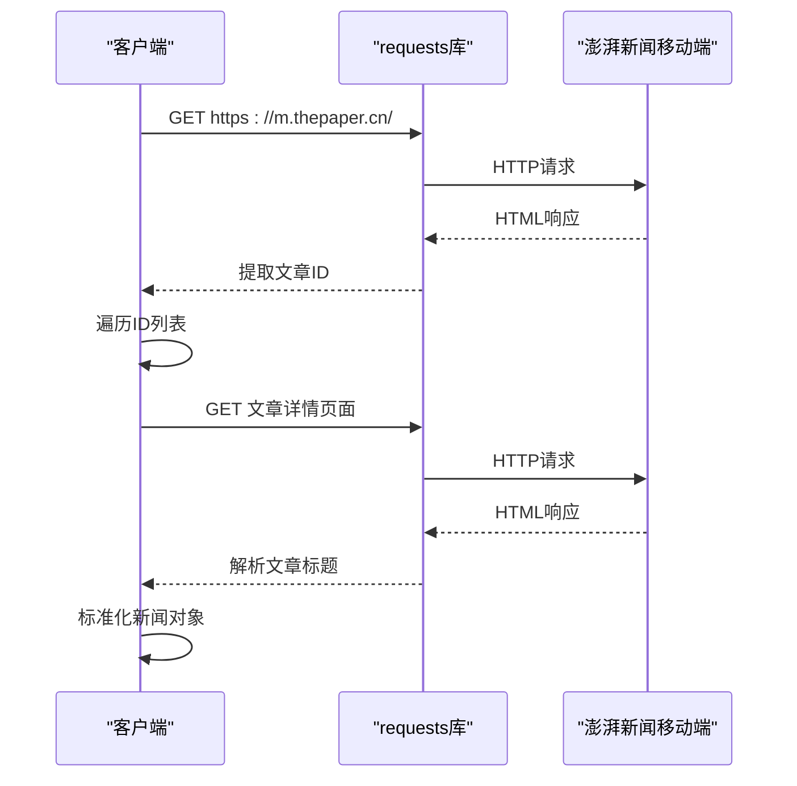
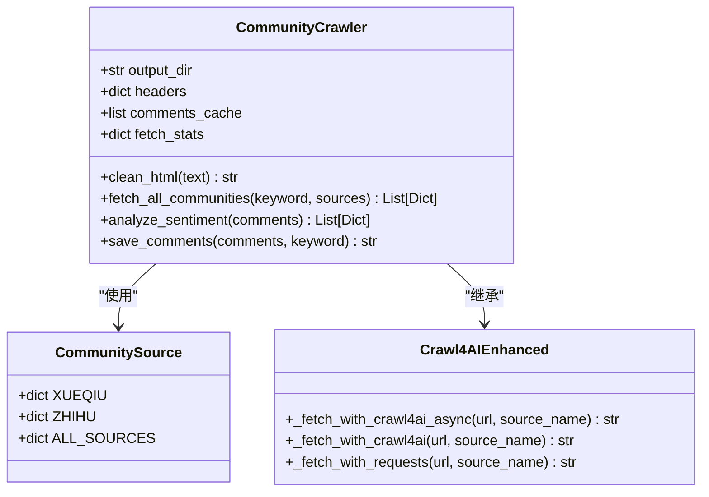
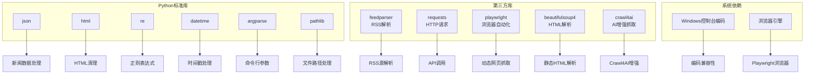

# 自动化新闻采集系统

<cite>
**本文档引用的文件**
- [financial_news_workflow_crawl4ai.py](file://financial_news_workflow_crawl4ai.py)
- [community_crawler.py](file://community_crawler.py)
- [test_all_sources.py](file://test_all_sources.py)
- [requirements.txt](file://requirements.txt)
- [test_crawl4ai.py](file://test_crawl4ai.py)
- [news_20260325_082353.json](file://news_20260325_082353.json)
- [news_output_crawl4ai_20260324_115056/news_result.json](file://news_output_crawl4ai_20260324_115056/news_result.json)
- [news_output_20260323_235950/news_result.json](file://news_output_20260323_235950/news_result.json)
</cite>

## 目录
1. [简介](#简介)
2. [项目结构](#项目结构)
3. [核心组件](#核心组件)
4. [架构概览](#架构概览)
5. [详细组件分析](#详细组件分析)
6. [依赖关系分析](#依赖关系分析)
7. [性能考虑](#性能考虑)
8. [故障排除指南](#故障排除指南)
9. [结论](#结论)
10. [附录](#附录)

## 简介

Redbook系统的自动化新闻采集功能是一个综合性的金融新闻抓取系统，专门针对7大权威财经媒体设计了不同的抓取策略。该系统能够从虎嗅网(RSS)、36氪(API)、钛媒体(RSS)、界面新闻(RSS)、极客公园(Playwright)、晚点(LatePost)、澎湃新闻(requests)等不同类型的媒体源获取新闻内容。

系统采用了多样化的技术手段来应对不同的反爬虫策略和数据结构，包括RSS解析器、API调用、动态网页抓取、静态HTML解析等。通过灵活的配置选项和错误处理机制，确保了新闻采集的稳定性和可靠性。

## 项目结构

**图表来源**
- [financial_news_workflow_crawl4ai.py:1-454](file://financial_news_workflow_crawl4ai.py#L1-L454)
- [community_crawler.py:1-604](file://community_crawler.py#L1-L604)
- [requirements.txt:1-144](file://requirements.txt#L1-L144)

**章节来源**
- [financial_news_workflow_crawl4ai.py:1-454](file://financial_news_workflow_crawl4ai.py#L1-L454)
- [community_crawler.py:1-604](file://community_crawler.py#L1-L604)
- [requirements.txt:1-144](file://requirements.txt#L1-L144)

## 核心组件

### 主要工作流组件

系统的核心是`financial_news_workflow_crawl4ai.py`文件，它包含了7个专门的新闻源类，每个类都针对特定的媒体源设计了相应的抓取策略：

1. **SourceHuxiu** - 虎嗅网(RSS)
2. **Source36kr** - 36氪(API)
3. **SourceTmtpost** - 钛媒体(RSS)
4. **SourceJiemian** - 界面新闻(RSS)
5. **SourceGeekpark** - 极客公园(Playwright)
6. **SourceLatepost** - 晚点(LatePost)
7. **SourceThepaper** - 澎湃新闻(requests)

### 社区论坛抓取组件

`community_crawler.py`提供了社区论坛信息抓取功能，支持雪球网和知乎的评论抓取，采用了Crawl4AI增强技术和传统HTTP抓取相结合的方式。

**章节来源**
- [financial_news_workflow_crawl4ai.py:94-358](file://financial_news_workflow_crawl4ai.py#L94-L358)
- [community_crawler.py:82-436](file://community_crawler.py#L82-L436)

## 架构概览

**图表来源**
- [financial_news_workflow_crawl4ai.py:363-453](file://financial_news_workflow_crawl4ai.py#L363-L453)

## 详细组件分析

### RSS解析器组件

#### 虎嗅网(RSS)解析器
虎嗅网使用RSS协议进行新闻推送，系统通过`feedparser`库解析RSS源：

**图表来源**
- [financial_news_workflow_crawl4ai.py:98-119](file://financial_news_workflow_crawl4ai.py#L98-L119)

#### 钛媒体(RSS)解析器
钛媒体同样采用RSS协议，使用相同的解析策略：

**图表来源**
- [financial_news_workflow_crawl4ai.py:158-183](file://financial_news_workflow_crawl4ai.py#L158-L183)

#### 界面新闻(RSS)解析器
界面新闻提供RSS订阅服务，系统通过RSS源获取最新新闻：

**图表来源**
- [financial_news_workflow_crawl4ai.py:186-212](file://financial_news_workflow_crawl4ai.py#L186-L212)

**章节来源**
- [financial_news_workflow_crawl4ai.py:94-212](file://financial_news_workflow_crawl4ai.py#L94-L212)

### API调用组件

#### 36氪(API)调用器
36氪提供官方API接口，系统通过RESTful API获取快讯数据：

**图表来源**
- [financial_news_workflow_crawl4ai.py:126-155](file://financial_news_workflow_crawl4ai.py#L126-L155)

**章节来源**
- [financial_news_workflow_crawl4ai.py:122-155](file://financial_news_workflow_crawl4ai.py#L122-L155)

### 动态网页抓取组件

#### 极客公园(Playwright)抓取器
极客公园采用JavaScript动态加载，需要使用Playwright进行抓取：

**图表来源**
- [financial_news_workflow_crawl4ai.py:219-263](file://financial_news_workflow_crawl4ai.py#L219-L263)

#### 晚点(LatePost)抓取器
晚点新闻同样采用动态加载，使用Playwright进行内容抓取：

**图表来源**
- [financial_news_workflow_crawl4ai.py:266-318](file://financial_news_workflow_crawl4ai.py#L266-L318)

**章节来源**
- [financial_news_workflow_crawl4ai.py:215-318](file://financial_news_workflow_crawl4ai.py#L215-L318)

### 静态HTML解析组件

#### 澎湃新闻(Requests)解析器
澎湃新闻采用静态HTML结构，系统通过正则表达式提取文章ID：

**图表来源**
- [financial_news_workflow_crawl4ai.py:321-358](file://financial_news_workflow_crawl4ai.py#L321-L358)

**章节来源**
- [financial_news_workflow_crawl4ai.py:321-358](file://financial_news_workflow_crawl4ai.py#L321-L358)

### 社区论坛抓取组件

#### 雪球网和知乎抓取器
社区论坛抓取器支持雪球网和知乎的评论抓取，采用了Crawl4AI增强技术和传统HTTP抓取相结合的方式：

**图表来源**
- [community_crawler.py:82-175](file://community_crawler.py#L82-L175)

**章节来源**
- [community_crawler.py:82-436](file://community_crawler.py#L82-L436)

## 依赖关系分析

### 核心依赖关系

**图表来源**
- [financial_news_workflow_crawl4ai.py:22-58](file://financial_news_workflow_crawl4ai.py#L22-L58)
- [community_crawler.py:32-51](file://community_crawler.py#L32-L51)

### 安装依赖配置

系统使用requirements.txt管理依赖，包含以下主要类别：

1. **核心网络库**: requests, httpx, aiohttp
2. **RSS解析**: feedparser
3. **HTML解析**: beautifulsoup4, lxml, cssselect
4. **增强爬虫**: scrapling, playwright, crawl4ai
5. **数据处理**: orjson, w3lib, tld
6. **辅助工具**: fake-useragent, browserforge, rich

**章节来源**
- [requirements.txt:1-144](file://requirements.txt#L1-L144)

## 性能考虑

### 技术性能优化

1. **并发处理**: 系统支持异步操作，特别是在Crawl4AI增强抓取中
2. **缓存机制**: 使用requests库的会话对象进行连接复用
3. **超时控制**: 为不同类型的请求设置合适的超时时间
4. **内存管理**: 及时清理HTML内容和中间结果

### 网络性能优化

1. **User-Agent轮换**: 使用多样的User-Agent字符串
2. **请求头伪装**: 模拟真实浏览器的请求头
3. **重试机制**: 对失败的请求进行自动重试
4. **连接池**: 复用HTTP连接减少握手开销

### 数据处理性能

1. **批量处理**: 支持批量抓取和处理多个媒体源
2. **去重算法**: 使用集合(set)进行高效的去重操作
3. **内存优化**: 及时释放不需要的中间数据
4. **增量更新**: 支持增量抓取避免重复处理

## 故障排除指南

### 常见问题及解决方案

#### RSS解析失败
- **症状**: RSS源无法解析或返回空数据
- **原因**: 网络连接问题、RSS格式变化、服务器限制
- **解决方案**: 检查网络连接、更新feedparser版本、添加重试机制

#### API调用错误
- **症状**: 36氪API返回错误状态码
- **原因**: API密钥缺失、请求频率过高、服务器维护
- **解决方案**: 验证API配置、降低请求频率、添加错误重试

#### Playwright抓取失败
- **症状**: 动态网页无法正确加载或内容为空
- **原因**: 浏览器驱动问题、页面加载超时、反爬虫机制
- **解决方案**: 安装正确的浏览器驱动、增加等待时间、使用代理

#### HTML解析异常
- **症状**: BeautifulSoup解析失败或提取内容不完整
- **原因**: 页面结构变化、编码问题、选择器失效
- **解决方案**: 更新CSS选择器、检查页面编码、添加异常处理

### 调试和监控

系统提供了完善的错误处理和调试功能：

1. **详细日志**: 每个媒体源的抓取过程都有详细日志
2. **状态统计**: 记录每个媒体源的抓取成功率
3. **异常捕获**: 捕获并记录所有异常信息
4. **重试机制**: 对失败的操作进行自动重试

**章节来源**
- [financial_news_workflow_crawl4ai.py:117-119](file://financial_news_workflow_crawl4ai.py#L117-L119)
- [financial_news_workflow_crawl4ai.py:154-155](file://financial_news_workflow_crawl4ai.py#L154-L155)
- [financial_news_workflow_crawl4ai.py:262-263](file://financial_news_workflow_crawl4ai.py#L262-L263)

## 结论

Redbook系统的自动化新闻采集功能展现了现代网络爬虫技术的综合应用。通过针对不同媒体源的特点设计专门的抓取策略，系统能够在保证数据质量的同时提高抓取效率。

系统的主要优势包括：

1. **技术多样性**: 同时支持RSS、API、动态网页、静态HTML等多种抓取方式
2. **反爬虫应对**: 采用多种技术手段应对不同媒体源的反爬虫策略
3. **错误处理**: 完善的异常处理和重试机制确保系统稳定性
4. **性能优化**: 通过并发处理和缓存机制提高抓取效率
5. **可扩展性**: 模块化设计便于添加新的媒体源

未来可以考虑的改进方向包括：增加更多的媒体源支持、优化反爬虫策略、增强数据分析功能、提供更丰富的配置选项等。

## 附录

### 配置选项说明

系统支持以下主要配置选项：

- **--days**: 抓取近X天的新闻，默认3天
- **--sources**: 指定要抓取的媒体源，逗号分隔，默认"all"
- **--output**: 输出目录，默认当前目录
- **--filter-companies**: 是否启用公司名过滤，默认关闭

### 输出格式说明

系统输出的JSON文件包含以下字段：

- **fetch_time**: 抓取时间戳
- **total**: 新闻总数
- **by_source**: 各媒体源的新闻数量统计
- **news**: 实际的新闻数据列表
- **company**: 公司名过滤时的公司名称

### 测试和验证

系统提供了完整的测试套件：

1. **媒体源测试**: `test_all_sources.py` - 测试7大媒体源的连通性
2. **Crawl4AI测试**: `test_crawl4ai.py` - 验证Crawl4AI库的功能
3. **输出验证**: 多个JSON输出文件用于验证数据格式

**章节来源**
- [financial_news_workflow_crawl4ai.py:405-453](file://financial_news_workflow_crawl4ai.py#L405-L453)
- [test_all_sources.py:18-48](file://test_all_sources.py#L18-L48)
- [test_crawl4ai.py:1-163](file://test_crawl4ai.py#L1-L163)