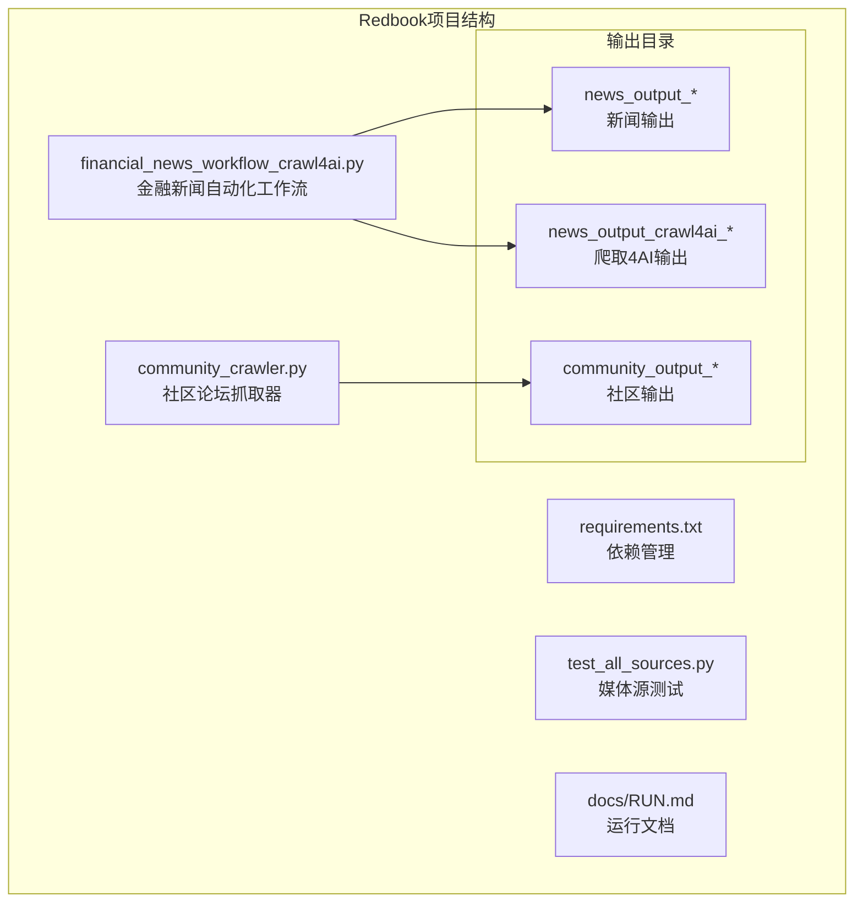
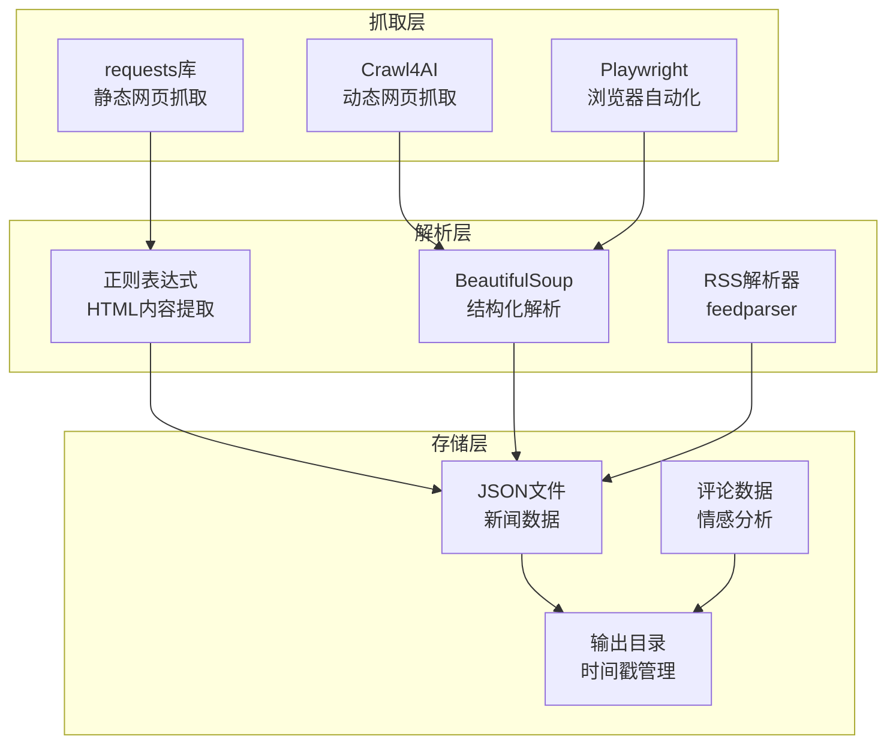
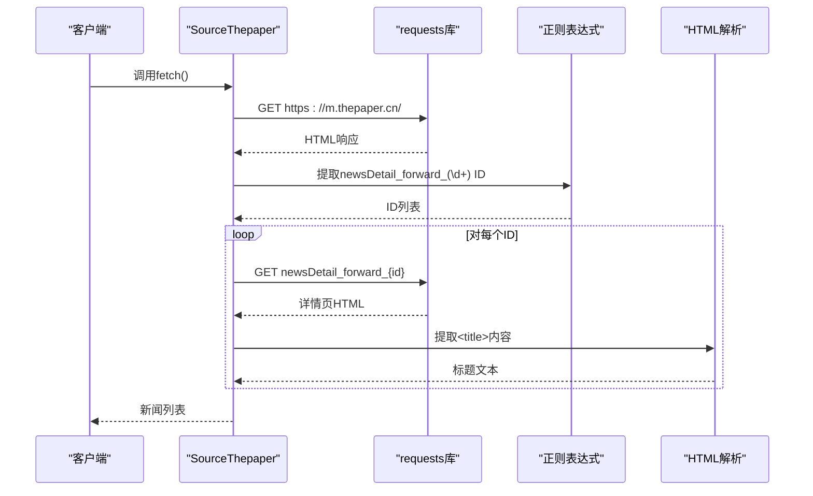
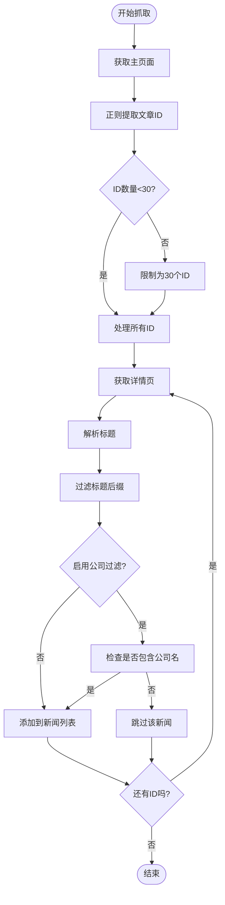
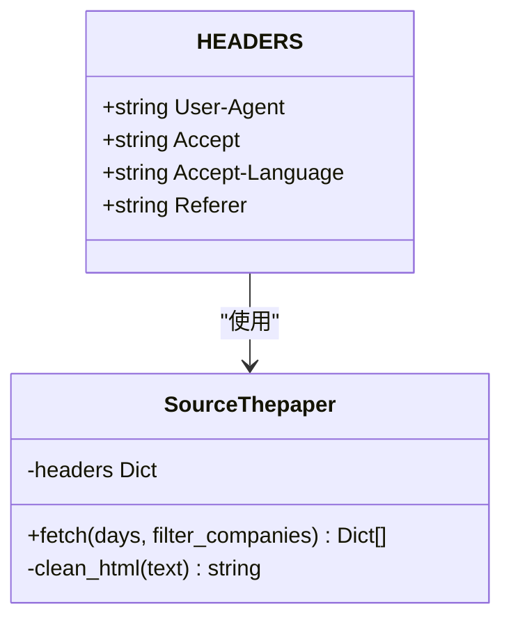
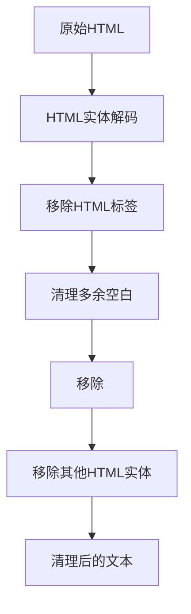
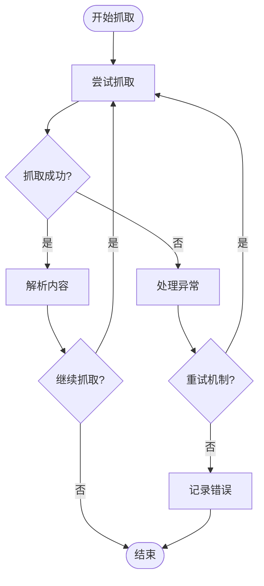
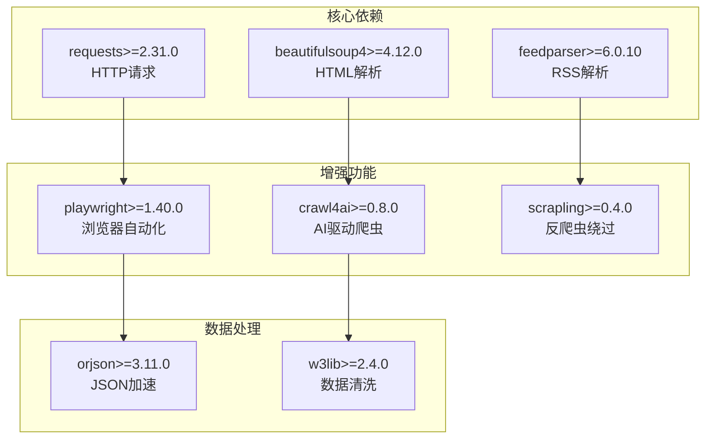
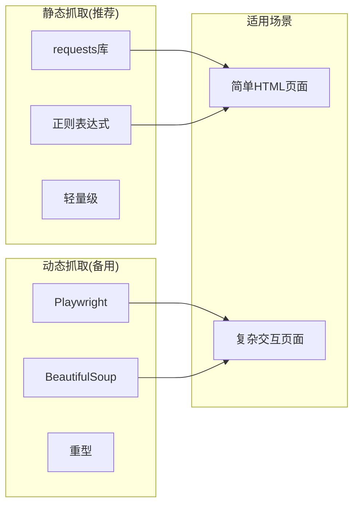
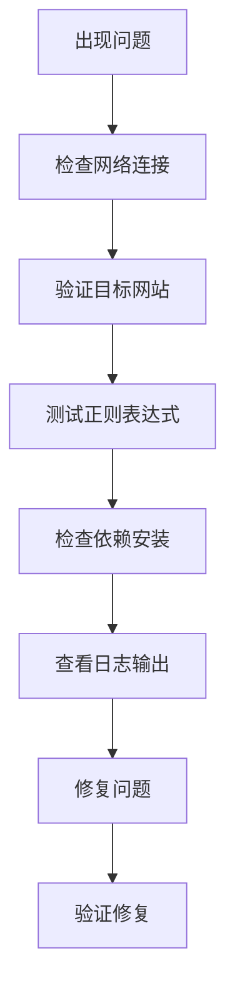

# 静态网页抓取

<cite>
**本文引用的文件**
- [financial_news_workflow_crawl4ai.py](file://financial_news_workflow_crawl4ai.py)
- [community_crawler.py](file://community_crawler.py)
- [requirements.txt](file://requirements.txt)
- [test_all_sources.py](file://test_all_sources.py)
- [docs/RUN.md](file://docs/RUN.md)
- [news_output_crawl4ai_20260325_142309/news_result.json](file://news_output_crawl4ai_20260325_142309/news_result.json)
- [news_output_20260323_235950/news_result.json](file://news_output_20260323_235950/news_result.json)
- [news_output_crawl4ai_20260324_103448/prompt.txt](file://news_output_crawl4ai_20260324_103448/prompt.txt)
</cite>

## 目录
1. [简介](#简介)
2. [项目结构](#项目结构)
3. [核心组件](#核心组件)
4. [架构概览](#架构概览)
5. [详细组件分析](#详细组件分析)
6. [依赖分析](#依赖分析)
7. [性能考虑](#性能考虑)
8. [故障排除指南](#故障排除指南)
9. [结论](#结论)
10. [附录](#附录)

## 简介
本文档详细解释Redbook系统中澎湃新闻的静态网页抓取功能，重点分析requests库的使用、HTML页面下载、BeautifulSoup解析和正则表达式匹配。文档涵盖静态抓取的数据提取方法、页面结构分析、内容过滤规则和错误处理机制，并对比静态抓取与动态抓取的特点，提供请求头配置、页面解析技巧、内容提取策略和性能优化建议。

## 项目结构
Redbook项目采用模块化设计，包含金融新闻自动化工作流和社区论坛抓取两个主要功能模块。项目结构清晰，便于扩展和维护。

**图表来源**
- [financial_news_workflow_crawl4ai.py:1-454](file://financial_news_workflow_crawl4ai.py#L1-L454)
- [community_crawler.py:1-604](file://community_crawler.py#L1-L604)

**章节来源**
- [financial_news_workflow_crawl4ai.py:1-454](file://financial_news_workflow_crawl4ai.py#L1-L454)
- [community_crawler.py:1-604](file://community_crawler.py#L1-L604)
- [requirements.txt:1-144](file://requirements.txt#L1-L144)

## 核心组件
项目包含两个核心组件：金融新闻自动化工作流和社区论坛抓取器。

### 金融新闻自动化工作流
负责从7大权威媒体抓取热点新闻，支持RSS、API和requests三种抓取方式。

### 社区论坛抓取器
专门抓取雪球网和知乎的用户评论和讨论，支持Crawl4AI增强抓取和传统HTTP抓取。

**章节来源**
- [financial_news_workflow_crawl4ai.py:92-454](file://financial_news_workflow_crawl4ai.py#L92-L454)
- [community_crawler.py:80-604](file://community_crawler.py#L80-L604)

## 架构概览
系统采用分层架构设计，包含抓取层、解析层和存储层。

**图表来源**
- [financial_news_workflow_crawl4ai.py:321-359](file://financial_news_workflow_crawl4ai.py#L321-L359)
- [community_crawler.py:127-194](file://community_crawler.py#L127-L194)

## 详细组件分析

### 澎湃新闻静态抓取实现

#### 抓取流程分析
澎湃新闻采用requests库进行静态网页抓取，通过正则表达式提取文章ID，然后批量抓取详情页。

**图表来源**
- [financial_news_workflow_crawl4ai.py:321-359](file://financial_news_workflow_crawl4ai.py#L321-L359)

#### 关键实现要点
1. **请求头配置**：使用标准的User-Agent和Accept头模拟浏览器访问
2. **正则表达式匹配**：使用`re.findall(r'newsDetail_forward_(\d+)', html)`提取文章ID
3. **HTML解析**：通过`re.search(r'<title>([^<]+)</title>', r.text)`提取标题
4. **内容过滤**：移除'_澎湃新闻'后缀，确保标题纯净

#### 数据提取策略

**图表来源**
- [financial_news_workflow_crawl4ai.py:325-358](file://financial_news_workflow_crawl4ai.py#L325-L358)

**章节来源**
- [financial_news_workflow_crawl4ai.py:321-359](file://financial_news_workflow_crawl4ai.py#L321-L359)

### 请求头配置详解

#### 标准请求头设置

**图表来源**
- [financial_news_workflow_crawl4ai.py:86-89](file://financial_news_workflow_crawl4ai.py#L86-L89)
- [financial_news_workflow_crawl4ai.py:325-326](file://financial_news_workflow_crawl4ai.py#L325-L326)

#### 请求头字段说明
- **User-Agent**：模拟Chrome浏览器访问，提高成功率
- **Accept**：接受HTML、XML等格式响应
- **Accept-Language**：指定语言偏好
- **Referer**：模拟从Google搜索跳转

**章节来源**
- [financial_news_workflow_crawl4ai.py:86-89](file://financial_news_workflow_crawl4ai.py#L86-L89)

### 页面解析技巧

#### 正则表达式匹配策略
1. **ID提取**：`r'newsDetail_forward_(\d+)'` - 提取文章ID
2. **标题解析**：`r'<title>([^<]+)</title>'` - 提取页面标题
3. **内容过滤**：`r'_澎湃新闻'` - 移除标题后缀

#### HTML内容清理

**图表来源**
- [community_crawler.py:104-124](file://community_crawler.py#L104-L124)

**章节来源**
- [community_crawler.py:104-124](file://community_crawler.py#L104-L124)

### 错误处理机制

#### 异常处理策略

**图表来源**
- [financial_news_workflow_crawl4ai.py:330-358](file://financial_news_workflow_crawl4ai.py#L330-L358)

#### 错误类型分类
1. **网络异常**：超时、连接失败
2. **解析异常**：正则匹配失败、HTML结构变化
3. **业务异常**：公司名过滤不匹配

**章节来源**
- [financial_news_workflow_crawl4ai.py:330-358](file://financial_news_workflow_crawl4ai.py#L330-L358)

## 依赖分析

### 核心依赖关系
项目采用模块化依赖管理，核心依赖包括requests、beautifulsoup4、feedparser等。

**图表来源**
- [requirements.txt:6-18](file://requirements.txt#L6-L18)
- [requirements.txt:23-35](file://requirements.txt#L23-L35)

### 模块间耦合分析
- **低耦合设计**：各媒体源独立实现，便于扩展新源
- **接口统一**：所有媒体源实现相同的fetch方法接口
- **可选依赖**：BeautifulSoup、Crawl4AI等作为可选功能

**章节来源**
- [requirements.txt:1-144](file://requirements.txt#L1-L144)

## 性能考虑

### 静态抓取的优势
1. **实现简单**：基于requests库，代码简洁易懂
2. **资源消耗低**：不需要浏览器实例，内存占用小
3. **速度快**：直接HTTP请求，响应时间短
4. **稳定性高**：不受JavaScript渲染影响

### 性能优化建议
1. **并发控制**：限制同时抓取的源数量，避免被限流
2. **缓存策略**：对重复访问的页面进行缓存
3. **超时设置**：合理设置请求超时时间
4. **重试机制**：对失败的请求进行有限重试

### 资源使用对比

## 故障排除指南

### 常见问题诊断
1. **抓取失败**：检查网络连接和目标网站可用性
2. **解析错误**：确认正则表达式是否匹配当前页面结构
3. **依赖缺失**：安装相应的Python包依赖

### 调试方法

**图表来源**
- [docs/RUN.md:144-188](file://docs/RUN.md#L144-L188)

### 错误处理最佳实践
1. **异常捕获**：对所有网络操作进行异常处理
2. **日志记录**：详细记录抓取过程和错误信息
3. **重试机制**：实现指数退避的重试策略
4. **降级方案**：当高级功能不可用时使用基础功能

**章节来源**
- [docs/RUN.md:144-188](file://docs/RUN.md#L144-L188)

## 结论
Redbook系统的静态网页抓取功能通过requests库实现了高效、稳定的新闻抓取。澎湃新闻的实现展示了静态抓取在简单HTML页面上的优势：实现简单、资源消耗低、性能稳定。通过正则表达式和BeautifulSoup的结合使用，系统能够准确提取所需信息并进行有效的数据清理。建议在实际使用中重点关注请求头配置、正则表达式维护和错误处理机制，以确保抓取功能的稳定性和可靠性。

## 附录

### 实际运行示例
系统提供了丰富的输出示例，展示抓取结果的结构和格式。

**章节来源**
- [news_output_crawl4ai_20260325_142309/news_result.json:1-61](file://news_output_crawl4ai_20260325_142309/news_result.json#L1-L61)
- [news_output_20260323_235950/news_result.json:1-168](file://news_output_20260323_235950/news_result.json#L1-L168)

### 测试用例
系统包含完整的测试用例，验证各媒体源的连通性和基本功能。

**章节来源**
- [test_all_sources.py:18-49](file://test_all_sources.py#L18-L49)